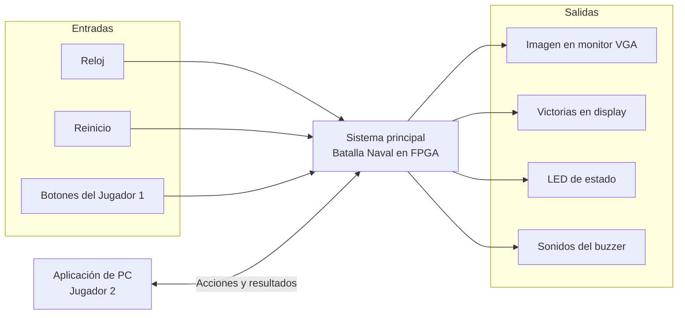

# Nivel 1

## Diagrama de primer nivel

## Objetivos

- Implementar una partida de Batalla Naval para dos jugadores con tableros independientes de 8 × 8 y barcos de 4, 3 y 2 casillas.
- Permitir que el Jugador 1 interactúe con la FPGA y que el Jugador 2 lo haga mediante una aplicación de PC.
- Mantener las reglas y los tableros bajo el control del programa ensamblador ejecutado por el procesador de la FPGA.
- Mostrar a cada jugador únicamente la información que le corresponde conocer.

## Descripciones

### Entradas

1. **Reloj:** referencia temporal para el sistema.
2. **Reinicio:** inicia otra partida; las victorias acumuladas se conservan hasta el reinicio general.
3. **Botones:** permiten al Jugador 1 navegar, orientar y colocar barcos, y seleccionar disparos.
4. **Aplicación de PC:** envía las colocaciones y disparos elegidos por el Jugador 2.

### Salidas

1. **Monitor VGA:** muestra al Jugador 1 sus barcos, los resultados conocidos sobre el rival y la fase del juego.
2. **Aplicación de PC:** presenta al Jugador 2 su tablero, los resultados de sus disparos y el estado de la partida.
3. **Display de siete segmentos:** presenta las partidas ganadas por ambos jugadores.
4. **LED de estado y buzzer:** indican la fase del juego y dan avisos sonoros según el evento.

Cada jugador coloca sus barcos antes de la batalla. Después, el sistema alterna los turnos, valida los disparos y determina cuándo se hunde una flota. En este nivel se muestran las relaciones con los jugadores y dispositivos externos; la organización interna de la FPGA se desarrolla en el nivel 2.
