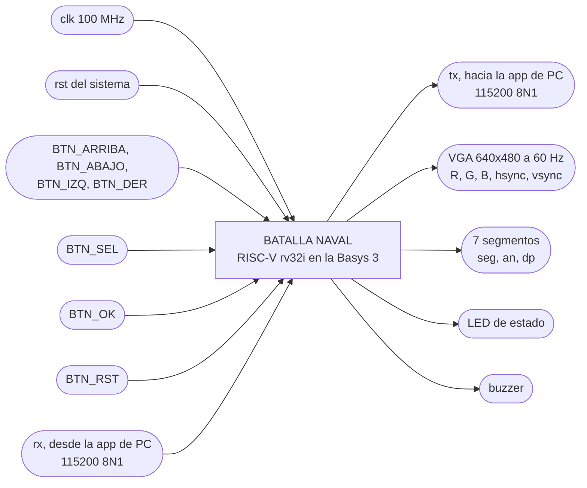

# Nivel 1

## Diagrama de primer nivel

## Objetivo

Correr una partida de Batalla Naval entre dos jugadores sobre un procesador rv32i diseñado por el
equipo. El Jugador 1 juega en la FPGA con el monitor VGA y los botones, y el Jugador 2 juega desde
la app de PC por UART. Toda la lógica de la partida vive en el programa en ensamblador, el hardware
solo pone los recursos de entrada y salida (sección 4.1 del enunciado).

## Entradas

- `clk`, reloj de 100 MHz de la Basys 3, pin W5. Es el único reloj que entra al sistema.
- `rst`, reinicio general del hardware. TODO: Revisar de dónde sale, el enunciado habla de un "reinicio general del sistema" que borra los contadores de ganadas y no dice qué lo dispara.
- `BTN_ARRIBA`, `BTN_ABAJO`, `BTN_IZQ`, `BTN_DER`, navegación del cursor del Jugador 1.
- `BTN_SEL`, rota la orientación del barco que se está colocando.
- `BTN_OK`, confirma una colocación o un disparo.
- `BTN_RST`, botón central, reinicia la partida y conserva los contadores de ganadas. Lo lee el programa, no reinicia el hardware.
- `rx`, línea serial que llega desde la app de PC por el puente USB-UART, pin B18.

La Basys 3 trae cinco botones y el enunciado pide siete. TODO: Revisar a qué entradas físicas van `BTN_SEL` y `BTN_OK` (switches o un Pmod de botones).

## Salidas

- `tx`, línea serial hacia la app de PC por el puente USB-UART, pin A18.
- `vgaRed[3:0]`, `vgaGreen[3:0]`, `vgaBlue[3:0]`, `Hsync`, `Vsync`, conector VGA de la Basys 3.
- `seg[6:0]`, `an[3:0]`, `dp`, los cuatro dígitos de 7 segmentos con las partidas ganadas por cada jugador.
- LED de estado, distingue colocación, batalla y resultado.
- `buzzer`, onda cuadrada para los cinco sonidos del enunciado. TODO: Revisar en qué pin del Pmod queda.

## Explicación general

Al arrancar, el procesador ejecuta el programa desde la dirección `0x0000_0000`. El programa limpia la
pantalla y los tableros en RAM, avisa por `tx` que empieza la colocación y entra al lazo principal.

En la colocación los dos jugadores avanzan a la vez. El lazo sondea los botones del Jugador 1 y los
bytes que entran por `rx` sin quedarse esperando a ninguno, así que el Jugador 1 mueve su cursor en el
VGA mientras el Jugador 2 manda sus barcos desde la PC. Cada colocación del Jugador 2 recibe por `tx`
una respuesta de aceptada o rechazada.

Cuando los dos terminan, arranca la batalla. El turno se alterna tras cada disparo válido y cada
resultado se refleja en el VGA, en el buzzer y en un mensaje por `tx`. La partida acaba cuando una
flota queda hundida. El resultado se muestra en el VGA y se manda un resumen por `tx`, suena la
secuencia de victoria y se suma una partida ganada en los 7 segmentos. El sistema se queda así hasta
que se presione `BTN_RST`.

Por `tx` nunca sale nada del tablero del Jugador 1 aparte del resultado de los disparos del Jugador 2.
El VGA tampoco dibuja los barcos del Jugador 2. Así ninguno de los dos jugadores puede ver la flota
del otro.
