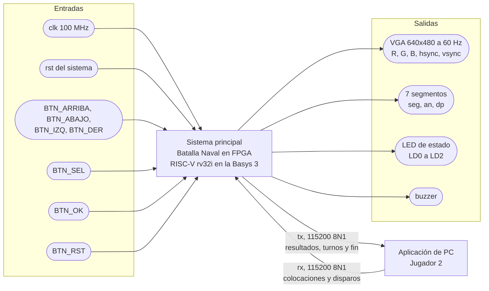

# Nivel 1

## Diagrama de primer nivel

## Objetivos

- Implementar una partida de Batalla Naval para dos jugadores con tableros independientes de 8 × 8 y barcos de 4, 3 y 2 casillas.
- Permitir que el Jugador 1 interactúe con la FPGA y que el Jugador 2 lo haga mediante una aplicación de PC.
- Mantener las reglas y los tableros bajo el control del programa ensamblador ejecutado por el procesador de la FPGA.
- Mostrar a cada jugador únicamente la información que le corresponde conocer.

## Descripciones

### Entradas

- `clk`, reloj de 100 MHz de la Basys 3, pin W5. Es el único reloj que entra al sistema.
- `rst`, reinicio general del hardware. Pone en cero las partidas ganadas. TODO: Revisar de dónde sale, el enunciado habla de un "reinicio general del sistema" que borra los contadores de ganadas y no dice qué lo dispara.
- `BTN_ARRIBA`, `BTN_ABAJO`, `BTN_IZQ`, `BTN_DER`, navegación del cursor del Jugador 1, en `btnU`, `btnD`, `btnL` y `btnR` de la Basys 3.
- `BTN_SEL`, rota la orientación del barco que se está colocando, en JC3 del Pmod JC.
- `BTN_OK`, confirma una colocación o un disparo, en JC4 del Pmod JC.
- `BTN_RST`, en `btnC`. Reinicia la partida y conserva los contadores de ganadas. Lo lee el programa, no reinicia el hardware.
- `rx`, línea serial que llega desde la aplicación de PC por el puente USB-UART, pin B18. Trae las colocaciones y los disparos del Jugador 2.

La Basys 3 trae cinco botones y el enunciado pide siete, por eso `BTN_SEL` y `BTN_OK` van en el Pmod JC, igual que en el Proyecto 2.

### Salidas

- `tx`, línea serial hacia la aplicación de PC por el puente USB-UART, pin A18. Lleva la respuesta a cada colocación, los turnos, los resultados de los disparos y el resumen final.
- `vgaRed[3:0]`, `vgaGreen[3:0]`, `vgaBlue[3:0]`, `Hsync`, `Vsync`, conector VGA de la Basys 3. Muestra al Jugador 1 sus barcos, los resultados conocidos sobre el rival y la fase del juego.
- `seg[6:0]`, `an[3:0]`, `dp`, los cuatro dígitos de 7 segmentos con las partidas ganadas por cada jugador.
- `led[2:0]`, LD0 a LD2, un LED por fase, colocación, batalla y resultado.
- `buzzer`, onda cuadrada para los cinco sonidos del enunciado, en JC2 del Pmod JC.

La aplicación de PC es un elemento externo. Presenta al Jugador 2 su tablero, los resultados de sus disparos y el estado de la partida, sin reglas propias.

### Funcionamiento general

Al arrancar, el procesador ejecuta el programa desde la dirección `0x0000_0000`. El programa limpia la pantalla y los tableros en RAM, avisa por `tx` que empieza la colocación y entra al lazo principal.

En la colocación los dos jugadores avanzan a la vez. El lazo sondea los botones del Jugador 1 y los bytes que entran por `rx` sin quedarse esperando a ninguno, así que el Jugador 1 mueve su cursor en el VGA mientras el Jugador 2 manda sus barcos desde la PC. Cada colocación del Jugador 2 recibe por `tx` una respuesta de aceptada o rechazada.

Cuando los dos terminan, arranca la batalla. El turno se alterna tras cada disparo válido y cada resultado se refleja en el VGA, en el buzzer y en un mensaje por `tx`. La partida acaba cuando una flota queda hundida. El resultado se muestra en el VGA y se manda un resumen por `tx`, suena la secuencia de victoria y se suma una partida ganada en los 7 segmentos. El sistema se queda así hasta que se presione `BTN_RST`.

Por `tx` nunca sale nada del tablero del Jugador 1 aparte del resultado de los disparos del Jugador 2. El VGA tampoco dibuja los barcos del Jugador 2. Así ninguno de los dos jugadores puede ver la flota del otro.

En este nivel se muestran las relaciones con los jugadores y dispositivos externos. La organización interna de la FPGA se desarrolla en el nivel 2.
