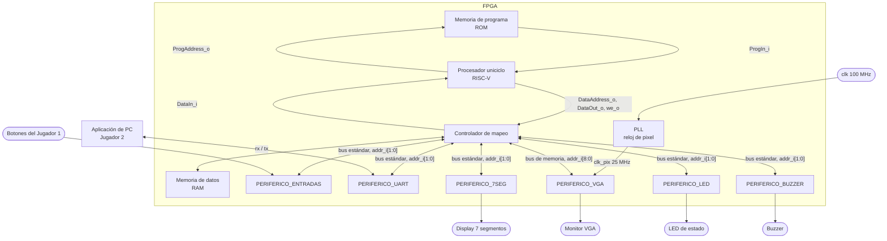

# Nivel 2

## Diagrama de segundo nivel

## Objetivos

- Subdividir el sistema del nivel 1 en sus bloques principales, agrupando dentro de la FPGA el procesador, las memorias y los periféricos.
- Distinguir el camino de instrucciones entre ROM y procesador del camino de datos que pasa por el controlador de mapeo.
- Mostrar que la aplicación de PC es externa a la FPGA y se comunica exclusivamente mediante UART.

## Descripciones

`clk_i` de 100 MHz y `rst_i` llegan a todos los bloques, pero se omiten sus líneas repetidas para mantener legible el diagrama.

### Bloque 1: PLL

Saca el reloj de pixel de 25 MHz que pide el VGA a partir del único reloj de 100 MHz. Con openXC7 no hay asistente para generarlo, así que la primitiva se instancia a mano. El enunciado también deja abierta la opción de sacar del PLL un reloj para la UART, pero no hace falta, `PERIFERICO_UART` corre directo con los 100 MHz y saca los 115200 baudios con contadores internos. TODO: Revisar si se usa `PLLE2_BASE` o `MMCME2_BASE`.

- Entradas, `clk` de 100 MHz del pin W5.
- Salidas, `clk_pix` de 25 MHz hacia `PERIFERICO_VGA`.

### Bloque 2: Procesador uniciclo

Ejecuta el programa ensamblador que organiza las colocaciones, los turnos, los disparos y el resultado. Solicita instrucciones a la ROM y lee o escribe RAM y periféricos mediante el controlador de mapeo. Para el procesador la RAM y los periféricos son lo mismo, direcciones a las que se les hace `lw` o `sw`, por eso no necesita instrucciones de entrada y salida. La lógica de las reglas reside en el programa, no en los periféricos.

- Entradas, `clk_i`, `rst_i`, `ProgIn_i[31:0]` desde la ROM y `DataIn_i[31:0]` desde el controlador de mapeo.
- Salidas, `ProgAddress_o[31:0]` hacia la ROM, y `DataAddress_o[31:0]`, `DataOut_o[31:0]` y `we_o` hacia el controlador de mapeo.

### Bloque 3: Memoria de programa (ROM)

Guarda las instrucciones del programa. Ocupa `0x0000_0000` a `0x0000_1FFF`, 8 KB, y el vector de reset está en `0x0000_0000`, así que el programa empieza en la primera palabra. Su camino es independiente del acceso a los datos.

- Entradas, `ProgAddress_o[31:0]` del procesador.
- Salidas, `ProgIn_i[31:0]` hacia el procesador.

### Bloque 4: Memoria de datos (RAM)

Guarda los tableros, el turno, el progreso de colocación, los contadores de la partida y la pila. Ocupa `0x0000_2000` a `0x0000_2FFF`, 4 KB. El procesador accede a ella a través del controlador de mapeo, y la organización de los datos adentro está en el nivel 3.

- Entradas, dirección, dato de escritura y habilitación de escritura desde el controlador de mapeo.
- Salidas, dato leído hacia el multiplexor de lectura del controlador de mapeo.

### Bloque 5: Controlador de mapeo

Decodifica las direcciones de datos, selecciona RAM o el periférico correspondiente y devuelve al procesador el dato leído. Deja pasar `we_o` solo hacia el destino de la dirección, y su multiplexor de lectura elige cuál `rdata_o` sube a `DataIn_i`. A los periféricos de registros les llega `DataAddress_o[3:2]` como `addr_i[1:0]`, porque sus registros van de 4 en 4 bytes. No interviene en la conexión independiente con la ROM. Su parte de decodificación es el Address Translator, detallado en [`Address_Translator.md`](../modulos/Address_Translator.md).

- Entradas, `DataAddress_o[31:0]`, `DataOut_o[31:0]` y `we_o` del procesador, y el `rdata_o[31:0]` de cada periférico junto con el dato leído de la RAM.
- Salidas, `write_enable_i`, `addr_i` y `wdata_i[31:0]` hacia cada periférico y las señales equivalentes hacia la RAM, y `DataIn_i[31:0]` hacia el procesador.

### Bloque 6: PERIFERICO_ENTRADAS

Registra los siete botones del Jugador 1 y expone su estado al procesador en un registro de lectura en `0x0001_0120`. El programa interpreta la navegación, la selección, la confirmación y el reinicio, y saca los flancos comparando con la lectura anterior.

- Entradas, bus estándar y los siete botones del Jugador 1.
- Salidas, `rdata_o[31:0]` hacia el multiplexor de lectura.

### Bloque 7: PERIFERICO_UART

Mueve bytes entre el programa y la aplicación de PC, y es el único canal que tiene el Jugador 2 con la partida. Es el periférico del Proyecto 2 que pide reutilizar la sección 4.5.3 del enunciado, con el mapa de registros de la tabla 4.4.3, control en `0x0001_0040`, datos de transmisión en `0x0001_0044` y datos de recepción en `0x0001_0048`. No entiende las tramas del juego. Manda el byte que el programa escribe y avisa con una bandera cuando llega uno. Armar y validar las tramas es trabajo del programa. El detalle está en [`PERIFERICO_UART.md`](../modulos/PERIFERICO_UART.md).

- Entradas, bus estándar y `rx_i` desde el pin B18.
- Salidas, `rdata_o[31:0]` hacia el multiplexor de lectura y `tx_o` hacia el pin A18.

### Bloque 8: PERIFERICO_VGA

Lee su mapa de casillas para generar la imagen del Jugador 1 a 640 × 480 a 60 Hz. Se expone como una memoria de video en `0x0001_1000` a `0x0001_17FF`, una palabra por casilla de la cuadrícula. El procesador escribe por el reloj del sistema y la lógica de video lee por el reloj de pixel. El periférico genera los sincronismos y la imagen, sin aplicar reglas del juego. El detalle está en [`PERIFERICO_VGA.md`](../modulos/PERIFERICO_VGA.md).

- Entradas, bus de memoria con `addr_i[8:0]`, y `clk_pix` del PLL.
- Salidas, `rdata_o[31:0]` hacia el multiplexor de lectura, y `vgaRed[3:0]`, `vgaGreen[3:0]`, `vgaBlue[3:0]`, `Hsync` y `Vsync`.

### Bloque 9: PERIFERICO_7SEG

Presenta las victorias acumuladas de ambos jugadores, dos dígitos para cada uno, de 00 a 99. El programa lleva los contadores en BCD y los escribe en `0x0001_0130`. El periférico solo guarda lo escrito y hace el barrido de los dígitos.

- Entradas, bus estándar.
- Salidas, `rdata_o[31:0]` hacia el multiplexor de lectura, y `seg[6:0]`, `an[3:0]` y `dp`.

### Bloque 10: PERIFERICO_LED

Distingue colocación, batalla y resultado con un LED por fase. El programa escribe el patrón en `0x0001_0138` cada vez que cambia de fase.

- Entradas, bus estándar.
- Salidas, `rdata_o[31:0]` hacia el multiplexor de lectura, y `led[2:0]`.

### Bloque 11: PERIFERICO_BUZZER

Genera los sonidos de colocación inválida, impacto, fallo, barco hundido y victoria. El programa escribe el código del evento en `0x0001_0140` y el periférico produce la señal sonora.

- Entradas, bus estándar.
- Salidas, `rdata_o[31:0]` hacia el multiplexor de lectura, y `buzzer`.

### Elemento externo: Aplicación de PC

Permite al Jugador 2 elegir acciones y ver sus tableros, turno y resultados. Se comunica con la FPGA por UART y no decide reglas ni recibe ubicaciones ocultas del Jugador 1.

### Interfaz principal

- **ROM ↔ procesador.** `ProgAddress_o` y `ProgIn_i` son los nombres indicados en el enunciado.
- **Procesador ↔ controlador.** `DataAddress_o`, `DataOut_o`, `we_o` y `DataIn_i` son los nombres indicados en el enunciado.
- **Controlador ↔ periféricos de registros.** Bus estándar de la sección 4.5.5, `clk_i`, `rst_i`, `write_enable_i`, `addr_i[1:0]`, `wdata_i[31:0]` y `rdata_o[31:0]`.
- **Controlador ↔ VGA.** El mismo bus pero con `addr_i[8:0]`, porque el VGA se comporta como memoria.
- **UART ↔ aplicación de PC.** Enlace serial bidireccional a 115200 baudios, la PC actúa como interfaz del Jugador 2.

## Funcionamiento general

Todo gira alrededor del procesador. Toma instrucciones de la ROM por su bus de programa y usa el bus de datos para todo lo demás. Cada `lw` o `sw` pasa por el controlador de mapeo, que decide por la dirección si el acceso va a la RAM o a un periférico. Así el mismo par de instrucciones sirve para leer un tablero en RAM, pintar una casilla en el VGA o mandar un byte por la UART.

Ningún periférico decide nada del juego. El de entradas dice qué botón está presionado, el de la UART dice que llegó un byte, y el programa decide qué significan. En sentido contrario, el programa escribe un color en la memoria de video, un número en los 7 segmentos o un byte en la UART, y cada periférico se encarga de la parte física, sea temporización, multiplexado o formación del bit serie.

Como ningún acceso detiene al procesador, el lazo principal puede sondear botones y UART en la misma vuelta. En eso se apoya la colocación concurrente de los dos jugadores.
