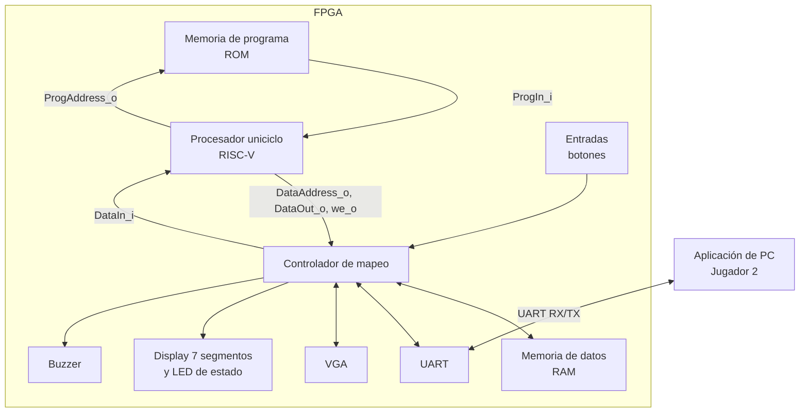

# Nivel 2

## Diagrama de segundo nivel

## Descripciones

### Procesador uniciclo

Ejecuta el programa ensamblador que organiza las colocaciones, los turnos, los disparos y el resultado. Solicita instrucciones a la ROM y lee o escribe RAM y periféricos mediante el controlador de mapeo. La lógica de las reglas reside en el programa, no en los periféricos.

### Memoria de programa (ROM)

Guarda las instrucciones del programa. Recibe `ProgAddress_o` del procesador y le entrega la instrucción mediante `ProgIn_i`. Su camino es independiente del acceso a los datos.

### Memoria de datos (RAM)

Guarda los tableros, el turno, el progreso de colocación y los contadores de la partida. El procesador accede a ella a través del controlador de mapeo.

### Controlador de mapeo

Decodifica las direcciones de datos, selecciona RAM o el periférico correspondiente y devuelve al procesador el dato leído. Recibe del procesador `DataAddress_o`, `DataOut_o` y `we_o`; devuelve `DataIn_i`. No interviene en la conexión independiente con ROM.

### Entradas (botones)

Sincroniza y filtra los botones del Jugador 1. Expone sus estados al procesador mediante un registro mapeado; el programa interpreta la navegación, la selección, la confirmación y el reinicio.

### UART

Intercambia mensajes con la PC: recibe colocaciones y disparos, y transmite validaciones, turnos, resultados y el final de partida. El programa del procesador interpreta y construye los mensajes.

### VGA

Lee su mapa de casillas para generar la imagen del Jugador 1. El procesador actualiza las casillas mediante accesos al espacio de memoria de video. El periférico genera los sincronismos y la imagen, sin aplicar reglas del juego.

### Display de siete segmentos y LED de estado

El display presenta las victorias acumuladas de ambos jugadores. El LED distingue colocación, batalla y resultado; el programa determina qué información mostrar.

### Buzzer

Genera sonidos para colocación inválida, impacto, fallo, barco hundido y victoria. El programa indica el evento y el periférico produce la señal sonora.

### Aplicación de PC

Permite al Jugador 2 elegir acciones y ver sus tableros, turno y resultados. Se comunica con la FPGA por UART y no decide reglas ni recibe ubicaciones ocultas del Jugador 1.

