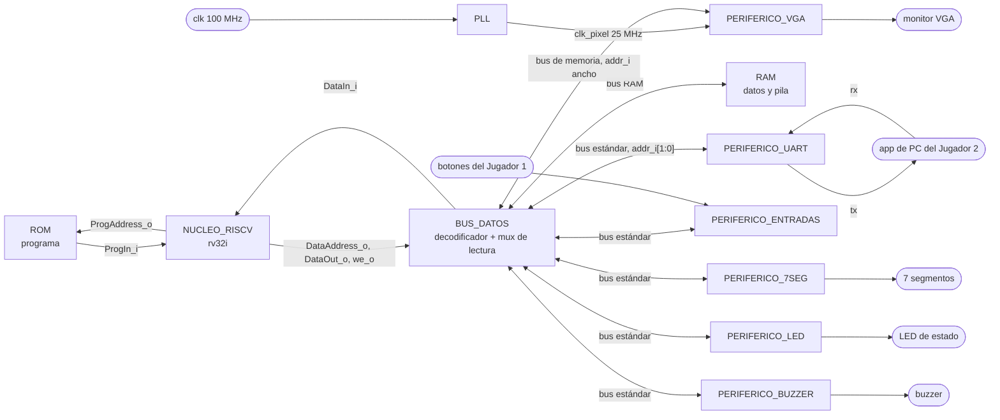

# Nivel 2

## Diagrama de segundo nivel

`clk_i` de 100 MHz y `rst_i` llegan a todos los bloques aunque no se dibujen. La app de PC queda
afuera del sistema, se dibuja solo para mostrar de dónde vienen `rx` y `tx`.

## PLL

Objetivo. Sacar el reloj de pixel de 25 MHz que pide el VGA a partir del único reloj de 100 MHz.

Entradas.

- `clk`, 100 MHz del pin W5.

Salidas.

- `clk_pixel`, 25 MHz hacia `PERIFERICO_VGA`.

Explicación general. Con openXC7 no hay asistente para generar el PLL, así que se instancia la
primitiva a mano. El enunciado también deja abierta la opción de sacar del PLL un reloj para la UART,
pero no hace falta. `PERIFERICO_UART` corre directo con los 100 MHz y saca los 115200 baudios con
contadores internos. TODO: Revisar si se usa `PLLE2_BASE` o `MMCME2_BASE`.

## NUCLEO_RISCV

Objetivo. Ejecutar el programa en ensamblador que tiene toda la lógica de la partida.

Entradas.

- `clk_i`, `rst_i`.
- `ProgIn_i[31:0]`, instrucción leída de la ROM.
- `DataIn_i[31:0]`, dato leído de la RAM o de un periférico.

Salidas.

- `ProgAddress_o[31:0]`, dirección de la instrucción hacia la ROM.
- `DataAddress_o[31:0]`, `DataOut_o[31:0]`, `we_o`, bus de datos hacia `BUS_DATOS`.

Explicación general. Es el núcleo de la figura 2 del enunciado, con buses separados para programa y
datos. Para el procesador la RAM y los periféricos son lo mismo, direcciones a las que se les hace
`lw` o `sw`. Por eso no necesita instrucciones de entrada y salida.

## ROM

Objetivo. Guardar el programa en ensamblador ya ensamblado.

Entradas.

- `ProgAddress_o[31:0]`, del núcleo.

Salidas.

- `ProgIn_i[31:0]`, hacia el núcleo.

Explicación general. Ocupa `0x0000_0000` a `0x0000_1FFF`, 8 KB. El vector de reset está en
`0x0000_0000`, así que el programa empieza en la primera palabra.

## RAM

Objetivo. Guardar los datos de la partida, los dos tableros, el turno, los contadores y la pila.

Entradas.

- Dirección, dato de escritura y habilitación de escritura, desde `BUS_DATOS`.

Salidas.

- Dato leído, hacia el mux de lectura de `BUS_DATOS`.

Explicación general. Ocupa `0x0000_2000` a `0x0000_2FFF`, 4 KB. La organización de los datos adentro
es decisión del programa y se documenta aparte.

## BUS_DATOS

Objetivo. Repartir el bus de datos del núcleo entre la RAM y los periféricos según la dirección.

Entradas.

- `DataAddress_o[31:0]`, `DataOut_o[31:0]`, `we_o`, del núcleo.
- `rdata_o[31:0]` de cada periférico y el dato leído de la RAM.

Salidas.

- `write_enable_i`, `addr_i` y `wdata_i[31:0]` hacia cada periférico, y las mismas señales hacia la RAM.
- `DataIn_i[31:0]`, hacia el núcleo.

Explicación general. Tiene dos partes. El decodificador mira `DataAddress_o`, decide a quién va el
acceso y deja pasar `we_o` solo hacia ese destino. El mux de lectura elige cuál `rdata_o` sube a
`DataIn_i`. A los periféricos de registros les llega `DataAddress_o[3:2]` como `addr_i[1:0]`, porque
sus registros van de 4 en 4 bytes.

## PERIFERICO_UART

Objetivo. Mover bytes entre el programa y la app de PC del Jugador 2. Es el único canal que tiene el
Jugador 2 con la partida.

Entradas.

- `clk_i`, `rst_i`.
- `write_enable_i`, `addr_i[1:0]`, `wdata_i[31:0]`, desde `BUS_DATOS`.
- `rx_i`, línea serial desde el pin B18.

Salidas.

- `rdata_o[31:0]`, hacia el mux de lectura de `BUS_DATOS`.
- `tx_o`, línea serial hacia el pin A18.

Explicación general. Es el periférico del Proyecto 2 que pide reutilizar la sección 4.5.3 del
enunciado, con el mapa de registros de la tabla 4.4.3. Ocupa `0x0001_0040` a `0x0001_004F` y tiene
tres registros, control en `0x40`, datos de transmisión en `0x44` y datos de recepción en `0x48`.
No entiende las tramas del juego. Manda el byte que el programa escribe y avisa con una bandera cuando
llega uno. Armar y validar las tramas es trabajo del ensamblador. El detalle está en
`../modulos/PERIFERICO_UART.md`.

## PERIFERICO_VGA

Objetivo. Dibujar en el monitor los tableros y el HUD a 640x480 a 60 Hz.

Entradas.

- `clk_i`, `rst_i`, `clk_pixel`.
- `write_enable_i`, `addr_i`, `wdata_i[31:0]`, desde `BUS_DATOS`, con `addr_i` más ancho que en los periféricos de registros.

Salidas.

- `rdata_o[31:0]`, hacia el mux de lectura.
- `vgaRed[3:0]`, `vgaGreen[3:0]`, `vgaBlue[3:0]`, `Hsync`, `Vsync`.

Explicación general. Se expone como una memoria de video en `0x0001_1000` a `0x0001_17FF`, una palabra
por casilla de la cuadrícula. El CPU escribe por el reloj del sistema y la lógica de video lee por el
reloj de pixel. TODO: Revisar el ancho final de `addr_i`, la cuadrícula y el cruce de dominios cuando exista el diseño del VGA.

## PERIFERICO_ENTRADAS

Objetivo. Entregar al programa el estado de los botones del Jugador 1 ya sin rebotes.

Entradas.

- `clk_i`, `rst_i`, `write_enable_i`, `addr_i[1:0]`, `wdata_i[31:0]`.
- Los siete botones del Jugador 1.

Salidas.

- `rdata_o[31:0]`, registro de estado en `0x0001_0120`.

Explicación general. TODO: Revisar el mapeo de bits y el antirrebote cuando exista el diseño del periférico.

## PERIFERICO_7SEG

Objetivo. Mostrar las partidas ganadas de cada jugador, de 00 a 99.

Entradas.

- `clk_i`, `rst_i`, `write_enable_i`, `addr_i[1:0]`, `wdata_i[31:0]`.

Salidas.

- `rdata_o[31:0]`.
- `seg[6:0]`, `an[3:0]`, `dp`.

Explicación general. Registro de datos en `0x0001_0130`. TODO: Revisar formato del registro y multiplexado de los dígitos.

## PERIFERICO_LED

Objetivo. Indicar si la partida está en colocación, batalla o resultado.

Entradas.

- `clk_i`, `rst_i`, `write_enable_i`, `addr_i[1:0]`, `wdata_i[31:0]`.

Salidas.

- `rdata_o[31:0]`.
- LED de estado.

Explicación general. Registro de datos en `0x0001_0138`. TODO: Revisar codificación de las tres fases.

## PERIFERICO_BUZZER

Objetivo. Generar los cinco sonidos del enunciado, impacto, fallo, hundido, colocación inválida y victoria.

Entradas.

- `clk_i`, `rst_i`, `write_enable_i`, `addr_i[1:0]`, `wdata_i[31:0]`.

Salidas.

- `rdata_o[31:0]`.
- `buzzer`.

Explicación general. Registro de control en `0x0001_0140`. TODO: Revisar cómo se codifica cada sonido en el registro.

## Explicación del sistema

Todo gira alrededor del núcleo. Toma instrucciones de la ROM por su bus de programa y usa el bus de
datos para todo lo demás. Cada `lw` o `sw` pasa por `BUS_DATOS`, que decide por la dirección si el
acceso va a la RAM o a un periférico. Así el mismo par de instrucciones sirve para leer un tablero en
RAM, pintar una casilla en el VGA o mandar un byte por la UART.

Ningún periférico decide nada del juego. El de entradas dice qué botón se presionó, el de la UART dice
que llegó un byte, y el programa decide qué significan. En sentido contrario, el programa escribe un
color en la memoria de video, un número en los 7 segmentos o un byte en la UART, y cada periférico se
encarga de la parte física, sea temporización, multiplexado o formación del bit serie.

Como nada bloquea al núcleo, el lazo principal puede sondear botones y UART en la misma vuelta. En eso
se apoya la colocación concurrente de los dos jugadores.
