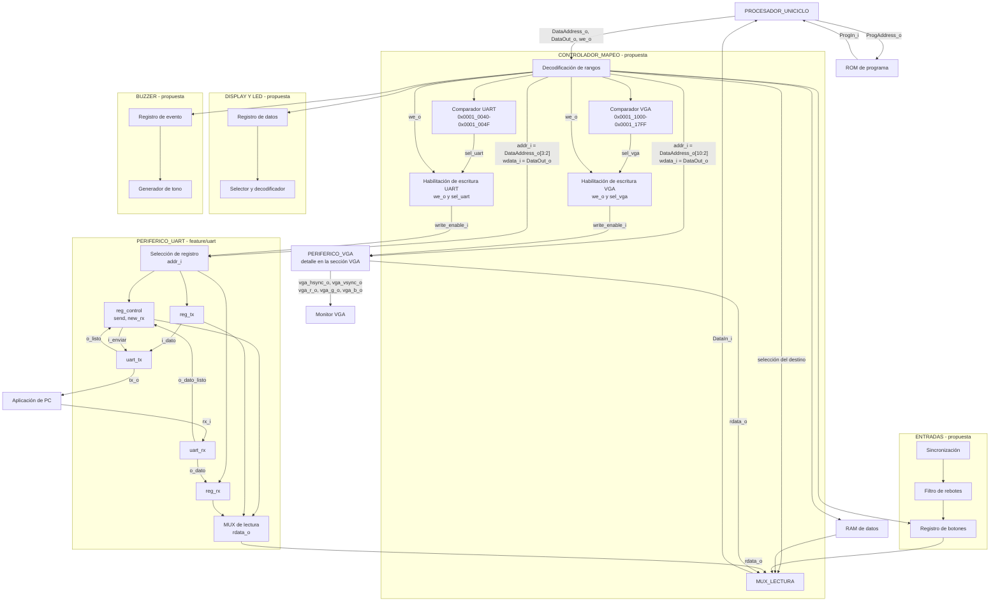
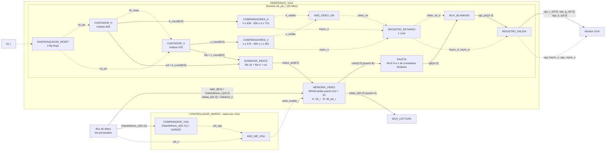

## Diagrama de tercer nivel

El procesador aparece como **un solo bloque**, sin mostrar sus partes internas. ROM y RAM son bloques separados: ROM entrega instrucciones directamente al procesador y RAM comparte el camino de datos con los periféricos. Dentro de `CONTROLADOR_MAPEO` se muestran la decodificación, el comparador de UART, la habilitación de escritura y el multiplexor de lectura; son **conexiones propuestas**, aún sin RTL de integración. Los registros y núcleos UART sí corresponden al código de `feature/uart`. `clk_i` y `rst_i` llegan al periférico UART, aunque no se repitan en cada registro del dibujo.

## Observaciones de integración

- **Entradas.** Se propone sincronizar y filtrar los botones antes de exponer su estado en un registro. El programa decide cómo usar cada pulsación.
- **Display y LED.** Se proponen registros mapeados para el contador de victorias y la fase del juego, más un selector de dígito y un decodificador de segmentos. La distribución concreta de bits sigue pendiente.
- **Buzzer.** Se propone un registro para seleccionar el evento y un generador de tono. El programa determina qué evento ocurrió.
- **Aplicación de PC.** Envía y recibe bytes por UART; la interpretación de colocaciones, turnos y disparos corresponde al programa ejecutado por el procesador. El periférico UART solo transporta bytes.

## Controlador de mapeo

Este bloque se sitúa entre el bus de datos del procesador y la RAM o los periféricos. Recibe `DataAddress_o`, `DataOut_o` y `we_o`; devuelve por `DataIn_i` el dato del destino seleccionado. La ROM de programa usa su propio camino hacia el procesador y no pasa por este controlador. La lógica del controlador **solo encamina accesos**: no decide turnos, disparos ni resultados del juego.

El decodificador compara la dirección completa con el mapa de memoria y genera una selección para un único destino. La RAM ocupa `0x0000_2000`–`0x0000_2FFF`; UART, `0x0001_0040`–`0x0001_004F`; y VGA, `0x0001_1000`–`0x0001_17FF`. Los registros de botones, display, LED y buzzer se seleccionan en sus direcciones respectivas. En particular, display (`0x0001_0130`) y LED (`0x0001_0138`) **no** pueden distinguirse comparando solo `DataAddress_o[31:4]`, porque comparten esos bits altos.

En una escritura, `DataOut_o` llega al destino, pero su habilitación se activa únicamente cuando coinciden `we_o` y la señal de selección correspondiente. Para UART se propone `write_enable_i = we_o && sel_uart`, donde `sel_uart` resulta de comparar `DataAddress_o[31:4]` con `0x0001004`; `DataAddress_o[3:2]` escoge internamente los registros de control, TX o RX mediante `addr_i[1:0]`. El controlador debe generar habilitaciones equivalentes e independientes para RAM y los demás destinos, evitando que un `sw` a uno modifique otro.

En una lectura, `MUX_LECTURA` selecciona el dato de RAM o la salida `rdata_o` del periférico indicado y lo entrega a `DataIn_i`. Para direcciones sin destino se propone devolver cero y no habilitar ninguna escritura; también deben definirse los accesos no alineados. Como el procesador es uniciclo, el camino de lectura y su latencia se tendrán que comprobar al integrar la RAM y los periféricos. Estas conexiones del controlador son todavía una propuesta, no RTL ya implementado.

## PERIFERICO_UART

El bloque sigue [`src/design/periferico_uart.sv`](https://github.com/Taller-de-diseno-digital-GR01/Proyecto-3-Batalla-Naval/blob/feature/uart/src/design/periferico_uart.sv) y sus dos submódulos [`uart_tx.sv`](https://github.com/Taller-de-diseno-digital-GR01/Proyecto-3-Batalla-Naval/blob/feature/uart/src/design/uart_tx.sv) y [`uart_rx.sv`](https://github.com/Taller-de-diseno-digital-GR01/Proyecto-3-Batalla-Naval/blob/feature/uart/src/design/uart_rx.sv).

- **Interfaz del bus:** `clk_i`, `rst_i`, `write_enable_i`, `addr_i[1:0]`, `wdata_i[31:0]` y `rdata_o[31:0]`. Los pines seriales son `rx_i` y `tx_o`.
- **Selección interna:** `addr_i=00` selecciona `reg_control` en `0x0001_0040`; `01` selecciona `reg_tx` en `0x0001_0044`; `10` selecciona `reg_rx` en `0x0001_0048`. La combinación `11` no está asignada, devuelve cero al leer y no escribe ningún registro.
- **Transmisión:** el programa escribe un byte en `reg_tx` y luego pone `reg_control[0]` (`send`) en uno. `uart_tx` toma el byte, lo transmite y emite `o_listo`; el registro baja `send` al terminar. El núcleo TX usa `TICKS_BIT=868` como valor predeterminado para el reloj de 100 MHz y 115200 baudios.
- **Recepción:** `uart_rx` reconstruye el byte entrante con sobremuestreo, lo entrega como `o_dato` y pulsa `o_dato_listo`. Entonces se carga `reg_rx` y sube `reg_control[1]` (`new_rx`). Tras leer el byte, el programa limpia esa bandera escribiendo cero en el bit 1 del registro de control. El núcleo RX usa `TICKS_X16=54` de forma predeterminada.
- **Lectura:** `rdata_o` selecciona combinacionalmente control, TX o RX y extiende a 32 bits los bytes de datos. Un nuevo byte recibido tiene prioridad frente a una escritura del CPU a `reg_rx` o al bit `new_rx` en el mismo ciclo.

Los archivos `arbitro_uart.sv`, `receptor_uart.sv` y `transmisor_uart.sv` también aparecen en la rama, pero proceden del Proyecto 2: el diseño documentado para Proyecto 3 tiene **un único maestro del periférico, el procesador**, y no coloca ese árbitro entre CPU y UART. El periférico todavía no aparece instanciado en un `top.sv` del sistema completo.

## VGA
Este bloque corresponde al módulo que conecta al procesador (CPU) con el monitor mediante el estándar de video VGA. 

- **Entradas**
  - Lado del bus (`clk_i`, 100 MHz): `clk_i`, `rst_i`, `write_enable_i`, `addr_i[8:0]` y `wdata_i[31:0]`.
  - Lado del monitor: `clk_pix_i` (25 MHz, del MMCM del sistema).
- **Salidas**
  - Lado del bus: `rdata_o[31:0]` hacia `MUX_LECTURA`.
  - Lado del monitor (`clk_pix_i`): `vga_hsync_o`, `vga_vsync_o`, `vga_r_o[3:0]`, `vga_g_o[3:0]` y `vga_b_o[3:0]`.

El CPU ve el periférico como una memoria en `0x0001_1000`–`0x0001_17FF`, con una palabra por casilla de una cuadrícula de 20 × 15 casillas de 32 × 32 píxeles. En este nivel se usan solo los bits `[2:0]` (`color`) de cada palabra. Los bits `[31:3]` quedan reservados.

**Convención de líneas:** las líneas continuas llevan **datos** (direcciones, palabras, índices y colores) y las punteadas llevan **control** (habilitaciones, reinicios, sincronismos y banderas). `clk_i` y `clk_pix_i` llegan a todos los bloques de su dominio y no se dibujan para mantener legible el diagrama.

### Bloque V1: COMPARADOR_VGA (en el controlador de mapeo)

- **Objetivo:** detectar que el acceso del CPU pertenece a la memoria de video.
- **Entradas:** `DataAddress_o[31:11]` (datos).
- **Salidas:** `sel_vga` (control).
- **Explicación general:** es un comparador de igualdad de 21 bits contra la constante `0x00022`. Todas las direcciones del rango `0x0001_1000`–`0x0001_17FF` comparten esos bits altos, así que basta una comparación para cubrir las 512 palabras. Los bits `[10:2]` forman el índice de palabra y los bits `[1:0]` no se usan, porque todos los accesos son de palabra alineada.

### Bloque V2: AND_WE_VGA (en el controlador de mapeo)

- **Objetivo:** permitir que solo un `sw` dirigido al VGA escriba en la memoria de video.
- **Entradas:** `we_o` y `sel_vga` (control).
- **Salidas:** `write_enable_i` (control).
- **Explicación general:** es una compuerta AND. Evita que un `sw` a la RAM u otro periférico modifique una casilla, igual que la habilitación equivalente del UART.

### Bloque V3: MEMORIA_VIDEO

- **Objetivo:** guardar el mapa de casillas y servir de frontera entre el dominio del CPU y el dominio de píxel.
- **Entradas:**
  - Puerto A (`clk_i`): `write_enable_i` (control), `addr_i[8:0]` y `wdata_i[31:0]` (datos).
  - Puerto B (`clk_pix_i`): `indice_pix[8:0]` (datos).
- **Salidas:** `rdata_o[31:0]` por el puerto A hacia `MUX_LECTURA`, y `color[2:0]` (bits `[2:0]` de la palabra) por el puerto B hacia `PALETA` (datos).
- **Explicación general:** es una BRAM de 512 × 32 bits de doble puerto verdadero, con un reloj por puerto. El puerto A atiende `lw`/`sw` del CPU. Cada `sw` actualiza una casilla en **un solo ciclo** y no bloquea el programa. El puerto B lo lee el barrido de forma continua y entrega el dato un ciclo después de recibir el índice. El único punto donde se cruzan los dominios de reloj es el arreglo de la BRAM. Si una lectura del barrido coincide con una escritura del CPU en la misma casilla, a lo sumo esa casilla se ve incorrecta durante un cuadro (16,7 ms), y el estado del juego no se afecta porque vive en la RAM de datos. Se usan las posiciones 0–299, y las 300–511 quedan libres. El reinicio no borra la memoria: limpiar la pantalla es tarea del software.

### Bloque V4: SINCRONIZADOR_RESET

- **Objetivo:** llevar el reinicio al dominio de píxel sin riesgo de metaestabilidad.
- **Entradas:** `rst_i` (control, dominio `clk_i`).
- **Salidas:** `rst_pix` (control, dominio `clk_pix_i`).
- **Explicación general:** son dos *flip-flops* en cascada con reloj `clk_pix_i`. Su salida reinicia los contadores del barrido.

### Bloque V5: CONTADOR_H

- **Objetivo:** recorrer los 800 píxeles de cada línea (640 visibles + 160 de borrado).
- **Entradas:** `rst_pix` (control).
- **Salidas:** `h_count[9:0]` (datos) y `fin_linea` (control).
- **Explicación general:** es un contador de 10 bits que incrementa en cada ciclo de `clk_pix_i` y vuelve a 0 después de 799. Activa `fin_linea` cuando `h_count = 799`.

### Bloque V6: CONTADOR_V

- **Objetivo:** recorrer las 525 líneas de cada cuadro (480 visibles + 45 de borrado).
- **Entradas:** `fin_linea` y `rst_pix` (control).
- **Salidas:** `v_count[9:0]` (datos).
- **Explicación general:** es un contador de 10 bits que solo incrementa cuando `fin_linea = 1`, y vuelve a 0 después de 524. Con 25 MHz / (800 × 525) se obtiene un refresco de aproximadamente 59,5 Hz.

### Bloque V7: COMPARADORES_H

- **Objetivo:** derivar de `h_count` las señales de control horizontales.
- **Entradas:** `h_count[9:0]` (datos).
- **Salidas:** `h_visible` y `hsync_n` (control).
- **Explicación general:** son dos comparadores de magnitud. `h_visible = (h_count < 640)`. `hsync_n` vale 0 cuando `656 ≤ h_count ≤ 751`, lo que da un pulso de 96 píxeles después de un *front porch* de 16. La polaridad es negativa, como exige el estándar 640 × 480 @ 60 Hz.

### Bloque V8: COMPARADORES_V

- **Objetivo:** derivar de `v_count` las señales de control verticales.
- **Entradas:** `v_count[9:0]` (datos).
- **Salidas:** `v_visible` y `vsync_n` (control).
- **Explicación general:** `v_visible = (v_count < 480)`. `vsync_n` vale 0 cuando `490 ≤ v_count ≤ 491`, lo que da un pulso de 2 líneas después de un *front porch* de 10. La polaridad también es negativa.

### Bloque V9: AND_VIDEO_ON

- **Objetivo:** indicar si el píxel actual pertenece al área visible.
- **Entradas:** `h_visible` y `v_visible` (control).
- **Salidas:** `video_on` (control).
- **Explicación general:** es una compuerta AND. Fuera del área visible, la salida de color debe ser negra.

### Bloque V10: SUMADOR_INDICE

- **Objetivo:** convertir la posición del barrido en el índice de la casilla que se debe leer.
- **Entradas:** `col = h_count[9:5]` y `fila = v_count[8:5]` (datos).
- **Salidas:** `indice_pix[8:0]` (datos).
- **Explicación general:** con casillas de 32 × 32 píxeles, dividir entre 32 es tomar los bits altos de cada contador, así que no hace falta un divisor. El índice es `fila × 20 + col`. La multiplicación por 20 se descompone en `fila·16 + fila·4`, es decir, en dos desplazamientos cableados (`{fila, 4'b0}` y `{fila, 2'b0}`) y dos sumadores. En el área visible el índice va de 0 a 299. Fuera de ella el valor leído se descarta mediante `video_on`. Es la misma fórmula que usa el software para calcular `VGA_BASE + índice × 4`.

### Bloque V11: REGISTRO_RETARDO

- **Objetivo:** compensar el ciclo de latencia de lectura del puerto B.
- **Entradas:** `hsync_n`, `vsync_n` y `video_on` (control).
- **Salidas:** `hsync_d`, `vsync_d` y `video_on_d` (control).
- **Explicación general:** es un registro de 3 bits con reloj `clk_pix_i`. El color de un píxel sale de la BRAM un ciclo después de presentar su índice, así que las señales de control del mismo píxel se retrasan un ciclo para llegar alineadas. Sin este registro, la imagen quedaría corrida un píxel respecto a los sincronismos.

### Bloque V12: PALETA

- **Objetivo:** traducir el código de color de la casilla al formato RGB de la tarjeta.
- **Entradas:** `color[2:0]` (datos).
- **Salidas:** `rgb[11:0]` (datos, 4 bits por canal).
- **Explicación general:** es un multiplexor 8 a 1 de constantes de 12 bits, controlado por `color`. Codifica como mínimo agua, barco propio, impacto y fallo, y los 4 códigos restantes quedan para cursor y HUD. La asignación exacta de colores se define en el cuarto nivel.

### Bloque V13: MUX_BLANKING

- **Objetivo:** forzar a negro la salida durante los intervalos de borrado.
- **Entradas:** `rgb[11:0]` (datos) y `video_on_d` (control).
- **Salidas:** `rgb_pix[11:0]` (datos).
- **Explicación general:** es un multiplexor 2 a 1. Si `video_on_d = 1` deja pasar `rgb`, y si no entrega `12'h000`. Los monitores usan el nivel negro de los *porches* como referencia, así que emitir color fuera del área visible desajusta la imagen.

### Bloque V14: REGISTRO_SALIDA

- **Objetivo:** entregar a los pines señales estables y alineadas entre sí.
- **Entradas:** `rgb_pix[11:0]` (datos), `hsync_d` y `vsync_d` (control).
- **Salidas:** `vga_r_o[3:0]`, `vga_g_o[3:0]`, `vga_b_o[3:0]` (datos), `vga_hsync_o` y `vga_vsync_o` (control).
- **Explicación general:** es un registro de 14 bits con reloj `clk_pix_i`. Elimina los *glitches* de la lógica combinacional anterior y agrega un segundo ciclo de retardo igual para color y sincronismos, así que la alineación entre ambos se mantiene.

### Funcionamiento en conjunto del VGA

**Escritura desde el CPU.** Para pintar una casilla, el programa calcula `0x0001_1000 + (fila × 20 + col) × 4` y ejecuta un `sw`. `COMPARADOR_VGA` reconoce el rango, `AND_WE_VGA` habilita la escritura y el puerto A guarda la palabra en ese mismo ciclo de `clk_i`, sin estados de espera.

**Barrido en el dominio de píxel.** `CONTADOR_H` y `CONTADOR_V` recorren de forma continua las 800 × 525 posiciones del cuadro. En cada ciclo de `clk_pix_i`, `SUMADOR_INDICE` convierte la posición en el índice de la casilla y el puerto B lo lee. Durante un ciclo, mientras la BRAM entrega el dato, `REGISTRO_RETARDO` retiene los sincronismos y `video_on` del mismo píxel. Luego `PALETA` convierte el color a RGB444, `MUX_BLANKING` lo anula fuera del área visible y `REGISTRO_SALIDA` entrega color y sincronismos a los pines con 2 ciclos de latencia total, igual para ambos caminos.

Los dos lados solo comparten la BRAM. El CPU escribe cuando lo necesita y el barrido lee 60 veces por segundo, así que un cambio en una casilla aparece en pantalla en el siguiente cuadro. El periférico no aplica reglas del juego. Por ejemplo, que el Jugador 1 nunca vea los barcos del Jugador 2 depende de que el software nunca escriba el color "barco propio" en las casillas del tablero rival.

**Lectura desde el CPU.** `rdata_o` sale del puerto A para cumplir que el VGA se acceda con `lw`/`sw` como la RAM. La lectura síncrona de la BRAM tiene la misma latencia de un ciclo que la RAM de datos, así que se resolverá con el mismo mecanismo cuando se integre el procesador uniciclo. Mientras tanto, el programa mantiene el estado de los tableros en RAM y no depende de leer la memoria de video.

## Funcionamiento en conjunto

Para transmitir un byte, el programa escribe en `0x0001_0044` y luego activa `send` en `0x0001_0040`. El decodificador de direcciones selecciona UART; sus registros alimentan `uart_tx`, que serializa el dato hacia la PC. Para recibirlo, `uart_rx` carga `reg_rx`, sube `new_rx` y el programa puede consultar `0x0001_0040`, leer `0x0001_0048` y limpiar la bandera. Las esperas del enlace se gestionan por sondeo de esos bits; UART no decide las jugadas.

Las conexiones completas del procesador con RAM, VGA y los demás periféricos siguen pendientes de integración. La organización interna del VGA descrita en su sección es una **propuesta** de diseño: la rama `feature/VGA` todavía no contiene RTL.
