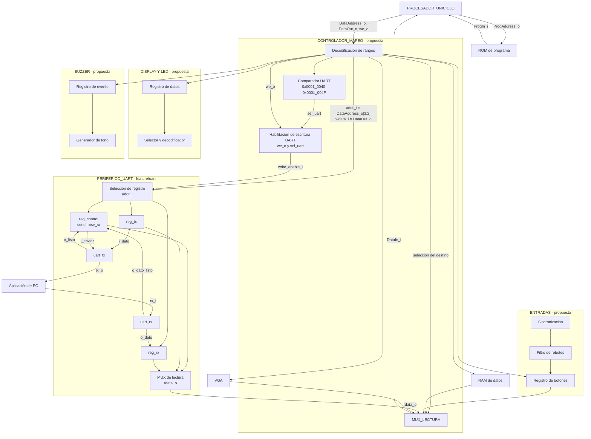

## Diagrama de tercer nivel

El procesador aparece como **un solo bloque**, sin mostrar sus partes internas. ROM y RAM son bloques separados: ROM entrega instrucciones directamente al procesador y RAM comparte el camino de datos con los periféricos. Dentro de `CONTROLADOR_MAPEO` se muestran la decodificación, el comparador de UART, la habilitación de escritura y el multiplexor de lectura; son **conexiones propuestas**, aún sin RTL de integración. Los registros y núcleos UART sí corresponden al código de `feature/uart`. `clk_i` y `rst_i` llegan al periférico UART, aunque no se repitan en cada registro del dibujo.

## Observaciones de integración

- **Entradas.** Se propone sincronizar y filtrar los botones antes de exponer su estado en un registro. El programa decide cómo usar cada pulsación.
- **Display y LED.** Se proponen registros mapeados para el contador de victorias y la fase del juego, más un selector de dígito y un decodificador de segmentos. La distribución concreta de bits sigue pendiente.
- **Buzzer.** Se propone un registro para seleccionar el evento y un generador de tono. El programa determina qué evento ocurrió.
- **Aplicación de PC.** Envía y recibe bytes por UART; la interpretación de colocaciones, turnos y disparos corresponde al programa ejecutado por el procesador. El periférico UART solo transporta bytes.

## Controlador de mapeo

Este bloque se sitúa entre el bus de datos del procesador y la RAM o los periféricos. Recibe `DataAddress_o`, `DataOut_o` y `we_o`; devuelve por `DataIn_i` el dato del destino seleccionado. La ROM de programa usa su propio camino hacia el procesador y no pasa por este controlador. La lógica del controlador **solo encamina accesos**: no decide turnos, disparos ni resultados del juego.

El decodificador compara la dirección completa con el mapa de memoria y genera una selección para un único destino. La RAM ocupa `0x0000_2000`–`0x0000_2FFF`; UART, `0x0001_0040`–`0x0001_004F`; y VGA, `0x0001_1000`–`0x0001_17FF`. Los registros de botones, display, LED y buzzer se seleccionan en sus direcciones respectivas. En particular, display (`0x0001_0130`) y LED (`0x0001_0138`) **no** pueden distinguirse comparando solo `DataAddress_o[31:4]`, porque comparten esos bits altos.

En una escritura, `DataOut_o` llega al destino, pero su habilitación se activa únicamente cuando coinciden `we_o` y la señal de selección correspondiente. Para UART se propone `write_enable_i = we_o && sel_uart`, donde `sel_uart` resulta de comparar `DataAddress_o[31:4]` con `0x0001004`; `DataAddress_o[3:2]` escoge internamente los registros de control, TX o RX mediante `addr_i[1:0]`. El controlador debe generar habilitaciones equivalentes e independientes para RAM y los demás destinos, evitando que un `sw` a uno modifique otro.

En una lectura, `MUX_LECTURA` selecciona el dato de RAM o la salida `rdata_o` del periférico indicado y lo entrega a `DataIn_i`. Para direcciones sin destino se propone devolver cero y no habilitar ninguna escritura; también deben definirse los accesos no alineados. Como el procesador es uniciclo, el camino de lectura y su latencia se tendrán que comprobar al integrar la RAM y los periféricos. Estas conexiones del controlador son todavía una propuesta, no RTL ya implementado.

## PERIFERICO_UART

El bloque sigue [`src/design/periferico_uart.sv`](https://github.com/Taller-de-diseno-digital-GR01/Proyecto-3-Batalla-Naval/blob/feature/uart/src/design/periferico_uart.sv) y sus dos submódulos [`uart_tx.sv`](https://github.com/Taller-de-diseno-digital-GR01/Proyecto-3-Batalla-Naval/blob/feature/uart/src/design/uart_tx.sv) y [`uart_rx.sv`](https://github.com/Taller-de-diseno-digital-GR01/Proyecto-3-Batalla-Naval/blob/feature/uart/src/design/uart_rx.sv).

- **Interfaz del bus:** `clk_i`, `rst_i`, `write_enable_i`, `addr_i[1:0]`, `wdata_i[31:0]` y `rdata_o[31:0]`. Los pines seriales son `rx_i` y `tx_o`.
- **Selección interna:** `addr_i=00` selecciona `reg_control` en `0x0001_0040`; `01` selecciona `reg_tx` en `0x0001_0044`; `10` selecciona `reg_rx` en `0x0001_0048`. La combinación `11` no está asignada, devuelve cero al leer y no escribe ningún registro.
- **Transmisión:** el programa escribe un byte en `reg_tx` y luego pone `reg_control[0]` (`send`) en uno. `uart_tx` toma el byte, lo transmite y emite `o_listo`; el registro baja `send` al terminar. El núcleo TX usa `TICKS_BIT=868` como valor predeterminado para el reloj de 100 MHz y 115200 baudios.
- **Recepción:** `uart_rx` reconstruye el byte entrante con sobremuestreo, lo entrega como `o_dato` y pulsa `o_dato_listo`. Entonces se carga `reg_rx` y sube `reg_control[1]` (`new_rx`). Tras leer el byte, el programa limpia esa bandera escribiendo cero en el bit 1 del registro de control. El núcleo RX usa `TICKS_X16=54` de forma predeterminada.
- **Lectura:** `rdata_o` selecciona combinacionalmente control, TX o RX y extiende a 32 bits los bytes de datos. Un nuevo byte recibido tiene prioridad frente a una escritura del CPU a `reg_rx` o al bit `new_rx` en el mismo ciclo.

Los archivos `arbitro_uart.sv`, `receptor_uart.sv` y `transmisor_uart.sv` también aparecen en la rama, pero proceden del Proyecto 2: el diseño documentado para Proyecto 3 tiene **un único maestro del periférico, el procesador**, y no coloca ese árbitro entre CPU y UART. El periférico todavía no aparece instanciado en un `top.sv` del sistema completo.

## VGA

## Funcionamiento en conjunto

Para transmitir un byte, el programa escribe en `0x0001_0044` y luego activa `send` en `0x0001_0040`. El decodificador de direcciones selecciona UART; sus registros alimentan `uart_tx`, que serializa el dato hacia la PC. Para recibirlo, `uart_rx` carga `reg_rx`, sube `new_rx` y el programa puede consultar `0x0001_0040`, leer `0x0001_0048` y limpiar la bandera. Las esperas del enlace se gestionan por sondeo de esos bits; UART no decide las jugadas.

Las conexiones completas del procesador con RAM, VGA y los demás periféricos siguen pendientes de integración. En particular, el bloque VGA del diagrama no presupone una organización interna que su rama todavía no documenta.
