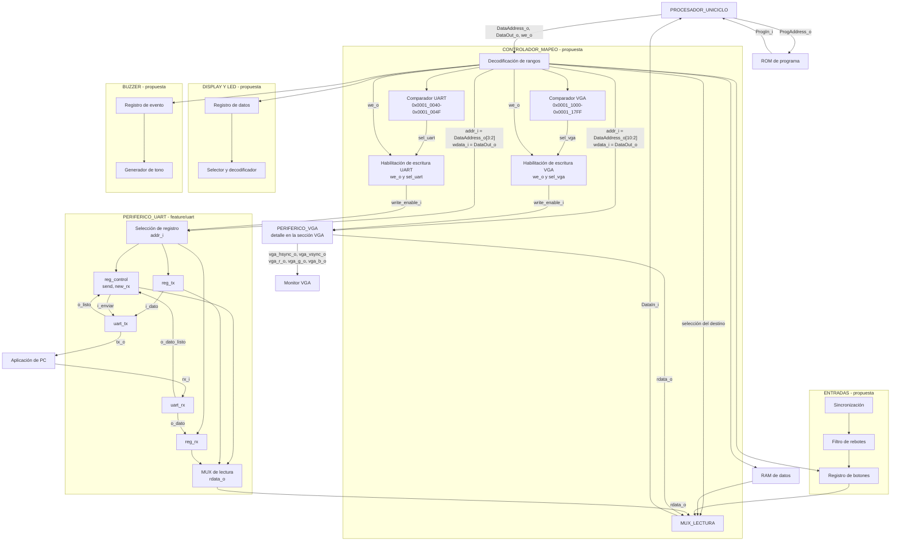
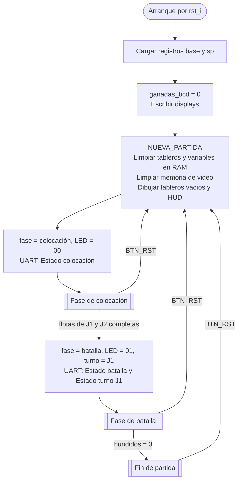
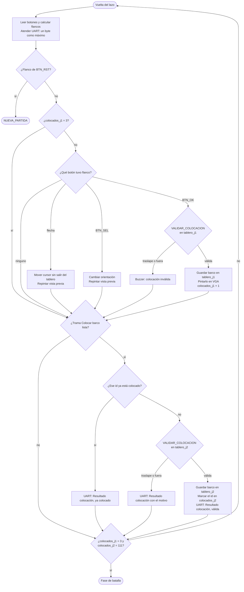
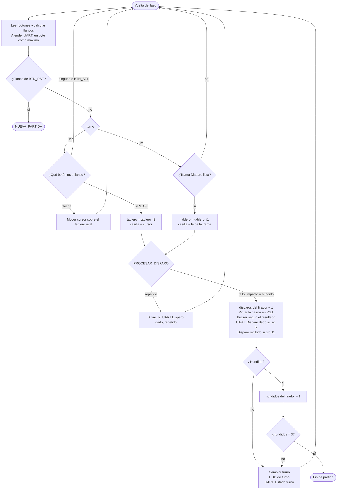
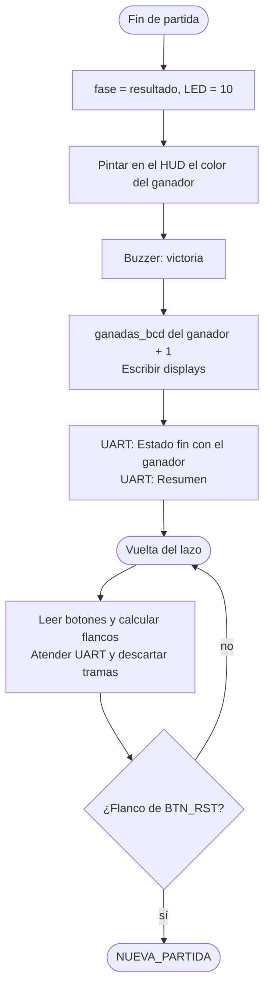

## Diagrama de tercer nivel



El procesador aparece como **un solo bloque**, sin mostrar sus partes internas. ROM y RAM son bloques separados: ROM entrega instrucciones directamente al procesador y RAM comparte el camino de datos con los periféricos. Dentro de `CONTROLADOR_MAPEO` se muestran la decodificación, el comparador de UART, la habilitación de escritura y el multiplexor de lectura; son **conexiones propuestas**, aún sin RTL de integración. Los registros y núcleos UART sí corresponden al código de `feature/uart`. `clk_i` y `rst_i` llegan al periférico UART, aunque no se repitan en cada registro del dibujo.

## Observaciones de integración

- **Entradas.** Se propone sincronizar y filtrar los botones antes de exponer su estado en un registro. El programa decide cómo usar cada pulsación.
- **Display y LED.** Se proponen registros mapeados para el contador de victorias y la fase del juego, más un selector de dígito y un decodificador de segmentos. La distribución concreta de bits sigue pendiente.
- **Buzzer.** Se propone un registro para seleccionar el evento y un generador de tono. El programa determina qué evento ocurrió.
- **Aplicación de PC.** Envía y recibe bytes por UART; la interpretación de colocaciones, turnos y disparos corresponde al programa ejecutado por el procesador. El periférico UART solo transporta bytes.

## Controlador de mapeo

Este bloque se sitúa entre el bus de datos del procesador y la RAM o los periféricos. Recibe `DataAddress_o`, `DataOut_o` y `we_o`; devuelve por `DataIn_i` el dato del destino seleccionado. La ROM de programa usa su propio camino hacia el procesador y no pasa por este controlador. La lógica del controlador **solo encamina accesos**: no decide turnos, disparos ni resultados del juego.

El decodificador compara la dirección completa con el mapa de memoria y genera una selección para un único destino. La RAM ocupa `0x0000_2000`–`0x0000_2FFF`; UART, `0x0001_0040`–`0x0001_004F`; y VGA, `0x0001_1000`–`0x0001_17FF`. Los registros de botones, display, LED y buzzer se seleccionan en sus direcciones respectivas. En particular, display (`0x0001_0130`) y LED (`0x0001_0138`) **no** pueden distinguirse comparando solo `DataAddress_o[31:4]`, porque comparten esos bits altos.

En una escritura, `DataOut_o` llega al destino, pero su habilitación se activa únicamente cuando coinciden `we_o` y la señal de selección correspondiente. Para UART se propone `write_enable_i = we_o && sel_uart`, donde `sel_uart` resulta de comparar `DataAddress_o[31:4]` con `0x0001004`; `DataAddress_o[3:2]` escoge internamente los registros de control, TX o RX mediante `addr_i[1:0]`. El controlador debe generar habilitaciones equivalentes e independientes para RAM y los demás destinos, evitando que un `sw` a uno modifique otro.

En una lectura, `MUX_LECTURA` selecciona el dato de RAM o la salida `rdata_o` del periférico indicado y lo entrega a `DataIn_i`. Para direcciones sin destino se propone devolver cero y no habilitar ninguna escritura; también deben definirse los accesos no alineados. Como el procesador es uniciclo, el camino de lectura y su latencia se tendrán que comprobar al integrar la RAM y los periféricos. Estas conexiones del controlador son todavía una propuesta, no RTL ya implementado.

## PERIFERICO_UART

El bloque sigue [`src/design/periferico_uart.sv`](https://github.com/Taller-de-diseno-digital-GR01/Proyecto-3-Batalla-Naval/blob/feature/uart/src/design/periferico_uart.sv) y sus dos submódulos [`uart_tx.sv`](https://github.com/Taller-de-diseno-digital-GR01/Proyecto-3-Batalla-Naval/blob/feature/uart/src/design/uart_tx.sv) y [`uart_rx.sv`](https://github.com/Taller-de-diseno-digital-GR01/Proyecto-3-Batalla-Naval/blob/feature/uart/src/design/uart_rx.sv).

- **Interfaz del bus:** `clk_i`, `rst_i`, `write_enable_i`, `addr_i[1:0]`, `wdata_i[31:0]` y `rdata_o[31:0]`. Los pines seriales son `rx_i` y `tx_o`.
- **Selección interna:** `addr_i=00` selecciona `reg_control` en `0x0001_0040`; `01` selecciona `reg_tx` en `0x0001_0044`; `10` selecciona `reg_rx` en `0x0001_0048`. La combinación `11` no está asignada, devuelve cero al leer y no escribe ningún registro.
- **Transmisión:** el programa escribe un byte en `reg_tx` y luego pone `reg_control[0]` (`send`) en uno. `uart_tx` toma el byte, lo transmite y emite `o_listo`; el registro baja `send` al terminar. El núcleo TX usa `TICKS_BIT=868` como valor predeterminado para el reloj de 100 MHz y 115200 baudios.
- **Recepción:** `uart_rx` reconstruye el byte entrante con sobremuestreo, lo entrega como `o_dato` y pulsa `o_dato_listo`. Entonces se carga `reg_rx` y sube `reg_control[1]` (`new_rx`). Tras leer el byte, el programa limpia esa bandera escribiendo cero en el bit 1 del registro de control. El núcleo RX usa `TICKS_X16=54` de forma predeterminada.
- **Lectura:** `rdata_o` selecciona combinacionalmente control, TX o RX y extiende a 32 bits los bytes de datos. Un nuevo byte recibido tiene prioridad frente a una escritura del CPU a `reg_rx` o al bit `new_rx` en el mismo ciclo.

Los archivos `arbitro_uart.sv`, `receptor_uart.sv` y `transmisor_uart.sv` también aparecen en la rama, pero proceden del Proyecto 2: el diseño documentado para Proyecto 3 tiene **un único maestro del periférico, el procesador**, y no coloca ese árbitro entre CPU y UART. El periférico todavía no aparece instanciado en un `top.sv` del sistema completo.

## VGA
Este bloque corresponde al módulo que conecta al procesador (CPU) con el monitor mediante el estándar de video VGA. La ficha completa, con los puntos a) a j), está en [`modulos/PERIFERICO_VGA.md`](../modulos/PERIFERICO_VGA.md).

- **Entradas**
  - Lado del bus: `clk_i`, `rst_i`, `write_enable_i`, `addr_i[8:0]` y `wdata_i[31:0]`, desde el controlador de mapeo.
  - Lado del monitor: `clk_pix_i` de 25 MHz, desde el MMCM del top.
- **Salidas**
  - Lado del bus: `rdata_o[31:0]`, hacia `MUX_LECTURA`.
  - Lado del monitor: `vga_hsync_o`, `vga_vsync_o`, `vga_r_o[3:0]`, `vga_g_o[3:0]` y `vga_b_o[3:0]`.

- **Selección:** el controlador compara `DataAddress_o[31:11]` con `0x00022` para obtener `sel_vga`, que cubre `0x0001_1000`–`0x0001_17FF`. La escritura se habilita con `write_enable_i = we_o && sel_vga`, y `DataAddress_o[10:2]` llega como `addr_i`.
- **Memoria de video:** BRAM de doble puerto de 512 × 32 bits, una palabra por casilla de una cuadrícula de 20 × 15 casillas de 32 × 32 píxeles. El puerto A (`clk_i`) atiende los `lw`/`sw` del CPU en un solo ciclo. El puerto B (`clk_pix_i`) lo lee el barrido de forma continua.
- **Barrido:** dos contadores (módulo 800 y módulo 525) y sus comparadores generan `hsync`, `vsync` y `video_on` para 640 × 480 a 60 Hz. El índice de la casilla es `fila × 20 + col`, con `col = h_count[9:5]` y `fila = v_count[8:5]`.
- **Salida:** los bits `[2:0]` de la palabra pasan por una paleta a RGB444, se fuerzan a negro fuera del área visible y se registran junto con los sincronismos, que se retrasan lo mismo que la lectura de la BRAM.

## Programa en ensamblador

El programa corre en `PROCESADOR_UNICICLO` desde la ROM y es el único lugar donde viven las reglas del juego. Los periféricos solo exponen entradas y salidas, y la aplicación de PC solo muestra lo que el programa le manda. En este nivel el programa se abre en cuatro diagramas de flujo: el flujo general, la fase de colocación, la fase de batalla y el fin de partida. Las cajas con nombre en mayúsculas (`NUEVA_PARTIDA`, `VALIDAR_COLOCACION`, `PROCESAR_DISPARO`) son subrutinas, y su detalle, junto con el armado de tramas UART, el cursor y la vista previa, va en el doc de nivel 4 del programa.

### El núcleo y lo que implica para el programa

El procesador es el núcleo de ciclo único de [riscv-simple-sv](https://github.com/tilk/riscv-simple-sv). Implementa el conjunto `rv32i` completo salvo las instrucciones de sistema (`ecall`, `ebreak` y los CSR), y trata `fence` como una instrucción que no hace nada. Eso cubre la lista base del instructivo y además `lui`, `auipc`, las cargas y escrituras de byte y media palabra (`lb`, `lbu`, `lh`, `lhu`, `sb`, `sh`) y los saltos sin signo (`bltu`, `bgeu`). La extensión de multiplicación y división viene desactivada.

Para el programa eso significa:

- **Las direcciones se arman con `lui`.** Cada dirección base sale de una sola instrucción (tabla de abajo), y el programa puede usar `li`, `la` y `call` sin restricción.
- **Los periféricos y la memoria de video se acceden solo con `lw` y `sw`.** El núcleo genera habilitaciones por byte para `sb` y `sh`, pero la interfaz estándar de periféricos del instructivo no las tiene. Un `sb` a un periférico escribiría la palabra entera con el dato desplazado. En la RAM las variables y las casillas también ocupan una palabra, para que todo el programa use las mismas dos instrucciones de memoria.
- **No hay `mul`.** Los índices salen con desplazamientos: `fila × 8 = fila << 3` para los tableros y `fila × 20 = (fila << 4) + (fila << 2)` para la memoria de video.
- **La ROM no está en el bus de datos.** El Address Translator no la mapea, así que el programa no puede leer tablas constantes de la ROM con `lw`. Las constantes van como inmediatos. La longitud de un barco, por ejemplo, sale de `4 − id` (4, 3 y 2 casillas para los id 0, 1 y 2).

### Registros base

| Registro | Valor | Cómo se arma | Qué se alcanza con él |
|---|---|---|---|
| `s0` | `0x0001_0000` | `lui s0, 0x10` | Registros de periféricos, desplazamientos `0x040` a `0x140` |
| `s1` | `0x0001_1000` | `lui s1, 0x11` | Memoria de video, casillas 0 a 299 (desplazamiento máximo 1196) |
| `s2` | `0x0000_2000` | `lui s2, 0x2` | Variables en RAM, desplazamientos `0x000` a `0x7FF` |
| `sp` | `0x0000_3000` | `lui sp, 0x3` | Tope de la pila, que crece hacia abajo |

Los desplazamientos de `lw` y `sw` son de 12 bits con signo (−2048 a 2047). Con estas bases todas las direcciones que usa el programa quedan dentro de ese alcance. Estos cuatro registros se cargan al arrancar y ninguna subrutina los modifica.

| Acceso | Instrucción | Dirección |
|---|---|---|
| Control y estado de la UART | `lw`/`sw` `0x040(s0)` | `0x0001_0040` |
| Dato a transmitir | `sw` `0x044(s0)` | `0x0001_0044` |
| Dato recibido | `lw` `0x048(s0)` | `0x0001_0048` |
| Botones del Jugador 1 | `lw` `0x120(s0)` | `0x0001_0120` |
| Displays de 7 segmentos | `sw` `0x130(s0)` | `0x0001_0130` |
| LED de estado | `sw` `0x138(s0)` | `0x0001_0138` |
| Buzzer | `sw` `0x140(s0)` | `0x0001_0140` |
| Casilla `(f, c)` del tablero del Jugador 1 en pantalla | `sw` `4 × ((3 + f) × 20 + 1 + c)(s1)` | `0x0001_1000` a `0x0001_17FF` |
| Casilla `(f, c)` del tablero del Jugador 2 en pantalla | `sw` `4 × ((3 + f) × 20 + 11 + c)(s1)` | `0x0001_1000` a `0x0001_17FF` |

Las posiciones de los tableros en pantalla (filas 3 a 10, columnas 1 a 8 y 11 a 18) siguen la distribución de [`PERIFERICO_VGA.md`](../modulos/PERIFERICO_VGA.md).

### Organización de la RAM

Cada casilla de un tablero es una palabra, en el índice `fila × 8 + columna`. Sus bits `[1:0]` guardan el estado con los mismos códigos que la paleta del VGA, y los bits `[3:2]` guardan el id del barco que la ocupa.

| `[1:0]` | Estado | Color VGA |
|---|---|---|
| `00` | Agua sin disparar | `000`, agua |
| `01` | Barco sin disparar | `001`, barco propio |
| `10` | Impacto | `010`, impacto |
| `11` | Fallo | `011`, fallo |

Con esta codificación una casilla ya disparada es la que tiene el bit 1 en uno, y el tablero propio del Jugador 1 se pinta copiando el estado tal cual.

| Dirección | Variable | Contenido |
|---|---|---|
| `0x0000_2000` a `0x0000_20FF` | `tablero_j1[64]` | Casillas del Jugador 1 |
| `0x0000_2100` a `0x0000_21FF` | `tablero_j2[64]` | Casillas del Jugador 2 |
| `0x0000_2200` | `fase` | 0 colocación, 1 batalla, 2 resultado |
| `0x0000_2204` | `turno` | 0 Jugador 1, 1 Jugador 2 |
| `0x0000_2208` | `colocados_j1` | Barcos colocados por el Jugador 1, de 0 a 3. El Jugador 1 coloca en orden, así que también es el id del barco que sigue |
| `0x0000_220C` | `colocados_j2` | Máscara `[2:0]` con un bit por id, porque la PC manda el id de cada barco |
| `0x0000_2210` | `cursor_fila` | Fila del cursor del Jugador 1 |
| `0x0000_2214` | `cursor_col` | Columna del cursor del Jugador 1 |
| `0x0000_2218` | `orientacion` | 0 horizontal, 1 vertical |
| `0x0000_221C` | `botones_prev` | Lectura anterior de los botones, para sacar los flancos |
| `0x0000_2220` a `0x0000_2228` | `impactos_j1[3]` | Impactos recibidos por cada barco del Jugador 1 |
| `0x0000_222C` a `0x0000_2234` | `impactos_j2[3]` | Impactos recibidos por cada barco del Jugador 2 |
| `0x0000_2238` | `disparos_j1` | Disparos válidos del Jugador 1, para el resumen |
| `0x0000_223C` | `disparos_j2` | Disparos válidos del Jugador 2, para el resumen |
| `0x0000_2240` | `hundidos_por_j1` | Barcos del Jugador 2 hundidos por el Jugador 1 |
| `0x0000_2244` | `hundidos_por_j2` | Barcos del Jugador 1 hundidos por el Jugador 2 |
| `0x0000_2248` | `ganadas_bcd` | Partidas ganadas en BCD, con el mismo formato que `REG_DIGITOS` del display: `[15:8]` Jugador 1, `[7:0]` Jugador 2 |
| `0x0000_224C` | `rx_indice` | Posición del próximo byte dentro de la trama UART que se está armando |
| `0x0000_2250` a `0x0000_2260` | `rx_trama[5]` | Bytes de la trama UART en armado |
| `0x0000_2FFC` hacia abajo | pila | Direcciones de retorno y registros que guardan las subrutinas |

Un barco está hundido cuando `impactos_jX[id]` llega a `4 − id`, y la partida termina cuando `hundidos_por_jX` llega a 3 (los 9 impactos de la flota). `NUEVA_PARTIDA` limpia todo lo anterior salvo `ganadas_bcd`, que solo se pone en cero en el arranque por `rst_i`.

### Códigos que escribe el programa en los periféricos

- **LED de estado:** `00` colocación, `01` batalla, `10` resultado.
- **Buzzer:** los códigos de `REG_SONIDO`, `001` impacto, `010` fallo, `011` hundido, `100` colocación inválida y `101` victoria. Un código nuevo corta al que esté sonando, así que un disparo que hunde un barco escribe solo `011`, y el que termina la partida escribe solo `101`.
- **Displays:** `ganadas_bcd` completo, en una sola escritura.

### Mensajes UART que usa el flujo

Todos los mensajes, en los dos sentidos, son tramas de 5 bytes con el mismo formato:

```
+--------+--------+--------+--------+--------------------+
|  0xAA  |  TIPO  |   D1   |   D2   | TIPO xor D1 xor D2 |
+--------+--------+--------+--------+--------------------+
  inicio   mensaje  dato 1   dato 2   verificación
```

- **Inicio `0xAA`.** En una trama válida `0xAA` solo aparece en el primer byte. Los TIPO van de `0x10` a `0x25`, las casillas llegan hasta `0x77`, el id con la orientación hasta `0x82`, los conteos del resumen hasta 64, y ninguna verificación posible da `0xAA`. Por eso cualquier `0xAA` que llegue pone `rx_indice` en 1, vaya por donde vaya la trama en armado, y cualquier otro byte con `rx_indice` en 0 se descarta. Si se pierde un byte, se pierde solo esa trama y la siguiente entra completa. Un mensaje o un rango nuevo tiene que respetar esta propiedad.
- **Longitud fija.** El receptor en ensamblador es un contador de 0 a 4 (`rx_indice`), y la aplicación de PC usa el mismo lector.
- **Verificación XOR.** Detecta bytes corruptos. Junto con el inicio y la revisión de rangos cumple el requisito de descartar todo byte que no forme un mensaje válido.
- **Casilla en un byte.** Toda casilla viaja como `(fila << 4) | columna`, con fila y columna de 0 a 7.

| TIPO | Sentido | Mensaje | D1 | D2 |
|---|---|---|---|---|
| `0x10` | PC a FPGA | Colocar barco | id en `[1:0]` (0 a 2), orientación en el bit 7 (0 horizontal, 1 vertical) | casilla inicial |
| `0x11` | PC a FPGA | Disparo | casilla objetivo en el tablero del Jugador 1 | `0x00` |
| `0x20` | FPGA a PC | Estado | `00` colocación, `01` batalla, `10` turno, `11` fin | en turno, el jugador que lo tiene (0 J1, 1 J2). En fin, el ganador. En los demás, `0x00` |
| `0x21` | FPGA a PC | Resultado de colocación | id del barco | `00` válida, `01` traslape, `10` fuera de tablero, `11` barco ya colocado |
| `0x22` | FPGA a PC | Disparo dado (del Jugador 2) | casilla | `00` impacto, `01` fallo, `10` hundido, `11` repetido |
| `0x23` | FPGA a PC | Disparo recibido (del Jugador 1 sobre el tablero del Jugador 2) | casilla | `00` impacto, `01` fallo, `10` hundido |
| `0x24` | FPGA a PC | Resumen de disparos | `disparos_j1` | `disparos_j2` |
| `0x25` | FPGA a PC | Resumen de hundidos | `hundidos_por_j1` | `hundidos_por_j2` |

Disparo dado lleva la casilla para que la PC no tenga que recordar qué mandó, y el código `11` le avisa que el disparo se ignoró por repetido y que tiene que pedir otra casilla. Disparo recibido lleva la casilla porque la PC no tiene otra forma de saber dónde disparó el Jugador 1. El resumen son cuatro números, así que va en dos tramas.

Un byte que no completa una trama válida, o una trama válida que no corresponde a la fase o al turno en curso, se descarta sin respuesta y sin afectar la partida. Una trama de la PC es válida si pasa todos estos chequeos:

- La verificación coincide con `TIPO xor D1 xor D2`.
- `TIPO` es `0x10` o `0x11`, los únicos que manda la PC.
- Toda casilla cumple `(casilla & 0x88) == 0`, o sea fila y columna de 0 a 7. En ensamblador es un `andi` y un `bnez`.
- En Colocar barco, `(D1 & 0x7C) == 0` y el id no es 3.
- En Disparo, `D2` es `0x00`.

Una casilla con fila o columna mayor que 7 es una trama malformada y se descarta sin respuesta, porque la aplicación de PC ya valida ese rango antes de transmitir. El motivo `10` de Resultado de colocación es solo para un barco que empieza dentro del tablero y se sale por su largo y su orientación.

#### Cómo usa la ROM el periférico

El registro de control guarda `send` y `new_rx` en la misma palabra, y cualquier escritura al control escribe los dos. Un `sw` de 1 para arrancar un envío deja también `new_rx` en 0, y si había un byte recibido sin leer se pierde sin aviso. Por eso la ROM sigue siempre el mismo orden.

- **Recibir.** Cuando `new_rx` está en 1, `lw` del dato en `0x048(s0)`, `sw x0, 0x040(s0)` para limpiar `new_rx`, y después procesar el byte. Escribir 0 no baja `send`, ese bit solo lo baja el núcleo al terminar.
- **Enviar un byte.** Esperar `send` en 0, `sw` del byte en `0x044(s0)`, y arrancar con `lw` del control, `ori` con 1 y `sw` al control. Así se escribe de vuelta el `new_rx` que había.

Con el `lw`, `ori` y `sw` sigue quedando una ventana de dos ciclos, un byte que termine de llegar entre el `lw` y el `sw` se pierde. La regla de conversación de abajo hace que esa ventana no se alcance.

Una trama se manda completa de una vez, esperando `send` en 0 antes de cada byte. Son 5 bytes, unos 434 µs, y el fin de partida manda 3 tramas seguidas, unos 1.3 ms. Durante ese rato el lazo no sondea `new_rx`, y el periférico guarda un solo byte recibido, así que un segundo byte pisaría al primero.

Las dos cosas se resuelven con una regla que es parte del protocolo, la PC solo transmite cuando le toca y espera la respuesta antes de volver a transmitir. En la colocación manda un Colocar barco y no manda el siguiente hasta recibir su Resultado de colocación. En la batalla manda un Disparo solo con el turno del Jugador 2 y espera el Disparo dado. Todo lo demás que manda la FPGA cae en momentos en que la PC no está transmitiendo. El único caso que se sale es `BTN_RST` mientras la PC manda una colocación, y lo peor que pasa ahí es que esa trama se pierde. `NUEVA_PARTIDA` pone `rx_indice` en 0 junto con el resto de la RAM, y la PC toma un Estado colocación como reinicio de su vista en cualquier momento de la partida.

Como la FPGA descarta sin responder, la PC espera cada respuesta con un tiempo límite. Si vence, avisa al usuario y vuelve a pedir la jugada en vez de quedarse colgada. Reenviar un Colocar barco es seguro, porque si el primero sí entró la respuesta es `11` y la PC lo toma como aceptado. Con un Disparo no, si el primero contó y se perdió la respuesta, el reenvío sale como repetido. Con el puente USB-UART de la tarjeta eso es muy improbable, y el Estado turno del Jugador 1 que llega después le indica a la PC que deje de pedir disparo.

### Flujo general



El programa tiene dos entradas. El arranque por `rst_i` es el reinicio general del sistema: carga los registros base y pone en cero las partidas ganadas. `BTN_RST` salta directo a `NUEVA_PARTIDA` y conserva las ganadas, como pide el instructivo.

Cada fase es un **lazo que nunca espera**. En cada vuelta el programa lee los botones una vez, atiende como máximo un byte de la UART y vuelve a empezar. La única espera es la transmisión de una trama, que está acotada y se explica en los mensajes UART. Así el Jugador 1 y el Jugador 2 avanzan a la vez sin que uno bloquee al otro, que es lo que exige la colocación concurrente. Los botones se leen por flanco, `flancos = actual & ~botones_prev`, porque el periférico de entradas entrega niveles y una presión larga se vería en muchas vueltas seguidas. `BTN_RST` se revisa en todas las vueltas de las tres fases.

### Fase de colocación



La parte del Jugador 1 y la del Jugador 2 están una después de la otra dentro de la misma vuelta, y todas las salidas de la parte del Jugador 1 pasan por la del Jugador 2. Las flechas y `BTN_SEL` solo mueven la vista previa del barco. Únicamente `BTN_OK` valida y coloca. `VALIDAR_COLOCACION` es una sola subrutina para los dos jugadores: recibe la dirección del tablero, el id, la casilla inicial y la orientación, y devuelve válida, traslape o fuera de tablero.

Los barcos del Jugador 2 se guardan en `tablero_j2` pero no se pintan en la memoria de video. La pantalla muestra ese tablero en agua hasta que el Jugador 1 le dispare.

### Fase de batalla



Los dos jugadores comparten el mismo camino desde `PROCESAR_DISPARO`. Lo único que cambia es de dónde sale la casilla (el cursor o la trama UART) y a qué tablero apunta. `PROCESAR_DISPARO` revisa primero si la casilla ya fue disparada. Si lo fue, el disparo se ignora y el turno no cambia. Si no, marca impacto o fallo, suma el impacto al barco y avisa si el barco quedó hundido. Todo disparo válido pasa el turno al otro jugador, acierte o no.

Mientras es el turno del Jugador 2, las tramas se siguen leyendo en cada vuelta y cualquier trama que no sea Disparo se descarta. Mientras es el turno del Jugador 1, una trama Disparo del Jugador 2 también se descarta.

### Fin de partida



La pantalla de resultado se queda hasta que el Jugador 1 presiona `BTN_RST`. El resumen lleva los disparos y los barcos hundidos de cada jugador.

### Privacidad de las flotas

La privacidad se cumple en los dos únicos puntos por donde el programa saca información:

- **Memoria de video.** Al pintar una casilla de `tablero_j2`, el estado `01` (barco sin disparar) se escribe como `000` (agua). Solo los estados `10` y `11` se pintan con su color.
- **UART.** Ninguna trama lleva el contenido de `tablero_j1`. La PC solo conoce ese tablero por los resultados de sus propios disparos, en los mensajes Disparo dado.

## Funcionamiento en conjunto

Para transmitir un byte, el programa escribe en `0x0001_0044` y luego activa `send` en `0x0001_0040`. El decodificador de direcciones selecciona UART; sus registros alimentan `uart_tx`, que serializa el dato hacia la PC. Para recibirlo, `uart_rx` carga `reg_rx`, sube `new_rx` y el programa puede consultar `0x0001_0040`, leer `0x0001_0048` y limpiar la bandera. Las esperas del enlace se gestionan por sondeo de esos bits; UART no decide las jugadas. El orden exacto de esos accesos está en [Cómo usa la ROM el periférico](#cómo-usa-la-rom-el-periférico).

Las conexiones completas del procesador con RAM, VGA y los demás periféricos siguen pendientes de integración. La organización interna del VGA descrita en su sección es una **propuesta** de diseño: la rama `feature/VGA` todavía no contiene RTL.
