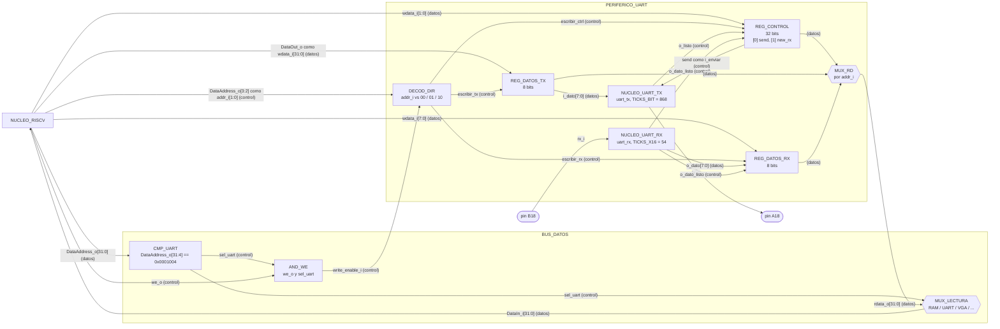

# Nivel 3

Por ahora este nivel solo abre en bloques funcionales el camino de la UART, desde el bus de datos del
núcleo hasta los pines B18 y A18. Los demás bloques del nivel 2 quedan marcados con TODO hasta que
exista su diseño. Todo lo que está dentro de `PERIFERICO_UART` sale de `src/design/periferico_uart.sv`,
`uart_tx.sv` y `uart_rx.sv`.

## Diagrama de tercer nivel

`clk_i` de 100 MHz y `rst_i` entran a todos los registros y a los dos núcleos aunque no se dibujen.
`escribir_tx`, `escribir_ctrl` y `escribir_rx` no son señales con nombre en el `.sv`, son las
condiciones `write_enable_i && addr_i == ...` de cada `always_ff`, y se dibujan aparte para que se vea
qué escritura llega a qué registro.

## CMP_UART

Objetivo. Detectar que el acceso del núcleo cae en el rango de la UART, `0x0001_0040` a `0x0001_004F`.

Entradas.

- `DataAddress_o[31:4]`, del núcleo.

Salidas.

- `sel_uart`, hacia `AND_WE` y `MUX_LECTURA`.

Explicación general. Es un comparador de igualdad contra la constante `0x0001004`. Compara los 28
bits altos y no solo algunos, para que la UART no aparezca repetida en otras direcciones del espacio
de periféricos. `DataAddress_o[3:2]` no entra acá porque esos bits eligen registro dentro del
periférico, y `DataAddress_o[1:0]` siempre vale cero en un `lw` o `sw` alineado.

TODO: Revisar el decodificador del resto de periféricos. Displays en `0x0001_0130` y LED en `0x0001_0138` caen en el mismo bloque de 16 bytes, así que el LED no puede decodificarse con `DataAddress_o[31:4]` como la UART. La tabla de la sección 3.2 de `investigacion-previa.md` les asigna a los dos el mismo `0x13`.

## AND_WE

Objetivo. Dejar pasar la escritura del núcleo solo cuando el acceso es para la UART.

Entradas.

- `we_o`, del núcleo.
- `sel_uart`, de `CMP_UART`.

Salidas.

- `write_enable_i`, hacia `PERIFERICO_UART`.

Explicación general. Una compuerta AND. Sin ella un `sw` a la RAM escribiría también en el registro
de la UART que tenga el mismo `addr_i`.

## MUX_LECTURA

Objetivo. Subir a `DataIn_i` el dato del destino que se está leyendo.

Entradas.

- `rdata_o[31:0]` de `PERIFERICO_UART`, de los demás periféricos y el dato de la RAM.
- `sel_uart` y las demás señales de selección del decodificador.

Salidas.

- `DataIn_i[31:0]`, hacia el núcleo.

Explicación general. Cuando `sel_uart` está en alto elige `rdata_o` de la UART. Ese `rdata_o` es
combinacional dentro del periférico, sale de `addr_i` en el mismo ciclo, así que un `lw` a la UART
tiene su dato en el mismo ciclo en que el núcleo pone la dirección. TODO: Revisar que calce con la temporización de lectura del núcleo y de la RAM cuando existan.

## DECOD_DIR

Objetivo. Elegir cuál de los tres registros recibe una escritura.

Entradas.

- `write_enable_i`, de `AND_WE`.
- `addr_i[1:0]`, que es `DataAddress_o[3:2]`.

Salidas.

- Habilitación de escritura para `REG_DATOS_TX` (`2'b01`), `REG_CONTROL` (`2'b00`) y `REG_DATOS_RX` (`2'b10`).

Explicación general. Tres comparaciones de `addr_i` contra `ADDR_DATOS_TX`, `ADDR_CONTROL` y
`ADDR_DATOS_RX`, cada una en AND con `write_enable_i`. La dirección `2'b11` no habilita nada.

## REG_DATOS_TX

Objetivo. Guardar el byte que el programa quiere mandar.

Entradas.

- `wdata_i[7:0]`, habilitación de `DECOD_DIR`.

Salidas.

- `reg_tx[7:0]`, hacia `NUCLEO_UART_TX` y `MUX_RD`.

Explicación general. Registro de 8 bits con reset síncrono. Solo cambia cuando el programa lo escribe.

## REG_CONTROL

Objetivo. Llevar las dos banderas que el programa sondea, `send` en el bit 0 y `new_rx` en el bit 1.

Entradas.

- `wdata_i[1:0]`, habilitación de `DECOD_DIR`.
- `o_listo`, de `NUCLEO_UART_TX`.
- `o_dato_listo`, de `NUCLEO_UART_RX`.

Salidas.

- `reg_control[0]` (`send`), hacia `i_enviar` de `NUCLEO_UART_TX`.
- `reg_control[31:0]`, hacia `MUX_RD`.

Explicación general. Registro de 32 bits donde solo los bits 0 y 1 tienen lógica, el resto queda en
cero desde el reset. `send` sube cuando el programa escribe un 1 en el bit 0 y baja solo con `o_listo`.
`new_rx` sube con `o_dato_listo` y baja cuando el programa escribe un 0 en el bit 1. Las prioridades
están en `../modulos/PERIFERICO_UART.md`.

## REG_DATOS_RX

Objetivo. Guardar el último byte que llegó por `rx_i`.

Entradas.

- `o_dato[7:0]` y `o_dato_listo`, de `NUCLEO_UART_RX`.
- `wdata_i[7:0]`, habilitación de `DECOD_DIR`.

Salidas.

- `reg_rx[7:0]`, hacia `MUX_RD`.

Explicación general. Registro de 8 bits que carga `o_dato` cuando llega `o_dato_listo`. También se
puede escribir por el bus, pero el byte que llega del núcleo tiene prioridad.

## MUX_RD

Objetivo. Poner en `rdata_o` el registro que apunta `addr_i`.

Entradas.

- `addr_i[1:0]`, `reg_control`, `reg_tx`, `reg_rx`.

Salidas.

- `rdata_o[31:0]`, hacia `MUX_LECTURA`.

Explicación general. Multiplexor de cuatro entradas. Los registros de 8 bits se rellenan con ceros a
32, y `2'b11` devuelve cero.

## NUCLEO_UART_TX

Objetivo. Soltar por `tx_o` el byte de `REG_DATOS_TX` en formato 8N1 a 115200 baudios.

Entradas.

- `i_enviar`, que es `send`, e `i_dato[7:0]`.

Salidas.

- `o_tx`, hacia el pin A18.
- `o_listo`, pulso de un ciclo al terminar, hacia `REG_CONTROL`.

Explicación general. Divisor de baudaje de 868 ciclos, una máquina de cuatro estados que recorre
arranque, ocho datos y parada, y un detector de flanco que produce `o_listo`. El detalle está en
`../modulos/NUCLEO_UART_TX.md`.

## NUCLEO_UART_RX

Objetivo. Recuperar los bytes que llegan por `rx_i`.

Entradas.

- `i_rx`, desde el pin B18.

Salidas.

- `o_dato[7:0]` y `o_dato_listo`, pulso de un ciclo, hacia `REG_DATOS_RX` y `REG_CONTROL`.

Explicación general. Sobremuestreo a 16 veces el baudaje con un divisor de 54 ciclos, una máquina de
cuatro estados que cae al centro de cada bit, y un detector de flanco que produce `o_dato_listo`. El
detalle está en `../modulos/NUCLEO_UART_RX.md`.

## Bloques pendientes

TODO: Revisar y abrir en bloques funcionales `PLL`, `NUCLEO_RISCV`, `ROM`, `RAM`, `PERIFERICO_VGA`, `PERIFERICO_ENTRADAS`, `PERIFERICO_7SEG`, `PERIFERICO_LED` y `PERIFERICO_BUZZER` cuando exista su diseño.

`src/design/` también tiene `arbitro_uart.sv`, `receptor_uart.sv` y `transmisor_uart.sv`, pero son
del Proyecto 2 y no entran en este sistema. Sus docs en `../modulos/` quedan como referencia.

## Funcionamiento en conjunto

Para mandar un byte, el programa hace `sw` del byte a `0x0001_0044`. `CMP_UART` reconoce el rango,
`AND_WE` deja pasar la escritura y `DECOD_DIR` la manda a `REG_DATOS_TX`. Después hace `sw` a
`0x0001_0040` con el bit 0 en 1, lo que sube `send` en `REG_CONTROL`. `NUCLEO_UART_TX` atrapa el byte y
lo suelta bit por bit. Al terminar da un pulso en `o_listo` y `send` baja solo. El programa sabe que
puede mandar el siguiente byte cuando lee `0x0001_0040` y ve el bit 0 en cero.

Para recibir, `NUCLEO_UART_RX` arma el byte y da un pulso en `o_dato_listo`. En ese mismo flanco
`REG_DATOS_RX` guarda el byte y `new_rx` sube. El programa ve el bit 1 en alto en uno de sus sondeos,
lee el byte de `0x0001_0048` y escribe un 0 en el bit 1 de `0x0001_0040` para limpiar la bandera.

Ningún camino detiene al núcleo. Cada acceso a la UART dura lo que dura un `lw` o un `sw`, y las esperas
de la línea serie las absorben `send` y `new_rx`.
