# Diseño, Proyecto 3 Batalla Naval

> Documento consolidado del diseño vigente en la rama `develop`. Reúne en un solo archivo los
> diagramas de nivel 1 a 3 y los docs de cada módulo, que siguen siendo la fuente de cada parte.

## Contenido

- [Nivel 1](#nivel-1)
- [Nivel 2](#nivel-2)
- [Nivel 3](#nivel-3)
- [PROCESADOR_UNICICLO](#procesador_uniciclo)
- [ROM](#rom)
- [RAM](#ram)
- [Address Translator (AT)](#address-translator-at)
- [PERIFERICO_VGA](#periferico_vga)
- [FUENTE_CARACTERES](#fuente_caracteres)
- [PERIFERICO_UART](#periferico_uart)
- [NUCLEO_UART_TX](#nucleo_uart_tx)
- [NUCLEO_UART_RX](#nucleo_uart_rx)
- [PERIFERICO_ENTRADAS](#periferico_entradas)
- [PERIFERICO_7SEG](#periferico_7seg)
- [MARCADOR](#marcador)
- [PERIFERICO_LED](#periferico_led)
- [PERIFERICO_BUZZER](#periferico_buzzer)
- [SECUENCIADOR_MELODIA](#secuenciador_melodia)
- [GENERADOR_TONO](#generador_tono)
- [PROGRAMA](#programa)

---

<!-- Fuente: docs/diseño/diagramas/nivel01.md -->

# Nivel 1

## Diagrama de primer nivel

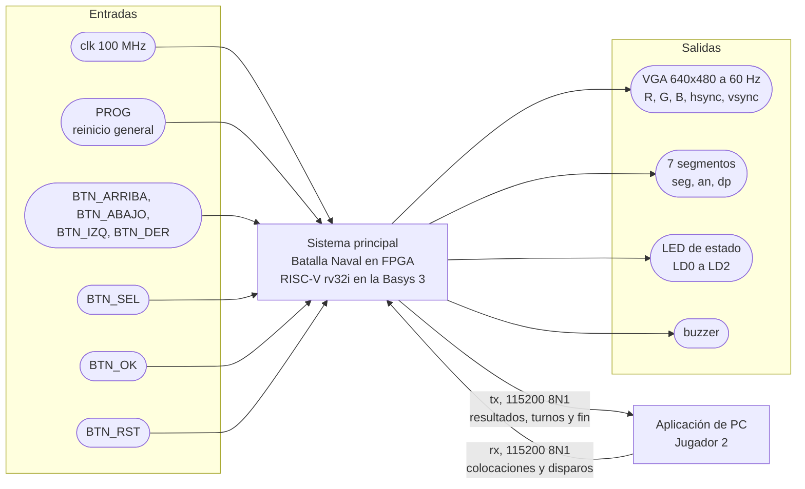
```mermaid
flowchart LR
    subgraph Entradas
        CLK(["clk 100 MHz"])
        RST(["PROG<br/>reinicio general"])
        NAV(["BTN_ARRIBA, BTN_ABAJO,<br/>BTN_IZQ, BTN_DER"])
        SEL(["BTN_SEL"])
        OK(["BTN_OK"])
        BRST(["BTN_RST"])
    end

    SYS["Sistema principal<br/>Batalla Naval en FPGA<br/>RISC-V rv32i en la Basys 3"]
    PC["Aplicación de PC<br/>Jugador 2"]

    subgraph Salidas
        VGA(["VGA 640x480 a 60 Hz<br/>R, G, B, hsync, vsync"])
        DISP(["7 segmentos<br/>seg, an, dp"])
        LED(["LED de estado<br/>LD0 a LD2"])
        BUZ(["buzzer"])
    end

    CLK --> SYS
    RST --> SYS
    NAV --> SYS
    SEL --> SYS
    OK --> SYS
    BRST --> SYS
    PC -->|"rx, 115200 8N1<br/>colocaciones y disparos"| SYS
    SYS -->|"tx, 115200 8N1<br/>resultados, turnos y fin"| PC
    SYS --> VGA
    SYS --> DISP
    SYS --> LED
    SYS --> BUZ
```

## Objetivos

- Implementar una partida de Batalla Naval para dos jugadores con tableros independientes de 8 × 8 y barcos de 4, 3 y 2 casillas.
- Permitir que el Jugador 1 interactúe con la FPGA y que el Jugador 2 lo haga mediante una aplicación de PC.
- Mantener las reglas y los tableros bajo el control del programa ensamblador ejecutado por el procesador de la FPGA.
- Mostrar a cada jugador únicamente la información que le corresponde conocer.

## Descripciones

### Entradas

- `clk`, reloj de 100 MHz de la Basys 3, pin W5. Es el único reloj que entra al sistema.
- PROG, reinicio general del hardware. Es el botón PROG de la Basys 3, que vuelve a configurar la FPGA con el bitstream guardado en la flash. Adentro `rst_i` sale de `locked` del PLL. Es lo único que pone en cero las partidas ganadas.
- `BTN_ARRIBA`, `BTN_ABAJO`, `BTN_IZQ`, `BTN_DER`, navegación del cursor del Jugador 1, en `btnU`, `btnD`, `btnL` y `btnR` de la Basys 3.
- `BTN_SEL`, rota la orientación del barco que se está colocando, en `btnC`.
- `BTN_OK`, confirma una colocación o un disparo, en el switch SW0.
- `BTN_RST`, en el switch SW15. Reinicia la partida y conserva los contadores de ganadas. Lo lee el programa, no reinicia el hardware.
- `rx`, línea serial que llega desde la aplicación de PC por el puente USB-UART, pin B18. Trae las colocaciones y los disparos del Jugador 2.

La Basys 3 trae cinco botones y el enunciado pide siete entradas, por eso `BTN_OK` y `BTN_RST` van en switches. Cuentan al subirlos, y hay que bajarlos antes de volver a usarlos.

### Salidas

- `tx`, línea serial hacia la aplicación de PC por el puente USB-UART, pin A18. Lleva la respuesta a cada colocación, los turnos, los resultados de los disparos y el resumen final.
- `vgaRed[3:0]`, `vgaGreen[3:0]`, `vgaBlue[3:0]`, `Hsync`, `Vsync`, conector VGA de la Basys 3. Muestra al Jugador 1 sus barcos, los resultados conocidos sobre el rival y la fase del juego.
- `seg[6:0]`, `an[3:0]`, `dp`, los cuatro dígitos de 7 segmentos con las partidas ganadas por cada jugador.
- `led[2:0]`, LD0 a LD2, un LED por fase, colocación, batalla y resultado.
- `buzzer`, onda cuadrada para los cinco sonidos del enunciado, en JC4 del Pmod JC (pin P18).

La aplicación de PC es un elemento externo. Presenta al Jugador 2 su tablero, los resultados de sus disparos y el estado de la partida, sin reglas propias.

### Funcionamiento general

Al arrancar, el procesador ejecuta el programa desde la dirección `0x0000_0000`. El programa limpia la pantalla y los tableros en RAM, avisa por `tx` que empieza la colocación y entra al lazo principal.

En la colocación los dos jugadores avanzan a la vez. El lazo sondea los botones del Jugador 1 y los bytes que entran por `rx` sin quedarse esperando a ninguno, así que el Jugador 1 mueve su cursor en el VGA mientras el Jugador 2 manda sus barcos desde la PC. Cada colocación del Jugador 2 recibe por `tx` una respuesta de aceptada o rechazada.

Cuando los dos terminan, arranca la batalla. El turno se alterna tras cada disparo válido y cada resultado se refleja en el VGA, en el buzzer y en un mensaje por `tx`. La partida acaba cuando una flota queda hundida. El resultado se muestra en el VGA y se manda un resumen por `tx`, suena la secuencia de victoria y se suma una partida ganada en los 7 segmentos. El sistema se queda así hasta que se suba `BTN_RST`.

Por `tx` nunca sale nada del tablero del Jugador 1 aparte del resultado de los disparos del Jugador 2. El VGA tampoco dibuja los barcos del Jugador 2. Así ninguno de los dos jugadores puede ver la flota del otro.

En este nivel se muestran las relaciones con los jugadores y dispositivos externos. La organización interna de la FPGA se desarrolla en el nivel 2.

---

<!-- Fuente: docs/diseño/diagramas/nivel02.md -->

# Nivel 2

## Diagrama de segundo nivel

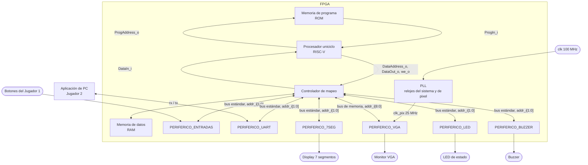
```mermaid
flowchart TD
    CLK(["clk 100 MHz"])

    subgraph FPGA
        PLL["PLL<br/>relojes del sistema y de pixel"]
        ROM["Memoria de programa<br/>ROM"]
        CPU["Procesador uniciclo<br/>RISC-V"]
        MAP["Controlador de mapeo"]
        RAM["Memoria de datos<br/>RAM"]
        GPIO["PERIFERICO_ENTRADAS"]
        UART["PERIFERICO_UART"]
        VGA["PERIFERICO_VGA"]
        DISP["PERIFERICO_7SEG"]
        LEDP["PERIFERICO_LED"]
        BUZ["PERIFERICO_BUZZER"]
    end

    PC["Aplicación de PC<br/>Jugador 2"]
    BTN(["Botones del Jugador 1"])
    MON(["Monitor VGA"])
    SEG(["Display 7 segmentos"])
    LED(["LED de estado"])
    ALTAVOZ(["Buzzer"])

    CLK --> PLL
    PLL -->|"clk_pix 25 MHz"| VGA
    CPU -->|"ProgAddress_o"| ROM
    ROM -->|"ProgIn_i"| CPU
    CPU -->|"DataAddress_o, DataOut_o, we_o"| MAP
    MAP -->|"DataIn_i"| CPU
    MAP <--> RAM
    MAP <-->|"bus estándar, addr_i[1:0]"| GPIO
    MAP <-->|"bus estándar, addr_i[1:0]"| UART
    MAP <-->|"bus de memoria, addr_i[8:0]"| VGA
    MAP <-->|"bus estándar, addr_i[1:0]"| DISP
    MAP <-->|"bus estándar, addr_i[1:0]"| LEDP
    MAP <-->|"bus estándar, addr_i[1:0]"| BUZ
    BTN --> GPIO
    PC <-->|"rx / tx"| UART
    VGA --> MON
    DISP --> SEG
    LEDP --> LED
    BUZ --> ALTAVOZ
```

## Objetivos

- Subdividir el sistema del nivel 1 en sus bloques principales, agrupando dentro de la FPGA el procesador, las memorias y los periféricos.
- Distinguir el camino de instrucciones entre ROM y procesador del camino de datos que pasa por el controlador de mapeo.
- Mostrar que la aplicación de PC es externa a la FPGA y se comunica exclusivamente mediante UART.

## Descripciones

`clk_i` de 33,33 MHz y `rst_i`, que salen los dos del PLL, llegan a todos los bloques, pero se omiten sus líneas repetidas para mantener legible el diagrama.

### Bloque 1: PLL

Saca del único reloj de 100 MHz los dos relojes del sistema, `clk_i` de 33,33 MHz para el procesador, las memorias y los periféricos, y `clk_pix` de 25 MHz para el VGA. Es el módulo `generador_relojes.sv`, y en `top.sv` la red de `clk_i` se llama `clk_sys`. Con openXC7 no hay Clocking Wizard, así que la primitiva `PLLE2_BASE` se instancia a mano. El VCO corre a 1000 MHz (100 MHz × 10), y las dos salidas son divisiones enteras de él, 1000 / 30 = 33,33 MHz y 1000 / 40 = 25 MHz. Como salen del mismo VCO quedan relacionados en fase, que es lo que usa `PERIFERICO_VGA.md` para justificar el cruce de dominios. No hace falta un MMCM, porque no se usa desplazamiento fino de fase ni divisores fraccionarios.

**Por qué 33,33 MHz.** El enunciado exige una sola entrada de 100 MHz y que todo reloj derivado salga de un PLL, pero no fija la frecuencia de `clk_i`. En un uniciclo cada instrucción se completa en un solo ciclo, así que el periodo lo pone el camino de un `lw`: `PC`, ROM, banco de registros, ALU, controlador de mapeo, RAM o periférico, multiplexor de lectura y escritura en el banco. Con el sistema integrado, nextpnr-xilinx da entre 39 y 50 MHz de máximo para `clk_i`, según cómo quede la colocación (44,39 MHz después del ruteo en la versión final). 100 MHz es imposible y 40 MHz queda sin margen en las peores colocaciones. Con 1000 / 30 = 33,33 MHz el periodo es de 30 ns, unos 4 ns más que el camino crítico de la peor colocación medida (39 MHz, 25,6 ns), así que cierra timing en todas. También le sirve a la UART: el receptor sobremuestrea con `TICKS_X16 = 18` y queda con 0,47 % de error, el mismo que a 100 MHz (a 40 MHz serían 22 y 1,4 %).

El costo es que la vuelta más larga del programa sin leer la UART tarda 111 µs, más que los 87 µs que tarda en llegar un byte. Por eso la aplicación de PC deja 1 ms entre los bytes de una trama. El detalle está en [`PROGRAMA.md`](modulos/PROGRAMA.md), sección 4.3.

El enunciado también deja abierta la opción de sacar un reloj aparte para la UART, pero no hace falta. `PERIFERICO_UART` y `PERIFERICO_BUZZER` usan `clk_i` y reciben su frecuencia en el parámetro `CLK_FREQ_HZ = 33_333_333`, del que calculan sus divisores.

- Entradas, `clk` de 100 MHz del pin W5.
- Salidas, `clk_i` de 33,33 MHz hacia todos los bloques, `clk_pix` de 25 MHz hacia `PERIFERICO_VGA` y `locked`, que negado es el `rst_i` de todos los bloques.

No hay pin de reset. El reinicio general es el botón PROG de la Basys 3, que vuelve a configurar la FPGA desde la flash, y `rst_i` queda en alto hasta que el PLL engancha. `~locked` pasa por dos flip-flops en `clk_i` antes de llegar a los bloques.

Las entradas `RST` y `PWRDWN` de la `PLLE2_BASE` quedan sin conectar, no atadas a `1'b0`. Con una constante, nextpnr-xilinx rutea el pin y escribe mal su bit de inversión (`ZINV_RST`), y el PLL queda en reinicio para siempre, sin `locked` y sin salidas. Eso se vio en la tarjeta. Sin conectar es como usa la primitiva LiteX con este mismo flujo, y equivale a dejarlas en cero.

Para que PROG funcione como reinicio, el bitstream se graba en la flash (`make flash`) y el jumper JP1 queda en QSPI. Con la configuración por defecto la FPGA lee la flash a unos 3 MHz y tarda unos 6 s en cargar el diseño, todo ese tiempo sin VGA ni displays. `make bitstream` pasa el `.bit` por `src/fpga/velocidad_config.py`, que sube esa lectura a 33 MHz (el mismo valor que pone Vivado con `BITSTREAM.CONFIG.CONFIGRATE 33`), y la carga baja a unos 0,5 s.

### Bloque 2: Procesador uniciclo

Ejecuta el programa ensamblador que organiza las colocaciones, los turnos, los disparos y el resultado. Solicita instrucciones a la ROM y lee o escribe RAM y periféricos mediante el controlador de mapeo. Para el procesador la RAM y los periféricos son lo mismo, direcciones a las que se les hace `lw` o `sw`, por eso no necesita instrucciones de entrada y salida. La lógica de las reglas reside en el programa, no en los periféricos.

- Entradas, `clk_i`, `rst_i`, `ProgIn_i[31:0]` desde la ROM y `DataIn_i[31:0]` desde el controlador de mapeo.
- Salidas, `ProgAddress_o[31:0]` hacia la ROM, y `DataAddress_o[31:0]`, `DataOut_o[31:0]` y `we_o` hacia el controlador de mapeo.

### Bloque 3: Memoria de programa (ROM)

Guarda las instrucciones del programa. Ocupa `0x0000_0000` a `0x0000_1FFF`, 8 KB, y el vector de reset está en `0x0000_0000`, así que el programa empieza en la primera palabra. Su camino es independiente del acceso a los datos.

- Entradas, `ProgAddress_o[31:0]` del procesador.
- Salidas, `ProgIn_i[31:0]` hacia el procesador.

### Bloque 4: Memoria de datos (RAM)

Guarda los tableros, el turno, el progreso de colocación, los contadores de la partida y la pila. Ocupa `0x0000_2000` a `0x0000_2FFF`, 4 KB. El procesador accede a ella a través del controlador de mapeo, y la organización de los datos adentro está en el nivel 3.

- Entradas, dirección, dato de escritura y habilitación de escritura desde el controlador de mapeo.
- Salidas, dato leído hacia el multiplexor de lectura del controlador de mapeo.

### Bloque 5: Controlador de mapeo

Decodifica las direcciones de datos, selecciona RAM o el periférico correspondiente y devuelve al procesador el dato leído. Deja pasar `we_o` solo hacia el destino de la dirección, y su multiplexor de lectura elige cuál `rdata_o` sube a `DataIn_i`. A la UART le llega `DataAddress_o[3:2]` como `addr_i[1:0]`, porque sus registros van de 4 en 4 bytes. Entradas, displays, LED y buzzer tienen un solo registro y el AT solo selecciona esa palabra, así que reciben `addr_i` fijo en `2'b00`. No interviene en la conexión independiente con la ROM. Su parte de decodificación es el Address Translator, detallado en [`Address_Translator.md`](modulos/Address_Translator.md).

- Entradas, `DataAddress_o[31:0]`, `DataOut_o[31:0]` y `we_o` del procesador, y el `rdata_o[31:0]` de cada periférico junto con el dato leído de la RAM.
- Salidas, `write_enable_i`, `addr_i` y `wdata_i[31:0]` hacia cada periférico y las señales equivalentes hacia la RAM, y `DataIn_i[31:0]` hacia el procesador.

### Bloque 6: PERIFERICO_ENTRADAS

Registra las siete entradas del Jugador 1, cinco botones y dos switches, y expone su estado al procesador en un registro de lectura en `0x0001_0120`. El programa interpreta la navegación, la selección, la confirmación y el reinicio, y saca los flancos comparando con la lectura anterior.

- Entradas, bus estándar y las siete entradas del Jugador 1.
- Salidas, `rdata_o[31:0]` hacia el multiplexor de lectura.

### Bloque 7: PERIFERICO_UART

Mueve bytes entre el programa y la aplicación de PC, y es el único canal que tiene el Jugador 2 con la partida. Es el periférico del Proyecto 2 que pide reutilizar la sección 4.5.3 del enunciado, con el mapa de registros de la tabla 4.4.3, control en `0x0001_0040`, datos de transmisión en `0x0001_0044` y datos de recepción en `0x0001_0048`. No entiende las tramas del juego. Manda el byte que el programa escribe y avisa con una bandera cuando llega uno. Armar y validar las tramas es trabajo del programa. El detalle está en [`PERIFERICO_UART.md`](modulos/PERIFERICO_UART.md).

- Entradas, bus estándar y `rx_i` desde el pin B18.
- Salidas, `rdata_o[31:0]` hacia el multiplexor de lectura y `tx_o` hacia el pin A18.

### Bloque 8: PERIFERICO_VGA

Lee su mapa de casillas para generar la imagen del Jugador 1 a 640 × 480 a 60 Hz. Se expone como una memoria de video en `0x0001_1000` a `0x0001_17FF`, una palabra por casilla de la cuadrícula. El procesador escribe por el reloj del sistema y la lógica de video lee por el reloj de pixel. El periférico genera los sincronismos y la imagen, sin aplicar reglas del juego. El detalle está en [`PERIFERICO_VGA.md`](modulos/PERIFERICO_VGA.md).

- Entradas, bus de memoria con `addr_i[8:0]`, y `clk_pix` del PLL.
- Salidas, `rdata_o[31:0]` hacia el multiplexor de lectura, y `vgaRed[3:0]`, `vgaGreen[3:0]`, `vgaBlue[3:0]`, `Hsync` y `Vsync`.

### Bloque 9: PERIFERICO_7SEG

Presenta las victorias acumuladas de ambos jugadores, dos dígitos para cada uno, de 00 a 99. El programa lleva los contadores en BCD y los escribe en `0x0001_0130`. El periférico solo guarda lo escrito y hace el barrido de los dígitos.

- Entradas, bus estándar.
- Salidas, `rdata_o[31:0]` hacia el multiplexor de lectura, y `seg[6:0]`, `an[3:0]` y `dp`.

### Bloque 10: PERIFERICO_LED

Distingue colocación, batalla y resultado con un LED por fase. El programa escribe el patrón en `0x0001_0138` cada vez que cambia de fase.

- Entradas, bus estándar.
- Salidas, `rdata_o[31:0]` hacia el multiplexor de lectura, y `led[2:0]`.

### Bloque 11: PERIFERICO_BUZZER

Genera los sonidos de colocación inválida, impacto, fallo, barco hundido y victoria. El programa escribe el código del evento en `0x0001_0140` y el periférico produce la señal sonora.

- Entradas, bus estándar.
- Salidas, `rdata_o[31:0]` hacia el multiplexor de lectura, y `buzzer`.

### Elemento externo: Aplicación de PC

Permite al Jugador 2 elegir acciones y ver sus tableros, turno y resultados. Se comunica con la FPGA por UART y no decide reglas ni recibe ubicaciones ocultas del Jugador 1.

Es `sw/batalla_pc.py`, en Python con `pyserial`, y corre en una terminal de Linux, macOS o WSL (lee el teclado con `termios`). Se divide en `enlace.py` (puerto serie y 1 ms entre bytes), `protocolo.py` (armado y decodificación de tramas), `partida.py` (lo que la PC recuerda para dibujar, a partir de las respuestas de la FPGA), `vista.py` y `dibujo.py` (los dos tableros, escalados al tamaño de la terminal) y `terminal.py` (teclado sin eco). Las flechas o `h`, `j`, `k`, `l` mueven el cursor, `r` rota el barco, `Enter` coloca o dispara y `Esc` sale. Manda una trama por vez y espera su respuesta hasta 2 s antes de dejar reintentar.

### Interfaz principal

- **ROM ↔ procesador.** `ProgAddress_o` y `ProgIn_i` son los nombres indicados en el enunciado.
- **Procesador ↔ controlador.** `DataAddress_o`, `DataOut_o`, `we_o` y `DataIn_i` son los nombres indicados en el enunciado.
- **Controlador ↔ periféricos de registros.** Bus estándar de la sección 4.5.5, `clk_i`, `rst_i`, `write_enable_i`, `addr_i[1:0]`, `wdata_i[31:0]` y `rdata_o[31:0]`.
- **Controlador ↔ VGA.** El mismo bus pero con `addr_i[8:0]`, porque el VGA se comporta como memoria.
- **UART ↔ aplicación de PC.** Enlace serial bidireccional a 115200 baudios, la PC actúa como interfaz del Jugador 2.

## Funcionamiento general

Todo gira alrededor del procesador. Toma instrucciones de la ROM por su bus de programa y usa el bus de datos para todo lo demás. Cada `lw` o `sw` pasa por el controlador de mapeo, que decide por la dirección si el acceso va a la RAM o a un periférico. Así el mismo par de instrucciones sirve para leer un tablero en RAM, pintar una casilla en el VGA o mandar un byte por la UART.

Ningún periférico decide nada del juego. El de entradas dice qué botón está presionado, el de la UART dice que llegó un byte, y el programa decide qué significan. En sentido contrario, el programa escribe un color en la memoria de video, un número en los 7 segmentos o un byte en la UART, y cada periférico se encarga de la parte física, sea temporización, multiplexado o formación del bit serie.

Como ningún acceso detiene al procesador, el lazo principal puede sondear botones y UART en la misma vuelta. En eso se apoya la colocación concurrente de los dos jugadores.

---

<!-- Fuente: docs/diseño/diagramas/nivel03.md -->

# Nivel 3

## Diagrama de tercer nivel

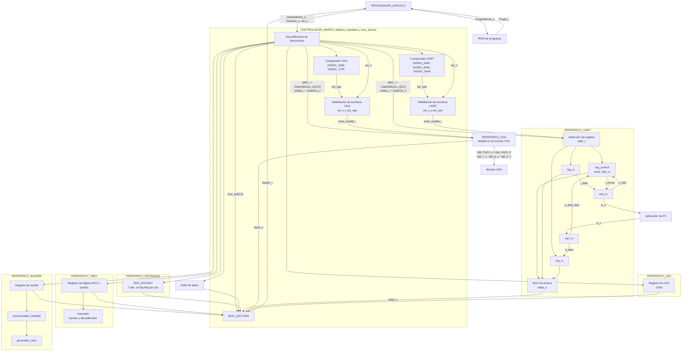
```mermaid
flowchart TD
    CPU["PROCESADOR_UNICICLO"]
    ROM["ROM de programa"]
    RAM["RAM de datos"]

    subgraph MAP["CONTROLADOR_MAPEO: address_translator y mux_lectura"]
        DIR["Decodificación de direcciones"]
        CMP_UART["Comparador UART<br/>0x0001_0040, 0x0001_0044, 0x0001_0048"]
        AND_WE["Habilitación de escritura UART<br/>we_o y sel_uart"]
        CMP_VGA["Comparador VGA<br/>0x0001_1000-0x0001_17FF"]
        AND_WE_VGA["Habilitación de escritura VGA<br/>we_o y sel_vga"]
        RMUX["MUX_LECTURA"]
        DIR --> CMP_UART
        CMP_UART -->|"sel_uart"| AND_WE
        DIR --> CMP_VGA
        CMP_VGA -->|"sel_vga"| AND_WE_VGA
        DIR -->|"mux_sel[2:0]"| RMUX
    end

    subgraph GPIO["PERIFERICO_ENTRADAS"]
        BTNREG["REG_ESTADO<br/>7 bits, un flip-flop por pin"]
    end

    subgraph PUART["PERIFERICO_UART"]
        DEC_UART["Selección de registro<br/>addr_i"]
        REG_CTRL["reg_control<br/>send, new_rx"]
        REG_TX["reg_tx"]
        REG_RX["reg_rx"]
        MUX_UART["MUX de lectura<br/>rdata_o"]
        TX["uart_tx"]
        RX["uart_rx"]
        DEC_UART --> REG_CTRL
        DEC_UART --> REG_TX
        DEC_UART --> REG_RX
        REG_CTRL --> MUX_UART
        REG_TX --> MUX_UART
        REG_RX --> MUX_UART
        REG_TX -->|"i_dato"| TX
        REG_CTRL -->|"i_enviar"| TX
        TX -->|"o_listo"| REG_CTRL
        RX -->|"o_dato"| REG_RX
        RX -->|"o_dato_listo"| REG_CTRL
    end

    VGA["PERIFERICO_VGA<br/>detalle en la sección VGA"]
    MON["Monitor VGA"]

    subgraph DISP["PERIFERICO_7SEG"]
        DREG["Registro de dígitos BCD y puntos"] --> SCAN["marcador<br/>barrido y decodificador"]
    end

    subgraph PLED["PERIFERICO_LED"]
        LREG["Registro de LED<br/>3 bits"]
    end

    subgraph BUZ["PERIFERICO_BUZZER"]
        BREG["Registro de sonido"] --> SEQ["secuenciador_melodia"] --> TONE["generador_tono"]
    end

    CPU -->|"ProgAddress_o"| ROM
    ROM -->|"ProgIn_i"| CPU
    CPU -->|"DataAddress_o, DataOut_o, we_o"| DIR
    RMUX -->|"DataIn_i"| CPU
    DIR --> RAM
    RAM --> RMUX
    DIR --> BTNREG
    BTNREG --> RMUX
    DIR -->|"we_o"| AND_WE
    DIR -->|"addr_i = DataAddress_o[3:2]<br/>wdata_i = DataOut_o"| DEC_UART
    AND_WE -->|"write_enable_i"| DEC_UART
    MUX_UART -->|"rdata_o"| RMUX
    DIR -->|"we_o"| AND_WE_VGA
    DIR -->|"addr_i = DataAddress_o[10:2]<br/>wdata_i = DataOut_o"| VGA
    AND_WE_VGA -->|"write_enable_i"| VGA
    VGA -->|"rdata_o"| RMUX
    VGA -->|"vga_hsync_o, vga_vsync_o<br/>vga_r_o, vga_g_o, vga_b_o"| MON
    DIR --> DREG
    DREG --> RMUX
    DIR --> LREG
    LREG --> RMUX
    DIR --> BREG
    BREG --> RMUX
    APP["Aplicación de PC"] -->|"rx_i"| RX
    TX -->|"tx_o"| APP
```

El procesador aparece como **un solo bloque**, sin mostrar sus partes internas. ROM y RAM son bloques separados: ROM entrega instrucciones directamente al procesador y RAM comparte el camino de datos con los periféricos. Dentro de `CONTROLADOR_MAPEO` se muestran la decodificación, el comparador de UART y el de VGA como ejemplos de la habilitación de escritura, y el multiplexor de lectura. Es el RTL de `address_translator.sv` y `mux_lectura.sv`, instanciado en `top.sv`. Los demás destinos tienen comparadores y habilitaciones equivalentes que no se dibujan. `clk_i` y `rst_i` llegan a todos los periféricos, aunque no se repitan en cada registro del dibujo.

## Observaciones de integración

- **Entradas.** `PERIFERICO_ENTRADAS` registra los siete pines en un flip-flop cada uno y los expone en un registro de estado. No lleva antirrebote ni sincronizador de dos etapas, con la autorización del profesor (los botones de la Basys 3 ya llegan filtrados). El programa saca los flancos y decide cómo usar cada pulsación.
- **Display y LED.** `PERIFERICO_7SEG` guarda cuatro dígitos BCD y sus puntos, y el `marcador` los barre en los cuatro displays. `PERIFERICO_LED` guarda tres bits, un LED por fase. El programa escribe las partidas ganadas y la fase.
- **Buzzer.** `PERIFERICO_BUZZER` recibe un código de sonido. El `secuenciador_melodia` toca sus notas y el `generador_tono` arma la onda cuadrada. El programa determina qué evento ocurrió.
- **Aplicación de PC.** Envía y recibe bytes por UART. La interpretación de colocaciones, turnos y disparos corresponde al programa ejecutado por el procesador. El periférico UART solo transporta bytes.

## Controlador de mapeo

Este bloque se sitúa entre el bus de datos del procesador y la RAM o los periféricos. Recibe `DataAddress_o`, `DataOut_o` y `we_o`; devuelve por `DataIn_i` el dato del destino seleccionado. La ROM de programa usa su propio camino hacia el procesador y no pasa por este controlador. La lógica del controlador **solo encamina accesos**: no decide turnos, disparos ni resultados del juego.

El decodificador compara la dirección completa con el mapa de memoria y genera una selección para un único destino. La RAM ocupa `0x0000_2000`–`0x0000_2FFF`; UART, `0x0001_0040`–`0x0001_004F`; y VGA, `0x0001_1000`–`0x0001_17FF`. Los registros de botones, display, LED y buzzer se seleccionan en sus direcciones respectivas. En particular, display (`0x0001_0130`) y LED (`0x0001_0138`) **no** pueden distinguirse comparando solo `DataAddress_o[31:4]`, porque comparten esos bits altos.

En una escritura, `DataOut_o` llega al destino, pero su habilitación se activa únicamente cuando coinciden `we_o` y la señal de selección correspondiente. Para UART es `write_enable_i = we_o && sel_uart`, donde `sel_uart` sale de comparar la dirección completa con `0x0001_0040`, `0x0001_0044` y `0x0001_0048`. En `top.sv`, `DataAddress_o[3:2]` llega como `addr_i[1:0]` y escoge los registros de control, TX o RX. `0x0001_004C` no es ninguna de las tres, así que no selecciona la UART. El controlador genera habilitaciones equivalentes e independientes para RAM y los demás destinos, así un `sw` a uno no modifica otro.

En una lectura, `MUX_LECTURA` selecciona el dato de RAM o la salida `rdata_o` del periférico indicado y lo entrega a `DataIn_i`. Una dirección sin destino, o no alineada a palabra, no habilita ninguna escritura y se lee como cero. Como el procesador es uniciclo, el camino de lectura es combinacional de punta a punta, y la implementación del sistema completo cierra *timing* a 33,33 MHz con ese camino incluido.

## PERIFERICO_UART

El bloque es `src/design/periferico_uart.sv` con sus dos submódulos, `uart_tx.sv` y `uart_rx.sv`. La ficha completa está en [`PERIFERICO_UART.md`](modulos/PERIFERICO_UART.md).

- **Interfaz del bus:** `clk_i`, `rst_i`, `write_enable_i`, `addr_i[1:0]`, `wdata_i[31:0]` y `rdata_o[31:0]`. Los pines seriales son `rx_i` y `tx_o`.
- **Selección interna:** `addr_i=00` selecciona `reg_control` en `0x0001_0040`; `01` selecciona `reg_tx` en `0x0001_0044`; `10` selecciona `reg_rx` en `0x0001_0048`. La combinación `11` no está asignada, devuelve cero al leer y no escribe ningún registro.
- **Transmisión:** el programa escribe un byte en `reg_tx` y luego pone `reg_control[0]` (`send`) en uno. `uart_tx` toma el byte, lo transmite y emite `o_listo`. El registro baja `send` al terminar. Con `clk_i` de 33,33 MHz y 115200 baudios, el periférico le pasa al núcleo TX `TICKS_BIT=289`, calculado desde `CLK_FREQ_HZ`.
- **Recepción:** `uart_rx` reconstruye el byte entrante con sobremuestreo, lo entrega como `o_dato` y pulsa `o_dato_listo`. Entonces se carga `reg_rx` y sube `reg_control[1]` (`new_rx`). Tras leer el byte, el programa limpia esa bandera escribiendo cero en el bit 1 del registro de control. Con `clk_i` de 33,33 MHz, el núcleo RX recibe `TICKS_X16=18`.
- **Lectura:** `rdata_o` selecciona combinacionalmente control, TX o RX y extiende a 32 bits los bytes de datos. Un nuevo byte recibido tiene prioridad frente a una escritura del CPU a `reg_rx` o al bit `new_rx` en el mismo ciclo.

El periférico tiene **un único maestro, el procesador**, así que no lleva el árbitro que tenía la UART del Proyecto 2. Está instanciado en `top.sv` como `u_periferico_uart`.

## VGA
Este bloque corresponde al módulo que conecta al procesador (CPU) con el monitor mediante el estándar de video VGA. La ficha completa, con los puntos a) a j), está en [`modulos/PERIFERICO_VGA.md`](modulos/PERIFERICO_VGA.md).

- **Entradas**
  - Lado del bus: `clk_i`, `rst_i`, `write_enable_i`, `addr_i[8:0]` y `wdata_i[31:0]`, desde el controlador de mapeo.
  - Lado del monitor: `clk_pix_i` de 25 MHz, desde el PLL del top.
- **Salidas**
  - Lado del bus: `rdata_o[31:0]`, hacia `MUX_LECTURA`.
  - Lado del monitor: `vga_hsync_o`, `vga_vsync_o`, `vga_r_o[3:0]`, `vga_g_o[3:0]` y `vga_b_o[3:0]`.

- **Selección:** el controlador compara `DataAddress_o[31:11]` con `0x00022` para obtener `sel_vga`, que cubre `0x0001_1000`–`0x0001_17FF`. La escritura se habilita con `write_enable_i = we_o && sel_vga`, y `DataAddress_o[10:2]` llega como `addr_i`.
- **Memoria de video:** RAM distribuida de doble puerto de 512 × 32 bits, una palabra por casilla de una cuadrícula de 20 × 15 casillas de 32 × 32 píxeles. El puerto A atiende al CPU igual que la RAM de datos del núcleo: escribe en el flanco de `clk_i` y lee de forma combinacional, así un `lw` recibe el dato en el mismo ciclo. El puerto B lo lee el barrido de forma continua y registra el color con `clk_pix_i`.
- **Barrido:** dos contadores (módulo 800 y módulo 525) y sus comparadores generan `hsync`, `vsync` y `video_on` para 640 × 480 a 60 Hz. El índice de la casilla es `fila × 20 + col`, con `col = h_count[9:5]` y `fila = v_count[8:5]`.
- **Salida:** los bits `[2:0]` de la palabra son el color de fondo de la casilla y pasan por una paleta a RGB444. El bit `[3]` dibuja una línea negra en el contorno de la casilla (el grid de los tableros). Los bits `[9:4]` y `[15:10]` son dos caracteres encima, uno en cada mitad de la casilla, en ASCII − 32 y con la fuente de 5 × 7 de `FUENTE_CARACTERES`. El bit `[16]` dibuja solo el primero, centrado. El píxel se fuerza a negro fuera del área visible y se registra junto con los sincronismos, que se retrasan lo mismo que la lectura del puerto B.

## Programa en ensamblador

El programa corre en `PROCESADOR_UNICICLO` desde la ROM y es el único lugar donde viven las reglas del juego. Los periféricos solo exponen entradas y salidas, y la aplicación de PC solo muestra lo que el programa le manda. En este nivel el programa se abre en cuatro diagramas de flujo: el flujo general, la fase de colocación, la fase de batalla y el fin de partida. Las cajas con nombre en mayúsculas (`NUEVA_PARTIDA`, `VALIDAR_COLOCACION`, `PROCESAR_DISPARO`) son subrutinas, y su detalle, junto con el armado de tramas UART, el cursor y la vista previa, va en el doc de nivel 4 del programa.

### El núcleo y lo que implica para el programa

El procesador es el núcleo de ciclo único de [riscv-simple-sv](diagramas/https://github.com/tilk/riscv-simple-sv). Implementa el conjunto `rv32i` completo salvo las instrucciones de sistema (`ecall`, `ebreak` y los CSR), y trata `fence` como una instrucción que no hace nada. Eso cubre la lista base del instructivo y además `lui`, `auipc`, las cargas y escrituras de byte y media palabra (`lb`, `lbu`, `lh`, `lhu`, `sb`, `sh`) y los saltos sin signo (`bltu`, `bgeu`). La extensión de multiplicación y división viene desactivada.

Para el programa eso significa:

- **Las direcciones se arman con `lui`.** Cada dirección base sale de una sola instrucción (tabla de abajo). El programa usa la lista base del instructivo más `lui`, así que puede usar `li`, pero no `la` ni `call`, que se expanden con `auipc`. Las subrutinas se llaman con `jal ra, NOMBRE`.
- **Los periféricos y la memoria de video se acceden solo con `lw` y `sw`.** El núcleo genera habilitaciones por byte para `sb` y `sh`, pero la interfaz estándar de periféricos del instructivo no las tiene. Un `sb` a un periférico escribiría la palabra entera con el dato desplazado. En la RAM las variables y las casillas también ocupan una palabra, para que todo el programa use las mismas dos instrucciones de memoria.
- **No hay `mul`.** Los índices salen con desplazamientos: `fila × 8 = fila << 3` para los tableros y `fila × 20 = (fila << 4) + (fila << 2)` para la memoria de video.
- **La ROM no está en el bus de datos.** El Address Translator no la mapea, así que el programa no puede leer tablas constantes de la ROM con `lw`. Las constantes van como inmediatos. La longitud de un barco, por ejemplo, sale de `4 − id` (4, 3 y 2 casillas para los id 0, 1 y 2).

### Registros base

| Registro | Valor | Cómo se arma | Qué se alcanza con él |
|---|---|---|---|
| `s0` | `0x0001_0000` | `lui s0, 0x10` | Registros de periféricos, desplazamientos `0x040` a `0x140` |
| `s1` | `0x0001_1000` | `lui s1, 0x11` | Memoria de video, casillas 0 a 299 (desplazamiento máximo 1196) |
| `s2` | `0x0000_2000` | `lui s2, 0x2` | Variables en RAM, desplazamientos `0x000` a `0x7FF` |
| `sp` | `0x0000_3000` | `lui sp, 0x3` | Tope de la pila, que crece hacia abajo |

Los desplazamientos de `lw` y `sw` son de 12 bits con signo (−2048 a 2047). Con estas bases todas las direcciones que usa el programa quedan dentro de ese alcance. Estos cuatro registros se cargan al arrancar y ninguna subrutina los modifica.

| Acceso | Instrucción | Dirección |
|---|---|---|
| Control y estado de la UART | `lw`/`sw` `0x040(s0)` | `0x0001_0040` |
| Dato a transmitir | `sw` `0x044(s0)` | `0x0001_0044` |
| Dato recibido | `lw` `0x048(s0)` | `0x0001_0048` |
| Botones del Jugador 1 | `lw` `0x120(s0)` | `0x0001_0120` |
| Displays de 7 segmentos | `sw` `0x130(s0)` | `0x0001_0130` |
| LED de estado | `sw` `0x138(s0)` | `0x0001_0138` |
| Buzzer | `sw` `0x140(s0)` | `0x0001_0140` |
| Casilla `(f, c)` del tablero del Jugador 1 en pantalla | `sw` `4 × ((4 + f) × 20 + 1 + c)(s1)` | `0x0001_1000` a `0x0001_17FF` |
| Casilla `(f, c)` del tablero del Jugador 2 en pantalla | `sw` `4 × ((4 + f) × 20 + 11 + c)(s1)` | `0x0001_1000` a `0x0001_17FF` |

Las posiciones de los tableros en pantalla (filas 4 a 11, columnas 1 a 8 y 11 a 18) siguen la distribución de [`PERIFERICO_VGA.md`](modulos/PERIFERICO_VGA.md).

### Organización de la RAM

Cada casilla de un tablero es una palabra, en el índice `fila × 8 + columna`. Sus bits `[1:0]` guardan el estado con los mismos códigos que la paleta del VGA, y los bits `[3:2]` guardan el id del barco que la ocupa.

| `[1:0]` | Estado | Color VGA |
|---|---|---|
| `00` | Agua sin disparar | `000`, agua |
| `01` | Barco sin disparar | `001`, barco propio |
| `10` | Impacto | `010`, impacto |
| `11` | Fallo | `011`, fallo |

Con esta codificación una casilla ya disparada es la que tiene el bit 1 en uno, y el tablero propio del Jugador 1 se pinta copiando el estado tal cual.

| Dirección | Variable | Contenido |
|---|---|---|
| `0x0000_2000` a `0x0000_20FF` | `tablero_j1[64]` | Casillas del Jugador 1 |
| `0x0000_2100` a `0x0000_21FF` | `tablero_j2[64]` | Casillas del Jugador 2 |
| `0x0000_2200` | `fase` | 0 colocación, 1 batalla, 2 resultado |
| `0x0000_2204` | `turno` | 0 Jugador 1, 1 Jugador 2 |
| `0x0000_2208` | `colocados_j1` | Barcos colocados por el Jugador 1, de 0 a 3. El Jugador 1 coloca en orden, así que también es el id del barco que sigue |
| `0x0000_220C` | `colocados_j2` | Máscara `[2:0]` con un bit por id, porque la PC manda el id de cada barco |
| `0x0000_2210` | `cursor_fila` | Fila del cursor del Jugador 1 |
| `0x0000_2214` | `cursor_col` | Columna del cursor del Jugador 1 |
| `0x0000_2218` | `orientacion` | 0 horizontal, 1 vertical |
| `0x0000_221C` | `botones_prev` | Lectura anterior de los botones, para sacar los flancos |
| `0x0000_2220` a `0x0000_2228` | `impactos_j1[3]` | Impactos recibidos por cada barco del Jugador 1 |
| `0x0000_222C` a `0x0000_2234` | `impactos_j2[3]` | Impactos recibidos por cada barco del Jugador 2 |
| `0x0000_2238` | `disparos_j1` | Disparos válidos del Jugador 1, para el resumen |
| `0x0000_223C` | `disparos_j2` | Disparos válidos del Jugador 2, para el resumen |
| `0x0000_2240` | `hundidos_por_j1` | Barcos del Jugador 2 hundidos por el Jugador 1 |
| `0x0000_2244` | `hundidos_por_j2` | Barcos del Jugador 1 hundidos por el Jugador 2 |
| `0x0000_2248` | `ganadas_bcd` | Partidas ganadas en BCD, con el mismo formato que `REG_DIGITOS` del display: `[15:8]` Jugador 1, `[7:0]` Jugador 2 |
| `0x0000_224C` | `rx_indice` | Posición del próximo byte dentro de la trama UART que se está armando |
| `0x0000_2250` a `0x0000_2260` | `rx_trama[5]` | Bytes de la trama UART en armado |
| `0x0000_2FFC` hacia abajo | pila | Direcciones de retorno y registros que guardan las subrutinas |

Un barco está hundido cuando `impactos_jX[id]` llega a `4 − id`, y la partida termina cuando `hundidos_por_jX` llega a 3 (los 9 impactos de la flota). `NUEVA_PARTIDA` limpia todo lo anterior salvo `ganadas_bcd`, que solo se pone en cero en el arranque por `rst_i`.

### Códigos que escribe el programa en los periféricos

- **LED de estado:** `00` colocación, `01` batalla, `10` resultado.
- **Buzzer:** los códigos de `REG_SONIDO`, `001` impacto, `010` fallo, `011` hundido, `100` colocación inválida y `101` victoria. Un código nuevo corta al que esté sonando, así que un disparo que hunde un barco escribe solo `011`, y el que termina la partida escribe solo `101`.
- **Displays:** `ganadas_bcd` completo, en una sola escritura.

### Mensajes UART que usa el flujo

Todos los mensajes, en los dos sentidos, son tramas de 5 bytes con el mismo formato:

```
+--------+--------+--------+--------+--------------------+
|  0xAA  |  TIPO  |   D1   |   D2   | TIPO xor D1 xor D2 |
+--------+--------+--------+--------+--------------------+
  inicio   mensaje  dato 1   dato 2   verificación
```

- **Inicio `0xAA`.** Si el primer byte no es `0xAA`, el receptor lo descarta y sigue buscando. Así se vuelve a sincronizar si se pierde un byte.
- **Longitud fija.** El receptor en ensamblador es un contador de 0 a 4 (`rx_indice`), y la aplicación de PC usa el mismo lector.
- **Verificación XOR.** Detecta bytes corruptos. Junto con el inicio y la revisión de rangos cumple el requisito de descartar todo byte que no forme un mensaje válido.
- **Casilla en un byte.** Toda casilla viaja como `(fila << 4) | columna`, con fila y columna de 0 a 7.

| TIPO | Sentido | Mensaje | D1 | D2 |
|---|---|---|---|---|
| `0x10` | PC a FPGA | Colocar barco | id en `[1:0]` (0 a 2), orientación en el bit 7 (0 horizontal, 1 vertical) | casilla inicial |
| `0x11` | PC a FPGA | Disparo | casilla objetivo en el tablero del Jugador 1 | `0x00` |
| `0x20` | FPGA a PC | Estado | `00` colocación, `01` batalla, `10` turno, `11` fin | en turno, el jugador que lo tiene (0 J1, 1 J2). En fin, el ganador. En los demás, `0x00` |
| `0x21` | FPGA a PC | Resultado de colocación | id del barco | `00` válida, `01` traslape, `10` fuera de tablero, `11` barco ya colocado |
| `0x22` | FPGA a PC | Disparo dado (del Jugador 2) | casilla | `00` impacto, `01` fallo, `10` hundido, `11` repetido |
| `0x23` | FPGA a PC | Disparo recibido (del Jugador 1 sobre el tablero del Jugador 2) | casilla | `00` impacto, `01` fallo, `10` hundido |
| `0x24` | FPGA a PC | Resumen de disparos | `disparos_j1` | `disparos_j2` |
| `0x25` | FPGA a PC | Resumen de hundidos | `hundidos_por_j1` | `hundidos_por_j2` |

Disparo dado lleva la casilla para que la PC no tenga que recordar qué mandó, y el código `11` le avisa que el disparo se ignoró por repetido y que tiene que pedir otra casilla. Disparo recibido lleva la casilla porque la PC no tiene otra forma de saber dónde disparó el Jugador 1. El resumen son cuatro números, así que va en dos tramas.

Un byte que no completa una trama válida, o una trama válida que no corresponde a la fase o al turno en curso, se descarta sin respuesta y sin afectar la partida.

### Flujo general

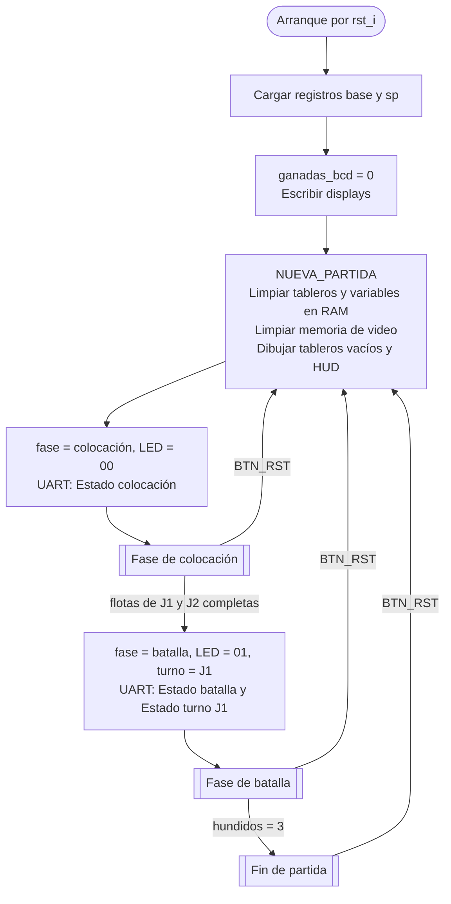
```mermaid
flowchart TD
    ARR(["Arranque por rst_i"]) --> BASE["Cargar registros base y sp"]
    BASE --> GAN["ganadas_bcd = 0<br/>Escribir displays"]
    GAN --> NP["NUEVA_PARTIDA<br/>Limpiar tableros y variables en RAM<br/>Limpiar memoria de video<br/>Dibujar tableros vacíos y HUD"]
    NP --> INI["fase = colocación, LED = 00<br/>UART: Estado colocación"]
    INI --> COL[["Fase de colocación"]]
    COL -->|"flotas de J1 y J2 completas"| BAT0["fase = batalla, LED = 01, turno = J1<br/>UART: Estado batalla y Estado turno J1"]
    BAT0 --> BAT[["Fase de batalla"]]
    BAT -->|"hundidos = 3"| FIN[["Fin de partida"]]
    COL -->|"BTN_RST"| NP
    BAT -->|"BTN_RST"| NP
    FIN -->|"BTN_RST"| NP
```

El programa tiene dos entradas. El arranque por `rst_i` es el reinicio general del sistema: carga los registros base y pone en cero las partidas ganadas. `BTN_RST` salta directo a `NUEVA_PARTIDA` y conserva las ganadas, como pide el instructivo.

Cada fase es un **lazo que nunca espera**. En cada vuelta el programa lee los botones una vez, atiende como máximo un byte de la UART y vuelve a empezar. Así el Jugador 1 y el Jugador 2 avanzan a la vez sin que uno bloquee al otro, que es lo que exige la colocación concurrente. Los botones se leen por flanco, `flancos = actual & ~botones_prev`, porque el periférico de entradas entrega niveles y una presión larga se vería en muchas vueltas seguidas. `BTN_RST` se revisa en todas las vueltas de las tres fases.

### Fase de colocación

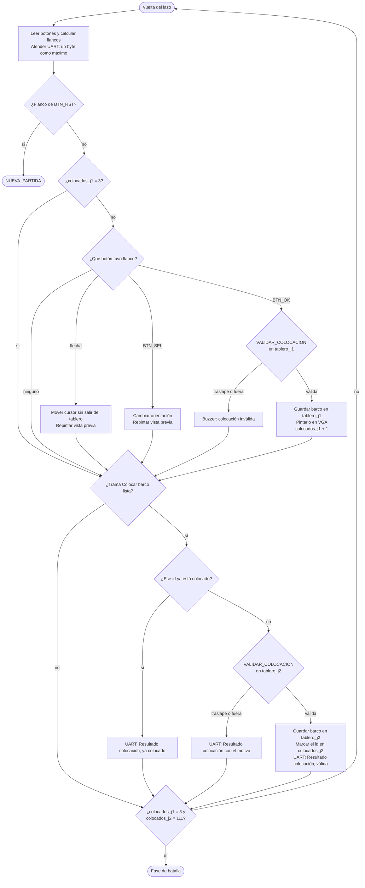
```mermaid
flowchart TD
    V(["Vuelta del lazo"]) --> LEER["Leer botones y calcular flancos<br/>Atender UART: un byte como máximo"]
    LEER --> RST{"¿Flanco de BTN_RST?"}
    RST -->|"sí"| NP(["NUEVA_PARTIDA"])
    RST -->|"no"| J1{"¿colocados_j1 = 3?"}
    J1 -->|"sí"| J2{"¿Trama Colocar barco lista?"}
    J1 -->|"no"| BOT{"¿Qué botón tuvo flanco?"}
    BOT -->|"ninguno"| J2
    BOT -->|"flecha"| MOV["Mover cursor sin salir del tablero<br/>Repintar vista previa"]
    BOT -->|"BTN_SEL"| ROT["Cambiar orientación<br/>Repintar vista previa"]
    BOT -->|"BTN_OK"| VAL1{"VALIDAR_COLOCACION<br/>en tablero_j1"}
    VAL1 -->|"traslape o fuera"| BZ["Buzzer: colocación inválida"]
    VAL1 -->|"válida"| PUT1["Guardar barco en tablero_j1<br/>Pintarlo en VGA<br/>colocados_j1 + 1"]
    MOV --> J2
    ROT --> J2
    BZ --> J2
    PUT1 --> J2
    J2 -->|"no"| LISTO
    J2 -->|"sí"| REP{"¿Ese id ya está colocado?"}
    REP -->|"sí"| RRE["UART: Resultado colocación, ya colocado"]
    REP -->|"no"| VAL2{"VALIDAR_COLOCACION<br/>en tablero_j2"}
    VAL2 -->|"traslape o fuera"| RNO["UART: Resultado colocación con el motivo"]
    VAL2 -->|"válida"| PUT2["Guardar barco en tablero_j2<br/>Marcar el id en colocados_j2<br/>UART: Resultado colocación, válida"]
    RRE --> LISTO
    RNO --> LISTO
    PUT2 --> LISTO
    LISTO{"¿colocados_j1 = 3 y<br/>colocados_j2 = 111?"} -->|"no"| V
    LISTO -->|"sí"| BAT(["Fase de batalla"])
```

La parte del Jugador 1 y la del Jugador 2 están una después de la otra dentro de la misma vuelta, y todas las salidas de la parte del Jugador 1 pasan por la del Jugador 2. Las flechas y `BTN_SEL` solo mueven la vista previa del barco. Únicamente `BTN_OK` valida y coloca. `VALIDAR_COLOCACION` es una sola subrutina para los dos jugadores: recibe la dirección del tablero, el id, la casilla inicial y la orientación, y devuelve válida, traslape o fuera de tablero.

Los barcos del Jugador 2 se guardan en `tablero_j2` pero no se pintan en la memoria de video. La pantalla muestra ese tablero en agua hasta que el Jugador 1 le dispare.

### Fase de batalla

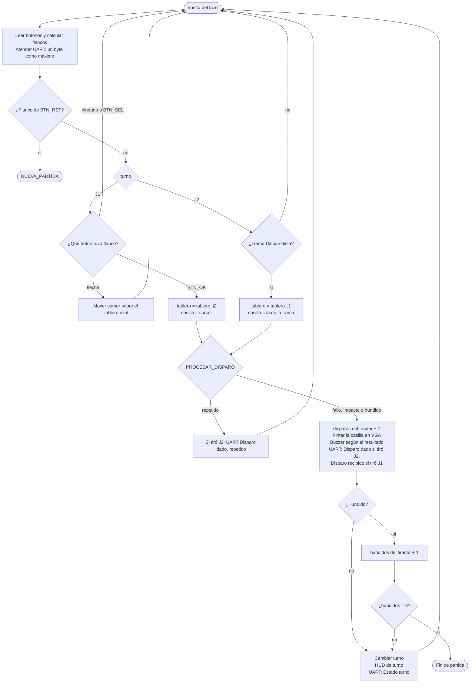
```mermaid
flowchart TD
    V(["Vuelta del lazo"]) --> LEER["Leer botones y calcular flancos<br/>Atender UART: un byte como máximo"]
    LEER --> RST{"¿Flanco de BTN_RST?"}
    RST -->|"sí"| NP(["NUEVA_PARTIDA"])
    RST -->|"no"| T{"turno"}
    T -->|"J1"| BOT{"¿Qué botón tuvo flanco?"}
    BOT -->|"ninguno o BTN_SEL"| V
    BOT -->|"flecha"| MOV["Mover cursor sobre el tablero rival"] --> V
    BOT -->|"BTN_OK"| D1["tablero = tablero_j2<br/>casilla = cursor"]
    T -->|"J2"| U{"¿Trama Disparo lista?"}
    U -->|"no"| V
    U -->|"sí"| D2["tablero = tablero_j1<br/>casilla = la de la trama"]
    D1 --> PD{"PROCESAR_DISPARO"}
    D2 --> PD
    PD -->|"repetido"| RP["Si tiró J2: UART Disparo dado, repetido"] --> V
    PD -->|"fallo, impacto o hundido"| ACT["disparos del tirador + 1<br/>Pintar la casilla en VGA<br/>Buzzer según el resultado<br/>UART: Disparo dado si tiró J2,<br/>Disparo recibido si tiró J1"]
    ACT --> H{"¿Hundido?"}
    H -->|"no"| CT["Cambiar turno<br/>HUD de turno<br/>UART: Estado turno"]
    H -->|"sí"| HS["hundidos del tirador + 1"] --> G{"¿hundidos = 3?"}
    G -->|"no"| CT
    CT --> V
    G -->|"sí"| FIN(["Fin de partida"])
```

Los dos jugadores comparten el mismo camino desde `PROCESAR_DISPARO`. Lo único que cambia es de dónde sale la casilla (el cursor o la trama UART) y a qué tablero apunta. `PROCESAR_DISPARO` revisa primero si la casilla ya fue disparada. Si lo fue, el disparo se ignora y el turno no cambia. Si no, marca impacto o fallo, suma el impacto al barco y avisa si el barco quedó hundido. Todo disparo válido pasa el turno al otro jugador, acierte o no.

Mientras es el turno del Jugador 2, las tramas se siguen leyendo en cada vuelta y cualquier trama que no sea Disparo se descarta. Mientras es el turno del Jugador 1, una trama Disparo del Jugador 2 también se descarta.

### Fin de partida

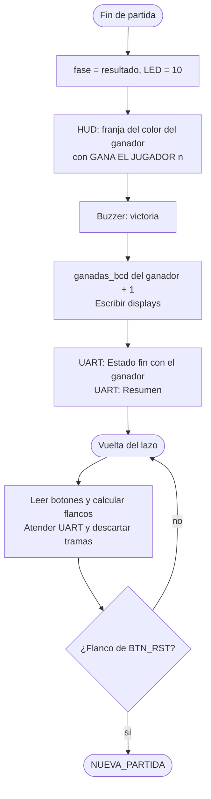
```mermaid
flowchart TD
    E(["Fin de partida"]) --> F["fase = resultado, LED = 10"]
    F --> HUD["HUD: franja del color del ganador<br/>con GANA EL JUGADOR n"]
    HUD --> BZ["Buzzer: victoria"]
    BZ --> M["ganadas_bcd del ganador + 1<br/>Escribir displays"]
    M --> U["UART: Estado fin con el ganador<br/>UART: Resumen"]
    U --> V(["Vuelta del lazo"])
    V --> LEER["Leer botones y calcular flancos<br/>Atender UART y descartar tramas"]
    LEER --> RST{"¿Flanco de BTN_RST?"}
    RST -->|"no"| V
    RST -->|"sí"| NP(["NUEVA_PARTIDA"])
```

La pantalla de resultado se queda hasta que el Jugador 1 presiona `BTN_RST`. El resumen lleva los disparos y los barcos hundidos de cada jugador.

### Privacidad de las flotas

La privacidad se cumple en los dos únicos puntos por donde el programa saca información:

- **Memoria de video.** Al pintar una casilla de `tablero_j2`, el estado `01` (barco sin disparar) se escribe como `000` (agua). Solo los estados `10` y `11` se pintan con su color.
- **UART.** Ninguna trama lleva el contenido de `tablero_j1`. La PC solo conoce ese tablero por los resultados de sus propios disparos, en los mensajes Disparo dado.

## Funcionamiento en conjunto

Para transmitir un byte, el programa escribe en `0x0001_0044` y luego activa `send` en `0x0001_0040`. El decodificador de direcciones selecciona UART; sus registros alimentan `uart_tx`, que serializa el dato hacia la PC. Para recibirlo, `uart_rx` carga `reg_rx`, sube `new_rx` y el programa puede consultar `0x0001_0040`, leer `0x0001_0048` y limpiar la bandera. Las esperas del enlace se gestionan por sondeo de esos bits; UART no decide las jugadas.

Las conexiones completas del procesador con la ROM, la RAM, el controlador de mapeo y los seis periféricos están en `src/design/top.sv`, que además instancia el PLL (`generador_relojes`). `src/sim/tb_top.sv` las verifica con el programa real jugando una partida completa.

---

<!-- Fuente: docs/diseño/modulos/PROCESADOR_UNICICLO.md -->

# PROCESADOR_UNICICLO

## a) Nombre del módulo

PROCESADOR_UNICICLO, módulo `procesador_uniciclo` en `src/design/procesador_uniciclo.sv`. Envuelve al
núcleo `riscv_core` de [riscv-simple-sv](modulos/https://github.com/tilk/riscv-simple-sv) (versión de ciclo único,
commit `d665812`), cuyos archivos están en `src/design/` con su licencia BSD-3.

## b) Diagrama modular

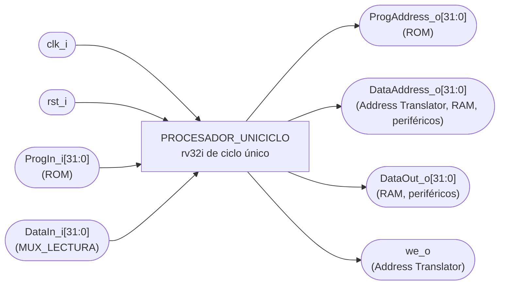
```mermaid
flowchart LR
    CLK(["clk_i"]) --> CPU["PROCESADOR_UNICICLO<br/>rv32i de ciclo único"]
    RST(["rst_i"]) --> CPU
    PIN(["ProgIn_i[31:0]<br/>(ROM)"]) --> CPU
    DIN(["DataIn_i[31:0]<br/>(MUX_LECTURA)"]) --> CPU
    CPU --> PA(["ProgAddress_o[31:0]<br/>(ROM)"])
    CPU --> DA(["DataAddress_o[31:0]<br/>(Address Translator, RAM, periféricos)"])
    CPU --> DO(["DataOut_o[31:0]<br/>(RAM, periféricos)"])
    CPU --> WE(["we_o<br/>(Address Translator)"])
```

Es el bloque "Procesador uniciclo" del nivel 2 visto desde afuera, con los mismos puertos de la figura 2 del
enunciado. Lo que tiene adentro está en el inciso i).

## c) Objetivo del módulo

Ejecutar el programa en ensamblador, como pide la sección 4.4.1 del enunciado: un microprocesador de 32 bits,
sintetizable, que implementa las instrucciones de `rv32i` necesarias para el programa, con buses separados de
instrucciones (`ProgAddress_o`, `ProgIn_i`) y de datos (`DataAddress_o`, `DataOut_o`, `DataIn_i`, `we_o`).

El procesador no sabe nada del juego. Todas las reglas están en el programa, y para el procesador la RAM, los
periféricos y la memoria de video son lo mismo: direcciones a las que se les hace `lw` o `sw`.

## d) Entradas

- `clk_i`, reloj del sistema, el mismo de las memorias y los periféricos de registros.
- `rst_i`, reset síncrono, activo en alto. Sale de `~locked` del PLL, sincronizado en `top.sv`.
- `ProgIn_i[31:0]`, instrucción que entrega la ROM para la dirección `ProgAddress_o`.
- `DataIn_i[31:0]`, dato leído por un `lw`, desde `MUX_LECTURA`.

## e) Salidas

- `ProgAddress_o[31:0]`, dirección de la instrucción en curso (el `PC`), hacia la ROM.
- `DataAddress_o[31:0]`, dirección de un `lw` o un `sw`, hacia el Address Translator, la RAM y los
  periféricos.
- `DataOut_o[31:0]`, dato que escribe un `sw`, hacia la RAM y los periféricos.
- `we_o`, en alto durante un `sw`, hacia el Address Translator.

## f) Relación con otros módulos

- **ROM** (`ROM.md`): recibe `ProgAddress_o` y devuelve `ProgIn_i` en el mismo ciclo.
- **Address Translator** (`Address_Translator.md`): recibe `DataAddress_o` y `we_o`, genera la habilitación de
  escritura de cada destino y `mux_sel`.
- **RAM** (`RAM.md`) y **periféricos**: reciben `DataAddress_o` y `DataOut_o` directamente, y escriben solo si
  el AT les habilita la escritura.
- **MUX_LECTURA**: elige qué dato llega a `DataIn_i` según `mux_sel`.

Dentro de `procesador_uniciclo` hay una sola instancia, `riscv_core`, que a su vez arma el camino de datos y el
de control con los módulos del inciso h).

## g) Explicación de funcionamiento

En un procesador de ciclo único cada instrucción empieza y termina entre dos flancos de subida de `clk_i`.
Durante el ciclo la señal recorre todo el camino:

1. El `PC` sale por `ProgAddress_o` y la ROM devuelve la instrucción por `ProgIn_i`.
2. El decodificador separa los campos (`opcode`, `rd`, `rs1`, `rs2`, `funct3`, `funct7`) y el generador de
   inmediatos arma la constante de 32 bits.
3. El banco de registros entrega `rs1` y `rs2`.
4. La ALU opera. En un `lw` o `sw` calcula la dirección (`rs1 + inmediato`), en un salto condicional compara
   `rs1` con `rs2`.
5. En un `lw`, la dirección sale por `DataAddress_o` y el dato vuelve por `DataIn_i` en el mismo ciclo. En un
   `sw`, la dirección y el dato salen por `DataAddress_o` y `DataOut_o` con `we_o` en alto.
6. En el flanco de subida se guardan dos cosas a la vez: el resultado en el registro `rd`, si la instrucción
   escribe uno, y el `PC` siguiente (`PC + 4`, el destino de un salto, o `rs1 + inmediato` en `jalr`).

Por ejemplo, `lw t0, 0x204(s2)` con `s2 = 0x0000_2000`: la ALU suma `0x0000_2000 + 0x204`, `DataAddress_o`
vale `0x0000_2204`, la RAM entrega `turno` por `DataIn_i` y en el flanco `t0` toma ese valor y el `PC` avanza 4.

Después de `rst_i` el `PC` vale `0x0000_0000`, el vector de reset de la sección 4.4.2, y la primera instrucción
que se ejecuta es la primera del programa.

## h) Diseño

### Origen del núcleo

El núcleo es la versión de ciclo único de riscv-simple-sv, un conjunto de núcleos `rv32i` escritos para
enseñanza en un subconjunto de SystemVerilog que entienden yosys, iverilog y Verilator. Está dividido en módulos
chicos y legibles (sumador, ALU, multiplexores, banco de registros) y se verifica con las pruebas oficiales de
RISC-V. Se reutiliza en vez de escribirlo desde cero porque el trabajo del proyecto está en el sistema completo
(programa, periféricos, integración), y un núcleo ya probado reduce el riesgo en la parte más crítica.

Implementa `rv32i` completo salvo las instrucciones de sistema (`ecall`, `ebreak` y los CSR), y trata `fence`
como una instrucción que no hace nada. Cubre la lista base de la sección 4.4.1 y además `lui`, `auipc`, las
cargas y escrituras de byte y media palabra y `bltu`/`bgeu`. El programa usa solo la lista base más `lui`, y
`sw/ensamblar.sh` rechaza cualquier otra instrucción. La extensión de multiplicación y división (`M_MODULE`)
queda apagada.

### Archivos

| Archivo | Contenido |
|---|---|
| `procesador_uniciclo.sv` | Envoltorio con los puertos del enunciado (propio del proyecto) |
| `riscv_core.sv` | Núcleo: une camino de datos, control e interfaz de memoria de datos |
| `singlecycle_datapath.sv` | Camino de datos: `PC`, sumadores, ALU, banco de registros, multiplexores |
| `singlecycle_ctlpath.sv` | Camino de control: une las tres unidades de control |
| `singlecycle_control.sv` | Señales de control según el `opcode` |
| `alu_control.sv` | Operación de la ALU según `funct3` y `funct7` |
| `control_transfer.sv` | Decide si un salto condicional se toma |
| `alu.sv` | Suma, resta, desplazamientos, comparaciones y lógicas |
| `immediate_generator.sv` | Inmediatos de los formatos I, S, B, U y J |
| `instruction_decoder.sv` | Separa los campos de la instrucción |
| `regfile.sv` | 32 registros de 32 bits, `x0` siempre en cero |
| `register.sv` | Registro con reset, usado para el `PC` |
| `data_memory_interface.sv` | Alinea datos y genera habilitaciones por byte |
| `adder.sv`, `multiplexer*.sv` | Bloques genéricos |
| `config.sv`, `constants.sv` | Macros de configuración y constantes de la ISA, incluidas con `` `include `` |
| `LICENSE.riscv-simple-sv` | Licencia BSD-3 del núcleo |

`toplevel.sv` y las memorias de ejemplo (`example_*.sv`) no se traen: la ROM y la RAM son las del proyecto.

### Adaptaciones

Son los únicos cambios al código original, cada uno marcado con un comentario en el archivo.

1. **Vector de reset.** `INITIAL_PC` pasa de `0x0040_0000` a `0x0000_0000` en `config.sv`, como fija la
   sección 4.4.2. Las macros de memorias de ejemplo de ese archivo se quitan porque nada las usa.
2. **Reset síncrono.** `register.sv` usaba `always_ff @(posedge clock or posedge reset)`, y pasa a
   `always_ff @(posedge clock)` con `if (reset)` adentro. Todo el diseño usa reset síncrono, y es el único
   registro del núcleo con reset (el banco de registros no tiene).
3. **Puertos del enunciado.** `procesador_uniciclo.sv` instancia `riscv_core` y renombra sus puertos:

   | `riscv_core` | `procesador_uniciclo` |
   |---|---|
   | `clock` | `clk_i` |
   | `reset` | `rst_i` |
   | `pc` | `ProgAddress_o` |
   | `inst` | `ProgIn_i` |
   | `bus_address` | `DataAddress_o` |
   | `bus_write_data` | `DataOut_o` |
   | `bus_read_data` | `DataIn_i` |
   | `bus_write_enable` | `we_o` |
   | `bus_read_enable`, `bus_byte_enable` | sin conectar |

4. **Licencia.** Los archivos conservan su encabezado de copyright y la licencia completa va en
   `LICENSE.riscv-simple-sv`, como pide la BSD-3.

### Sin habilitaciones por byte

El bus de datos del enunciado no tiene máscara de bytes, así que `bus_byte_enable` queda sin conectar. Para
`lw` y `sw` a direcciones alineadas, que es lo único que usa el programa, `data_memory_interface` no desplaza
nada y el dato pasa entero. Un `sb` o un `sh` escribirían la palabra completa con el dato desplazado, y por eso
el programa no los usa. `bus_read_enable` tampoco se necesita: la RAM y los periféricos leen en todo momento y
`MUX_LECTURA` elige.

### Banco de registros

32 registros de 32 bits, dos lecturas asíncronas (`rs1` y `rs2`) y una escritura en el flanco. `x0` nunca se
escribe y vale cero. Yosys lo arma con LUTRAM (12 primitivas `RAM32M`), por la misma razón que la ROM y la RAM:
los dos operandos tienen que estar en el mismo ciclo.

No tiene reset. Los registros arrancan en cero en la placa (el bitstream no les da contenido) y en `X` en
simulación. El programa carga los registros base con `lui` al arrancar. Las subrutinas guardan en la pila los
`s*` que preservan aunque todavía no se hayan escrito, y los restauran sin operar con ellos, así que una `X`
en la pila es esperable en simulación. Que ningún cálculo use un registro sin escribir lo comprueba la
simulación del programa completo.

### Instrucciones desconocidas

Con un `opcode` que el núcleo no conoce, la unidad de control deja `pc_write_enable`, `regfile_write_enable` y
`data_mem_write_enable` en `X`. En síntesis yosys los toma como indiferentes y en simulación la `X` se propaga
y el testbench lo detecta. Con un programa correcto no ocurre, porque `sw/ensamblar.sh` solo deja pasar la
lista base más `lui`.

### Recursos y timing

La síntesis de `procesador_uniciclo` solo, con el mismo comando del `GNUmakefile` (`synth_xilinx -flatten
-abc9 -nobram`), da unas 900 LUT, 12 `RAM32M`, 39 `CARRY4` y 32 flip-flops `FDRE` con reset síncrono (el
`PC`), sin latches. El camino crítico
de un uniciclo es el de un `lw`: `PC`, ROM, banco de registros, ALU, Address Translator, RAM o periférico,
`MUX_LECTURA` y escritura en el banco. Con el sistema integrado, nextpnr-xilinx da entre 39 y 50 MHz de
máximo para `clk_i` según la colocación, así que `clk_i` es de 33,33 MHz (1000 / 30 del PLL), con unos 4 ns
de holgura en el peor caso. La justificación completa está en `nivel02.md`, bloque 1.

### Latches

Los bloques combinacionales del núcleo asignan un valor por defecto antes de cada `case` o tienen rama
`default`, así que no infieren latches. La síntesis de prueba no reporta ninguno.

### Verificación

`src/sim/tb_procesador_uniciclo.sv` usa las pruebas oficiales de RISC-V
([riscv-tests](modulos/https://github.com/riscv/riscv-tests), `isa/rv32ui`), que vienen con riscv-simple-sv. Cada
prueba es un programa que ejecuta una instrucción en muchos casos (incluidos los bordes: desbordes,
desplazamientos de 0 y 31, registros fuente iguales al destino, `x0` como destino) y compara cada resultado con
el valor esperado. Al terminar escribe en `0xFFFF_FFF0` un 1 si todo dio bien o un 0 si algo falló, y el número
del caso que falló queda en `x28`.

El testbench conecta `procesador_uniciclo` con la ROM y la RAM del proyecto, y por cada prueba:

1. Carga el programa en la ROM y los datos de la prueba en la RAM.
2. Aplica `rst_i` y comprueba que el `PC` vale `0x0000_0000`.
3. Deja correr el núcleo hasta la escritura en `0xFFFF_FFF0`, con un límite de ciclos.
4. Imprime `PASS` o `FAIL` con el número del caso, y al final el resumen.

Corre las 28 pruebas de la lista base más `lui` (`lw`, `sw`, `lui`, `add`, `addi`, `and`, `andi`, `or`,
`ori`, `xor`, `xori`, `sub`, `sll`, `slli`, `srl`, `srli`, `sra`, `srai`, `slt`, `slti`, `sltu`, `sltiu`,
`beq`, `bne`, `blt`, `bge`, `jal`, `jalr`) y la prueba `simple`. Las pruebas usan `la`, que el ensamblador
expande con `auipc`, así que `auipc` queda verificada de paso aunque el programa no la use.

Los `.S` de las pruebas, sus macros y su licencia están en `src/sim/riscv-tests/`, junto con las imágenes
`.hex` ya generadas, para que `make sim` funcione sin binutils de RISC-V. `src/sim/riscv-tests/armar.sh` las
vuelve a generar: expande las macros con `cpp`, ensambla y enlaza con las binutils de GNU (código en
`0x0000_0000` y datos en `0x0000_2000`) y separa el código y los datos en dos `.hex`.

La simulación con el programa del juego queda para el testbench del sistema completo, con los periféricos.

## i) Diagrama esquemático detallado del diseño

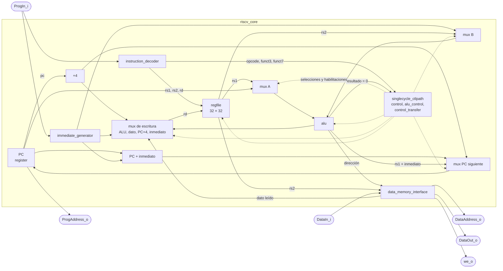
```mermaid
flowchart LR
    subgraph CORE["riscv_core"]
        direction LR
        PC["PC<br/>register"] -->|"pc"| SUM4["+4"]
        PC --> SUMI["PC + inmediato"]
        DEC["instruction_decoder"] -->|"rs1, rs2, rd"| RF["regfile<br/>32 × 32"]
        IMM["immediate_generator"] --> MUXB["mux B"]
        IMM --> SUMI
        RF -->|"rs1"| MUXA["mux A"]
        PC --> MUXA
        RF -->|"rs2"| MUXB
        MUXA --> ALU["alu"]
        MUXB --> ALU
        ALU --> MUXWB["mux de escritura<br/>ALU, dato, PC+4, inmediato"]
        SUM4 --> MUXWB
        IMM --> MUXWB
        MUXWB -->|"rd"| RF
        SUM4 --> MUXPC["mux PC siguiente"]
        SUMI --> MUXPC
        ALU -->|"rs1 + inmediato"| MUXPC
        MUXPC --> PC
        CTL["singlecycle_ctlpath<br/>control, alu_control,<br/>control_transfer"]
        DEC -->|"opcode, funct3, funct7"| CTL
        ALU -->|"resultado = 0"| CTL
        CTL -.->|"selecciones y habilitaciones"| MUXA
        CTL -.-> MUXB
        CTL -.-> ALU
        CTL -.-> MUXWB
        CTL -.-> MUXPC
        CTL -.-> RF
        DMI["data_memory_interface"]
        ALU -->|"dirección"| DMI
        RF -->|"rs2"| DMI
        DMI -->|"dato leído"| MUXWB
    end
    PIN(["ProgIn_i"]) --> DEC
    PIN --> IMM
    PC --> PA(["ProgAddress_o"])
    DMI --> DA(["DataAddress_o"])
    DMI --> DO(["DataOut_o"])
    DMI --> WE(["we_o"])
    DIN(["DataIn_i"]) --> DMI
```

Las flechas llenas son datos y las punteadas, señales de control. `procesador_uniciclo` no agrega lógica:
solo cambia los nombres de los puertos. Un esquemático por compuertas del núcleo completo tendría cientos de
celdas. Los bloques internos se pueden dibujar uno por uno con los scripts de
`docs/diseño/diagramas/esquematicos/` si hace falta para la defensa.

## j) Diagrama completo de conexiones del diseño

El procesador no tiene puertos hacia pines de la Basys 3, así que no agrega nada a `src/fpga/basys3.xdc`.

Conexiones en el top:

- `clk_i`, a `clk_sys`, el reloj del sistema de 33,33 MHz que sale del PLL.
- `rst_i`, al reset del sistema, `~locked` del PLL sincronizado.
- `ProgAddress_o`, a `addr_i` de la ROM.
- `ProgIn_i`, a `instr_o` de la ROM.
- `DataAddress_o`, a `address_i` del Address Translator, a `addr_i` de la RAM y a la dirección de cada
  periférico (con la adaptación de cada uno: `DataAddress_o[3:2]` en la UART, `2'b00` fijo en los periféricos
  de un registro).
- `DataOut_o`, a `wdata_i` de la RAM y de cada periférico.
- `DataIn_i`, a `rdata_o` de `MUX_LECTURA`.
- `we_o`, a `write_enable_i` del Address Translator.

Igual que en los demás módulos, el diagrama por chips que pide el método no aplica a un diseño que se
sintetiza dentro de una sola FPGA, y esta lista de puertos es el reemplazo propuesto.

---

<!-- Fuente: docs/diseño/modulos/ROM.md -->

# ROM

## a) Nombre del módulo

ROM, memoria de programa. Módulo `rom` en `src/design/rom.sv`.

## b) Diagrama modular

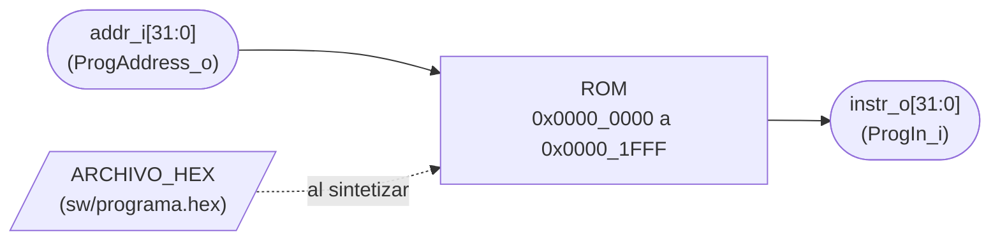
```mermaid
flowchart LR
    IN_ADDR(["addr_i[31:0]<br/>(ProgAddress_o)"]) --> ROM["ROM<br/>0x0000_0000 a 0x0000_1FFF"]
    HEX[/"ARCHIVO_HEX<br/>(sw/programa.hex)"/] -.->|"al sintetizar"| ROM
    ROM --> OUT_INSTR(["instr_o[31:0]<br/>(ProgIn_i)"])
```

Es el bloque "Memoria de programa (ROM)" del nivel 2 visto desde afuera. Lo que tiene adentro está en el
inciso i).

## c) Objetivo del módulo

Guardar el programa en ensamblador y entregarle al procesador la instrucción que pide, como exige la sección
4.4.1 del enunciado: el microprocesador usa una ROM para el programa, con un bus propio formado por
`ProgAddress_o[31:0]` y `ProgIn_i[31:0]`, separado del bus de datos.

La ROM no sabe nada del juego. Su contenido es la imagen que genera `sw/ensamblar.sh` a partir de
`sw/programa.s`, y queda fijo en el bitstream.

## d) Entradas

- `addr_i[31:0]`, dirección en bytes de la instrucción, desde `ProgAddress_o` del procesador (el `PC`).

El módulo tiene el parámetro `ARCHIVO_HEX`, ruta del archivo que se carga con `$readmemh`. La ruta es
relativa a la carpeta desde donde corre la herramienta, y el `GNUmakefile` usa dos distintas:

- `make synth` y `make bitstream` corren yosys desde la raíz del repo. Para ellos sirve el valor por defecto,
  `"sw/programa.hex"`.
- `make sim` corre la simulación desde `src/build/`. Los testbenches pasan su propia ruta relativa a esa
  carpeta, por ejemplo `"../sim/rom_prueba.hex"` o `"../../sw/programa.hex"`.

El tamaño no es un parámetro. `localparam PALABRAS = 2048` sale del mapa de memoria de la sección 4.4.2
(8 KB, de `0x0000_0000` a `0x0000_1FFF`).

No tiene `clk_i` ni `rst_i`, ver el inciso h).

## e) Salidas

- `instr_o[31:0]`, instrucción guardada en la palabra que apunta `addr_i`, hacia `ProgIn_i` del procesador.

## f) Relación con otros módulos

Habla con un solo módulo, `PROCESADOR_UNICICLO`, por el bus de instrucciones. No instancia ningún submódulo.

La ROM **no está en el bus de datos**. El Address Translator no la mapea, así que un `lw` no puede leerla y un
`sw` no puede escribirla. Por eso el programa guarda sus constantes como inmediatos y no como tablas en la ROM
(`nivel03.md`, sección del programa).

El contenido viene de `sw/programa.hex`, que genera `sw/ensamblar.sh` con binutils de GNU. Ese archivo es el
contrato entre el programa y el hardware: el programa se puede cambiar y volver a ensamblar sin tocar
`rom.sv`, y la ROM se puede verificar con cualquier otro `.hex` sin depender del programa.

## g) Explicación de funcionamiento

La ROM es una tabla de 2048 palabras de 32 bits. Cada instrucción de rv32i ocupa 4 bytes, así que la palabra
`n` guarda la instrucción que está en la dirección `4 × n`.

En cada ciclo el procesador pone el `PC` en `addr_i` y la ROM devuelve en `instr_o` la instrucción de esa
palabra **en el mismo ciclo**, sin esperar un flanco de reloj. Por ejemplo, con el programa actual:

| `PC` | Palabra | `instr_o` | Instrucción |
| --- | --- | --- | --- |
| `0x0000_0000` | 0 | `0x0001_0437` | `lui s0, 0x10` |
| `0x0000_0004` | 1 | `0x0001_14B7` | `lui s1, 0x11` |
| `0x0000_0008` | 2 | `0x0000_2937` | `lui s2, 0x2` |

Después de `rst_i` el procesador pone el `PC` en `0x0000_0000`, el vector de reset de la sección 4.4.2, y la
ROM entrega la primera instrucción del programa.

## h) Diseño

### Lectura asíncrona

En un procesador uniciclo la instrucción tiene que estar disponible en el mismo ciclo en que el `PC` cambia,
porque en ese ciclo se decodifica, se ejecuta y se escribe el resultado. Por eso la lectura es combinacional:

```systemverilog
assign instr_o = mem[addr_i[12:2]];
```

Las BRAM de la Artix-7 solo leen en forma síncrona (el dato sale un ciclo después de la dirección), así que
no sirven para esto sin cambiar el núcleo. La ROM se arma con LUT. Con el programa real, yosys la convierte en
lógica combinacional de unas pocas centenas de LUT, porque solo implementa las palabras que tienen
instrucción. La prueba de síntesis con openXC7 (yosys y nextpnr-xilinx) colocó y ruteó la ROM con el programa
completo junto con la RAM, con unas 1790 LUT entre las dos (cerca del 9 % del XC7A35T).

### Decodificación de la dirección

| Bits de `addr_i` | Uso |
| --- | --- |
| `[1:0]` | Se ignoran. Toda instrucción de rv32i está alineada a 4 bytes, así que el `PC` siempre termina en `00`. |
| `[12:2]` | Índice de la palabra, de 0 a 2047. |
| `[31:13]` | Se ignoran. |

Ignorar `[31:13]` hace que una dirección fuera de `0x0000_0000` a `0x0000_1FFF` repita la ROM (por ejemplo,
`0x0000_2000` lee la palabra 0). El `PC` nunca sale de la ROM con un programa correcto, así que comparar los
bits altos solo agregaría lógica en el camino crítico para un caso que no ocurre.

### Palabras sin programa

`$readmemh` carga solo las palabras que trae el archivo. Con el programa actual son 725 de 2048. Las demás no
tienen un valor definido:

- En síntesis yosys las trata como indiferentes y no gasta lógica en ellas.
- En simulación se leen como `X`. Si el `PC` se escapara del programa, la `X` se propagaría por el procesador y
  el testbench lo detectaría enseguida, en vez de ejecutar ceros en silencio.

### Formato del archivo

`sw/ensamblar.sh` genera el `.hex` con `objcopy -O verilog --verilog-data-width=4`. Cada línea tiene cuatro
palabras de 32 bits en hexadecimal, escritas como número (el byte más significativo primero), y el archivo
empieza con `@00000000`. `$readmemh` lee ese formato tal cual y pone la primera palabra en `mem[0]`.

### Sin reloj ni reset

La ROM no tiene estado: su contenido es fijo y la salida depende solo de `addr_i`. No necesita `clk_i` ni
`rst_i`. Lo que se reinicia es el `PC`, dentro del procesador.

### Síntesis

yosys puede absorber en la ROM el registro que le entrega la dirección (paso `memory_dff`): convierte "registro
del `PC` y lectura asíncrona" en "lectura síncrona con el dato registrado". El comportamiento visto desde el
procesador es el mismo, así que en el reporte de síntesis pueden aparecer flip-flops a la salida de la ROM que
no están en el RTL.

### Latches

No hay bloques `always`. La lectura es un `assign` y la carga es un `initial` con `$readmemh`, así que no
puede inferirse ningún latch.

### Verificación

`src/sim/tb_rom.sv` carga un `.hex` de prueba con valores conocidos y comprueba en forma automática:

- Cada palabra se lee en su dirección `4 × n`, incluidas la primera y la última (`0x0000_1FFC`).
- Los bits `[1:0]` no cambian el resultado (`0x0000_0004` a `0x0000_0007` leen lo mismo).
- Una dirección con los bits altos encendidos repite la ROM (`0x0000_2000` lee la palabra 0).
- Una palabra que el archivo no carga se lee como `X`.

Cuando `sw/programa.hex` llegue a esta rama, el testbench suma una comparación de las primeras palabras contra
el desensamblado de `sw/build/programa.lst`.

## i) Diagrama esquemático detallado del diseño

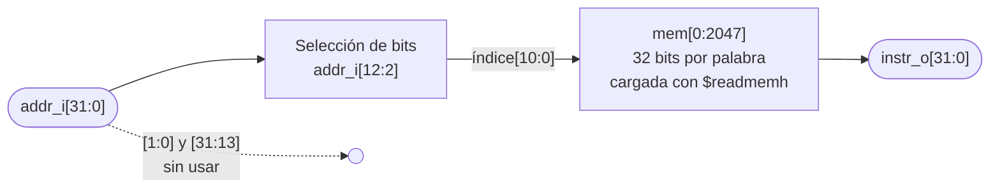
```mermaid
flowchart LR
    ADDR(["addr_i[31:0]"]) --> SEL["Selección de bits<br/>addr_i[12:2]"]
    SEL -->|"índice[10:0]"| MEM["mem[0:2047]<br/>32 bits por palabra<br/>cargada con $readmemh"]
    MEM --> INSTR(["instr_o[31:0]"])
    ADDR -.->|"[1:0] y [31:13]<br/>sin usar"| X((" "))
```

La ROM es una sola tabla de consulta: la selección de bits no tiene compuertas (son cables) y la memoria es
un multiplexor de 2048 entradas de 32 bits cuyo contenido fija el archivo. Al sintetizar, yosys convierte esa
tabla en LUT, `MUXF7` y `MUXF8` según el contenido del programa, así que un esquemático a nivel de compuertas
depende del `.hex` cargado y no muestra nada que el diagrama de arriba no diga.

## j) Diagrama completo de conexiones del diseño

La ROM no tiene puertos hacia pines de la Basys 3, así que no agrega nada a `src/fpga/basys3.xdc`.

Conexiones en el top:

- `addr_i[31:0]`, a `ProgAddress_o` de `PROCESADOR_UNICICLO`.
- `instr_o[31:0]`, a `ProgIn_i` de `PROCESADOR_UNICICLO`.
- `ARCHIVO_HEX` con su valor por defecto, `"sw/programa.hex"`.

Igual que en los demás módulos, el diagrama por chips que pide el método no aplica a un diseño que se
sintetiza dentro de una sola FPGA, y esta lista de puertos es el reemplazo propuesto.

---

<!-- Fuente: docs/diseño/modulos/RAM.md -->

# RAM

## a) Nombre del módulo

RAM, memoria de datos. Módulo `ram` en `src/design/ram.sv`.

## b) Diagrama modular

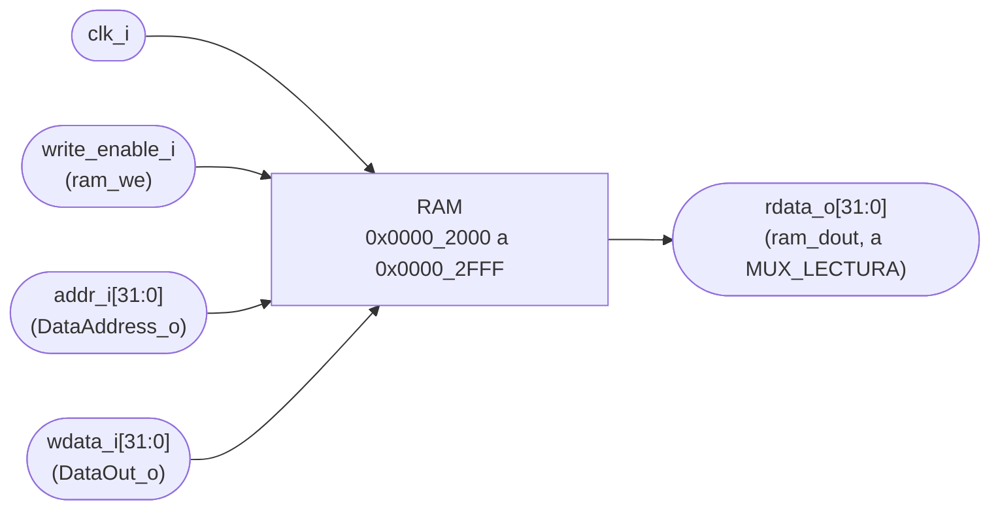
```mermaid
flowchart LR
    IN_CLK(["clk_i"]) --> RAM["RAM<br/>0x0000_2000 a 0x0000_2FFF"]
    IN_WE(["write_enable_i<br/>(ram_we)"]) --> RAM
    IN_ADDR(["addr_i[31:0]<br/>(DataAddress_o)"]) --> RAM
    IN_WD(["wdata_i[31:0]<br/>(DataOut_o)"]) --> RAM
    RAM --> OUT_RD(["rdata_o[31:0]<br/>(ram_dout, a MUX_LECTURA)"])
```

Es el bloque "Memoria de datos (RAM)" del nivel 2 visto desde afuera. Lo que tiene adentro está en el
inciso i).

## c) Objetivo del módulo

Guardar los datos del programa (tableros, turno, contadores de la partida y pila) y entregarlos cuando el
procesador los pide, como exige la sección 4.4.1 del enunciado: el microprocesador usa una RAM para los
datos, a la que accede por el bus de datos (`DataAddress_o`, `DataOut_o`, `DataIn_i` y `we_o`).

La RAM no sabe qué guarda. La organización de las variables la decide el programa y está en `nivel03.md`
(sección "Organización de la RAM").

## d) Entradas

- `clk_i`, reloj del sistema.
- `write_enable_i`, habilitación de escritura, desde `ram_we` del Address Translator (`we_o` del procesador
  en AND con `sel_ram`).
- `addr_i[31:0]`, dirección en bytes, desde `DataAddress_o` del procesador.
- `wdata_i[31:0]`, dato a escribir, desde `DataOut_o` del procesador.

No tiene `rst_i`, ver el inciso h).

## e) Salidas

- `rdata_o[31:0]`, palabra guardada en la dirección que apunta `addr_i`, hacia la entrada `ram_dout` de
  `MUX_LECTURA`, que la lleva a `DataIn_i` del procesador.

## f) Relación con otros módulos

Habla con el procesador a través del controlador de mapeo. No instancia ningún submódulo.

- El **Address Translator** (`Address_Translator.md`) decide si la dirección es de la RAM. `sel_ram` exige
  `DataAddress_o[31:12] = 0x00002` y los bits `[1:0]` en cero, y `ram_we` vale `we_o && sel_ram`. Por eso la RAM
  no compara la dirección: si llega una escritura, ya es suya.
- **`MUX_LECTURA`** recibe `rdata_o` en su entrada `ram_dout` y la elige con `mux_sel = 000`. La RAM pone en
  `rdata_o` la palabra apuntada en todo momento, aunque la dirección sea de otro destino. Ese dato simplemente
  no se elige.
- El **procesador** le manda la dirección y el dato directamente, sin pasar por el AT.

Esto sigue la división de `Address_Translator.md`: el AT genera solo las señales de control, y "las interfaces
de RAM y VGA obtienen su índice local de la dirección".

## g) Explicación de funcionamiento

La RAM es una tabla de 1024 palabras de 32 bits. La palabra `n` corresponde a la dirección
`0x0000_2000 + 4 × n`.

- **Escritura (`sw`).** El procesador pone la dirección en `DataAddress_o`, el dato en `DataOut_o` y `we_o` en
  alto. El AT activa `ram_we`, y en el siguiente flanco de subida de `clk_i` la RAM guarda el dato. Es el mismo
  flanco que termina la instrucción `sw`.
- **Lectura (`lw`).** El procesador pone la dirección y la RAM entrega la palabra en `rdata_o` **en el mismo
  ciclo**, sin esperar un flanco. El dato atraviesa `MUX_LECTURA`, llega a `DataIn_i` y en el flanco siguiente
  se escribe en el registro destino.

Por ejemplo, con el programa actual (`s2 = 0x0000_2000`):

| Instrucción | `DataAddress_o` | Palabra | Efecto |
|---|---|---|---|
| `sw t0, 0x200(s2)` | `0x0000_2200` | 128 | En el flanco, `fase` toma el valor de `t0` |
| `lw t0, 0x204(s2)` | `0x0000_2204` | 129 | En el mismo ciclo, `rdata_o` muestra `turno` |
| `sw ra, 0(sp)` con `sp = 0x0000_2FFC` | `0x0000_2FFC` | 1023 | Guarda la dirección de retorno en la pila |

## h) Diseño

### Escritura síncrona y lectura asíncrona

```systemverilog
always_ff @(posedge clk_i)
  if (write_enable_i) mem[addr_i[11:2]] <= wdata_i;

assign rdata_o = mem[addr_i[11:2]];
```

La lectura es combinacional por la misma razón que en la ROM: en un procesador uniciclo el `lw` termina en un
solo ciclo, así que el dato tiene que llegar a `DataIn_i` antes del flanco que lo guarda en el registro
destino. Las BRAM de la Artix-7 solo leen en forma síncrona, así que la RAM se arma con LUTRAM (las LUT de los
SLICEM funcionando como memoria).

La prueba de síntesis con openXC7 armó la RAM de 1024 × 32 con 176 primitivas `RAM64M` (o 128 `RAM256X1S`,
según cómo le llegue la dirección), la colocó y la ruteó sin errores. La lectura, desde un registro de
dirección hasta un registro de destino, cerró a 166 MHz, lejos de los 33,33 MHz de `clk_i`.

La escritura sí es síncrona. Es lo que permite usar LUTRAM, y además evita que una dirección todavía
inestable durante el ciclo escriba en una palabra equivocada: el dato se guarda solo en el flanco, cuando todo
ya se estabilizó.

### Decodificación de la dirección

| Bits de `addr_i` | Uso |
|---|---|
| `[1:0]` | Se ignoran. El programa solo usa `lw` y `sw` alineados, y el AT no selecciona la RAM con estos bits distintos de cero. |
| `[11:2]` | Índice de la palabra, de 0 a 1023. |
| `[31:12]` | Se ignoran. El AT ya verificó que valen `0x00002`. |

### Tamaño

El mapa de memoria de la sección 4.4.2 reserva 4 KB, de `0x0000_2000` a `0x0000_2FFF`, y la RAM los
implementa completos (`localparam PALABRAS = 1024`). El programa actual usa mucho menos: 153 palabras de
variables (`0x0000_2000` a `0x0000_2263`) y como máximo 10 de pila (40 bytes, `PROGRAMA.md` sección 3.3). Se
implementa entera para que el mapa del hardware sea el del instructivo y el programa pueda crecer sin tocar
el RTL.

### Solo palabras completas

No hay habilitaciones por byte. El instructivo define el bus de datos con `we_o` y sin máscara de bytes, y el
programa solo usa `lw` y `sw` (`sw/ensamblar.sh` rechaza `lb`, `lh`, `sb` y `sh`). Un `sw` siempre escribe los
32 bits.

### Sin reset

La RAM no tiene `rst_i`. Las LUTRAM no pueden borrarse en un ciclo, y vaciar 1024 palabras con una máquina de
estados sería hardware para algo que ya hace el programa: después de `rst_i`, `INICIO` pone en cero
`ganadas_bcd`, y `NUEVA_PARTIDA` limpia los tableros y todas las variables de la partida. El programa no lee
ninguna variable antes de escribirla.

Después de programar la FPGA, la RAM arranca en cero, porque el bitstream no le da contenido inicial. En
simulación, en cambio, arranca en `X`. Si el programa leyera una variable antes de escribirla, la `X` se
propagaría y el testbench del sistema lo detectaría.

### Escritura y lectura en el mismo ciclo

En un uniciclo cada instrucción es un `lw` o un `sw`, nunca las dos, así que no se lee y escribe la misma
palabra en el mismo ciclo. Si pasara, `rdata_o` mostraría el valor anterior hasta el flanco y el nuevo
después. Un `lw` justo después de un `sw` a la misma dirección lee el valor nuevo, porque la escritura ya
ocurrió en el flanco que separa las dos instrucciones.

### Latches

La escritura es un `always_ff` y la lectura un `assign`. No hay `always_comb`, así que no puede inferirse
ningún latch.

### Verificación

`src/sim/tb_ram.sv` comprueba en forma automática:

- Antes de cualquier escritura, las palabras se leen como `X`.
- Cada una de las 1024 palabras guarda y devuelve su propio valor, incluidas la primera (`0x0000_2000`) y la
  última (`0x0000_2FFC`).
- La lectura es asíncrona: el dato cambia al cambiar `addr_i`, sin flanco de reloj.
- La escritura es síncrona: antes del flanco `rdata_o` muestra el valor anterior y después del flanco el
  nuevo.
- Con `write_enable_i` en cero el flanco no cambia nada.
- Los bits `[1:0]` y `[31:12]` no cambian qué palabra se lee ni cuál se escribe.

## i) Diagrama esquemático detallado del diseño

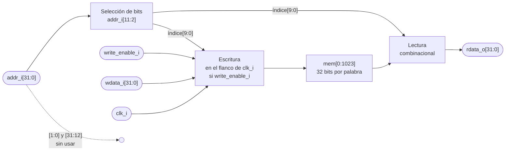
```mermaid
flowchart LR
    ADDR(["addr_i[31:0]"]) --> SEL["Selección de bits<br/>addr_i[11:2]"]
    SEL -->|"índice[9:0]"| ESC["Escritura<br/>en el flanco de clk_i<br/>si write_enable_i"]
    SEL -->|"índice[9:0]"| LEC["Lectura<br/>combinacional"]
    WE(["write_enable_i"]) --> ESC
    WD(["wdata_i[31:0]"]) --> ESC
    CLK(["clk_i"]) --> ESC
    ESC --> MEM["mem[0:1023]<br/>32 bits por palabra"]
    MEM --> LEC
    LEC --> RD(["rdata_o[31:0]"])
    ADDR -.->|"[1:0] y [31:12]<br/>sin usar"| X((" "))
```

La RAM tiene tres partes: la selección de bits (cables, sin compuertas), la escritura (un decodificador del
índice que habilita solo la palabra apuntada, en el flanco y con `write_enable_i`) y la lectura (un
multiplexor de 1024 entradas de 32 bits). En la FPGA las tres quedan dentro de las primitivas de LUTRAM más
los multiplexores `MUXF7` y `MUXF8` que eligen entre ellas, así que un esquemático a nivel de compuertas
mostraría la misma estructura repetida 1024 veces.

## j) Diagrama completo de conexiones del diseño

La RAM no tiene puertos hacia pines de la Basys 3, así que no agrega nada a `src/fpga/basys3.xdc`.

Conexiones en el top:

- `clk_i`, a `clk_i` del sistema, el mismo reloj del procesador.
- `write_enable_i`, a `ram_we` del Address Translator.
- `addr_i[31:0]`, a `DataAddress_o` de `PROCESADOR_UNICICLO`.
- `wdata_i[31:0]`, a `DataOut_o` de `PROCESADOR_UNICICLO`.
- `rdata_o[31:0]`, a la entrada `ram_dout` de `MUX_LECTURA`.

Igual que en los demás módulos, el diagrama por chips que pide el método no aplica a un diseño que se
sintetiza dentro de una sola FPGA, y esta lista de puertos es el reemplazo propuesto.

---

<!-- Fuente: docs/diseño/modulos/Address_Translator.md -->

# Address Translator (AT)

El AT (`src/design/address_translator.sv`) recibe únicamente `DataAddress_o` y `we_o` del procesador RISC-V uniciclo, en sus puertos `address_i` y `write_enable_i`. Sus salidas son las habilitaciones de escritura individuales para RAM y periféricos, y `mux_sel`, que controla un **MUX de lectura externo**. El AT no recibe datos de escritura ni datos de lectura y tampoco contiene el MUX.

## Diagrama de cuarto nivel

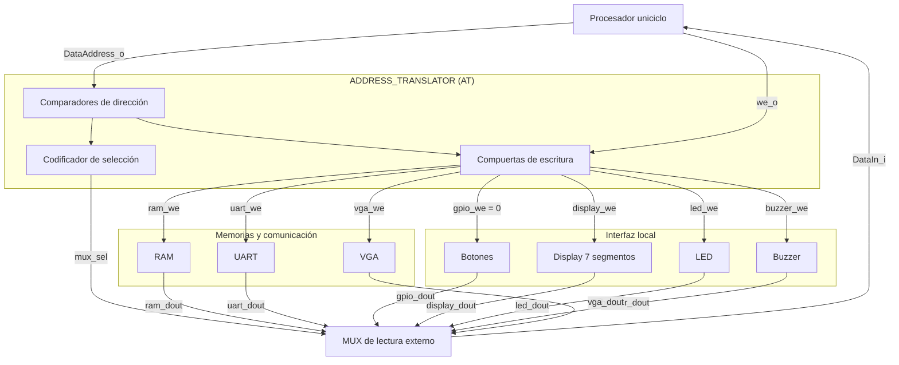
```mermaid
flowchart TB
    CPU["Procesador uniciclo"]
    subgraph AT["ADDRESS_TRANSLATOR (AT)"]
        direction TB
        DEC["Comparadores de dirección"]
        WR["Compuertas de escritura"]
        ENC["Codificador de selección"]
        DEC --> WR
        DEC --> ENC
    end
    subgraph MEM["Memorias y comunicación"]
        direction LR
        RAM["RAM"]
        UART["UART"]
        VGA["VGA"]
    end
    subgraph IO["Interfaz local"]
        direction LR
        GPIO["Botones"]
        DISP["Display 7 segmentos"]
        LED["LED"]
        BUZ["Buzzer"]
    end
    MUX["MUX de lectura externo"]
    CPU -->|"DataAddress_o"| DEC
    CPU -->|"we_o"| WR
    WR -->|"ram_we"| RAM
    WR -->|"uart_we"| UART
    WR -->|"gpio_we = 0"| GPIO
    WR -->|"display_we"| DISP
    WR -->|"led_we"| LED
    WR -->|"buzzer_we"| BUZ
    WR -->|"vga_we"| VGA
    ENC -->|"mux_sel"| MUX
    RAM -->|"ram_dout"| MUX
    UART -->|"uart_dout"| MUX
    GPIO -->|"gpio_dout"| MUX
    DISP -->|"display_dout"| MUX
    LED -->|"led_dout"| MUX
    BUZ -->|"buzzer_dout"| MUX
    VGA -->|"vga_dout"| MUX
    MUX -->|"DataIn_i"| CPU
```

Cada destino tiene una entrada de escritura independiente y un camino de lectura hacia el MUX. En el caso de botones, `gpio_we=0` representa una entrada permanentemente deshabilitada: su registro solo se lee. Los nombres `*_dout` identifican los datos vistos por el MUX, aunque los puertos reales de cada módulo se llaman `rdata_o`. El MUX es `src/design/mux_lectura.sv`.

`DataAddress_o` y `DataOut_o` también se distribuyen desde el procesador a las memorias y periféricos por conexiones externas al AT. Se omiten esas flechas del diagrama para que el camino de control y lectura permanezca legible. La adaptación de dirección para RAM, UART o VGA se realiza en esas conexiones o en las interfaces de los destinos. La ROM de programa usa su propio bus de instrucciones y no participa en este diagrama.

## Interfaz y mapa de direcciones

| Señal | Dirección | Función |
| --- | --- | --- |
| `address_i[31:0]` | Procesador → AT | `DataAddress_o`, dirección que se compara con el mapa. |
| `write_enable_i` | Procesador → AT | `we_o`, solicitud de escritura del procesador. |
| `ram_we`, `uart_we`, `gpio_we`, `display_we`, `led_we`, `buzzer_we`, `vga_we` | AT → destino respectivo | Habilitaciones independientes, `gpio_we` permanece en cero. |
| `mux_sel[2:0]` | AT → MUX externo | Escoge el dato de lectura que llegará a `DataIn_i`. |

| Destino | Dirección del instructivo | Identificación por el AT |
| --- | --- | --- |
| ROM de programa | `0x0000_0000`–`0x0000_1FFF` | Bus de instrucciones independiente, **no** se conecta al AT. |
| RAM de datos | `0x0000_2000`–`0x0000_2FFF` | `sel_ram` identifica la ventana. |
| UART | `0x0001_0040`, `0x0001_0044`, `0x0001_0048` | `sel_uart` identifica los tres registros asignados. |
| Entradas del jugador 1 | `0x0001_0120` | `sel_gpio`, lectura del registro de botones. |
| Display de 7 segmentos | `0x0001_0130` | `sel_display`, registro de datos. |
| LED de estado | `0x0001_0138` | `sel_led`, registro de datos. |
| Buzzer | `0x0001_0140` | `sel_buzzer`, registro de control. |
| Memoria de video VGA | `0x0001_1000`–`0x0001_17FF` | `sel_vga` identifica la ventana de video. |

El espacio `0x0001_0000`–`0x0001_FFFF` corresponde a periféricos, pero **no todas sus direcciones tienen un registro asignado**. `0x0001_004C` cae junto a los registros UART, pero no corresponde a ninguno. Por ello el AT no habilita su escritura y selecciona la entrada de lectura sin asignar. Fuera del AT, la interfaz UART puede recibir `addr_i[1:0] = DataAddress_o[3:2]`: `00` selecciona control/estado, `01` TX y `10` RX. De forma similar, la RAM recibe la dirección completa y toma `[11:2]`, y el VGA recibe `DataAddress_o[10:2]` como `addr_i`, sin que el AT calcule esos índices. Los periféricos de un solo registro (entradas, display, LED y buzzer) reciben `addr_i = 00` fijo en `top.sv`.

## Tabla de verdad del Address Translator

La tabla especifica las salidas del **AT**, no los datos que entrega el MUX. Cada rango incluye solamente direcciones alineadas a palabras de 32 bits. La codificación de `mux_sel[2:0]` es: `000` RAM, `001` UART, `010` botones, `011` display, `100` LED, `101` buzzer, `110` VGA y `111` sin destino. `we_o=0` corresponde al camino de lectura. Cuando `we_o=1`, el MUX conserva su selección, aunque una instrucción `sw` no utiliza `DataIn_i`.

| `we_o` | `DataAddress_o` | `ram_we` | `uart_we` | `gpio_we` | `display_we` | `led_we` | `buzzer_we` | `vga_we` | `mux_sel` |
| :---: | --- | :---: | :---: | :---: | :---: | :---: | :---: | :---: | :---: |
| 0 | `0x0000_2000`–`0x0000_2FFF` | 0 | 0 | 0 | 0 | 0 | 0 | 0 | `000` |
| 1 | `0x0000_2000`–`0x0000_2FFF` | 1 | 0 | 0 | 0 | 0 | 0 | 0 | `000` |
| 0 | `0x0001_0040`, `0x0001_0044`, `0x0001_0048` | 0 | 0 | 0 | 0 | 0 | 0 | 0 | `001` |
| 1 | `0x0001_0040`, `0x0001_0044`, `0x0001_0048` | 0 | 1 | 0 | 0 | 0 | 0 | 0 | `001` |
| 0 | `0x0001_0120` | 0 | 0 | 0 | 0 | 0 | 0 | 0 | `010` |
| 1 | `0x0001_0120` | 0 | 0 | 0 | 0 | 0 | 0 | 0 | `010` |
| 0 | `0x0001_0130` | 0 | 0 | 0 | 0 | 0 | 0 | 0 | `011` |
| 1 | `0x0001_0130` | 0 | 0 | 0 | 1 | 0 | 0 | 0 | `011` |
| 0 | `0x0001_0138` | 0 | 0 | 0 | 0 | 0 | 0 | 0 | `100` |
| 1 | `0x0001_0138` | 0 | 0 | 0 | 0 | 1 | 0 | 0 | `100` |
| 0 | `0x0001_0140` | 0 | 0 | 0 | 0 | 0 | 0 | 0 | `101` |
| 1 | `0x0001_0140` | 0 | 0 | 0 | 0 | 0 | 1 | 0 | `101` |
| 0 | `0x0001_1000`–`0x0001_17FF` | 0 | 0 | 0 | 0 | 0 | 0 | 0 | `110` |
| 1 | `0x0001_1000`–`0x0001_17FF` | 0 | 0 | 0 | 0 | 0 | 0 | 1 | `110` |
| 0 | Otras direcciones | 0 | 0 | 0 | 0 | 0 | 0 | 0 | `111` |
| 1 | Otras direcciones | 0 | 0 | 0 | 0 | 0 | 0 | 0 | `111` |

«Otras direcciones» incluye `0x0001_004C`, direcciones no alineadas y direcciones no asignadas del espacio de periféricos. Si se presenta una dirección de la ROM en el bus de datos, tampoco activa ningún destino del AT. La lectura normal de instrucciones sigue por el bus independiente de la ROM.


## Salidas de control y MUX externo

Cada habilitación de escritura es `we_o && sel_destino`: por ejemplo, `ram_we = we_o && sel_ram` y `uart_we = we_o && sel_uart`. Se generan habilitaciones independientes equivalentes para display, LED, buzzer y VGA. La salida `gpio_we` se fija en cero porque los botones son de solo lectura. Las selecciones de destino dependen únicamente de `DataAddress_o`, por lo que `mux_sel` identifica el mismo destino tanto con `we_o=0` como con `we_o=1`. `DataOut_o` se distribuye por fuera del AT. Solo el destino habilitado captura el dato.

`mux_sel[2:0]` identifica una de las entradas del **MUX externo** conforme a la tabla de verdad. La codificación es la misma en el AT y en `mux_lectura`. El instructivo fija las direcciones, pero no esos tres bits. Para una dirección sin destino, o no alineada, el AT desactiva todas las escrituras y selecciona `111`. Esa entrada del MUX entrega `32'h0000_0000`. Este comportamiento para accesos inválidos es una **decisión de diseño**, no una función especificada por el instructivo.

El AT es lógica combinacional. El MUX externo entrega el dato seleccionado a `DataIn_i`. Como el procesador es uniciclo, la ruta de lectura de RAM y periféricos entrega el dato en el mismo ciclo de una instrucción `lw`, porque la RAM y la memoria de video se leen de forma combinacional. El sistema completo cierra *timing* a 33,33 MHz con ese camino incluido.

Por ejemplo, un `sw` a `0x0001_0044` activa `sel_uart`, genera `uart_we=1` y coloca en `mux_sel` la selección UART. La conexión externa `addr_i=01` permite que UART escriba TX. Un `lw` de `0x0001_0120` deja todas las habilitaciones de escritura en cero y ordena al MUX leer el registro de botones. El AT únicamente genera las señales de control: el MUX externo transporta el dato y el software lo interpreta.

---

<!-- Fuente: docs/diseño/modulos/PERIFERICO_VGA.md -->

# PERIFERICO_VGA

> **Estado:** implementado en `src/design/periferico_vga.sv`, con la fuente de caracteres en
> `src/design/fuente_caracteres.sv` ([`FUENTE_CARACTERES.md`](modulos/FUENTE_CARACTERES.md)). Verificado con
> `src/sim/tb_periferico_vga.sv` (28 pruebas) y dentro del sistema completo con `src/sim/tb_top.sv`.
> Instanciado en `src/design/top.sv` y probado en la Basys 3.

## a) Nombre del módulo

PERIFERICO_VGA

## b) Diagrama modular

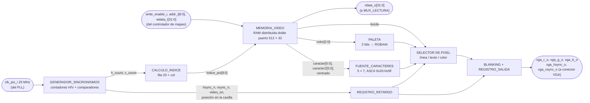
```mermaid
flowchart LR
    IN_BUS(["write_enable_i, addr_i[8:0], wdata_i[31:0]<br/>(del controlador de mapeo)"]) --> MEM["MEMORIA_VIDEO<br/>RAM distribuida doble puerto 512 × 32"]
    MEM --> OUT_RD(["rdata_o[31:0]<br/>(a MUX_LECTURA)"])

    IN_PIX(["clk_pix_i 25 MHz<br/>(del PLL)"]) --> SYNC["GENERADOR_SINCRONISMOS<br/>contadores H/V + comparadores"]
    SYNC -->|"h_count, v_count"| IDX["CALCULO_INDICE<br/>fila·20 + col"]
    IDX -->|"indice_pix[8:0]"| MEM
    MEM -->|"color[2:0]"| PAL["PALETA<br/>3 bits → RGB444"]
    MEM -->|"caracter[5:0], caracter2[5:0],<br/>centrado"| FUE["FUENTE_CARACTERES<br/>5 × 7, ASCII 0x20-0x5F"]
    MEM -->|"borde"| SEL
    SYNC -->|"hsync_n, vsync_n, video_on,<br/>posición en la casilla"| RET["REGISTRO_RETARDO"]
    PAL --> SEL["SELECTOR DE PIXEL<br/>línea / texto / color"]
    FUE --> SEL
    SEL --> SAL["BLANKING + REGISTRO_SALIDA"]
    RET --> SEL
    RET --> SAL
    SAL --> OUT_VGA(["vga_r_o, vga_g_o, vga_b_o<br/>vga_hsync_o, vga_vsync_o (a conector VGA)"])
```

## c) Objetivo del módulo

Genera la imagen del Jugador 1 en un monitor VGA de 640 × 480 a 60 Hz a partir de un mapa de
casillas (*tiles*) que el procesador escribe con `sw`. Es el único bloque del diseño que toca los
pines del conector VGA de la Basys 3.

A diferencia de los demás periféricos no tiene registros de control: se comporta como una
**memoria de video** mapeada en `0x0001_1000`–`0x0001_17FF`, con una palabra de 32 bits por
casilla de una cuadrícula de 20 × 15 casillas de 32 × 32 píxeles (sección 4.5.1 del enunciado).

No sabe nada del juego. No conoce tableros, turnos ni barcos. Pinta en cada casilla lo que el
programa escribió en su palabra, 60 veces por segundo, y nada más: un color de fondo, si lleva o no
la línea del grid y, si se pidió, hasta dos letras o números encima, o uno solo centrado.

---

## d) Entradas

- `clk_i`, reloj del sistema, el mismo del procesador. Sincroniza las escrituras del CPU. El
  periférico no depende de su frecuencia.
- `rst_i`, reinicio del sistema. Solo reinicia la lógica de barrido; no borra la memoria de video.
  Tiene que durar al menos dos periodos de `clk_pix_i` (80 ns) para que el sincronizador lo vea;
  el reinicio del botón y el `locked` del PLL duran mucho más que eso.
- `clk_pix_i`, reloj de píxel de 25 MHz, desde el PLL del top.
- `write_enable_i`, habilitación de escritura, desde el controlador de mapeo (`we_o && sel_vga`).
- `addr_i[8:0]`, índice de palabra, desde el controlador de mapeo (`DataAddress_o[10:2]`).
- `wdata_i[31:0]`, palabra de la casilla, desde el controlador de mapeo (`DataOut_o`).

`addr_i` es de 9 bits y no de 2 como en los periféricos de registros. El enunciado permite esta
excepción para el VGA (sección 4.5.5), y 9 bits son justo los que indexan las 512 palabras del
rango reservado. Las demás señales del bus conservan los nombres de la interfaz estándar.

---

## e) Salidas

- `rdata_o[31:0]`, palabra de la casilla apuntada por `addr_i`, hacia `MUX_LECTURA`.
- `vga_hsync_o`, sincronismo horizontal, activo en bajo.
- `vga_vsync_o`, sincronismo vertical, activo en bajo.
- `vga_r_o[3:0]`, `vga_g_o[3:0]`, `vga_b_o[3:0]`, canales de color hacia el DAC R-2R de la Basys 3.

---

## f) Relación con otros módulos

Hacia adentro del sistema habla con el **controlador de mapeo**. El controlador compara
`DataAddress_o[31:11]` con `0x00022` para generar `sel_vga`, habilita la escritura con
`we_o && sel_vga` y le pasa `DataAddress_o[10:2]` como `addr_i`. En una lectura, `rdata_o` entra
al `MUX_LECTURA` del controlador y de ahí a `DataIn_i` del procesador. El VGA no necesita árbitro
porque el procesador es su único maestro.

Recibe `clk_pix_i` del **PLL** del top, que también genera el reloj del sistema, así que los dos
relojes están relacionados en fase.

Hacia afuera es el único módulo conectado al conector VGA.

La división de trabajo con el programa en ensamblador es:

- El **programa** decide **qué** se ve: qué color y qué letra van en cada casilla, cuáles llevan
  la línea del grid, dónde está el cursor, qué dice el HUD, y en particular que nunca se escriba el
  color de barco en las casillas del tablero del Jugador 2.
- El **periférico** decide **cómo** se ve: temporización, barrido, conversión del código de color
  a RGB, la forma de las letras, el grosor de la línea y *blanking*.

Para cambiar la distribución de la pantalla, los textos o qué color significa qué, se cambia el
programa. Para cambiar un color de la paleta, la forma de una letra o agregar un carácter, se
cambia el periférico.

---

## g) Explicación de funcionamiento

El periférico tiene dos lados que solo comparten la memoria de video.

**Lado del CPU (33,33 MHz).** Para pintar una casilla, el programa calcula
`0x0001_1000 + (fila × 20 + col) × 4` y ejecuta un `sw`. La palabra queda guardada en el mismo
ciclo, sin bits de `start` ni espera de `busy`, como pide el enunciado. Borrar la pantalla es un
lazo de software que escribe el color de fondo en las 300 casillas.

**Lado del monitor (25 MHz).** Dos contadores recorren sin parar las 800 × 525 posiciones de un
cuadro, incluidas las de borrado. En cada ciclo, la posición actual se convierte en el índice de
su casilla y se lee esa palabra de la memoria. Con la palabra y la posición del píxel dentro de la
casilla se decide el color del píxel: negro si cae en el contorno de una casilla con borde, el
color del texto si cae en un punto encendido de la letra, y si no el color de fondo de la casilla
pasado por la paleta. Sale hacia los pines junto con los sincronismos. Fuera del área visible la
salida se fuerza a negro.

Un cambio escrito por el CPU aparece en pantalla en el siguiente cuadro, a lo sumo 16,7 ms
después. Para la percepción del jugador es instantáneo.

---

## h) Diseño

### Formato de la palabra de casilla

| Bits | Nombre | Uso |
|---|---|---|
| `[2:0]` | `color` | Color de fondo de la casilla, entra a la paleta |
| `[3]` | `borde` | En 1, la casilla lleva una línea negra de 1 píxel en su contorno |
| `[9:4]` | `caracter` | Carácter de la mitad izquierda de la casilla, en ASCII − 32. `0` es espacio, sin carácter |
| `[15:10]` | `caracter2` | Carácter de la mitad derecha, con el mismo código |
| `[16]` | `centrado` | En 1, se dibuja solo `caracter`, en el centro de la casilla, y `caracter2` se ignora |
| `[31:17]` | Reservado | Se escribe en 0 |

Los bits reservados se guardan en la memoria (se leen de vuelta con `lw`) pero el barrido los
ignora. Una palabra con solo `color` se ve como un bloque de color sólido.

El enunciado sugiere los bits `[7:3]` para códigos de carácter. Se usan `[9:4]` porque 5 bits dan
32 símbolos y el HUD necesita 36 (letras y dígitos), y porque así el bit 3 queda para el borde.
Con el código en ASCII − 32 el ensamblador calcula los códigos sin tabla ('A' − 32 = 33).

Dos caracteres por casilla dan 40 por fila de pantalla, y con eso entran en una sola fila los
mensajes que necesita el HUD, como `APUNTE CON FLECHAS Y DISPARE CON SW0`. Con uno por casilla
habría 20 por fila y los mensajes tendrían que partirse en abreviaturas. El bit `centrado` sirve
para lo que va de a un carácter por casilla, como las letras de columna y los números de fila de
los tableros, que así quedan alineados con la casilla que nombran.

### Paleta

| `color` | Uso | RGB444 |
|---|---|---|
| `000` | Agua | `0x04A` |
| `001` | Barco propio | `0x888` |
| `010` | Impacto | `0xF00` |
| `011` | Fallo | `0xFFF` |
| `100` | Cursor | `0xFF0` |
| `101` | Fondo y separadores del HUD | `0x000` |
| `110` | Indicador de turno Jugador 1 | `0x0F0` |
| `111` | Indicador de turno Jugador 2 | `0xF0F` |

Los cuatro primeros son los que exige el enunciado. Los colores concretos pueden ajustarse al
probar en el monitor sin cambiar nada más del diseño, salvo la copia de la paleta que tiene el
testbench.

El texto no tiene color propio. Sale en negro sobre los fondos claros (`011` blanco, `100`
amarillo, `110` verde) y en blanco sobre el resto, así siempre contrasta con su casilla y el
programa no gasta bits en elegirlo.

Los códigos `000` a `011` coinciden con los estados de casilla que el programa guarda en RAM (bits
`[1:0]`, ver [`nivel03.md`](diagramas/nivel03.md)), y el programa pinta el tablero propio
copiando ese estado tal cual. Si se cambia el orden de esos cuatro códigos, hay que cambiar también
la codificación del tablero en RAM.

### Temporización 640 × 480 @ 60 Hz

| Parámetro | Horizontal (píxeles) | Vertical (líneas) |
|---|---|---|
| Área visible | 0–639 | 0–479 |
| *Front porch* | 640–655 (16) | 480–489 (10) |
| Pulso de sincronismo | 656–751 (96) | 490–491 (2) |
| *Back porch* | 752–799 (48) | 492–524 (33) |
| Total | 800 | 525 |
| Polaridad del sincronismo | negativa | negativa |

Con 25 MHz, 25 000 000 / (800 × 525) ≈ 59,52 Hz. La diferencia con los 59,94 Hz del estándar
(reloj de 25,175 MHz) está dentro de la tolerancia de los monitores.

De ahí salen las señales del barrido:

```
h_visible = (h_count <= 639)
v_visible = (v_count <= 479)
video_on  = h_visible & v_visible
hsync_n   = ~((h_count >= 656) & (h_count <= 751))
vsync_n   = ~((v_count >= 490) & (v_count <= 491))
fin_linea = (h_count == 799)
```

`CONTADOR_H` incrementa en cada ciclo de `clk_pix_i` y vuelve a 0 después de 799. `CONTADOR_V`
solo incrementa cuando `fin_linea = 1` y vuelve a 0 después de 524. Los dos son de 10 bits.

### Resolución de la cuadrícula

Se usa la cuadrícula de 20 × 15 casillas de 32 × 32 píxeles que sugiere el enunciado:

- **Cabe en la memoria.** 20 × 15 = 300 palabras ≤ 512. Con casillas de 16 × 16 serían 40 × 30 =
  1200 palabras, y no caben en el rango de `0x0001_1000`–`0x0001_17FF`.
- **No necesita divisor.** Dividir entre 32 es tomar los bits altos de cada contador:
  `col = h_count[9:5]` (0–19) y `fila = v_count[8:5]` (0–14).
- **Alcanza para el juego.** Los dos tableros de 8 × 8 ocupan 16 columnas. Quedan 4 columnas para
  los números de fila y la separación, y 7 filas para el HUD.

Distribución de la pantalla que usa el programa (la decide el programa, no el periférico):

```
col:      0   1 ........ 8   9  10  11 ....... 18  19
fila 0        vacía
fila 1          JUGADOR 1                 JUGADOR 2           títulos
fila 2        barras de estado: COLOCANDO / LISTO, TURNO DEL JUGADOR n, GANA EL JUGADOR n
fila 3        A B C D E F G H       A B C D E F G H        letras de columna, centradas
fila 4-11 1-8 tablero J1 (propio)  1-8 tablero J2 (rival)  con borde, números centrados
fila 12       mensaje de traspaso: J1 COLOCA CON BOTONES Y J2 DESDE LA PC /
              APUNTE CON FLECHAS Y DISPARE CON SW0 / ESPERANDO EL DISPARO DEL JUGADOR 2
fila 13       PARTIDAS GANADAS   J1 00   J2 00
fila 14       vacía
```

Las filas 0 y 14 quedan vacías porque muchos monitores esconden unos píxeles del borde de la
imagen. Al terminar la partida las filas 2 y 12 se pintan del color del ganador, con
`GANA EL JUGADOR n` y `SUBA Y BAJE SW15 PARA OTRA PARTIDA`. El detalle está en
[`PROGRAMA.md`](modulos/PROGRAMA.md).

### Borde de casilla

Una casilla con `borde = 1` lleva negro en su primer y último píxel de cada eje. Como
dividir entre 32 es tomar los bits altos, la posición dentro de la casilla son los 5 bits bajos de
los contadores:

```
en_contorno = (h_count[4:0] == 0) | (h_count[4:0] == 31) | (v_count[4:0] == 0) | (v_count[4:0] == 31)
```

Cada casilla dibuja su propio contorno, así que entre dos casillas con borde la línea queda de
2 píxeles y en el contorno exterior de un tablero de 1. El programa lo enciende en las 128 casillas
de los tableros y lo deja apagado en el HUD, por eso los tableros se ven como un grid y el resto
de la pantalla no.

### Caracteres

Cada casilla se divide en una cuadrícula de 16 × 16 celdas de 2 × 2 píxeles:

```
celda_col  = h_count[4:1]   (0-15)
celda_fila = v_count[4:1]   (0-15)
```

El glifo de 5 × 7 de [`FUENTE_CARACTERES`](modulos/FUENTE_CARACTERES.md) se dibuja con cada punto en una
celda, así que mide 10 × 14 píxeles. Va en las filas de celda 5 a 11 (píxeles 10 a 23 de la
casilla), centrado en vertical. En horizontal depende de `centrado`:

| `centrado` | Carácter | Columnas de celda del glifo | Columna del glifo |
|---|---|---|---|
| 0, mitad izquierda (`celda_col` 0 a 7) | `caracter` | 1 a 5 | `celda_col[2:0] − 1` |
| 0, mitad derecha (`celda_col` 8 a 15) | `caracter2` | 9 a 13 | `celda_col[2:0] − 1` |
| 1 | `caracter` | 5 a 9 (píxeles 10 a 19) | `celda_col − 5` |

Cada mitad deja una celda libre antes del glifo y dos después, así que dos letras seguidas, en la
misma casilla o en casillas vecinas, quedan separadas y se leen como una palabra. El píxel es de
texto cuando

```
glifo_fila  = celda_fila − 5
pixel_texto = (0 <= glifo_col <= 4) & (0 <= glifo_fila <= 6) & bits_glifo[4 − glifo_col]
```

donde `bits_glifo` es la fila `glifo_fila` del carácter elegido. Las dos restas se hacen en 4 bits
sin signo: si la celda queda antes del glifo, la resta da la vuelta a un número grande y la
comparación con 4 (o con 6) la descarta, sin comparar contra el inicio. Con código 0 (espacio) la
fuente da todo en cero y esa mitad queda del color de la casilla.

### Prioridad del píxel

En el área visible, de mayor a menor prioridad:

1. Contorno de una casilla con borde → `0x000`.
2. Punto encendido de la letra → `0x000` sobre fondo claro, `0xFFF` sobre el resto.
3. Color de fondo de la casilla por la paleta.

Fuera del área visible, `0x000`.

### Cálculo del índice

```
indice_pix = fila × 20 + col = {fila, 4'b0000} + {fila, 2'b00} + col
```

La multiplicación por 20 se reduce a dos desplazamientos cableados y dos sumadores de 9 bits. El
máximo en el área visible es 14 × 20 + 19 = 299. Fuera del área visible el índice puede apuntar a
cualquier palabra, pero ese dato se descarta con `video_on`. El programa usa la misma fórmula,
también con desplazamientos, porque `rv32i` no tiene `mul`.

### Memoria de doble puerto y cruce de dominios

`MEMORIA_VIDEO` es un arreglo `logic [31:0] memoria_video [0:511]` con un puerto de escritura y
dos de lectura:

| Puerto | Reloj | Acceso | Señales |
|---|---|---|---|
| A | `clk_i` | escritura síncrona, lectura combinacional | `write_enable_i`, `addr_i`, `wdata_i`, `rdata_o` |
| B | `clk_pix_i` | solo lectura, registrada en `color`, `borde`, `caracter`, `caracter2` y `centrado` | `indice_pix`, `color`, `borde`, `caracter`, `caracter2`, `centrado` |

El puerto A se lee de forma combinacional porque así lee el núcleo su RAM de datos. El procesador
es el núcleo de ciclo único de riscv-simple-sv, cuya memoria de ejemplo (`example_data_memory`)
hace `assign q = mem[address]`: un `lw` presenta la dirección y espera el dato en el mismo ciclo.
Una BRAM no puede hacer eso, porque su lectura siempre pasa por un registro, así que la memoria de
video se implementa como **RAM distribuida** (LUTRAM). El puerto B lee la misma memoria de forma
combinacional y registra el resultado con `clk_pix_i`. Ese registro es lo que lo deja sincronizado
al reloj de píxel, como pide la sección 4.5.1.

Con `synth_xilinx` de yosys la memoria queda en 128 primitivas `RAM128X1D`, que ocupan 512 LUT de
tipo SLICEM, cerca del 2,5 % de las 20 800 LUT de la XC7A35T. Cada `RAM128X1D` trae un puerto de
lectura y escritura y uno de solo lectura, que son justo los dos puertos del diseño. La memoria
arranca en ceros (agua en toda la pantalla) porque el arreglo tiene valor inicial, que en la FPGA
se carga con la configuración.

La memoria es el único punto donde se cruzan los dominios. No hay señales de control que crucen
de un reloj al otro, así que no hacen falta sincronizadores para los datos. Si el barrido lee una
casilla justo cuando el CPU la escribe, los píxeles leídos en ese instante pueden salir con un
color equivocado durante un solo cuadro. No afecta al juego, porque el estado de los tableros vive
en la RAM de datos y la memoria de video es solo su representación. Por la misma razón, si al
cerrar *timing* el camino de la escritura en `clk_i` al registro `color` en `clk_pix_i` falla por
la relación entre las dos frecuencias, se puede declarar como falso camino.

La única señal que cruza de dominio es el reinicio. `rst_i` pasa por un `SINCRONIZADOR_RESET` de
dos *flip-flops* en `clk_pix_i` y sale como `rst_pix`, que reinicia los contadores del barrido.

### Alineación de la salida

La lectura del puerto B tarda un ciclo, así que las señales de control del mismo píxel se retrasan
lo mismo para que lleguen alineadas con su color:

| Ciclo de `clk_pix_i` | Camino de color | Camino de control |
|---|---|---|
| t | contadores → `indice_pix` | contadores → `hsync_n`, `vsync_n`, `video_on`, `en_contorno`, `h_count[4:1]`, `v_count[4:1]` |
| t + 1 | el registro del puerto B entrega `color`, `borde`, `caracter`, `caracter2` y `centrado` → paleta, fuente, selector de píxel → *blanking* | `REGISTRO_RETARDO` entrega `*_d` |
| t + 2 | `REGISTRO_SALIDA` → `vga_r/g/b_o` | `REGISTRO_SALIDA` → `vga_hsync_o`, `vga_vsync_o` |

Los dos caminos tienen la misma latencia de 2 ciclos. Sin `REGISTRO_RETARDO` la imagen quedaría
corrida un píxel respecto a los sincronismos, y la línea y las letras un píxel respecto a su
casilla. La fuente es combinacional y entra en el ciclo t + 1 con el resto del selector, así que
el borde y el texto no agregan latencia. Con el sistema integrado, nextpnr-xilinx da cerca de
92 MHz de máximo para `clk_pix` después del ruteo, contra los 25 MHz que necesita. `REGISTRO_SALIDA` además evita que los *glitches*
de la paleta y el multiplexor lleguen a los pines.

### Lectura desde el CPU

`rdata_o` sale del puerto A sin pasar por ningún registro: cambia en cuanto cambia `addr_i`. Un
`lw` a la memoria de video funciona igual que uno a la RAM de datos y recibe la palabra completa,
con los bits reservados. Aun así, el programa mantiene el estado de los tableros en RAM y no
depende de leer la memoria de video.

### Latches

La paleta, el cálculo del índice, los comparadores, el selector de píxel y el *blanking* son
`always_comb` o `assign` con todas sus salidas asignadas en cada camino (la paleta con un `case`
completo de 8 entradas, la fuente con `default`). Los contadores y los registros de retardo y
salida están en `always_ff` con reinicio síncrono por `rst_pix`. Los registros `color`, `borde`,
`caracter`, `caracter2` y `centrado` y los del sincronizador no lo necesitan. La síntesis con yosys
no reporta ningún `Latch inferred`.

---

## i) Diagrama esquemático detallado del diseño

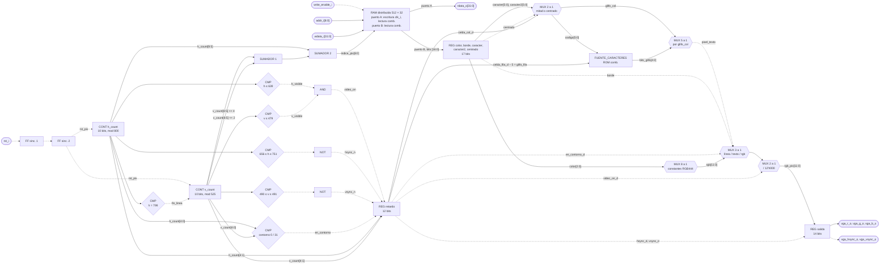
```mermaid
flowchart LR
    WE(["write_enable_i"]) -.-> MEM["RAM distribuida 512 × 32<br/>puerto A: escritura clk_i, lectura comb.<br/>puerto B: lectura comb."]
    ADDR(["addr_i[8:0]"]) --> MEM
    WDATA(["wdata_i[31:0]"]) --> MEM
    MEM -->|"puerto A"| OUT_RD(["rdata_o[31:0]"])

    RST(["rst_i"]) -.-> FF1["FF sinc. 1"] -.-> FF2["FF sinc. 2"]
    FF2 -.->|"rst_pix"| CH["CONT h_count<br/>10 bits, mod 800"]
    FF2 -.->|"rst_pix"| CV["CONT v_count<br/>10 bits, mod 525"]
    CH --> CMP_FL{"CMP<br/>h = 799"}
    CMP_FL -.->|"fin_linea"| CV

    CH --> CMP_HV{"CMP<br/>h ≤ 639"}
    CH --> CMP_HS{"CMP<br/>656 ≤ h ≤ 751"}
    CV --> CMP_VV{"CMP<br/>v ≤ 479"}
    CV --> CMP_VS{"CMP<br/>490 ≤ v ≤ 491"}
    CMP_HV -.->|"h_visible"| AND_VO["AND"]
    CMP_VV -.->|"v_visible"| AND_VO
    CMP_HS -.-> NOT_H["NOT"]
    CMP_VS -.-> NOT_V["NOT"]

    CH -->|"h_count[9:5]"| SUM2["SUMADOR 2"]
    CV -->|"v_count[8:5] << 4"| SUM1["SUMADOR 1"]
    CV -->|"v_count[8:5] << 2"| SUM1
    SUM1 --> SUM2
    SUM2 -->|"indice_pix[8:0]"| MEM

    AND_VO -.->|"video_on"| REG_RET["REG retardo<br/>12 bits"]
    NOT_H -.->|"hsync_n"| REG_RET
    NOT_V -.->|"vsync_n"| REG_RET

    CH -->|"h_count[4:0]"| CMP_CT{"CMP<br/>contorno 0 / 31"}
    CV -->|"v_count[4:0]"| CMP_CT
    CMP_CT -.->|"en_contorno"| REG_RET
    CH -->|"h_count[4:1]"| REG_RET
    CV -->|"v_count[4:1]"| REG_RET

    MEM -->|"puerto B, bits [16:0]"| REG_COL["REG color, borde, caracter,<br/>caracter2, centrado<br/>17 bits"]
    REG_COL -->|"color[2:0]"| MUX_PAL{{"MUX 8 a 1<br/>constantes RGB444"}}
    REG_COL -->|"caracter[5:0], caracter2[5:0]"| MUX_COD{{"MUX 2 a 1<br/>mitad o centrado"}}
    REG_COL -.->|"centrado"| MUX_COD
    REG_RET -->|"celda_col_d"| MUX_COD
    MUX_COD -->|"codigo[5:0]"| FUE["FUENTE_CARACTERES<br/>ROM comb."]
    MUX_COD -->|"glifo_col"| MUX_BIT
    REG_RET -->|"celda_fila_d − 5 = glifo_fila"| FUE
    FUE -->|"bits_glifo[4:0]"| MUX_BIT{{"MUX 5 a 1<br/>por glifo_col"}}
    MUX_BIT -.->|"pixel_texto"| MUX_SEL{{"MUX 3 a 1<br/>línea / texto / rgb"}}
    REG_COL -.->|"borde"| MUX_SEL
    REG_RET -.->|"en_contorno_d"| MUX_SEL
    MUX_PAL -->|"rgb[11:0]"| MUX_SEL
    MUX_SEL --> MUX_BLK{{"MUX 2 a 1<br/>/ 12'h000"}}
    REG_RET -.->|"video_on_d"| MUX_BLK
    MUX_BLK -->|"rgb_pix[11:0]"| REG_OUT["REG salida<br/>14 bits"]
    REG_RET -.->|"hsync_d, vsync_d"| REG_OUT

    REG_OUT --> OUT_RGB(["vga_r_o, vga_g_o, vga_b_o"])
    REG_OUT -.-> OUT_SYNC(["vga_hsync_o, vga_vsync_o"])
```

Las líneas continuas llevan datos y las punteadas llevan control. `clk_pix_i` entra a los dos
*flip-flops* del sincronizador, a los contadores y a los registros de color, retardo y salida;
`clk_i` entra a la escritura del puerto A. No se dibujan para mantener legible el diagrama. Los comparadores contra
constantes no se dibujan por compuertas; en la FPGA son árboles de LUT.

---

## j) Diagrama completo de conexiones del diseño

Este módulo tiene puertos físicos propios, así que lleva restricciones de pin en
`src/fpga/basys3.xdc`, todas con `IOSTANDARD LVCMOS33`:

| Puerto | Pin Basys 3 | Señal del conector |
|---|---|---|
| `vga_r_o[0]` | G19 | `vgaRed[0]` |
| `vga_r_o[1]` | H19 | `vgaRed[1]` |
| `vga_r_o[2]` | J19 | `vgaRed[2]` |
| `vga_r_o[3]` | N19 | `vgaRed[3]` |
| `vga_g_o[0]` | J17 | `vgaGreen[0]` |
| `vga_g_o[1]` | H17 | `vgaGreen[1]` |
| `vga_g_o[2]` | G17 | `vgaGreen[2]` |
| `vga_g_o[3]` | D17 | `vgaGreen[3]` |
| `vga_b_o[0]` | N18 | `vgaBlue[0]` |
| `vga_b_o[1]` | L18 | `vgaBlue[1]` |
| `vga_b_o[2]` | K18 | `vgaBlue[2]` |
| `vga_b_o[3]` | J18 | `vgaBlue[3]` |
| `vga_hsync_o` | P19 | `Hsync` |
| `vga_vsync_o` | R19 | `Vsync` |

Conexiones en `src/design/top.sv`, instancia `u_periferico_vga`:

- `clk_i`, a `clk_sys`, el reloj del sistema de 33,33 MHz que entrega el PLL a partir del oscilador de 100 MHz (pin W5).
- `clk_pix_i`, a `clk_pix`, la salida de 25 MHz del mismo PLL.
- `rst_i`, al reinicio general del sistema, `~locked` del PLL sincronizado.
- `write_enable_i`, `addr_i[8:0]`, `wdata_i[31:0]`, desde el controlador de mapeo.
- `rdata_o[31:0]`, hacia `MUX_LECTURA` del controlador de mapeo.
- `vga_r_o`, `vga_g_o`, `vga_b_o`, `vga_hsync_o`, `vga_vsync_o`, a los puertos del top con el
  mismo nombre.

Adentro, `u_fuente` es la instancia de `fuente_caracteres`, con `codigo_i` en `codigo` (`caracter`
o `caracter2` según la mitad de la casilla y `centrado`), `fila_i` en `glifo_fila[2:0]` y `bits_o` en
`glifo_bits`.

---

## Verificación

`src/sim/tb_periferico_vga.sv` corre el periférico solo, con los dos relojes a su frecuencia real,
y compara **cada píxel de cuadros completos** contra un modelo que lleva el testbench aparte. El
modelo guarda `[16:0]` de cada palabra escrita y calcula el píxel esperado con la misma prioridad
de la sección h): contorno, texto, paleta. La paleta está escrita de nuevo a mano en el testbench.
La fuente la lee una vez al arrancar de otra instancia de `fuente_caracteres`, para no copiarla, y
se revisa aparte que la `A` coincida con su dibujo hecho a mano y que el espacio no dibuje nada.

Entre las 28 pruebas están la temporización de `hsync` y `vsync`, la lectura combinacional del
puerto A, un cuadro con un impacto en (3, 5) que tiene que ocupar exactamente
`h = 160..191` y `v = 96..127`, un cuadro con los 8 colores y basura aleatoria en los bits `[31:3]`
(eso enciende el borde y el centrado en cerca de la mitad de las casillas, pone caracteres al azar en
las dos mitades de todas y prueba que el barrido ignora `[31:17]`), escrituras a mitad de cuadro y
un reinicio que no borra la memoria.

`src/sim/tb_top.sv` lo prueba dentro del sistema completo con el programa real: que las 128
casillas de los tableros lleven el borde y ninguna otra, y que los textos del HUD digan lo que
tienen que decir en cada fase de una partida completa.

En la Basys 3 se probó primero con `src/design/prueba_vga.sv`, un top sin procesador que llena la
memoria con un patrón fijo (`make bitstream SYNTH_TOP=prueba_vga`), y después con el sistema
completo.

---

<!-- Fuente: docs/diseño/modulos/FUENTE_CARACTERES.md -->

# FUENTE_CARACTERES

## a) Nombre del módulo

FUENTE_CARACTERES, módulo `fuente_caracteres` en `src/design/fuente_caracteres.sv`.

## b) Diagrama modular

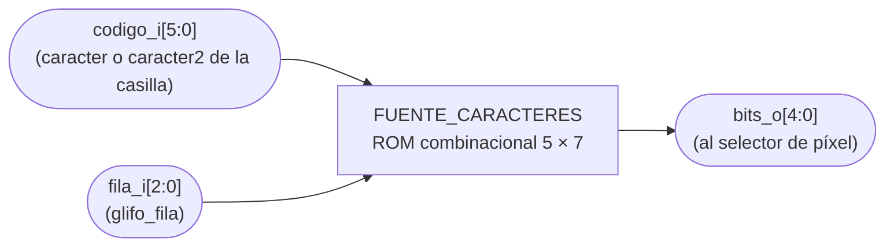
```mermaid
flowchart LR
    IN_COD(["codigo_i[5:0]<br/>(caracter o caracter2 de la casilla)"]) --> FUE["FUENTE_CARACTERES<br/>ROM combinacional 5 × 7"]
    IN_FILA(["fila_i[2:0]<br/>(glifo_fila)"]) --> FUE
    FUE --> OUT(["bits_o[4:0]<br/>(al selector de píxel)"])
```

## c) Objetivo del módulo

Guardar la forma de cada letra y número que el VGA puede dibujar dentro de una casilla. Con el
código de un carácter y una de sus filas, devuelve qué columnas de esa fila van encendidas. Es lo
que deja al HUD escribir títulos, letras de columna, números de fila y mensajes.

No sabe dónde está la casilla ni de qué color es. Solo guarda dibujos.

## d) Entradas

- `codigo_i[5:0]`, código del carácter en ASCII − 32, desde los registros `caracter` o `caracter2` del puerto B de
  la memoria de video. `0` es el espacio.
- `fila_i[2:0]`, fila del glifo, de 0 (arriba) a 7. La 7 siempre sale en blanco.

## e) Salidas

- `bits_o[4:0]`, los 5 puntos de esa fila. `bits_o[4]` es la columna izquierda y `bits_o[0]` la
  derecha. Un 1 es un punto encendido.

## f) Relación con otros módulos

Solo lo instancia `PERIFERICO_VGA`, como `u_fuente`. `codigo_i` le llega de `caracter` (bits `[9:4]`
de la palabra de la casilla) o de `caracter2` (bits `[15:10]`), según la mitad de la casilla que
se está barriendo y el bit `centrado`. `fila_i` le llega de `glifo_fila`, que es `v_count[4:1]`
atrasado un ciclo menos 5. `bits_o` va al multiplexor que elige el punto de la columna
`glifo_col`, y de ahí al selector de píxel. La fuente es una sola y la comparten las dos mitades,
porque en cada píxel solo se dibuja una.

El testbench `tb_periferico_vga` también lo instancia, una vez y por separado, para leer la tabla
completa al arrancar y usarla en su modelo.

## g) Explicación de funcionamiento

Es una tabla. La entrada `{codigo_i, fila_i}` selecciona una de 512 filas posibles, y cada fila
guarda 5 bits. Para el carácter `A` (código 33):

```
fila 0   01110    .###.
fila 1   10001    #...#
fila 2   10001    #...#
fila 3   10001    #...#
fila 4   11111    #####
fila 5   10001    #...#
fila 6   10001    #...#
fila 7   00000    .....
```

El periférico amplía cada punto a 2 × 2 píxeles, así que la letra mide 10 × 14 píxeles y entran
dos por casilla de 32 × 32, una en cada mitad.

## h) Diseño

### Por qué ASCII − 32

Los caracteres imprimibles empiezan en el espacio, `0x20`. Restar 32 deja el espacio en 0, que
es justo el valor de una casilla sin texto, y deja el rango `0x20`–`0x5F` (espacio, signos, dígitos
y mayúsculas) en los 64 códigos de 6 bits. El programa obtiene el código de cualquier letra con la
misma cuenta, sin tabla: `'A' − 32 = 33`, `'0' − 32 = 16`.

### Qué caracteres trae

Espacio, `0` a `9`, `A` a `Z`, y `!`, `-`, `:`. Son 40 de los 64 códigos posibles. Los demás caen
en el `default` y salen en blanco. El HUD solo usa letras y dígitos.

Para agregar un carácter basta con sumar sus 7 filas al `case`, con su código. No hace falta
tocar el periférico ni el programa.

### La fuente

Es una fuente de 5 × 7 del mismo estilo que la de las pantallas de caracteres tipo HD44780. Se
eligió 5 × 7 porque, ampliada × 2, entran dos letras por casilla y 40 por fila de pantalla, que es
lo que necesitan los mensajes del HUD, y se sigue leyendo bien desde lejos. Ampliar × 2 es tomar
`h_count[4:1]` y `v_count[4:1]`, sin divisor.

### Implementación

`always_comb` con un `case` sobre `{codigo_i, fila_i}` y una rama `default` en cero, así que no
infiere latches. En la FPGA queda como lógica en LUT, de solo lectura. Corre en el dominio de
`clk_pix_i` porque su entrada sale de registros de ese dominio, y tiene un ciclo completo de 40 ns
para resolverse dentro del selector de píxel.

## i) Diagrama esquemático detallado del diseño

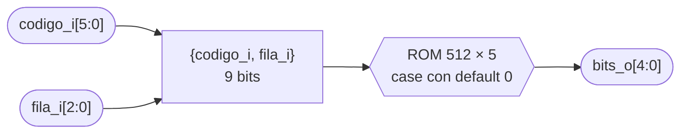
```mermaid
flowchart LR
    COD(["codigo_i[5:0]"]) --> CAT["{codigo_i, fila_i}<br/>9 bits"]
    FILA(["fila_i[2:0]"]) --> CAT
    CAT --> ROM{{"ROM 512 × 5<br/>case con default 0"}}
    ROM --> OUT(["bits_o[4:0]"])
```

Es combinacional, no recibe reloj.

## j) Diagrama completo de conexiones del diseño

No tiene puertos hacia pines de la Basys 3, así que no agrega nada a `src/fpga/basys3.xdc`.

Conexiones dentro de `PERIFERICO_VGA`, instancia `u_fuente`:

- `codigo_i`, a `codigo`, que es `caracter` o `caracter2` según la mitad de la casilla y `centrado`.
- `fila_i`, a `glifo_fila[2:0]`.
- `bits_o`, a `glifo_bits`.

Igual que en los demás módulos, el diagrama por chips que pide el método no aplica a un diseño que se
sintetiza dentro de una sola FPGA, y esta lista de puertos es el reemplazo propuesto.

## Verificación

`tb_periferico_vga` revisa a mano que la `A` sea la de la sección g) y que el espacio no
dibuje nada. El resto de la tabla lo usa el modelo del testbench para revisar dónde y de qué color
sale cada glifo, cuadro completo por cuadro completo, con caracteres al azar en todas las casillas.
`tb_top` revisa los textos que escribe el programa leyendo el código de cada casilla.

---

<!-- Fuente: docs/diseño/modulos/PERIFERICO_UART.md -->

# PERIFERICO_UART

## a) Nombre del módulo

PERIFERICO_UART

## b) Diagrama modular

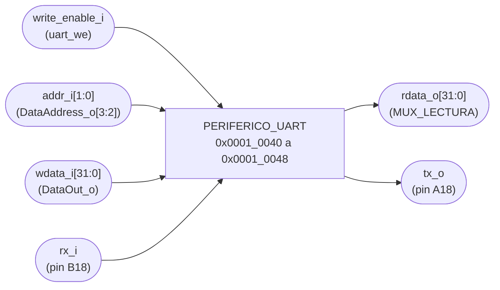
```mermaid
flowchart LR
    IN_WE(["write_enable_i<br/>(uart_we)"]) --> PUART["PERIFERICO_UART<br/>0x0001_0040 a 0x0001_0048"]
    IN_ADDR(["addr_i[1:0]<br/>(DataAddress_o[3:2])"]) --> PUART
    IN_WD(["wdata_i[31:0]<br/>(DataOut_o)"]) --> PUART
    IN_RX(["rx_i<br/>(pin B18)"]) --> PUART
    PUART --> OUT_RD(["rdata_o[31:0]<br/>(MUX_LECTURA)"])
    PUART --> OUT_TX(["tx_o<br/>(pin A18)"])
```

Es el bloque `PERIFERICO_UART` de `../diagramas/nivel03.md` visto desde afuera. Lo que tiene adentro
está en el inciso i).

## c) Objetivo del módulo

Envuelve los dos núcleos serie que da el curso (`UART_tx.vhd` y `UART_rx.vhd`, portados a
SystemVerilog) en la interfaz estándar de periférico de 32 bits de la sección 4.5.5 del
enunciado. Es el mismo periférico del Proyecto 2, que la sección 4.5.3 pide reutilizar, con el
mapa de registros ajustado a la tabla de la sección 4.4.3.

Es el único canal entre la FPGA y el Jugador 2. Todo lo que manda la app de PC (colocaciones,
disparos) entra por acá, y todo lo que la app necesita saber de la partida sale por acá.

No sabe nada del juego. No conoce tramas, ni barcos, ni turnos. Mueve bytes en las dos
direcciones y levanta banderas para que el programa en ensamblador las lea.

## d) Entradas

- `clk_i`, `rst_i`.
- `write_enable_i`, habilitación de escritura, desde `uart_we` del controlador de mapeo (`we_o` del CPU en AND
  con `sel_uart`).
- `addr_i[1:0]`, dirección del registro, sale de `DataAddress_o[3:2]` del CPU.
- `wdata_i[WIDTH-1:0]`, dato a escribir, desde `DataOut_o` del CPU.
- `rx_i`, línea serial cruda, desde el pin B18 de la Basys 3.

Los puertos del bus llevan sufijo `_i`/`_o` en vez del prefijo `i_`/`o_` que usa el resto del
repo, porque la sección 4.5.5 los nombra así y la interfaz es de cumplimiento obligatorio.

El módulo está parametrizado con `WIDTH = 32`, `CLK_FREQ_HZ = 100_000_000` y `BAUDIOS = 115200`.
De los dos últimos salen `TICKS_BIT` y `TICKS_X16`, que son `localparam` y se le pasan a los núcleos.
El top lo instancia con `CLK_FREQ_HZ = 33_333_333`, la frecuencia de `clk_i`, y en simulación se
baja para no esperar miles de ciclos por byte.

## e) Salidas

- `rdata_o[WIDTH-1:0]`, contenido del registro apuntado por `addr_i`, hacia el multiplexor de
  lectura que llega a `DataIn_i` del CPU.
- `tx_o`, línea serial hacia el pin A18 de la Basys 3.

## f) Relación con otros módulos

Hacia adentro habla con un solo maestro, el CPU. En el Proyecto 2 había dos
(`UART_receptor` y `UART_transmisor`) y por eso existía `ARBITRO_UART`. Acá toda esa
lógica pasa al ensamblador y el periférico ve un único puerto, sin árbitro en el medio.

El periférico tiene sus registros en `0x0001_0040`, `0x0001_0044` y `0x0001_0048`. El Address
Translator del controlador de mapeo, detallado en `Address_Translator.md`, activa `uart_we` solo en
esas tres direcciones, y en el top `DataAddress_o[3:2]` llega como `addr_i`. Los registros van de 4 en 4 bytes, así que los dos bits más bajos siempre valen cero y
no sirven para distinguir registros.

Hacia afuera habla con la app de PC del Jugador 2. `rx_i` y `tx_o` salen directo a los pines del
puente USB-UART, que es el mismo cable con el que se programa la tarjeta.

Los dos núcleos que instancia adentro, `uart_tx` y `uart_rx`, solo los usa este módulo. Tienen su
propio doc en `NUCLEO_UART_TX.md` y `NUCLEO_UART_RX.md`.

## g) Explicación de funcionamiento

El periférico es un banco de tres registros con dos máquinas serie colgando.

Para transmitir, el programa escribe el byte en el registro de datos de transmisión y después
levanta el bit `send` del registro de control. El periférico sostiene ese bit mientras el núcleo
suelta el byte por la línea, y lo baja solo cuando el núcleo avisa que terminó. Ese bit hace dos
trabajos a la vez. Es la orden de arranque y también la bandera de ocupado que el programa sondea
antes de mandar el siguiente byte de una trama. El enunciado del Proyecto 2 lo define como WC, lo
escribe el CPU y lo limpia el hardware.

Para recibir, el núcleo avisa con un pulso de un ciclo que hay un byte nuevo. El periférico lo
guarda en el registro de datos de recepción y levanta `new_rx`. Ese bit se queda alto hasta que
el programa lo escriba en cero después de leer el dato. Cualquier escritura al control escribe también `new_rx`, así que la
escritura que arranca un envío lo puede bajar sin querer. El orden de accesos que evita perder un byte
está en `../diagramas/nivel03.md`, en "Cómo usa la ROM el periférico".

Nada de esto bloquea al CPU. El lazo principal sondea `new_rx` en cada vuelta junto con los
botones del Jugador 1, que es lo que permite la colocación concurrente. Un byte a 115200 baudios
tarda unos 8680 ciclos, así que el lazo tiene tiempo de sobra para dar muchas vueltas entre byte y
byte.

## h) Diseño

### Mapa de registros

La tabla de la sección 4.4.3 del enunciado fija las tres direcciones. Con base `0x0001_0040`:

- `2'b00` (`0x0001_0040`), registro de control. Bit 0 es `send` (WC), bit 1 es `new_rx` (RW), y los
  bits `[31:2]` son reservados, se leen en cero y las escrituras sobre ellos se ignoran.
- `2'b01` (`0x0001_0044`), registro de datos de transmisión. Bits `[7:0]` son el byte a enviar,
  `[31:8]` son reservados y se leen en cero.
- `2'b10` (`0x0001_0048`), registro de datos de recepción. Bits `[7:0]` son el último byte recibido,
  `[31:8]` son reservados y se leen en cero. El enunciado del Proyecto 2 lo declara de escritura
  igual que el de transmisión, así que se implementa escribible aunque en la práctica solo lo
  escribe un testbench.
- `2'b11` (`0x0001_004C`), sin asignar. El AT no selecciona esa dirección, así que nunca llega al
  periférico. Igual las lecturas devuelven ceros y las escrituras no tienen efecto.

En el Proyecto 2 el control estaba en `2'b10` y los datos en `2'b00` y `2'b01`, porque allá el
orden lo escogía el equipo. Acá lo fija el enunciado.

### El registro de control

El control es un registro de verdad, `reg_control`, de `WIDTH` bits. `send` y `new_rx` no existen
como flip-flops sueltos, son los campos `reg_control[0]` y `reg_control[1]`, y la lectura de
`2'b00` devuelve `reg_control` entero.

La versión del Proyecto 2 los tenía sueltos y los concatenaba en la lectura,
`{30'b0, new_rx, send}`. Con dos bits funciona, pero cada campo nuevo (un `busy`, un error de
trama, un bit de desborde) obligaba a tocar la concatenación y el ancho del relleno a mano, y el
orden de los bits quedaba escondido en una línea del multiplexor. Con `reg_control` agregar un
campo es un `localparam` nuevo con su índice y su regla de actualización, y la lectura no se toca.

Cada campo se actualiza por su índice con su propia prioridad, que son las dos tablas de abajo.
Los bits sin campo solo se asignan en el reset, así que se quedan en cero y la síntesis los reduce
a constantes.

### El bit send

| Condición                                    | `reg_control[0]'` |
| -------------------------------------------- | ----------------- |
| `rst_i`                                      | `0`               |
| escritura al control con `wdata_i[0] = 1`    | `1`               |
| `o_listo` del núcleo de transmisión          | `0`               |
| resto                                        | sin cambio        |

La escritura va antes que la bajada automática. Si el CPU pide un envío en el mismo ciclo en que
el núcleo termina el anterior, el envío nuevo tiene que ganar.

`send` se baja en cuanto el núcleo avisa con `o_listo`, y es la única opción segura. El núcleo
vuelve a mirar la orden de arranque un bit entero después de terminar el byte, así que bajarlo ahí
deja todo ese margen. Si el bit se sostuviera más tiempo, el núcleo lo leería otra vez y el mismo
byte saldría dos veces.

### El bit new_rx

| Condición                                    | `reg_control[1]'` | `reg_rx'`       |
| -------------------------------------------- | ----------------- | --------------- |
| `rst_i`                                      | `0`               | `0x00`          |
| `o_dato_listo` del núcleo de recepción       | `1`               | dato del núcleo |
| escritura al control                         | `wdata_i[1]`      | sin cambio      |
| escritura al registro de datos de recepción  | sin cambio        | `wdata_i[7:0]`  |
| resto                                        | sin cambio        | sin cambio      |

El byte que llega le gana a la escritura del mismo ciclo. Sin esa prioridad, si el CPU limpia
`new_rx` justo en el ciclo en que entra un byte nuevo, ese byte se pierde con el bit ya en cero.
La ventana es de un ciclo cada 87 µs, muy difícil de ver en la tarjeta si no se busca a propósito
en simulación.

### Los dos núcleos y su baudaje

Los núcleos son transcripción de los `.vhd` del curso, misma máquina de estados y mismos tiempos,
con los nombres traducidos al estilo del repo. Solo cambiaron los genéricos, porque los originales
venían calculados para un reloj de 16 MHz.

- `uart_tx` cuenta `TICKS_BIT` ciclos por bit. A 100 MHz y 115200 baudios eso da
  `100e6 / 115200 = 868.06`, se usa 868. El baudaje real queda en 115207, un error de 0.006%.
  El genérico original era 139.
- `uart_rx` sobremuestrea a 16 veces el baudaje, así que cuenta `TICKS_X16` ciclos por tick. Eso
  da `868.06 / 16 = 54.25`, se usa 54. El genérico original era 9.

El redondeo del receptor es el que aprieta, 54 en vez de 54.25 corre el muestreo un 0.47% por
bit. El receptor detecta el flanco de arranque, espera 8 ticks para caer al centro del bit, y de
ahí muestrea cada 16 ticks. El último bit de datos lo muestrea en el tick 136, o sea a
`136 x 54 = 7344` ciclos del flanco. El centro real de ese bit está en `8.5 x 868.06 = 7379`
ciclos. El desfase acumulado es de 35 ciclos contra los 434 que serían medio bit, más de diez
veces de margen.

Los dos divisores se calculan redondeando al entero más cercano, `TICKS_BIT` como
`(CLK_FREQ_HZ + BAUDIOS / 2) / BAUDIOS` y `TICKS_X16` como
`(CLK_FREQ_HZ + BAUDIOS * 8) / (BAUDIOS * 16)`. Con un reloj más lento el transmisor sigue quedando
por debajo de 0.3% de error, pero el divisor del receptor se hace chico y el redondeo pesa más.

- 50 MHz, `TICKS_X16 = 27`, 0.47% de error, igual que a 100 MHz.
- 33.33 MHz, la frecuencia de `clk_i` en el top. `TICKS_BIT = 289` (289.35 exacto, 0.12% en el
  transmisor) y `TICKS_X16 = 18` (18.08 exacto, 0.47% en el receptor). El último bit de datos se
  muestrea a `136 x 18 = 2448` ciclos del flanco, contra un centro real en `8.5 x 289.35 = 2459`.
  Son 11 ciclos de desfase contra los 145 de medio bit, el mismo margen relativo que a 100 MHz.
- 20 MHz, `TICKS_X16 = 11`, 1.4%.
- 25 MHz, `TICKS_X16 = 14`, 3.1%. El último bit de datos se muestrea con un 27% de bit de desfase,
  todavía cae dentro del bit pero con poco margen.
- 12.5 MHz, `TICKS_X16 = 7`, 3.1%, igual que a 25 MHz.
- 10 MHz, `TICKS_X16 = 5`, 8.5%. El desfase pasa de medio bit antes del último dato y no recibe.

### La ventana muerta del núcleo de transmisión

`uart_tx` levanta `limpiar_arranque` en el estado `PARADA` y solo lo baja en el siguiente tick, ya en
`REPOSO`. Entre una y otra pasa un bit entero, unos 8.7 µs, durante los cuales `arranque_pedido`, el
registro que atrapa la orden de arranque, se mantiene en cero. Un pulso de un ciclo en `i_enviar` que
caiga en esa ventana se pierde sin bandera de error ni nada. El detalle está en `NUCLEO_UART_TX.md`.

Por eso este periférico maneja `i_enviar` con el bit `send` sostenido y no con un pulso. Mientras
`send` esté alto el núcleo atrapa la orden apenas sale de la ventana, y `send` se baja justo cuando
el núcleo confirma que terminó. En el Proyecto 2 esto quedó demostrado con `tb_uart_tx`, una
prueba donde el pulso corto se pierde y otra donde el nivel sostenido sí pasa.

### Los pulsos de un ciclo

`o_dato_listo` y `o_listo` salen del mismo tipo de detector de flanco dentro de los núcleos y duran
un solo ciclo de reloj. El programa no los puede sondear, porque entre dos `lw` al control ya
pasaron. Por eso el periférico los convierte en los dos campos pegajosos de `reg_control`,
`new_rx` que se queda hasta que el programa lo limpie y `send` que se queda hasta que el núcleo
termine.

### Latches

El decodificador de lectura es un `always_comb` con `case` y rama `default`, así que las cuatro
direcciones están cubiertas. Los tres bloques secuenciales, uno por registro, son `always_ff` con
reset síncrono. Sintetizado con yosys (`synth -top periferico_uart`) no aparece ningún
`Latch inferred` en el log.

## i) Diagrama esquemático detallado del diseño

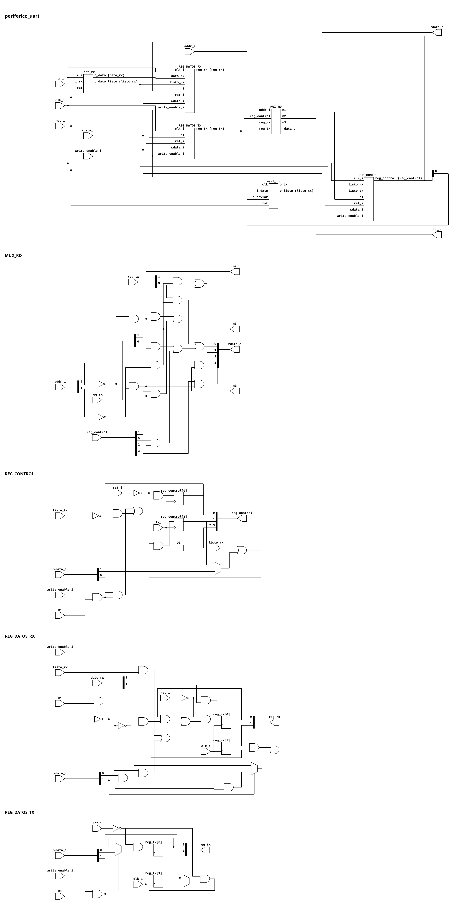

El esquemático sale de sintetizar el `.sv` con yosys, bajarlo a AND, OR, XOR, NOT, MUX y flip-flops D
con `abc`, y dibujarlo con netlistsvg. Cada compuerta o flip-flop lleva encima el nombre de la señal que
produce cuando esa señal tiene nombre en el RTL. Las que no tienen nombre son la lógica que yosys arma
para el reset y los `if` de cada registro.

Arriba está el periférico con los dos núcleos y los cuatro bloques del nivel 3 como cajas. Cada bloque
sale de un `always` del `.sv`, `REG_DATOS_TX` de las líneas 53 a 56, `REG_DATOS_RX` de 58 a 62,
`REG_CONTROL` de 64 a 75 y `MUX_RD` de 77 a 84, y abajo está cada uno abierto a compuertas. Los núcleos
se abren en sus propios docs.

Se genera con el dato de 2 bits y el bus de 4 en vez de 8 y 32, porque con los anchos reales el mux de
lectura solo ya no cabe en una página. Cada bit de dato repite la misma celda, así que lo que cambia
con 8 bits es la cantidad de copias. Dentro de `MUX_RD` los bits altos de `reg_control` entran como
cualquier otra señal, porque ahí adentro yosys no sabe que afuera valen cero.

## j) Diagrama completo de conexiones del diseño

Es el único módulo con puertos hacia el puente USB-UART, así que acá van las restricciones de pin
que tienen que quedar en `src/fpga/basys3.xdc` cuando se arme:

- `rx_i`, al pin B18, `RsRx` del puente USB-UART.
- `tx_o`, al pin A18, `RsTx` del puente USB-UART.
- Los dos con `IOSTANDARD LVCMOS33`.

Conexiones en el top:

- `clk_i`, a `clk_sys`, el reloj del sistema de 33,33 MHz que sale del PLL.
- `rst_i`, al reset del sistema.
- `write_enable_i`, a `uart_we` del controlador de mapeo, en alto solo cuando `we_o` está en alto y
  `DataAddress_o` es `0x0001_0040`, `0x0001_0044` o `0x0001_0048`.
- `addr_i[1:0]`, a `DataAddress_o[3:2]`.
- `wdata_i[31:0]`, a `DataOut_o`.
- `rdata_o[31:0]`, a `MUX_LECTURA`, que alimenta `DataIn_i` del CPU. En `Address_Translator.md` es la entrada `uart_dout`, que el AT elige con `mux_sel = 001`.
- `rx_i`, `tx_o`, a los puertos del top con el mismo nombre.

Igual que en los demás módulos, el diagrama por chips que pide el método no aplica a un diseño
que se sintetiza dentro de una sola FPGA, y esta lista de puertos es el reemplazo propuesto.

---

<!-- Fuente: docs/diseño/modulos/NUCLEO_UART_TX.md -->

# NUCLEO_UART_TX

## a) Nombre del módulo

NUCLEO_UART_TX, módulo `uart_tx` en `src/design/uart_tx.sv`.

## b) Diagrama modular

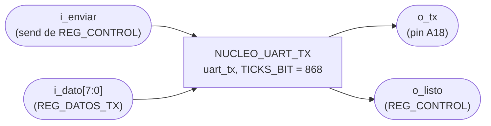
```mermaid
flowchart LR
    IN_EN(["i_enviar<br/>(send de REG_CONTROL)"]) --> NUC_TX["NUCLEO_UART_TX<br/>uart_tx, TICKS_BIT = 868"]
    IN_DATO(["i_dato[7:0]<br/>(REG_DATOS_TX)"]) --> NUC_TX
    NUC_TX --> OUT_TX(["o_tx<br/>(pin A18)"])
    NUC_TX --> OUT_LISTO(["o_listo<br/>(REG_CONTROL)"])
```

## c) Objetivo del módulo

Sacar por la línea serial un byte en formato 8N1 a 115200 baudios. Es la transcripción a
SystemVerilog de `UART_tx.vhd`, el núcleo que da el curso, con la misma máquina de estados y los
mismos tiempos. Solo se cambió el genérico del baudaje, porque el original venía calculado para un
reloj de 16 MHz.

## d) Entradas

- `clk`, reloj del sistema de 33,33 MHz.
- `rst`, reset síncrono.
- `i_enviar`, orden de arranque. En este sistema llega sostenida desde el bit `send` de `REG_CONTROL`.
- `i_dato[7:0]`, byte a mandar, desde `REG_DATOS_TX`.

El módulo tiene el parámetro `TICKS_BIT = 868`, ciclos de reloj por bit, calculado para 100 MHz. En el
top `PERIFERICO_UART` le pasa `TICKS_BIT = 289`, que sale de `clk_i` de 33,33 MHz. Los números de
los incisos g) y h) son los del valor por defecto, y el cálculo a 33,33 MHz está en `PERIFERICO_UART.md`.

## e) Salidas

- `o_tx`, línea serial hacia el pin A18. Reposa en uno.
- `o_listo`, pulso de un ciclo cuando termina de soltar el byte, hacia `REG_CONTROL`.

## f) Relación con otros módulos

Solo lo instancia `PERIFERICO_UART`, como `nucleo_tx`. El periférico le conecta `i_enviar` al bit
`send` de su registro de control y usa `o_listo` para bajar ese mismo bit. `i_dato` sale directo de
`REG_DATOS_TX`.

Hacia afuera `o_tx` llega sin pasar por nada más al pin `RsTx` del puente USB-UART, y de ahí a la app
de PC del Jugador 2.

## g) Explicación de funcionamiento

Un contador libre divide el reloj y da un pulso `tick_bit` cada `TICKS_BIT` ciclos. Todo lo que hace
la máquina de estados pasa en esos pulsos, así que cada estado dura un tiempo de bit.

Cuando llega `i_enviar`, el módulo atrapa la orden en `arranque_pedido` y copia `i_dato` en
`dato_guardado`. Desde ahí la fuente puede cambiar `i_dato` sin afectar el byte en curso. En el
siguiente `tick_bit` la máquina sale de reposo, y en los diez siguientes suelta el bit de arranque,
los ocho bits de datos del menos significativo al más significativo y el bit de parada. Al entrar a
parada levanta `fin_tx`, y un detector de flanco lo recorta a un pulso de un ciclo en `o_listo`.

## h) Diseño

### Divisor de baudaje

`cuenta_tick` arranca en `TICKS_BIT - 1` y baja hasta cero, y en cero da el pulso y se recarga. A
100 MHz y 115200 baudios, `100e6 / 115200 = 868.06`, se usa 868. El baudaje real queda en 115207, un
error de 0.006%. El contador no se sincroniza con la orden de arranque, así que entre `i_enviar` y el
bit de arranque pasa hasta un tiempo de bit de espera.

### Captura de la orden

| Condición                               | `arranque_pedido'` | `dato_guardado'` |
| --------------------------------------- | ------------------ | ---------------- |
| `rst` o `limpiar_arranque`              | `0`                | sin cambio       |
| `i_enviar` y `arranque_pedido = 0`      | `1`                | `i_dato`         |
| resto                                   | sin cambio         | sin cambio       |

La limpieza va primero. Eso es lo que abre la ventana muerta de abajo.

### Máquina de estados

Los cuatro estados avanzan solo cuando `tick_bit` está en alto.

| Estado     | `o_tx`                  | Acción                                               | Siguiente                               |
| ---------- | ----------------------- | ---------------------------------------------------- | --------------------------------------- |
| `REPOSO`   | `1`                     | `limpiar_arranque = 0`, `indice` en pausa            | `ARRANQUE` si `arranque_pedido`         |
| `ARRANQUE` | `0`                     | suelta `indice`                                      | `DATOS`                                 |
| `DATOS`    | `dato_guardado[indice]` | `indice` sube en cada `tick_bit`                     | `PARADA` cuando `indice = 7`            |
| `PARADA`   | `1`                     | `limpiar_arranque = 1`, `fin_tx = 1`                 | `REPOSO`                                |

`indice` es de 3 bits. El `.vhd` original lo declara de 0 a 7 y en el último tick se pasa del rango,
acá da la vuelta a cero sin romper nada porque en ese mismo tick queda otra vez en pausa.

Después del reset `limpiar_arranque` arranca en 1, así que el primer `tick_bit` en `REPOSO` es el que
habilita la captura.

### La ventana muerta

`limpiar_arranque` sube en `PARADA` y baja en el `tick_bit` siguiente, ya en `REPOSO`. Durante ese
tiempo de bit, unos 8.7 µs, `arranque_pedido` se queda en cero pase lo que pase en `i_enviar`. Un pulso
de un ciclo que caiga ahí se pierde sin ningún aviso.

Por eso `PERIFERICO_UART` no le da un pulso sino el bit `send` sostenido, que se queda alto hasta
`o_listo`. `o_listo` sale un par de ciclos después de entrar a `PARADA`, adentro de la ventana, así que
el mismo `send` no alcanza a pedir el byte dos veces.

### Tiempo entre bytes

Aunque el programa pida el siguiente byte en cuanto ve `send` en cero, la línea se queda en uno tres
tiempos de bit después de terminar el byte anterior. Uno es el bit de parada. Otro es el `tick_bit` en
`REPOSO` donde se cierra la ventana muerta. El tercero es el `tick_bit` en `REPOSO` que ve la orden y
pasa a `ARRANQUE`. Cada byte ocupa como mínimo 12 tiempos de bit, unos 104 µs, y una trama de 5 bytes
unos 520 µs.

### Latches

Todos los bloques son `always_ff` con reset síncrono, salvo `dato_guardado`, que no tiene reset porque
solo se lee después de una captura. Sintetizado con yosys dentro de `periferico_uart` no aparece ningún
`Latch inferred`.

## i) Diagrama esquemático detallado del diseño

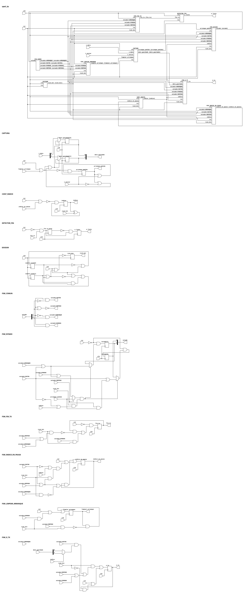

El esquemático sale de sintetizar el `.sv` con yosys, bajarlo a AND, OR, XOR, NOT, MUX y flip-flops D
con `abc`, y dibujarlo con netlistsvg. Cada compuerta o flip-flop lleva encima el nombre de la señal que
produce cuando esa señal tiene nombre en el RTL. Las que no tienen nombre son la lógica que yosys arma
para el reset y los `if` de cada registro.

Arriba está el núcleo con un bloque por `always` del `.sv`, `DIVISOR`, `CAPTURA`, `CONT_INDICE` y
`DETECTOR_FIN`. La máquina de estados está partida por registro, `FSM_ESTADO`, `FSM_O_TX`, `FSM_FIN_TX`,
`FSM_LIMPIAR_ARRANQUE` y `FSM_INDICE_EN_PAUSA`, y la decodificación del estado que usan todos queda en
`FSM_COMUN` con salidas como `estado==DATOS`. Abajo está cada bloque abierto a compuertas.

Se genera con `TICKS_BIT = 4`, dato de 2 bits e `indice` de 1 bit. Con los valores reales cambia el
ancho de los contadores y la cantidad de copias del mux de datos, no la estructura.

`cuenta_tick` se dibuja de 2 bits. En el `.sv` está declarado como `int`, y yosys lo sintetiza como un
contador de 32 bits aunque nunca pase de 288 (`TICKS_BIT = 289` con `clk_i` de 33,33 MHz). Se deja
como `int` porque así viene del núcleo del curso, y el sistema completo usa cerca del 23 % de las LUT
de la XC7A35T y cierra *timing* con holgura. Declararlo como `logic [$clog2(TICKS_BIT)-1:0]`
ahorraría compuertas sin cambiar el comportamiento.

## j) Diagrama completo de conexiones del diseño

Conexiones dentro de `PERIFERICO_UART`:

- `clk`, a `clk_i`.
- `rst`, a `rst_i`.
- `i_enviar`, a `reg_control[BIT_SEND]`.
- `i_dato`, a `reg_tx`.
- `o_listo`, a `listo_tx`.
- `o_tx`, a `tx_o`, que en el top va al pin A18 con `IOSTANDARD LVCMOS33`.

Igual que en los demás módulos, el diagrama por chips que pide el método no aplica a un diseño que se
sintetiza dentro de una sola FPGA, y esta lista de puertos es el reemplazo propuesto.

---

<!-- Fuente: docs/diseño/modulos/NUCLEO_UART_RX.md -->

# NUCLEO_UART_RX

## a) Nombre del módulo

NUCLEO_UART_RX, módulo `uart_rx` en `src/design/uart_rx.sv`.

## b) Diagrama modular

```mermaid
flowchart LR
    IN_RX(["i_rx<br/>(pin B18)"]) --> NUC_RX["NUCLEO_UART_RX<br/>uart_rx, TICKS_X16 = 54"]
    NUC_RX --> OUT_DATO(["o_dato[7:0]<br/>(REG_DATOS_RX)"])
    NUC_RX --> OUT_LISTO(["o_dato_listo<br/>(REG_DATOS_RX, REG_CONTROL)"])
```

## c) Objetivo del módulo

Recuperar los bytes 8N1 a 115200 baudios que llegan por la línea serial desde la app de PC. Es la
transcripción a SystemVerilog de `UART_rx.vhd`, el núcleo que da el curso, con la misma máquina de
estados y los mismos tiempos. Solo se cambió el genérico del baudaje, porque el original venía
calculado para un reloj de 16 MHz.

## d) Entradas

- `clk`, reloj del sistema de 33,33 MHz.
- `rst`, reset síncrono.
- `i_rx`, línea serial cruda desde el pin B18. Reposa en uno.

El módulo tiene el parámetro `TICKS_X16 = 54`, ciclos de reloj por tick de sobremuestreo, calculado
para 100 MHz. En el top `PERIFERICO_UART` le pasa `TICKS_X16 = 18`, que sale de `clk_i` de 33,33 MHz.
Los números de los incisos g) y h) son los del valor por defecto, y el cálculo a 33,33 MHz está en
`PERIFERICO_UART.md`.

## e) Salidas

- `o_dato[7:0]`, último byte recibido. Queda estable hasta que termina el siguiente.
- `o_dato_listo`, pulso de un ciclo que avisa que `o_dato` tiene un byte nuevo.

## f) Relación con otros módulos

Solo lo instancia `PERIFERICO_UART`, como `nucleo_rx`. `o_dato` va a `REG_DATOS_RX` y `o_dato_listo`
es la condición que carga ese registro y sube `new_rx` en `REG_CONTROL`. Como el pulso dura un ciclo,
el programa no podría sondearlo directo, y por eso el periférico lo convierte en la bandera `new_rx`.

Hacia afuera `i_rx` llega directo del pin `RsRx` del puente USB-UART, por donde entra lo que manda la
app de PC del Jugador 2.

## g) Explicación de funcionamiento

Un contador libre da un pulso `tick_x16` cada `TICKS_X16` ciclos, dieciséis veces por tiempo de bit.
La máquina de estados solo avanza en esos pulsos.

En reposo mira la línea en cada tick. Cuando la ve en cero cree que empezó un bit de arranque y cuenta
ocho ticks más, medio bit, revisando que la línea siga en cero. Si en ese medio bit la línea vuelve a
uno, era ruido y regresa a reposo. Si no, ya está parado en el centro del bit de arranque, y desde ahí
cuenta de 16 en 16 para muestrear el centro de cada uno de los ocho bits de datos, del menos
significativo al más significativo. Dieciséis ticks después del último dato, en el centro del bit de
parada, copia el byte a `o_dato` y levanta `fin_rx`. Un detector de flanco lo recorta a un pulso de un
ciclo en `o_dato_listo`.

## h) Diseño

### Divisor de sobremuestreo

`cuenta_tick` baja de `TICKS_X16 - 1` a cero, y en cero da el pulso y se recarga. El tick tiene que ir
a 16 veces el baudaje, `868.06 / 16 = 54.25`, se usa 54. El genérico original era 9.

Ese redondeo es el que aprieta. Cada tick sale 0.47% más rápido de lo ideal. El último bit de datos se
muestrea en el tick 136 contado desde el tick que vio el flanco, o sea a `136 x 54 = 7344` ciclos. El
centro real de ese bit está en `8.5 x 868.06 = 7379` ciclos. El desfase es de 35 ciclos contra los 434
que serían medio bit, más de diez veces de margen. A eso se suma hasta un tick de atraso en ver el
flanco, 54 ciclos, que también cabe.

### Máquina de estados

| Estado     | Condición en `tick_x16`         | Acción                                            | Siguiente  |
| ---------- | ------------------------------- | ------------------------------------------------- | ---------- |
| `REPOSO`   | `i_rx = 0`                      | limpia `dato_parcial`, `cuenta_bit`, `indice_bit` | `ARRANQUE` |
| `ARRANQUE` | `i_rx = 1`                      | nada, era ruido                                   | `REPOSO`   |
| `ARRANQUE` | `i_rx = 0` y `cuenta_bit = 7`   | `cuenta_bit = 0`                                  | `DATOS`    |
| `ARRANQUE` | `i_rx = 0` y `cuenta_bit < 7`   | `cuenta_bit + 1`                                  | `ARRANQUE` |
| `DATOS`    | `cuenta_bit = 15`               | `dato_parcial[indice_bit] = i_rx`, `cuenta_bit = 0` | `PARADA` si `indice_bit = 7`, si no `DATOS` con `indice_bit + 1` |
| `DATOS`    | `cuenta_bit < 15`               | `cuenta_bit + 1`                                  | `DATOS`    |
| `PARADA`   | `cuenta_bit = 15`               | `o_dato = dato_parcial`, `fin_rx = 1`             | `REPOSO`   |
| `PARADA`   | `cuenta_bit < 15`               | `cuenta_bit + 1`                                  | `PARADA`   |

`fin_rx` baja en el siguiente tick, ya en `REPOSO`, así que queda alto un tick de sobremuestreo.

En `PARADA` no se revisa que la línea esté en uno. Un byte con el bit de parada malo se entrega igual,
sin bandera de error de trama. El protocolo del juego lo cubre con el `0xAA` de inicio y el checksum
XOR que valida el ensamblador.

### Entrada sin sincronizador

`i_rx` entra directo a la máquina de estados, sin los dos flip-flops que recomienda la sección 3.3 de
`investigacion-previa.md`. Así viene el `UART_rx.vhd` del curso, y el profesor confirmó el 22 de
setiembre que no hace falta agregarlos. La línea cambia a lo sumo una vez cada 868 ciclos, lo que hace
muy improbable caer en metaestabilidad, aunque no la descarta. La mitigación estándar serían dos
flip-flops en cascada antes de `i_rx`.

### Latches

Todos los bloques son `always_ff` con reset síncrono. Sintetizado con yosys dentro de
`periferico_uart` no aparece ningún `Latch inferred`.

## i) Diagrama esquemático detallado del diseño


El esquemático sale de sintetizar el `.sv` con yosys, bajarlo a AND, OR, XOR, NOT, MUX y flip-flops D
con `abc`, y dibujarlo con netlistsvg. Cada compuerta o flip-flop lleva encima el nombre de la señal que
produce cuando esa señal tiene nombre en el RTL. Las que no tienen nombre son la lógica que yosys arma
para el reset y los `if` de cada registro.

Arriba está el núcleo con `DIVISOR` y `DETECTOR_FIN`, uno por `always` del `.sv`. La máquina de estados
está partida por registro, `FSM_ESTADO`, `FSM_CUENTA_BIT`, `FSM_INDICE_BIT`, `FSM_DATO_PARCIAL`,
`FSM_O_DATO` y `FSM_FIN_RX`, y las comparaciones que usan varios de ellos quedan en `FSM_COMUN` con
salidas como `estado==DATOS` o `cuenta_bit==15`. Abajo está cada bloque abierto a compuertas.

Se genera con `TICKS_X16 = 4`, dato de 2 bits e `indice_bit` de 1 bit. Con los valores reales cambia el
ancho de los contadores y la cantidad de copias por bit de dato, no la estructura.

`cuenta_tick`, `cuenta_bit` e `indice_bit` se dibujan de 2, 4 y 1 bits. En el `.sv` están declarados
como `int`, y yosys los sintetiza como contadores de 32 bits aunque no pasen de 17 (con `clk_i` de
33,33 MHz), 15 y 7. Con esos tres en 32 bits la máquina de estados sola da más de 800 compuertas. Se
dejan como `int` porque así vienen del núcleo del curso, y el sistema completo usa cerca del 23 % de
las LUT de la XC7A35T y cierra *timing* con holgura. Declararlos como `logic` con el ancho justo
ahorraría compuertas sin cambiar el comportamiento.

## j) Diagrama completo de conexiones del diseño

Conexiones dentro de `PERIFERICO_UART`:

- `clk`, a `clk_i`.
- `rst`, a `rst_i`.
- `i_rx`, a `rx_i`, que en el top viene del pin B18 con `IOSTANDARD LVCMOS33`.
- `o_dato_listo`, a `listo_rx`.
- `o_dato`, a `dato_rx`.

Igual que en los demás módulos, el diagrama por chips que pide el método no aplica a un diseño que se
sintetiza dentro de una sola FPGA, y esta lista de puertos es el reemplazo propuesto.

---

<!-- Fuente: docs/diseño/modulos/PERIFERICO_ENTRADAS.md -->

# PERIFERICO_ENTRADAS

## a) Nombre del módulo

PERIFERICO_ENTRADAS, módulo `periferico_entradas` en `src/design/periferico_entradas.sv`.

## b) Diagrama modular

```mermaid
flowchart LR
    IN_WE(["write_enable_i<br/>(gpio_we = 0)"]) --> PE["PERIFERICO_ENTRADAS<br/>0x0001_0120"]
    IN_ADDR(["addr_i[1:0]<br/>(2'b00 fijo)"]) --> PE
    IN_WD(["wdata_i[31:0]<br/>(DataOut_o)"]) --> PE
    IN_BTN(["botones_i[6:0]<br/>(botones del Jugador 1)"]) --> PE
    PE --> OUT_RD(["rdata_o[31:0]<br/>(MUX_LECTURA)"])
```

Es el bloque `PERIFERICO_ENTRADAS` del nivel 2 visto desde afuera. Lo que tiene adentro está en el inciso i).

## c) Objetivo del módulo

Poner el estado de los siete botones del Jugador 1 en el bus de datos, en un solo registro de lectura en
`0x0001_0120`, como pide la sección 4.5.2 del enunciado.

El periférico no sabe qué hace cada botón ni si una presión es nueva. Eso lo decide el programa. El hardware
solo registra los pines y los entrega cuando el CPU lee esa dirección.

## d) Entradas

- `clk_i`, `rst_i`.
- `write_enable_i`, habilitación de escritura, desde `gpio_we` del controlador de mapeo, que el Address
  Translator deja siempre en cero porque el registro es de solo lectura. El periférico igual la ignora, está
  solo porque es parte de la interfaz estándar de la sección 4.5.5.
- `addr_i[1:0]`, dirección del registro, fija en `2'b00` en el top, ver el inciso f).
- `wdata_i[WIDTH-1:0]`, desde `DataOut_o` del CPU. Se ignora igual que `write_enable_i`.
- `botones_i[6:0]`, las siete entradas del Jugador 1 directo de los pines, activas en alto. Son los cinco
  botones de la tarjeta y dos switches. El orden es el mismo de los bits del registro, `botones_i[0]` es
  `BTN_ARRIBA` y `botones_i[6]` es `BTN_RST`.

El módulo tiene el parámetro `WIDTH = 32`.

## e) Salidas

- `rdata_o[WIDTH-1:0]`, registro de estado con `addr_i = 2'b00` y ceros en cualquier otra dirección, hacia el
  multiplexor de lectura que llega a `DataIn_i` del CPU.

## f) Relación con otros módulos

Habla con un solo maestro, el CPU, a través de `BUS_DATOS`. No instancia ningún submódulo.

La dirección la decodifica el Address Translator del controlador de mapeo, detallado en
`Address_Translator.md`. `sel_gpio` sale de comparar la dirección completa contra `0x0001_0120`, y solo esa
palabra pone `mux_sel` en la entrada de botones. Por eso en el top `addr_i` va fijo en `2'b00`, igual que en
los displays, el LED y el buzzer.

Hacia afuera los pines van a los cinco botones de la Basys 3 y a los switches SW0 y SW15.

## g) Explicación de funcionamiento

`REG_ESTADO` copia los siete pines en cada flanco del reloj. El programa hace `lw` en `0x0001_0120` y recibe
esa copia en los bits bajos. Un bit en 1 significa que ese botón estaba presionado en el ciclo anterior.

El registro da niveles, no presiones. Si el Jugador 1 deja apretado `BTN_DER`, el bit 3 se lee en 1 en todas
las vueltas del lazo mientras siga apretado. Para mover el cursor una sola casilla por presión, el programa
guarda la lectura anterior en un registro y se queda con los bits que pasaron de 0 a 1.

```asm
lw   t0, 0(s1)        # s1 = 0x0001_0120, t0 = estado actual
xori t1, s2, -1       # s2 = estado de la vuelta anterior, t1 = ~anterior
and  t1, t0, t1       # t1 = botones recién presionados
addi s2, t0, 0        # para la próxima vuelta
```

Son cuatro instrucciones del conjunto mínimo. El ejemplo solo muestra la idea, el programa real y sus
registros se documentan en el diseño del ensamblador.

Una presión dura decenas de milisegundos y una vuelta del lazo principal dura microsegundos, así que el
programa ve cada presión muchas veces seguidas y no se le escapa ninguna mientras ninguna rutina se quede
tanto tiempo sin volver al lazo.

## h) Diseño

### Mapa de registros

La tabla de la sección 4.4.3 del enunciado fija un registro de estado en `0x0001_0120`. El orden de los bits
es el que propone la investigación previa (sección 6.3).

- `2'b00` (`0x0001_0120`), registro de estado, solo lectura.
  - `[0]`, `BTN_ARRIBA`, mueve el cursor una fila arriba.
  - `[1]`, `BTN_ABAJO`, mueve el cursor una fila abajo.
  - `[2]`, `BTN_IZQ`, mueve el cursor una columna a la izquierda.
  - `[3]`, `BTN_DER`, mueve el cursor una columna a la derecha.
  - `[4]`, `BTN_SEL`, rota el barco que se está colocando.
  - `[5]`, `BTN_OK`, confirma una colocación o un disparo.
  - `[6]`, `BTN_RST`, reinicia la partida conservando los contadores de ganadas.
  - `[31:7]`, reservados, se leen en cero.

`0x0001_0124` a `0x0001_012C` no son de este periférico. El AT las trata como direcciones sin destino y una
lectura devuelve cero desde `MUX_LECTURA`.

Las escrituras no tienen efecto en ninguna dirección. Lo que hace cada botón en el juego lo decide el
programa, la lista solo dice para qué lo va a usar.

### Sin antirrebote

La sección 4.5.2 pide debouncing, pero según el profesor los botones de la Basys 3 ya llegan filtrados por la
tarjeta y no hace falta repetirlo en el periférico. Con eso el `debounce` y el detector de flanco de
`botones.sv` del Proyecto 2 no se traen. El flanco lo saca el programa, como se ve en el inciso g).

Los switches de `BTN_OK` y `BTN_RST` tampoco rebotan, así que se leen igual que los cinco botones y los
siete bits del registro se tratan igual.

### REG_ESTADO

| Condición | `estado'`         |
| --------- | ----------------- |
| `rst_i`   | `0`               |
| resto     | `botones_i[6:0]`  |

Es de 7 bits y no tiene habilitación. Está por timing, no para sincronizar. Sin él, el pin iría por
`MUX_RD`, `MUX_LECTURA` y `DataIn_i` hasta el banco de registros del CPU en un solo camino combinacional que
arranca en un pin asíncrono y que nadie restringe. Con el registro el pin termina en un flip-flop, y lo que
lee el CPU no cambia en medio del ciclo. Es un solo flip-flop por bit, sin la cadena de dos de un
sincronizador.

### MUX_RD

| `addr_i`   | `rdata_o`                         |
| ---------- | --------------------------------- |
| `2'b00`    | `{{(WIDTH-7){1'b0}}, estado}`     |
| resto      | `0`                               |

### Pines de BTN_SEL, BTN_OK y BTN_RST

La Basys 3 trae cinco botones y el enunciado pide siete entradas. Los cuatro de la cruz van a la navegación
y el central a `BTN_SEL`, que es más simple para el Jugador 1 porque rotar el barco queda junto a las
flechas. `BTN_OK` va en SW0 y `BTN_RST` en SW15, los dos extremos de la fila de switches. El Pmod JC queda
solo con el buzzer.

Un switch no vuelve solo. El programa saca el flanco de 0 a 1 igual que con los botones, así que lo que
cuenta es el momento en que se sube, y hay que bajarlo antes de la siguiente confirmación o del siguiente
reinicio. Dejar SW15 arriba reinicia la partida una sola vez.

### Reset y BTN_RST

`rst_i` es el reinicio general y sale de `locked` del PLL negado, así que está en alto desde que la FPGA se
configura hasta que el reloj engancha. Para dispararlo a mano se usa el botón PROG de la Basys 3, que vuelve
a configurar la FPGA con el bitstream guardado en la flash. Hace falta el jumper JP1 en QSPI.

Después de `rst_i` los siete bits se leen en cero y al ciclo siguiente ya siguen a los pines. Si SW0 o SW15
quedaron arriba, ese bit sale en 1 desde el arranque. El programa tiene que tomar esa primera lectura como
estado anterior para no contarla como flanco.

`BTN_RST` no puede llegar a `rst_i` de este periférico. Si llegara, mientras SW15 esté arriba
`REG_ESTADO` estaría en reset y el bit 6 se leería en cero, así que el programa nunca vería el flanco.
`BTN_RST` es un bit más del registro, y el reinicio de la partida lo hace el programa, que es lo que ya dice
`nivel01.md`.

El marcador de ganadas solo vuelve a cero con `rst_i`.

### Latches

`REG_ESTADO` va en un `always_ff` con reset síncrono. `MUX_RD` es un `always_comb` con `case` y rama
`default`.

## i) Diagrama esquemático detallado del diseño

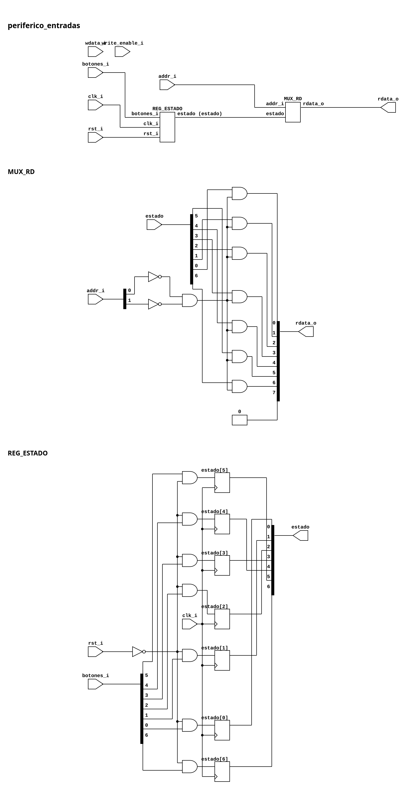

El esquemático sale de sintetizar el `.sv` con yosys, bajarlo a AND, OR, XOR, NOT, MUX y flip-flops D
con `abc`, y dibujarlo con netlistsvg. Cada compuerta o flip-flop lleva encima el nombre de la señal que
produce cuando esa señal tiene nombre en el RTL. Las que no tienen nombre son la lógica que yosys arma
para el reset y los `if` de cada registro.

Arriba está el periférico con sus dos bloques como cajas, `REG_ESTADO` de las líneas 18 a 21 del `.sv`
y `MUX_RD` de 23 a 28, y abajo está cada uno abierto a compuertas. `REG_ESTADO` son los siete
flip-flops con la AND del reset delante. `MUX_RD` deja pasar `estado` solo cuando `addr_i` vale `00`.

Se genera con el bus de 8 bits en vez de 32. Los siete botones caben igual, y los bits de más arriba
solo serían ceros constantes en `rdata_o`. `write_enable_i` y `wdata_i` quedan sueltos porque el
periférico no los usa.

## j) Diagrama completo de conexiones del diseño

Es el único módulo con puertos hacia los botones, así que acá van las restricciones de pin que tienen que
quedar en `src/fpga/basys3.xdc`.

- `botones_i[0]`, `BTN_ARRIBA`, a T18, `btnU` de la Basys 3.
- `botones_i[1]`, `BTN_ABAJO`, a U17, `btnD`.
- `botones_i[2]`, `BTN_IZQ`, a W19, `btnL`.
- `botones_i[3]`, `BTN_DER`, a T17, `btnR`.
- `botones_i[4]`, `BTN_SEL`, a U18, `btnC`.
- `botones_i[5]`, `BTN_OK`, a V17, el switch SW0.
- `botones_i[6]`, `BTN_RST`, a R2, el switch SW15.
- Todos con `IOSTANDARD LVCMOS33`.

Conexiones en el top.

- `clk_i`, a `clk_sys`, el reloj del sistema de 33,33 MHz que sale del PLL.
- `rst_i`, a `locked` del PLL negado, nunca a `BTN_RST`.
- `write_enable_i`, a `gpio_we` del controlador de mapeo, que siempre vale cero.
- `addr_i[1:0]`, a `2'b00`.
- `wdata_i[31:0]`, a `DataOut_o`.
- `rdata_o[31:0]`, a `MUX_LECTURA`, que alimenta `DataIn_i` del CPU. En `Address_Translator.md` es la entrada `gpio_dout`, que el AT elige con `mux_sel = 010`.
- `botones_i[6:0]`, a los siete puertos de botón del top en el orden de la lista de arriba.

Igual que en los demás módulos, el diagrama por chips que pide el método no aplica a un diseño que se
sintetiza dentro de una sola FPGA, y esta lista de puertos es el reemplazo propuesto.

---

<!-- Fuente: docs/diseño/modulos/PERIFERICO_7SEG.md -->

# PERIFERICO_7SEG

## a) Nombre del módulo

PERIFERICO_7SEG, módulo `periferico_7seg` en `src/design/periferico_7seg.sv`.

## b) Diagrama modular

```mermaid
flowchart LR
    IN_WE(["write_enable_i<br/>(display_we)"]) --> P7["PERIFERICO_7SEG<br/>0x0001_0130"]
    IN_ADDR(["addr_i[1:0]<br/>(2'b00 fijo)"]) --> P7
    IN_WD(["wdata_i[31:0]<br/>(DataOut_o)"]) --> P7
    P7 --> OUT_RD(["rdata_o[31:0]<br/>(MUX_LECTURA)"])
    P7 --> OUT_SEG(["seg_o[6:0], dp_o<br/>(cátodos)"])
    P7 --> OUT_AN(["an_o[3:0]<br/>(ánodos)"])
```

Es el bloque `PERIFERICO_7SEG` del nivel 2 visto desde afuera. Lo que tiene adentro está en el inciso i).

## c) Objetivo del módulo

Mostrar en los cuatro dígitos del display lo que el programa escriba en su registro. La sección 4.5.4 del
enunciado sugiere dos dígitos para las partidas ganadas del Jugador 1 y dos para las del Jugador 2, de 00 a
99 cada uno, y así se usa.

El periférico no cuenta partidas. El programa lleva los dos contadores, los incrementa cuando alguien gana
y escribe los cuatro dígitos. El hardware solo guarda lo escrito y hace el barrido del display.

## d) Entradas

- `clk_i`, `rst_i`.
- `write_enable_i`, habilitación de escritura, desde `display_we` del controlador de mapeo (`we_o` del CPU en
  AND con `sel_7seg`).
- `addr_i[1:0]`, dirección del registro, fija en `2'b00` en el top, ver el inciso f).
- `wdata_i[WIDTH-1:0]`, dato a escribir, desde `DataOut_o` del CPU.

El módulo tiene los parámetros `WIDTH = 32` y `REFRESH_BITS = 18`. El segundo pasa tal cual a `marcador`.

## e) Salidas

- `rdata_o[WIDTH-1:0]`, contenido del registro apuntado por `addr_i`, hacia el multiplexor de lectura que
  llega a `DataIn_i` del CPU.
- `seg_o[6:0]`, segmentos `gfedcba`, activos en bajo.
- `an_o[3:0]`, ánodos de los cuatro dígitos, activos en bajo.
- `dp_o`, punto decimal, activo en bajo.

## f) Relación con otros módulos

Habla con un solo maestro, el CPU, a través de `BUS_DATOS`. Adentro instancia `marcador`, que solo usa este
módulo y tiene su propio doc en `marcador.md`.

La dirección la decodifica el Address Translator del controlador de mapeo, detallado en
`Address_Translator.md`. `sel_7seg` sale de comparar la dirección completa contra `0x0001_0130`, así que el
LED en `0x0001_0138` no se cruza con este periférico aunque los dos caigan en el mismo bloque de 16 bytes.
Como el AT solo selecciona esa palabra, el periférico siempre se accede en su offset `0x00` y en el top
`addr_i` va fijo en `2'b00`, igual que en las entradas, el LED y el buzzer.

Hacia afuera los pines van al display de la Basys 3.

## g) Explicación de funcionamiento

El periférico tiene un registro, `REG_DIGITOS`. El programa escribe en `0x0001_0130` los cuatro dígitos en
BCD y, si quiere, los puntos decimales. Desde el ciclo siguiente `marcador` los muestra. El registro se puede
leer, así que para cambiar el contador de un solo jugador el programa lee, cambia sus dos nibbles y vuelve a
escribir.

Con la sugerencia del enunciado, el Jugador 1 va a la izquierda y el Jugador 2 a la derecha.

- `AN3` y `AN2`, decenas y unidades del Jugador 1, nibbles `[15:12]` y `[11:8]`.
- `AN1` y `AN0`, decenas y unidades del Jugador 2, nibbles `[7:4]` y `[3:0]`.

Con 3 partidas del Jugador 1 y 12 del Jugador 2 el programa escribe `0x0000_0312`, y en el display se lee
`03 12`.

## h) Diseño

### Mapa de registros

La tabla de la sección 4.4.3 del enunciado fija un registro de datos en `0x0001_0130`.

- `2'b00` (`0x0001_0130`), registro de dígitos, RW.
  - `[15:0]`, cuatro dígitos BCD, `[3:0]` en `AN0` y `[15:12]` en `AN3`. Un nibble de 10 a 15 apaga ese
    dígito.
  - `[19:16]`, punto decimal de cada dígito, bit 16 en `AN0`. En alto enciende el punto.
  - `[31:20]`, reservados, se leen en cero y las escrituras sobre ellos se ignoran.
`0x0001_0134` no es de este periférico. El AT la trata como dirección sin destino, así que ninguna escritura
la habilita y una lectura devuelve cero desde `MUX_LECTURA`. Con `addr_i` fijo, `2'b01` a `2'b11` no llegan
nunca, y el `case` de lectura igual los cubre con cero.

### Por qué BCD y no binario

En el Proyecto 2 las ganadas llegaban en binario y el marcador las partía con `/ 10` y `% 10`. Con un solo
contador y 7 bits se aguantaba. Acá son dos contadores, y el divisor combinacional se duplicaría para algo
que el programa resuelve más barato. Incrementar un contador BCD de dos dígitos en ensamblador es sumar uno
a las unidades y, si llegan a 10, ponerlas en cero y sumar uno a las decenas. rv32i no tiene división, así
que pasar de binario a BCD en software saldría peor que llevarlo en BCD desde el principio.

### Los puntos decimales

La sección 4.3.2 pide indicar el turno activo "mediante VGA, displays de 7 segmentos y/o LED". Los puntos
permiten hacerlo sin gastar dígitos. Por ejemplo, el programa enciende el punto de `AN2` en el turno del
Jugador 1 y el de `AN0` en el del Jugador 2. Si el turno se muestra solo en el VGA, el programa deja los
bits `[19:16]` en cero y los puntos no se encienden.

### REG_DIGITOS

| Condición                                  | `reg_digitos'`   |
| ------------------------------------------ | ---------------- |
| `rst_i`                                    | `0`              |
| `write_enable_i` y `addr_i = 2'b00`        | `wdata_i[19:0]`  |
| resto                                      | sin cambio       |

Es de 20 bits. `rdata_o` vale `{12'b0, reg_digitos}` con `addr_i = 2'b00` y cero en cualquier otra
dirección.

### Reset y BTN_RST

Después de `rst_i` el registro queda en cero y el display muestra `00 00`, que es el valor correcto al
arrancar el sistema.

El enunciado pide que `BTN_RST` reinicie la partida conservando las ganadas. Si `BTN_RST` llegara a `rst_i`
de este periférico, el display se iría a `00 00` en cada reinicio de partida. Por eso `rst_i` es
solo el reinicio general, que es lo único que pone el marcador en cero, y `BTN_RST` lo atiende el programa
sin tocar este registro.

### Latches

El registro va en un `always_ff` con reset síncrono. La lectura es un `always_comb` con `case` y rama
`default`.

## i) Diagrama esquemático detallado del diseño

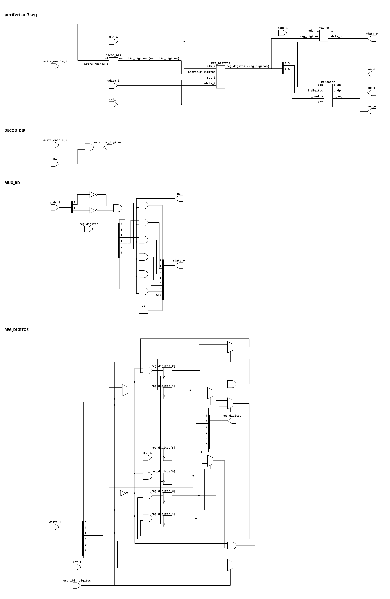

El esquemático sale de sintetizar el `.sv` con yosys, bajarlo a AND, OR, XOR, NOT, MUX y flip-flops D
con `abc`, y dibujarlo con netlistsvg. Cada compuerta o flip-flop lleva encima el nombre de la señal que
produce cuando esa señal tiene nombre en el RTL. Las que no tienen nombre son la lógica que yosys arma
para el reset y los `if` de cada registro.

Arriba está el periférico con `marcador` y los tres bloques del nivel 3 como cajas. Cada bloque sale
del `.sv`, `DECOD_DIR` de la línea 31, `REG_DIGITOS` de 34 a 37 y `MUX_RD` de 39 a 44, y abajo está
cada uno abierto a compuertas. `marcador` se abre en su propio doc.

Se genera con el registro de 6 bits y el bus de 8 en vez de 20 y 32, un nibble de dígito y dos puntos.
Con los 20 bits el registro solo ya ocupa varias páginas. Cada bit repite el mismo flip-flop con su
MUX de carga, así que con el ancho real cambia la cantidad de copias y no la estructura.

## j) Diagrama completo de conexiones del diseño

Es el único módulo con puertos hacia el display, así que acá van las restricciones de pin que tienen que
quedar en `src/fpga/basys3.xdc`, las mismas del Proyecto 2.

- `seg_o[0]` a `seg_o[6]`, a W7, W6, U8, V8, U5, V5 y U7 (`a` a `g`).
- `dp_o`, a V7.
- `an_o[0]` a `an_o[3]`, a U2, U4, V4 y W4.
- Todos con `IOSTANDARD LVCMOS33`.

Conexiones en el top.

- `clk_i`, a `clk_sys`, el reloj del sistema de 33,33 MHz que sale del PLL.
- `rst_i`, al reinicio general del sistema.
- `write_enable_i`, a `display_we` del controlador de mapeo, en alto solo cuando `we_o` está en alto y
  `DataAddress_o` es `0x0001_0130`.
- `addr_i[1:0]`, a `2'b00`.
- `wdata_i[31:0]`, a `DataOut_o`.
- `rdata_o[31:0]`, a `MUX_LECTURA`, que alimenta `DataIn_i` del CPU. En `Address_Translator.md` es la entrada `display_dout`, que el AT elige con `mux_sel = 011`.
- `seg_o`, `an_o` y `dp_o`, a los puertos `seg`, `an` y `dp` del top.

Igual que en los demás módulos, el diagrama por chips que pide el método no aplica a un diseño que se
sintetiza dentro de una sola FPGA, y esta lista de puertos es el reemplazo propuesto.

---

<!-- Fuente: docs/diseño/modulos/marcador.md -->

# MARCADOR

## a) Nombre del módulo

MARCADOR, módulo `marcador` en `src/design/marcador.sv`.

## b) Diagrama modular

```mermaid
flowchart LR
    IN_DIG(["i_digitos[15:0]<br/>(REG_DIGITOS)"]) --> MARC["MARCADOR<br/>barrido de 4 dígitos"]
    IN_PTO(["i_puntos[3:0]<br/>(REG_DIGITOS)"]) --> MARC
    MARC --> OUT_SEG(["o_seg[6:0]<br/>(pines de segmentos)"])
    MARC --> OUT_AN(["o_an[3:0]<br/>(pines de ánodos)"])
    MARC --> OUT_DP(["o_dp<br/>(pin V7)"])
```

## c) Objetivo del módulo

Mostrar en los cuatro dígitos del display los valores que le llegan, barriéndolos uno por uno lo bastante
rápido para que el ojo los vea encendidos a la vez. Es el `marcador` del Proyecto 2 sin la parte que sabía
qué significaba cada dígito. Allá dos dígitos eran tiempo en BCD y dos eran partidas ganadas en binario.
Acá los cuatro llegan ya en BCD desde el registro del periférico, y el módulo no sabe si son ganadas, turno
o cualquier otra cosa.

## d) Entradas

- `clk`, reloj del sistema de 33,33 MHz.
- `rst`, reset síncrono.
- `i_digitos[15:0]`, cuatro dígitos BCD empacados, `[3:0]` va al dígito de `AN0` y `[15:12]` al de `AN3`.
- `i_puntos[3:0]`, un bit por dígito para el punto decimal, en alto enciende el punto.

El módulo tiene el parámetro `REFRESH_BITS = 18`, igual que en el Proyecto 2. En simulación se baja para
no esperar 65536 ciclos por dígito.

## e) Salidas

- `o_seg[6:0]`, segmentos `gfedcba` del dígito activo, `o_seg[0]` es `a`. Activos en bajo.
- `o_an[3:0]`, ánodo del dígito activo. Activo en bajo.
- `o_dp`, punto decimal del dígito activo. Activo en bajo.

## f) Relación con otros módulos

Solo lo instancia `PERIFERICO_7SEG`. `i_digitos` e `i_puntos` salen de `REG_DIGITOS`, dentro del mismo
periférico. Las tres salidas van directo a los pines del display de la Basys 3.

## g) Explicación de funcionamiento

`CONT_REFRESCO` es un contador libre de 18 bits, y sus dos bits más altos forman `selector`. Cada valor de
`selector` dura `2^16` ciclos, 1.97 ms a 33,33 MHz, así que los cuatro dígitos se recorren cada 7.9 ms,
unas 127 veces por segundo. Con eso no se nota el parpadeo.

`SELECTOR_DIGITO` usa `selector` para elegir el nibble de `i_digitos` y el bit de `i_puntos` que tocan,
y baja el ánodo de ese dígito. `DECOD_BCD_7SEG` convierte el nibble al patrón de segmentos. Un nibble de 10
a 15 deja el dígito apagado, con lo que el programa puede borrar un dígito escribiendo `0xF`.

## h) Diseño

### Qué cambió respecto al Proyecto 2

- `time_value[7:0]` y `num_ganadas[6:0]` se van y entra `i_digitos[15:0]`. Allá el módulo recibía dos
  cantidades de dos módulos distintos del juego. Acá recibe cuatro dígitos genéricos de un registro que
  escribe el programa.
- `REG_TIEMPO` y `REG_GANADAS` se van. El registro ahora es `REG_DIGITOS` y vive en el periférico, porque es
  el que escribe el CPU.
- La división `num_ganadas / 10` y `num_ganadas % 10` se va. Los dígitos llegan en BCD y
  `SELECTOR_DIGITO` solo corta nibbles. El programa lleva los contadores en BCD, que en ensamblador es un
  `addi` y una comparación contra 10 para el acarreo, y se ahorra un divisor combinacional en hardware.
- `dp` deja de ser un 1 fijo y sale de `i_puntos`. El enunciado deja que el turno se muestre en los displays
  (sección 4.3.2), y encender el punto de los dígitos de un jugador es la forma más barata de hacerlo.
- Los cuatro dígitos se tratan igual. En el Proyecto 2 `AN0` y `AN1` eran ganadas y `AN2` y `AN3` tiempo, y
  eso estaba fijo en `SELECTOR_DIGITO`.
- Los puertos pasan al estilo del repo, `i_` y `o_`.

`CONT_REFRESCO` y `DECOD_BCD_7SEG` quedan igual.

### SELECTOR_DIGITO

| `selector` | `digito_bcd`      | `punto`       | `o_an`   |
| ---------- | ----------------- | ------------- | -------- |
| `00`       | `i_digitos[3:0]`   | `i_puntos[0]` | `1110`   |
| `01`       | `i_digitos[7:4]`   | `i_puntos[1]` | `1101`   |
| `10`       | `i_digitos[11:8]`  | `i_puntos[2]` | `1011`   |
| `11`       | `i_digitos[15:12]` | `i_puntos[3]` | `0111`   |

`o_dp = ~punto`, porque el punto del display también es activo en bajo.

### DECOD_BCD_7SEG

La misma tabla del Proyecto 2, `seg` en orden `gfedcba` y activo en bajo.

| BCD | `seg`     |
| --- | --------- |
| 0   | `1000000` |
| 1   | `1111001` |
| 2   | `0100100` |
| 3   | `0110000` |
| 4   | `0011001` |
| 5   | `0010010` |
| 6   | `0000010` |
| 7   | `1111000` |
| 8   | `0000000` |
| 9   | `0010000` |
| 10 a 15 | `1111111` |

### Latches

`SELECTOR_DIGITO` y `DECOD_BCD_7SEG` son `always_comb` con `case` y rama `default`, y asignan todas sus
salidas en todas las ramas. `CONT_REFRESCO` es el único `always_ff`.

## i) Diagrama esquemático detallado del diseño

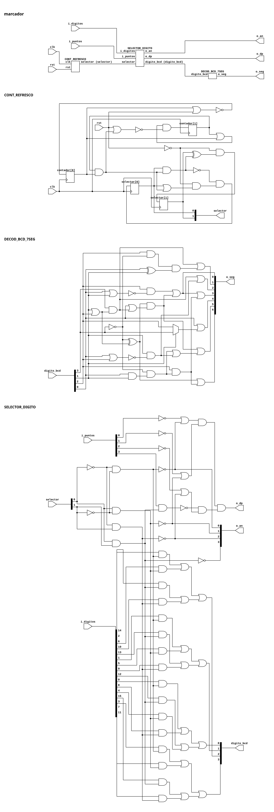

El esquemático sale de sintetizar el `.sv` con yosys, bajarlo a AND, OR, XOR, NOT, MUX y flip-flops D
con `abc`, y dibujarlo con netlistsvg. Cada compuerta o flip-flop lleva encima el nombre de la señal que
produce cuando esa señal tiene nombre en el RTL. Las que no tienen nombre son la lógica que yosys arma
para el reset y los `if` de cada registro.

Arriba está el módulo con un bloque por `always` del `.sv`, `CONT_REFRESCO` de las líneas 17 a 22,
`SELECTOR_DIGITO` de 24 a 49 junto con la NOT de `o_dp`, y `DECOD_BCD_7SEG` de 51 a 65. Abajo está
cada uno abierto a compuertas.

Se genera con `REFRESH_BITS = 4`. Con 18 el contador repite la misma celda de suma por bit y
`selector` sigue saliendo de los dos bits de arriba. Para este módulo yosys corre con `proc -norom`,
porque si no convierte el `case` de `DECOD_BCD_7SEG` en una ROM y el dibujo muestra una memoria en vez
de compuertas.

## j) Diagrama completo de conexiones del diseño

Conexiones dentro de `PERIFERICO_7SEG`.

- `clk`, a `clk_i`.
- `rst`, a `rst_i`.
- `i_digitos`, a `reg_digitos[15:0]`.
- `i_puntos`, a `reg_digitos[19:16]`.
- `o_seg`, `o_an` y `o_dp`, a `seg_o`, `an_o` y `dp_o` del periférico.

Igual que en los demás módulos, el diagrama por chips que pide el método no aplica a un diseño que se
sintetiza dentro de una sola FPGA, y esta lista de puertos es el reemplazo propuesto.

---

<!-- Fuente: docs/diseño/modulos/PERIFERICO_LED.md -->

# PERIFERICO_LED

## a) Nombre del módulo

PERIFERICO_LED, módulo `periferico_led` en `src/design/periferico_led.sv`.

## b) Diagrama modular

```mermaid
flowchart LR
    IN_WE(["write_enable_i<br/>(led_we)"]) --> PL["PERIFERICO_LED<br/>0x0001_0138"]
    IN_ADDR(["addr_i[1:0]<br/>(2'b00 fijo)"]) --> PL
    IN_WD(["wdata_i[31:0]<br/>(DataOut_o)"]) --> PL
    PL --> OUT_RD(["rdata_o[31:0]<br/>(MUX_LECTURA)"])
    PL --> OUT_LED(["leds_o[2:0]<br/>(LD0 a LD2)"])
```

Es el bloque `PERIFERICO_LED` del nivel 2 visto desde afuera. Lo que tiene adentro está en el inciso i).

## c) Objetivo del módulo

Mostrar en los LEDs de la Basys 3 en qué fase está la partida, colocación, batalla o resultado, como pide la
sección 4.5.4 del enunciado. Cada fase tiene su propio LED, así que se distinguen de un vistazo.

El periférico no sabe en qué fase está el juego. El programa la lleva y escribe el patrón de LEDs cada vez que
cambia de fase. El hardware solo guarda lo escrito y lo saca a los pines.

## d) Entradas

- `clk_i`, `rst_i`.
- `write_enable_i`, habilitación de escritura, desde `led_we` del controlador de mapeo (`we_o` del CPU en AND
  con `sel_led`).
- `addr_i[1:0]`, dirección del registro, fija en `2'b00` en el top. No sale de `DataAddress_o[3:2]`, ver el
  inciso f).
- `wdata_i[WIDTH-1:0]`, dato a escribir, desde `DataOut_o` del CPU.

El módulo tiene el parámetro `WIDTH = 32`.

## e) Salidas

- `rdata_o[WIDTH-1:0]`, contenido del registro apuntado por `addr_i`, hacia el multiplexor de lectura que
  llega a `DataIn_i` del CPU.
- `leds_o[2:0]`, a LD0, LD1 y LD2. Activos en alto.

## f) Relación con otros módulos

Habla con un solo maestro, el CPU, a través de `BUS_DATOS`. No instancia ningún submódulo.

La dirección la decodifica el Address Translator del controlador de mapeo, detallado en
`Address_Translator.md`. `sel_led` sale de comparar la dirección completa contra `0x0001_0138`, así que los
displays en `0x0001_0130` no se cruzan con el LED aunque los dos caigan en el mismo bloque de 16 bytes.

Lo que sí hay que cuidar es `addr_i`. En `0x0001_0138` los bits `DataAddress_o[3:2]` valen `2'b10`, así que
si se conectara como en la UART el registro de offset `0x00` llegaría con `addr_i = 2'b10`. Como el AT solo
selecciona esa palabra, en el top `addr_i` va fijo en `2'b00`, que es el offset que da la tabla del
enunciado. Es la adaptación de dirección que `Address_Translator.md` deja a las conexiones de fuera del AT, y
el periférico sigue la interfaz estándar sin saber en qué dirección está.

Hacia afuera los pines van a los tres primeros LEDs de la Basys 3.

## g) Explicación de funcionamiento

El periférico tiene un registro, `REG_LEDS`. El programa escribe en `0x0001_0138` un 1 en el bit de la fase
en la que entra, y desde el ciclo siguiente ese LED se enciende y los otros dos se apagan.

- Al arrancar la partida, o después de `BTN_RST`, el programa escribe `0x1` y se enciende LD0, colocación.
- Cuando los dos jugadores terminaron de colocar escribe `0x2` y se enciende LD1, batalla.
- Cuando alguien hunde los tres barcos del otro escribe `0x4` y se enciende LD2, resultado. Se queda así
  hasta `BTN_RST`.

El registro se puede leer. El programa no lo necesita para el juego, pero sirve para revisar en simulación
qué escribió.

## h) Diseño

### Mapa de registros

La tabla de la sección 4.4.3 del enunciado fija un registro de datos en `0x0001_0138`.

- `2'b00` (`0x0001_0138`), registro de LEDs, RW.
  - `[0]`, LD0, fase de colocación.
  - `[1]`, LD1, fase de batalla.
  - `[2]`, LD2, resultado final.
  - `[31:3]`, reservados, se leen en cero y las escrituras sobre ellos se ignoran.
`0x0001_013C` no es de este periférico. El AT la trata como dirección sin destino, así que ninguna escritura
la habilita y una lectura devuelve cero desde `MUX_LECTURA`. Con `addr_i` fijo, `2'b01` a `2'b11` no llegan
nunca, y el `case` de lectura igual los cubre con cero.

### Qué cambió respecto al Proyecto 2

- En el Proyecto 2 `Estado` recibía el estado de la FSM en `state[2:0]`, lo registraba y lo decodificaba a un
  código de 2 bits en LD0 y LD1. Acá no hay FSM en hardware. El que sabe la fase es el programa, y el
  periférico recibe lo que él escribe por el bus.
- El decodificador se va. Un código binario en dos LEDs dejaba la selección con los dos apagados y el
  resultado con LD1 solo, y para leerlo había que saberse la tabla. Con un LED por fase el que mira la tarjeta
  entiende qué pasa sin tabla, que es lo que pide la sección 4.5.4 con "claramente distinguible".
- El registro de `state` se queda, ahora como `REG_LEDS`, pero cambia qué lo carga. Antes copiaba la FSM en
  cada ciclo, ahora solo carga cuando el CPU escribe.
- Los LEDs pasan de 2 a 3. LD0 y LD1 siguen en los mismos pines, U16 y E19, y se agrega LD2 en U19.

### Por qué el programa escribe los tres bits

El periférico podría recibir la fase como un código de 2 bits y decodificarlo a un LED encendido, como hacía
el Proyecto 2. Así el hardware garantizaría que siempre hay un solo LED encendido. No se hace porque
escribir `0x1`, `0x2` o `0x4` le cuesta al programa lo mismo que escribir `0`, `1` o `2`, y el decodificador
sería hardware que no agrega nada. Si el programa escribe dos bits a la vez se encienden dos LEDs, y eso es un
bug del programa que se ve apenas pasa.

### REG_LEDS

| Condición                                  | `reg_leds'`      |
| ------------------------------------------ | ---------------- |
| `rst_i`                                    | `0`              |
| `write_enable_i` y `addr_i = 2'b00`        | `wdata_i[2:0]`   |
| resto                                      | sin cambio       |

Es de 3 bits. `leds_o` es `reg_leds` directo, y `rdata_o` vale `{{(WIDTH-3){1'b0}}, reg_leds}` con
`addr_i = 2'b00` y cero en cualquier otra dirección.

### Reset y BTN_RST

Después de `rst_i` los tres LEDs quedan apagados hasta que el programa escribe la primera fase. Eso pasa en la
inicialización, antes de entrar al lazo, así que el tiempo con los LEDs apagados son unos pocos ciclos.

`BTN_RST` no llega a `rst_i`. Al reiniciar la partida el programa vuelve a escribir `0x1` y se enciende
colocación, que es la fase en la que arranca la partida nueva.

### Latches

`REG_LEDS` va en un `always_ff` con reset síncrono. La lectura es un `always_comb` con `case` y rama
`default`.

## i) Diagrama esquemático detallado del diseño

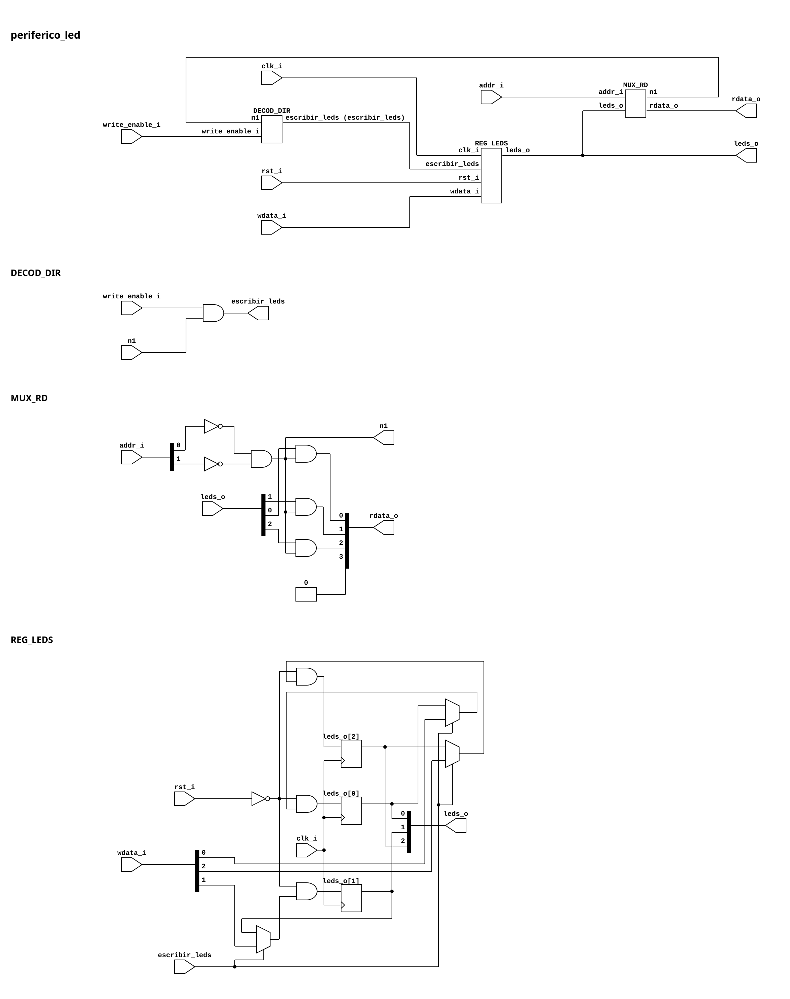

El esquemático sale de sintetizar el `.sv` con yosys, bajarlo a AND, OR, XOR, NOT, MUX y flip-flops D
con `abc`, y dibujarlo con netlistsvg. Cada compuerta o flip-flop lleva encima el nombre de la señal que
produce cuando esa señal tiene nombre en el RTL. Las que no tienen nombre son la lógica que yosys arma
para el reset y los `if` de cada registro.

Arriba está el periférico con sus tres bloques como cajas, `DECOD_DIR` de la línea 18 del `.sv`,
`REG_LEDS` de 21 a 24 y `MUX_RD` de 28 a 33, y abajo está cada uno abierto a compuertas. `leds_o`
sale directo de `reg_leds`, sin pasar por ningún bloque.

Se genera con el bus de 4 bits en vez de 32. Los tres bits del registro no cambian, lo que se ahorra
son los ceros constantes de `rdata_o` y las entradas sueltas de `wdata_i`.

## j) Diagrama completo de conexiones del diseño

Es el único módulo con puertos hacia los LEDs, así que acá van las restricciones de pin que tienen que quedar
en `src/fpga/basys3.xdc`. LD0 y LD1 son los mismos pines del Proyecto 2.

- `leds_o[0]`, colocación, a U16, LD0.
- `leds_o[1]`, batalla, a E19, LD1.
- `leds_o[2]`, resultado, a U19, LD2.
- Todos con `IOSTANDARD LVCMOS33`.

Conexiones en el top.

- `clk_i`, a `clk_sys`, el reloj del sistema de 33,33 MHz que sale del PLL.
- `rst_i`, al reinicio general del sistema.
- `write_enable_i`, a `led_we` del controlador de mapeo, en alto solo cuando `we_o` está en alto y
  `DataAddress_o` es `0x0001_0138`.
- `addr_i[1:0]`, a `2'b00`.
- `wdata_i[31:0]`, a `DataOut_o`.
- `rdata_o[31:0]`, a `MUX_LECTURA`, que alimenta `DataIn_i` del CPU. En `Address_Translator.md` es la entrada `led_dout`, que el AT elige con `mux_sel = 100`.
- `leds_o`, al puerto `led[2:0]` del top.

Igual que en los demás módulos, el diagrama por chips que pide el método no aplica a un diseño que se
sintetiza dentro de una sola FPGA, y esta lista de puertos es el reemplazo propuesto.

---

<!-- Fuente: docs/diseño/modulos/PERIFERICO_BUZZER.md -->

# PERIFERICO_BUZZER

## a) Nombre del módulo

PERIFERICO_BUZZER, módulo `periferico_buzzer` en `src/design/periferico_buzzer.sv`.

## b) Diagrama modular

```mermaid
flowchart LR
    IN_WE(["write_enable_i<br/>(buzzer_we)"]) --> PBUZ["PERIFERICO_BUZZER<br/>0x0001_0140"]
    IN_ADDR(["addr_i[1:0]<br/>(2'b00 fijo)"]) --> PBUZ
    IN_WD(["wdata_i[31:0]<br/>(DataOut_o)"]) --> PBUZ
    PBUZ --> OUT_RD(["rdata_o[31:0]<br/>(MUX_LECTURA)"])
    PBUZ --> OUT_BUZ(["buzzer_o<br/>(pin P18, JC4)"])
```

Es el bloque `PERIFERICO_BUZZER` del nivel 2 visto desde afuera. Lo que tiene adentro está en el
inciso i).

## c) Objetivo del módulo

Tocar en el buzzer la melodía que el programa le pida con un solo `sw`. Las cinco melodías de la
sección 4.5.4 del enunciado, impacto, fallo, hundido, colocación inválida y victoria, viven en el
periférico, y el programa solo escoge cuál.

Es el sucesor del `generador_tono` del Proyecto 2. Allá el módulo miraba la FSM del juego para saber
cuándo sonar. Acá no ve nada del juego, espera que el programa le escriba un código y lo reproduce.
Decidir que un disparo fue impacto, o que el impacto hundió un barco, es trabajo del ensamblador.

## d) Entradas

- `clk_i`, `rst_i`.
- `write_enable_i`, habilitación de escritura, desde `buzzer_we` del controlador de mapeo (`we_o` del
  CPU en AND con `sel_buzzer`).
- `addr_i[1:0]`, dirección del registro, fija en `2'b00` en el top, ver el inciso f).
- `wdata_i[WIDTH-1:0]`, dato a escribir, desde `DataOut_o` del CPU.

El módulo tiene los parámetros `WIDTH = 32`, `CLK_FREQ_HZ = 100_000_000` y `UNIDAD_MS = 50`. Los dos
últimos pasan tal cual a `SECUENCIADOR_MELODIA`. El top lo instancia con `CLK_FREQ_HZ = 33_333_333`, la
frecuencia de `clk_i`.

## e) Salidas

- `rdata_o[WIDTH-1:0]`, contenido del registro apuntado por `addr_i`, hacia el multiplexor de lectura
  que llega a `DataIn_i` del CPU.
- `buzzer_o`, onda cuadrada hacia el buzzer. Es el único cable que sale de la FPGA para esto.

## f) Relación con otros módulos

Igual que la UART, habla con un solo maestro, el CPU, a través de `BUS_DATOS`. La dirección la
decodifica el Address Translator del controlador de mapeo, detallado en `Address_Translator.md`, que
compara la dirección completa contra `0x0001_0140` para sacar `sel_buzzer`. Solo esa palabra llega al
periférico, así que en el top `addr_i` va fijo en `2'b00`, igual que en las entradas, los displays y el
LED.

Adentro instancia `SECUENCIADOR_MELODIA` y `GENERADOR_TONO`, que solo usa este módulo y tienen su
propio doc en `secuenciador_melodia.md` y `generador_tono.md`.

## g) Explicación de funcionamiento

El periférico tiene un solo registro, `REG_SONIDO`, de 3 bits. Cuando el programa lo escribe, el
registro guarda el código y el secuenciador arranca esa melodía desde la primera nota. Mientras suena
el registro conserva el código, y cuando la melodía termina vuelve solo a `000`.

Desde el programa es un `sw` y listo. El CPU no espera a que la melodía termine, sigue con el lazo
principal y el periférico se encarga de los tiempos. Si el programa quiere saber si el buzzer ya se
calló, por ejemplo para no cortar la victoria, lee `0x0001_0140` y compara con cero.

```asm
    addi t0, x0, 0x101
    slli t0, t0, 8
    addi t0, t0, 0x40      # t0 = 0x0001_0140, sin lui
    addi t1, x0, 3         # hundido
    sw   t1, 0(t0)
```

Una escritura mientras otra melodía suena la corta y arranca la nueva. Escribir `000` corta y deja
silencio.

## h) Diseño

### Mapa de registros

La tabla de la sección 4.4.3 del enunciado fija un solo registro de control en `0x0001_0140`.

- `2'b00` (`0x0001_0140`), registro de sonido. Bits `[2:0]` son el código de la melodía (RW, el
  hardware lo limpia al terminar), `[31:3]` son reservados, se leen en cero y las escrituras sobre
  ellos se ignoran.

`0x0001_0144` a `0x0001_014C` no son de este periférico. El AT las trata como direcciones sin destino,
así que ninguna escritura las habilita y una lectura devuelve cero desde `MUX_LECTURA`.

Los códigos están en `secuenciador_melodia.md`. `000` es silencio, `001` a `101` son las cinco
melodías, y `110` y `111` se comportan como silencio.

Se usa un código binario y no un bit por melodía porque nunca suenan dos a la vez. Con un bit por
melodía habría que definir qué pasa si el programa levanta dos, y eso ya sería una regla de
prioridad metida en el periférico.

### REG_SONIDO

| Condición                              | `reg_sonido'`  |
| -------------------------------------- | -------------- |
| `rst_i`                                | `000`          |
| `escribir_sonido`                      | `wdata_i[2:0]` |
| `o_fin` del secuenciador               | `000`          |
| resto                                  | sin cambio     |

`escribir_sonido` es `write_enable_i && addr_i == 2'b00`, y es también el `i_iniciar` del
secuenciador. La escritura va antes que la limpieza. En reposo `o_fin` está siempre en alto, porque
la fila `000` de la ROM es fin en todos sus pasos, y si la limpieza ganara el programa nunca podría
arrancar una melodía.

### Lectura

`rdata_o` vale `{29'b0, reg_sonido}` con `addr_i = 2'b00` y cero en las otras tres, que con `addr_i`
fijo no llegan nunca. Es
combinacional, igual que en la UART, así que un `lw` tiene el dato en el mismo ciclo.

### Reset

`rst_i` es síncrono, igual que en la UART, y deja el registro en `000` y el secuenciador en reposo.
`BTN_RST` no llega a `rst_i`, lo atiende el programa, así que tiene que escribir `000` al buzzer como
parte de su rutina de reinicio para cortar una melodía que venga sonando.

### Latches

El registro va en un `always_ff` con reset síncrono. La lectura es un `always_comb` con `case` y rama
`default`, así que las cuatro direcciones quedan cubiertas.

## i) Diagrama esquemático detallado del diseño


El esquemático sale de sintetizar el `.sv` con yosys, bajarlo a AND, OR, XOR, NOT, MUX y flip-flops D
con `abc`, y dibujarlo con netlistsvg. Cada compuerta o flip-flop lleva encima el nombre de la señal que
produce cuando esa señal tiene nombre en el RTL. Las que no tienen nombre son la lógica que yosys arma
para el reset y los `if` de cada registro.

Arriba está el periférico con los dos submódulos y los tres bloques del nivel 3 como cajas. Cada
bloque sale del `.sv`, `DECOD_DIR` de la línea 21, `REG_SONIDO` de 42 a 46 y `MUX_RD` de 48 a 53, y
abajo está cada uno abierto a compuertas. `secuenciador_melodia` y `generador_tono` se abren en sus
propios docs.

Se genera con el bus de 4 bits en vez de 32 y `n_nota` de 4 en vez de 18. `n_nota` solo pasa de una
caja a la otra, y los bits de más de `rdata_o` serían ceros constantes.

## j) Diagrama completo de conexiones del diseño

Es el único módulo con puerto hacia el buzzer, así que acá va la restricción de pin que tiene que
quedar en `src/fpga/basys3.xdc`.

- `buzzer_o`, al pin P18, JC4 del Pmod JC.
- `IOSTANDARD LVCMOS33`.

Conexiones en el top.

- `clk_i`, a `clk_sys`, el reloj del sistema de 33,33 MHz que sale del PLL.
- `rst_i`, al reset del sistema.
- `write_enable_i`, a `buzzer_we` del controlador de mapeo, en alto solo cuando `we_o` está en alto y
  `DataAddress_o` es `0x0001_0140`.
- `addr_i[1:0]`, a `2'b00`.
- `wdata_i[31:0]`, a `DataOut_o`.
- `rdata_o[31:0]`, a `MUX_LECTURA`, que alimenta `DataIn_i` del CPU. En `Address_Translator.md` es la entrada `buzzer_dout`, que el AT elige con `mux_sel = 101`.
- `buzzer_o`, al puerto `buzzer` del top.

Igual que en los demás módulos, el diagrama por chips que pide el método no aplica a un diseño que se
sintetiza dentro de una sola FPGA, y esta lista de puertos es el reemplazo propuesto.

---

<!-- Fuente: docs/diseño/modulos/secuenciador_melodia.md -->

# SECUENCIADOR_MELODIA

## a) Nombre del módulo

SECUENCIADOR_MELODIA, módulo `secuenciador_melodia` en `src/design/secuenciador_melodia.sv`.

## b) Diagrama modular

```mermaid
flowchart LR
    IN_INI(["i_iniciar<br/>(DECOD_DIR)"]) --> SEQ["SECUENCIADOR_MELODIA<br/>5 melodías, unidad de 50 ms"]
    IN_SON(["i_sonido[2:0]<br/>(REG_SONIDO)"]) --> SEQ
    SEQ --> OUT_N(["o_n[17:0]<br/>(GENERADOR_TONO)"])
    SEQ --> OUT_SON(["o_sonar<br/>(GENERADOR_TONO)"])
    SEQ --> OUT_FIN(["o_fin<br/>(REG_SONIDO)"])
```

## c) Objetivo del módulo

Recorrer nota por nota la melodía que pidió el programa y decirle a `GENERADOR_TONO` qué frecuencia
sacar y cuándo callarse. Tiene guardadas las cinco melodías que pide la sección 4.5.4 del enunciado,
impacto, fallo, hundido, colocación inválida y victoria.

## d) Entradas

- `clk`, reloj del sistema de 33,33 MHz.
- `rst`, reset síncrono.
- `i_iniciar`, pulso de un ciclo cuando el programa escribe el registro del buzzer, desde `DECOD_DIR`.
- `i_sonido[2:0]`, código de la melodía que está sonando, desde `REG_SONIDO`.

El módulo tiene los parámetros `CLK_FREQ_HZ = 100_000_000` y `UNIDAD_MS = 50`. En el top le llega
`CLK_FREQ_HZ = 33_333_333`, la frecuencia de `clk_i`, desde `PERIFERICO_BUZZER`. En simulación se baja
`CLK_FREQ_HZ` y todo, la unidad y los divisores de las notas, se reescala junto.

## e) Salidas

- `o_n[17:0]`, medio periodo menos uno de la nota actual, hacia `GENERADOR_TONO`.
- `o_sonar`, en alto mientras la nota actual no sea silencio y la melodía no haya terminado, hacia
  `GENERADOR_TONO`.
- `o_fin`, en alto mientras la melodía esté terminada, hacia `REG_SONIDO` para que vuelva a cero.

## f) Relación con otros módulos

Solo lo instancia `PERIFERICO_BUZZER`. Del lado del bus recibe `i_iniciar` de `DECOD_DIR` e
`i_sonido` de `REG_SONIDO`. Del otro lado le entrega `o_n` y `o_sonar` a `GENERADOR_TONO`, que es el
único que toca el pin.

`o_fin` cierra el lazo con `REG_SONIDO`. Cuando la melodía termina el registro vuelve a `000`, y así
el programa puede leer `0x0001_0140` para saber si el buzzer ya se calló.

## g) Explicación de funcionamiento

Una melodía es una lista de hasta ocho pasos en `ROM_MELODIAS`. Cada paso trae una nota y una
duración en unidades de 50 ms, y un paso con duración cero marca el final.

Con `i_iniciar` el secuenciador pone `paso` en cero y reinicia los contadores de tiempo. En el mismo
flanco `REG_SONIDO` carga el código nuevo, así que desde el ciclo siguiente la dirección
`{i_sonido, paso}` ya apunta al primer paso de la melodía pedida. `CONT_CICLOS` da un pulso cada
50 ms, `CONT_UNIDADES` los cuenta, y cuando llegan a la duración del paso `paso` sube y arranca la
siguiente nota.

Cuando el paso leído tiene duración cero, `o_fin` sube, `o_sonar` baja y los contadores se quedan
quietos. `REG_SONIDO` vuelve a `000`, y como las filas de `000` en la ROM tienen duración cero en
todos sus pasos, el secuenciador se queda en reposo sin necesitar un estado aparte para eso.

Una escritura nueva a mitad de melodía la corta y arranca la nueva desde el paso cero. Cuál sonido
gana cuando dos eventos caen juntos, por ejemplo el impacto que hunde un barco o el hundido que
termina la partida, lo decide el programa escribiendo solo el que corresponde.

## h) Diseño

### Códigos de sonido

- `000`, silencio. Escribirlo corta lo que esté sonando.
- `001`, impacto.
- `010`, fallo.
- `011`, hundido.
- `100`, colocación inválida.
- `101`, victoria.
- `110` y `111`, sin melodía. Sus filas de la ROM son iguales a las de `000`, así que escribirlos
  equivale a escribir silencio.

### ROM_NOTAS

Cada nota es un índice de 4 bits. El divisor sale de `N = CLK_FREQ_HZ / (2 f) - 1`, con división
entera, igual que en el Proyecto 2. Los N se calculan como `localparam` a partir de las
frecuencias, así que la tabla no guarda números mágicos. La columna de 33,33 MHz es la que corre en
la tarjeta, y la de 100 MHz es la del valor por defecto del parámetro, que revisa el testbench.

| Índice | Nota     | f (Hz) | N a 33,33 MHz (top) | N a 100 MHz |
| ------ | -------- | ------ | ------------------- | ----------- |
| `0`    | silencio | -      | `0`                 | `0`         |
| `1`    | A3       | 220    | `75756`             | `227271`    |
| `2`    | C4       | 262    | `63612`             | `190838`    |
| `3`    | E4       | 330    | `50504`             | `151514`    |
| `4`    | G4       | 392    | `42516`             | `127550`    |
| `5`    | C5       | 523    | `31866`             | `95601`     |
| `6`    | E5       | 659    | `25289`             | `75871`     |
| `7`    | G5       | 784    | `21257`             | `63774`     |
| `8`    | C6       | 1047   | `15917`             | `47754`     |
| `9`    | E6       | 1319   | `12634`             | `37906`     |
| `10`   | G6       | 1568   | `10628`             | `31886`     |
| `11` a `15` | sin usar | - | `0`                | `0`         |

Las frecuencias son las de la escala temperada redondeadas al entero. Con estos N la frecuencia real
queda a menos de 0.01% de la nominal en las dos columnas, que no se distingue de oído. Los índices sin
usar dan `N = 0`, y si alguno se colara en la ROM el buzzer sonaría a la mitad de `clk_i` (16,7 MHz en
el top), que el piezo no reproduce, en vez de quedarse pegado.

### ROM_MELODIAS

Dirección de 6 bits, `{i_sonido, paso}`, 64 palabras de 7 bits, `{nota[3:0], dur[2:0]}`. `dur` va en
unidades de 50 ms, de 1 a 7, y `dur = 0` es fin.

Impacto, 200 ms. Tres notas que suben rápido, suena a acierto.

| Paso | Nota | dur | ms  |
| ---- | ---- | --- | --- |
| 0    | G5   | 1   | 50  |
| 1    | C6   | 1   | 50  |
| 2    | E6   | 2   | 100 |
| 3    | fin  | 0   |     |

Fallo, 350 ms. Tres notas graves que bajan, el "womp" de haber tirado al agua.

| Paso | Nota | dur | ms  |
| ---- | ---- | --- | --- |
| 0    | G4   | 2   | 100 |
| 1    | E4   | 2   | 100 |
| 2    | C4   | 3   | 150 |
| 3    | fin  | 0   |     |

Hundido, 500 ms. Una cascada rápida desde arriba, un corte y una nota larga abajo. Arranca más agudo
que el impacto y baja en vez de subir, para que no se confundan aunque vengan uno después del otro.

| Paso | Nota     | dur | ms  |
| ---- | -------- | --- | --- |
| 0    | E6       | 1   | 50  |
| 1    | C6       | 1   | 50  |
| 2    | G5       | 1   | 50  |
| 3    | E5       | 1   | 50  |
| 4    | C5       | 1   | 50  |
| 5    | silencio | 1   | 50  |
| 6    | C5       | 4   | 200 |
| 7    | fin      | 0   |     |

Colocación inválida, 250 ms. Dos zumbidos en la nota más grave de la tabla, el aviso de error.

| Paso | Nota     | dur | ms  |
| ---- | -------- | --- | --- |
| 0    | A3       | 2   | 100 |
| 1    | silencio | 1   | 50  |
| 2    | A3       | 2   | 100 |
| 3    | fin      | 0   |     |

Victoria, 950 ms. Arpegio de do mayor subiendo, una pausa y el remate en C6 largo.

| Paso | Nota     | dur | ms  |
| ---- | -------- | --- | --- |
| 0    | C5       | 2   | 100 |
| 1    | E5       | 2   | 100 |
| 2    | G5       | 2   | 100 |
| 3    | C6       | 4   | 200 |
| 4    | silencio | 1   | 50  |
| 5    | G5       | 1   | 50  |
| 6    | C6       | 7   | 350 |
| 7    | fin      | 0   |     |

Los pasos que no aparecen en una tabla se llenan con `{0, 0}`, que es fin. Las filas de `000`, `110`
y `111` son `{0, 0}` en los ocho pasos.

`paso` es de 3 bits y no se revisa si se pasa de 7. La regla es que cada melodía tiene como máximo
siete notas y el paso 7, si se llega, es siempre fin. Hundido y victoria ya la usan entera.

### Contadores

`CICLOS_UNIDAD = CLK_FREQ_HZ / 1000 x UNIDAD_MS`, 1 666 650 ciclos a 33,33 MHz, y `cont_ciclos` tiene
`$clog2(CICLOS_UNIDAD)` bits, 21 en el top (23 con el valor por defecto de 100 MHz). `tick_unidad` vale `cont_ciclos == CICLOS_UNIDAD - 1` y `fin_nota` vale
`tick_unidad` en AND con `cont_unidades == dur - 1`.

| Condición                  | `cont_ciclos'`    | `cont_unidades'`    | `paso'`     |
| -------------------------- | ----------------- | ------------------- | ----------- |
| `rst` o `i_iniciar`        | `0`               | `0`                 | `0`         |
| `dur = 0` (fin)            | `0`               | `0`                 | sin cambio  |
| `fin_nota`                 | `0`               | `0`                 | `paso + 1`  |
| `tick_unidad`              | `0`               | `cont_unidades + 1` | sin cambio  |
| resto                      | `cont_ciclos + 1` | sin cambio          | sin cambio  |

`i_iniciar` va primero porque tiene que poder cortar una melodía en cualquier punto. La fila de fin va
antes que `fin_nota` para que los contadores no sigan corriendo sobre una melodía terminada.

Los contadores de tiempo se reinician al empezar cada nota, así que cada una dura exactamente
`dur x 50 ms` sin importar en qué momento del ciclo llegó la escritura del programa.

### Salidas

- `o_fin = (dur == 0)`.
- `o_sonar = (dur != 0) && (nota != 0)`.
- `o_n`, la salida de `ROM_NOTAS` para la nota del paso actual.

Las dos ROM son `always_comb` con `case` y rama `default`, así que yosys las baja a LUTs y la lectura
sale en el mismo ciclo. 64 palabras de 7 bits y 16 de 18 bits no justifican una BRAM.

### Latches

Los contadores van en un `always_ff` con reset síncrono. Las dos ROM llevan `default` en su `case` y
asignan todas sus salidas en todas las ramas, que es lo que evita el latch.

## i) Diagrama esquemático detallado del diseño


El esquemático sale de sintetizar el `.sv` con yosys, bajarlo a AND, OR, XOR, NOT, MUX y flip-flops D
con `abc`, y dibujarlo con netlistsvg. Cada compuerta o flip-flop lleva encima el nombre de la señal que
produce cuando esa señal tiene nombre en el RTL. Las que no tienen nombre son la lógica que yosys arma
para el reset y los `if` de cada registro.

Arriba está el módulo con sus bloques como cajas, `ROM_MELODIAS` de las líneas 56 a 91 del `.sv`,
`ROM_NOTAS` de 93 a 107, `FIN_NOTA` con `tick_unidad` y `fin_nota` de 109 a 110 y `SALIDAS` con
`o_fin` y `o_sonar` de 135 a 136. El `always_ff` de los contadores está partido por registro,
`CONTADORES_CONT_CICLOS`, `CONTADORES_CONT_UNIDADES` y `CONTADORES_PASO`, y lo que usan los tres queda
en `CONTADORES_COMUN`. Abajo está cada bloque abierto a compuertas.

Se genera con `CLK_FREQ_HZ = 4000`, `UNIDAD_MS = 1` y `o_n` de 4 bits. Con eso `cont_ciclos` queda de
2 bits y los N de `ROM_NOTAS` caben en 4, así que las constantes de esa ROM en el dibujo no son las de
la tabla del inciso h). `ROM_MELODIAS` sí es la real, no depende de ningún parámetro. Para este
módulo yosys corre con `proc -norom`, porque si no convierte los dos `case` en ROMs y el dibujo
muestra memorias en vez de compuertas.

## j) Diagrama completo de conexiones del diseño

Conexiones dentro de `PERIFERICO_BUZZER`.

- `clk`, a `clk_i`.
- `rst`, a `rst_i`.
- `i_iniciar`, a `escribir_sonido` de `DECOD_DIR`.
- `i_sonido`, a `reg_sonido`.
- `o_n`, a `i_n` de `GENERADOR_TONO`.
- `o_sonar`, a `i_sonar` de `GENERADOR_TONO`.
- `o_fin`, a la entrada de limpieza de `REG_SONIDO`.

Igual que en los demás módulos, el diagrama por chips que pide el método no aplica a un diseño que se
sintetiza dentro de una sola FPGA, y esta lista de puertos es el reemplazo propuesto.

---

<!-- Fuente: docs/diseño/modulos/generador_tono.md -->

# GENERADOR_TONO

## a) Nombre del módulo

GENERADOR_TONO, módulo `generador_tono` en `src/design/generador_tono.sv`.

## b) Diagrama modular

```mermaid
flowchart LR
    IN_N(["i_n[17:0]<br/>(SECUENCIADOR_MELODIA)"]) --> GEN["GENERADOR_TONO<br/>divisor de frecuencia"]
    IN_SONAR(["i_sonar<br/>(SECUENCIADOR_MELODIA)"]) --> GEN
    GEN --> OUT(["o_sound<br/>(pin del buzzer)"])
```

## c) Objetivo del módulo

Sacar una onda cuadrada de la frecuencia que le pidan hacia el buzzer. Es el `generador_tono` del
Proyecto 2 con la parte de decidir qué suena y por cuánto tiempo quitada. Allá el mismo módulo
miraba el estado de la FSM y el resultado de la letra, elegía uno de tres tonos fijos y contaba los
150 ms. Acá eso lo hace `SECUENCIADOR_MELODIA`, y a este módulo solo le queda el divisor.

## d) Entradas

- `clk`, reloj del sistema de 33,33 MHz.
- `rst`, reset síncrono.
- `i_n[ANCHO_N-1:0]`, medio periodo de la nota menos uno, en ciclos de reloj, desde `ROM_NOTAS` dentro de `SECUENCIADOR_MELODIA`.
- `i_sonar`, en alto mientras haya que sonar, desde `SECUENCIADOR_MELODIA`.

El módulo tiene el parámetro `ANCHO_N = 18`, que alcanza para la nota más grave de la tabla.

## e) Salidas

- `o_sound`, onda cuadrada hacia el pin del buzzer. En cero mientras `i_sonar` esté en cero.

## f) Relación con otros módulos

Solo lo instancia `PERIFERICO_BUZZER`. `i_n` e `i_sonar` le llegan de `SECUENCIADOR_MELODIA`, dentro
del mismo periférico. `o_sound` sale sin pasar por nada más
al puerto `buzzer` del top.

No se entera de qué melodía está sonando ni de cuándo cambia la nota. Ve un `i_n` distinto y sigue
dividiendo con ese.

## g) Explicación de funcionamiento

Un contador sube en cada ciclo mientras `i_sonar` esté en alto. Cuando llega a `i_n` vuelve a cero
y `reg_onda` cambia de valor, así que cada medio periodo dura `i_n + 1` ciclos y la frecuencia queda
en `f_clk / (2 (i_n + 1))`.

Con `i_sonar` en cero el contador y `reg_onda` se quedan en cero, y la siguiente nota arranca
siempre desde silencio. La salida es `reg_onda` en AND con `i_sonar`, igual que en el Proyecto 2,
para que el buzzer baje en el mismo ciclo en que se apaga el enable y no uno después.

## h) Diseño

### Qué cambió respecto al Proyecto 2

- `i_state`, `i_letra_state` e `i_letra_lista` se van. Eran reglas del Ahorcado metidas en el
  periférico, y la sección 4.1 del enunciado prohíbe eso en este proyecto.
- `REG_N`, el selector de evento y la prioridad fin, acierto, fallo se van. El valor de N ya llega
  resuelto por `i_n`.
- `REG_ENABLE` y `CONT_DURACION` pasan a `SECUENCIADOR_MELODIA`, que ahora tiene que medir varias
  notas seguidas y no una sola de 150 ms. Lo que queda de ellos acá es `i_sonar`.
- `CONT_DIVISOR`, `REG_ONDA` y la AND de salida se quedan igual, salvo la comparación.

### La comparación del divisor

En el Proyecto 2 el contador volvía a cero con `cont_divisor == reg_n`. Eso funcionaba porque
`reg_n` solo cambiaba con un disparo nuevo, y el disparo también ponía el contador en cero.

En una melodía la nota cambia sin pasar por silencio. Si se pasa de una nota grave a una aguda, el
contador puede ir por encima del N nuevo en el momento del cambio, y con `==` seguiría subiendo
hasta dar la vuelta en `2^18`. Eso son 7.9 ms de onda congelada en medio de la melodía. Con
`cont_divisor >= i_n` el contador vuelve a cero en el ciclo siguiente y lo peor que pasa es un medio
periodo corto, que no se oye. Así tampoco hace falta un pulso de reinicio entre notas.

| Condición                     | `cont_divisor'`    | `reg_onda'`   |
| ----------------------------- | ------------------ | ------------- |
| `rst`                         | `0`                | `0`           |
| `i_sonar = 0`                 | `0`                | `0`           |
| `cont_divisor >= i_n`         | `0`                | `~reg_onda`   |
| resto                         | `cont_divisor + 1` | sin cambio    |

### Ancho del divisor

La nota más grave de `ROM_NOTAS` es A3 a 220 Hz. Con `clk_i` de 33,33 MHz,
`N = 33333333 / (2 x 220) - 1 = 75756`, que entra en 17 bits. `ANCHO_N = 18` deja espacio para bajar
hasta unos 64 Hz sin cambiar el ancho, y alcanza también si el reloj sube hasta 100 MHz
(`N = 227271`, el caso más exigente). Si se agrega una nota más grave, `ANCHO_N` sube junto con
`ROM_NOTAS`.

### Estructura del RTL

El contador y el comparador van como submódulos instanciados, `u_cont` (`contador_limpiable`) y
`u_cmp` (`comparador_mayor_igual`), en vez de quedar dentro de un solo `always_ff`. Así el esquemático
del inciso i) conserva los mismos bloques que la tabla de arriba, y yosys no los aplana en una sola
maraña de compuertas.

- `apagado = rst | ~i_sonar`, limpia contador y `reg_onda`.
- `fin_medio_periodo`, salida de `u_cmp`, es `cont_divisor >= i_n`.
- `u_cont` se limpia con `apagado | fin_medio_periodo` y si no suma uno.
- `reg_onda` pasa a `reg_onda ^ fin_medio_periodo`, o a cero con `apagado`.

### Latches

`reg_onda` y el contador de `u_cont` van cada uno en su `always_ff`, con `apagado` como reset síncrono.
El comparador y la salida son `assign`. No hay `always_comb`, así que no hay por dónde se cuele un latch.

## i) Diagrama esquemático detallado del diseño

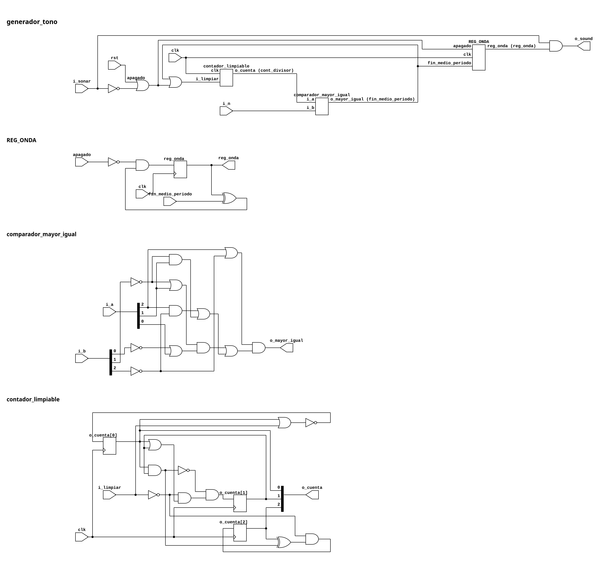

El esquemático sale de sintetizar el módulo con yosys, bajarlo a AND, OR, XOR, NOT y flip-flops D con
`abc`, y dibujarlo con netlistsvg. Se genera con `ANCHO_N = 3` porque con 18 bits el dibujo no se
puede leer. Con más bits el contador y el comparador repiten la misma celda por bit, y lo que está
fuera de ellos no cambia.

Arriba está el módulo con `u_cont` (`contador_limpiable`), `u_cmp` (`comparador_mayor_igual`) y
`REG_ONDA`, el `always_ff` de las líneas 31 a 35 del `.sv`, como cajas. Abajo está cada uno abierto a
compuertas.
Cada compuerta o flip-flop lleva encima el nombre de la señal que produce cuando esa señal tiene
nombre en el RTL. Las que no tienen nombre son la lógica que yosys arma para el reset y el `if` de
cada registro.

## j) Diagrama completo de conexiones del diseño

Conexiones dentro de `PERIFERICO_BUZZER`.

- `clk`, a `clk_i`.
- `rst`, a `rst_i`.
- `i_n`, a `o_n` de `SECUENCIADOR_MELODIA`.
- `i_sonar`, a `o_sonar` de `SECUENCIADOR_MELODIA`.
- `o_sound`, a `buzzer_o`, que en el top va al pin P18 (JC4) con `IOSTANDARD LVCMOS33`.

Igual que en los demás módulos, el diagrama por chips que pide el método no aplica a un diseño que se
sintetiza dentro de una sola FPGA, y esta lista de puertos es el reemplazo propuesto.

---

<!-- Fuente: docs/diseño/modulos/PROGRAMA.md -->

# PROGRAMA

Programa en ensamblador `rv32i` que corre en `PROCESADOR_UNICICLO` desde la ROM. Descripción de nivel 4 del programa donde se explica cómo se divide el código, la
convención de llamado, el uso de la pila, el programa principal paso a paso y la ficha de cada
subrutina.

---

## 1. Organización del código en la ROM

El programa es un solo archivo que se ensambla a partir de `0x0000_0000`, el vector de reset.
Solo tiene código (`.text`). No hay datos constantes en la ROM, porque el Address Translator no
la mapea en el bus de datos y un `lw` no la puede leer. Toda constante va como inmediato y toda
variable se inicializa por código en la RAM.

| Orden | Parte | Qué es |
| --- | --- | --- |
| 1 | `INICIO` | Arranque por `rst_i`. Carga los registros base y pone en cero las partidas ganadas |
| 2 | `PARTIDA` | Entrada de cada partida nueva, desde `INICIO` o desde `BTN_RST` |
| 3 | `LAZO_COLOCACION` | Programa principal de la fase de colocación |
| 4 | `INICIO_BATALLA` y `LAZO_BATALLA` | Programa principal de la fase de batalla |
| 5 | `FIN_PARTIDA` y `LAZO_FIN` | Programa principal del resultado |
| 6 | Subrutinas | Todas las subrutinas de la sección 6, después del programa principal |

El programa principal (partes 1 a 5) no es una subrutina: no se llama con `jal ra` y nunca
ejecuta `ret`. Pasa de una fase a otra con saltos (`j`). Las subrutinas van todas juntas al
final, así un error en el flujo principal no puede "caer" dentro de una subrutina.

La ROM tiene 8 KB, o sea 2048 instrucciones. El programa completo (`sw/programa.s`) ocupa 1264
instrucciones (62 % de la ROM), así que el tamaño no es una restricción. Unas 500 son los textos
del HUD, que cuestan tres instrucciones por casilla de dos letras (sección 4.5).

### 1.1. Instrucciones que usa

El programa usa la lista base del instructivo (sección 4.4.1) más `lui`. El instructivo presenta
esa lista como una base, y el núcleo implementa todo `rv32i`, pero cada instrucción que usa el
programa es una instrucción más que verificar en el testbench del núcleo y que justificar en la
defensa. Por eso se agrega solo la que tiene una razón concreta:

| Instrucción | ¿Se usa? | Por qué |
| --- | --- | --- |
| `lui` | Sí | Cada dirección base (`s0`, `s1`, `s2`, `sp`) sale de una sola instrucción, y `li` sirve con cualquier constante |
| `auipc` | No | Arma direcciones relativas al PC. La ROM mide 8 KB y `jal` llega a cualquier punto, y una etiqueta de la ROM no se puede leer con `lw` porque la ROM no está en el bus de datos |
| `lb`, `lbu`, `lh`, `lhu`, `sb`, `sh` | No | La interfaz de los periféricos no tiene habilitación por byte, así que un `sb` escribiría la palabra completa con el dato corrido. Todas las variables ocupan una palabra |
| `bltu`, `bgeu` | No | Todos los valores que se comparan son positivos, y `blt` y `bge` alcanzan |

Como `auipc` no se usa, las subrutinas se llaman con `jal ra, NOMBRE` y no con la
pseudoinstrucción `call`, que se expande en `auipc` y `jalr`. Tampoco se usa `la`. Las
pseudoinstrucciones que sí aparecen (`li`, `mv`, `j`, `ret`, `beqz`, `bnez`) se expanden en
instrucciones de la lista.

### 1.2. Ensamblado

El programa se ensambla con binutils de GNU (`riscv64-unknown-elf`) mediante
`bash sw/ensamblar.sh sw/programa.s`. El script:

1. Ensambla con `-march=rv32i -mabi=ilp32`.
2. Enlaza a partir de `0x0000_0000` sin relajación (`--no-relax`), así la ROM contiene exactamente
   las instrucciones escritas. El enlazador también detecta etiquetas inexistentes, que el
   ensamblador deja pasar.
3. Desensambla a `sw/build/programa.lst` y rechaza el programa si aparece una instrucción fuera de
   la tabla de 1.1, indicando su dirección.
4. Genera `sw/programa.hex`, una instrucción de 32 bits por palabra, que la ROM carga con
   `$readmemh`.

El programa declara `.globl INICIO`, la etiqueta de entrada que espera el enlazador.

En una máquina sin binutils de GNU para RISC-V se puede usar `bash sw/ensamblar_llvm.sh
sw/programa.s`, que hace lo mismo con LLVM (`llvm-mc`, `llvm-objdump`, `llvm-objcopy`; en Ubuntu
vienen en el paquete `llvm`). No enlaza: el programa es un solo archivo con todo en `.text`, y sin
relajación `llvm-mc` deja resueltos los saltos en el mismo objeto. Si queda alguna relocación,
como pasa con una etiqueta mal escrita, el script lo rechaza. Con el programa de 725
instrucciones se comprobó que los dos scripts dan el mismo `programa.hex` palabra por palabra.

---

## 2. Nombres simbólicos

El código no usa números sueltos para direcciones, códigos ni colores. Todos se definen al
principio del archivo con `.equ`, y el resto del código usa el nombre. Así una dirección o un
código se cambia en un solo lugar, y el código se lee como el diseño.

### 2.1. Registros de periféricos (desplazamientos desde `s0 = 0x0001_0000`)

| Nombre | Valor | Dirección | Uso |
| --- | --- | --- | --- |
| `UART_CTRL` | `0x040` | `0x0001_0040` | `[0]` `send`, `[1]` `new_rx` |
| `UART_TX` | `0x044` | `0x0001_0044` | Byte a transmitir |
| `UART_RX` | `0x048` | `0x0001_0048` | Byte recibido |
| `BOTONES` | `0x120` | `0x0001_0120` | Estado de los siete botones del Jugador 1 |
| `DISPLAYS` | `0x130` | `0x0001_0130` | Cuatro dígitos BCD |
| `LED` | `0x138` | `0x0001_0138` | Un bit por fase |
| `BUZZER` | `0x140` | `0x0001_0140` | Código de melodía |

### 2.2. Variables en RAM (desplazamientos desde `s2 = 0x0000_2000`)

Son las de la tabla "Organización de la RAM" del nivel 3, con su desplazamiento.

| Nombre | Valor | Nombre | Valor |
| --- | --- | --- | --- |
| `TABLERO_J1` | `0x000` | `IMPACTOS_J1` | `0x220` |
| `TABLERO_J2` | `0x100` | `IMPACTOS_J2` | `0x22C` |
| `FASE` | `0x200` | `DISPAROS_J1` | `0x238` |
| `TURNO` | `0x204` | `DISPAROS_J2` | `0x23C` |
| `COLOCADOS_J1` | `0x208` | `HUNDIDOS_POR_J1` | `0x240` |
| `COLOCADOS_J2` | `0x20C` | `HUNDIDOS_POR_J2` | `0x244` |
| `CURSOR_FILA` | `0x210` | `GANADAS_BCD` | `0x248` |
| `CURSOR_COL` | `0x214` | `RX_INDICE` | `0x24C` |
| `ORIENTACION` | `0x218` | `RX_TRAMA` | `0x250` |
| `BOTONES_PREV` | `0x21C` | `FIN_VARIABLES` | `0x264` |

Los pares de variables de cada jugador están ordenados para que el jugador se use como índice:

- Tablero del jugador `j`: `s2 + (j << 8)`.
- Impactos de los barcos del jugador `j`: `s2 + IMPACTOS_J1 + 12 × j`, con `12 × j = (j << 3) + (j << 2)`.
- Disparos y hundidos logrados por el jugador `j`: `DISPAROS_J1 + 4 × j` y `HUNDIDOS_POR_J1 + 4 × j`.

Así una sola rutina atiende a los dos jugadores sin repetir código.

### 2.3. Códigos

| Grupo | Nombres y valores |
| --- | --- |
| Bits de `BOTONES` | `BTN_ARRIBA = 0x01`, `BTN_ABAJO = 0x02`, `BTN_IZQ = 0x04`, `BTN_DER = 0x08`, `BTN_SEL = 0x10`, `BTN_OK = 0x20`, `BTN_RST = 0x40`, y `BTN_FLECHAS = 0x0F` |
| Colores del VGA | `C_AGUA = 0`, `C_BARCO = 1`, `C_IMPACTO = 2`, `C_FALLO = 3`, `C_CURSOR = 4`, `C_FONDO = 5`, `C_J1 = 6`, `C_J2 = 7` |
| Palabra de video | `BORDE = 8` (bit 3, línea del grid), `CAR_DESPL = 4` (carácter de la mitad izquierda en `[9:4]`), `CAR2_DESPL = 10` (mitad derecha en `[15:10]`), `CENTRADO = 0x10000` (bit 16, un solo carácter en el centro) |
| Caracteres, ASCII − 32 | `CH__ = 0` (espacio), `CH_0 = 16` a `CH_9 = 25`, `CH_A = 33` a `CH_Z = 58` |
| Pantalla | `TAB_FILA0 = 4` y `TAB_COL0 = 1` (casilla de pantalla de la fila 0 y la columna 0 del tablero J1), `HUD_FILA_TITULOS = 1`, `HUD_FILA_ESTADO = 2`, `HUD_FILA_LETRAS = 3`, `HUD_FILA_MENSAJE = 12`, `HUD_FILA_GANADAS = 13`, `HUD_COL_GANADAS_J1 = 13`, `HUD_COL_GANADAS_J2 = 17`, `ULTIMA_COL = 19` |
| Estado de casilla en RAM | `E_AGUA = 0`, `E_BARCO = 1`, `E_IMPACTO = 2`, `E_FALLO = 3` |
| Melodías del buzzer | `SND_SILENCIO = 0`, `SND_IMPACTO = 1`, `SND_FALLO = 2`, `SND_HUNDIDO = 3`, `SND_INVALIDA = 4`, `SND_VICTORIA = 5` |
| LED de estado | `LED_COLOCACION = 0x1`, `LED_BATALLA = 0x2`, `LED_RESULTADO = 0x4` |
| Fase | `F_COLOCACION = 0`, `F_BATALLA = 1`, `F_RESULTADO = 2` |
| Resultado de colocación | `COL_VALIDA = 0`, `COL_TRASLAPE = 1`, `COL_FUERA = 2`, `COL_REPETIDO = 3` |
| Resultado de disparo | `D_IMPACTO = 0`, `D_FALLO = 1`, `D_HUNDIDO = 2`, `D_REPETIDO = 3` |
| Tramas UART | `TRAMA_INICIO = 0xAA`, `MSG_COLOCAR = 0x10`, `MSG_DISPARO = 0x11`, `MSG_ESTADO = 0x20`, `MSG_RES_COLOCACION = 0x21`, `MSG_DISPARO_DADO = 0x22`, `MSG_DISPARO_RECIBIDO = 0x23`, `MSG_RESUMEN_DISPAROS = 0x24`, `MSG_RESUMEN_HUNDIDOS = 0x25` |
| `D1` de Estado | `EST_COLOCACION = 0`, `EST_BATALLA = 1`, `EST_TURNO = 2`, `EST_FIN = 3` |

Los resultados de colocación y de disparo usan a propósito los mismos valores que el campo `D2`
de las tramas Resultado de colocación y Disparo dado. La subrutina que valida devuelve el código
y el programa principal lo manda por UART tal cual, sin traducirlo. De la misma forma, la
melodía de un disparo es `resultado + 1` (impacto 1, fallo 2, hundido 3) y el color de un
jugador es `C_J1 + j`.

---

## 3. Convención de llamado

Es la convención estándar de RISC-V, recortada a lo que usa este programa.

### 3.1. Registros

| Registro | Nombre ABI | Uso en el programa | ¿Quién lo preserva? |
| --- | --- | --- | --- |
| `x0` | `zero` | Constante cero | No cambia |
| `x1` | `ra` | Dirección de retorno | La subrutina que llama a otra lo guarda en la pila |
| `x2` | `sp` | Puntero de pila | Cada subrutina lo deja como lo encontró |
| `x3`, `x4` | `gp`, `tp` | No se usan | |
| `x5` a `x7`, `x28` a `x31` | `t0` a `t6` | Temporales | Nadie. Una subrutina los puede ensuciar sin avisar |
| `x8` | `s0` | Base de periféricos, `0x0001_0000` | Fijo, nadie lo escribe después de `INICIO` |
| `x9` | `s1` | Base de la memoria de video, `0x0001_1000` | Fijo |
| `x18` | `s2` | Base de las variables en RAM, `0x0000_2000` | Fijo |
| `x19` a `x27` | `s3` a `s11` | Valores que tienen que sobrevivir a una llamada | La subrutina que los usa los guarda y los restaura |
| `x10`, `x11` | `a0`, `a1` | Argumentos y valores de retorno | Nadie |
| `x12` a `x17` | `a2` a `a7` | Argumentos | Nadie |

`s0` hace también de *frame pointer* en la convención estándar. Este programa no usa *frame
pointer*, por eso queda libre para ser una base fija.

### 3.2. Reglas

1. **Argumentos** en `a0`, `a1`, `a2` y en adelante, en el orden de la ficha de cada subrutina.
   Ninguna subrutina recibe más de cinco.
2. **Resultado** en `a0`. `UART_ATENDER` y `VALIDAR_TRAMA` devuelven tres valores, en `a0`, `a1`
   y `a2`.
3. **Temporales.** Después de una llamada (`jal ra, NOMBRE`), los `t*` y los `a*` que no son
   resultado se consideran basura. Si el que llama necesita un valor después de la llamada, lo guarda antes en un `s*`.
4. **Preservados.** Una subrutina que escribe un `s3` a `s11` guarda antes su valor en la pila y
   lo restaura antes del `ret`. Así el programa principal puede tener su estado en `s3` a `s11`
   sin guardarlo nunca.
5. **Hoja o no hoja.** Una subrutina que no llama a ninguna otra (hoja) no toca `ra` ni la pila.
   Una que llama a otra guarda `ra` en la pila, porque su propio `jal ra` lo sobrescribe.
6. **Bases.** Ningún código escribe `s0`, `s1` ni `s2` fuera de `INICIO`.

### 3.3. Pila

La pila empieza en `0x0000_3000` (`sp` apunta justo arriba del último cajón de la RAM) y crece
hacia abajo, hacia las variables. Cada subrutina no hoja arma un marco al entrar y lo desarma al
salir:

```asm
NOMBRE:
    addi sp, sp, -16      # marco de 4 palabras: ra y hasta tres s*
    sw   ra, 12(sp)
    sw   s3, 8(sp)
    sw   s4, 4(sp)
    sw   s5, 0(sp)
    # ... cuerpo, que puede usar s3 a s5 y llamar a otras subrutinas ...
    lw   s5, 0(sp)
    lw   s4, 4(sp)
    lw   s3, 8(sp)
    lw   ra, 12(sp)
    addi sp, sp, 16
    ret
```

El marco mide `4 × (1 + cantidad de s* guardados)` bytes. Se alinea a 4 bytes y no a 16 como pide
la convención estándar, porque el programa no se enlaza con código en C y todos los accesos son
de palabra.

La cadena de llamadas más profunda es `PARTIDA` → `NUEVA_PARTIDA` → `REPINTAR_TABLERO` →
`PINTAR_CASILLA` → `DIR_TABLERO`, con 40 bytes de pila en total (marcos de 4, 16 y 20 bytes, y
`DIR_TABLERO` es hoja). Los 3.4 KB libres entre `FIN_VARIABLES` y `0x0000_3000` sobran.

**`sp` se vuelve a cargar en cada partida nueva.** `BTN_RST` solo se revisa en el programa
principal, nunca dentro de una subrutina, así que en ese momento la pila ya está vacía. Aun así
`PARTIDA` vuelve a cargar `sp` con `lui sp, 0x3`, para que un error de marco en una partida no se
arrastre a la siguiente.

---

## 4. Pantalla

El programa decide qué se ve en cada casilla de la pantalla. El periférico VGA pinta lo que dice
la palabra de cada casilla: un color de fondo, el bit `BORDE` para la línea del grid y hasta dos
caracteres encima, o uno centrado (ver [`PERIFERICO_VGA.md`](modulos/PERIFERICO_VGA.md)). La cuadrícula es
de 20 × 15 casillas y los colores son los de la paleta de ese doc.

```
col:     0   1 ........ 8   9  10  11 ....... 18  19
fila 0   vacía
fila 1         JUGADOR 1                 JUGADOR 2           títulos
fila 2   HUD: estado de la colocación, turno activo o ganador
fila 3       A B C D E F G H       A B C D E F G H       letras de columna
fila 4   1 │ tablero J1 (propio) │    1 │ tablero J2 (rival)  │
 ...     . │ filas 4 a 11        │    . │ filas 4 a 11        │
fila 11  8 │ columnas 1 a 8      │    8 │ columnas 11 a 18    │
fila 12  HUD: mensaje de traspaso, o cómo empezar otra partida
fila 13  PARTIDAS GANADAS   J1 00   J2 00
fila 14  vacía
```

Las filas 0 y 14 quedan vacías porque muchos monitores esconden unos píxeles del borde de la
imagen. Los números de fila van centrados en las columnas 0 y 10, a la izquierda de cada tablero,
y las letras de columna van centradas encima de cada columna del tablero. Las casillas de los
tableros llevan `BORDE`, así se ven como un grid, y el resto de la pantalla no. Todo lo que no es
tablero ni texto se pinta con `C_FONDO`.

### 4.1. Dirección de una casilla

| Qué | Fórmula |
| --- | --- |
| Casilla `(fp, cp)` de la pantalla | `s1 + 4 × (fp × 20 + cp)` |
| Casilla `(f, c)` del tablero del jugador `j` | `fp = 4 + f` y `cp = 1 + 10 × j + c` |

Sin `mul`, `fp × 20 = (fp << 4) + (fp << 2)` y `10 × j = (j << 3) + (j << 1)`.

### 4.2. Qué muestra el HUD en cada fase

| Fase | Fila 2 | Fila 12 |
| --- | --- | --- |
| Colocación | Columnas 1 a 8 en `C_J1` con `COLOCANDO` mientras el Jugador 1 no termina, y columnas 11 a 18 en `C_J2` con `COLOCANDO` mientras el Jugador 2 no termina. Cada barra pasa a `C_FONDO` con `LISTO` cuando ese jugador completa su flota | `J1 COLOCA CON BOTONES Y J2 DESDE LA PC` |
| Batalla, turno del Jugador 1 | Columnas 0 a 19 en `C_J1` con `TURNO DEL JUGADOR 1` | `APUNTE CON FLECHAS Y DISPARE CON SW0` |
| Batalla, turno del Jugador 2 | Columnas 0 a 19 en `C_J2` con `TURNO DEL JUGADOR 2` | `ESPERANDO EL DISPARO DEL JUGADOR 2` |
| Resultado | Columnas 0 a 19 en el color del ganador, con `GANA EL JUGADOR n` | Columnas 0 a 19 en el color del ganador, con `SUBA Y BAJE SW15 PARA OTRA PARTIDA` |

Las filas 1, 3 y 13 y los números de fila no cambian en toda la partida, salvo los dígitos de
las partidas ganadas, que se actualizan al terminar cada partida.

En la colocación las barras muestran por separado quién falta, que es el control independiente
que pide el instructivo (4.3.1, punto 4). La barra del Jugador 2 solo dice si terminó, nunca
dónde puso sus barcos.

La fila 12 es el mensaje de traspaso que pide la sección 4.5.1 del enunciado: le dice al Jugador 1
qué tiene que hacer o que le toca esperar a la PC. El texto sale en negro sobre las barras verdes
y en blanco sobre las magenta y sobre el fondo. Eso lo decide el periférico.

### 4.3. Cursor y vista previa

- **Colocación.** Las casillas que ocuparía el barco en curso, desde el cursor y en la
  orientación elegida, se pintan con `C_CURSOR`. Las que quedarían fuera del tablero no se
  pintan. La vista previa se ve igual aunque el barco no quepa, y la validación de `BTN_OK` es la
  que avisa con el buzzer.
- **Batalla.** Con el turno del Jugador 1, la casilla del cursor en el tablero del Jugador 2 se
  pinta con `C_CURSOR`. Con el turno del Jugador 2 no hay cursor.

Para mover el cursor o la vista previa, el programa repinta el tablero completo desde la RAM
(`REPINTAR_TABLERO`) y después dibuja el cursor encima (`DIBUJAR_CURSOR`). Es más simple que
recordar qué casillas tapaba el cursor anterior. Repintar 64 casillas son 3365 instrucciones,
101 µs con `clk_i` de 33,33 MHz. La vuelta más larga que no lee la UART es la de un `BTN_OK`
válido del Jugador 1 (validar, colocar, repintar, vista previa y HUD), con unas 3700
instrucciones, 111 µs. El periférico guarda un solo byte recibido y a 115200 baudios un byte llega
cada 87 µs, así que con bytes pegados un byte de una trama de la PC se podría perder. Por eso la
aplicación de PC deja 1 ms entre los bytes de una trama (`ESPACIO_ENTRE_BYTES` en
`sw/enlace.py`), unas nueve veces la vuelta más larga. Una trama de pocos bytes tarda unos
milisegundos más en llegar, algo que no se percibe. Si el barrido del VGA pasa por el tablero justo durante el repintado, la casilla del
cursor se ve en su color de fondo durante un cuadro, algo que no se percibe.

### 4.4. Privacidad

La única rutina que copia un tablero de la RAM a la pantalla es `PINTAR_CASILLA`. Ahí, si el
tablero es del Jugador 2 y el estado es `E_BARCO`, pinta `C_AGUA`. Ninguna otra rutina escribe
el color `C_BARCO` en las columnas 11 a 18. Así la privacidad del Jugador 2 en el VGA se revisa
en un solo lugar.

Del lado de la UART, ninguna trama lleva el contenido de `tablero_j1`. La PC solo recibe la
casilla y el resultado de sus propios disparos.

### 4.5. Texto

Cada casilla lleva hasta dos caracteres, uno en cada mitad, con sus códigos en `[9:4]` (izquierda)
y `[15:10]` (derecha):

```
palabra = (código_der << CAR2_DESPL) | (código_izq << CAR_DESPL) | color de fondo,   código = ASCII − 32
```

Con dos caracteres por casilla una fila de pantalla lleva 40, y caben frases completas como
`APUNTE CON FLECHAS Y DISPARE CON SW0`. Con el bit `CENTRADO` el periférico dibuja solo el carácter
de `[9:4]` en el centro de la casilla. Así van las letras A a H y los números 1 a 8 de los
tableros, uno por casilla, alineados con cada columna y cada fila.

Una palabra con un segundo carácter pasa de 2048 y no entra en el inmediato de un `addi`, así que
`li` la arma con `lui` y `addi`, y cada casilla cuesta tres instrucciones con el `sw` en
`s1 + 4 × (fila × 20 + columna)`. Una casilla con un solo carácter a la izquierda sí entra en el
inmediato y cuesta dos. Los textos son fijos, así que la macro `TEXTO` los arma en tiempo de
ensamblado:

```asm
.macro TEXTO fila, col, color, frase
    .set texto_col, \col
    .set texto_par, 0
    .irpc c, \frase                      # repite el cuerpo con cada carácter de la frase
    .if texto_par == 0
    .set texto_izq, CH_\c                # primer carácter de la casilla, se guarda
    .set texto_par, 1
    .else
    li   t0, (CH_\c << CAR2_DESPL) | (texto_izq << CAR_DESPL) | \color
    sw   t0, ((\fila * 20 + texto_col) * 4)(s1)
    .set texto_col, texto_col + 1
    .set texto_par, 0
    .endif
    .endr
    .if texto_par == 1                   # frase impar: la última casilla lleva una sola letra
    li   t0, (texto_izq << CAR_DESPL) | \color
    sw   t0, ((\fila * 20 + texto_col) * 4)(s1)
    .endif
.endm
```

`TEXTO HUD_FILA_ESTADO, 5, C_J1, _TURNO_DEL_JUGADOR_1` escribe `TURNO DEL JUGADOR 1` desde la
columna 5 de la fila 2 sobre verde. `CH_\c` arma el nombre de la constante con cada carácter
(`CH_T`, `CH_U`...), así la macro solo acepta letras, dígitos y `_`, que es el espacio (`CH__ = 0`).
Un `_` al principio hace que la frase arranque en la mitad derecha de la casilla, para centrarla.
El desplazamiento más grande es el de la última casilla, `4 × 299 = 1196`, y entra en el inmediato
del `sw`. Solo ensucia `t0`, así que se puede usar dentro de cualquier subrutina.

La ROM no está en el bus de datos, así que los textos no se pueden guardar como cadenas y leerlos
con `lw`: tienen que ir como instrucciones. Por eso ocupan unas 500 de las 1264 instrucciones.

---

## 5. Programa principal

El programa principal guarda su estado de vuelta en registros `s*`, que las subrutinas
preservan:

| Registro | Contenido |
| --- | --- |
| `s3` | Flancos de los botones de esta vuelta, salida de `LEER_BOTONES` |
| `s4` | TIPO de la trama que llegó completa y válida en esta vuelta, o 0 si no llegó ninguna |
| `s5`, `s6` | `D1` y `D2` de esa trama |
| `s7` | Batalla: jugador dueño del tablero atacado. Colocación: id del barco del Jugador 2 |
| `s8`, `s9` | Fila y columna del disparo o del barco del Jugador 2 |
| `s10` | Batalla: resultado del disparo. Colocación: orientación del barco del Jugador 2 |
| `s11` | Batalla: casilla en formato de trama, `(fila << 4) \| columna`. Colocación: indicador de repintado de la vista previa (Jugador 1) o código de colocación (Jugador 2) |

Todas las vueltas de las tres fases empiezan igual. Ese inicio es una macro de ensamblador
(`.macro VUELTA`), así que el ensamblador copia sus instrucciones en cada lazo en el lugar donde
aparece `VUELTA`. No es una subrutina ni una etiqueta: se escribe `VUELTA` solo, sin `j` ni
`jal`. Una subrutina no podría hacer el salto a `PARTIDA`, porque dejaría su marco en la pila.

```asm
.macro VUELTA
    jal  ra, LEER_BOTONES      # s3 = flancos
    mv   s3, a0
    jal  ra, UART_ATENDER      # s4, s5, s6 = trama lista, o s4 = 0
    mv   s4, a0
    mv   s5, a1
    mv   s6, a2
    andi t0, s3, BTN_RST
    bnez t0, PARTIDA
.endm
```

Se atiende como máximo un byte de la UART por vuelta, y los botones se leen una sola vez.

En el pseudocódigo de las secciones siguientes, `jal X(argumentos)` es una llamada a la subrutina
`X` con los argumentos cargados antes en `a0` a `a4`.

### 5.1. Arranque y partida nueva

```
INICIO:                                   (vector de reset, 0x0000_0000)
    lui s0, 0x10                          s0 = 0x0001_0000
    lui s1, 0x11                          s1 = 0x0001_1000
    lui s2, 0x2                           s2 = 0x0000_2000
    sw  zero, GANADAS_BCD(s2)
    sw  zero, DISPLAYS(s0)                displays en 00 00
    sw  zero, UART_CTRL(s0)               descarta un byte recibido antes del arranque

PARTIDA:                                  (también destino de BTN_RST)
    lui sp, 0x3                           sp = 0x0000_3000
    jal NUEVA_PARTIDA
    FASE = F_COLOCACION, LED = LED_COLOCACION
    jal HUD_COLOCACION
    TEXTO en la fila 12: J1 COLOCA CON BOTONES Y J2 DESDE LA PC
    jal DIBUJAR_CURSOR(0, largo 4, horizontal)       vista previa del barco 0
    jal UART_ENVIAR_TRAMA(MSG_ESTADO, EST_COLOCACION, 0)
```

### 5.2. Fase de colocación

```
LAZO_COLOCACION:
    VUELTA

    -- Jugador 1 --
    si COLOCADOS_J1 == 3: saltar a Jugador 2
    si s3 & BTN_FLECHAS: jal MOVER_CURSOR(s3)
    si s3 & BTN_SEL:     ORIENTACION = ORIENTACION xor 1
    si hubo flecha o BTN_SEL:
        jal REPINTAR_TABLERO(0)
        jal DIBUJAR_CURSOR(0, 4 - COLOCADOS_J1, ORIENTACION)
    si s3 & BTN_OK:
        a0 = VALIDAR_COLOCACION(0, COLOCADOS_J1, CURSOR_FILA, CURSOR_COL, ORIENTACION)
        si a0 != COL_VALIDA:
            BUZZER = SND_INVALIDA
        si no:
            jal COLOCAR_BARCO(0, COLOCADOS_J1, CURSOR_FILA, CURSOR_COL, ORIENTACION)
            COLOCADOS_J1 = COLOCADOS_J1 + 1
            jal REPINTAR_TABLERO(0)
            si COLOCADOS_J1 < 3: jal DIBUJAR_CURSOR(0, 4 - COLOCADOS_J1, ORIENTACION)
            jal HUD_COLOCACION

    -- Jugador 2 --
    si s4 == MSG_COLOCAR:
        id = s5 & 3,  orientación = s5 >> 7,  fila = s6 >> 4,  col = s6 & 0xF
        si COLOCADOS_J2 & (1 << id):
            código = COL_REPETIDO
        si no:
            código = VALIDAR_COLOCACION(1, id, fila, col, orientación)
            si código == COL_VALIDA:
                jal COLOCAR_BARCO(1, id, fila, col, orientación)
                COLOCADOS_J2 = COLOCADOS_J2 | (1 << id)
                jal HUD_COLOCACION
        jal UART_ENVIAR_TRAMA(MSG_RES_COLOCACION, id, código)

    -- ¿Terminaron los dos? --
    si COLOCADOS_J1 == 3 y COLOCADOS_J2 == 7: j INICIO_BATALLA
    j LAZO_COLOCACION
```

Dentro de la vuelta del Jugador 1 el orden es flechas, `BTN_SEL` y `BTN_OK`. Si llegan dos flancos
en la misma vuelta, la colocación usa el cursor y la orientación ya actualizados. Un barco del
Jugador 2 no se pinta en ningún momento. Una trama `MSG_DISPARO` en esta fase se descarta sin
respuesta, porque `s4` no es `MSG_COLOCAR`.

### 5.3. Fase de batalla

```
INICIO_BATALLA:
    FASE = F_BATALLA, LED = LED_BATALLA, TURNO = 0
    CURSOR_FILA = 0, CURSOR_COL = 0
    jal REPINTAR_TABLERO(0)                     borra la última vista previa
    jal HUD_TURNO
    jal DIBUJAR_CURSOR(1, 1, 0)                 cursor sobre el tablero del Jugador 2
    jal UART_ENVIAR_TRAMA(MSG_ESTADO, EST_BATALLA, 0)
    jal UART_ENVIAR_TRAMA(MSG_ESTADO, EST_TURNO, 0)

LAZO_BATALLA:
    VUELTA
    si TURNO == 1: j TURNO_J2

TURNO_J1:
    si s3 & BTN_FLECHAS:
        jal MOVER_CURSOR(s3)
        jal REPINTAR_TABLERO(1)
        jal DIBUJAR_CURSOR(1, 1, 0)
    si no hay flanco de BTN_OK: j LAZO_BATALLA
    s7 = 1, s8 = CURSOR_FILA, s9 = CURSOR_COL
    j DISPARO

TURNO_J2:
    si s4 != MSG_DISPARO: j LAZO_BATALLA
    s7 = 0, s8 = s5 >> 4, s9 = s5 & 0xF

DISPARO:
    s10 = PROCESAR_DISPARO(s7, s8, s9)
    si s10 == D_REPETIDO:
        si TURNO == 1: jal UART_ENVIAR_TRAMA(MSG_DISPARO_DADO, casilla, D_REPETIDO)
        j LAZO_BATALLA                           el turno no cambia
    DISPAROS del tirador (TURNO) + 1
    jal PINTAR_CASILLA(s7, s8, s9)
    si TURNO == 1: jal UART_ENVIAR_TRAMA(MSG_DISPARO_DADO, casilla, s10)
    si no: jal UART_ENVIAR_TRAMA(MSG_DISPARO_RECIBIDO, casilla, s10)
    si s10 == D_HUNDIDO:
        HUNDIDOS del tirador + 1
        si llegó a 3: j FIN_PARTIDA
    BUZZER = s10 + 1
    TURNO = TURNO xor 1
    jal HUD_TURNO
    jal UART_ENVIAR_TRAMA(MSG_ESTADO, EST_TURNO, TURNO)
    si TURNO == 0: jal DIBUJAR_CURSOR(1, 1, 0)
    j LAZO_BATALLA
```

`casilla` es `(s8 << 4) | s9`, el formato de un byte del protocolo. El tirador es siempre el
jugador que tiene el turno, y el tablero atacado es el del otro (`s7 = TURNO xor 1`).

El disparo del Jugador 1 pinta la casilla con su resultado en el tablero del Jugador 2, y eso
tapa el cursor. El disparo del Jugador 2 pinta el resultado en el tablero propio del Jugador 1,
así el Jugador 1 ve los disparos que recibe. Un disparo repetido del Jugador 1 se ignora sin
sonido ni cambio en pantalla, y uno del Jugador 2 se contesta con `D_REPETIDO` para que la PC
pida otra casilla.

El disparo que termina la partida no escribe su melodía de hundido: salta a `FIN_PARTIDA`, que
escribe la de victoria. La trama del disparo sí sale antes, así la PC sabe que su último disparo
hundió un barco.

### 5.4. Fin de partida

```
FIN_PARTIDA:                                 ganador = TURNO
    FASE = F_RESULTADO, LED = LED_RESULTADO
    BUZZER = SND_VICTORIA
    jal HUD_RESULTADO(TURNO)
    jal SUMAR_GANADA(TURNO)
    jal HUD_GANADAS
    jal UART_ENVIAR_TRAMA(MSG_ESTADO, EST_FIN, TURNO)
    jal UART_ENVIAR_TRAMA(MSG_RESUMEN_DISPAROS, DISPAROS_J1, DISPAROS_J2)
    jal UART_ENVIAR_TRAMA(MSG_RESUMEN_HUNDIDOS, HUNDIDOS_POR_J1, HUNDIDOS_POR_J2)

LAZO_FIN:
    VUELTA                                   la trama que llegue se descarta
    j LAZO_FIN
```

La única salida de `LAZO_FIN` es el `BTN_RST` que revisa `VUELTA`. Los barcos del Jugador 2 que
no se hundieron siguen sin mostrarse.

---

## 6. Subrutinas

```mermaid
flowchart LR
    MAIN(["Programa principal"])
    MAIN --> NP["NUEVA_PARTIDA"]
    MAIN --> LB["LEER_BOTONES"]
    MAIN --> UA["UART_ATENDER"]
    MAIN --> UT["UART_ENVIAR_TRAMA"]
    MAIN --> MC["MOVER_CURSOR"]
    MAIN --> VC["VALIDAR_COLOCACION"]
    MAIN --> CB["COLOCAR_BARCO"]
    MAIN --> PD["PROCESAR_DISPARO"]
    MAIN --> RT["REPINTAR_TABLERO"]
    MAIN --> PC["PINTAR_CASILLA"]
    MAIN --> DC["DIBUJAR_CURSOR"]
    MAIN --> HC["HUD_COLOCACION"]
    MAIN --> HT["HUD_TURNO"]
    MAIN --> HR["HUD_RESULTADO"]
    MAIN --> SG["SUMAR_GANADA"]
    MAIN --> HG["HUD_GANADAS"]
    NP --> VL["VGA_LIMPIAR"]
    NP --> RT
    NP --> HF["HUD_FIJO"]
    NP --> HG
    UA --> VT["VALIDAR_TRAMA"]
    UT --> UB["UART_ENVIAR_BYTE"]
    RT --> PC
    PC --> DT["DIR_TABLERO"]
    PC --> DV["DIR_VGA_TABLERO"]
    DC --> DV
    VC --> DT
    CB --> DT
    PD --> DT
    HC --> RF["VGA_RELLENAR_FILA"]
    HT --> RF
    HR --> RF
```

### 6.1. Resumen

| Subrutina | Entradas | Salida | Llama a | Marco |
| --- | --- | --- | --- | --- |
| `DIR_TABLERO` | `a0` jugador, `a1` fila, `a2` columna | `a0` dirección en RAM | | Hoja |
| `DIR_VGA_TABLERO` | `a0` jugador, `a1` fila, `a2` columna | `a0` dirección en video | | Hoja |
| `LEER_BOTONES` | | `a0` flancos | | Hoja |
| `MOVER_CURSOR` | `a0` flancos | | | Hoja |
| `UART_ENVIAR_BYTE` | `a0` byte | | | Hoja |
| `UART_ENVIAR_TRAMA` | `a0` TIPO, `a1` D1, `a2` D2 | | `UART_ENVIAR_BYTE` | 16 bytes |
| `VALIDAR_TRAMA` | | `a0` TIPO o 0, `a1` D1, `a2` D2 | | Hoja |
| `UART_ATENDER` | | `a0` TIPO o 0, `a1` D1, `a2` D2 | `VALIDAR_TRAMA` | 4 bytes, solo al llamar a `VALIDAR_TRAMA` |
| `VALIDAR_COLOCACION` | `a0` jugador, `a1` id, `a2` fila, `a3` columna, `a4` orientación | `a0` código de colocación | `DIR_TABLERO` | 12 bytes |
| `COLOCAR_BARCO` | igual que `VALIDAR_COLOCACION` | | `DIR_TABLERO` | 16 bytes |
| `PROCESAR_DISPARO` | `a0` jugador dueño, `a1` fila, `a2` columna | `a0` resultado de disparo | `DIR_TABLERO` | 8 bytes |
| `PINTAR_CASILLA` | `a0` jugador, `a1` fila, `a2` columna | | `DIR_TABLERO`, `DIR_VGA_TABLERO` | 20 bytes |
| `REPINTAR_TABLERO` | `a0` jugador | | `PINTAR_CASILLA` | 16 bytes |
| `DIBUJAR_CURSOR` | `a0` jugador, `a1` largo, `a2` orientación | | `DIR_VGA_TABLERO` | 24 bytes |
| `VGA_LIMPIAR` | | | | Hoja |
| `VGA_RELLENAR_FILA` | `a0` fila, `a1` columna inicial, `a2` columna final, `a3` color | | | Hoja |
| `HUD_COLOCACION` | | | `VGA_RELLENAR_FILA` | 4 bytes |
| `HUD_TURNO` | | | `VGA_RELLENAR_FILA` | 4 bytes |
| `HUD_RESULTADO` | `a0` ganador | | `VGA_RELLENAR_FILA` | 8 bytes |
| `HUD_FIJO` | | | | Hoja |
| `HUD_GANADAS` | | | | Hoja |
| `SUMAR_GANADA` | `a0` ganador | | | Hoja |
| `NUEVA_PARTIDA` | | | `VGA_LIMPIAR`, `REPINTAR_TABLERO`, `HUD_FIJO`, `HUD_GANADAS` | 4 bytes |

"Jugador" es siempre 0 para el Jugador 1 y 1 para el Jugador 2. "Orientación" es 0 horizontal y 1
vertical. El marco es lo que cada subrutina guarda en la pila: `ra` más los `s*` que usa.
`UART_ATENDER` arma su marco solo en el camino que llama a `VALIDAR_TRAMA`, y en los demás
caminos vuelve como una hoja.

### 6.2. Direcciones

**`DIR_TABLERO`.** Dirección en RAM de la casilla `(f, c)` del tablero del jugador `j`.

```asm
DIR_TABLERO:
    slli t0, a1, 3        # t0 = fila * 8
    add  t0, t0, a2       # t0 = fila * 8 + columna
    slli t0, t0, 2        # t0 = desplazamiento en bytes
    slli t1, a0, 8        # t1 = j * 0x100, inicio del tablero del jugador
    add  t0, t0, t1
    add  a0, s2, t0       # a0 = s2 + j * 0x100 + 4 * (fila * 8 + columna)
    ret
```

**`DIR_VGA_TABLERO`.** Dirección en la memoria de video de la casilla `(f, c)` del tablero del
jugador `j`, con las fórmulas de 4.1: `fp = 4 + f`, `cp = 1 + 10 × j + c` y
`s1 + 4 × ((fp << 4) + (fp << 2) + cp)`.

### 6.3. Entradas

**`LEER_BOTONES`.** Lee `BOTONES`, calcula `flancos = actual & ~BOTONES_PREV`, guarda `actual` en
`BOTONES_PREV` y devuelve los flancos. Un bit en 1 es un botón que se apretó desde la vuelta
anterior.

**`MOVER_CURSOR`.** Mueve `CURSOR_FILA` y `CURSOR_COL` una casilla por cada flecha con flanco, sin
salir de 0 a 7. Arriba resta a la fila, abajo le suma, izquierda resta a la columna y derecha le
suma. Si la casilla ya está en el borde, esa flecha no hace nada.

### 6.4. UART

Sigue el orden de acceso de "Cómo usa la ROM el periférico" del nivel 3.

**`UART_ENVIAR_BYTE`.**

```asm
UART_ENVIAR_BYTE:
    lw   t0, UART_CTRL(s0)
    andi t0, t0, 1        # send
    bnez t0, UART_ENVIAR_BYTE   # esperar a que termine el byte anterior
    sw   a0, UART_TX(s0)
    lw   t0, UART_CTRL(s0)
    ori  t0, t0, 1        # send = 1, conservando new_rx
    sw   t0, UART_CTRL(s0)
    ret
```

Es la única espera del programa. Está acotada por el tiempo de un byte, unos 104 µs.

**`UART_ENVIAR_TRAMA`.** Guarda TIPO, D1 y D2 en `s3` a `s5` y manda `0xAA`, TIPO, D1, D2 y
`TIPO xor D1 xor D2`, con cinco llamadas a `UART_ENVIAR_BYTE`. Tarda unos 520 µs.

**`UART_ATENDER`.** Atiende como máximo un byte:

1. Si `new_rx` (bit 1 de `UART_CTRL`) está en 0, devuelve `a0 = 0`.
2. Lee el byte de `UART_RX` y escribe cero en `UART_CTRL` para bajar `new_rx`.
3. Si el byte es `0xAA`, lo guarda en `RX_TRAMA[0]`, pone `RX_INDICE` en 1 y devuelve 0. Pasa
   sin importar en qué posición iba la trama anterior.
4. Si `RX_INDICE` es 0, el byte no pertenece a ninguna trama: lo descarta y devuelve 0.
5. Guarda el byte en `RX_TRAMA[RX_INDICE]` y suma 1 a `RX_INDICE`. Si todavía no llegó a 5,
   devuelve 0.
6. Con la trama completa, pone `RX_INDICE` en 0 y devuelve lo que devuelva `VALIDAR_TRAMA`.

**`VALIDAR_TRAMA`.** Lee TIPO, D1, D2 y la verificación de `RX_TRAMA[1]` a `RX_TRAMA[4]` y aplica
los chequeos del nivel 3. Si alguno falla devuelve `a0 = 0`. Si pasan todos devuelve TIPO, D1 y
D2.

| TIPO | Chequeos |
| --- | --- |
| Cualquiera | `TIPO xor D1 xor D2` es igual a la verificación |
| `MSG_COLOCAR` | `(D1 & 0x7C) == 0`, `(D1 & 3) != 3` y `(D2 & 0x88) == 0` |
| `MSG_DISPARO` | `(D1 & 0x88) == 0` y `D2 == 0` |
| Otro | Se descarta |

### 6.5. Reglas del juego

**`VALIDAR_COLOCACION`.** Decide si el barco `id` cabe en el tablero del jugador `j` desde
`(f, c)` con la orientación dada.

1. `largo = 4 - id`.
2. Si es horizontal y `c + largo - 1 > 7`, o si es vertical y `f + largo - 1 > 7`, devuelve
   `COL_FUERA`.
3. Recorre las `largo` casillas desde `DIR_TABLERO(j, f, c)`, avanzando 4 bytes por casilla en
   horizontal y 32 en vertical (una fila son 8 palabras). Si alguna tiene estado distinto de
   `E_AGUA`, devuelve `COL_TRASLAPE`.
4. Si no, devuelve `COL_VALIDA`.

"Fuera" se revisa antes que "traslape", así un barco que se sale del tablero siempre se reporta
como fuera aunque además pise otro.

**`COLOCAR_BARCO`.** Recorre las mismas casillas que `VALIDAR_COLOCACION` y escribe en cada una
`(id << 2) | E_BARCO`. Supone que la colocación ya se validó.

**`PROCESAR_DISPARO`.** Aplica un disparo a la casilla `(f, c)` del tablero del jugador `j`.

1. Lee la palabra `w` de `DIR_TABLERO(j, f, c)`.
2. Si el bit 1 de `w` está en 1, la casilla ya se disparó: devuelve `D_REPETIDO` sin tocar nada.
3. Si el estado es `E_AGUA`, escribe `w | E_FALLO` y devuelve `D_FALLO`.
4. Si el estado es `E_BARCO`, escribe `w xor 3` (de `01` pasa a `10`, `E_IMPACTO`, y el id queda
   igual). Suma 1 a los impactos del barco `id = (w >> 2) & 3` del jugador `j`. Si llegaron a
   `4 - id` devuelve `D_HUNDIDO`, y si no, `D_IMPACTO`.

Solo cambia la casilla y el contador de impactos. Los disparos, los hundidos, el turno y la
pantalla los actualiza el programa principal.

**`SUMAR_GANADA`.** Suma 1 en BCD a los dos dígitos del ganador en `GANADAS_BCD` (bits `[15:8]`
para el Jugador 1 y `[7:0]` para el Jugador 2) y escribe la palabra completa en `DISPLAYS`. Si
las unidades pasan de 9 vuelven a 0 y se suma una decena. Si las decenas pasan de 9, el contador
vuelve a 00, porque el instructivo pide un contador de 00 a 99.

### 6.6. Pantalla

**`PINTAR_CASILLA`.** Copia una casilla del tablero en RAM a la pantalla:

1. Lee la palabra de `DIR_TABLERO(j, f, c)` y se queda con `[1:0]` (`andi 3`). El `andi` es
   obligatorio: el VGA toma el color de los bits `[2:0]`, y el bit 2 de la casilla es parte del id
   del barco.
2. Si `j = 1` y el estado es `E_BARCO`, lo cambia por `C_AGUA` (privacidad, sección 4.4).
3. Le suma `BORDE` (`ori`) y lo escribe en `DIR_VGA_TABLERO(j, f, c)`. Los estados coinciden con
   los colores `C_AGUA` a `C_FALLO`, y el bit de borde es lo que dibuja la línea del grid.

**`REPINTAR_TABLERO`.** Llama a `PINTAR_CASILLA` para las 64 casillas del tablero del jugador `j`.

**`DIBUJAR_CURSOR`.** Pinta con `C_CURSOR + BORDE` `largo` casillas del tablero del jugador `j`, desde
`(CURSOR_FILA, CURSOR_COL)` hacia la derecha o hacia abajo según la orientación. Se detiene en la
primera casilla que cae fuera del tablero. Con `largo = 1` es el cursor de la batalla.

**`VGA_LIMPIAR`.** Escribe `C_FONDO` en las 300 casillas de la pantalla, desde `0x000(s1)` hasta
`0x4AC(s1)`.

**`VGA_RELLENAR_FILA`.** Escribe un color en las casillas de una fila de la pantalla, desde la
columna inicial hasta la final, las dos incluidas.

**`HUD_COLOCACION`**, **`HUD_TURNO`** y **`HUD_RESULTADO`** pintan las filas 2 y 12 como dice la
tabla de 4.2, a partir de `COLOCADOS_J1`, `COLOCADOS_J2`, `TURNO` o el ganador. Primero rellenan la
fila con su color usando `VGA_RELLENAR_FILA`, que borra el texto anterior porque escribe palabras
sin carácter, y después escriben el texto con `TEXTO`. `HUD_TURNO` también borra y reescribe el
mensaje de la fila 12. Como el color del texto va en el inmediato de cada casilla, cada texto tiene
una rama por jugador.

**`HUD_FIJO`.** Escribe lo que no cambia en toda la partida: `JUGADOR 1` y `JUGADOR 2` en la fila 1,
las letras A a H centradas encima de cada tablero en la fila 3, `PARTIDAS GANADAS`, `J1` y `J2` en la
fila 13, y los números 1 a 8 centrados en las columnas 0 y 10. Las letras y los números van en
lazos de 8 vueltas: la palabra de la `A` (o del `1`) se escribe en los dos tableros, y para la
casilla siguiente se le suma `1 << CAR_DESPL`, que es pasar al carácter siguiente.

**`HUD_GANADAS`.** Escribe los cuatro dígitos de `GANADAS_BCD` en la fila 13, los dos del Jugador 1
en la casilla 13 y los dos del Jugador 2 en la 17, la decena en la mitad izquierda y la unidad en la
derecha. Como el contador ya está en BCD, cada dígito es un nibble y su código es `CH_0 + nibble`,
sin divisiones.

### 6.7. Partida nueva

**`NUEVA_PARTIDA`.** Deja todo como al empezar una partida, salvo las ganadas.

1. Guarda `GANADAS_BCD` en un temporal, escribe cero en todas las palabras de `0x000(s2)` a
   `0x260(s2)` (tableros y variables) y vuelve a escribir `GANADAS_BCD`. Así quedan en cero
   `FASE`, `TURNO`, los contadores, el cursor, la orientación y `RX_INDICE`.
2. Carga `BOTONES_PREV` con la lectura actual de `BOTONES`, en lugar de dejarlo en cero. Si
   quedara en cero y `BTN_RST` siguiera apretado, la vuelta siguiente vería otro flanco de
   `BTN_RST` y la partida se reiniciaría una y otra vez mientras el botón siga abajo, mandando un
   Estado colocación por vuelta.
3. Escribe `SND_SILENCIO` en `BUZZER`, para cortar una melodía que venga sonando.
4. Llama a `VGA_LIMPIAR` y a `REPINTAR_TABLERO` para los dos jugadores, que con la RAM en cero
   pintan los dos tableros en agua con su borde.
5. Llama a `HUD_FIJO` y a `HUD_GANADAS`.

El LED, el HUD y la trama de Estado colocación los pone `PARTIDA` después de la llamada.

---

## 7. Casos de borde

| Caso | Qué hace el programa |
| --- | --- |
| `BTN_RST` apretado por mucho tiempo | Un solo reinicio, por el paso 2 de `NUEVA_PARTIDA` |
| `BTN_RST` durante una melodía | `NUEVA_PARTIDA` la corta con `SND_SILENCIO` |
| `BTN_RST` mientras la PC manda una trama | Los bytes que ya llegaron se pierden con `RX_INDICE = 0`. La PC recibe Estado colocación y reinicia su vista |
| Dos botones en la misma vuelta | Se atienden en el orden flechas, `BTN_SEL`, `BTN_OK` |
| `BTN_OK` del Jugador 1 con su flota completa | Se ignora, la parte del Jugador 1 se salta |
| `BTN_SEL` en la batalla | Se ignora |
| Colocación del Jugador 2 de un id ya colocado | Responde `COL_REPETIDO` sin validar de nuevo |
| Trama de colocación en la batalla, o de disparo en la colocación | Se descarta sin respuesta |
| Disparo del Jugador 2 con el turno del Jugador 1 | Se descarta sin respuesta |
| Disparo repetido del Jugador 1 | Se ignora, sin sonido y sin cambio de turno |
| Disparo repetido del Jugador 2 | Disparo dado con `D_REPETIDO`, sin cambio de turno |
| Disparo que hunde el último barco | Sale la trama del disparo, suena solo la victoria |
| Partidas ganadas en 99 | La siguiente vuelve a 00 |
| Byte suelto o trama corrupta | `UART_ATENDER` y `VALIDAR_TRAMA` lo descartan sin afectar la partida |

---

## 8. Verificación

El programa se verifica en simulación antes de la placa, con pruebas de autochequeo:

1. **Por subrutina.** Un programa de prueba corto llama a una subrutina con entradas conocidas y
   deja el resultado en RAM. El testbench compara la RAM con el valor esperado. Las primeras son
   `DIR_TABLERO`, `VALIDAR_COLOCACION` (válida, traslape, fuera en los dos ejes), `PROCESAR_DISPARO`
   (agua, barco, repetido, hundido de cada id), `SUMAR_GANADA` (09 a 10 y 99 a 00) y
   `VALIDAR_TRAMA` (una trama válida de cada tipo y una con cada chequeo fallado).
2. **Programa completo.** El núcleo corre el programa real en un testbench que simula los
   botones y le inyecta tramas UART. El testbench registra cada escritura a los periféricos y a la
   memoria de video, y comprueba al final el estado de la RAM, el LED, los displays, las tramas
   que salieron y que ninguna escritura en las columnas 11 a 18 de la pantalla tuvo el color
   `C_BARCO`.
3. **Post-implementación.** El instructivo pide una simulación temporizada que cubra un fragmento
   del programa y la validación de un disparo. El candidato es la prueba de `PROCESAR_DISPARO` del
   punto 1.

**Estado actual.** `src/sim/tb_top.sv` hace el punto 2 con el sistema completo: el top con el
modelo del PLL, el programa real de la ROM, los botones simulados y la UART del lado de la PC. Juega
una partida entera, con la colocación de los dos jugadores (válidas, una repetida del Jugador 2 y
una del Jugador 1 que se traslapa), 18 disparos hasta que el Jugador 2 hunde la flota del
Jugador 1, el resultado, y un `BTN_RST` que conserva las ganadas. En cada paso compara las tramas
que salen por `tx`, la RAM, el LED, los displays, el borde de las casillas y los textos del HUD.
Son 82 pruebas y tarda cerca de un minuto.

El programa no lee nunca la memoria de video. El estado del juego vive solo en la RAM, así que la
latencia de lectura del puerto del CPU del VGA no afecta al programa.
