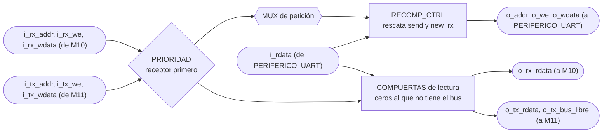
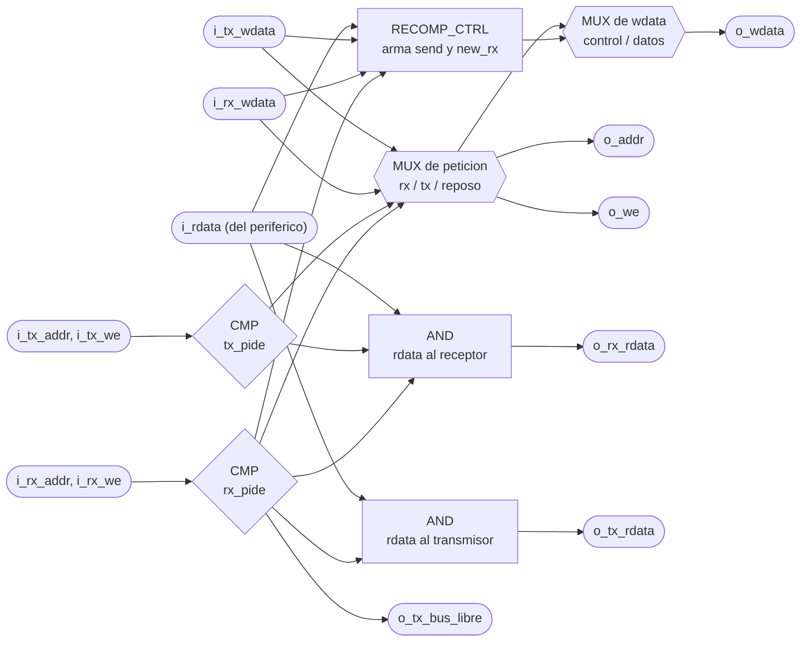

# ARBITRO_UART

> Viene del Proyecto 2 y en el Proyecto 3 no se instancia. Allá repartía el bus de `PERIFERICO_UART` entre dos maestros, `M10_Receptor-UART` y `M11_Transmisor-UART`. Acá el único maestro es el CPU, así que no hay nada que arbitrar. El periférico que sí se usa está en `PERIFERICO_UART.md`. El mapa de registros que usa esta documentación (control en `2'b10`) tampoco es el del Proyecto 3.

## a) Nombre del módulo

ARBITRO_UART

## b) Diagrama modular

## c) Objetivo del módulo

Multiplexa el bus de 32 bits entre los dos maestros que quieren hablarle a `PERIFERICO_UART`,
`M10_Receptor-UART` y `M11_Transmisor-UART`. El periférico tiene un solo puerto y el enunciado
supone un único bloque instanciándolo, así que partir el UART en receptor y transmisor
independientes obliga a poner algo en el medio.

Aparte del multiplexado hace un segundo trabajo que no es obvio, recompone las escrituras al
registro de control para que un maestro no le borre el bit al otro.

---

## d) Entradas

- `i_rx_addr[1:0]`, `i_rx_we`, `i_rx_wdata[WIDTH-1:0]`: petición de `M10_Receptor-UART`.
- `i_tx_addr[1:0]`, `i_tx_we`, `i_tx_wdata[WIDTH-1:0]`: petición de `M11_Transmisor-UART`.
- `i_rdata[WIDTH-1:0]`: lo que devuelve `PERIFERICO_UART` en la dirección que se le está poniendo.

No tiene `clk` ni `rst`. Es combinacional puro, no guarda estado. Está parametrizado con
`WIDTH = 32`, el ancho del bus.

---

## e) Salidas

- `o_addr[1:0]`, `o_we`, `o_wdata[WIDTH-1:0]`: petición ganadora, hacia `PERIFERICO_UART`.
- `o_rx_rdata[WIDTH-1:0]`: lo que ve `M10_Receptor-UART` de vuelta.
- `o_tx_rdata[WIDTH-1:0]`: lo que ve `M11_Transmisor-UART` de vuelta.
- `o_tx_bus_libre`: le avisa a `M11_Transmisor-UART` que este ciclo el bus es suyo.

---

## f) Relación con otros módulos

Se sienta entre los dos maestros y el periférico, y los tres lo ven como si fueran ellos los que
hablan directo. `M10_Receptor-UART` ni siquiera sabe que existe, porque nunca pierde el bus y su
lectura siempre es la de verdad. `M11_Transmisor-UART` sí lo sabe, y para eso tiene la entrada
`i_bus_libre`, que es la única señal que este módulo le agregó al diseño original de M11.

No le reporta nada a `M13_FSM` ni participa en la lógica del juego. Es infraestructura de bus.

En el diagrama de tercer nivel va dentro de `CONTROL_JUEGO`, entre M10/M11 y `PERIFERICO_UART`.
La primera versión de ese diagrama no lo tenía porque se dibujó cuando el UART todavía se pensaba
como un solo maestro.

---

## g) Explicación de funcionamiento

En cada ciclo el árbitro mira si alguno de los dos maestros está pidiendo el bus de verdad. Pedir
el bus significa querer una dirección que no sea la del control, o querer escribir. Sondear el
registro de control sin escribir no cuenta, porque los dos pueden leerlo a la vez sin estorbarse,
que es justo lo que hacen la mayor parte del tiempo.

Si el receptor pide, gana el receptor. Siempre, sin excepción y sin turnos. Si no pide y el
transmisor sí, gana el transmisor. Si no pide ninguno, el árbitro deja la dirección apuntando al
control, que es lo que los dos quieren leer cuando están sondeando.

Al que pierde no se le devuelve el `rdata` del ganador, se le devuelven ceros. Eso es importante
y es la parte que más fácil se hace mal.

---

## h) Diseño

### Tabla de decisión

| `rx_pide` | `tx_pide` | Quién maneja `o_addr`/`o_we`/`o_wdata` | `o_rx_rdata` | `o_tx_rdata` | `o_tx_bus_libre` |
| --------- | --------- | -------------------------------------- | ------------ | ------------ | ------------- |
| `1`       | `x`       | receptor                                | `i_rdata`    | ceros        | `0`           |
| `0`       | `1`       | transmisor                              | ceros        | `i_rdata`    | `1`           |
| `0`       | `0`       | nadie, `o_addr` al control y `o_we = 0` | `i_rdata`    | `i_rdata`    | `1`           |

Donde `rx_pide = (i_rx_addr != CONTROL) OR i_rx_we` y lo mismo para el transmisor.

La fila del medio explica por qué al perdedor se le mandan ceros. El receptor pasa la vida
leyendo el registro de control y mirando el bit 1 para ver si hay byte nuevo. Si mientras tanto el
transmisor tiene el bus puesto en el registro de datos de transmisión, el receptor estaría mirando
el bit 1 de un byte cualquiera de una trama saliente y creería que le llegó una letra. Con ceros
ve `new_rx = 0`, que es la respuesta segura. Del otro lado pasa lo mismo con `send`, el
transmisor leería un `send` falso y creería que el periférico sigue ocupado, o peor, que ya
terminó.

En la última fila los dos pueden leer el mismo `i_rdata` sin problema, porque la dirección está
en el control y eso es exactamente lo que los dos querían leer.

### Recomposición de la escritura al control

Este es el problema que motivó el módulo. El registro de control tiene un bit de cada maestro,
`send` del transmisor en el bit 0 y `new_rx` del receptor en el bit 1, y el enunciado define
`new_rx` como RW, o sea que una escritura lo deja en lo que diga el bit. No es W1C, así que
escribir cero lo borra.

El receptor escribe `32'h0` para bajar `new_rx`, y de paso pone `send` en cero, lo que aborta una
transmisión en curso. El transmisor escribe `32'h1` para levantar `send`, y de paso pone `new_rx`
en cero, o sea que cada trama que manda la FPGA se traga un byte recibido que estuviera
esperando. Con un juego donde la PC escribe letras mientras la FPGA responde, los dos casos
pasan seguido.

Se propuso definir `new_rx` como W1C, pero eso contradice la línea 252 del enunciado, así
que se descartó. Lo que hace el árbitro es rearmar la palabra que se escribe, tomando el bit del
maestro que ganó y rescatando el del otro de la lectura viva del periférico:

| Bit | Si gana el receptor      | Si gana el transmisor   |
| --- | ------------------------ | ----------------------- |
| 0, `send`   | `i_rdata[0]`, el valor que ya tenía | `i_tx_wdata[0]`, lo que pide el transmisor |
| 1, `new_rx` | `i_rx_wdata[1]`, lo que pide el receptor | `i_rdata[1]`, el valor que ya tenía |

Esto funciona sin carrera porque el `rdata_o` del periférico es combinacional respecto a `addr_i`
y no depende de `wdata_i`. En el mismo ciclo en que se está componiendo la escritura, la lectura
que llega ya es la del registro de control, así que el bit rescatado es el valor actual y no uno
viejo. Si el periférico registrara la lectura, esta técnica no serviría y habría que meter un
ciclo de espera.

La recomposición solo aplica cuando la dirección ganadora es la del control. Para los dos
registros de datos el `wdata` pasa tal cual.

### Por qué prioridad fija y no turnos

El receptor no sabe esperar. Su FSM avanza pase lo que pase, y si pierde el bus en el ciclo en
que iba a leer el dato, lee cualquier cosa. Hacerlo capaz de esperar significaba agregarle una
entrada y condicionar sus tres transiciones.

El transmisor sí sabe esperar, ya venía con un estado `WAIT` y con banderas `pendiente` para no
perder eventos que lleguen mientras está ocupado. Agregarle `i_bus_libre` fue barato, solo
condicionar las transiciones que ya existían.

El costo teórico de la prioridad fija es que el transmisor se muera de hambre, y en este sistema
no puede pasar. El receptor toma el bus dos ciclos por cada byte que le llega, y a 115200 baudios
un byte tarda 8680 ciclos de reloj. Aunque la PC mandara letras de forma continua, el receptor
ocuparía el bus el 0.02% del tiempo. La probabilidad de que el transmisor pierda dos ciclos
seguidos es despreciable, y aunque los perdiera, reintenta el ciclo siguiente sin perder nada.

### Latches

Todo el módulo es `always_comb` y `assign`. El `always_comb` asigna las tres salidas en las tres
ramas del if, sin caminos sin cubrir. `make synth SYNTH_TOP=arbitro_uart` pasa sin
`Latch inferred` en el log.

---

## i) Diagrama esquemático detallado del diseño

---

## j) Diagrama completo de conexiones del diseño

No tiene puertos físicos, ni reloj, ni reset. Vive entero dentro de `CONTROL_JUEGO`.

Conexiones en `src/design/top.sv`, instancia `u_arbitro_uart`:

- `i_rx_addr`, `i_rx_we`, `i_rx_wdata`, desde `M10_Receptor-UART`.
- `o_rx_rdata`, hacia `M10_Receptor-UART`.
- `i_tx_addr`, `i_tx_we`, `i_tx_wdata`, desde `M11_Transmisor-UART`.
- `o_tx_rdata` y `o_tx_bus_libre`, hacia `M11_Transmisor-UART`.
- `o_addr`, `o_we`, `o_wdata`, hacia `PERIFERICO_UART`.
- `i_rdata`, desde `PERIFERICO_UART`.

Igual que en los demás módulos, el diagrama por chips que pide el método no aplica a un diseño
que se sintetiza dentro de una sola FPGA, y esta lista de puertos es el reemplazo propuesto.
