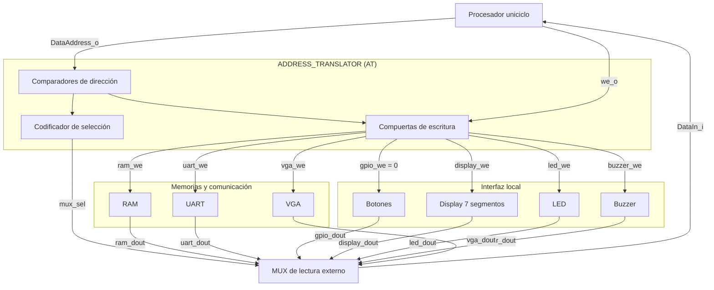

# Nivel 4 — Address Translator (AT)

El AT recibe únicamente `DataAddress_o` y `we_o` del procesador RISC-V uniciclo. Sus salidas son las habilitaciones de escritura individuales para RAM y periféricos, y `mux_sel`, que controla un **MUX de lectura externo**. El AT no recibe datos de escritura ni datos de lectura y tampoco contiene el MUX.

## Diagrama de cuarto nivel

Cada destino tiene una entrada de escritura independiente y un camino de lectura hacia el MUX. En el caso de botones, `gpio_we=0` representa una entrada permanentemente deshabilitada: su registro solo se lee. Los nombres `*_dout` identifican los datos vistos por el MUX, aunque los puertos reales de cada módulo pueden llamarse `rdata_o`. 
<!--El puerto de lectura de VGA queda propuesto para este esquema y debe acordarse cuando se integre su implementación.-->

`DataAddress_o` y `DataOut_o` también se distribuyen desde el procesador a las memorias y periféricos por conexiones externas al AT; se omiten esas flechas del diagrama para que el camino de control y lectura permanezca legible. La adaptación de dirección para RAM, UART o VGA se realiza en esas conexiones o en las interfaces de los destinos. La ROM de programa usa su propio bus de instrucciones y no participa en este diagrama.

## Interfaz y mapa de direcciones

| Señal | Dirección | Función |
| --- | --- | --- |
| `DataAddress_o[31:0]` | Procesador → AT | Dirección que se compara con el mapa. |
| `we_o` | Procesador → AT | Solicitud de escritura del procesador. |
| `ram_we`, `uart_we`, `gpio_we`, `display_we`, `led_we`, `buzzer_we`, `vga_we` | AT → destino respectivo | Habilitaciones independientes; `gpio_we` permanece en cero. |
| `mux_sel[2:0]` | AT → MUX externo | Escoge el dato de lectura que llegará a `DataIn_i`. |

| Destino | Dirección del instructivo | Identificación por el AT |
| --- | --- | --- |
| ROM de programa | `0x0000_0000`–`0x0000_1FFF` | Bus de instrucciones independiente; **no** se conecta al AT. |
| RAM de datos | `0x0000_2000`–`0x0000_2FFF` | `sel_ram` identifica la ventana. |
| UART | `0x0001_0040`, `0x0001_0044`, `0x0001_0048` | `sel_uart` identifica los tres registros asignados. |
| Entradas del jugador 1 | `0x0001_0120` | `sel_gpio`; lectura del registro de botones. |
| Display de 7 segmentos | `0x0001_0130` | `sel_7seg`; registro de datos. |
| LED de estado | `0x0001_0138` | `sel_led`; registro de datos. |
| Buzzer | `0x0001_0140` | `sel_buzzer`; registro de control. |
| Memoria de video VGA | `0x0001_1000`–`0x0001_17FF` | `sel_vga` identifica la ventana de video. |

El espacio `0x0001_0000`–`0x0001_FFFF` corresponde a periféricos, pero **no todas sus direcciones tienen un registro asignado**. `0x0001_004C` cae junto a los registros UART, pero no corresponde a ninguno; por ello el AT no habilita su escritura y selecciona la entrada de lectura sin asignar. Fuera del AT, la interfaz UART puede recibir `addr_i[1:0] = DataAddress_o[3:2]`: `00` selecciona control/estado, `01` TX y `10` RX. De forma similar, las interfaces de RAM y VGA obtienen su índice local de la dirección, sin que el AT lo calcule. La organización interna VGA queda pendiente del diseño de ese periférico.

## Tabla de verdad del Address Translator

La tabla especifica las salidas del **AT**, no los datos que entrega el MUX. Cada rango incluye solamente direcciones alineadas a palabras de 32 bits. Se propone esta codificación de `mux_sel[2:0]`: `000` RAM, `001` UART, `010` botones, `011` display, `100` LED, `101` buzzer, `110` VGA y `111` sin destino. `we_o=0` corresponde al camino de lectura; cuando `we_o=1`, el MUX conserva su selección, aunque una instrucción `sw` no utiliza `DataIn_i`.

| `we_o` | `DataAddress_o` | `ram_we` | `uart_we` | `gpio_we` | `display_we` | `led_we` | `buzzer_we` | `vga_we` | `mux_sel` |
| :---: | --- | :---: | :---: | :---: | :---: | :---: | :---: | :---: | :---: |
| 0 | `0x0000_2000`–`0x0000_2FFF` | 0 | 0 | 0 | 0 | 0 | 0 | 0 | `000` |
| 1 | `0x0000_2000`–`0x0000_2FFF` | 1 | 0 | 0 | 0 | 0 | 0 | 0 | `000` |
| 0 | `0x0001_0040`, `0x0001_0044`, `0x0001_0048` | 0 | 0 | 0 | 0 | 0 | 0 | 0 | `001` |
| 1 | `0x0001_0040`, `0x0001_0044`, `0x0001_0048` | 0 | 1 | 0 | 0 | 0 | 0 | 0 | `001` |
| 0 | `0x0001_0120` | 0 | 0 | 0 | 0 | 0 | 0 | 0 | `010` |
| 1 | `0x0001_0120` | 0 | 0 | 0 | 0 | 0 | 0 | 0 | `010` |
| 0 | `0x0001_0130` | 0 | 0 | 0 | 0 | 0 | 0 | 0 | `011` |
| 1 | `0x0001_0130` | 0 | 0 | 0 | 1 | 0 | 0 | 0 | `011` |
| 0 | `0x0001_0138` | 0 | 0 | 0 | 0 | 0 | 0 | 0 | `100` |
| 1 | `0x0001_0138` | 0 | 0 | 0 | 0 | 1 | 0 | 0 | `100` |
| 0 | `0x0001_0140` | 0 | 0 | 0 | 0 | 0 | 0 | 0 | `101` |
| 1 | `0x0001_0140` | 0 | 0 | 0 | 0 | 0 | 1 | 0 | `101` |
| 0 | `0x0001_1000`–`0x0001_17FF` | 0 | 0 | 0 | 0 | 0 | 0 | 0 | `110` |
| 1 | `0x0001_1000`–`0x0001_17FF` | 0 | 0 | 0 | 0 | 0 | 0 | 1 | `110` |
| 0 | Otras direcciones | 0 | 0 | 0 | 0 | 0 | 0 | 0 | `111` |
| 1 | Otras direcciones | 0 | 0 | 0 | 0 | 0 | 0 | 0 | `111` |

«Otras direcciones» incluye `0x0001_004C`, direcciones no alineadas y direcciones no asignadas del espacio de periféricos. Si se presenta una dirección de la ROM en el bus de datos, tampoco activa ningún destino del AT; la lectura normal de instrucciones sigue por el bus independiente de la ROM.

## Salidas de control y MUX externo

Cada habilitación de escritura es `we_o && sel_destino`: por ejemplo, `ram_we = we_o && sel_ram` y `uart_we = we_o && sel_uart`. Se generan habilitaciones independientes equivalentes para display, LED, buzzer y VGA; la salida `gpio_we` se fija en cero porque los botones son de solo lectura. Las selecciones de destino dependen únicamente de `DataAddress_o`, por lo que `mux_sel` identifica el mismo destino tanto con `we_o=0` como con `we_o=1`. `DataOut_o` se distribuye por fuera del AT; solo el destino habilitado captura el dato.

`mux_sel[2:0]` identifica una de las entradas del **MUX externo** conforme a la tabla de verdad. La codificación se propone para la integración y debe utilizarse igual en el AT y el MUX; el instructivo fija las direcciones, pero no esos tres bits. Para una dirección sin destino, o no alineada, el AT desactiva todas las escrituras y selecciona `111`. Se propone que esa entrada entregue `32'h0000_0000`. Este comportamiento para accesos inválidos es una **decisión de diseño**, no una función especificada por el instructivo.

El AT es lógica combinacional; el MUX externo entrega el dato seleccionado a `DataIn_i`. Como el procesador es uniciclo, la ruta de lectura de RAM y periféricos debe entregar el dato a tiempo durante una instrucción `lw`; la temporización de RAM y VGA se comprobará al integrar sus implementaciones.

Por ejemplo, un `sw` a `0x0001_0044` activa `sel_uart`, genera `uart_we=1` y coloca en `mux_sel` la selección UART; la conexión externa `addr_i=01` permite que UART escriba TX. Un `lw` de `0x0001_0120` deja todas las habilitaciones de escritura en cero y ordena al MUX leer el registro de botones. El AT únicamente genera las señales de control: el MUX externo transporta el dato y el software lo interpreta.
