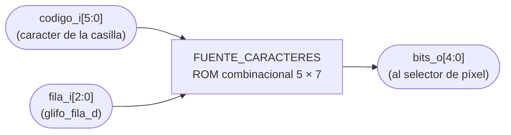
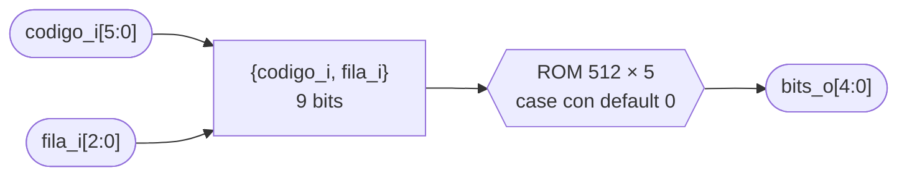

# FUENTE_CARACTERES

## a) Nombre del módulo

FUENTE_CARACTERES, módulo `fuente_caracteres` en `src/design/fuente_caracteres.sv`.

## b) Diagrama modular



## c) Objetivo del módulo

Guardar la forma de cada letra y número que el VGA puede dibujar dentro de una casilla. Con el
código de un carácter y una de sus filas, devuelve qué columnas de esa fila van encendidas. Es lo
que deja al HUD escribir títulos, letras de columna, números de fila y mensajes.

No sabe dónde está la casilla ni de qué color es. Solo guarda dibujos.

## d) Entradas

- `codigo_i[5:0]`, código del carácter en ASCII − 32, desde el registro `caracter` del puerto B de
  la memoria de video. `0` es el espacio.
- `fila_i[2:0]`, fila del glifo, de 0 (arriba) a 7. La 7 siempre sale en blanco.

## e) Salidas

- `bits_o[4:0]`, los 5 puntos de esa fila. `bits_o[4]` es la columna izquierda y `bits_o[0]` la
  derecha. Un 1 es un punto encendido.

## f) Relación con otros módulos

Solo lo instancia `PERIFERICO_VGA`, como `u_fuente`. `codigo_i` le llega del registro `caracter`
(bits `[9:4]` de la palabra de la casilla) y `fila_i` de `glifo_fila_d`, que es `v_count[4:2]`
atrasado un ciclo. `bits_o` va al multiplexor que elige el punto de la columna `glifo_col_d`, y de
ahí al selector de píxel.

El testbench `tb_periferico_vga` también lo instancia, una vez y por separado, para leer la tabla
completa al arrancar y usarla en su modelo.

## g) Explicación de funcionamiento

Es una tabla. La entrada `{codigo_i, fila_i}` selecciona una de 512 filas posibles, y cada fila
guarda 5 bits. Para el carácter `A` (código 33):

```
fila 0   01110    .###.
fila 1   10001    #...#
fila 2   10001    #...#
fila 3   10001    #...#
fila 4   11111    #####
fila 5   10001    #...#
fila 6   10001    #...#
fila 7   00000    .....
```

El periférico amplía cada punto a 4 × 4 píxeles, así que la letra mide 20 × 28 píxeles dentro de
la casilla de 32 × 32.

## h) Diseño

### Por qué ASCII − 32

Los caracteres imprimibles empiezan en el espacio, `0x20`. Restar 32 deja el espacio en 0, que
es justo el valor de una casilla sin texto, y deja el rango `0x20`–`0x5F` (espacio, signos, dígitos
y mayúsculas) en los 64 códigos de 6 bits. El programa obtiene el código de cualquier letra con la
misma cuenta, sin tabla: `'A' − 32 = 33`, `'0' − 32 = 16`.

### Qué caracteres trae

Espacio, `0` a `9`, `A` a `Z`, y `!`, `-`, `:`. Son 40 de los 64 códigos posibles. Los demás caen
en el `default` y salen en blanco. El HUD solo usa letras y dígitos.

Para agregar un carácter basta con sumar sus 7 filas al `case`, con su código. No hace falta
tocar el periférico ni el programa.

### La fuente

Es una fuente de 5 × 7 del mismo estilo que la de las pantallas de caracteres tipo HD44780. Se
eligió 5 × 7 porque, ampliada × 4, llena casi toda la casilla y se lee bien desde lejos, y porque
ampliar × 4 es tomar `h_count[4:2]` y `v_count[4:2]`, sin divisor.

### Implementación

`always_comb` con un `case` sobre `{codigo_i, fila_i}` y una rama `default` en cero, así que no
infiere latches. En la FPGA queda como lógica en LUT, de solo lectura. Corre en el dominio de
`clk_pix_i` porque su entrada sale de registros de ese dominio, y tiene un ciclo completo de 40 ns
para resolverse dentro del selector de píxel.

## i) Diagrama esquemático detallado del diseño



Es combinacional, no recibe reloj.

## j) Diagrama completo de conexiones del diseño

No tiene puertos hacia pines de la Basys 3, así que no agrega nada a `src/fpga/basys3.xdc`.

Conexiones dentro de `PERIFERICO_VGA`, instancia `u_fuente`:

- `codigo_i`, a `caracter`.
- `fila_i`, a `glifo_fila_d`.
- `bits_o`, a `glifo_bits`.

Igual que en los demás módulos, el diagrama por chips que pide el método no aplica a un diseño que se
sintetiza dentro de una sola FPGA, y esta lista de puertos es el reemplazo propuesto.

## Verificación

`tb_periferico_vga` revisa a mano que la `A` sea la de la sección g) y que el espacio no
dibuje nada. El resto de la tabla lo usa el modelo del testbench para revisar dónde y de qué color
sale cada glifo, cuadro completo por cuadro completo, con caracteres al azar en todas las casillas.
`tb_top` revisa los textos que escribe el programa leyendo el código de cada casilla.
