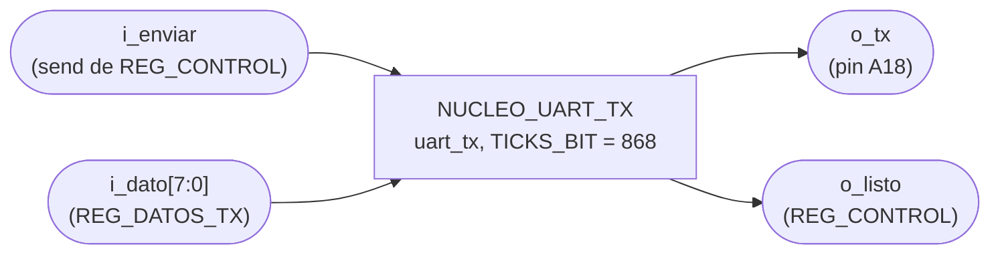
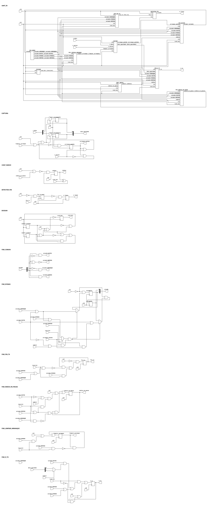

# NUCLEO_UART_TX

## a) Nombre del módulo

NUCLEO_UART_TX, módulo `uart_tx` en `src/design/uart_tx.sv`.

## b) Diagrama modular

## c) Objetivo del módulo

Sacar por la línea serial un byte en formato 8N1 a 115200 baudios. Es la transcripción a
SystemVerilog de `UART_tx.vhd`, el núcleo que da el curso, con la misma máquina de estados y los
mismos tiempos. Solo se cambió el genérico del baudaje, porque el original venía calculado para un
reloj de 16 MHz.

## d) Entradas

- `clk`, reloj del sistema de 100 MHz.
- `rst`, reset síncrono.
- `i_enviar`, orden de arranque. En este sistema llega sostenida desde el bit `send` de `REG_CONTROL`.
- `i_dato[7:0]`, byte a mandar, desde `REG_DATOS_TX`.

El módulo tiene el parámetro `TICKS_BIT = 868`, ciclos de reloj por bit.

## e) Salidas

- `o_tx`, línea serial hacia el pin A18. Reposa en uno.
- `o_listo`, pulso de un ciclo cuando termina de soltar el byte, hacia `REG_CONTROL`.

## f) Relación con otros módulos

Solo lo instancia `PERIFERICO_UART`, como `nucleo_tx`. El periférico le conecta `i_enviar` al bit
`send` de su registro de control y usa `o_listo` para bajar ese mismo bit. `i_dato` sale directo de
`REG_DATOS_TX`.

Hacia afuera `o_tx` llega sin pasar por nada más al pin `RsTx` del puente USB-UART, y de ahí a la app
de PC del Jugador 2.

## g) Explicación de funcionamiento

Un contador libre divide el reloj y da un pulso `tick_bit` cada `TICKS_BIT` ciclos. Todo lo que hace
la máquina de estados pasa en esos pulsos, así que cada estado dura un tiempo de bit.

Cuando llega `i_enviar`, el módulo atrapa la orden en `arranque_pedido` y copia `i_dato` en
`dato_guardado`. Desde ahí la fuente puede cambiar `i_dato` sin afectar el byte en curso. En el
siguiente `tick_bit` la máquina sale de reposo, y en los diez siguientes suelta el bit de arranque,
los ocho bits de datos del menos significativo al más significativo y el bit de parada. Al entrar a
parada levanta `fin_tx`, y un detector de flanco lo recorta a un pulso de un ciclo en `o_listo`.

## h) Diseño

### Divisor de baudaje

`cuenta_tick` arranca en `TICKS_BIT - 1` y baja hasta cero, y en cero da el pulso y se recarga. A
100 MHz y 115200 baudios, `100e6 / 115200 = 868.06`, se usa 868. El baudaje real queda en 115207, un
error de 0.006%. El contador no se sincroniza con la orden de arranque, así que entre `i_enviar` y el
bit de arranque pasa hasta un tiempo de bit de espera.

### Captura de la orden

| Condición                               | `arranque_pedido'` | `dato_guardado'` |
| --------------------------------------- | ------------------ | ---------------- |
| `rst` o `limpiar_arranque`              | `0`                | sin cambio       |
| `i_enviar` y `arranque_pedido = 0`      | `1`                | `i_dato`         |
| resto                                   | sin cambio         | sin cambio       |

La limpieza va primero. Eso es lo que abre la ventana muerta de abajo.

### Máquina de estados

Los cuatro estados avanzan solo cuando `tick_bit` está en alto.

| Estado     | `o_tx`                  | Acción                                               | Siguiente                               |
| ---------- | ----------------------- | ---------------------------------------------------- | --------------------------------------- |
| `REPOSO`   | `1`                     | `limpiar_arranque = 0`, `indice` en pausa            | `ARRANQUE` si `arranque_pedido`         |
| `ARRANQUE` | `0`                     | suelta `indice`                                      | `DATOS`                                 |
| `DATOS`    | `dato_guardado[indice]` | `indice` sube en cada `tick_bit`                     | `PARADA` cuando `indice = 7`            |
| `PARADA`   | `1`                     | `limpiar_arranque = 1`, `fin_tx = 1`                 | `REPOSO`                                |

`indice` es de 3 bits. El `.vhd` original lo declara de 0 a 7 y en el último tick se pasa del rango,
acá da la vuelta a cero sin romper nada porque en ese mismo tick queda otra vez en pausa.

Después del reset `limpiar_arranque` arranca en 1, así que el primer `tick_bit` en `REPOSO` es el que
habilita la captura.

### La ventana muerta

`limpiar_arranque` sube en `PARADA` y baja en el `tick_bit` siguiente, ya en `REPOSO`. Durante ese
tiempo de bit, unos 8.7 µs, `arranque_pedido` se queda en cero pase lo que pase en `i_enviar`. Un pulso
de un ciclo que caiga ahí se pierde sin ningún aviso.

Por eso `PERIFERICO_UART` no le da un pulso sino el bit `send` sostenido, que se queda alto hasta
`o_listo`. `o_listo` sale un par de ciclos después de entrar a `PARADA`, adentro de la ventana, así que
el mismo `send` no alcanza a pedir el byte dos veces.

### Tiempo entre bytes

Aunque el programa pida el siguiente byte en cuanto ve `send` en cero, la línea se queda en uno tres
tiempos de bit después de terminar el byte anterior. Uno es el bit de parada. Otro es el `tick_bit` en
`REPOSO` donde se cierra la ventana muerta. El tercero es el `tick_bit` en `REPOSO` que ve la orden y
pasa a `ARRANQUE`. Cada byte ocupa como mínimo 12 tiempos de bit, unos 104 µs, y una trama de 5 bytes
unos 520 µs.

### Latches

Todos los bloques son `always_ff` con reset síncrono, salvo `dato_guardado`, que no tiene reset porque
solo se lee después de una captura. Sintetizado con yosys dentro de `periferico_uart` no aparece ningún
`Latch inferred`.

## i) Diagrama esquemático detallado del diseño

El esquemático sale de sintetizar el `.sv` con yosys, bajarlo a AND, OR, XOR, NOT, MUX y flip-flops D
con `abc`, y dibujarlo con netlistsvg. Cada compuerta o flip-flop lleva encima el nombre de la señal que
produce cuando esa señal tiene nombre en el RTL. Las que no tienen nombre son la lógica que yosys arma
para el reset y los `if` de cada registro.

Arriba está el núcleo con un bloque por `always` del `.sv`, `DIVISOR`, `CAPTURA`, `CONT_INDICE` y
`DETECTOR_FIN`. La máquina de estados está partida por registro, `FSM_ESTADO`, `FSM_O_TX`, `FSM_FIN_TX`,
`FSM_LIMPIAR_ARRANQUE` y `FSM_INDICE_EN_PAUSA`, y la decodificación del estado que usan todos queda en
`FSM_COMUN` con salidas como `estado==DATOS`. Abajo está cada bloque abierto a compuertas.

Se genera con `TICKS_BIT = 4`, dato de 2 bits e `indice` de 1 bit. Con los valores reales cambia el
ancho de los contadores y la cantidad de copias del mux de datos, no la estructura.

`cuenta_tick` se dibuja de 2 bits. En el `.sv` está declarado como `int`, y yosys lo sintetiza como un
contador de 32 bits aunque nunca pase de 867. TODO: Revisar si se cambia a `logic [$clog2(TICKS_BIT)-1:0]`.

## j) Diagrama completo de conexiones del diseño

Conexiones dentro de `PERIFERICO_UART`:

- `clk`, a `clk_i`.
- `rst`, a `rst_i`.
- `i_enviar`, a `reg_control[BIT_SEND]`.
- `i_dato`, a `reg_tx`.
- `o_listo`, a `listo_tx`.
- `o_tx`, a `tx_o`, que en el top va al pin A18 con `IOSTANDARD LVCMOS33`.

Igual que en los demás módulos, el diagrama por chips que pide el método no aplica a un diseño que se
sintetiza dentro de una sola FPGA, y esta lista de puertos es el reemplazo propuesto.
