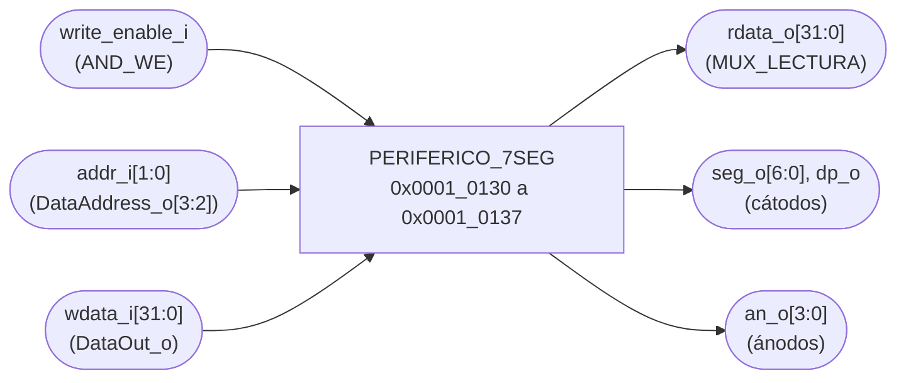
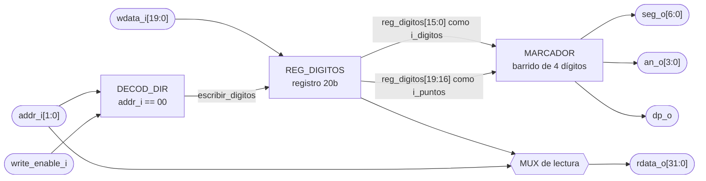

# PERIFERICO_7SEG

## a) Nombre del módulo

PERIFERICO_7SEG, módulo `periferico_7seg` en `src/design/periferico_7seg.sv`.

## b) Diagrama modular

Es el bloque `PERIFERICO_7SEG` del nivel 2 visto desde afuera. Lo que tiene adentro está en el inciso i).

## c) Objetivo del módulo

Mostrar en los cuatro dígitos del display lo que el programa escriba en su registro. La sección 4.5.4 del
enunciado sugiere dos dígitos para las partidas ganadas del Jugador 1 y dos para las del Jugador 2, de 00 a
99 cada uno, y así se usa.

El periférico no cuenta partidas. El programa lleva los dos contadores, los incrementa cuando alguien gana
y escribe los cuatro dígitos. El hardware solo guarda lo escrito y hace el barrido del display.

## d) Entradas

- `clk_i`, `rst_i`.
- `write_enable_i`, habilitación de escritura, desde `AND_WE` del bus de datos (`we_o` del CPU en AND con
  `sel_7seg`).
- `addr_i[1:0]`, dirección del registro, sale de `DataAddress_o[3:2]` del CPU.
- `wdata_i[WIDTH-1:0]`, dato a escribir, desde `DataOut_o` del CPU.

El módulo tiene los parámetros `WIDTH = 32` y `REFRESH_BITS = 18`. El segundo pasa tal cual a `marcador`.

## e) Salidas

- `rdata_o[WIDTH-1:0]`, contenido del registro apuntado por `addr_i`, hacia el multiplexor de lectura que
  llega a `DataIn_i` del CPU.
- `seg_o[6:0]`, segmentos `gfedcba`, activos en bajo.
- `an_o[3:0]`, ánodos de los cuatro dígitos, activos en bajo.
- `dp_o`, punto decimal, activo en bajo.

## f) Relación con otros módulos

Habla con un solo maestro, el CPU, a través de `BUS_DATOS`. Adentro instancia `marcador`, que solo usa este
módulo y tiene su propio doc en `marcador.md`.

La decodificación de dirección tiene una trampa. El LED de estado está en `0x0001_0138`, dentro del mismo
bloque de 16 bytes que este periférico, así que `sel_7seg` no puede salir de comparar `DataAddress_o[31:4]`
como en la UART. Tiene que comparar `DataAddress_o[31:3]` contra `0x0001_0130 >> 3`, y el periférico queda
en `0x0001_0130` a `0x0001_0137`, con `addr_i` en `2'b00` o `2'b01`. Es el mismo choque que marca el TODO de
`CMP_UART` en `nivel03.md`.

Hacia afuera los pines van al display de la Basys 3.

## g) Explicación de funcionamiento

El periférico tiene un registro, `REG_DIGITOS`. El programa escribe en `0x0001_0130` los cuatro dígitos en
BCD y, si quiere, los puntos decimales. Desde el ciclo siguiente `marcador` los muestra. El registro se puede
leer, así que para cambiar el contador de un solo jugador el programa lee, cambia sus dos nibbles y vuelve a
escribir.

Con la sugerencia del enunciado, el Jugador 1 va a la izquierda y el Jugador 2 a la derecha.

- `AN3` y `AN2`, decenas y unidades del Jugador 1, nibbles `[15:12]` y `[11:8]`.
- `AN1` y `AN0`, decenas y unidades del Jugador 2, nibbles `[7:4]` y `[3:0]`.

Con 3 partidas del Jugador 1 y 12 del Jugador 2 el programa escribe `0x0000_0312`, y en el display se lee
`03 12`.

## h) Diseño

### Mapa de registros

La tabla de la sección 4.4.3 del enunciado fija un registro de datos en `0x0001_0130`.

- `2'b00` (`0x0001_0130`), registro de dígitos, RW.
  - `[15:0]`, cuatro dígitos BCD, `[3:0]` en `AN0` y `[15:12]` en `AN3`. Un nibble de 10 a 15 apaga ese
    dígito.
  - `[19:16]`, punto decimal de cada dígito, bit 16 en `AN0`. En alto enciende el punto.
  - `[31:20]`, reservados, se leen en cero y las escrituras sobre ellos se ignoran.
- `2'b01` (`0x0001_0134`), sin asignar. Las lecturas devuelven ceros y las escrituras no tienen efecto.

`2'b10` y `2'b11` no llegan nunca, porque `0x0001_0138` y `0x0001_013C` son del LED.

### Por qué BCD y no binario

En el Proyecto 2 las ganadas llegaban en binario y el marcador las partía con `/ 10` y `% 10`. Con un solo
contador y 7 bits se aguantaba. Acá son dos contadores, y el divisor combinacional se duplicaría para algo
que el programa resuelve más barato. Incrementar un contador BCD de dos dígitos en ensamblador es sumar uno
a las unidades y, si llegan a 10, ponerlas en cero y sumar uno a las decenas. rv32i no tiene división, así
que pasar de binario a BCD en software saldría peor que llevarlo en BCD desde el principio.

### Los puntos decimales

La sección 4.3.2 pide indicar el turno activo "mediante VGA, displays de 7 segmentos y/o LED". Los puntos
permiten hacerlo sin gastar dígitos. Por ejemplo, el programa enciende el punto de `AN2` en el turno del
Jugador 1 y el de `AN0` en el del Jugador 2. Si el turno se muestra solo en el VGA, el programa deja los
bits `[19:16]` en cero y los puntos no se encienden.

### REG_DIGITOS

| Condición                                  | `reg_digitos'`   |
| ------------------------------------------ | ---------------- |
| `rst_i`                                    | `0`              |
| `write_enable_i` y `addr_i = 2'b00`        | `wdata_i[19:0]`  |
| resto                                      | sin cambio       |

Es de 20 bits. `rdata_o` vale `{12'b0, reg_digitos}` con `addr_i = 2'b00` y cero en cualquier otra
dirección.

### Reset y BTN_RST

Después de `rst_i` el registro queda en cero y el display muestra `00 00`, que es el valor correcto al
arrancar el sistema.

El enunciado pide que `BTN_RST` reinicie la partida conservando las ganadas. Si `BTN_RST` llegara a `rst_i`
de este periférico, el display se iría a `00 00` en cada reinicio de partida. `rst_i` tiene que ser el
reinicio general, y `BTN_RST` lo atiende el programa. Si al final `BTN_RST` sí llega a `rst_i`, el programa
tiene que volver a escribir el registro con los contadores que guarda en RAM después de cada reinicio.

TODO: Revisar cuál es el reinicio general del sistema, el enunciado no lo define. Es la misma pregunta abierta que en `PERIFERICO_BUZZER.md`.

### Latches

El registro va en un `always_ff` con reset síncrono. La lectura es un `always_comb` con `case` y rama
`default`.

## i) Diagrama esquemático detallado del diseño

`clk_i` y `rst_i` entran al registro y a `marcador` aunque no se dibujen.

TODO: Revisar y reemplazar por el esquemático por compuertas generado desde `periferico_7seg.sv` cuando exista, igual que en `PERIFERICO_UART.md`.

## j) Diagrama completo de conexiones del diseño

Es el único módulo con puertos hacia el display, así que acá van las restricciones de pin que tienen que
quedar en `src/fpga/basys3.xdc`, las mismas del Proyecto 2.

- `seg_o[0]` a `seg_o[6]`, a W7, W6, U8, V8, U5, V5 y U7 (`a` a `g`).
- `dp_o`, a V7.
- `an_o[0]` a `an_o[3]`, a U2, U4, V4 y W4.
- Todos con `IOSTANDARD LVCMOS33`.

Conexiones en el top.

- `clk_i`, al reloj global de 100 MHz, pin W5.
- `rst_i`, al reinicio general del sistema.
- `write_enable_i`, a la salida de `AND_WE`, en alto solo cuando `we_o` está en alto y `DataAddress_o` cae
  entre `0x0001_0130` y `0x0001_0137`.
- `addr_i[1:0]`, a `DataAddress_o[3:2]`.
- `wdata_i[31:0]`, a `DataOut_o`.
- `rdata_o[31:0]`, a `MUX_LECTURA`, que alimenta `DataIn_i` del CPU.
- `seg_o`, `an_o` y `dp_o`, a los puertos `seg`, `an` y `dp` del top.

Igual que en los demás módulos, el diagrama por chips que pide el método no aplica a un diseño que se
sintetiza dentro de una sola FPGA, y esta lista de puertos es el reemplazo propuesto.
