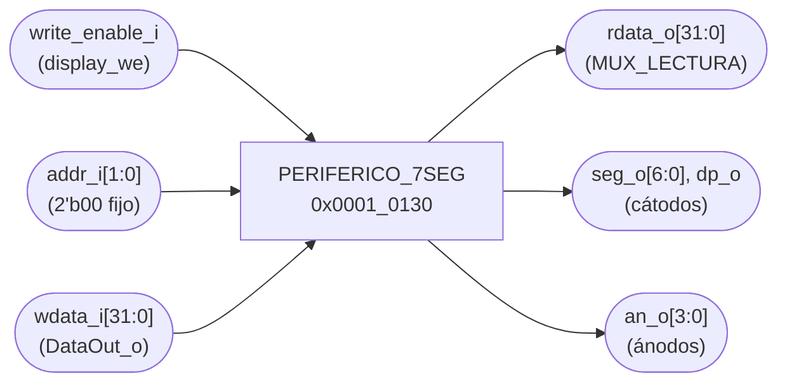

# PERIFERICO_7SEG

## a) Nombre del módulo

PERIFERICO_7SEG, módulo `periferico_7seg` en `src/design/periferico_7seg.sv`.

## b) Diagrama modular

```mermaid
flowchart LR
    IN_WE(["write_enable_i<br/>(display_we)"]) --> P7["PERIFERICO_7SEG<br/>0x0001_0130"]
    IN_ADDR(["addr_i[1:0]<br/>(2'b00 fijo)"]) --> P7
    IN_WD(["wdata_i[31:0]<br/>(DataOut_o)"]) --> P7
    P7 --> OUT_RD(["rdata_o[31:0]<br/>(MUX_LECTURA)"])
    P7 --> OUT_SEG(["seg_o[6:0], dp_o<br/>(cátodos)"])
    P7 --> OUT_AN(["an_o[3:0]<br/>(ánodos)"])
```

Es el bloque `PERIFERICO_7SEG` del nivel 2 visto desde afuera. Lo que tiene adentro está en el inciso i).

## c) Objetivo del módulo

Mostrar en los cuatro dígitos del display lo que el programa escriba en su registro. La sección 4.5.4 del
enunciado sugiere dos dígitos para las partidas ganadas del Jugador 1 y dos para las del Jugador 2, de 00 a
99 cada uno, y así se usa.

El periférico no cuenta partidas. El programa lleva los dos contadores, los incrementa cuando alguien gana
y escribe los cuatro dígitos. El hardware solo guarda lo escrito y hace el barrido del display.

## d) Entradas

- `clk_i`, `rst_i`.
- `write_enable_i`, habilitación de escritura, desde `display_we` del controlador de mapeo (`we_o` del CPU en
  AND con `sel_7seg`).
- `addr_i[1:0]`, dirección del registro, fija en `2'b00` en el top, ver el inciso f).
- `wdata_i[WIDTH-1:0]`, dato a escribir, desde `DataOut_o` del CPU.

El módulo tiene los parámetros `WIDTH = 32` y `REFRESH_BITS = 18`. El segundo pasa tal cual a `marcador`.

## e) Salidas

- `rdata_o[WIDTH-1:0]`, contenido del registro apuntado por `addr_i`, hacia el multiplexor de lectura que
  llega a `DataIn_i` del CPU.
- `seg_o[6:0]`, segmentos `gfedcba`, activos en bajo.
- `an_o[3:0]`, ánodos de los cuatro dígitos, activos en bajo.
- `dp_o`, punto decimal, activo en bajo.

## f) Relación con otros módulos

Habla con un solo maestro, el CPU, a través de `BUS_DATOS`. Adentro instancia `marcador`, que solo usa este
módulo y tiene su propio doc en `marcador.md`.

La dirección la decodifica el Address Translator del controlador de mapeo, detallado en
`Address_Translator.md`. `sel_7seg` sale de comparar la dirección completa contra `0x0001_0130`, así que el
LED en `0x0001_0138` no se cruza con este periférico aunque los dos caigan en el mismo bloque de 16 bytes.
Como el AT solo selecciona esa palabra, el periférico siempre se accede en su offset `0x00` y en el top
`addr_i` va fijo en `2'b00`, igual que en las entradas, el LED y el buzzer.

Hacia afuera los pines van al display de la Basys 3.

## g) Explicación de funcionamiento

El periférico tiene un registro, `REG_DIGITOS`. El programa escribe en `0x0001_0130` los cuatro dígitos en
BCD y, si quiere, los puntos decimales. Desde el ciclo siguiente `marcador` los muestra. El registro se puede
leer, así que para cambiar el contador de un solo jugador el programa lee, cambia sus dos nibbles y vuelve a
escribir.

Con la sugerencia del enunciado, el Jugador 1 va a la izquierda y el Jugador 2 a la derecha.

- `AN3` y `AN2`, decenas y unidades del Jugador 1, nibbles `[15:12]` y `[11:8]`.
- `AN1` y `AN0`, decenas y unidades del Jugador 2, nibbles `[7:4]` y `[3:0]`.

Con 3 partidas del Jugador 1 y 12 del Jugador 2 el programa escribe `0x0000_0312`, y en el display se lee
`03 12`.

## h) Diseño

### Mapa de registros

La tabla de la sección 4.4.3 del enunciado fija un registro de datos en `0x0001_0130`.

- `2'b00` (`0x0001_0130`), registro de dígitos, RW.
  - `[15:0]`, cuatro dígitos BCD, `[3:0]` en `AN0` y `[15:12]` en `AN3`. Un nibble de 10 a 15 apaga ese
    dígito.
  - `[19:16]`, punto decimal de cada dígito, bit 16 en `AN0`. En alto enciende el punto.
  - `[31:20]`, reservados, se leen en cero y las escrituras sobre ellos se ignoran.
`0x0001_0134` no es de este periférico. El AT la trata como dirección sin destino, así que ninguna escritura
la habilita y una lectura devuelve cero desde `MUX_LECTURA`. Con `addr_i` fijo, `2'b01` a `2'b11` no llegan
nunca, y el `case` de lectura igual los cubre con cero.

### Por qué BCD y no binario

En el Proyecto 2 las ganadas llegaban en binario y el marcador las partía con `/ 10` y `% 10`. Con un solo
contador y 7 bits se aguantaba. Acá son dos contadores, y el divisor combinacional se duplicaría para algo
que el programa resuelve más barato. Incrementar un contador BCD de dos dígitos en ensamblador es sumar uno
a las unidades y, si llegan a 10, ponerlas en cero y sumar uno a las decenas. rv32i no tiene división, así
que pasar de binario a BCD en software saldría peor que llevarlo en BCD desde el principio.

### Los puntos decimales

La sección 4.3.2 pide indicar el turno activo "mediante VGA, displays de 7 segmentos y/o LED". Los puntos
permiten hacerlo sin gastar dígitos. Por ejemplo, el programa enciende el punto de `AN2` en el turno del
Jugador 1 y el de `AN0` en el del Jugador 2. Si el turno se muestra solo en el VGA, el programa deja los
bits `[19:16]` en cero y los puntos no se encienden.

### REG_DIGITOS

| Condición                                  | `reg_digitos'`   |
| ------------------------------------------ | ---------------- |
| `rst_i`                                    | `0`              |
| `write_enable_i` y `addr_i = 2'b00`        | `wdata_i[19:0]`  |
| resto                                      | sin cambio       |

Es de 20 bits. `rdata_o` vale `{12'b0, reg_digitos}` con `addr_i = 2'b00` y cero en cualquier otra
dirección.

### Reset y BTN_RST

Después de `rst_i` el registro queda en cero y el display muestra `00 00`, que es el valor correcto al
arrancar el sistema.

El enunciado pide que `BTN_RST` reinicie la partida conservando las ganadas. Si `BTN_RST` llegara a `rst_i`
de este periférico, el display se iría a `00 00` en cada reinicio de partida. Por eso `rst_i` es
solo el reinicio general, que es lo único que pone el marcador en cero, y `BTN_RST` lo atiende el programa
sin tocar este registro.

### Latches

El registro va en un `always_ff` con reset síncrono. La lectura es un `always_comb` con `case` y rama
`default`.

## i) Diagrama esquemático detallado del diseño

El esquemático sale de sintetizar el `.sv` con yosys, bajarlo a AND, OR, XOR, NOT, MUX y flip-flops D
con `abc`, y dibujarlo con netlistsvg. Cada compuerta o flip-flop lleva encima el nombre de la señal que
produce cuando esa señal tiene nombre en el RTL. Las que no tienen nombre son la lógica que yosys arma
para el reset y los `if` de cada registro.

Arriba está el periférico con `marcador` y los tres bloques del nivel 3 como cajas. Cada bloque sale
del `.sv`, `DECOD_DIR` de la línea 32, `REG_DIGITOS` de 35 a 38 y `MUX_RD` de 40 a 45, y abajo está
cada uno abierto a compuertas. `marcador` se abre en su propio doc.

Se genera con el registro de 6 bits y el bus de 8 en vez de 20 y 32, un nibble de dígito y dos puntos.
Con los 20 bits el registro solo ya ocupa varias páginas. Cada bit repite el mismo flip-flop con su
MUX de carga, así que con el ancho real cambia la cantidad de copias y no la estructura.

## j) Diagrama completo de conexiones del diseño

Es el único módulo con puertos hacia el display, así que acá van las restricciones de pin que tienen que
quedar en `src/fpga/basys3.xdc`, las mismas del Proyecto 2.

- `seg_o[0]` a `seg_o[6]`, a W7, W6, U8, V8, U5, V5 y U7 (`a` a `g`).
- `dp_o`, a V7.
- `an_o[0]` a `an_o[3]`, a U2, U4, V4 y W4.
- Todos con `IOSTANDARD LVCMOS33`.

Conexiones en el top.

- `clk_i`, al reloj global de 100 MHz, pin W5.
- `rst_i`, al reinicio general del sistema.
- `write_enable_i`, a `display_we` del controlador de mapeo, en alto solo cuando `we_o` está en alto y
  `DataAddress_o` es `0x0001_0130`.
- `addr_i[1:0]`, a `2'b00`.
- `wdata_i[31:0]`, a `DataOut_o`.
- `rdata_o[31:0]`, a `MUX_LECTURA`, que alimenta `DataIn_i` del CPU. En `Address_Translator.md` es la entrada `display_dout`, que el AT elige con `mux_sel = 011`.
- `seg_o`, `an_o` y `dp_o`, a los puertos `seg`, `an` y `dp` del top.

Igual que en los demás módulos, el diagrama por chips que pide el método no aplica a un diseño que se
sintetiza dentro de una sola FPGA, y esta lista de puertos es el reemplazo propuesto.
