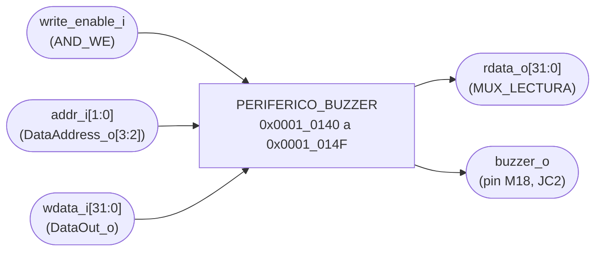
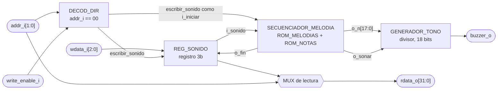

# PERIFERICO_BUZZER

## a) Nombre del módulo

PERIFERICO_BUZZER, módulo `periferico_buzzer` en `src/design/periferico_buzzer.sv`.

## b) Diagrama modular



Es el bloque `PERIFERICO_BUZZER` del nivel 2 visto desde afuera. Lo que tiene adentro está en el
inciso i).

## c) Objetivo del módulo

Tocar en el buzzer la melodía que el programa le pida con un solo `sw`. Las cinco melodías de la
sección 4.5.4 del enunciado, impacto, fallo, hundido, colocación inválida y victoria, viven en el
periférico, y el programa solo escoge cuál.

Es el sucesor del `generador_tono` del Proyecto 2. Allá el módulo miraba la FSM del juego para saber
cuándo sonar. Acá no ve nada del juego, espera que el programa le escriba un código y lo reproduce.
Decidir que un disparo fue impacto, o que el impacto hundió un barco, es trabajo del ensamblador.

## d) Entradas

- `clk_i`, `rst_i`.
- `write_enable_i`, habilitación de escritura, desde `AND_WE` del bus de datos (`we_o` del CPU en AND
  con `sel_buzzer`).
- `addr_i[1:0]`, dirección del registro, sale de `DataAddress_o[3:2]` del CPU.
- `wdata_i[WIDTH-1:0]`, dato a escribir, desde `DataOut_o` del CPU.

El módulo tiene los parámetros `WIDTH = 32`, `CLK_FREQ_HZ = 100_000_000` y `UNIDAD_MS = 50`. Los dos
últimos pasan tal cual a `SECUENCIADOR_MELODIA`.

## e) Salidas

- `rdata_o[WIDTH-1:0]`, contenido del registro apuntado por `addr_i`, hacia el multiplexor de lectura
  que llega a `DataIn_i` del CPU.
- `buzzer_o`, onda cuadrada hacia el buzzer. Es el único cable que sale de la FPGA para esto.

## f) Relación con otros módulos

Igual que la UART, habla con un solo maestro, el CPU, a través de `BUS_DATOS`. El decodificador
compara `DataAddress_o[31:4]` contra `0x0001014` para sacar `sel_buzzer`. En ese bloque de 16 bytes no
hay ningún otro periférico, así que el buzzer se decodifica igual que la UART, sin el problema que
tienen los displays y el LED en `0x0001_0130` y `0x0001_0138`.

Adentro instancia `SECUENCIADOR_MELODIA` y `GENERADOR_TONO`, que solo usa este módulo y tienen su
propio doc en `secuenciador_melodia.md` y `generador_tono.md`.

## g) Explicación de funcionamiento

El periférico tiene un solo registro, `REG_SONIDO`, de 3 bits. Cuando el programa lo escribe, el
registro guarda el código y el secuenciador arranca esa melodía desde la primera nota. Mientras suena
el registro conserva el código, y cuando la melodía termina vuelve solo a `000`.

Desde el programa es un `sw` y listo. El CPU no espera a que la melodía termine, sigue con el lazo
principal y el periférico se encarga de los tiempos. Si el programa quiere saber si el buzzer ya se
calló, por ejemplo para no cortar la victoria, lee `0x0001_0140` y compara con cero.

```asm
    addi t0, x0, 0x101
    slli t0, t0, 8
    addi t0, t0, 0x40      # t0 = 0x0001_0140, sin lui
    addi t1, x0, 3         # hundido
    sw   t1, 0(t0)
```

Una escritura mientras otra melodía suena la corta y arranca la nueva. Escribir `000` corta y deja
silencio.

## h) Diseño

### Mapa de registros

La tabla de la sección 4.4.3 del enunciado fija un solo registro de control en `0x0001_0140`.

- `2'b00` (`0x0001_0140`), registro de sonido. Bits `[2:0]` son el código de la melodía (RW, el
  hardware lo limpia al terminar), `[31:3]` son reservados, se leen en cero y las escrituras sobre
  ellos se ignoran.
- `2'b01`, `2'b10` y `2'b11` (`0x0001_0144` a `0x0001_014C`), sin asignar. Las lecturas devuelven
  ceros y las escrituras no tienen efecto.

Los códigos están en `secuenciador_melodia.md`. `000` es silencio, `001` a `101` son las cinco
melodías, y `110` y `111` se comportan como silencio.

Se usa un código binario y no un bit por melodía porque nunca suenan dos a la vez. Con un bit por
melodía habría que definir qué pasa si el programa levanta dos, y eso ya sería una regla de
prioridad metida en el periférico.

### REG_SONIDO

| Condición                              | `reg_sonido'`  |
| -------------------------------------- | -------------- |
| `rst_i`                                | `000`          |
| `escribir_sonido`                      | `wdata_i[2:0]` |
| `o_fin` del secuenciador               | `000`          |
| resto                                  | sin cambio     |

`escribir_sonido` es `write_enable_i && addr_i == 2'b00`, y es también el `i_iniciar` del
secuenciador. La escritura va antes que la limpieza. En reposo `o_fin` está siempre en alto, porque
la fila `000` de la ROM es fin en todos sus pasos, y si la limpieza ganara el programa nunca podría
arrancar una melodía.

### Lectura

`rdata_o` vale `{29'b0, reg_sonido}` con `addr_i = 2'b00` y cero en las otras tres direcciones. Es
combinacional, igual que en la UART, así que un `lw` tiene el dato en el mismo ciclo.

### Reset

`rst_i` es síncrono, igual que en la UART, y deja el registro en `000` y el secuenciador en reposo.
Si `BTN_RST` termina siendo un reinicio por software, el programa tiene que escribir `000` al buzzer
como parte de su rutina de reinicio para cortar una melodía que venga sonando.

TODO: Revisar si `BTN_RST` llega a `rst_i` de los periféricos o si lo atiende el programa.

### Latches

El registro va en un `always_ff` con reset síncrono. La lectura es un `always_comb` con `case` y rama
`default`, así que las cuatro direcciones quedan cubiertas.

## i) Diagrama esquemático detallado del diseño



`clk_i` y `rst_i` entran al registro y a los dos submódulos aunque no se dibujen.

El método pide este esquemático por compuertas. Acá se deja en registros, comparadores y un
multiplexor, igual que en `PERIFERICO_UART.md`, porque cada bloque sale directo de una línea del `.sv`
y yosys es el que lo baja a LUTs. Los dos submódulos se abren en sus propios docs.

## j) Diagrama completo de conexiones del diseño

Es el único módulo con puerto hacia el buzzer, así que acá va la restricción de pin que tiene que
quedar en `src/fpga/basys3.xdc`.

- `buzzer_o`, al pin M18, JC2 del Pmod JC, el mismo del Proyecto 2.
- `IOSTANDARD LVCMOS33`.

Conexiones en el top.

- `clk_i`, al reloj global de 100 MHz, pin W5.
- `rst_i`, al reset del sistema.
- `write_enable_i`, a la salida de `AND_WE`, en alto solo cuando `we_o` está en alto y
  `DataAddress_o` cae entre `0x0001_0140` y `0x0001_014F`.
- `addr_i[1:0]`, a `DataAddress_o[3:2]`.
- `wdata_i[31:0]`, a `DataOut_o`.
- `rdata_o[31:0]`, a `MUX_LECTURA`, que alimenta `DataIn_i` del CPU.
- `buzzer_o`, al puerto `buzzer` del top.

Igual que en los demás módulos, el diagrama por chips que pide el método no aplica a un diseño que se
sintetiza dentro de una sola FPGA, y esta lista de puertos es el reemplazo propuesto.
