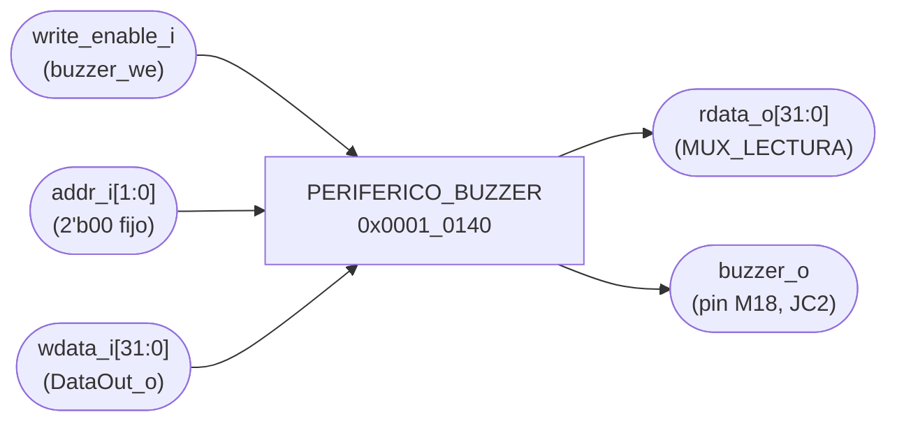
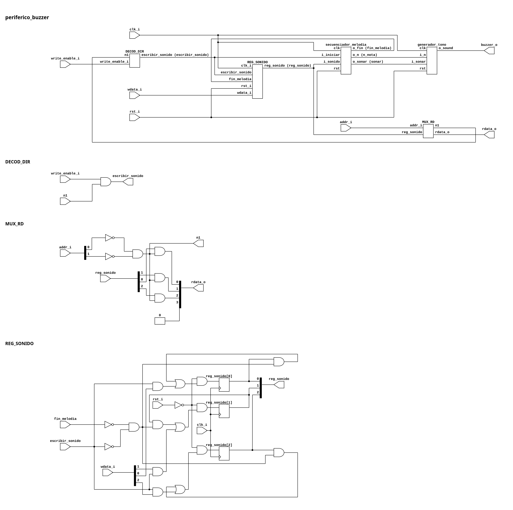

# PERIFERICO_BUZZER

## a) Nombre del módulo

PERIFERICO_BUZZER, módulo `periferico_buzzer` en `src/design/periferico_buzzer.sv`.

## b) Diagrama modular


```mermaid
flowchart LR
    IN_WE(["write_enable_i<br/>(buzzer_we)"]) --> PBUZ["PERIFERICO_BUZZER<br/>0x0001_0140"]
    IN_ADDR(["addr_i[1:0]<br/>(2'b00 fijo)"]) --> PBUZ
    IN_WD(["wdata_i[31:0]<br/>(DataOut_o)"]) --> PBUZ
    PBUZ --> OUT_RD(["rdata_o[31:0]<br/>(MUX_LECTURA)"])
    PBUZ --> OUT_BUZ(["buzzer_o<br/>(pin M18, JC2)"])
```

Es el bloque `PERIFERICO_BUZZER` del nivel 2 visto desde afuera. Lo que tiene adentro está en el
inciso i).

## c) Objetivo del módulo

Tocar en el buzzer la melodía que el programa le pida con un solo `sw`. Las cinco melodías de la
sección 4.5.4 del enunciado, impacto, fallo, hundido, colocación inválida y victoria, viven en el
periférico, y el programa solo escoge cuál.

Es el sucesor del `generador_tono` del Proyecto 2. Allá el módulo miraba la FSM del juego para saber
cuándo sonar. Acá no ve nada del juego, espera que el programa le escriba un código y lo reproduce.
Decidir que un disparo fue impacto, o que el impacto hundió un barco, es trabajo del ensamblador.

## d) Entradas

- `clk_i`, `rst_i`.
- `write_enable_i`, habilitación de escritura, desde `buzzer_we` del controlador de mapeo (`we_o` del
  CPU en AND con `sel_buzzer`).
- `addr_i[1:0]`, dirección del registro, fija en `2'b00` en el top, ver el inciso f).
- `wdata_i[WIDTH-1:0]`, dato a escribir, desde `DataOut_o` del CPU.

El módulo tiene los parámetros `WIDTH = 32`, `CLK_FREQ_HZ = 100_000_000` y `UNIDAD_MS = 50`. Los dos
últimos pasan tal cual a `SECUENCIADOR_MELODIA`.

## e) Salidas

- `rdata_o[WIDTH-1:0]`, contenido del registro apuntado por `addr_i`, hacia el multiplexor de lectura
  que llega a `DataIn_i` del CPU.
- `buzzer_o`, onda cuadrada hacia el buzzer. Es el único cable que sale de la FPGA para esto.

## f) Relación con otros módulos

Igual que la UART, habla con un solo maestro, el CPU, a través de `BUS_DATOS`. La dirección la
decodifica el Address Translator del controlador de mapeo, detallado en `Address_Translator.md`, que
compara la dirección completa contra `0x0001_0140` para sacar `sel_buzzer`. Solo esa palabra llega al
periférico, así que en el top `addr_i` va fijo en `2'b00`, igual que en las entradas, los displays y el
LED.

Adentro instancia `SECUENCIADOR_MELODIA` y `GENERADOR_TONO`, que solo usa este módulo y tienen su
propio doc en `secuenciador_melodia.md` y `generador_tono.md`.

## g) Explicación de funcionamiento

El periférico tiene un solo registro, `REG_SONIDO`, de 3 bits. Cuando el programa lo escribe, el
registro guarda el código y el secuenciador arranca esa melodía desde la primera nota. Mientras suena
el registro conserva el código, y cuando la melodía termina vuelve solo a `000`.

Desde el programa es un `sw` y listo. El CPU no espera a que la melodía termine, sigue con el lazo
principal y el periférico se encarga de los tiempos. Si el programa quiere saber si el buzzer ya se
calló, por ejemplo para no cortar la victoria, lee `0x0001_0140` y compara con cero.

```asm
    addi t0, x0, 0x101
    slli t0, t0, 8
    addi t0, t0, 0x40      # t0 = 0x0001_0140, sin lui
    addi t1, x0, 3         # hundido
    sw   t1, 0(t0)
```

Una escritura mientras otra melodía suena la corta y arranca la nueva. Escribir `000` corta y deja
silencio.

## h) Diseño

### Mapa de registros

La tabla de la sección 4.4.3 del enunciado fija un solo registro de control en `0x0001_0140`.

- `2'b00` (`0x0001_0140`), registro de sonido. Bits `[2:0]` son el código de la melodía (RW, el
  hardware lo limpia al terminar), `[31:3]` son reservados, se leen en cero y las escrituras sobre
  ellos se ignoran.

`0x0001_0144` a `0x0001_014C` no son de este periférico. El AT las trata como direcciones sin destino,
así que ninguna escritura las habilita y una lectura devuelve cero desde `MUX_LECTURA`.

Los códigos están en `secuenciador_melodia.md`. `000` es silencio, `001` a `101` son las cinco
melodías, y `110` y `111` se comportan como silencio.

Se usa un código binario y no un bit por melodía porque nunca suenan dos a la vez. Con un bit por
melodía habría que definir qué pasa si el programa levanta dos, y eso ya sería una regla de
prioridad metida en el periférico.

### REG_SONIDO

| Condición                              | `reg_sonido'`  |
| -------------------------------------- | -------------- |
| `rst_i`                                | `000`          |
| `escribir_sonido`                      | `wdata_i[2:0]` |
| `o_fin` del secuenciador               | `000`          |
| resto                                  | sin cambio     |

`escribir_sonido` es `write_enable_i && addr_i == 2'b00`, y es también el `i_iniciar` del
secuenciador. La escritura va antes que la limpieza. En reposo `o_fin` está siempre en alto, porque
la fila `000` de la ROM es fin en todos sus pasos, y si la limpieza ganara el programa nunca podría
arrancar una melodía.

### Lectura

`rdata_o` vale `{29'b0, reg_sonido}` con `addr_i = 2'b00` y cero en las otras tres, que con `addr_i`
fijo no llegan nunca. Es
combinacional, igual que en la UART, así que un `lw` tiene el dato en el mismo ciclo.

### Reset

`rst_i` es síncrono, igual que en la UART, y deja el registro en `000` y el secuenciador en reposo.
`BTN_RST` no llega a `rst_i`, lo atiende el programa, así que tiene que escribir `000` al buzzer como
parte de su rutina de reinicio para cortar una melodía que venga sonando.

### Latches

El registro va en un `always_ff` con reset síncrono. La lectura es un `always_comb` con `case` y rama
`default`, así que las cuatro direcciones quedan cubiertas.

## i) Diagrama esquemático detallado del diseño



El esquemático sale de sintetizar el `.sv` con yosys, bajarlo a AND, OR, XOR, NOT, MUX y flip-flops D
con `abc`, y dibujarlo con netlistsvg. Cada compuerta o flip-flop lleva encima el nombre de la señal que
produce cuando esa señal tiene nombre en el RTL. Las que no tienen nombre son la lógica que yosys arma
para el reset y los `if` de cada registro.

Arriba está el periférico con los dos submódulos y los tres bloques del nivel 3 como cajas. Cada
bloque sale del `.sv`, `DECOD_DIR` de la línea 22, `REG_SONIDO` de 43 a 47 y `MUX_RD` de 49 a 54, y
abajo está cada uno abierto a compuertas. `secuenciador_melodia` y `generador_tono` se abren en sus
propios docs.

Se genera con el bus de 4 bits en vez de 32 y `n_nota` de 4 en vez de 18. `n_nota` solo pasa de una
caja a la otra, y los bits de más de `rdata_o` serían ceros constantes.

## j) Diagrama completo de conexiones del diseño

Es el único módulo con puerto hacia el buzzer, así que acá va la restricción de pin que tiene que
quedar en `src/fpga/basys3.xdc`.

- `buzzer_o`, al pin M18, JC2 del Pmod JC, el mismo del Proyecto 2.
- `IOSTANDARD LVCMOS33`.

Conexiones en el top.

- `clk_i`, al reloj global de 100 MHz, pin W5.
- `rst_i`, al reset del sistema.
- `write_enable_i`, a `buzzer_we` del controlador de mapeo, en alto solo cuando `we_o` está en alto y
  `DataAddress_o` es `0x0001_0140`.
- `addr_i[1:0]`, a `2'b00`.
- `wdata_i[31:0]`, a `DataOut_o`.
- `rdata_o[31:0]`, a `MUX_LECTURA`, que alimenta `DataIn_i` del CPU. En `Address_Translator.md` es la entrada `buzzer_dout`, que el AT elige con `mux_sel = 101`.
- `buzzer_o`, al puerto `buzzer` del top.

Igual que en los demás módulos, el diagrama por chips que pide el método no aplica a un diseño que se
sintetiza dentro de una sola FPGA, y esta lista de puertos es el reemplazo propuesto.
