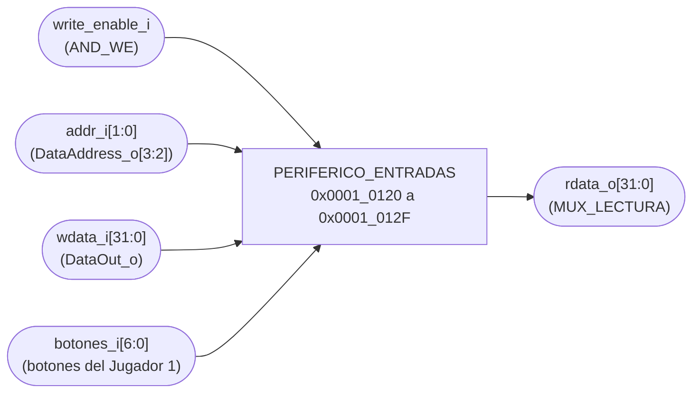
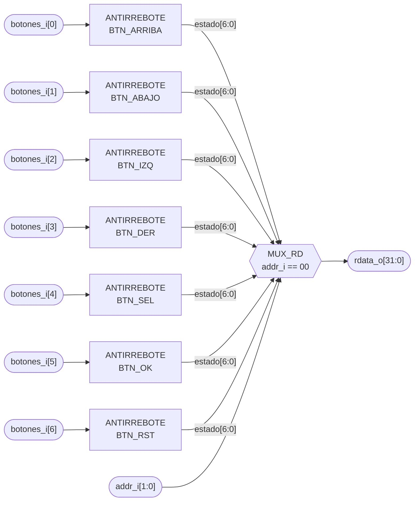

# PERIFERICO_ENTRADAS

## a) Nombre del módulo

PERIFERICO_ENTRADAS, módulo `periferico_entradas` en `src/design/periferico_entradas.sv`.

## b) Diagrama modular



Es el bloque `PERIFERICO_ENTRADAS` del nivel 2 visto desde afuera. Lo que tiene adentro está en el inciso i).

## c) Objetivo del módulo

Entregar al programa el estado de los siete botones del Jugador 1 ya sin rebotes, en un solo registro de
lectura en `0x0001_0120`, como pide la sección 4.5.2 del enunciado.

El periférico no sabe qué hace cada botón ni si una presión es nueva. Eso lo decide el programa. El hardware solo filtra los rebotes, que es la excepción que la sección 4.1
deja en el periférico.

## d) Entradas

- `clk_i`, `rst_i`.
- `write_enable_i`, habilitación de escritura, desde `AND_WE` del bus de datos. El periférico no tiene nada
  que escribir y la ignora, está solo porque es parte de la interfaz estándar de la sección 4.5.5.
- `addr_i[1:0]`, dirección del registro, sale de `DataAddress_o[3:2]` del CPU.
- `wdata_i[WIDTH-1:0]`, desde `DataOut_o` del CPU. Se ignora igual que `write_enable_i`.
- `botones_i[6:0]`, los siete botones del Jugador 1 directo de los pines, activos en alto. El orden es el
  mismo de los bits del registro, `botones_i[0]` es `BTN_ARRIBA` y `botones_i[6]` es `BTN_RST`.

El módulo tiene los parámetros `WIDTH = 32` y `BITS_CUENTA = 21`. El segundo pasa tal cual a cada
`antirrebote`.

## e) Salidas

- `rdata_o[WIDTH-1:0]`, registro de estado con `addr_i = 2'b00` y ceros en cualquier otra dirección, hacia el
  multiplexor de lectura que llega a `DataIn_i` del CPU.

## f) Relación con otros módulos

Habla con un solo maestro, el CPU, a través de `BUS_DATOS`. Adentro instancia siete veces `antirrebote`, que
solo usa este módulo y tiene su propio doc en `antirrebote.md`.

La decodificación de dirección es la sencilla. En el bloque de 16 bytes de `0x0001_0120` no hay otro
periférico, así que `sel_entradas` sale de comparar `DataAddress_o[31:4]` contra `0x0001_012`, igual que la
UART. El periférico ocupa `0x0001_0120` a `0x0001_012F` aunque solo use la primera palabra.

Hacia afuera los pines van a los cinco botones de la Basys 3 y a dos botones externos en el Pmod JC.

## g) Explicación de funcionamiento

Cada botón pasa por su `antirrebote`, y las siete salidas forman `estado[6:0]`. El programa hace
`lw` en `0x0001_0120` y recibe `estado` en los bits bajos. Un bit en 1 significa que ese botón está
presionado en este momento.

El registro da niveles, no presiones. Si el Jugador 1 deja apretado `BTN_DER`, el bit 3 se lee en 1 en todas
las vueltas del lazo mientras siga apretado. Para mover el cursor una sola casilla por presión, el programa
guarda la lectura anterior en un registro y se queda con los bits que pasaron de 0 a 1.

```asm
lw   t0, 0(s1)        # s1 = 0x0001_0120, t0 = estado actual
xori t1, s2, -1       # s2 = estado de la vuelta anterior, t1 = ~anterior
and  t1, t0, t1       # t1 = botones recién presionados
addi s2, t0, 0       # para la próxima vuelta
```

Son cuatro instrucciones del conjunto mínimo. El ejemplo solo muestra la idea, el programa real y sus
registros se documentan en el diseño del ensamblador.

## h) Diseño

### Mapa de registros

La tabla de la sección 4.4.3 del enunciado fija un registro de estado en `0x0001_0120`. El orden de los bits
es el que propone la investigación previa (sección 6.3).

- `2'b00` (`0x0001_0120`), registro de estado, solo lectura.
  - `[0]`, `BTN_ARRIBA`, mueve el cursor una fila arriba.
  - `[1]`, `BTN_ABAJO`, mueve el cursor una fila abajo.
  - `[2]`, `BTN_IZQ`, mueve el cursor una columna a la izquierda.
  - `[3]`, `BTN_DER`, mueve el cursor una columna a la derecha.
  - `[4]`, `BTN_SEL`, rota el barco que se está colocando.
  - `[5]`, `BTN_OK`, confirma una colocación o un disparo.
  - `[6]`, `BTN_RST`, reinicia la partida conservando los contadores de ganadas.
  - `[31:7]`, reservados, se leen en cero.
- `2'b01`, `2'b10` y `2'b11` (`0x0001_0124` a `0x0001_012C`), sin asignar. Las lecturas devuelven ceros.

Las escrituras no tienen efecto en ninguna dirección. Lo que dice cada bit sobre el juego lo decide el
programa, la lista solo dice para qué lo va a usar.

### Por qué nivel y no banderas de flanco

La investigación previa (sección 6.2) propone que el periférico detecte el flanco de subida y lo guarde en una
bandera que el programa lee y limpia. Acá no se hace, por dos razones.

La primera es que la sección 4.5.2 pide exponer "el estado ya filtrado (sin rebotes)". Una bandera de
flanco dice que el botón se presionó en algún momento, no cómo está ahora.

La segunda es que la bandera existe para no perder presiones si el programa tarda en leer, y eso no pasa.
`antirrebote` garantiza que cada nivel de su salida dura por lo menos `2^20` ciclos, 10.49 ms. Una presión,
por corta que sea, deja el bit en 1 durante al menos ese tiempo. El lazo principal sondea botones y UART en
cada vuelta, y una vuelta dura microsegundos, así que ve el 1 miles de veces antes de que se vaya. Mientras
ninguna rutina del programa se quede más de 10 ms sin volver al lazo, no se pierde nada, y el flanco sale
con las cuatro instrucciones del inciso g).

Con banderas harían falta siete flip-flops más y un camino de escritura para limpiarlas, para algo que ya
resuelve el tiempo mínimo del antirrebote.

### REG_ESTADO

No hay un registro aparte. `estado[k]` es la salida `o_boton` del `antirrebote` del bit `k`, que ya sale de
un flip-flop. Poner otro registro encima solo agregaría un ciclo de latencia.

| `addr_i`   | `rdata_o`                         |
| ---------- | --------------------------------- |
| `2'b00`    | `{{(WIDTH-7){1'b0}}, estado}`     |
| resto      | `0`                               |

### Pines de BTN_SEL y BTN_OK

La Basys 3 trae cinco botones y el enunciado pide siete. Los cuatro de la cruz van a la navegación y el
central a `BTN_RST`, como dice `nivel01.md`. `BTN_SEL` y `BTN_OK` van a los mismos pines del Pmod JC que en el
Proyecto 2, N17 y P18, con los mismos dos botones externos. Así no se gasta un switch en algo que el
enunciado llama botón, y el cableado ya está probado.

### Reset y BTN_RST

`rst_i` es el reinicio general. Después de `rst_i` los siete bits se leen en cero, que es lo correcto porque
nadie está presionando nada al arrancar.

`BTN_RST` no puede llegar a `rst_i` de este periférico. Si llegara, mientras el botón esté apretado el
`antirrebote` del bit 6 estaría en reset y el bit se leería en cero, así que el programa nunca vería la
presión. `BTN_RST` es un bit más del registro, y el reinicio de la partida lo hace el programa, que es lo
que ya dice `nivel01.md`.

TODO: Revisar cuál es el reinicio general del sistema, el enunciado no lo define. Es la misma pregunta abierta que en `PERIFERICO_7SEG.md` y `PERIFERICO_BUZZER.md`.

### Latches

La lectura es un `always_comb` con `case` y rama `default`. Los únicos registros son los de las siete
instancias de `antirrebote`.

## i) Diagrama esquemático detallado del diseño



`clk_i` y `rst_i` entran a las siete instancias aunque no se dibujen. `write_enable_i` y `wdata_i` no se
conectan a nada.

TODO: Revisar y reemplazar por el esquemático por compuertas generado desde `periferico_entradas.sv` cuando exista, igual que en `PERIFERICO_UART.md`.

## j) Diagrama completo de conexiones del diseño

Es el único módulo con puertos hacia los botones, así que acá van las restricciones de pin que tienen que
quedar en `src/fpga/basys3.xdc`.

- `botones_i[0]`, `BTN_ARRIBA`, a T18, `btnU` de la Basys 3.
- `botones_i[1]`, `BTN_ABAJO`, a U17, `btnD`.
- `botones_i[2]`, `BTN_IZQ`, a W19, `btnL`.
- `botones_i[3]`, `BTN_DER`, a T17, `btnR`.
- `botones_i[4]`, `BTN_SEL`, a N17, pin JC3 del Pmod JC, igual que en el Proyecto 2.
- `botones_i[5]`, `BTN_OK`, a P18, pin JC4 del Pmod JC, igual que en el Proyecto 2.
- `botones_i[6]`, `BTN_RST`, a U18, `btnC`.
- Todos con `IOSTANDARD LVCMOS33`.

Conexiones en el top.

- `clk_i`, al reloj global de 100 MHz, pin W5.
- `rst_i`, al reinicio general del sistema, nunca a `BTN_RST`.
- `write_enable_i`, a la salida de `AND_WE`, en alto solo cuando `we_o` está en alto y `DataAddress_o` cae
  entre `0x0001_0120` y `0x0001_012F`.
- `addr_i[1:0]`, a `DataAddress_o[3:2]`.
- `wdata_i[31:0]`, a `DataOut_o`.
- `rdata_o[31:0]`, a `MUX_LECTURA`, que alimenta `DataIn_i` del CPU.
- `botones_i[6:0]`, a los siete puertos de botón del top en el orden de la lista de arriba.

Igual que en los demás módulos, el diagrama por chips que pide el método no aplica a un diseño que se
sintetiza dentro de una sola FPGA, y esta lista de puertos es el reemplazo propuesto.
