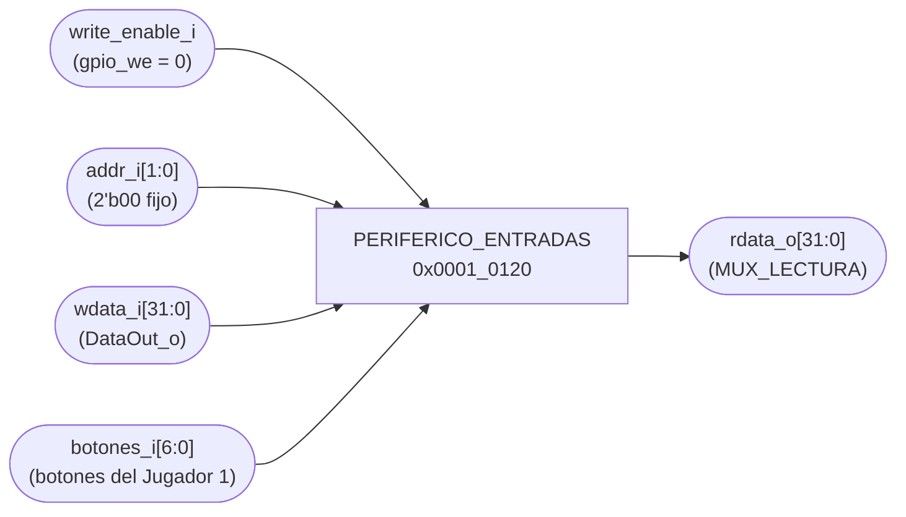

# PERIFERICO_ENTRADAS

## a) Nombre del módulo

PERIFERICO_ENTRADAS, módulo `periferico_entradas` en `src/design/periferico_entradas.sv`.

## b) Diagrama modular


```mermaid
flowchart LR
    IN_WE(["write_enable_i<br/>(gpio_we = 0)"]) --> PE["PERIFERICO_ENTRADAS<br/>0x0001_0120"]
    IN_ADDR(["addr_i[1:0]<br/>(2'b00 fijo)"]) --> PE
    IN_WD(["wdata_i[31:0]<br/>(DataOut_o)"]) --> PE
    IN_BTN(["botones_i[6:0]<br/>(botones del Jugador 1)"]) --> PE
    PE --> OUT_RD(["rdata_o[31:0]<br/>(MUX_LECTURA)"])
```

Es el bloque `PERIFERICO_ENTRADAS` del nivel 2 visto desde afuera. Lo que tiene adentro está en el inciso i).

## c) Objetivo del módulo

Poner el estado de los siete botones del Jugador 1 en el bus de datos, en un solo registro de lectura en
`0x0001_0120`, como pide la sección 4.5.2 del enunciado.

El periférico no sabe qué hace cada botón ni si una presión es nueva. Eso lo decide el programa. El hardware
solo registra los pines y los entrega cuando el CPU lee esa dirección.

## d) Entradas

- `clk_i`, `rst_i`.
- `write_enable_i`, habilitación de escritura, desde `gpio_we` del controlador de mapeo, que el Address
  Translator deja siempre en cero porque el registro es de solo lectura. El periférico igual la ignora, está
  solo porque es parte de la interfaz estándar de la sección 4.5.5.
- `addr_i[1:0]`, dirección del registro, fija en `2'b00` en el top, ver el inciso f).
- `wdata_i[WIDTH-1:0]`, desde `DataOut_o` del CPU. Se ignora igual que `write_enable_i`.
- `botones_i[6:0]`, las siete entradas del Jugador 1 directo de los pines, activas en alto. Son los cinco
  botones de la tarjeta y dos switches. El orden es el mismo de los bits del registro, `botones_i[0]` es
  `BTN_ARRIBA` y `botones_i[6]` es `BTN_RST`.

El módulo tiene el parámetro `WIDTH = 32`.

## e) Salidas

- `rdata_o[WIDTH-1:0]`, registro de estado con `addr_i = 2'b00` y ceros en cualquier otra dirección, hacia el
  multiplexor de lectura que llega a `DataIn_i` del CPU.

## f) Relación con otros módulos

Habla con un solo maestro, el CPU, a través de `BUS_DATOS`. No instancia ningún submódulo.

La dirección la decodifica el Address Translator del controlador de mapeo, detallado en
`Address_Translator.md`. `sel_gpio` sale de comparar la dirección completa contra `0x0001_0120`, y solo esa
palabra pone `mux_sel` en la entrada de botones. Por eso en el top `addr_i` va fijo en `2'b00`, igual que en
los displays, el LED y el buzzer.

Hacia afuera los pines van a los cinco botones de la Basys 3 y a los switches SW0 y SW15.

## g) Explicación de funcionamiento

`REG_ESTADO` copia los siete pines en cada flanco del reloj. El programa hace `lw` en `0x0001_0120` y recibe
esa copia en los bits bajos. Un bit en 1 significa que ese botón estaba presionado en el ciclo anterior.

El registro da niveles, no presiones. Si el Jugador 1 deja apretado `BTN_DER`, el bit 3 se lee en 1 en todas
las vueltas del lazo mientras siga apretado. Para mover el cursor una sola casilla por presión, el programa
guarda la lectura anterior en un registro y se queda con los bits que pasaron de 0 a 1.

```asm
lw   t0, 0(s1)        # s1 = 0x0001_0120, t0 = estado actual
xori t1, s2, -1       # s2 = estado de la vuelta anterior, t1 = ~anterior
and  t1, t0, t1       # t1 = botones recién presionados
addi s2, t0, 0        # para la próxima vuelta
```

Son cuatro instrucciones del conjunto mínimo. El ejemplo solo muestra la idea, el programa real y sus
registros se documentan en el diseño del ensamblador.

Una presión dura decenas de milisegundos y una vuelta del lazo principal dura microsegundos, así que el
programa ve cada presión muchas veces seguidas y no se le escapa ninguna mientras ninguna rutina se quede
tanto tiempo sin volver al lazo.

## h) Diseño

### Mapa de registros

La tabla de la sección 4.4.3 del enunciado fija un registro de estado en `0x0001_0120`. El orden de los bits
es el que propone la investigación previa (sección 6.3).

- `2'b00` (`0x0001_0120`), registro de estado, solo lectura.
  - `[0]`, `BTN_ARRIBA`, mueve el cursor una fila arriba.
  - `[1]`, `BTN_ABAJO`, mueve el cursor una fila abajo.
  - `[2]`, `BTN_IZQ`, mueve el cursor una columna a la izquierda.
  - `[3]`, `BTN_DER`, mueve el cursor una columna a la derecha.
  - `[4]`, `BTN_SEL`, rota el barco que se está colocando.
  - `[5]`, `BTN_OK`, confirma una colocación o un disparo.
  - `[6]`, `BTN_RST`, reinicia la partida conservando los contadores de ganadas.
  - `[31:7]`, reservados, se leen en cero.

`0x0001_0124` a `0x0001_012C` no son de este periférico. El AT las trata como direcciones sin destino y una
lectura devuelve cero desde `MUX_LECTURA`.

Las escrituras no tienen efecto en ninguna dirección. Lo que hace cada botón en el juego lo decide el
programa, la lista solo dice para qué lo va a usar.

### Sin antirrebote

La sección 4.5.2 pide debouncing, pero según el profesor los botones de la Basys 3 ya llegan filtrados por la
tarjeta y no hace falta repetirlo en el periférico. Con eso el `debounce` y el detector de flanco de
`botones.sv` del Proyecto 2 no se traen. El flanco lo saca el programa, como se ve en el inciso g).

Los switches de `BTN_OK` y `BTN_RST` tampoco rebotan, así que se leen igual que los cinco botones y los
siete bits del registro se tratan igual.

### REG_ESTADO

| Condición | `estado'`         |
| --------- | ----------------- |
| `rst_i`   | `0`               |
| resto     | `botones_i[6:0]`  |

Es de 7 bits y no tiene habilitación. Está por timing, no para sincronizar. Sin él, el pin iría por
`MUX_RD`, `MUX_LECTURA` y `DataIn_i` hasta el banco de registros del CPU en un solo camino combinacional que
arranca en un pin asíncrono y que nadie restringe. Con el registro el pin termina en un flip-flop, y lo que
lee el CPU no cambia en medio del ciclo. Es un solo flip-flop por bit, sin la cadena de dos de un
sincronizador.

### MUX_RD

| `addr_i`   | `rdata_o`                         |
| ---------- | --------------------------------- |
| `2'b00`    | `{{(WIDTH-7){1'b0}}, estado}`     |
| resto      | `0`                               |

### Pines de BTN_SEL, BTN_OK y BTN_RST

La Basys 3 trae cinco botones y el enunciado pide siete entradas. Los cuatro de la cruz van a la navegación
y el central a `BTN_SEL`, que es más simple para el Jugador 1 porque rotar el barco queda junto a las
flechas. `BTN_OK` va en SW0 y `BTN_RST` en SW15, los dos extremos de la fila de switches. El Pmod JC queda
solo con el buzzer.

Un switch no vuelve solo. El programa saca el flanco de 0 a 1 igual que con los botones, así que lo que
cuenta es el momento en que se sube, y hay que bajarlo antes de la siguiente confirmación o del siguiente
reinicio. Dejar SW15 arriba reinicia la partida una sola vez.

### Reset y BTN_RST

`rst_i` es el reinicio general y sale de `locked` del MMCM negado, así que está en alto desde que la FPGA se
configura hasta que el reloj engancha. Para dispararlo a mano se usa el botón PROG de la Basys 3, que vuelve
a configurar la FPGA con el bitstream guardado en la flash. Hace falta el jumper JP1 en QSPI.

Después de `rst_i` los siete bits se leen en cero y al ciclo siguiente ya siguen a los pines. Si SW0 o SW15
quedaron arriba, ese bit sale en 1 desde el arranque. El programa tiene que tomar esa primera lectura como
estado anterior para no contarla como flanco.

`BTN_RST` no puede llegar a `rst_i` de este periférico. Si llegara, mientras SW15 esté arriba
`REG_ESTADO` estaría en reset y el bit 6 se leería en cero, así que el programa nunca vería el flanco.
`BTN_RST` es un bit más del registro, y el reinicio de la partida lo hace el programa, que es lo que ya dice
`nivel01.md`.

El marcador de ganadas solo vuelve a cero con `rst_i`.

### Latches

`REG_ESTADO` va en un `always_ff` con reset síncrono. `MUX_RD` es un `always_comb` con `case` y rama
`default`.

## i) Diagrama esquemático detallado del diseño


El esquemático sale de sintetizar el `.sv` con yosys, bajarlo a AND, OR, XOR, NOT, MUX y flip-flops D
con `abc`, y dibujarlo con netlistsvg. Cada compuerta o flip-flop lleva encima el nombre de la señal que
produce cuando esa señal tiene nombre en el RTL. Las que no tienen nombre son la lógica que yosys arma
para el reset y los `if` de cada registro.

Arriba está el periférico con sus dos bloques como cajas, `REG_ESTADO` de las líneas 18 a 21 del `.sv`
y `MUX_RD` de 23 a 28, y abajo está cada uno abierto a compuertas. `REG_ESTADO` son los siete
flip-flops con la AND del reset delante. `MUX_RD` deja pasar `estado` solo cuando `addr_i` vale `00`.

Se genera con el bus de 8 bits en vez de 32. Los siete botones caben igual, y los bits de más arriba
solo serían ceros constantes en `rdata_o`. `write_enable_i` y `wdata_i` quedan sueltos porque el
periférico no los usa.

## j) Diagrama completo de conexiones del diseño

Es el único módulo con puertos hacia los botones, así que acá van las restricciones de pin que tienen que
quedar en `src/fpga/basys3.xdc`.

- `botones_i[0]`, `BTN_ARRIBA`, a T18, `btnU` de la Basys 3.
- `botones_i[1]`, `BTN_ABAJO`, a U17, `btnD`.
- `botones_i[2]`, `BTN_IZQ`, a W19, `btnL`.
- `botones_i[3]`, `BTN_DER`, a T17, `btnR`.
- `botones_i[4]`, `BTN_SEL`, a U18, `btnC`.
- `botones_i[5]`, `BTN_OK`, a V17, el switch SW0.
- `botones_i[6]`, `BTN_RST`, a R2, el switch SW15.
- Todos con `IOSTANDARD LVCMOS33`.

Conexiones en el top.

- `clk_i`, al reloj global de 100 MHz, pin W5.
- `rst_i`, a `locked` del MMCM negado, nunca a `BTN_RST`.
- `write_enable_i`, a `gpio_we` del controlador de mapeo, que siempre vale cero.
- `addr_i[1:0]`, a `2'b00`.
- `wdata_i[31:0]`, a `DataOut_o`.
- `rdata_o[31:0]`, a `MUX_LECTURA`, que alimenta `DataIn_i` del CPU. En `Address_Translator.md` es la entrada `gpio_dout`, que el AT elige con `mux_sel = 010`.
- `botones_i[6:0]`, a los siete puertos de botón del top en el orden de la lista de arriba.

Igual que en los demás módulos, el diagrama por chips que pide el método no aplica a un diseño que se
sintetiza dentro de una sola FPGA, y esta lista de puertos es el reemplazo propuesto.
