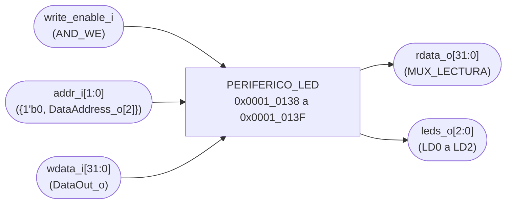
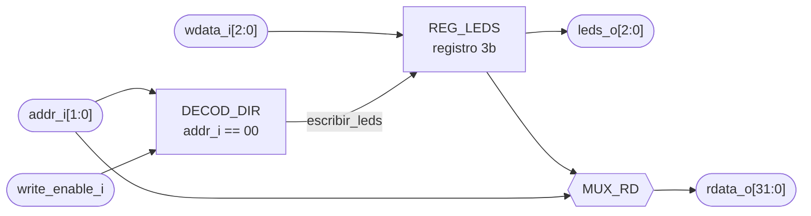

# PERIFERICO_LED

## a) Nombre del módulo

PERIFERICO_LED, módulo `periferico_led` en `src/design/periferico_led.sv`.

## b) Diagrama modular

Es el bloque `PERIFERICO_LED` del nivel 2 visto desde afuera. Lo que tiene adentro está en el inciso i).

## c) Objetivo del módulo

Mostrar en los LEDs de la Basys 3 en qué fase está la partida, colocación, batalla o resultado, como pide la
sección 4.5.4 del enunciado. Cada fase tiene su propio LED, así que se distinguen de un vistazo.

El periférico no sabe en qué fase está el juego. El programa la lleva y escribe el patrón de LEDs cada vez que
cambia de fase. El hardware solo guarda lo escrito y lo saca a los pines.

## d) Entradas

- `clk_i`, `rst_i`.
- `write_enable_i`, habilitación de escritura, desde `AND_WE` del bus de datos (`we_o` del CPU en AND con
  `sel_led`).
- `addr_i[1:0]`, dirección del registro. No sale directo de `DataAddress_o[3:2]`, ver el inciso f).
- `wdata_i[WIDTH-1:0]`, dato a escribir, desde `DataOut_o` del CPU.

El módulo tiene el parámetro `WIDTH = 32`.

## e) Salidas

- `rdata_o[WIDTH-1:0]`, contenido del registro apuntado por `addr_i`, hacia el multiplexor de lectura que
  llega a `DataIn_i` del CPU.
- `leds_o[2:0]`, a LD0, LD1 y LD2. Activos en alto.

## f) Relación con otros módulos

Habla con un solo maestro, el CPU, a través de `BUS_DATOS`. No instancia ningún submódulo.

La decodificación de dirección tiene la misma trampa que `PERIFERICO_7SEG`, vista desde el otro lado. Los
displays están en `0x0001_0130` y el LED en `0x0001_0138`, dentro del mismo bloque de 16 bytes. `sel_led` sale
de comparar `DataAddress_o[31:3]` contra `0x0001_0138 >> 3`, y el periférico queda en `0x0001_0138` a
`0x0001_013F`.

Con eso `DataAddress_o[3]` vale 1 en todo el rango del LED. Si `addr_i` fuera `DataAddress_o[3:2]` como en
los demás periféricos, el registro de offset `0x00` llegaría con `addr_i = 2'b10`. En el top `addr_i` se
arma como `{1'b0, DataAddress_o[2]}`, y así `0x0001_0138` llega como `2'b00`, que es el offset que da la
tabla del enunciado. El periférico sigue la interfaz estándar sin saber en qué bloque está.

Hacia afuera los pines van a los tres primeros LEDs de la Basys 3.

## g) Explicación de funcionamiento

El periférico tiene un registro, `REG_LEDS`. El programa escribe en `0x0001_0138` un 1 en el bit de la fase
en la que entra, y desde el ciclo siguiente ese LED se enciende y los otros dos se apagan.

- Al arrancar la partida, o después de `BTN_RST`, el programa escribe `0x1` y se enciende LD0, colocación.
- Cuando los dos jugadores terminaron de colocar escribe `0x2` y se enciende LD1, batalla.
- Cuando alguien hunde los tres barcos del otro escribe `0x4` y se enciende LD2, resultado. Se queda así
  hasta `BTN_RST`.

El registro se puede leer. El programa no lo necesita para el juego, pero sirve para revisar en simulación
qué escribió.

## h) Diseño

### Mapa de registros

La tabla de la sección 4.4.3 del enunciado fija un registro de datos en `0x0001_0138`.

- `2'b00` (`0x0001_0138`), registro de LEDs, RW.
  - `[0]`, LD0, fase de colocación.
  - `[1]`, LD1, fase de batalla.
  - `[2]`, LD2, resultado final.
  - `[31:3]`, reservados, se leen en cero y las escrituras sobre ellos se ignoran.
- `2'b01` (`0x0001_013C`), sin asignar. Las lecturas devuelven ceros y las escrituras no tienen efecto.

`2'b10` y `2'b11` no llegan nunca, porque el top fija `addr_i[1]` en cero.

### Qué cambió respecto al Proyecto 2

- En el Proyecto 2 `Estado` recibía el estado de la FSM en `state[2:0]`, lo registraba y lo decodificaba a un
  código de 2 bits en LD0 y LD1. Acá no hay FSM en hardware. El que sabe la fase es el programa, y el
  periférico recibe lo que él escribe por el bus.
- El decodificador se va. Un código binario en dos LEDs dejaba la selección con los dos apagados y el
  resultado con LD1 solo, y para leerlo había que saberse la tabla. Con un LED por fase el que mira la tarjeta
  entiende qué pasa sin tabla, que es lo que pide la sección 4.5.4 con "claramente distinguible".
- El registro de `state` se queda, ahora como `REG_LEDS`, pero cambia qué lo carga. Antes copiaba la FSM en
  cada ciclo, ahora solo carga cuando el CPU escribe.
- Los LEDs pasan de 2 a 3. LD0 y LD1 siguen en los mismos pines, U16 y E19, y se agrega LD2 en U19.

### Por qué el programa escribe los tres bits

El periférico podría recibir la fase como un código de 2 bits y decodificarlo a un LED encendido, como hacía
el Proyecto 2. Así el hardware garantizaría que siempre hay un solo LED encendido. No se hace porque
escribir `0x1`, `0x2` o `0x4` le cuesta al programa lo mismo que escribir `0`, `1` o `2`, y el decodificador
sería hardware que no agrega nada. Si el programa escribe dos bits a la vez se encienden dos LEDs, y eso es un
bug del programa que se ve apenas pasa.

### REG_LEDS

| Condición                                  | `reg_leds'`      |
| ------------------------------------------ | ---------------- |
| `rst_i`                                    | `0`              |
| `write_enable_i` y `addr_i = 2'b00`        | `wdata_i[2:0]`   |
| resto                                      | sin cambio       |

Es de 3 bits. `leds_o` es `reg_leds` directo, y `rdata_o` vale `{{(WIDTH-3){1'b0}}, reg_leds}` con
`addr_i = 2'b00` y cero en cualquier otra dirección.

### Reset y BTN_RST

Después de `rst_i` los tres LEDs quedan apagados hasta que el programa escribe la primera fase. Eso pasa en la
inicialización, antes de entrar al lazo, así que el tiempo con los LEDs apagados son unos pocos ciclos.

`BTN_RST` no llega a `rst_i`. Al reiniciar la partida el programa vuelve a escribir `0x1` y se enciende
colocación, que es la fase en la que arranca la partida nueva.

TODO: Revisar cuál es el reinicio general del sistema, el enunciado no lo define. Es la misma pregunta abierta que en `PERIFERICO_7SEG.md` y `PERIFERICO_BUZZER.md`.

### Latches

`REG_LEDS` va en un `always_ff` con reset síncrono. La lectura es un `always_comb` con `case` y rama
`default`.

## i) Diagrama esquemático detallado del diseño

`clk_i` y `rst_i` entran a `REG_LEDS` aunque no se dibujen.

TODO: Revisar y reemplazar por el esquemático por compuertas generado desde `periferico_led.sv` cuando exista, igual que en `PERIFERICO_UART.md`.

## j) Diagrama completo de conexiones del diseño

Es el único módulo con puertos hacia los LEDs, así que acá van las restricciones de pin que tienen que quedar
en `src/fpga/basys3.xdc`. LD0 y LD1 son los mismos pines del Proyecto 2.

- `leds_o[0]`, colocación, a U16, LD0.
- `leds_o[1]`, batalla, a E19, LD1.
- `leds_o[2]`, resultado, a U19, LD2.
- Todos con `IOSTANDARD LVCMOS33`.

Conexiones en el top.

- `clk_i`, al reloj global de 100 MHz, pin W5.
- `rst_i`, al reinicio general del sistema.
- `write_enable_i`, a la salida de `AND_WE`, en alto solo cuando `we_o` está en alto y `DataAddress_o` cae
  entre `0x0001_0138` y `0x0001_013F`.
- `addr_i[1:0]`, a `{1'b0, DataAddress_o[2]}`.
- `wdata_i[31:0]`, a `DataOut_o`.
- `rdata_o[31:0]`, a `MUX_LECTURA`, que alimenta `DataIn_i` del CPU.
- `leds_o`, al puerto `led[2:0]` del top.

Igual que en los demás módulos, el diagrama por chips que pide el método no aplica a un diseño que se
sintetiza dentro de una sola FPGA, y esta lista de puertos es el reemplazo propuesto.
