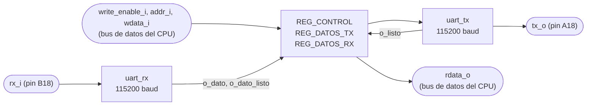
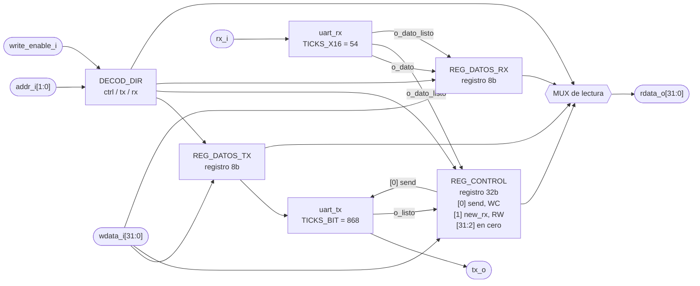

# PERIFERICO_UART

## a) Nombre del módulo

PERIFERICO_UART

## b) Diagrama modular

## c) Objetivo del módulo

Envuelve los dos núcleos serie que da el curso (`UART_tx.vhd` y `UART_rx.vhd`, portados a
SystemVerilog) en la interfaz estándar de periférico de 32 bits de la sección 4.5.5 del
enunciado. Es el mismo periférico del Proyecto 2, que la sección 4.5.3 pide reutilizar, con el
mapa de registros ajustado a la tabla de la sección 4.4.3.

Es el único canal entre la FPGA y el Jugador 2. Todo lo que manda la app de PC (colocaciones,
disparos) entra por acá, y todo lo que la app necesita saber de la partida sale por acá.

No sabe nada del juego. No conoce tramas, ni barcos, ni turnos. Mueve bytes en las dos
direcciones y levanta banderas para que el programa en ensamblador las lea.

## d) Entradas

- `clk_i`, `rst_i`.
- `write_enable_i`, habilitación de escritura, desde el decodificador de direcciones del bus de
  datos del CPU.
- `addr_i[1:0]`, dirección del registro, sale de `DataAddress_o[3:2]` del CPU.
- `wdata_i[WIDTH-1:0]`, dato a escribir, desde `DataOut_o` del CPU.
- `rx_i`, línea serial cruda, desde el pin B18 de la Basys 3.

Los puertos del bus llevan sufijo `_i`/`_o` en vez del prefijo `i_`/`o_` que usa el resto del
repo, porque la sección 4.5.5 los nombra así y la interfaz es de cumplimiento obligatorio.

El módulo está parametrizado con `WIDTH = 32`, `TICKS_BIT = 868` y `TICKS_X16 = 54`. Los dos
últimos se le pasan tal cual a los núcleos, y en simulación se reescalan a valores chicos para no
esperar 8680 ciclos por byte.

## e) Salidas

- `rdata_o[WIDTH-1:0]`, contenido del registro apuntado por `addr_i`, hacia el multiplexor de
  lectura que llega a `DataIn_i` del CPU.
- `tx_o`, línea serial hacia el pin A18 de la Basys 3.

## f) Relación con otros módulos

Hacia adentro habla con un solo maestro, el CPU. En el Proyecto 2 había dos
(`UART_receptor` y `UART_transmisor`) y por eso existía `ARBITRO_UART`. Acá toda esa
lógica pasa al ensamblador y el periférico ve un único puerto, sin árbitro en el medio.

El periférico ocupa `0x0001_0040` a `0x0001_004F`. El decodificador de direcciones activa
`write_enable_i` solo cuando la dirección cae en ese rango y le pasa `DataAddress_o[3:2]` como
`addr_i`. Los registros van de 4 en 4 bytes, así que los dos bits más bajos siempre valen cero y
no sirven para distinguir registros.

Hacia afuera habla con la app de PC del Jugador 2. `rx_i` y `tx_o` salen directo a los pines del
puente USB-UART, que es el mismo cable con el que se programa la tarjeta.

Los dos núcleos que instancia adentro, `uart_tx` y `uart_rx`, solo los usa este módulo.

## g) Explicación de funcionamiento

El periférico es un banco de tres registros con dos máquinas serie colgando.

Para transmitir, el programa escribe el byte en el registro de datos de transmisión y después
levanta el bit `send` del registro de control. El periférico sostiene ese bit mientras el núcleo
suelta el byte por la línea, y lo baja solo cuando el núcleo avisa que terminó. Ese bit hace dos
trabajos a la vez. Es la orden de arranque y también la bandera de ocupado que el programa sondea
antes de mandar el siguiente byte de una trama. El enunciado lo define como WC, lo escribe el CPU
y lo limpia el hardware.

Para recibir, el núcleo avisa con un pulso de un ciclo que hay un byte nuevo. El periférico lo
guarda en el registro de datos de recepción y levanta `new_rx`. Ese bit se queda alto hasta que
el programa lo escriba en cero después de leer el dato.

Nada de esto bloquea al CPU. El lazo principal sondea `new_rx` en cada vuelta junto con los
botones del Jugador 1, que es lo que permite la colocación concurrente. Un byte a 115200 baudios
tarda unos 8680 ciclos, así que el lazo tiene tiempo de sobra para dar muchas vueltas entre byte y
byte.

## h) Diseño

### Mapa de registros

La tabla de la sección 4.4.3 del enunciado fija las tres direcciones. Con base `0x0001_0040`:

- `2'b00` (`0x0001_0040`), registro de control. Bit 0 es `send` (WC), bit 1 es `new_rx` (RW), y los
  bits `[31:2]` son reservados, se leen en cero y las escrituras sobre ellos se ignoran.
- `2'b01` (`0x0001_0044`), registro de datos de transmisión. Bits `[7:0]` son el byte a enviar,
  `[31:8]` son reservados y se leen en cero.
- `2'b10` (`0x0001_0048`), registro de datos de recepción. Bits `[7:0]` son el último byte recibido,
  `[31:8]` son reservados y se leen en cero. El enunciado del Proyecto 2 lo declara de escritura
  igual que el de transmisión, así que se implementa escribible aunque en la práctica solo lo
  escribe un testbench.
- `2'b11` (`0x0001_004C`), sin asignar. Las lecturas devuelven ceros y las escrituras no tienen
  efecto.

En el Proyecto 2 el control estaba en `2'b10` y los datos en `2'b00` y `2'b01`, porque allá el
orden lo escogía el equipo. Acá lo fija el enunciado.

### El registro de control

El control es un registro de verdad, `reg_control`, de `WIDTH` bits. `send` y `new_rx` no existen
como flip-flops sueltos, son los campos `reg_control[0]` y `reg_control[1]`, y la lectura de
`2'b00` devuelve `reg_control` entero.

La versión del Proyecto 2 los tenía sueltos y los concatenaba en la lectura,
`{30'b0, new_rx, send}`. Con dos bits funciona, pero cada campo nuevo (un `busy`, un error de
trama, un bit de desborde) obligaba a tocar la concatenación y el ancho del relleno a mano, y el
orden de los bits quedaba escondido en una línea del multiplexor. Con `reg_control` agregar un
campo es un `localparam` nuevo con su índice y su regla de actualización, y la lectura no se toca.

Cada campo se actualiza por su índice con su propia prioridad, que son las dos tablas de abajo.
Los bits sin campo solo se asignan en el reset, así que se quedan en cero y la síntesis los reduce
a constantes.

### El bit send

| Condición                                    | `reg_control[0]'` |
| -------------------------------------------- | ----------------- |
| `rst_i`                                      | `0`               |
| escritura al control con `wdata_i[0] = 1`    | `1`               |
| `o_listo` del núcleo de transmisión          | `0`               |
| resto                                        | sin cambio        |

La escritura va antes que la bajada automática. Si el CPU pide un envío en el mismo ciclo en que
el núcleo termina el anterior, el envío nuevo tiene que ganar.

`send` se baja en cuanto el núcleo avisa con `o_listo`, y es la única opción segura. El núcleo
vuelve a mirar la orden de arranque un bit entero después de terminar el byte, así que bajarlo ahí
deja todo ese margen. Si el bit se sostuviera más tiempo, el núcleo lo leería otra vez y el mismo
byte saldría dos veces.

### El bit new_rx

| Condición                                    | `reg_control[1]'` | `reg_rx'`       |
| -------------------------------------------- | ----------------- | --------------- |
| `rst_i`                                      | `0`               | `0x00`          |
| `o_dato_listo` del núcleo de recepción       | `1`               | dato del núcleo |
| escritura al control                         | `wdata_i[1]`      | sin cambio      |
| escritura al registro de datos de recepción  | sin cambio        | `wdata_i[7:0]`  |
| resto                                        | sin cambio        | sin cambio      |

El byte que llega le gana a la escritura del mismo ciclo. Sin esa prioridad, si el CPU limpia
`new_rx` justo en el ciclo en que entra un byte nuevo, ese byte se pierde con el bit ya en cero.
La ventana es de un ciclo cada 87 µs, muy difícil de ver en la tarjeta si no se busca a propósito
en simulación.

### Los dos núcleos y su baudaje

Los núcleos son transcripción de los `.vhd` del curso, misma máquina de estados y mismos tiempos,
con los nombres traducidos al estilo del repo. Solo cambiaron los genéricos, porque los originales
venían calculados para un reloj de 16 MHz.

- `uart_tx` cuenta `TICKS_BIT` ciclos por bit. A 100 MHz y 115200 baudios eso da
  `100e6 / 115200 = 868.06`, se usa 868. El baudaje real queda en 115207, un error de 0.006%.
  El genérico original era 139.
- `uart_rx` sobremuestrea a 16 veces el baudaje, así que cuenta `TICKS_X16` ciclos por tick. Eso
  da `868.06 / 16 = 54.25`, se usa 54. El genérico original era 9.

El redondeo del receptor es el que aprieta, 54 en vez de 54.25 corre el muestreo un 0.47% por
bit. El receptor detecta el flanco de arranque, espera 8 ticks para caer al centro del bit, y de
ahí muestrea cada 16 ticks. El último bit de datos lo muestrea en el tick 136, o sea a
`136 x 54 = 7344` ciclos del flanco. El centro real de ese bit está en `8.5 x 868.06 = 7379`
ciclos. El desfase acumulado es de 35 ciclos contra los 434 que serían medio bit, más de diez
veces de margen.

### La ventana muerta del núcleo de transmisión

`UART_tx.vhd` levanta `start_reset` en el estado de parada y solo lo baja al volver a reposo, y
las dos transiciones ocurren en ticks de baudaje. Entre una y otra pasa un bit entero, unos
8.7 µs, durante los cuales el registro que atrapa la orden de arranque se mantiene en cero. Un
pulso de un ciclo en `i_enviar` que caiga en esa ventana se pierde sin bandera de error ni nada.

Por eso este periférico maneja `i_enviar` con el bit `send` sostenido y no con un pulso. Mientras
`send` esté alto el núcleo atrapa la orden apenas sale de la ventana, y `send` se baja justo cuando
el núcleo confirma que terminó. En el Proyecto 2 esto quedó demostrado con `tb_uart_tx`, una
prueba donde el pulso corto se pierde y otra donde el nivel sostenido sí pasa.

### Los pulsos de un ciclo

`o_dato_listo` y `o_listo` salen del mismo tipo de detector de flanco dentro de los núcleos y duran
un solo ciclo de reloj. El programa no los puede sondear, porque entre dos `lw` al control ya
pasaron. Por eso el periférico los convierte en los dos campos pegajosos de `reg_control`,
`new_rx` que se queda hasta que el programa lo limpie y `send` que se queda hasta que el núcleo
termine.

### Latches

El decodificador de lectura es un `always_comb` con `case` y rama `default`, así que las cuatro
direcciones están cubiertas. Los tres bloques secuenciales, uno por registro, son `always_ff` con
reset síncrono. Sintetizado con yosys (`synth -top periferico_uart`) no aparece ningún
`Latch inferred` en el log.

## i) Diagrama esquemático detallado del diseño

`clk_i` y `rst_i` entran a los tres registros y a los dos núcleos aunque no se dibujen.

## j) Diagrama completo de conexiones del diseño

Es el único módulo con puertos hacia el puente USB-UART, así que acá van las restricciones de pin
de `src/fpga/basys3.xdc`:

- `rx_i`, al pin B18, `RsRx` del puente USB-UART.
- `tx_o`, al pin A18, `RsTx` del puente USB-UART.
- Los dos con `IOSTANDARD LVCMOS33`.

Conexiones en el top:

- `clk_i`, al reloj global de 100 MHz, pin W5.
- `rst_i`, al reset del sistema.
- `write_enable_i`, al `we_o` del CPU filtrado por el decodificador de direcciones, en alto solo
  cuando `DataAddress_o` cae entre `0x0001_0040` y `0x0001_004F`.
- `addr_i[1:0]`, a `DataAddress_o[3:2]`.
- `wdata_i[31:0]`, a `DataOut_o`.
- `rdata_o[31:0]`, al multiplexor de lectura que alimenta `DataIn_i` del CPU.
- `rx_i`, `tx_o`, a los puertos del top con el mismo nombre.

Igual que en los demás módulos, el diagrama por chips que pide el método no aplica a un diseño
que se sintetiza dentro de una sola FPGA, y esta lista de puertos es el reemplazo propuesto.
