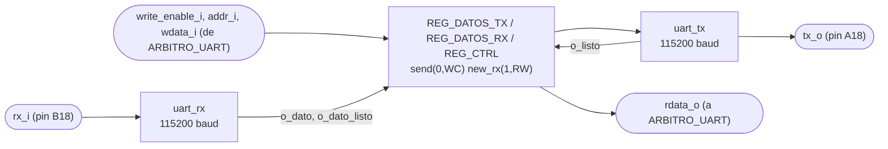
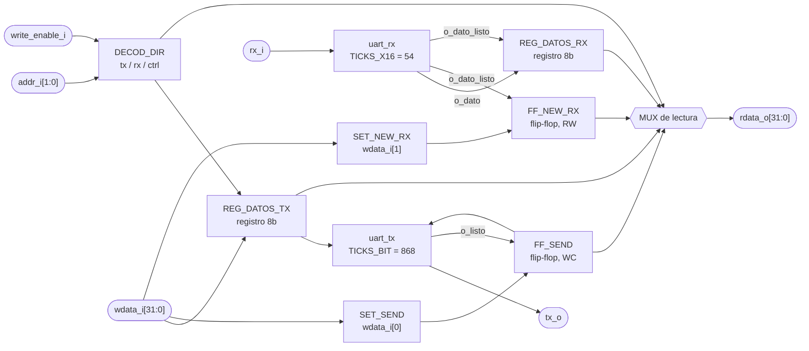

# PERIFERICO_UART

## a) Nombre del módulo

PERIFERICO_UART

## b) Diagrama modular

## c) Objetivo del módulo

Envuelve los dos núcleos serie que da el curso (`UART_tx.vhd` y `UART_rx.vhd`, portados a
SystemVerilog) en la interfaz estándar de periférico de 32 bits que fija la sección 3.4.3 del
enunciado. Expone tres registros y es el único bloque del diseño que toca las líneas físicas del
puente USB-UART de la tarjeta.

No sabe nada del juego. No conoce letras, ni estados, ni tramas. Mueve bytes en las dos
direcciones y levanta banderas para que alguien más las lea.

---

## d) Entradas

- `clk_i`, `rst_i`.
- `write_enable_i`: habilitación de escritura del bus, desde `ARBITRO_UART`.
- `addr_i[1:0]`: dirección del registro, desde `ARBITRO_UART`.
- `wdata_i[WIDTH-1:0]`: dato a escribir, desde `ARBITRO_UART`.
- `rx_i`: línea serial cruda, desde el pin B18 de la Basys 3.

Los puertos del bus llevan sufijo `_i`/`_o` en vez del prefijo `i_`/`o_` que usa el resto del
repo, porque la sección 3.4.3 los nombra así y la interfaz es de cumplimiento obligatorio.

El módulo está parametrizado con `WIDTH = 32`, `TICKS_BIT = 868` y `TICKS_X16 = 54`. Los dos
últimos se le pasan tal cual a los núcleos, que tienen los mismos parámetros, y es sobre los
núcleos donde `tb_uart_tx` los reescala a 160 y 10 para que la simulación no tarde una eternidad.

---

## e) Salidas

- `rdata_o[WIDTH-1:0]`: contenido del registro apuntado por `addr_i`, hacia `ARBITRO_UART`.
- `tx_o`: línea serial hacia el pin A18 de la Basys 3.

---

## f) Relación con otros módulos

Hacia adentro del sistema habla con un solo bloque, `ARBITRO_UART`. Ese es el punto importante del
diseño. El enunciado habla de "el bloque que instancia la interfaz" en singular, y acá hay dos
módulos que la quieren usar, `M10_Receptor-UART` para leer y `M11_Transmisor-UART` para escribir.
El periférico no resuelve ese conflicto, lo resuelve el árbitro, y por eso el periférico ve un
único maestro y se puede diseñar como si fuera un puerto simple.

Hacia afuera habla con la PC. `rx_i` y `tx_o` salen directo a los pines del puente USB-UART, que
es el mismo cable con el que se programa la tarjeta, así que no hace falta adaptador externo.

Los dos núcleos que instancia adentro, `uart_tx` y `uart_rx`, son suyos y de nadie más. Ningún
otro módulo del diseño los toca.

---

## g) Explicación de funcionamiento

El periférico es un banco de tres registros con dos máquinas serie colgando.

Para transmitir, el maestro escribe el byte en el registro de datos de transmisión y después
levanta el bit `send` del registro de control. El periférico sostiene ese bit mientras el núcleo
suelta el byte por la línea, y lo baja solo cuando el núcleo avisa que terminó. Ese bit hace dos
trabajos a la vez, es la orden de arranque y es la bandera de ocupado que el maestro sondea para
saber cuándo puede mandar el siguiente byte. El enunciado lo define como WC, o sea que lo escribe
el maestro y lo limpia el hardware.

Para recibir, el núcleo avisa con un pulso de un ciclo que hay un byte nuevo. El periférico lo
guarda en el registro de datos de recepción y levanta `new_rx`. Ese bit se queda alto hasta que
alguien lo escriba en cero, y limpiarlo es responsabilidad del maestro, tal como pide el
enunciado. `new_rx` es RW, no W1C, y esa diferencia es la que obliga a tener árbitro.

---

## h) Diseño

### Mapa de registros

El enunciado fija las dos direcciones de datos y deja la del control a criterio del equipo:

- `2'b00`, registro de datos de transmisión. Bits `[7:0]` son el byte a enviar, `[31:8]` son
  reservados y se leen en cero.
- `2'b01`, registro de datos de recepción. Bits `[7:0]` son el último byte recibido, `[31:8]` son
  reservados y se leen en cero. El enunciado lo declara de escritura igual que el de transmisión,
  así que se implementa escribible aunque en la práctica solo lo escribe un testbench.
- `2'b10`, registro de control. Bit 0 es `send` (WC), bit 1 es `new_rx` (RW), y los bits `[31:2]`
  son reservados, se leen en cero y las escrituras sobre ellos se ignoran.
- `2'b11`, sin asignar. Las lecturas devuelven ceros y las escrituras no tienen efecto. Queda
  libre por si en el futuro hace falta un registro de estado de errores de trama.

La dirección del control se escogió `2'b10` y no `2'b11` para dejar el patrón de bits más alto
como el hueco reconocible, y para que las dos direcciones de datos queden contiguas.

### El bit send

| Condición                                    | `send'` |
| -------------------------------------------- | ------- |
| `rst_i`                                       | `0`     |
| escritura al control con `wdata_i[0] = 1`     | `1`     |
| `o_listo` del núcleo de transmisión           | `0`     |
| resto                                         | sin cambio |

El orden de prioridad importa. La escritura va antes que la bajada automática, porque si el
maestro pide un envío en el mismo ciclo en que el núcleo termina el anterior, lo que se quiere es
que el envío nuevo gane.

Se baja `send` en cuanto el núcleo avisa con `o_listo`, y esa es la única opción segura. El
núcleo vuelve a mirar la orden de arranque un bit entero después de terminar el byte, así que
bajar `send` ahí deja todo ese margen. Si el bit se sostuviera más tiempo, el núcleo lo leería
otra vez y el mismo byte saldría dos veces.

### El bit new_rx y su carrera

| Condición                                         | `new_rx'` | `reg_rx'` |
| -------------------------------------------------- | --------- | --------- |
| `rst_i`                                            | `0`       | `0x00`    |
| `o_dato_listo` del núcleo de recepción             | `1`       | dato del núcleo |
| escritura al control                               | `wdata_i[1]` | sin cambio |
| escritura al registro de datos de recepción        | sin cambio | `wdata_i[7:0]` |
| resto                                              | sin cambio | sin cambio |

El byte que llega le gana a la escritura del mismo ciclo. Sin esa prioridad existe un caso donde
el maestro limpia `new_rx` justo en el ciclo en que entra un byte nuevo, y ese byte se pierde en
silencio con el bit ya en cero. La ventana es de un ciclo de 10 ns cada 87 µs, o sea rarísima,
que es exactamente el tipo de bug que aparece una vez en la demostración y nunca en simulación si
uno no lo busca a propósito.

### Los dos núcleos y su baudaje

Los núcleos son transcripción de los `.vhd` del curso, misma máquina de estados y mismos tiempos,
con los nombres traducidos al estilo del repo. Lo único que cambió son los genéricos, porque los
originales venían calculados para un reloj de 16 MHz:

- `uart_tx` cuenta `TICKS_BIT` ciclos por bit. A 100 MHz y 115200 baudios eso da
  `100e6 / 115200 = 868.06`, se usa **868**. El baudaje real queda en 115207, un error de 0.006%.
  El genérico original era 139.
- `uart_rx` sobremuestrea a 16 veces el baudaje, así que cuenta `TICKS_X16` ciclos por tick. Eso
  da `868.06 / 16 = 54.25`, se usa **54**. El genérico original era 9.

El redondeo del receptor es el que aprieta, 54 en vez de 54.25 corre el muestreo un 0.47% por
bit. Vale la pena hacer la cuenta completa, porque es la que garantiza que la comunicación
funcione. El receptor detecta el flanco de arranque, espera 8 ticks para caer al centro del bit, y
de ahí muestrea cada 16 ticks. El último bit de datos lo muestrea en el tick 136, o sea a
`136 x 54 = 7344` ciclos del flanco. El centro real de ese bit está en `8.5 x 868.06 = 7379`
ciclos. El desfase acumulado es de 35 ciclos contra los 434 que serían medio bit, así que sobra
más de un orden de magnitud de margen.

### La ventana muerta del núcleo de transmisión

`UART_tx.vhd` levanta `start_reset` en el estado de parada y solo lo baja al volver a reposo, y
las dos transiciones ocurren en ticks de baudaje. Entre una y otra pasa un bit entero, unos 8.7
µs, durante los cuales el registro que atrapa la orden de arranque se mantiene en cero. Un pulso
de un ciclo en `i_enviar` que caiga en esa ventana se pierde sin dejar rastro, no hay bandera de
error ni nada.

Por eso este periférico maneja `i_enviar` con el bit `send` sostenido y no con un pulso. Mientras
`send` esté alto el núcleo va a atrapar la orden apenas salga de la ventana, y `send` se baja
justo cuando el núcleo confirma que terminó. El comportamiento está cubierto con dos pruebas
específicas en `tb_uart_tx`, una que demuestra que el pulso corto se pierde y otra que demuestra
que el nivel sostenido sí atraviesa.

### Los pulsos de un ciclo

`o_dato_listo` y `o_listo` salen los dos del mismo detector de flanco dentro de los núcleos, y
duran un solo ciclo de reloj. No se pueden sondear desde el bus, porque entre que el maestro pone
la dirección y lee el resultado ya pasaron. Por eso el periférico los convierte en los dos bits
pegajosos del registro de control, `new_rx` que se queda hasta que lo limpien y `send` que se
queda hasta que el núcleo termine.

### Latches

El decodificador de lectura es un `always_comb` con `case` y rama `default`, así que las cuatro
direcciones están cubiertas y no queda ninguna combinación sin asignar. Los dos bloques
secuenciales son `always_ff` con reset síncrono. `make synth SYNTH_TOP=periferico_uart` pasa sin
`Latch inferred` en el log.

---

## i) Diagrama esquemático detallado del diseño

`clk_i` y `rst_i` entran a los dos registros, a los dos flip-flops y a los dos núcleos aunque no
se dibujen.

---

## j) Diagrama completo de conexiones del diseño

Este es el único módulo del subsistema UART con puertos físicos propios, así que acá sí hay
restricciones de pin que poner en `src/fpga/basys3.xdc`:

- `rx_i`, al pin **B18**, `RsRx` del puente USB-UART.
- `tx_o`, al pin **A18**, `RsTx` del puente USB-UART.
- Los dos con `IOSTANDARD LVCMOS33`.

Las dos líneas ya están activas en `src/fpga/basys3.xdc` con los mismos nombres de puerto que usa
el top, así que `rx_i` y `tx_o` del periférico van directo a los puertos `rx_i` y `tx_o` de
`top.sv`.

Conexiones en `src/design/top.sv`, instancia `u_periferico_uart`:

- `clk_i`, al reloj global de 100 MHz, pin W5.
- `rst_i`, a la entrada `rst` del top, el botón central en el pin U18.
- `write_enable_i`, `addr_i[1:0]`, `wdata_i[31:0]`, desde `o_we`, `o_addr` y `o_wdata` de
  `ARBITRO_UART`.
- `rdata_o[31:0]`, hacia `i_rdata` de `ARBITRO_UART`.
- `rx_i`, `tx_o`, a los puertos del top con el mismo nombre.

Igual que en los demás módulos, el diagrama por chips que pide el método no aplica a un diseño
que se sintetiza dentro de una sola FPGA, y esta lista de puertos es el reemplazo propuesto.
