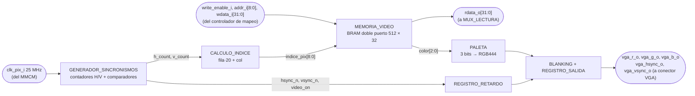
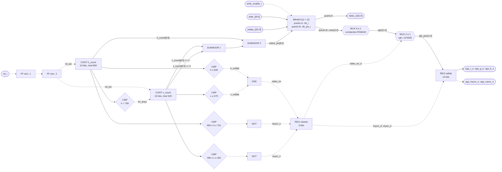

# PERIFERICO_VGA

> **Estado:** propuesta de diseño. La rama `feature/VGA` todavía no contiene RTL; los nombres de
> señales y bloques de esta ficha son los que se usarán al implementarlo.

## a) Nombre del módulo

PERIFERICO_VGA

## b) Diagrama modular



## c) Objetivo del módulo

Genera la imagen del Jugador 1 en un monitor VGA de 640 × 480 a 60 Hz a partir de un mapa de
casillas (*tiles*) que el procesador escribe con `sw`. Es el único bloque del diseño que toca los
pines del conector VGA de la Basys 3.

A diferencia de los demás periféricos no tiene registros de control: se comporta como una
**memoria de video** mapeada en `0x0001_1000`–`0x0001_17FF`, con una palabra de 32 bits por
casilla de una cuadrícula de 20 × 15 casillas de 32 × 32 píxeles (sección 4.5.1 del enunciado).

No sabe nada del juego. No conoce tableros, turnos ni barcos. Pinta en cada casilla el color que
el programa escribió en su palabra, 60 veces por segundo, y nada más.

---

## d) Entradas

- `clk_i`, reloj del sistema de 100 MHz. Sincroniza el puerto del CPU.
- `rst_i`, reinicio del sistema. Solo reinicia la lógica de barrido; no borra la memoria de video.
- `clk_pix_i`, reloj de píxel de 25 MHz, desde el MMCM del top.
- `write_enable_i`, habilitación de escritura, desde el controlador de mapeo (`we_o && sel_vga`).
- `addr_i[8:0]`, índice de palabra, desde el controlador de mapeo (`DataAddress_o[10:2]`).
- `wdata_i[31:0]`, palabra de la casilla, desde el controlador de mapeo (`DataOut_o`).

`addr_i` es de 9 bits y no de 2 como en los periféricos de registros. El enunciado permite esta
excepción para el VGA (sección 4.5.5), y 9 bits son justo los que indexan las 512 palabras del
rango reservado. Las demás señales del bus conservan los nombres de la interfaz estándar.

---

## e) Salidas

- `rdata_o[31:0]`, palabra de la casilla apuntada por `addr_i`, hacia `MUX_LECTURA`.
- `vga_hsync_o`, sincronismo horizontal, activo en bajo.
- `vga_vsync_o`, sincronismo vertical, activo en bajo.
- `vga_r_o[3:0]`, `vga_g_o[3:0]`, `vga_b_o[3:0]`, canales de color hacia el DAC R-2R de la Basys 3.

---

## f) Relación con otros módulos

Hacia adentro del sistema habla con el **controlador de mapeo**. El controlador compara
`DataAddress_o[31:11]` con `0x00022` para generar `sel_vga`, habilita la escritura con
`we_o && sel_vga` y le pasa `DataAddress_o[10:2]` como `addr_i`. En una lectura, `rdata_o` entra
al `MUX_LECTURA` del controlador y de ahí a `DataIn_i` del procesador. El VGA no necesita árbitro
porque el procesador es su único maestro.

Recibe `clk_pix_i` del **MMCM** del top, que también genera el reloj del sistema, así que los dos
relojes están relacionados en fase.

Hacia afuera es el único módulo conectado al conector VGA.

La división de trabajo con el programa en ensamblador es:

- El **programa** decide **qué** se ve: qué color va en cada casilla, dónde está el cursor, qué
  muestra el HUD, y en particular que nunca se escriba el color de barco en las casillas del
  tablero del Jugador 2.
- El **periférico** decide **cómo** se ve: temporización, barrido, conversión del código de color
  a RGB y *blanking*.

---

## g) Explicación de funcionamiento

El periférico tiene dos lados que solo comparten la memoria de video.

**Lado del CPU (100 MHz).** Para pintar una casilla, el programa calcula
`0x0001_1000 + (fila × 20 + col) × 4` y ejecuta un `sw`. La palabra queda guardada en el mismo
ciclo, sin bits de `start` ni espera de `busy`, como pide el enunciado. Borrar la pantalla es un
lazo de software que escribe el color de fondo en las 300 casillas.

**Lado del monitor (25 MHz).** Dos contadores recorren sin parar las 800 × 525 posiciones de un
cuadro, incluidas las de borrado. En cada ciclo, la posición actual se convierte en el índice de
su casilla y se lee esa palabra de la memoria. El código de color pasa por la paleta y sale hacia
los pines junto con los sincronismos. Fuera del área visible la salida se fuerza a negro.

Un cambio escrito por el CPU aparece en pantalla en el siguiente cuadro, a lo sumo 16,7 ms
después. Para la percepción del jugador es instantáneo.

---

## h) Diseño

### Formato de la palabra de casilla

| Bits | Nombre | Uso |
|---|---|---|
| `[2:0]` | `color` | Código de color de la casilla, entra a la paleta |
| `[7:3]` | — | Reservado. Queda disponible para códigos de carácter si se agrega texto al HUD |
| `[31:8]` | — | Reservado. Se escribe en 0 |

Los bits reservados se guardan en la memoria (se leen de vuelta con `lw`) pero el barrido los
ignora.

### Paleta (propuesta)

| `color` | Uso | RGB444 |
|---|---|---|
| `000` | Agua | `0x04A` |
| `001` | Barco propio | `0x888` |
| `010` | Impacto | `0xF00` |
| `011` | Fallo | `0xFFF` |
| `100` | Cursor | `0xFF0` |
| `101` | Fondo y separadores del HUD | `0x000` |
| `110` | Indicador de turno Jugador 1 | `0x0F0` |
| `111` | Indicador de turno Jugador 2 | `0xF0F` |

Los cuatro primeros son los que exige el enunciado. Los colores concretos pueden ajustarse al
probar en el monitor sin cambiar nada más del diseño.

### Temporización 640 × 480 @ 60 Hz

| Parámetro | Horizontal (píxeles) | Vertical (líneas) |
|---|---|---|
| Área visible | 0–639 | 0–479 |
| *Front porch* | 640–655 (16) | 480–489 (10) |
| Pulso de sincronismo | 656–751 (96) | 490–491 (2) |
| *Back porch* | 752–799 (48) | 492–524 (33) |
| Total | 800 | 525 |
| Polaridad del sincronismo | negativa | negativa |

Con 25 MHz, 25 000 000 / (800 × 525) ≈ 59,52 Hz. La diferencia con los 59,94 Hz del estándar
(reloj de 25,175 MHz) está dentro de la tolerancia de los monitores.

De ahí salen las señales del barrido:

```
h_visible = (h_count <= 639)
v_visible = (v_count <= 479)
video_on  = h_visible & v_visible
hsync_n   = ~((h_count >= 656) & (h_count <= 751))
vsync_n   = ~((v_count >= 490) & (v_count <= 491))
fin_linea = (h_count == 799)
```

`CONTADOR_H` incrementa en cada ciclo de `clk_pix_i` y vuelve a 0 después de 799. `CONTADOR_V`
solo incrementa cuando `fin_linea = 1` y vuelve a 0 después de 524. Los dos son de 10 bits.

### Resolución de la cuadrícula

Se usa la cuadrícula de 20 × 15 casillas de 32 × 32 píxeles que sugiere el enunciado:

- **Cabe en la memoria.** 20 × 15 = 300 palabras ≤ 512. Con casillas de 16 × 16 serían 40 × 30 =
  1200 palabras, y no caben en el rango de `0x0001_1000`–`0x0001_17FF`.
- **No necesita divisor.** Dividir entre 32 es tomar los bits altos de cada contador:
  `col = h_count[9:5]` (0–19) y `fila = v_count[8:5]` (0–14).
- **Alcanza para el juego.** Los dos tableros de 8 × 8 ocupan 16 columnas; quedan 4 columnas para
  bordes y separación, y 7 filas para el HUD.

Distribución propuesta de la pantalla:

```
col:   0   1 ........ 8   9  10  11 ....... 18  19
fila 0      HUD: fase de la partida
fila 1      HUD: turno activo (colores 110 / 111)
fila 2
fila 3-10  borde  tablero J1 (propio)  sep.  tablero J2 (rival)  borde
fila 11
fila 12-14  HUD: resultado de la partida
```

### Cálculo del índice

```
indice_pix = fila × 20 + col = {fila, 4'b0000} + {fila, 2'b00} + col
```

La multiplicación por 20 se reduce a dos desplazamientos cableados y dos sumadores de 9 bits. El
máximo en el área visible es 14 × 20 + 19 = 299. Fuera del área visible el índice puede apuntar a
cualquier palabra, pero ese dato se descarta con `video_on`. El programa usa la misma fórmula,
también con desplazamientos, porque `rv32i` no tiene `mul`.

### Memoria de doble puerto y cruce de dominios

`MEMORIA_VIDEO` es una BRAM de doble puerto verdadero de 512 × 32 bits, que Vivado infiere a
partir de un arreglo `logic [31:0] mem [0:511]` accedido desde dos `always_ff` con relojes
distintos:

| Puerto | Reloj | Acceso | Señales |
|---|---|---|---|
| A | `clk_i` | lectura y escritura | `write_enable_i`, `addr_i`, `wdata_i`, `rdata_o` |
| B | `clk_pix_i` | solo lectura | `indice_pix`, `color` |

El arreglo de la BRAM es el único punto donde se cruzan los dominios. No hay señales de control
que crucen de un reloj al otro, así que no hacen falta sincronizadores para los datos. Si el
barrido lee una casilla en el mismo ciclo en que el CPU la escribe, esa casilla puede verse
incorrecta durante un solo cuadro. No afecta al juego, porque el estado de los tableros vive en
la RAM de datos y la memoria de video es solo su representación.

La única señal que cruza de dominio es el reinicio. `rst_i` pasa por un `SINCRONIZADOR_RESET` de
dos *flip-flops* en `clk_pix_i` y sale como `rst_pix`, que reinicia los contadores del barrido.

### Alineación de la salida

La lectura del puerto B tarda un ciclo, así que las señales de control del mismo píxel se retrasan
lo mismo para que lleguen alineadas con su color:

| Ciclo de `clk_pix_i` | Camino de color | Camino de control |
|---|---|---|
| t | contadores → `indice_pix` | contadores → `hsync_n`, `vsync_n`, `video_on` |
| t + 1 | BRAM entrega `color` → paleta → *blanking* | `REGISTRO_RETARDO` entrega `*_d` |
| t + 2 | `REGISTRO_SALIDA` → `vga_r/g/b_o` | `REGISTRO_SALIDA` → `vga_hsync_o`, `vga_vsync_o` |

Los dos caminos tienen la misma latencia de 2 ciclos. Sin `REGISTRO_RETARDO` la imagen quedaría
corrida un píxel respecto a los sincronismos. `REGISTRO_SALIDA` además evita que los *glitches*
de la paleta y el multiplexor lleguen a los pines.

### Lectura desde el CPU

`rdata_o` sale del puerto A. La lectura de la BRAM es síncrona, así que el dato está disponible
un ciclo después de presentar la dirección, igual que en la RAM de datos. En un procesador
uniciclo el `lw` necesita el dato en el mismo ciclo, y ese problema se resolverá con el mismo
mecanismo para la RAM y el VGA al integrar el procesador. Mientras tanto, el programa mantiene el
estado de los tableros en RAM y no depende de leer la memoria de video.

### Latches

La paleta, el cálculo del índice, los comparadores y el *blanking* son `always_comb` o `assign`
con todas sus salidas asignadas en cada camino (la paleta con un `case` completo de 8 entradas).
Los contadores y registros están en `always_ff` con reinicio síncrono.

---

## i) Diagrama esquemático detallado del diseño



Las líneas continuas llevan datos y las punteadas llevan control. `clk_pix_i` entra a los dos
*flip-flops* del sincronizador, a los contadores, a los registros y al puerto B de la BRAM; `clk_i`
entra al puerto A. No se dibujan para mantener legible el diagrama. Los comparadores contra
constantes no se dibujan por compuertas; en la FPGA son árboles de LUT.

---

## j) Diagrama completo de conexiones del diseño

Este módulo tiene puertos físicos propios, así que lleva restricciones de pin en
`src/fpga/basys3.xdc`, todas con `IOSTANDARD LVCMOS33`:

| Puerto | Pin Basys 3 | Señal del conector |
|---|---|---|
| `vga_r_o[0]` | G19 | `vgaRed[0]` |
| `vga_r_o[1]` | H19 | `vgaRed[1]` |
| `vga_r_o[2]` | J19 | `vgaRed[2]` |
| `vga_r_o[3]` | N19 | `vgaRed[3]` |
| `vga_g_o[0]` | J17 | `vgaGreen[0]` |
| `vga_g_o[1]` | H17 | `vgaGreen[1]` |
| `vga_g_o[2]` | G17 | `vgaGreen[2]` |
| `vga_g_o[3]` | D17 | `vgaGreen[3]` |
| `vga_b_o[0]` | N18 | `vgaBlue[0]` |
| `vga_b_o[1]` | L18 | `vgaBlue[1]` |
| `vga_b_o[2]` | K18 | `vgaBlue[2]` |
| `vga_b_o[3]` | J18 | `vgaBlue[3]` |
| `vga_hsync_o` | P19 | `Hsync` |
| `vga_vsync_o` | R19 | `Vsync` |

Conexiones propuestas en `src/design/top.sv`, instancia `u_periferico_vga`:

- `clk_i`, al reloj del sistema que entrega el MMCM a partir del oscilador de 100 MHz (pin W5).
- `clk_pix_i`, a la salida de 25 MHz del mismo MMCM.
- `rst_i`, al reinicio general del sistema, combinado con `locked` del MMCM.
- `write_enable_i`, `addr_i[8:0]`, `wdata_i[31:0]`, desde el controlador de mapeo.
- `rdata_o[31:0]`, hacia `MUX_LECTURA` del controlador de mapeo.
- `vga_r_o`, `vga_g_o`, `vga_b_o`, `vga_hsync_o`, `vga_vsync_o`, a los puertos del top con el
  mismo nombre.

Igual que en los demás módulos, el diagrama por chips que pide el método no aplica a un diseño
que se sintetiza dentro de una sola FPGA, y esta lista de puertos es el reemplazo propuesto.

---

## Verificación (plan)

Se propone un testbench autoverificable `src/sim/tb_periferico_vga.sv`, con los dos relojes a sus
frecuencias reales (100 MHz y 25 MHz), que compruebe:

- Después del reinicio, `h_count` y `v_count` arrancan en 0.
- Una línea dura 800 ciclos de `clk_pix_i` y un cuadro 800 × 525.
- `vga_hsync_o` está en bajo exactamente 96 ciclos por línea, empezando en el píxel 656 más los 2
  ciclos de latencia; `vga_vsync_o` está en bajo exactamente 2 líneas por cuadro, empezando en la
  línea 490.
- Fuera del área visible `vga_r_o`, `vga_g_o` y `vga_b_o` valen 0.
- Una palabra escrita por el puerto A con `color = 010` en la casilla (fila 3, col 5) aparece como
  `0xF00` exactamente en los píxeles `h = 160…191`, `v = 96…127`, y en ningún otro.
- Una escritura con `write_enable_i = 0` no modifica la memoria.
- Una palabra escrita se lee de vuelta completa por `rdata_o`, incluidos los bits reservados.
- Los 8 códigos de color producen los 8 valores de la paleta.

Además, `make synth` debe pasar sin `Latch inferred` para `periferico_vga`, y el reporte de
*timing* debe cerrar en los dos dominios de reloj.
