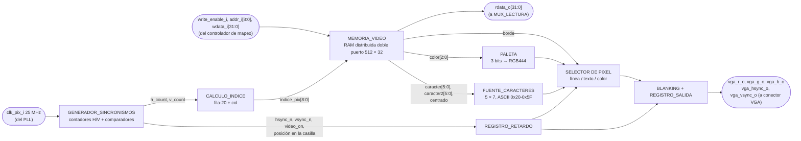
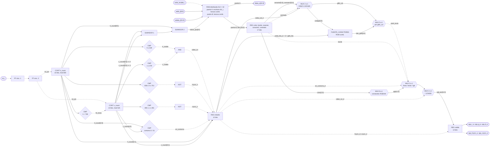

# PERIFERICO_VGA

> **Estado:** implementado en `src/design/periferico_vga.sv`, con la fuente de caracteres en
> `src/design/fuente_caracteres.sv` ([`FUENTE_CARACTERES.md`](FUENTE_CARACTERES.md)). Verificado con
> `src/sim/tb_periferico_vga.sv` (28 pruebas) y dentro del sistema completo con `src/sim/tb_top.sv`.
> Instanciado en `src/design/top.sv` y probado en la Basys 3.

## a) Nombre del módulo

PERIFERICO_VGA

## b) Diagrama modular


```mermaid
flowchart LR
    IN_BUS(["write_enable_i, addr_i[8:0], wdata_i[31:0]<br/>(del controlador de mapeo)"]) --> MEM["MEMORIA_VIDEO<br/>RAM distribuida doble puerto 512 × 32"]
    MEM --> OUT_RD(["rdata_o[31:0]<br/>(a MUX_LECTURA)"])

    IN_PIX(["clk_pix_i 25 MHz<br/>(del PLL)"]) --> SYNC["GENERADOR_SINCRONISMOS<br/>contadores H/V + comparadores"]
    SYNC -->|"h_count, v_count"| IDX["CALCULO_INDICE<br/>fila·20 + col"]
    IDX -->|"indice_pix[8:0]"| MEM
    MEM -->|"color[2:0]"| PAL["PALETA<br/>3 bits → RGB444"]
    MEM -->|"caracter[5:0], caracter2[5:0],<br/>centrado"| FUE["FUENTE_CARACTERES<br/>5 × 7, ASCII 0x20-0x5F"]
    MEM -->|"borde"| SEL
    SYNC -->|"hsync_n, vsync_n, video_on,<br/>posición en la casilla"| RET["REGISTRO_RETARDO"]
    PAL --> SEL["SELECTOR DE PIXEL<br/>línea / texto / color"]
    FUE --> SEL
    SEL --> SAL["BLANKING + REGISTRO_SALIDA"]
    RET --> SEL
    RET --> SAL
    SAL --> OUT_VGA(["vga_r_o, vga_g_o, vga_b_o<br/>vga_hsync_o, vga_vsync_o (a conector VGA)"])
```

## c) Objetivo del módulo

Genera la imagen del Jugador 1 en un monitor VGA de 640 × 480 a 60 Hz a partir de un mapa de
casillas (*tiles*) que el procesador escribe con `sw`. Es el único bloque del diseño que toca los
pines del conector VGA de la Basys 3.

A diferencia de los demás periféricos no tiene registros de control: se comporta como una
**memoria de video** mapeada en `0x0001_1000`–`0x0001_17FF`, con una palabra de 32 bits por
casilla de una cuadrícula de 20 × 15 casillas de 32 × 32 píxeles (sección 4.5.1 del enunciado).

No sabe nada del juego. No conoce tableros, turnos ni barcos. Pinta en cada casilla lo que el
programa escribió en su palabra, 60 veces por segundo, y nada más: un color de fondo, si lleva o no
la línea del grid y, si se pidió, hasta dos letras o números encima, o uno solo centrado.

---

## d) Entradas

- `clk_i`, reloj del sistema, el mismo del procesador. Sincroniza las escrituras del CPU. El
  periférico no depende de su frecuencia.
- `rst_i`, reinicio del sistema. Solo reinicia la lógica de barrido; no borra la memoria de video.
  Tiene que durar al menos dos periodos de `clk_pix_i` (80 ns) para que el sincronizador lo vea;
  el reinicio del botón y el `locked` del PLL duran mucho más que eso.
- `clk_pix_i`, reloj de píxel de 25 MHz, desde el PLL del top.
- `write_enable_i`, habilitación de escritura, desde el controlador de mapeo (`we_o && sel_vga`).
- `addr_i[8:0]`, índice de palabra, desde el controlador de mapeo (`DataAddress_o[10:2]`).
- `wdata_i[31:0]`, palabra de la casilla, desde el controlador de mapeo (`DataOut_o`).

`addr_i` es de 9 bits y no de 2 como en los periféricos de registros. El enunciado permite esta
excepción para el VGA (sección 4.5.5), y 9 bits son justo los que indexan las 512 palabras del
rango reservado. Las demás señales del bus conservan los nombres de la interfaz estándar.

---

## e) Salidas

- `rdata_o[31:0]`, palabra de la casilla apuntada por `addr_i`, hacia `MUX_LECTURA`.
- `vga_hsync_o`, sincronismo horizontal, activo en bajo.
- `vga_vsync_o`, sincronismo vertical, activo en bajo.
- `vga_r_o[3:0]`, `vga_g_o[3:0]`, `vga_b_o[3:0]`, canales de color hacia el DAC R-2R de la Basys 3.

---

## f) Relación con otros módulos

Hacia adentro del sistema habla con el **controlador de mapeo**. El controlador compara
`DataAddress_o[31:11]` con `0x00022` para generar `sel_vga`, habilita la escritura con
`we_o && sel_vga` y le pasa `DataAddress_o[10:2]` como `addr_i`. En una lectura, `rdata_o` entra
al `MUX_LECTURA` del controlador y de ahí a `DataIn_i` del procesador. El VGA no necesita árbitro
porque el procesador es su único maestro.

Recibe `clk_pix_i` del **PLL** del top, que también genera el reloj del sistema, así que los dos
relojes están relacionados en fase.

Hacia afuera es el único módulo conectado al conector VGA.

La división de trabajo con el programa en ensamblador es:

- El **programa** decide **qué** se ve: qué color y qué letra van en cada casilla, cuáles llevan
  la línea del grid, dónde está el cursor, qué dice el HUD, y en particular que nunca se escriba el
  color de barco en las casillas del tablero del Jugador 2.
- El **periférico** decide **cómo** se ve: temporización, barrido, conversión del código de color
  a RGB, la forma de las letras, el grosor de la línea y *blanking*.

Para cambiar la distribución de la pantalla, los textos o qué color significa qué, se cambia el
programa. Para cambiar un color de la paleta, la forma de una letra o agregar un carácter, se
cambia el periférico.

---

## g) Explicación de funcionamiento

El periférico tiene dos lados que solo comparten la memoria de video.

**Lado del CPU (33,33 MHz).** Para pintar una casilla, el programa calcula
`0x0001_1000 + (fila × 20 + col) × 4` y ejecuta un `sw`. La palabra queda guardada en el mismo
ciclo, sin bits de `start` ni espera de `busy`, como pide el enunciado. Borrar la pantalla es un
lazo de software que escribe el color de fondo en las 300 casillas.

**Lado del monitor (25 MHz).** Dos contadores recorren sin parar las 800 × 525 posiciones de un
cuadro, incluidas las de borrado. En cada ciclo, la posición actual se convierte en el índice de
su casilla y se lee esa palabra de la memoria. Con la palabra y la posición del píxel dentro de la
casilla se decide el color del píxel: negro si cae en el contorno de una casilla con borde, el
color del texto si cae en un punto encendido de la letra, y si no el color de fondo de la casilla
pasado por la paleta. Sale hacia los pines junto con los sincronismos. Fuera del área visible la
salida se fuerza a negro.

Un cambio escrito por el CPU aparece en pantalla en el siguiente cuadro, a lo sumo 16,7 ms
después. Para la percepción del jugador es instantáneo.

---

## h) Diseño

### Formato de la palabra de casilla

| Bits | Nombre | Uso |
|---|---|---|
| `[2:0]` | `color` | Color de fondo de la casilla, entra a la paleta |
| `[3]` | `borde` | En 1, la casilla lleva una línea negra de 1 píxel en su contorno |
| `[9:4]` | `caracter` | Carácter de la mitad izquierda de la casilla, en ASCII − 32. `0` es espacio, sin carácter |
| `[15:10]` | `caracter2` | Carácter de la mitad derecha, con el mismo código |
| `[16]` | `centrado` | En 1, se dibuja solo `caracter`, en el centro de la casilla, y `caracter2` se ignora |
| `[31:17]` | Reservado | Se escribe en 0 |

Los bits reservados se guardan en la memoria (se leen de vuelta con `lw`) pero el barrido los
ignora. Una palabra con solo `color` se ve como un bloque de color sólido.

El enunciado sugiere los bits `[7:3]` para códigos de carácter. Se usan `[9:4]` porque 5 bits dan
32 símbolos y el HUD necesita 36 (letras y dígitos), y porque así el bit 3 queda para el borde.
Con el código en ASCII − 32 el ensamblador calcula los códigos sin tabla ('A' − 32 = 33).

Dos caracteres por casilla dan 40 por fila de pantalla, y con eso entran en una sola fila los
mensajes que necesita el HUD, como `APUNTE CON FLECHAS Y DISPARE CON SW0`. Con uno por casilla
habría 20 por fila y los mensajes tendrían que partirse en abreviaturas. El bit `centrado` sirve
para lo que va de a un carácter por casilla, como las letras de columna y los números de fila de
los tableros, que así quedan alineados con la casilla que nombran.

### Paleta

| `color` | Uso | RGB444 |
|---|---|---|
| `000` | Agua | `0x04A` |
| `001` | Barco propio | `0x888` |
| `010` | Impacto | `0xF00` |
| `011` | Fallo | `0xFFF` |
| `100` | Cursor | `0xFF0` |
| `101` | Fondo y separadores del HUD | `0x000` |
| `110` | Indicador de turno Jugador 1 | `0x0F0` |
| `111` | Indicador de turno Jugador 2 | `0xF0F` |

Los cuatro primeros son los que exige el enunciado. Los colores concretos pueden ajustarse al
probar en el monitor sin cambiar nada más del diseño, salvo la copia de la paleta que tiene el
testbench.

El texto no tiene color propio. Sale en negro sobre los fondos claros (`011` blanco, `100`
amarillo, `110` verde) y en blanco sobre el resto, así siempre contrasta con su casilla y el
programa no gasta bits en elegirlo.

Los códigos `000` a `011` coinciden con los estados de casilla que el programa guarda en RAM (bits
`[1:0]`, ver [`nivel03.md`](../diagramas/nivel03.md)), y el programa pinta el tablero propio
copiando ese estado tal cual. Si se cambia el orden de esos cuatro códigos, hay que cambiar también
la codificación del tablero en RAM.

### Temporización 640 × 480 @ 60 Hz

| Parámetro | Horizontal (píxeles) | Vertical (líneas) |
|---|---|---|
| Área visible | 0–639 | 0–479 |
| *Front porch* | 640–655 (16) | 480–489 (10) |
| Pulso de sincronismo | 656–751 (96) | 490–491 (2) |
| *Back porch* | 752–799 (48) | 492–524 (33) |
| Total | 800 | 525 |
| Polaridad del sincronismo | negativa | negativa |

Con 25 MHz, 25 000 000 / (800 × 525) ≈ 59,52 Hz. La diferencia con los 59,94 Hz del estándar
(reloj de 25,175 MHz) está dentro de la tolerancia de los monitores.

De ahí salen las señales del barrido:

```
h_visible = (h_count <= 639)
v_visible = (v_count <= 479)
video_on  = h_visible & v_visible
hsync_n   = ~((h_count >= 656) & (h_count <= 751))
vsync_n   = ~((v_count >= 490) & (v_count <= 491))
fin_linea = (h_count == 799)
```

`CONTADOR_H` incrementa en cada ciclo de `clk_pix_i` y vuelve a 0 después de 799. `CONTADOR_V`
solo incrementa cuando `fin_linea = 1` y vuelve a 0 después de 524. Los dos son de 10 bits.

### Resolución de la cuadrícula

Se usa la cuadrícula de 20 × 15 casillas de 32 × 32 píxeles que sugiere el enunciado:

- **Cabe en la memoria.** 20 × 15 = 300 palabras ≤ 512. Con casillas de 16 × 16 serían 40 × 30 =
  1200 palabras, y no caben en el rango de `0x0001_1000`–`0x0001_17FF`.
- **No necesita divisor.** Dividir entre 32 es tomar los bits altos de cada contador:
  `col = h_count[9:5]` (0–19) y `fila = v_count[8:5]` (0–14).
- **Alcanza para el juego.** Los dos tableros de 8 × 8 ocupan 16 columnas. Quedan 4 columnas para
  los números de fila y la separación, y 7 filas para el HUD.

Distribución de la pantalla que usa el programa (la decide el programa, no el periférico):

```
col:      0   1 ........ 8   9  10  11 ....... 18  19
fila 0        vacía
fila 1          JUGADOR 1                 JUGADOR 2           títulos
fila 2        barras de estado: COLOCANDO / LISTO, TURNO DEL JUGADOR n, GANA EL JUGADOR n
fila 3        A B C D E F G H       A B C D E F G H        letras de columna, centradas
fila 4-11 1-8 tablero J1 (propio)  1-8 tablero J2 (rival)  con borde, números centrados
fila 12       mensaje de traspaso: J1 COLOCA CON BOTONES Y J2 DESDE LA PC /
              APUNTE CON FLECHAS Y DISPARE CON SW0 / ESPERANDO EL DISPARO DEL JUGADOR 2
fila 13       PARTIDAS GANADAS   J1 00   J2 00
fila 14       vacía
```

Las filas 0 y 14 quedan vacías porque muchos monitores esconden unos píxeles del borde de la
imagen. Al terminar la partida las filas 2 y 12 se pintan del color del ganador, con
`GANA EL JUGADOR n` y `SUBA Y BAJE SW15 PARA OTRA PARTIDA`. El detalle está en
[`PROGRAMA.md`](PROGRAMA.md).

### Borde de casilla

Una casilla con `borde = 1` lleva negro en su primer y último píxel de cada eje. Como
dividir entre 32 es tomar los bits altos, la posición dentro de la casilla son los 5 bits bajos de
los contadores:

```
en_contorno = (h_count[4:0] == 0) | (h_count[4:0] == 31) | (v_count[4:0] == 0) | (v_count[4:0] == 31)
```

Cada casilla dibuja su propio contorno, así que entre dos casillas con borde la línea queda de
2 píxeles y en el contorno exterior de un tablero de 1. El programa lo enciende en las 128 casillas
de los tableros y lo deja apagado en el HUD, por eso los tableros se ven como un grid y el resto
de la pantalla no.

### Caracteres

Cada casilla se divide en una cuadrícula de 16 × 16 celdas de 2 × 2 píxeles:

```
celda_col  = h_count[4:1]   (0-15)
celda_fila = v_count[4:1]   (0-15)
```

El glifo de 5 × 7 de [`FUENTE_CARACTERES`](FUENTE_CARACTERES.md) se dibuja con cada punto en una
celda, así que mide 10 × 14 píxeles. Va en las filas de celda 5 a 11 (píxeles 10 a 23 de la
casilla), centrado en vertical. En horizontal depende de `centrado`:

| `centrado` | Carácter | Columnas de celda del glifo | Columna del glifo |
|---|---|---|---|
| 0, mitad izquierda (`celda_col` 0 a 7) | `caracter` | 1 a 5 | `celda_col[2:0] − 1` |
| 0, mitad derecha (`celda_col` 8 a 15) | `caracter2` | 9 a 13 | `celda_col[2:0] − 1` |
| 1 | `caracter` | 5 a 9 (píxeles 10 a 19) | `celda_col − 5` |

Cada mitad deja una celda libre antes del glifo y dos después, así que dos letras seguidas, en la
misma casilla o en casillas vecinas, quedan separadas y se leen como una palabra. El píxel es de
texto cuando

```
glifo_fila  = celda_fila − 5
pixel_texto = (0 <= glifo_col <= 4) & (0 <= glifo_fila <= 6) & bits_glifo[4 − glifo_col]
```

donde `bits_glifo` es la fila `glifo_fila` del carácter elegido. Las dos restas se hacen en 4 bits
sin signo: si la celda queda antes del glifo, la resta da la vuelta a un número grande y la
comparación con 4 (o con 6) la descarta, sin comparar contra el inicio. Con código 0 (espacio) la
fuente da todo en cero y esa mitad queda del color de la casilla.

### Prioridad del píxel

En el área visible, de mayor a menor prioridad:

1. Contorno de una casilla con borde → `0x000`.
2. Punto encendido de la letra → `0x000` sobre fondo claro, `0xFFF` sobre el resto.
3. Color de fondo de la casilla por la paleta.

Fuera del área visible, `0x000`.

### Cálculo del índice

```
indice_pix = fila × 20 + col = {fila, 4'b0000} + {fila, 2'b00} + col
```

La multiplicación por 20 se reduce a dos desplazamientos cableados y dos sumadores de 9 bits. El
máximo en el área visible es 14 × 20 + 19 = 299. Fuera del área visible el índice puede apuntar a
cualquier palabra, pero ese dato se descarta con `video_on`. El programa usa la misma fórmula,
también con desplazamientos, porque `rv32i` no tiene `mul`.

### Memoria de doble puerto y cruce de dominios

`MEMORIA_VIDEO` es un arreglo `logic [31:0] memoria_video [0:511]` con un puerto de escritura y
dos de lectura:

| Puerto | Reloj | Acceso | Señales |
|---|---|---|---|
| A | `clk_i` | escritura síncrona, lectura combinacional | `write_enable_i`, `addr_i`, `wdata_i`, `rdata_o` |
| B | `clk_pix_i` | solo lectura, registrada en `color`, `borde`, `caracter`, `caracter2` y `centrado` | `indice_pix`, `color`, `borde`, `caracter`, `caracter2`, `centrado` |

El puerto A se lee de forma combinacional porque así lee el núcleo su RAM de datos. El procesador
es el núcleo de ciclo único de riscv-simple-sv, cuya memoria de ejemplo (`example_data_memory`)
hace `assign q = mem[address]`: un `lw` presenta la dirección y espera el dato en el mismo ciclo.
Una BRAM no puede hacer eso, porque su lectura siempre pasa por un registro, así que la memoria de
video se implementa como **RAM distribuida** (LUTRAM). El puerto B lee la misma memoria de forma
combinacional y registra el resultado con `clk_pix_i`. Ese registro es lo que lo deja sincronizado
al reloj de píxel, como pide la sección 4.5.1.

Con `synth_xilinx` de yosys la memoria queda en 128 primitivas `RAM128X1D`, que ocupan 512 LUT de
tipo SLICEM, cerca del 2,5 % de las 20 800 LUT de la XC7A35T. Cada `RAM128X1D` trae un puerto de
lectura y escritura y uno de solo lectura, que son justo los dos puertos del diseño. La memoria
arranca en ceros (agua en toda la pantalla) porque el arreglo tiene valor inicial, que en la FPGA
se carga con la configuración.

La memoria es el único punto donde se cruzan los dominios. No hay señales de control que crucen
de un reloj al otro, así que no hacen falta sincronizadores para los datos. Si el barrido lee una
casilla justo cuando el CPU la escribe, los píxeles leídos en ese instante pueden salir con un
color equivocado durante un solo cuadro. No afecta al juego, porque el estado de los tableros vive
en la RAM de datos y la memoria de video es solo su representación. Por la misma razón, si al
cerrar *timing* el camino de la escritura en `clk_i` al registro `color` en `clk_pix_i` falla por
la relación entre las dos frecuencias, se puede declarar como falso camino.

La única señal que cruza de dominio es el reinicio. `rst_i` pasa por un `SINCRONIZADOR_RESET` de
dos *flip-flops* en `clk_pix_i` y sale como `rst_pix`, que reinicia los contadores del barrido.

### Alineación de la salida

La lectura del puerto B tarda un ciclo, así que las señales de control del mismo píxel se retrasan
lo mismo para que lleguen alineadas con su color:

| Ciclo de `clk_pix_i` | Camino de color | Camino de control |
|---|---|---|
| t | contadores → `indice_pix` | contadores → `hsync_n`, `vsync_n`, `video_on`, `en_contorno`, `h_count[4:1]`, `v_count[4:1]` |
| t + 1 | el registro del puerto B entrega `color`, `borde`, `caracter`, `caracter2` y `centrado` → paleta, fuente, selector de píxel → *blanking* | `REGISTRO_RETARDO` entrega `*_d` |
| t + 2 | `REGISTRO_SALIDA` → `vga_r/g/b_o` | `REGISTRO_SALIDA` → `vga_hsync_o`, `vga_vsync_o` |

Los dos caminos tienen la misma latencia de 2 ciclos. Sin `REGISTRO_RETARDO` la imagen quedaría
corrida un píxel respecto a los sincronismos, y la línea y las letras un píxel respecto a su
casilla. La fuente es combinacional y entra en el ciclo t + 1 con el resto del selector, así que
el borde y el texto no agregan latencia. Con el sistema integrado, nextpnr-xilinx da cerca de
92 MHz de máximo para `clk_pix` después del ruteo, contra los 25 MHz que necesita. `REGISTRO_SALIDA` además evita que los *glitches*
de la paleta y el multiplexor lleguen a los pines.

### Lectura desde el CPU

`rdata_o` sale del puerto A sin pasar por ningún registro: cambia en cuanto cambia `addr_i`. Un
`lw` a la memoria de video funciona igual que uno a la RAM de datos y recibe la palabra completa,
con los bits reservados. Aun así, el programa mantiene el estado de los tableros en RAM y no
depende de leer la memoria de video.

### Latches

La paleta, el cálculo del índice, los comparadores, el selector de píxel y el *blanking* son
`always_comb` o `assign` con todas sus salidas asignadas en cada camino (la paleta con un `case`
completo de 8 entradas, la fuente con `default`). Los contadores y los registros de retardo y
salida están en `always_ff` con reinicio síncrono por `rst_pix`. Los registros `color`, `borde`,
`caracter`, `caracter2` y `centrado` y los del sincronizador no lo necesitan. La síntesis con yosys
no reporta ningún `Latch inferred`.

---

## i) Diagrama esquemático detallado del diseño


```mermaid
flowchart LR
    WE(["write_enable_i"]) -.-> MEM["RAM distribuida 512 × 32<br/>puerto A: escritura clk_i, lectura comb.<br/>puerto B: lectura comb."]
    ADDR(["addr_i[8:0]"]) --> MEM
    WDATA(["wdata_i[31:0]"]) --> MEM
    MEM -->|"puerto A"| OUT_RD(["rdata_o[31:0]"])

    RST(["rst_i"]) -.-> FF1["FF sinc. 1"] -.-> FF2["FF sinc. 2"]
    FF2 -.->|"rst_pix"| CH["CONT h_count<br/>10 bits, mod 800"]
    FF2 -.->|"rst_pix"| CV["CONT v_count<br/>10 bits, mod 525"]
    CH --> CMP_FL{"CMP<br/>h = 799"}
    CMP_FL -.->|"fin_linea"| CV

    CH --> CMP_HV{"CMP<br/>h ≤ 639"}
    CH --> CMP_HS{"CMP<br/>656 ≤ h ≤ 751"}
    CV --> CMP_VV{"CMP<br/>v ≤ 479"}
    CV --> CMP_VS{"CMP<br/>490 ≤ v ≤ 491"}
    CMP_HV -.->|"h_visible"| AND_VO["AND"]
    CMP_VV -.->|"v_visible"| AND_VO
    CMP_HS -.-> NOT_H["NOT"]
    CMP_VS -.-> NOT_V["NOT"]

    CH -->|"h_count[9:5]"| SUM2["SUMADOR 2"]
    CV -->|"v_count[8:5] << 4"| SUM1["SUMADOR 1"]
    CV -->|"v_count[8:5] << 2"| SUM1
    SUM1 --> SUM2
    SUM2 -->|"indice_pix[8:0]"| MEM

    AND_VO -.->|"video_on"| REG_RET["REG retardo<br/>12 bits"]
    NOT_H -.->|"hsync_n"| REG_RET
    NOT_V -.->|"vsync_n"| REG_RET

    CH -->|"h_count[4:0]"| CMP_CT{"CMP<br/>contorno 0 / 31"}
    CV -->|"v_count[4:0]"| CMP_CT
    CMP_CT -.->|"en_contorno"| REG_RET
    CH -->|"h_count[4:1]"| REG_RET
    CV -->|"v_count[4:1]"| REG_RET

    MEM -->|"puerto B, bits [16:0]"| REG_COL["REG color, borde, caracter,<br/>caracter2, centrado<br/>17 bits"]
    REG_COL -->|"color[2:0]"| MUX_PAL{{"MUX 8 a 1<br/>constantes RGB444"}}
    REG_COL -->|"caracter[5:0], caracter2[5:0]"| MUX_COD{{"MUX 2 a 1<br/>mitad o centrado"}}
    REG_COL -.->|"centrado"| MUX_COD
    REG_RET -->|"celda_col_d"| MUX_COD
    MUX_COD -->|"codigo[5:0]"| FUE["FUENTE_CARACTERES<br/>ROM comb."]
    MUX_COD -->|"glifo_col"| MUX_BIT
    REG_RET -->|"celda_fila_d − 5 = glifo_fila"| FUE
    FUE -->|"bits_glifo[4:0]"| MUX_BIT{{"MUX 5 a 1<br/>por glifo_col"}}
    MUX_BIT -.->|"pixel_texto"| MUX_SEL{{"MUX 3 a 1<br/>línea / texto / rgb"}}
    REG_COL -.->|"borde"| MUX_SEL
    REG_RET -.->|"en_contorno_d"| MUX_SEL
    MUX_PAL -->|"rgb[11:0]"| MUX_SEL
    MUX_SEL --> MUX_BLK{{"MUX 2 a 1<br/>/ 12'h000"}}
    REG_RET -.->|"video_on_d"| MUX_BLK
    MUX_BLK -->|"rgb_pix[11:0]"| REG_OUT["REG salida<br/>14 bits"]
    REG_RET -.->|"hsync_d, vsync_d"| REG_OUT

    REG_OUT --> OUT_RGB(["vga_r_o, vga_g_o, vga_b_o"])
    REG_OUT -.-> OUT_SYNC(["vga_hsync_o, vga_vsync_o"])
```

Las líneas continuas llevan datos y las punteadas llevan control. `clk_pix_i` entra a los dos
*flip-flops* del sincronizador, a los contadores y a los registros de color, retardo y salida;
`clk_i` entra a la escritura del puerto A. No se dibujan para mantener legible el diagrama. Los comparadores contra
constantes no se dibujan por compuertas; en la FPGA son árboles de LUT.

---

## j) Diagrama completo de conexiones del diseño

Este módulo tiene puertos físicos propios, así que lleva restricciones de pin en
`src/fpga/basys3.xdc`, todas con `IOSTANDARD LVCMOS33`:

| Puerto | Pin Basys 3 | Señal del conector |
|---|---|---|
| `vga_r_o[0]` | G19 | `vgaRed[0]` |
| `vga_r_o[1]` | H19 | `vgaRed[1]` |
| `vga_r_o[2]` | J19 | `vgaRed[2]` |
| `vga_r_o[3]` | N19 | `vgaRed[3]` |
| `vga_g_o[0]` | J17 | `vgaGreen[0]` |
| `vga_g_o[1]` | H17 | `vgaGreen[1]` |
| `vga_g_o[2]` | G17 | `vgaGreen[2]` |
| `vga_g_o[3]` | D17 | `vgaGreen[3]` |
| `vga_b_o[0]` | N18 | `vgaBlue[0]` |
| `vga_b_o[1]` | L18 | `vgaBlue[1]` |
| `vga_b_o[2]` | K18 | `vgaBlue[2]` |
| `vga_b_o[3]` | J18 | `vgaBlue[3]` |
| `vga_hsync_o` | P19 | `Hsync` |
| `vga_vsync_o` | R19 | `Vsync` |

Conexiones en `src/design/top.sv`, instancia `u_periferico_vga`:

- `clk_i`, a `clk_sys`, el reloj del sistema de 33,33 MHz que entrega el PLL a partir del oscilador de 100 MHz (pin W5).
- `clk_pix_i`, a `clk_pix`, la salida de 25 MHz del mismo PLL.
- `rst_i`, al reinicio general del sistema, `~locked` del PLL sincronizado.
- `write_enable_i`, `addr_i[8:0]`, `wdata_i[31:0]`, desde el controlador de mapeo.
- `rdata_o[31:0]`, hacia `MUX_LECTURA` del controlador de mapeo.
- `vga_r_o`, `vga_g_o`, `vga_b_o`, `vga_hsync_o`, `vga_vsync_o`, a los puertos del top con el
  mismo nombre.

Adentro, `u_fuente` es la instancia de `fuente_caracteres`, con `codigo_i` en `codigo` (`caracter`
o `caracter2` según la mitad de la casilla y `centrado`), `fila_i` en `glifo_fila[2:0]` y `bits_o` en
`glifo_bits`.

---

## Verificación

`src/sim/tb_periferico_vga.sv` corre el periférico solo, con los dos relojes a su frecuencia real,
y compara **cada píxel de cuadros completos** contra un modelo que lleva el testbench aparte. El
modelo guarda `[16:0]` de cada palabra escrita y calcula el píxel esperado con la misma prioridad
de la sección h): contorno, texto, paleta. La paleta está escrita de nuevo a mano en el testbench.
La fuente la lee una vez al arrancar de otra instancia de `fuente_caracteres`, para no copiarla, y
se revisa aparte que la `A` coincida con su dibujo hecho a mano y que el espacio no dibuje nada.

Entre las 28 pruebas están la temporización de `hsync` y `vsync`, la lectura combinacional del
puerto A, un cuadro con un impacto en (3, 5) que tiene que ocupar exactamente
`h = 160..191` y `v = 96..127`, un cuadro con los 8 colores y basura aleatoria en los bits `[31:3]`
(eso enciende el borde y el centrado en cerca de la mitad de las casillas, pone caracteres al azar en
las dos mitades de todas y prueba que el barrido ignora `[31:17]`), escrituras a mitad de cuadro y
un reinicio que no borra la memoria.

`src/sim/tb_top.sv` lo prueba dentro del sistema completo con el programa real: que las 128
casillas de los tableros lleven el borde y ninguna otra, y que los textos del HUD digan lo que
tienen que decir en cada fase de una partida completa.

En la Basys 3 se probó primero con `src/design/prueba_vga.sv`, un top sin procesador que llena la
memoria con un patrón fijo (`make bitstream SYNTH_TOP=prueba_vga`), y después con el sistema
completo.
