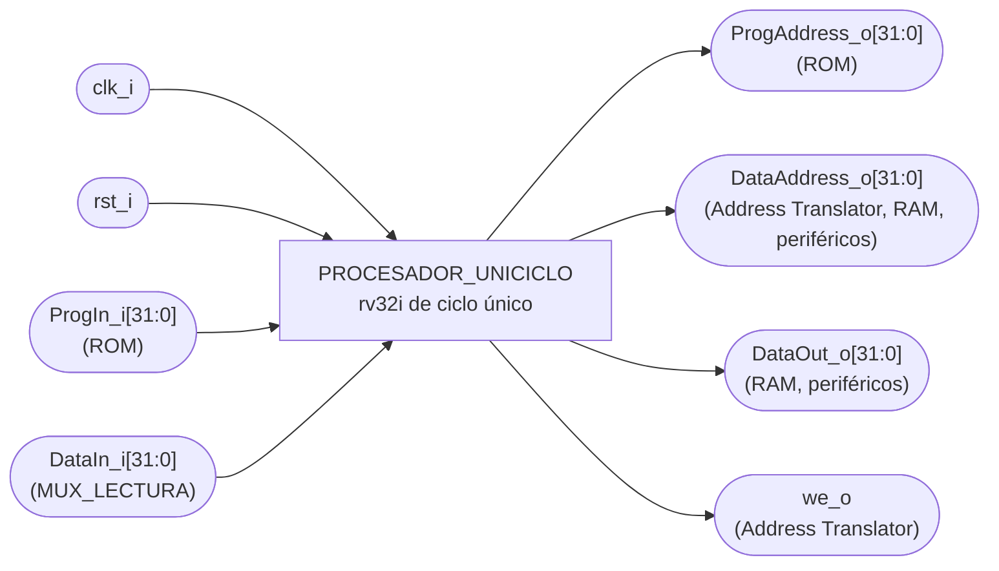
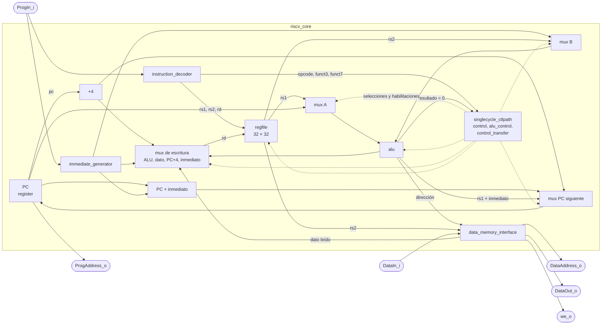

# PROCESADOR_UNICICLO

## a) Nombre del módulo

PROCESADOR_UNICICLO, módulo `procesador_uniciclo` en `src/design/procesador_uniciclo.sv`. Envuelve al
núcleo `riscv_core` de [riscv-simple-sv](https://github.com/tilk/riscv-simple-sv) (versión de ciclo único,
commit `d665812`), cuyos archivos están en `src/design/` con su licencia BSD-3.

## b) Diagrama modular

Es el bloque "Procesador uniciclo" del nivel 2 visto desde afuera, con los mismos puertos de la figura 2 del
enunciado. Lo que tiene adentro está en el inciso i).

## c) Objetivo del módulo

Ejecutar el programa en ensamblador, como pide la sección 4.4.1 del enunciado: un microprocesador de 32 bits,
sintetizable, que implementa las instrucciones de `rv32i` necesarias para el programa, con buses separados de
instrucciones (`ProgAddress_o`, `ProgIn_i`) y de datos (`DataAddress_o`, `DataOut_o`, `DataIn_i`, `we_o`).

El procesador no sabe nada del juego. Todas las reglas están en el programa, y para el procesador la RAM, los
periféricos y la memoria de video son lo mismo: direcciones a las que se les hace `lw` o `sw`.

## d) Entradas

- `clk_i`, reloj del sistema, el mismo de las memorias y los periféricos de registros.
- `rst_i`, reset síncrono, activo en alto. Sale de `~locked` del PLL, sincronizado en `top.sv`.
- `ProgIn_i[31:0]`, instrucción que entrega la ROM para la dirección `ProgAddress_o`.
- `DataIn_i[31:0]`, dato leído por un `lw`, desde `MUX_LECTURA`.

## e) Salidas

- `ProgAddress_o[31:0]`, dirección de la instrucción en curso (el `PC`), hacia la ROM.
- `DataAddress_o[31:0]`, dirección de un `lw` o un `sw`, hacia el Address Translator, la RAM y los
  periféricos.
- `DataOut_o[31:0]`, dato que escribe un `sw`, hacia la RAM y los periféricos.
- `we_o`, en alto durante un `sw`, hacia el Address Translator.

## f) Relación con otros módulos

- **ROM** (`ROM.md`): recibe `ProgAddress_o` y devuelve `ProgIn_i` en el mismo ciclo.
- **Address Translator** (`Address_Translator.md`): recibe `DataAddress_o` y `we_o`, genera la habilitación de
  escritura de cada destino y `mux_sel`.
- **RAM** (`RAM.md`) y **periféricos**: reciben `DataAddress_o` y `DataOut_o` directamente, y escriben solo si
  el AT les habilita la escritura.
- **MUX_LECTURA**: elige qué dato llega a `DataIn_i` según `mux_sel`.

Dentro de `procesador_uniciclo` hay una sola instancia, `riscv_core`, que a su vez arma el camino de datos y el
de control con los módulos del inciso h).

## g) Explicación de funcionamiento

En un procesador de ciclo único cada instrucción empieza y termina entre dos flancos de subida de `clk_i`.
Durante el ciclo la señal recorre todo el camino:

1. El `PC` sale por `ProgAddress_o` y la ROM devuelve la instrucción por `ProgIn_i`.
2. El decodificador separa los campos (`opcode`, `rd`, `rs1`, `rs2`, `funct3`, `funct7`) y el generador de
   inmediatos arma la constante de 32 bits.
3. El banco de registros entrega `rs1` y `rs2`.
4. La ALU opera. En un `lw` o `sw` calcula la dirección (`rs1 + inmediato`), en un salto condicional compara
   `rs1` con `rs2`.
5. En un `lw`, la dirección sale por `DataAddress_o` y el dato vuelve por `DataIn_i` en el mismo ciclo. En un
   `sw`, la dirección y el dato salen por `DataAddress_o` y `DataOut_o` con `we_o` en alto.
6. En el flanco de subida se guardan dos cosas a la vez: el resultado en el registro `rd`, si la instrucción
   escribe uno, y el `PC` siguiente (`PC + 4`, el destino de un salto, o `rs1 + inmediato` en `jalr`).

Por ejemplo, `lw t0, 0x204(s2)` con `s2 = 0x0000_2000`: la ALU suma `0x0000_2000 + 0x204`, `DataAddress_o`
vale `0x0000_2204`, la RAM entrega `turno` por `DataIn_i` y en el flanco `t0` toma ese valor y el `PC` avanza 4.

Después de `rst_i` el `PC` vale `0x0000_0000`, el vector de reset de la sección 4.4.2, y la primera instrucción
que se ejecuta es la primera del programa.

## h) Diseño

### Origen del núcleo

El núcleo es la versión de ciclo único de riscv-simple-sv, un conjunto de núcleos `rv32i` escritos para
enseñanza en un subconjunto de SystemVerilog que entienden yosys, iverilog y Verilator. Está dividido en módulos
chicos y legibles (sumador, ALU, multiplexores, banco de registros) y se verifica con las pruebas oficiales de
RISC-V. Se reutiliza en vez de escribirlo desde cero porque el trabajo del proyecto está en el sistema completo
(programa, periféricos, integración), y un núcleo ya probado reduce el riesgo en la parte más crítica.

Implementa `rv32i` completo salvo las instrucciones de sistema (`ecall`, `ebreak` y los CSR), y trata `fence`
como una instrucción que no hace nada. Cubre la lista base de la sección 4.4.1 y además `lui`, `auipc`, las
cargas y escrituras de byte y media palabra y `bltu`/`bgeu`. El programa usa solo la lista base más `lui`, y
`sw/ensamblar.sh` rechaza cualquier otra instrucción. La extensión de multiplicación y división (`M_MODULE`)
queda apagada.

### Archivos

| Archivo | Contenido |
|---|---|
| `procesador_uniciclo.sv` | Envoltorio con los puertos del enunciado (propio del proyecto) |
| `riscv_core.sv` | Núcleo: une camino de datos, control e interfaz de memoria de datos |
| `singlecycle_datapath.sv` | Camino de datos: `PC`, sumadores, ALU, banco de registros, multiplexores |
| `singlecycle_ctlpath.sv` | Camino de control: une las tres unidades de control |
| `singlecycle_control.sv` | Señales de control según el `opcode` |
| `alu_control.sv` | Operación de la ALU según `funct3` y `funct7` |
| `control_transfer.sv` | Decide si un salto condicional se toma |
| `alu.sv` | Suma, resta, desplazamientos, comparaciones y lógicas |
| `immediate_generator.sv` | Inmediatos de los formatos I, S, B, U y J |
| `instruction_decoder.sv` | Separa los campos de la instrucción |
| `regfile.sv` | 32 registros de 32 bits, `x0` siempre en cero |
| `register.sv` | Registro con reset, usado para el `PC` |
| `data_memory_interface.sv` | Alinea datos y genera habilitaciones por byte |
| `adder.sv`, `multiplexer*.sv` | Bloques genéricos |
| `config.sv`, `constants.sv` | Macros de configuración y constantes de la ISA, incluidas con `` `include `` |
| `LICENSE.riscv-simple-sv` | Licencia BSD-3 del núcleo |

`toplevel.sv` y las memorias de ejemplo (`example_*.sv`) no se traen: la ROM y la RAM son las del proyecto.

### Adaptaciones

Son los únicos cambios al código original, cada uno marcado con un comentario en el archivo.

1. **Vector de reset.** `INITIAL_PC` pasa de `0x0040_0000` a `0x0000_0000` en `config.sv`, como fija la
   sección 4.4.2. Las macros de memorias de ejemplo de ese archivo se quitan porque nada las usa.
2. **Reset síncrono.** `register.sv` usaba `always_ff @(posedge clock or posedge reset)`, y pasa a
   `always_ff @(posedge clock)` con `if (reset)` adentro. Todo el diseño usa reset síncrono, y es el único
   registro del núcleo con reset (el banco de registros no tiene).
3. **Puertos del enunciado.** `procesador_uniciclo.sv` instancia `riscv_core` y renombra sus puertos:

   | `riscv_core` | `procesador_uniciclo` |
   |---|---|
   | `clock` | `clk_i` |
   | `reset` | `rst_i` |
   | `pc` | `ProgAddress_o` |
   | `inst` | `ProgIn_i` |
   | `bus_address` | `DataAddress_o` |
   | `bus_write_data` | `DataOut_o` |
   | `bus_read_data` | `DataIn_i` |
   | `bus_write_enable` | `we_o` |
   | `bus_read_enable`, `bus_byte_enable` | sin conectar |

4. **Licencia.** Los archivos conservan su encabezado de copyright y la licencia completa va en
   `LICENSE.riscv-simple-sv`, como pide la BSD-3.

### Sin habilitaciones por byte

El bus de datos del enunciado no tiene máscara de bytes, así que `bus_byte_enable` queda sin conectar. Para
`lw` y `sw` a direcciones alineadas, que es lo único que usa el programa, `data_memory_interface` no desplaza
nada y el dato pasa entero. Un `sb` o un `sh` escribirían la palabra completa con el dato desplazado, y por eso
el programa no los usa. `bus_read_enable` tampoco se necesita: la RAM y los periféricos leen en todo momento y
`MUX_LECTURA` elige.

### Banco de registros

32 registros de 32 bits, dos lecturas asíncronas (`rs1` y `rs2`) y una escritura en el flanco. `x0` nunca se
escribe y vale cero. Yosys lo arma con LUTRAM (12 primitivas `RAM32M`), por la misma razón que la ROM y la RAM:
los dos operandos tienen que estar en el mismo ciclo.

No tiene reset. Los registros arrancan en cero en la placa (el bitstream no les da contenido) y en `X` en
simulación. El programa carga los registros base con `lui` al arrancar. Las subrutinas guardan en la pila los
`s*` que preservan aunque todavía no se hayan escrito, y los restauran sin operar con ellos, así que una `X`
en la pila es esperable en simulación. Que ningún cálculo use un registro sin escribir lo comprueba la
simulación del programa completo.

### Instrucciones desconocidas

Con un `opcode` que el núcleo no conoce, la unidad de control deja `pc_write_enable`, `regfile_write_enable` y
`data_mem_write_enable` en `X`. En síntesis yosys los toma como indiferentes y en simulación la `X` se propaga
y el testbench lo detecta. Con un programa correcto no ocurre, porque `sw/ensamblar.sh` solo deja pasar la
lista base más `lui`.

### Recursos y timing

La síntesis de `procesador_uniciclo` solo, con el mismo comando del `GNUmakefile` (`synth_xilinx -flatten
-abc9 -nobram`), da unas 900 LUT, 12 `RAM32M`, 39 `CARRY4` y 32 flip-flops `FDRE` con reset síncrono (el
`PC`), sin latches. El camino crítico
de un uniciclo es el de un `lw`: `PC`, ROM, banco de registros, ALU, Address Translator, RAM o periférico,
`MUX_LECTURA` y escritura en el banco. Con el sistema integrado, nextpnr-xilinx da entre 39 y 50 MHz de
máximo para `clk_i` según la colocación, así que `clk_i` es de 33,33 MHz (1000 / 30 del PLL), con unos 4 ns
de holgura en el peor caso. La justificación completa está en `nivel02.md`, bloque 1.

### Latches

Los bloques combinacionales del núcleo asignan un valor por defecto antes de cada `case` o tienen rama
`default`, así que no infieren latches. La síntesis de prueba no reporta ninguno.

### Verificación

`src/sim/tb_procesador_uniciclo.sv` usa las pruebas oficiales de RISC-V
([riscv-tests](https://github.com/riscv/riscv-tests), `isa/rv32ui`), que vienen con riscv-simple-sv. Cada
prueba es un programa que ejecuta una instrucción en muchos casos (incluidos los bordes: desbordes,
desplazamientos de 0 y 31, registros fuente iguales al destino, `x0` como destino) y compara cada resultado con
el valor esperado. Al terminar escribe en `0xFFFF_FFF0` un 1 si todo dio bien o un 0 si algo falló, y el número
del caso que falló queda en `x28`.

El testbench conecta `procesador_uniciclo` con la ROM y la RAM del proyecto, y por cada prueba:

1. Carga el programa en la ROM y los datos de la prueba en la RAM.
2. Aplica `rst_i` y comprueba que el `PC` vale `0x0000_0000`.
3. Deja correr el núcleo hasta la escritura en `0xFFFF_FFF0`, con un límite de ciclos.
4. Imprime `PASS` o `FAIL` con el número del caso, y al final el resumen.

Corre las 28 pruebas de la lista base más `lui` (`lw`, `sw`, `lui`, `add`, `addi`, `and`, `andi`, `or`,
`ori`, `xor`, `xori`, `sub`, `sll`, `slli`, `srl`, `srli`, `sra`, `srai`, `slt`, `slti`, `sltu`, `sltiu`,
`beq`, `bne`, `blt`, `bge`, `jal`, `jalr`) y la prueba `simple`. Las pruebas usan `la`, que el ensamblador
expande con `auipc`, así que `auipc` queda verificada de paso aunque el programa no la use.

Los `.S` de las pruebas, sus macros y su licencia están en `src/sim/riscv-tests/`, junto con las imágenes
`.hex` ya generadas, para que `make sim` funcione sin binutils de RISC-V. `src/sim/riscv-tests/armar.sh` las
vuelve a generar: expande las macros con `cpp`, ensambla y enlaza con las binutils de GNU (código en
`0x0000_0000` y datos en `0x0000_2000`) y separa el código y los datos en dos `.hex`.

La simulación con el programa del juego queda para el testbench del sistema completo, con los periféricos.

## i) Diagrama esquemático detallado del diseño

Las flechas llenas son datos y las punteadas, señales de control. `procesador_uniciclo` no agrega lógica:
solo cambia los nombres de los puertos. Un esquemático por compuertas del núcleo completo tendría cientos de
celdas. Los bloques internos se pueden dibujar uno por uno con los scripts de
`docs/diseño/diagramas/esquematicos/` si hace falta para la defensa.

## j) Diagrama completo de conexiones del diseño

El procesador no tiene puertos hacia pines de la Basys 3, así que no agrega nada a `src/fpga/basys3.xdc`.

Conexiones en el top:

- `clk_i`, a `clk_sys`, el reloj del sistema de 33,33 MHz que sale del PLL.
- `rst_i`, al reset del sistema, `~locked` del PLL sincronizado.
- `ProgAddress_o`, a `addr_i` de la ROM.
- `ProgIn_i`, a `instr_o` de la ROM.
- `DataAddress_o`, a `address_i` del Address Translator, a `addr_i` de la RAM y a la dirección de cada
  periférico (con la adaptación de cada uno: `DataAddress_o[3:2]` en la UART, `2'b00` fijo en los periféricos
  de un registro).
- `DataOut_o`, a `wdata_i` de la RAM y de cada periférico.
- `DataIn_i`, a `rdata_o` de `MUX_LECTURA`.
- `we_o`, a `write_enable_i` del Address Translator.

Igual que en los demás módulos, el diagrama por chips que pide el método no aplica a un diseño que se
sintetiza dentro de una sola FPGA, y esta lista de puertos es el reemplazo propuesto.
