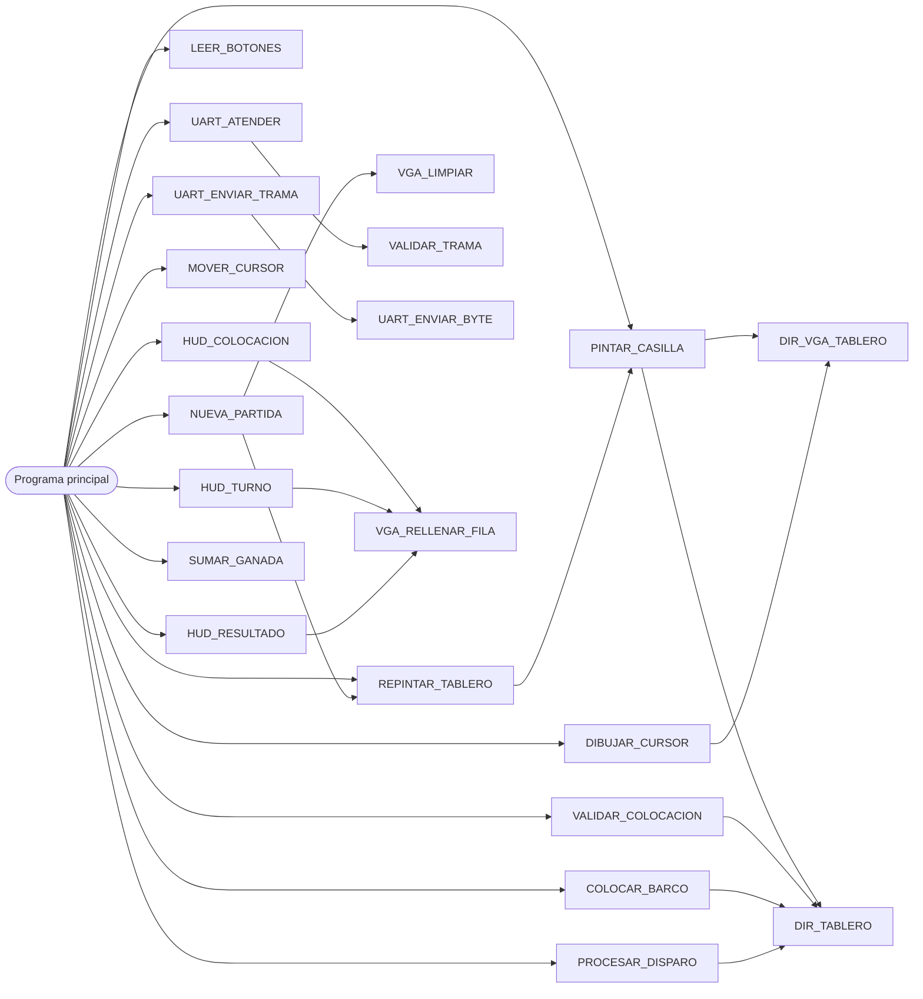

# PROGRAMA

Programa en ensamblador `rv32i` que corre en `PROCESADOR_UNICICLO` desde la ROM. Este doc es el
nivel 4 del programa. El nivel 3 ([`nivel03.md`](../diagramas/nivel03.md), sección "Programa en
ensamblador") fija los registros base, la organización de la RAM, el protocolo UART y los
diagramas de flujo de cada fase. Acá se baja un nivel más: cómo se divide el código, la
convención de llamado, el uso de la pila, el programa principal paso a paso y la ficha de cada
subrutina.

El instructivo (sección 4.7) pide documentar la organización de datos en RAM y la estructura del
programa (subrutinas, convenciones de llamado y manejo de la pila). La organización de la RAM
está en el nivel 3 y la estructura está en este doc.

---

## 1. Organización del código en la ROM

El programa es un solo archivo que se ensambla a partir de `0x0000_0000`, el vector de reset.
Solo tiene código (`.text`). No hay datos constantes en la ROM, porque el Address Translator no
la mapea en el bus de datos y un `lw` no la puede leer. Toda constante va como inmediato y toda
variable se inicializa por código en la RAM.

| Orden | Parte | Qué es |
|---|---|---|
| 1 | `INICIO` | Arranque por `rst_i`. Carga los registros base y pone en cero las partidas ganadas |
| 2 | `PARTIDA` | Entrada de cada partida nueva, desde `INICIO` o desde `BTN_RST` |
| 3 | `LAZO_COLOCACION` | Programa principal de la fase de colocación |
| 4 | `INICIO_BATALLA` y `LAZO_BATALLA` | Programa principal de la fase de batalla |
| 5 | `FIN_PARTIDA` y `LAZO_FIN` | Programa principal del resultado |
| 6 | Subrutinas | Todas las subrutinas de la sección 6, después del programa principal |

El programa principal (partes 1 a 5) no es una subrutina: no se llama con `jal ra` y nunca
ejecuta `ret`. Pasa de una fase a otra con saltos (`j`). Las subrutinas van todas juntas al
final, así un error en el flujo principal no puede "caer" dentro de una subrutina.

La ROM tiene 8 KB, o sea 2048 instrucciones. El programa completo (`sw/programa.s`) ocupa 725
instrucciones, así que el tamaño no es una restricción.

### 1.1. Instrucciones que usa

El programa usa la lista base del instructivo (sección 4.4.1) más `lui`. El instructivo presenta
esa lista como una base, y el núcleo implementa todo `rv32i`, pero cada instrucción que usa el
programa es una instrucción más que verificar en el testbench del núcleo y que justificar en la
defensa. Por eso se agrega solo la que tiene una razón concreta:

| Instrucción | ¿Se usa? | Por qué |
|---|---|---|
| `lui` | Sí | Cada dirección base (`s0`, `s1`, `s2`, `sp`) sale de una sola instrucción, y `li` sirve con cualquier constante |
| `auipc` | No | Arma direcciones relativas al PC. La ROM mide 8 KB y `jal` llega a cualquier punto, y una etiqueta de la ROM no se puede leer con `lw` porque la ROM no está en el bus de datos |
| `lb`, `lbu`, `lh`, `lhu`, `sb`, `sh` | No | La interfaz de los periféricos no tiene habilitación por byte, así que un `sb` escribiría la palabra completa con el dato corrido. Todas las variables ocupan una palabra |
| `bltu`, `bgeu` | No | Todos los valores que se comparan son positivos, y `blt` y `bge` alcanzan |

Como `auipc` no se usa, las subrutinas se llaman con `jal ra, NOMBRE` y no con la
pseudoinstrucción `call`, que se expande en `auipc` y `jalr`. Tampoco se usa `la`. Las
pseudoinstrucciones que sí aparecen (`li`, `mv`, `j`, `ret`, `beqz`, `bnez`) se expanden en
instrucciones de la lista.

### 1.2. Ensamblado

El programa se ensambla con binutils de GNU (`riscv64-unknown-elf`) mediante
`bash sw/ensamblar.sh sw/programa.s`. El script:

1. Ensambla con `-march=rv32i -mabi=ilp32`.
2. Enlaza a partir de `0x0000_0000` sin relajación (`--no-relax`), así la ROM contiene exactamente
   las instrucciones escritas. El enlazador también detecta etiquetas inexistentes, que el
   ensamblador deja pasar.
3. Desensambla a `sw/build/programa.lst` y rechaza el programa si aparece una instrucción fuera de
   la tabla de 1.1, indicando su dirección.
4. Genera `sw/programa.hex`, una instrucción de 32 bits por palabra, que la ROM carga con
   `$readmemh`.

El programa declara `.globl INICIO`, la etiqueta de entrada que espera el enlazador.

---

## 2. Nombres simbólicos

El código no usa números sueltos para direcciones, códigos ni colores. Todos se definen al
principio del archivo con `.equ`, y el resto del código usa el nombre. Así una dirección o un
código se cambia en un solo lugar, y el código se lee como el diseño.

### 2.1. Registros de periféricos (desplazamientos desde `s0 = 0x0001_0000`)

| Nombre | Valor | Dirección | Uso |
|---|---|---|---|
| `UART_CTRL` | `0x040` | `0x0001_0040` | `[0]` `send`, `[1]` `new_rx` |
| `UART_TX` | `0x044` | `0x0001_0044` | Byte a transmitir |
| `UART_RX` | `0x048` | `0x0001_0048` | Byte recibido |
| `BOTONES` | `0x120` | `0x0001_0120` | Estado de los siete botones del Jugador 1 |
| `DISPLAYS` | `0x130` | `0x0001_0130` | Cuatro dígitos BCD |
| `LED` | `0x138` | `0x0001_0138` | Un bit por fase |
| `BUZZER` | `0x140` | `0x0001_0140` | Código de melodía |

### 2.2. Variables en RAM (desplazamientos desde `s2 = 0x0000_2000`)

Son las de la tabla "Organización de la RAM" del nivel 3, con su desplazamiento.

| Nombre | Valor | Nombre | Valor |
|---|---|---|---|
| `TABLERO_J1` | `0x000` | `IMPACTOS_J1` | `0x220` |
| `TABLERO_J2` | `0x100` | `IMPACTOS_J2` | `0x22C` |
| `FASE` | `0x200` | `DISPAROS_J1` | `0x238` |
| `TURNO` | `0x204` | `DISPAROS_J2` | `0x23C` |
| `COLOCADOS_J1` | `0x208` | `HUNDIDOS_POR_J1` | `0x240` |
| `COLOCADOS_J2` | `0x20C` | `HUNDIDOS_POR_J2` | `0x244` |
| `CURSOR_FILA` | `0x210` | `GANADAS_BCD` | `0x248` |
| `CURSOR_COL` | `0x214` | `RX_INDICE` | `0x24C` |
| `ORIENTACION` | `0x218` | `RX_TRAMA` | `0x250` |
| `BOTONES_PREV` | `0x21C` | `FIN_VARIABLES` | `0x264` |

Los pares de variables de cada jugador están ordenados para que el jugador se use como índice:

- Tablero del jugador `j`: `s2 + (j << 8)`.
- Impactos de los barcos del jugador `j`: `s2 + IMPACTOS_J1 + 12 × j`, con `12 × j = (j << 3) + (j << 2)`.
- Disparos y hundidos logrados por el jugador `j`: `DISPAROS_J1 + 4 × j` y `HUNDIDOS_POR_J1 + 4 × j`.

Así una sola rutina atiende a los dos jugadores sin repetir código.

### 2.3. Códigos

| Grupo | Nombres y valores |
|---|---|
| Bits de `BOTONES` | `BTN_ARRIBA = 0x01`, `BTN_ABAJO = 0x02`, `BTN_IZQ = 0x04`, `BTN_DER = 0x08`, `BTN_SEL = 0x10`, `BTN_OK = 0x20`, `BTN_RST = 0x40`, y `BTN_FLECHAS = 0x0F` |
| Colores del VGA | `C_AGUA = 0`, `C_BARCO = 1`, `C_IMPACTO = 2`, `C_FALLO = 3`, `C_CURSOR = 4`, `C_FONDO = 5`, `C_J1 = 6`, `C_J2 = 7` |
| Estado de casilla en RAM | `E_AGUA = 0`, `E_BARCO = 1`, `E_IMPACTO = 2`, `E_FALLO = 3` |
| Melodías del buzzer | `SND_SILENCIO = 0`, `SND_IMPACTO = 1`, `SND_FALLO = 2`, `SND_HUNDIDO = 3`, `SND_INVALIDA = 4`, `SND_VICTORIA = 5` |
| LED de estado | `LED_COLOCACION = 0x1`, `LED_BATALLA = 0x2`, `LED_RESULTADO = 0x4` |
| Fase | `F_COLOCACION = 0`, `F_BATALLA = 1`, `F_RESULTADO = 2` |
| Resultado de colocación | `COL_VALIDA = 0`, `COL_TRASLAPE = 1`, `COL_FUERA = 2`, `COL_REPETIDO = 3` |
| Resultado de disparo | `D_IMPACTO = 0`, `D_FALLO = 1`, `D_HUNDIDO = 2`, `D_REPETIDO = 3` |
| Tramas UART | `TRAMA_INICIO = 0xAA`, `MSG_COLOCAR = 0x10`, `MSG_DISPARO = 0x11`, `MSG_ESTADO = 0x20`, `MSG_RES_COLOCACION = 0x21`, `MSG_DISPARO_DADO = 0x22`, `MSG_DISPARO_RECIBIDO = 0x23`, `MSG_RESUMEN_DISPAROS = 0x24`, `MSG_RESUMEN_HUNDIDOS = 0x25` |
| `D1` de Estado | `EST_COLOCACION = 0`, `EST_BATALLA = 1`, `EST_TURNO = 2`, `EST_FIN = 3` |

Los resultados de colocación y de disparo usan a propósito los mismos valores que el campo `D2`
de las tramas Resultado de colocación y Disparo dado. La subrutina que valida devuelve el código
y el programa principal lo manda por UART tal cual, sin traducirlo. De la misma forma, la
melodía de un disparo es `resultado + 1` (impacto 1, fallo 2, hundido 3) y el color de un
jugador es `C_J1 + j`.

---

## 3. Convención de llamado

Es la convención estándar de RISC-V, recortada a lo que usa este programa.

### 3.1. Registros

| Registro | Nombre ABI | Uso en el programa | ¿Quién lo preserva? |
|---|---|---|---|
| `x0` | `zero` | Constante cero | No cambia |
| `x1` | `ra` | Dirección de retorno | La subrutina que llama a otra lo guarda en la pila |
| `x2` | `sp` | Puntero de pila | Cada subrutina lo deja como lo encontró |
| `x3`, `x4` | `gp`, `tp` | No se usan | |
| `x5` a `x7`, `x28` a `x31` | `t0` a `t6` | Temporales | Nadie. Una subrutina los puede ensuciar sin avisar |
| `x8` | `s0` | Base de periféricos, `0x0001_0000` | Fijo, nadie lo escribe después de `INICIO` |
| `x9` | `s1` | Base de la memoria de video, `0x0001_1000` | Fijo |
| `x18` | `s2` | Base de las variables en RAM, `0x0000_2000` | Fijo |
| `x19` a `x27` | `s3` a `s11` | Valores que tienen que sobrevivir a una llamada | La subrutina que los usa los guarda y los restaura |
| `x10`, `x11` | `a0`, `a1` | Argumentos y valores de retorno | Nadie |
| `x12` a `x17` | `a2` a `a7` | Argumentos | Nadie |

`s0` hace también de *frame pointer* en la convención estándar. Este programa no usa *frame
pointer*, por eso queda libre para ser una base fija.

### 3.2. Reglas

1. **Argumentos** en `a0`, `a1`, `a2` y en adelante, en el orden de la ficha de cada subrutina.
   Ninguna subrutina recibe más de cinco.
2. **Resultado** en `a0`. `UART_ATENDER` y `VALIDAR_TRAMA` devuelven tres valores, en `a0`, `a1`
   y `a2`.
3. **Temporales.** Después de una llamada (`jal ra, NOMBRE`), los `t*` y los `a*` que no son
   resultado se consideran basura. Si el que llama necesita un valor después de la llamada, lo guarda antes en un `s*`.
4. **Preservados.** Una subrutina que escribe un `s3` a `s11` guarda antes su valor en la pila y
   lo restaura antes del `ret`. Así el programa principal puede tener su estado en `s3` a `s11`
   sin guardarlo nunca.
5. **Hoja o no hoja.** Una subrutina que no llama a ninguna otra (hoja) no toca `ra` ni la pila.
   Una que llama a otra guarda `ra` en la pila, porque su propio `jal ra` lo sobrescribe.
6. **Bases.** Ningún código escribe `s0`, `s1` ni `s2` fuera de `INICIO`.

### 3.3. Pila

La pila empieza en `0x0000_3000` (`sp` apunta justo arriba del último cajón de la RAM) y crece
hacia abajo, hacia las variables. Cada subrutina no hoja arma un marco al entrar y lo desarma al
salir:

```asm
NOMBRE:
    addi sp, sp, -16      # marco de 4 palabras: ra y hasta tres s*
    sw   ra, 12(sp)
    sw   s3, 8(sp)
    sw   s4, 4(sp)
    sw   s5, 0(sp)
    # ... cuerpo, que puede usar s3 a s5 y llamar a otras subrutinas ...
    lw   s5, 0(sp)
    lw   s4, 4(sp)
    lw   s3, 8(sp)
    lw   ra, 12(sp)
    addi sp, sp, 16
    ret
```

El marco mide `4 × (1 + cantidad de s* guardados)` bytes. Se alinea a 4 bytes y no a 16 como pide
la convención estándar, porque el programa no se enlaza con código en C y todos los accesos son
de palabra.

La cadena de llamadas más profunda es `PARTIDA` → `NUEVA_PARTIDA` → `REPINTAR_TABLERO` →
`PINTAR_CASILLA` → `DIR_TABLERO`, con 40 bytes de pila en total (marcos de 4, 16 y 20 bytes, y
`DIR_TABLERO` es hoja). Los 3.4 KB libres entre `FIN_VARIABLES` y `0x0000_3000` sobran.

**`sp` se vuelve a cargar en cada partida nueva.** `BTN_RST` solo se revisa en el programa
principal, nunca dentro de una subrutina, así que en ese momento la pila ya está vacía. Aun así
`PARTIDA` vuelve a cargar `sp` con `lui sp, 0x3`, para que un error de marco en una partida no se
arrastre a la siguiente.

---

## 4. Pantalla

El programa decide qué se ve en cada casilla de la pantalla. El periférico VGA solo pinta el
color de la palabra (ver [`PERIFERICO_VGA.md`](PERIFERICO_VGA.md)). La cuadrícula es de 20 × 15
casillas y los colores son los de la paleta de ese doc.

```
col:     0   1 ........ 8   9  10  11 ....... 18  19
fila 0   (libre)
fila 1   HUD: colocación pendiente o turno activo
fila 2
fila 3   │   tablero J1 (propio)  │       │  tablero J2 (rival)   │
 ...     │   filas 3 a 10         │       │  filas 3 a 10         │
fila 10  │   columnas 1 a 8       │       │  columnas 11 a 18     │
fila 11
fila 12  HUD: resultado (color del ganador)
fila 13
fila 14
```

Todo lo que no es tablero se pinta con `C_FONDO`.

### 4.1. Dirección de una casilla

| Qué | Fórmula |
|---|---|
| Casilla `(fp, cp)` de la pantalla | `s1 + 4 × (fp × 20 + cp)` |
| Casilla `(f, c)` del tablero del jugador `j` | `fp = 3 + f` y `cp = 1 + 10 × j + c` |

Sin `mul`, `fp × 20 = (fp << 4) + (fp << 2)` y `10 × j = (j << 3) + (j << 1)`.

### 4.2. Qué muestra el HUD en cada fase

| Fase | Fila 1 | Filas 12 a 14 |
|---|---|---|
| Colocación | Columnas 1 a 8 en `C_J1` mientras el Jugador 1 no termina, y columnas 11 a 18 en `C_J2` mientras el Jugador 2 no termina. Cada barra pasa a `C_FONDO` cuando ese jugador completa su flota | `C_FONDO` |
| Batalla | Columnas 0 a 19 en el color del jugador con el turno | `C_FONDO` |
| Resultado | `C_FONDO` | Columnas 0 a 19 en el color del ganador |

En la colocación las barras muestran por separado quién falta, que es el control independiente
que pide el instructivo (4.3.1, punto 4). La barra del Jugador 2 solo dice si terminó, nunca
dónde puso sus barcos.

### 4.3. Cursor y vista previa

- **Colocación.** Las casillas que ocuparía el barco en curso, desde el cursor y en la
  orientación elegida, se pintan con `C_CURSOR`. Las que quedarían fuera del tablero no se
  pintan. La vista previa se ve igual aunque el barco no quepa, y la validación de `BTN_OK` es la
  que avisa con el buzzer.
- **Batalla.** Con el turno del Jugador 1, la casilla del cursor en el tablero del Jugador 2 se
  pinta con `C_CURSOR`. Con el turno del Jugador 2 no hay cursor.

Para mover el cursor o la vista previa, el programa repinta el tablero completo desde la RAM
(`REPINTAR_TABLERO`) y después dibuja el cursor encima (`DIBUJAR_CURSOR`). Es más simple que
recordar qué casillas tapaba el cursor anterior. Repintar 64 casillas son 3365 instrucciones,
101 µs con `clk_i` de 33,33 MHz. La vuelta más larga que no lee la UART es la de un `BTN_OK`
válido del Jugador 1 (validar, colocar, repintar, vista previa y HUD), con unas 3700
instrucciones, 111 µs. El periférico guarda un solo byte recibido y a 115200 baudios un byte llega
cada 87 µs, así que con bytes pegados un byte de una trama de la PC se podría perder. Por eso la
aplicación de PC deja 1 ms entre los bytes de una trama (`ESPACIO_ENTRE_BYTES` en
`sw/enlace.py`), unas nueve veces la vuelta más larga. Una trama de pocos bytes tarda unos
milisegundos más en llegar, algo que no se percibe. Si el barrido del VGA pasa por el tablero justo durante el repintado, la casilla del
cursor se ve en su color de fondo durante un cuadro, algo que no se percibe.

### 4.4. Privacidad

La única rutina que copia un tablero de la RAM a la pantalla es `PINTAR_CASILLA`. Ahí, si el
tablero es del Jugador 2 y el estado es `E_BARCO`, pinta `C_AGUA`. Ninguna otra rutina escribe
el color `C_BARCO` en las columnas 11 a 18. Así la privacidad del Jugador 2 en el VGA se revisa
en un solo lugar.

Del lado de la UART, ninguna trama lleva el contenido de `tablero_j1`. La PC solo recibe la
casilla y el resultado de sus propios disparos.

---

## 5. Programa principal

El programa principal guarda su estado de vuelta en registros `s*`, que las subrutinas
preservan:

| Registro | Contenido |
|---|---|
| `s3` | Flancos de los botones de esta vuelta, salida de `LEER_BOTONES` |
| `s4` | TIPO de la trama que llegó completa y válida en esta vuelta, o 0 si no llegó ninguna |
| `s5`, `s6` | `D1` y `D2` de esa trama |
| `s7` | Batalla: jugador dueño del tablero atacado. Colocación: id del barco del Jugador 2 |
| `s8`, `s9` | Fila y columna del disparo o del barco del Jugador 2 |
| `s10` | Batalla: resultado del disparo. Colocación: orientación del barco del Jugador 2 |
| `s11` | Batalla: casilla en formato de trama, `(fila << 4) \| columna`. Colocación: indicador de repintado de la vista previa (Jugador 1) o código de colocación (Jugador 2) |

Todas las vueltas de las tres fases empiezan igual. Ese inicio es una macro de ensamblador
(`.macro VUELTA`), así que el ensamblador copia sus instrucciones en cada lazo en el lugar donde
aparece `VUELTA`. No es una subrutina ni una etiqueta: se escribe `VUELTA` solo, sin `j` ni
`jal`. Una subrutina no podría hacer el salto a `PARTIDA`, porque dejaría su marco en la pila.

```asm
.macro VUELTA
    jal  ra, LEER_BOTONES      # s3 = flancos
    mv   s3, a0
    jal  ra, UART_ATENDER      # s4, s5, s6 = trama lista, o s4 = 0
    mv   s4, a0
    mv   s5, a1
    mv   s6, a2
    andi t0, s3, BTN_RST
    bnez t0, PARTIDA
.endm
```

Se atiende como máximo un byte de la UART por vuelta, y los botones se leen una sola vez.

En el pseudocódigo de las secciones siguientes, `jal X(argumentos)` es una llamada a la subrutina
`X` con los argumentos cargados antes en `a0` a `a4`.

### 5.1. Arranque y partida nueva

```
INICIO:                                   (vector de reset, 0x0000_0000)
    lui s0, 0x10                          s0 = 0x0001_0000
    lui s1, 0x11                          s1 = 0x0001_1000
    lui s2, 0x2                           s2 = 0x0000_2000
    sw  zero, GANADAS_BCD(s2)
    sw  zero, DISPLAYS(s0)                displays en 00 00
    sw  zero, UART_CTRL(s0)               descarta un byte recibido antes del arranque

PARTIDA:                                  (también destino de BTN_RST)
    lui sp, 0x3                           sp = 0x0000_3000
    jal NUEVA_PARTIDA
    FASE = F_COLOCACION, LED = LED_COLOCACION
    jal HUD_COLOCACION
    jal DIBUJAR_CURSOR(0, largo 4, horizontal)       vista previa del barco 0
    jal UART_ENVIAR_TRAMA(MSG_ESTADO, EST_COLOCACION, 0)
```

### 5.2. Fase de colocación

```
LAZO_COLOCACION:
    VUELTA

    -- Jugador 1 --
    si COLOCADOS_J1 == 3: saltar a Jugador 2
    si s3 & BTN_FLECHAS: jal MOVER_CURSOR(s3)
    si s3 & BTN_SEL:     ORIENTACION = ORIENTACION xor 1
    si hubo flecha o BTN_SEL:
        jal REPINTAR_TABLERO(0)
        jal DIBUJAR_CURSOR(0, 4 - COLOCADOS_J1, ORIENTACION)
    si s3 & BTN_OK:
        a0 = VALIDAR_COLOCACION(0, COLOCADOS_J1, CURSOR_FILA, CURSOR_COL, ORIENTACION)
        si a0 != COL_VALIDA:
            BUZZER = SND_INVALIDA
        si no:
            jal COLOCAR_BARCO(0, COLOCADOS_J1, CURSOR_FILA, CURSOR_COL, ORIENTACION)
            COLOCADOS_J1 = COLOCADOS_J1 + 1
            jal REPINTAR_TABLERO(0)
            si COLOCADOS_J1 < 3: jal DIBUJAR_CURSOR(0, 4 - COLOCADOS_J1, ORIENTACION)
            jal HUD_COLOCACION

    -- Jugador 2 --
    si s4 == MSG_COLOCAR:
        id = s5 & 3,  orientación = s5 >> 7,  fila = s6 >> 4,  col = s6 & 0xF
        si COLOCADOS_J2 & (1 << id):
            código = COL_REPETIDO
        si no:
            código = VALIDAR_COLOCACION(1, id, fila, col, orientación)
            si código == COL_VALIDA:
                jal COLOCAR_BARCO(1, id, fila, col, orientación)
                COLOCADOS_J2 = COLOCADOS_J2 | (1 << id)
                jal HUD_COLOCACION
        jal UART_ENVIAR_TRAMA(MSG_RES_COLOCACION, id, código)

    -- ¿Terminaron los dos? --
    si COLOCADOS_J1 == 3 y COLOCADOS_J2 == 7: j INICIO_BATALLA
    j LAZO_COLOCACION
```

Dentro de la vuelta del Jugador 1 el orden es flechas, `BTN_SEL` y `BTN_OK`. Si llegan dos flancos
en la misma vuelta, la colocación usa el cursor y la orientación ya actualizados. Un barco del
Jugador 2 no se pinta en ningún momento. Una trama `MSG_DISPARO` en esta fase se descarta sin
respuesta, porque `s4` no es `MSG_COLOCAR`.

### 5.3. Fase de batalla

```
INICIO_BATALLA:
    FASE = F_BATALLA, LED = LED_BATALLA, TURNO = 0
    CURSOR_FILA = 0, CURSOR_COL = 0
    jal REPINTAR_TABLERO(0)                     borra la última vista previa
    jal HUD_TURNO
    jal DIBUJAR_CURSOR(1, 1, 0)                 cursor sobre el tablero del Jugador 2
    jal UART_ENVIAR_TRAMA(MSG_ESTADO, EST_BATALLA, 0)
    jal UART_ENVIAR_TRAMA(MSG_ESTADO, EST_TURNO, 0)

LAZO_BATALLA:
    VUELTA
    si TURNO == 1: j TURNO_J2

TURNO_J1:
    si s3 & BTN_FLECHAS:
        jal MOVER_CURSOR(s3)
        jal REPINTAR_TABLERO(1)
        jal DIBUJAR_CURSOR(1, 1, 0)
    si no hay flanco de BTN_OK: j LAZO_BATALLA
    s7 = 1, s8 = CURSOR_FILA, s9 = CURSOR_COL
    j DISPARO

TURNO_J2:
    si s4 != MSG_DISPARO: j LAZO_BATALLA
    s7 = 0, s8 = s5 >> 4, s9 = s5 & 0xF

DISPARO:
    s10 = PROCESAR_DISPARO(s7, s8, s9)
    si s10 == D_REPETIDO:
        si TURNO == 1: jal UART_ENVIAR_TRAMA(MSG_DISPARO_DADO, casilla, D_REPETIDO)
        j LAZO_BATALLA                           el turno no cambia
    DISPAROS del tirador (TURNO) + 1
    jal PINTAR_CASILLA(s7, s8, s9)
    si TURNO == 1: jal UART_ENVIAR_TRAMA(MSG_DISPARO_DADO, casilla, s10)
    si no: jal UART_ENVIAR_TRAMA(MSG_DISPARO_RECIBIDO, casilla, s10)
    si s10 == D_HUNDIDO:
        HUNDIDOS del tirador + 1
        si llegó a 3: j FIN_PARTIDA
    BUZZER = s10 + 1
    TURNO = TURNO xor 1
    jal HUD_TURNO
    jal UART_ENVIAR_TRAMA(MSG_ESTADO, EST_TURNO, TURNO)
    si TURNO == 0: jal DIBUJAR_CURSOR(1, 1, 0)
    j LAZO_BATALLA
```

`casilla` es `(s8 << 4) | s9`, el formato de un byte del protocolo. El tirador es siempre el
jugador que tiene el turno, y el tablero atacado es el del otro (`s7 = TURNO xor 1`).

El disparo del Jugador 1 pinta la casilla con su resultado en el tablero del Jugador 2, y eso
tapa el cursor. El disparo del Jugador 2 pinta el resultado en el tablero propio del Jugador 1,
así el Jugador 1 ve los disparos que recibe. Un disparo repetido del Jugador 1 se ignora sin
sonido ni cambio en pantalla, y uno del Jugador 2 se contesta con `D_REPETIDO` para que la PC
pida otra casilla.

El disparo que termina la partida no escribe su melodía de hundido: salta a `FIN_PARTIDA`, que
escribe la de victoria. La trama del disparo sí sale antes, así la PC sabe que su último disparo
hundió un barco.

### 5.4. Fin de partida

```
FIN_PARTIDA:                                 ganador = TURNO
    FASE = F_RESULTADO, LED = LED_RESULTADO
    BUZZER = SND_VICTORIA
    jal HUD_RESULTADO(TURNO)
    jal SUMAR_GANADA(TURNO)
    jal UART_ENVIAR_TRAMA(MSG_ESTADO, EST_FIN, TURNO)
    jal UART_ENVIAR_TRAMA(MSG_RESUMEN_DISPAROS, DISPAROS_J1, DISPAROS_J2)
    jal UART_ENVIAR_TRAMA(MSG_RESUMEN_HUNDIDOS, HUNDIDOS_POR_J1, HUNDIDOS_POR_J2)

LAZO_FIN:
    VUELTA                                   la trama que llegue se descarta
    j LAZO_FIN
```

La única salida de `LAZO_FIN` es el `BTN_RST` que revisa `VUELTA`. Los barcos del Jugador 2 que
no se hundieron siguen sin mostrarse.

---

## 6. Subrutinas



### 6.1. Resumen

| Subrutina | Entradas | Salida | Llama a | Marco |
|---|---|---|---|---|
| `DIR_TABLERO` | `a0` jugador, `a1` fila, `a2` columna | `a0` dirección en RAM | | Hoja |
| `DIR_VGA_TABLERO` | `a0` jugador, `a1` fila, `a2` columna | `a0` dirección en video | | Hoja |
| `LEER_BOTONES` | | `a0` flancos | | Hoja |
| `MOVER_CURSOR` | `a0` flancos | | | Hoja |
| `UART_ENVIAR_BYTE` | `a0` byte | | | Hoja |
| `UART_ENVIAR_TRAMA` | `a0` TIPO, `a1` D1, `a2` D2 | | `UART_ENVIAR_BYTE` | 16 bytes |
| `VALIDAR_TRAMA` | | `a0` TIPO o 0, `a1` D1, `a2` D2 | | Hoja |
| `UART_ATENDER` | | `a0` TIPO o 0, `a1` D1, `a2` D2 | `VALIDAR_TRAMA` | 4 bytes, solo al llamar a `VALIDAR_TRAMA` |
| `VALIDAR_COLOCACION` | `a0` jugador, `a1` id, `a2` fila, `a3` columna, `a4` orientación | `a0` código de colocación | `DIR_TABLERO` | 12 bytes |
| `COLOCAR_BARCO` | igual que `VALIDAR_COLOCACION` | | `DIR_TABLERO` | 16 bytes |
| `PROCESAR_DISPARO` | `a0` jugador dueño, `a1` fila, `a2` columna | `a0` resultado de disparo | `DIR_TABLERO` | 8 bytes |
| `PINTAR_CASILLA` | `a0` jugador, `a1` fila, `a2` columna | | `DIR_TABLERO`, `DIR_VGA_TABLERO` | 20 bytes |
| `REPINTAR_TABLERO` | `a0` jugador | | `PINTAR_CASILLA` | 16 bytes |
| `DIBUJAR_CURSOR` | `a0` jugador, `a1` largo, `a2` orientación | | `DIR_VGA_TABLERO` | 24 bytes |
| `VGA_LIMPIAR` | | | | Hoja |
| `VGA_RELLENAR_FILA` | `a0` fila, `a1` columna inicial, `a2` columna final, `a3` color | | | Hoja |
| `HUD_COLOCACION` | | | `VGA_RELLENAR_FILA` | 4 bytes |
| `HUD_TURNO` | | | `VGA_RELLENAR_FILA` | 4 bytes |
| `HUD_RESULTADO` | `a0` ganador | | `VGA_RELLENAR_FILA` | 8 bytes |
| `SUMAR_GANADA` | `a0` ganador | | | Hoja |
| `NUEVA_PARTIDA` | | | `VGA_LIMPIAR`, `REPINTAR_TABLERO` | 4 bytes |

"Jugador" es siempre 0 para el Jugador 1 y 1 para el Jugador 2. "Orientación" es 0 horizontal y 1
vertical. El marco es lo que cada subrutina guarda en la pila: `ra` más los `s*` que usa.
`UART_ATENDER` arma su marco solo en el camino que llama a `VALIDAR_TRAMA`, y en los demás
caminos vuelve como una hoja.

### 6.2. Direcciones

**`DIR_TABLERO`.** Dirección en RAM de la casilla `(f, c)` del tablero del jugador `j`.

```asm
DIR_TABLERO:
    slli t0, a1, 3        # t0 = fila * 8
    add  t0, t0, a2       # t0 = fila * 8 + columna
    slli t0, t0, 2        # t0 = desplazamiento en bytes
    slli t1, a0, 8        # t1 = j * 0x100, inicio del tablero del jugador
    add  t0, t0, t1
    add  a0, s2, t0       # a0 = s2 + j * 0x100 + 4 * (fila * 8 + columna)
    ret
```

**`DIR_VGA_TABLERO`.** Dirección en la memoria de video de la casilla `(f, c)` del tablero del
jugador `j`, con las fórmulas de 4.1: `fp = 3 + f`, `cp = 1 + 10 × j + c` y
`s1 + 4 × ((fp << 4) + (fp << 2) + cp)`.

### 6.3. Entradas

**`LEER_BOTONES`.** Lee `BOTONES`, calcula `flancos = actual & ~BOTONES_PREV`, guarda `actual` en
`BOTONES_PREV` y devuelve los flancos. Un bit en 1 es un botón que se apretó desde la vuelta
anterior.

**`MOVER_CURSOR`.** Mueve `CURSOR_FILA` y `CURSOR_COL` una casilla por cada flecha con flanco, sin
salir de 0 a 7. Arriba resta a la fila, abajo le suma, izquierda resta a la columna y derecha le
suma. Si la casilla ya está en el borde, esa flecha no hace nada.

### 6.4. UART

Sigue el orden de acceso de "Cómo usa la ROM el periférico" del nivel 3.

**`UART_ENVIAR_BYTE`.**

```asm
UART_ENVIAR_BYTE:
    lw   t0, UART_CTRL(s0)
    andi t0, t0, 1        # send
    bnez t0, UART_ENVIAR_BYTE   # esperar a que termine el byte anterior
    sw   a0, UART_TX(s0)
    lw   t0, UART_CTRL(s0)
    ori  t0, t0, 1        # send = 1, conservando new_rx
    sw   t0, UART_CTRL(s0)
    ret
```

Es la única espera del programa. Está acotada por el tiempo de un byte, unos 104 µs.

**`UART_ENVIAR_TRAMA`.** Guarda TIPO, D1 y D2 en `s3` a `s5` y manda `0xAA`, TIPO, D1, D2 y
`TIPO xor D1 xor D2`, con cinco llamadas a `UART_ENVIAR_BYTE`. Tarda unos 520 µs.

**`UART_ATENDER`.** Atiende como máximo un byte:

1. Si `new_rx` (bit 1 de `UART_CTRL`) está en 0, devuelve `a0 = 0`.
2. Lee el byte de `UART_RX` y escribe cero en `UART_CTRL` para bajar `new_rx`.
3. Si el byte es `0xAA`, lo guarda en `RX_TRAMA[0]`, pone `RX_INDICE` en 1 y devuelve 0. Pasa
   sin importar en qué posición iba la trama anterior.
4. Si `RX_INDICE` es 0, el byte no pertenece a ninguna trama: lo descarta y devuelve 0.
5. Guarda el byte en `RX_TRAMA[RX_INDICE]` y suma 1 a `RX_INDICE`. Si todavía no llegó a 5,
   devuelve 0.
6. Con la trama completa, pone `RX_INDICE` en 0 y devuelve lo que devuelva `VALIDAR_TRAMA`.

**`VALIDAR_TRAMA`.** Lee TIPO, D1, D2 y la verificación de `RX_TRAMA[1]` a `RX_TRAMA[4]` y aplica
los chequeos del nivel 3. Si alguno falla devuelve `a0 = 0`. Si pasan todos devuelve TIPO, D1 y
D2.

| TIPO | Chequeos |
|---|---|
| Cualquiera | `TIPO xor D1 xor D2` es igual a la verificación |
| `MSG_COLOCAR` | `(D1 & 0x7C) == 0`, `(D1 & 3) != 3` y `(D2 & 0x88) == 0` |
| `MSG_DISPARO` | `(D1 & 0x88) == 0` y `D2 == 0` |
| Otro | Se descarta |

### 6.5. Reglas del juego

**`VALIDAR_COLOCACION`.** Decide si el barco `id` cabe en el tablero del jugador `j` desde
`(f, c)` con la orientación dada.

1. `largo = 4 - id`.
2. Si es horizontal y `c + largo - 1 > 7`, o si es vertical y `f + largo - 1 > 7`, devuelve
   `COL_FUERA`.
3. Recorre las `largo` casillas desde `DIR_TABLERO(j, f, c)`, avanzando 4 bytes por casilla en
   horizontal y 32 en vertical (una fila son 8 palabras). Si alguna tiene estado distinto de
   `E_AGUA`, devuelve `COL_TRASLAPE`.
4. Si no, devuelve `COL_VALIDA`.

"Fuera" se revisa antes que "traslape", así un barco que se sale del tablero siempre se reporta
como fuera aunque además pise otro.

**`COLOCAR_BARCO`.** Recorre las mismas casillas que `VALIDAR_COLOCACION` y escribe en cada una
`(id << 2) | E_BARCO`. Supone que la colocación ya se validó.

**`PROCESAR_DISPARO`.** Aplica un disparo a la casilla `(f, c)` del tablero del jugador `j`.

1. Lee la palabra `w` de `DIR_TABLERO(j, f, c)`.
2. Si el bit 1 de `w` está en 1, la casilla ya se disparó: devuelve `D_REPETIDO` sin tocar nada.
3. Si el estado es `E_AGUA`, escribe `w | E_FALLO` y devuelve `D_FALLO`.
4. Si el estado es `E_BARCO`, escribe `w xor 3` (de `01` pasa a `10`, `E_IMPACTO`, y el id queda
   igual). Suma 1 a los impactos del barco `id = (w >> 2) & 3` del jugador `j`. Si llegaron a
   `4 - id` devuelve `D_HUNDIDO`, y si no, `D_IMPACTO`.

Solo cambia la casilla y el contador de impactos. Los disparos, los hundidos, el turno y la
pantalla los actualiza el programa principal.

**`SUMAR_GANADA`.** Suma 1 en BCD a los dos dígitos del ganador en `GANADAS_BCD` (bits `[15:8]`
para el Jugador 1 y `[7:0]` para el Jugador 2) y escribe la palabra completa en `DISPLAYS`. Si
las unidades pasan de 9 vuelven a 0 y se suma una decena. Si las decenas pasan de 9, el contador
vuelve a 00, porque el instructivo pide un contador de 00 a 99.

### 6.6. Pantalla

**`PINTAR_CASILLA`.** Copia una casilla del tablero en RAM a la pantalla:

1. Lee la palabra de `DIR_TABLERO(j, f, c)` y se queda con `[1:0]` (`andi 3`). El `andi` es
   obligatorio: el VGA toma el color de los bits `[2:0]`, y el bit 2 de la casilla es parte del id
   del barco.
2. Si `j = 1` y el estado es `E_BARCO`, lo cambia por `C_AGUA` (privacidad, sección 4.4).
3. Escribe el resultado en `DIR_VGA_TABLERO(j, f, c)`. Los estados coinciden con los colores
   `C_AGUA` a `C_FALLO`.

**`REPINTAR_TABLERO`.** Llama a `PINTAR_CASILLA` para las 64 casillas del tablero del jugador `j`.

**`DIBUJAR_CURSOR`.** Pinta con `C_CURSOR` `largo` casillas del tablero del jugador `j`, desde
`(CURSOR_FILA, CURSOR_COL)` hacia la derecha o hacia abajo según la orientación. Se detiene en la
primera casilla que cae fuera del tablero. Con `largo = 1` es el cursor de la batalla.

**`VGA_LIMPIAR`.** Escribe `C_FONDO` en las 300 casillas de la pantalla, desde `0x000(s1)` hasta
`0x4AC(s1)`.

**`VGA_RELLENAR_FILA`.** Escribe un color en las casillas de una fila de la pantalla, desde la
columna inicial hasta la final, las dos incluidas.

**`HUD_COLOCACION`**, **`HUD_TURNO`** y **`HUD_RESULTADO`** pintan la fila 1 y las filas 12 a 14 como
dice la tabla de 4.2, a partir de `COLOCADOS_J1`, `COLOCADOS_J2`, `TURNO` o el ganador.

### 6.7. Partida nueva

**`NUEVA_PARTIDA`.** Deja todo como al empezar una partida, salvo las ganadas.

1. Guarda `GANADAS_BCD` en un temporal, escribe cero en todas las palabras de `0x000(s2)` a
   `0x260(s2)` (tableros y variables) y vuelve a escribir `GANADAS_BCD`. Así quedan en cero
   `FASE`, `TURNO`, los contadores, el cursor, la orientación y `RX_INDICE`.
2. Carga `BOTONES_PREV` con la lectura actual de `BOTONES`, en lugar de dejarlo en cero. Si
   quedara en cero y `BTN_RST` siguiera apretado, la vuelta siguiente vería otro flanco de
   `BTN_RST` y la partida se reiniciaría una y otra vez mientras el botón siga abajo, mandando un
   Estado colocación por vuelta.
3. Escribe `SND_SILENCIO` en `BUZZER`, para cortar una melodía que venga sonando.
4. Llama a `VGA_LIMPIAR` y a `REPINTAR_TABLERO` para los dos jugadores, que con la RAM en cero
   pintan los dos tableros en agua.

El LED, el HUD y la trama de Estado colocación los pone `PARTIDA` después de la llamada.

---

## 7. Casos de borde

| Caso | Qué hace el programa |
|---|---|
| `BTN_RST` apretado por mucho tiempo | Un solo reinicio, por el paso 2 de `NUEVA_PARTIDA` |
| `BTN_RST` durante una melodía | `NUEVA_PARTIDA` la corta con `SND_SILENCIO` |
| `BTN_RST` mientras la PC manda una trama | Los bytes que ya llegaron se pierden con `RX_INDICE = 0`. La PC recibe Estado colocación y reinicia su vista |
| Dos botones en la misma vuelta | Se atienden en el orden flechas, `BTN_SEL`, `BTN_OK` |
| `BTN_OK` del Jugador 1 con su flota completa | Se ignora, la parte del Jugador 1 se salta |
| `BTN_SEL` en la batalla | Se ignora |
| Colocación del Jugador 2 de un id ya colocado | Responde `COL_REPETIDO` sin validar de nuevo |
| Trama de colocación en la batalla, o de disparo en la colocación | Se descarta sin respuesta |
| Disparo del Jugador 2 con el turno del Jugador 1 | Se descarta sin respuesta |
| Disparo repetido del Jugador 1 | Se ignora, sin sonido y sin cambio de turno |
| Disparo repetido del Jugador 2 | Disparo dado con `D_REPETIDO`, sin cambio de turno |
| Disparo que hunde el último barco | Sale la trama del disparo, suena solo la victoria |
| Partidas ganadas en 99 | La siguiente vuelve a 00 |
| Byte suelto o trama corrupta | `UART_ATENDER` y `VALIDAR_TRAMA` lo descartan sin afectar la partida |

---

## 8. Verificación

El programa se verifica en simulación antes de la placa, con pruebas de autochequeo:

1. **Por subrutina.** Un programa de prueba corto llama a una subrutina con entradas conocidas y
   deja el resultado en RAM. El testbench compara la RAM con el valor esperado. Las primeras son
   `DIR_TABLERO`, `VALIDAR_COLOCACION` (válida, traslape, fuera en los dos ejes), `PROCESAR_DISPARO`
   (agua, barco, repetido, hundido de cada id), `SUMAR_GANADA` (09 a 10 y 99 a 00) y
   `VALIDAR_TRAMA` (una trama válida de cada tipo y una con cada chequeo fallado).
2. **Programa completo.** El núcleo corre el programa real en un testbench que simula los
   botones y le inyecta tramas UART. El testbench registra cada escritura a los periféricos y a la
   memoria de video, y comprueba al final el estado de la RAM, el LED, los displays, las tramas
   que salieron y que ninguna escritura en las columnas 11 a 18 de la pantalla tuvo el color
   `C_BARCO`.
3. **Post-implementación.** El instructivo pide una simulación temporizada que cubra un fragmento
   del programa y la validación de un disparo. El candidato es la prueba de `PROCESAR_DISPARO` del
   punto 1.

El programa no lee nunca la memoria de video. El estado del juego vive solo en la RAM, así que la
latencia de lectura del puerto del CPU del VGA no afecta al programa.
