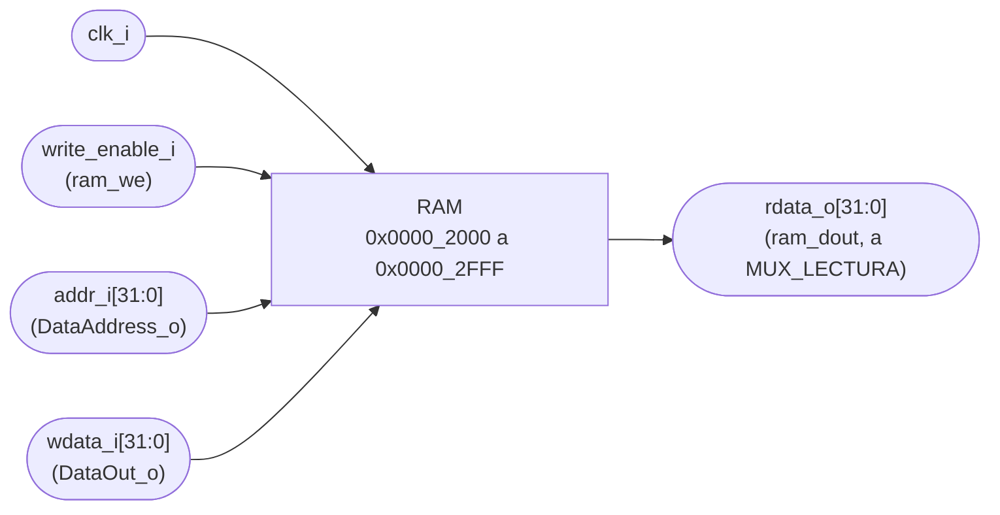
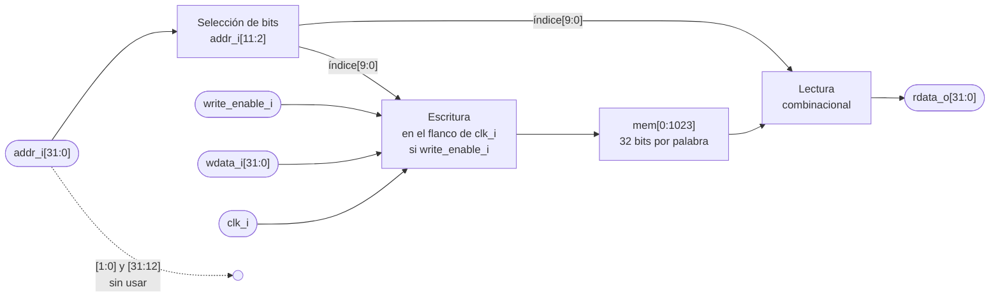

# RAM

## a) Nombre del módulo

RAM, memoria de datos. Módulo `ram` en `src/design/ram.sv`.

## b) Diagrama modular



Es el bloque "Memoria de datos (RAM)" del nivel 2 visto desde afuera. Lo que tiene adentro está en el
inciso i).

## c) Objetivo del módulo

Guardar los datos del programa (tableros, turno, contadores de la partida y pila) y entregarlos cuando el
procesador los pide, como exige la sección 4.4.1 del enunciado: el microprocesador usa una RAM para los
datos, a la que accede por el bus de datos (`DataAddress_o`, `DataOut_o`, `DataIn_i` y `we_o`).

La RAM no sabe qué guarda. La organización de las variables la decide el programa y está en `nivel03.md`
(sección "Organización de la RAM").

## d) Entradas

- `clk_i`, reloj del sistema.
- `write_enable_i`, habilitación de escritura, desde `ram_we` del Address Translator (`we_o` del procesador
  en AND con `sel_ram`).
- `addr_i[31:0]`, dirección en bytes, desde `DataAddress_o` del procesador.
- `wdata_i[31:0]`, dato a escribir, desde `DataOut_o` del procesador.

No tiene `rst_i`, ver el inciso h).

## e) Salidas

- `rdata_o[31:0]`, palabra guardada en la dirección que apunta `addr_i`, hacia la entrada `ram_dout` de
  `MUX_LECTURA`, que la lleva a `DataIn_i` del procesador.

## f) Relación con otros módulos

Habla con el procesador a través del controlador de mapeo. No instancia ningún submódulo.

- El **Address Translator** (`Address_Translator.md`) decide si la dirección es de la RAM. `sel_ram` exige
  `DataAddress_o[31:12] = 0x00002` y los bits `[1:0]` en cero, y `ram_we` vale `we_o && sel_ram`. Por eso la RAM
  no compara la dirección: si llega una escritura, ya es suya.
- **`MUX_LECTURA`** recibe `rdata_o` en su entrada `ram_dout` y la elige con `mux_sel = 000`. La RAM pone en
  `rdata_o` la palabra apuntada en todo momento, aunque la dirección sea de otro destino. Ese dato simplemente
  no se elige.
- El **procesador** le manda la dirección y el dato directamente, sin pasar por el AT.

Esto sigue la división de `Address_Translator.md`: el AT genera solo las señales de control, y "las interfaces
de RAM y VGA obtienen su índice local de la dirección".

## g) Explicación de funcionamiento

La RAM es una tabla de 1024 palabras de 32 bits. La palabra `n` corresponde a la dirección
`0x0000_2000 + 4 × n`.

- **Escritura (`sw`).** El procesador pone la dirección en `DataAddress_o`, el dato en `DataOut_o` y `we_o` en
  alto. El AT activa `ram_we`, y en el siguiente flanco de subida de `clk_i` la RAM guarda el dato. Es el mismo
  flanco que termina la instrucción `sw`.
- **Lectura (`lw`).** El procesador pone la dirección y la RAM entrega la palabra en `rdata_o` **en el mismo
  ciclo**, sin esperar un flanco. El dato atraviesa `MUX_LECTURA`, llega a `DataIn_i` y en el flanco siguiente
  se escribe en el registro destino.

Por ejemplo, con el programa actual (`s2 = 0x0000_2000`):

| Instrucción | `DataAddress_o` | Palabra | Efecto |
|---|---|---|---|
| `sw t0, 0x200(s2)` | `0x0000_2200` | 128 | En el flanco, `fase` toma el valor de `t0` |
| `lw t0, 0x204(s2)` | `0x0000_2204` | 129 | En el mismo ciclo, `rdata_o` muestra `turno` |
| `sw ra, 0(sp)` con `sp = 0x0000_2FFC` | `0x0000_2FFC` | 1023 | Guarda la dirección de retorno en la pila |

## h) Diseño

### Escritura síncrona y lectura asíncrona

```systemverilog
always_ff @(posedge clk_i)
  if (write_enable_i) mem[addr_i[11:2]] <= wdata_i;

assign rdata_o = mem[addr_i[11:2]];
```

La lectura es combinacional por la misma razón que en la ROM: en un procesador uniciclo el `lw` termina en un
solo ciclo, así que el dato tiene que llegar a `DataIn_i` antes del flanco que lo guarda en el registro
destino. Las BRAM de la Artix-7 solo leen en forma síncrona, así que la RAM se arma con LUTRAM (las LUT de los
SLICEM funcionando como memoria).

La prueba de síntesis con openXC7 armó la RAM de 1024 × 32 con 176 primitivas `RAM64M` (o 128 `RAM256X1S`,
según cómo le llegue la dirección), la colocó y la ruteó sin errores. La lectura, desde un registro de
dirección hasta un registro de destino, cerró a 166 MHz, lejos de los 50 MHz objetivo de `clk_i`.

La escritura sí es síncrona. Es lo que permite usar LUTRAM, y además evita que una dirección todavía
inestable durante el ciclo escriba en una palabra equivocada: el dato se guarda solo en el flanco, cuando todo
ya se estabilizó.

### Decodificación de la dirección

| Bits de `addr_i` | Uso |
|---|---|
| `[1:0]` | Se ignoran. El programa solo usa `lw` y `sw` alineados, y el AT no selecciona la RAM con estos bits distintos de cero. |
| `[11:2]` | Índice de la palabra, de 0 a 1023. |
| `[31:12]` | Se ignoran. El AT ya verificó que valen `0x00002`. |

### Tamaño

El mapa de memoria de la sección 4.4.2 reserva 4 KB, de `0x0000_2000` a `0x0000_2FFF`, y la RAM los
implementa completos (`localparam PALABRAS = 1024`). El programa actual usa mucho menos: 153 palabras de
variables (`0x0000_2000` a `0x0000_2263`) y como máximo 10 de pila (40 bytes, `PROGRAMA.md` sección 3.3). Se
implementa entera para que el mapa del hardware sea el del instructivo y el programa pueda crecer sin tocar
el RTL.

### Solo palabras completas

No hay habilitaciones por byte. El instructivo define el bus de datos con `we_o` y sin máscara de bytes, y el
programa solo usa `lw` y `sw` (`sw/ensamblar.sh` rechaza `lb`, `lh`, `sb` y `sh`). Un `sw` siempre escribe los
32 bits.

### Sin reset

La RAM no tiene `rst_i`. Las LUTRAM no pueden borrarse en un ciclo, y vaciar 1024 palabras con una máquina de
estados sería hardware para algo que ya hace el programa: después de `rst_i`, `INICIO` pone en cero
`ganadas_bcd`, y `NUEVA_PARTIDA` limpia los tableros y todas las variables de la partida. El programa no lee
ninguna variable antes de escribirla.

Después de programar la FPGA, la RAM arranca en cero, porque el bitstream no le da contenido inicial. En
simulación, en cambio, arranca en `X`. Si el programa leyera una variable antes de escribirla, la `X` se
propagaría y el testbench del sistema lo detectaría.

### Escritura y lectura en el mismo ciclo

En un uniciclo cada instrucción es un `lw` o un `sw`, nunca las dos, así que no se lee y escribe la misma
palabra en el mismo ciclo. Si pasara, `rdata_o` mostraría el valor anterior hasta el flanco y el nuevo
después. Un `lw` justo después de un `sw` a la misma dirección lee el valor nuevo, porque la escritura ya
ocurrió en el flanco que separa las dos instrucciones.

### Latches

La escritura es un `always_ff` y la lectura un `assign`. No hay `always_comb`, así que no puede inferirse
ningún latch.

### Verificación

`src/sim/tb_ram.sv` comprueba en forma automática:

- Antes de cualquier escritura, las palabras se leen como `X`.
- Cada una de las 1024 palabras guarda y devuelve su propio valor, incluidas la primera (`0x0000_2000`) y la
  última (`0x0000_2FFC`).
- La lectura es asíncrona: el dato cambia al cambiar `addr_i`, sin flanco de reloj.
- La escritura es síncrona: antes del flanco `rdata_o` muestra el valor anterior y después del flanco el
  nuevo.
- Con `write_enable_i` en cero el flanco no cambia nada.
- Los bits `[1:0]` y `[31:12]` no cambian qué palabra se lee ni cuál se escribe.

## i) Diagrama esquemático detallado del diseño



La RAM tiene tres partes: la selección de bits (cables, sin compuertas), la escritura (un decodificador del
índice que habilita solo la palabra apuntada, en el flanco y con `write_enable_i`) y la lectura (un
multiplexor de 1024 entradas de 32 bits). En la FPGA las tres quedan dentro de las primitivas de LUTRAM más
los multiplexores `MUXF7` y `MUXF8` que eligen entre ellas, así que un esquemático a nivel de compuertas
mostraría la misma estructura repetida 1024 veces.

## j) Diagrama completo de conexiones del diseño

La RAM no tiene puertos hacia pines de la Basys 3, así que no agrega nada a `src/fpga/basys3.xdc`.

Conexiones en el top:

- `clk_i`, a `clk_i` del sistema, el mismo reloj del procesador.
- `write_enable_i`, a `ram_we` del Address Translator.
- `addr_i[31:0]`, a `DataAddress_o` de `PROCESADOR_UNICICLO`.
- `wdata_i[31:0]`, a `DataOut_o` de `PROCESADOR_UNICICLO`.
- `rdata_o[31:0]`, a la entrada `ram_dout` de `MUX_LECTURA`.

Igual que en los demás módulos, el diagrama por chips que pide el método no aplica a un diseño que se
sintetiza dentro de una sola FPGA, y esta lista de puertos es el reemplazo propuesto.
