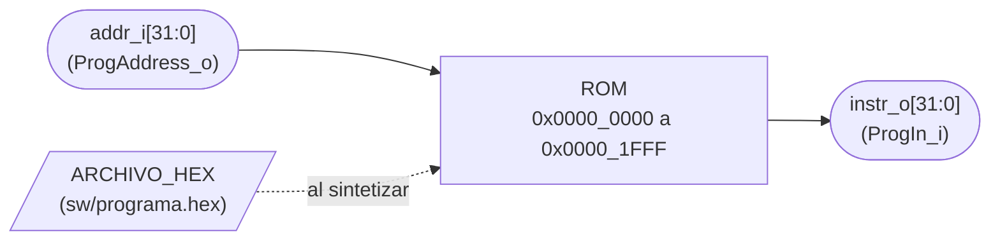
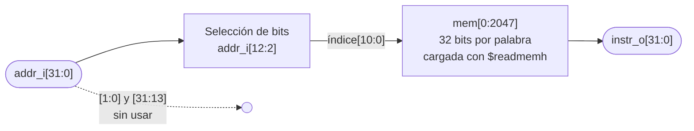

# ROM

## a) Nombre del módulo

ROM, memoria de programa. Módulo `rom` en `src/design/rom.sv`.

## b) Diagrama modular



Es el bloque "Memoria de programa (ROM)" del nivel 2 visto desde afuera. Lo que tiene adentro está en el
inciso i).

## c) Objetivo del módulo

Guardar el programa en ensamblador y entregarle al procesador la instrucción que pide, como exige la sección
4.4.1 del enunciado: el microprocesador usa una ROM para el programa, con un bus propio formado por
`ProgAddress_o[31:0]` y `ProgIn_i[31:0]`, separado del bus de datos.

La ROM no sabe nada del juego. Su contenido es la imagen que genera `sw/ensamblar.sh` a partir de
`sw/programa.s`, y queda fijo en el bitstream.

## d) Entradas

- `addr_i[31:0]`, dirección en bytes de la instrucción, desde `ProgAddress_o` del procesador (el `PC`).

El módulo tiene el parámetro `ARCHIVO_HEX`, ruta del archivo que se carga con `$readmemh`. La ruta es
relativa a la carpeta desde donde corre la herramienta, y el `GNUmakefile` usa dos distintas:

- `make synth` y `make bitstream` corren yosys desde la raíz del repo. Para ellos sirve el valor por defecto,
  `"sw/programa.hex"`.
- `make sim` corre la simulación desde `src/build/`. Los testbenches pasan su propia ruta relativa a esa
  carpeta, por ejemplo `"../sim/rom_prueba.hex"` o `"../../sw/programa.hex"`.

iverilog compila todos los módulos de `src/design/` con cada testbench, y los que nadie instancia quedan como
raíz con sus parámetros por defecto. Mientras no exista `top.sv`, la ROM es uno de ellos, así que los demás
testbenches muestran un aviso de `$readmemh` que no encuentra `sw/programa.hex`. Es inofensivo, porque esa ROM
suelta no está conectada a nada.

El tamaño no es un parámetro. `localparam PALABRAS = 2048` sale del mapa de memoria de la sección 4.4.2
(8 KB, de `0x0000_0000` a `0x0000_1FFF`).

No tiene `clk_i` ni `rst_i`, ver el inciso h).

## e) Salidas

- `instr_o[31:0]`, instrucción guardada en la palabra que apunta `addr_i`, hacia `ProgIn_i` del procesador.

## f) Relación con otros módulos

Habla con un solo módulo, `PROCESADOR_UNICICLO`, por el bus de instrucciones. No instancia ningún submódulo.

La ROM **no está en el bus de datos**. El Address Translator no la mapea, así que un `lw` no puede leerla y un
`sw` no puede escribirla. Por eso el programa guarda sus constantes como inmediatos y no como tablas en la ROM
(`nivel03.md`, sección del programa).

El contenido viene de `sw/programa.hex`, que genera `sw/ensamblar.sh` con binutils de GNU. Ese archivo es el
contrato entre el programa y el hardware: el programa se puede cambiar y volver a ensamblar sin tocar
`rom.sv`, y la ROM se puede verificar con cualquier otro `.hex` sin depender del programa.

## g) Explicación de funcionamiento

La ROM es una tabla de 2048 palabras de 32 bits. Cada instrucción de rv32i ocupa 4 bytes, así que la palabra
`n` guarda la instrucción que está en la dirección `4 × n`.

En cada ciclo el procesador pone el `PC` en `addr_i` y la ROM devuelve en `instr_o` la instrucción de esa
palabra **en el mismo ciclo**, sin esperar un flanco de reloj. Por ejemplo, con el programa actual:

| `PC` | Palabra | `instr_o` | Instrucción |
|---|---|---|---|
| `0x0000_0000` | 0 | `0x0001_0437` | `lui s0, 0x10` |
| `0x0000_0004` | 1 | `0x0001_14B7` | `lui s1, 0x11` |
| `0x0000_0008` | 2 | `0x0000_2937` | `lui s2, 0x2` |

Después de `rst_i` el procesador pone el `PC` en `0x0000_0000`, el vector de reset de la sección 4.4.2, y la
ROM entrega la primera instrucción del programa.

## h) Diseño

### Lectura asíncrona

En un procesador uniciclo la instrucción tiene que estar disponible en el mismo ciclo en que el `PC` cambia,
porque en ese ciclo se decodifica, se ejecuta y se escribe el resultado. Por eso la lectura es combinacional:

```systemverilog
assign instr_o = mem[addr_i[12:2]];
```

Las BRAM de la Artix-7 solo leen en forma síncrona (el dato sale un ciclo después de la dirección), así que
no sirven para esto sin cambiar el núcleo. La ROM se arma con LUT. Con el programa real, yosys la convierte en
lógica combinacional de unas pocas centenas de LUT, porque solo implementa las palabras que tienen
instrucción. La prueba de síntesis con openXC7 (yosys y nextpnr-xilinx) colocó y ruteó la ROM con el programa
completo junto con la RAM, con unas 1790 LUT entre las dos (cerca del 9 % del XC7A35T).

### Decodificación de la dirección

| Bits de `addr_i` | Uso |
|---|---|
| `[1:0]` | Se ignoran. Toda instrucción de rv32i está alineada a 4 bytes, así que el `PC` siempre termina en `00`. |
| `[12:2]` | Índice de la palabra, de 0 a 2047. |
| `[31:13]` | Se ignoran. |

Ignorar `[31:13]` hace que una dirección fuera de `0x0000_0000` a `0x0000_1FFF` repita la ROM (por ejemplo,
`0x0000_2000` lee la palabra 0). El `PC` nunca sale de la ROM con un programa correcto, así que comparar los
bits altos solo agregaría lógica en el camino crítico para un caso que no ocurre.

### Palabras sin programa

`$readmemh` carga solo las palabras que trae el archivo. Con el programa actual son 725 de 2048. Las demás no
tienen un valor definido:

- En síntesis yosys las trata como indiferentes y no gasta lógica en ellas.
- En simulación se leen como `X`. Si el `PC` se escapara del programa, la `X` se propagaría por el procesador y
  el testbench lo detectaría enseguida, en vez de ejecutar ceros en silencio.

### Formato del archivo

`sw/ensamblar.sh` genera el `.hex` con `objcopy -O verilog --verilog-data-width=4`. Cada línea tiene cuatro
palabras de 32 bits en hexadecimal, escritas como número (el byte más significativo primero), y el archivo
empieza con `@00000000`. `$readmemh` lee ese formato tal cual y pone la primera palabra en `mem[0]`.

### Sin reloj ni reset

La ROM no tiene estado: su contenido es fijo y la salida depende solo de `addr_i`. No necesita `clk_i` ni
`rst_i`. Lo que se reinicia es el `PC`, dentro del procesador.

### Síntesis

yosys puede absorber en la ROM el registro que le entrega la dirección (paso `memory_dff`): convierte "registro
del `PC` y lectura asíncrona" en "lectura síncrona con el dato registrado". El comportamiento visto desde el
procesador es el mismo, así que en el reporte de síntesis pueden aparecer flip-flops a la salida de la ROM que
no están en el RTL.

### Latches

No hay bloques `always`. La lectura es un `assign` y la carga es un `initial` con `$readmemh`, así que no
puede inferirse ningún latch.

### Verificación

`src/sim/tb_rom.sv` carga un `.hex` de prueba con valores conocidos y comprueba en forma automática:

- Cada palabra se lee en su dirección `4 × n`, incluidas la primera y la última (`0x0000_1FFC`).
- Los bits `[1:0]` no cambian el resultado (`0x0000_0004` a `0x0000_0007` leen lo mismo).
- Una dirección con los bits altos encendidos repite la ROM (`0x0000_2000` lee la palabra 0).
- Una palabra que el archivo no carga se lee como `X`.

Cuando `sw/programa.hex` llegue a esta rama, el testbench suma una comparación de las primeras palabras contra
el desensamblado de `sw/build/programa.lst`.

## i) Diagrama esquemático detallado del diseño



La ROM es una sola tabla de consulta: la selección de bits no tiene compuertas (son cables) y la memoria es
un multiplexor de 2048 entradas de 32 bits cuyo contenido fija el archivo. Al sintetizar, yosys convierte esa
tabla en LUT, `MUXF7` y `MUXF8` según el contenido del programa, así que un esquemático a nivel de compuertas
depende del `.hex` cargado y no muestra nada que el diagrama de arriba no diga.

## j) Diagrama completo de conexiones del diseño

La ROM no tiene puertos hacia pines de la Basys 3, así que no agrega nada a `src/fpga/basys3.xdc`.

Conexiones en el top:

- `addr_i[31:0]`, a `ProgAddress_o` de `PROCESADOR_UNICICLO`.
- `instr_o[31:0]`, a `ProgIn_i` de `PROCESADOR_UNICICLO`.
- `ARCHIVO_HEX` con su valor por defecto, `"sw/programa.hex"`.

Igual que en los demás módulos, el diagrama por chips que pide el método no aplica a un diseño que se
sintetiza dentro de una sola FPGA, y esta lista de puertos es el reemplazo propuesto.
