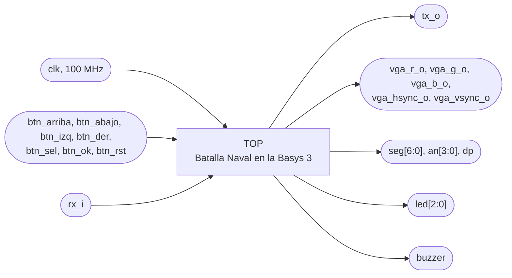
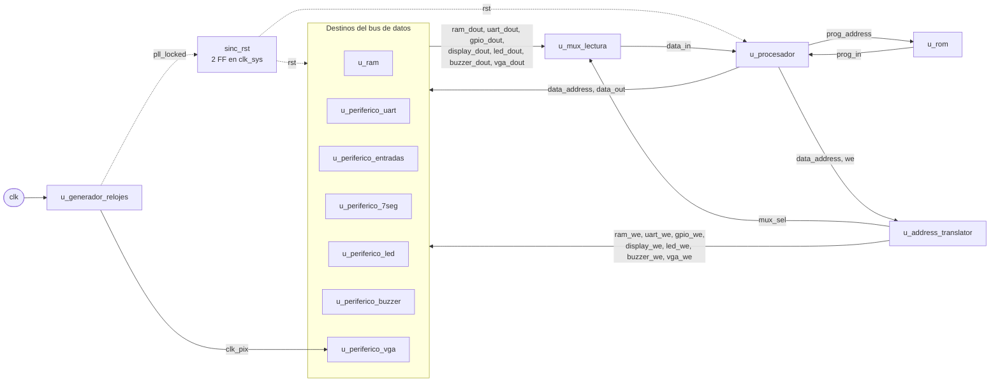

# TOP

## a) Nombre del módulo

TOP, módulo `top` en `src/design/top.sv`. Es el sistema completo, el bloque del nivel 1.

## b) Diagrama modular



## c) Objetivo del módulo

Conectar todos los bloques del sistema y llevarlos a los pines de la Basys 3: el PLL, el procesador
uniciclo, la ROM, la RAM, el controlador de mapeo (`address_translator` y `mux_lectura`) y los seis
periféricos. Es la plataforma sobre la que corre el programa en ensamblador.

No agrega lógica de juego ni ninguna otra, salvo el sincronizador del reinicio. Todas las decisiones de
la partida las toma el programa.

## d) Entradas

- `clk`, reloj de 100 MHz, pin W5.
- `btn_arriba`, `btn_abajo`, `btn_izq`, `btn_der`, navegación del Jugador 1, en `btnU`, `btnD`, `btnL` y
  `btnR`.
- `btn_sel`, rotar, en `btnC`.
- `btn_ok`, confirmar, en el switch SW0.
- `btn_rst`, partida nueva, en el switch SW15. Lo lee el programa, no reinicia el hardware.
- `rx_i`, línea serial desde la aplicación de PC, pin B18.

## e) Salidas

- `tx_o`, línea serial hacia la aplicación de PC, pin A18.
- `vga_r_o[3:0]`, `vga_g_o[3:0]`, `vga_b_o[3:0]`, `vga_hsync_o`, `vga_vsync_o`, conector VGA.
- `seg[6:0]`, `an[3:0]`, `dp`, los cuatro displays de 7 segmentos.
- `led[2:0]`, LD0 a LD2, uno por fase.
- `buzzer`, onda cuadrada hacia el buzzer en JC4.

El parámetro `ARCHIVO_HEX` (por defecto `sw/programa.hex`) es el programa que carga la ROM. Los
testbenches lo cambian por la ruta relativa a `src/build/`, desde donde corre la simulación.

## f) Relación con otros módulos

Instancia todos los bloques del nivel 2:

| Instancia | Módulo | Reloj |
|---|---|---|
| `u_generador_relojes` | `generador_relojes` | `clk` de entrada |
| `u_procesador` | `procesador_uniciclo` | `clk_sys` |
| `u_rom` | `rom` | ninguno, lectura combinacional |
| `u_address_translator` | `address_translator` | ninguno, combinacional |
| `u_mux_lectura` | `mux_lectura` | ninguno, combinacional |
| `u_ram` | `ram` | `clk_sys` |
| `u_periferico_uart` | `periferico_uart` | `clk_sys` |
| `u_periferico_entradas` | `periferico_entradas` | `clk_sys` |
| `u_periferico_7seg` | `periferico_7seg` | `clk_sys` |
| `u_periferico_led` | `periferico_led` | `clk_sys` |
| `u_periferico_buzzer` | `periferico_buzzer` | `clk_sys` |
| `u_periferico_vga` | `periferico_vga` | `clk_sys` y `clk_pix` |

## g) Explicación de funcionamiento

El procesador busca instrucciones en la ROM por su bus de programa (`ProgAddress_o`, `ProgIn_i`) y usa
el bus de datos (`DataAddress_o`, `DataOut_o`, `DataIn_i`, `we_o`) para todo lo demás. El controlador de
mapeo decide a qué destino va cada acceso: habilita la escritura de uno solo y elige qué dato vuelve por
`DataIn_i`. `DataAddress_o` y `DataOut_o` llegan a todos los destinos, y cada uno toma la parte de la
dirección que necesita.

Al configurarse la FPGA, el sistema queda en reinicio hasta que el PLL engancha. Cuando baja `rst`, el
procesador empieza a ejecutar el programa desde `0x0000_0000`.

## h) Diseño

### Reinicio

No hay pin de reset. El reinicio general es el botón PROG de la Basys 3, que vuelve a configurar la FPGA
desde la flash. `rst` sale de `~locked` del PLL por dos flip-flops en `clk_sys`:

```systemverilog
logic [1:0] sinc_rst = 2'b11;
always_ff @(posedge clk_sys) sinc_rst <= {sinc_rst[0], ~pll_locked};
assign rst = sinc_rst[1];
```

Los dos flip-flops arrancan en uno por el valor inicial de la configuración, así el sistema sale del
bitstream ya en reinicio y no depende de cuándo sube `locked`. La cadena de dos evita que `~locked`, que
no está sincronizado con `clk_sys`, llegue con metaestabilidad a los bloques. `PERIFERICO_VGA` vuelve a
sincronizar `rst` en su dominio de `clk_pix`.

`btn_rst` (SW15) no toca este reinicio. Es un bit más del periférico de entradas, y el programa lo
atiende empezando otra partida y conservando las partidas ganadas.

### Índice de registro de cada periférico

| Destino | `addr_i` | Por qué |
|---|---|---|
| RAM | `DataAddress_o` completa, usa `[11:2]` | 1024 palabras |
| UART | `DataAddress_o[3:2]` | Control en `0x40`, TX en `0x44` y RX en `0x48` dan `00`, `01` y `10` |
| Entradas, 7 segmentos, LED, buzzer | `2'b00` fijo | Tienen un solo registro. Con `DataAddress_o[3:2]` el LED en `0x0001_0138` recibiría `10` |
| VGA | `DataAddress_o[10:2]` | 512 palabras de la memoria de video |

### Frecuencia del reloj hacia los periféricos

La UART y el buzzer cuentan sus tiempos en ciclos de reloj, así que el top les pasa
`CLK_FREQ_HZ = 33_333_333` (el `localparam CLK_SYS_HZ`). Si cambia el divisor del PLL, hay que cambiar
ese valor.

### Latches

Solo tiene el `always_ff` del sincronizador. `make synth` del top y `make lint` no reportan latches.

## i) Diagrama esquemático detallado del diseño



`clk_sys` sale del PLL hacia el procesador, la RAM, los periféricos y el sincronizador, y no se dibuja
para mantener legible el diagrama. Los pines de cada periférico están en su ficha.

## j) Diagrama completo de conexiones del diseño

Restricciones en `src/fpga/basys3.xdc`, todas con `IOSTANDARD LVCMOS33`:

| Puerto | Pin | Recurso de la Basys 3 |
|---|---|---|
| `clk` | W5 | Oscilador de 100 MHz, con `create_clock -period 10.00` |
| `btn_arriba`, `btn_abajo`, `btn_izq`, `btn_der` | T18, U17, W19, T17 | `btnU`, `btnD`, `btnL`, `btnR` |
| `btn_sel` | U18 | `btnC` |
| `btn_ok` | V17 | SW0 |
| `btn_rst` | R2 | SW15 |
| `rx_i`, `tx_o` | B18, A18 | Puente USB-UART |
| `vga_r_o[0]` a `vga_r_o[3]` | G19, H19, J19, N19 | `vgaRed` |
| `vga_g_o[0]` a `vga_g_o[3]` | J17, H17, G17, D17 | `vgaGreen` |
| `vga_b_o[0]` a `vga_b_o[3]` | N18, L18, K18, J18 | `vgaBlue` |
| `vga_hsync_o`, `vga_vsync_o` | P19, R19 | `Hsync`, `Vsync` |
| `seg[0]` a `seg[6]` | W7, W6, U8, V8, U5, V5, U7 | Segmentos a a g |
| `dp` | V7 | Punto decimal |
| `an[0]` a `an[3]` | U2, U4, V4, W4 | Ánodos |
| `led[0]` a `led[2]` | U16, E19, U19 | LD0 a LD2 |
| `buzzer` | P18 | JC4 del Pmod JC |

El bitstream se graba en la flash con `make flash` y el jumper JP1 va en QSPI, así PROG reconfigura la
FPGA sin la PC.

Igual que en los demás módulos, el diagrama por chips que pide el método no aplica a un diseño que se
sintetiza dentro de una sola FPGA, y esta lista de puertos es el reemplazo propuesto.
