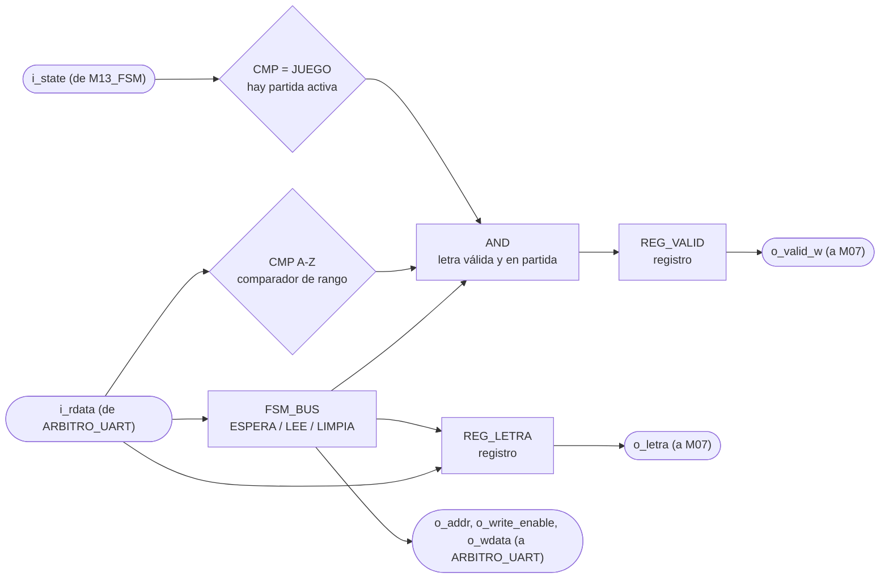
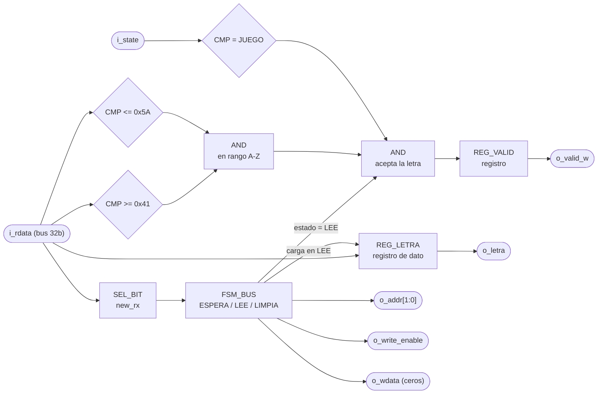

# UART_receptor

> Viene del Proyecto 2 y en el Proyecto 3 no se instancia. Sondeaba `new_rx`, leía el byte y filtraba letras según el estado de la FSM del Ahorcado. En el Proyecto 3 ese trabajo lo hace el programa en ensamblador directo sobre `PERIFERICO_UART`, porque la sección 4.1 del enunciado deja toda la lógica del juego en software. El periférico que sí se usa está en `PERIFERICO_UART.md`. El mapa de registros que usa esta documentación (control en `2'b10`) tampoco es el del Proyecto 3.

## a) Nombre del módulo

UART_receptor

## b) Diagrama modular

## c) Objetivo del módulo

Recibe los bytes que manda la aplicación del PC, se queda solo con los que son una letra A-Z
durante una partida activa, y los entrega a `M07_Comparador-letra`. Es el punto donde se descarta
todo lo que no debe llegar a la lógica del juego.

---

## d) Entradas

- `clk`, `rst`.
- `i_rdata[WIDTH-1:0]`, lo que devuelve `PERIFERICO_UART` en la dirección que este módulo le está
  poniendo, de ahí saca el bit `new_rx` y el byte recibido. Llega pasando por `ARBITRO_UART`.
- `i_state[2:0]`, estado actual, desde `M13_FSM`. De acá solo le interesa JUEGO.

El dato no le llega por una flecha propia en el diagrama de tercer nivel, entra por el bus de 32
bits que comparte con `UART_transmisor` a través de `ARBITRO_UART`.

El módulo está parametrizado con `WIDTH = 32`, el ancho del bus. El byte serial es
`BYTE_WIDTH = 8` y va como `localparam` dentro de la lista de parámetros, porque los núcleos del
curso siempre mueven 8 bits y no tiene sentido que dependa del ancho del bus.

---

## e) Salidas

- `o_letra[BYTE_WIDTH-1:0]`, letra recibida en ASCII tal como salió del periférico, hacia
  `M07_Comparador-letra`.
- `o_valid_w`, pulso de un ciclo que habilita esa letra, hacia `M07_Comparador-letra`, donde entra
  como `i_letra_nueva`.
- `o_addr[1:0]`, `o_write_enable`, `o_wdata[WIDTH-1:0]`, petición hacia el bus, que entra por la
  cara del receptor de `ARBITRO_UART`.

`o_letra` y `o_valid_w` salen de registros, así que juntas cumplen el papel de `REG_Letra-in` del
diagrama de tercer nivel y en el top no hace falta un registro aparte.

---

## f) Relación con otros módulos

Del lado del bus habla con `PERIFERICO_UART`. Le sondea el bit `new_rx` del registro de control,
le lee el registro de datos de recepción, y le vuelve a escribir el registro de control para bajar
`new_rx`. Esa limpieza es responsabilidad de quien instancia la interfaz, según el enunciado, y le
toca a este módulo.

Del lado del juego solo le habla a `M07_Comparador-letra`, con el dato y su pulso de habilitación,
que en el diagrama de tercer nivel pasan por `REG_Letra-in`. No le reporta nada a `M13_FSM`. En el
planteamiento anterior este módulo le avisaba a la FSM que había llegado una letra, y ahora ya no
hace falta, porque la FSM no participa en el ciclo de validación de letras.

De `M13_FSM` recibe `i_state`, y lo usa para decidir si la letra pasa o se bota.

El módulo comparte el bus de 32 bits con `UART_transmisor`, que es quien transmite. Los dos
acceden al mismo periférico, y quien resuelve el choque es `ARBITRO_UART`, que le da prioridad
absoluta a este módulo. Por eso el receptor se escribió como si el bus fuera solo suyo, no tiene
entrada de concesión ni sabe esperar, su FSM avanza pase lo que pase.

Este módulo nunca escribe el registro de datos de transmisión, solo el bit `new_rx` del de
control. Aun así el choque existe, porque escribir ese registro con ceros también bajaría el
`send` del transmisor. Esa parte la arregla el árbitro recomponiendo la palabra, y está explicada
en su documento.

---

## g) Explicación de funcionamiento

El módulo vive sondeando `new_rx`. Mientras esté en cero no hace nada y no toca el bus más allá de
mantener la dirección del registro de control para poder leerlo.

Cuando `new_rx` se levanta, hay un byte esperando. El módulo lo lee del registro de datos de
recepción y le hace dos preguntas. Si el byte cae en el rango A-Z, y si el sistema está en JUEGO.
Solo si las dos son ciertas levanta `o_valid_w` durante un ciclo, que es lo que dispara la
evaluación en `M07_Comparador-letra`.

Pase lo que pase con esas dos preguntas, el módulo limpia `new_rx`. Ese detalle es importante. Si
solo se limpiara cuando la letra se acepta, un byte basura recibido durante la pantalla de
selección de modo dejaría el bit levantado para siempre y el receptor quedaría trabado, sin poder
recibir nunca más. El byte se descarta, pero el periférico se libera igual.

Acá se resuelve lo que el enunciado exige documentar de forma explícita. Una letra que llega
mientras el sistema está en selección de modo o mostrando el resultado final se descarta en este
punto. No llega a `M07_Comparador-letra`, no consume intento y no toca el temporizador. La
aplicación de PC además filtra antes de mandar, pero ese filtro es por comodidad, el que de verdad
manda es este.

---

## h) Diseño

### Validación del byte

El rango de letras mayúsculas en ASCII va de `0x41` a `0x5A`:

| `i_rdata[7:0]`    | En rango A-Z |
| ----------------- | ------------ |
| `< 0x41`          | `0`          |
| `0x41` a `0x5A`   | `1`          |
| `> 0x5A`          | `0`          |

Se comparan los dos extremos con dos comparadores y se juntan con un AND. No se traduce a
minúsculas ni se corrige nada, el enunciado dice que todo byte que no sea una mayúscula A-Z se
descarta sin afectar la partida.

### Decisión de aceptar la letra

Tabla de verdad principal del módulo:

| `new_rx` | `en_rango` | `i_state = JUEGO` | `o_valid_w` | Limpia `new_rx` | Resultado |
| -------- | ---------- | ----------------- | ----------- | --------------- | --------- |
| `0`      | `x`        | `x`               | `0`         | no              | no hay dato |
| `1`      | `0`        | `x`               | `0`         | sí              | byte no alfabético, se bota |
| `1`      | `1`        | `0`               | `0`         | sí              | letra fuera de partida, se bota |
| `1`      | `1`        | `1`               | `1`         | sí              | letra aceptada |

Las tres últimas filas limpian `new_rx`, que es la propiedad que mantiene vivo el receptor pase lo
que pase con el byte.

### Secuencia de acceso al bus

La lectura no es de un solo ciclo, porque hay que poner la dirección, muestrear `i_rdata` y
después escribir de vuelta el registro de control. Se resuelve con una FSM interna de tres
estados, que no tiene nada que ver con la FSM principal del juego:

| Estado actual | Condición    | Estado siguiente | `o_addr`        | `o_write_enable` |
| ------------- | ------------ | ---------------- | --------------- | ---------------- |
| ESPERA        | `new_rx = 0` | ESPERA           | REG_CTRL        | `0`              |
| ESPERA        | `new_rx = 1` | LEE              | REG_CTRL        | `0`              |
| LEE           | siempre      | LIMPIA           | REG_DATOS_RX    | `0`              |
| LIMPIA        | siempre      | ESPERA           | REG_CTRL        | `1`              |

En LEE se muestrea el dato y se evalúa la tabla anterior, y ahí es donde sale el pulso `o_valid_w`.
`o_letra` también se carga en LEE, aunque el byte se vaya a botar. No afecta nada, porque
`M07_Comparador-letra` solo mira la letra en el ciclo en que llega el pulso.

En LIMPIA se escribe el registro de control con `o_wdata` en ceros, o sea `new_rx` en cero. El
`send` del transmisor, que en esa escritura también iría en cero, lo rescata `ARBITRO_UART`.

El mapa de direcciones ya está cerrado y se documenta en `PERIFERICO_UART.md`. Este módulo usa
`2'b10` para el registro de control y `2'b01` para el de datos de recepción, esa segunda la fija
el enunciado. Los dos valores van como `localparam`, no como `parameter`, porque son parte fija
del mapa de registros y ningún testbench necesita moverlos.

### Por qué sondeo y no interrupción

El periférico no ofrece una línea de interrupción, solo el bit `new_rx`. A 115200 baudios un byte
tarda unos 87 µs en llegar completo, y el ciclo de sondeo de esta FSM dura tres ciclos de reloj de
100 MHz, o sea 30 ns. Sobra margen de tres órdenes de magnitud, así que no hay riesgo de perder un
byte por sondear demasiado lento.

---

## i) Diagrama esquemático detallado del diseño

`clk` y `rst` entran a `REG_LETRA`, a `REG_VALID` y a `FSM_BUS` aunque no se dibujen.

---

## j) Diagrama completo de conexiones del diseño

Este módulo no tiene puertos físicos propios. La línea RX de la tarjeta entra al núcleo TX/RX
dentro de `PERIFERICO_UART`, no acá, así que la restricción de pin del puente USB-UART pertenece a
ese periférico y no a este archivo.

Conexiones en `src/design/top.sv`, instancia `u_receptor_uart`:

- `clk`, al reloj global de 100 MHz, pin W5.
- `rst`, a la entrada `rst` del top, el botón central en el pin U18.
- `i_state`, desde `M13_FSM`.
- `i_rdata`, desde `o_rx_rdata` de `ARBITRO_UART`.
- `o_addr`, `o_write_enable`, `o_wdata`, hacia `i_rx_addr`, `i_rx_we` e `i_rx_wdata` de
  `ARBITRO_UART`.
- `o_letra`, `o_valid_w`, hacia `i_letra` e `i_letra_nueva` de `M07_Comparador-letra`.

Igual que en los demás módulos, el diagrama por chips que pide el método no aplica a un diseño que
se sintetiza dentro de una sola FPGA, y esta lista de puertos es el reemplazo propuesto.
