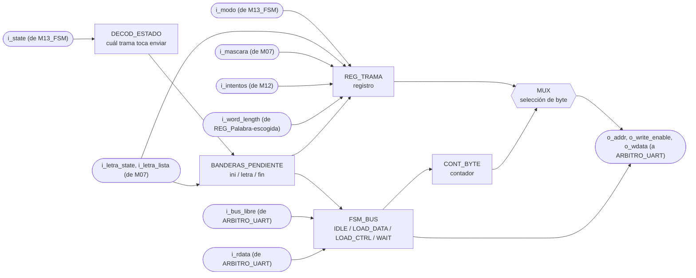
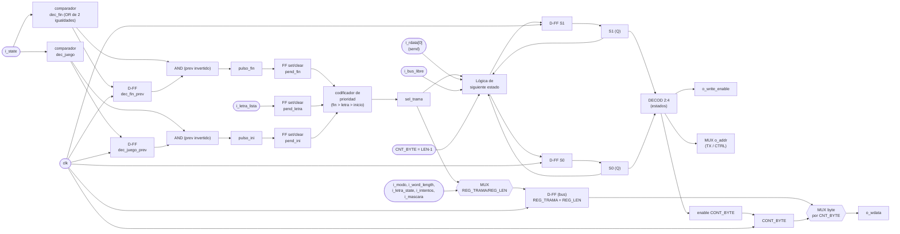

# UART_transmisor

> Viene del Proyecto 2 y en el Proyecto 3 no se instancia. Armaba las tramas `I`, `L` y `F` del Ahorcado a partir de eventos de la FSM y las mandaba byte a byte. En el Proyecto 3 las tramas las arma el programa en ensamblador y las escribe directo en `PERIFERICO_UART`, porque la sección 4.1 del enunciado deja toda la lógica del juego en software. El mapa de registros que usa esta documentación (control en `2'b10`) tampoco es el del Proyecto 3.

## a) Nombre del módulo

UART_transmisor

## b) Diagrama modular



## c) Objetivo del módulo

Ensamblar y transmitir hacia la PC, por UART, las tramas de estado del juego que exige la sección
3.4.4 del enunciado, inicio de partida con modo y longitud, resultado de cada letra con el patrón
actualizado y los intentos, y resultado final con su causa.

Decide solo cuándo transmitir. Al ver que `i_state` entró a JUEGO manda la trama de inicio, con
cada letra evaluada manda la trama de letra, y al entrar a GANO o PERDIO manda la de fin.

La FSM llega a PERDIO tanto por intentos como por tiempo, así que `i_state` solo no alcanza para
la causa. El módulo la saca de `i_intentos` al entrar. Si la cuenta llegó a 6 se perdió por
intentos, y con cualquier otro valor fue el tiempo. Eso es confiable porque `M12_Contador-Intentos`
solo se limpia en CARGA, así que durante PERDIO la cuenta sigue intacta, y coincide con la
prioridad de la FSM, que ante intentos agotados y tiempo en cero en el mismo ciclo escoge intentos.

## d) Entradas

- `clk`, `rst`.
- `i_state[2:0]`: estado actual, desde `M13_FSM`, decide cuál trama toca enviar.
- `i_modo`: modo de la partida, desde `M13_FSM`, viaja en la trama de inicio.
- `i_letra_state[1:0]`: resultado de la última letra, desde `M07_Comparador-letra`. La
  codificación es `00` fallo, `01` acierto, `10` repetida, y el `11` no se usa.
- `i_letra_lista`: estrobo de un ciclo que acompaña a `i_letra_state`, desde
  `M07_Comparador-letra`. Es el que dispara la trama, no el valor de `i_letra_state`, porque dos
  letras seguidas con el mismo resultado no cambian ese bus y sin estrobo la segunda se perdería.
- `i_intentos[2:0]`: fallos acumulados de la partida, desde `M12_Contador-Intentos`. Llega a 6,
  así que 3 bits alcanzan. Viaja en la trama de letra y además decide la causa de una derrota.
- `i_word_length[3:0]`: longitud de la palabra escogida, desde `REG_Palabra-escogida`, que en el
  top es `word[63:60]` de `M08_LFSR`.
- `i_mascara[WORD_MAXLEN-1:0]`: posiciones ya reveladas, desde `M07_Comparador-letra`. Es el
  patrón que el enunciado pide mandar junto con el resultado de la letra.
- `i_rdata[WIDTH-1:0]`: lectura de vuelta del bus, de ahí sondea el bit `send` para saber si el
  periférico sigue ocupado. Llega pasando por `ARBITRO_UART`.
- `i_bus_libre`: desde `ARBITRO_UART`, dice si este ciclo el bus es suyo.

El módulo está parametrizado con `WIDTH = 32`, el ancho del bus, y con `WORD_MAXLEN = 12`, el
mismo valor que usan `M07_Comparador-letra` y el banco de palabras. El byte serial es
`BYTE_WIDTH = 8` fijo, porque los núcleos del curso siempre mueven 8 bits.

## e) Salidas

- `o_write_enable`, `o_addr[1:0]`, `o_wdata[WIDTH-1:0]`: petición hacia el bus, que entra por la cara
  del transmisor de `ARBITRO_UART`.

Todo lo que el módulo tiene que decir viaja empaquetado dentro de `o_wdata`, un byte a la vez.
La etiqueta `modo/letra_state/Resultado/w_word/Intentos` del diagrama de nivel 3 describe ese
contenido, no puertos separados.

## f) Explicación de la relación con otros módulos

Recibe `i_state` y `i_modo` de `M13_FSM`, `i_letra_state`, `i_letra_lista` e `i_mascara` de
`M07_Comparador-letra`, `i_intentos` de `M12_Contador-Intentos` y `i_word_length` de
`REG_Palabra-escogida`. No le devuelve nada a ninguno, es un módulo de salida pura hacia el
periférico, igual que `M04_Mostrar-LCD` lo es hacia el LCD.

Comparte el periférico UART con `UART_receptor`, y ese reparto lo resuelve `ARBITRO_UART`,
que le da prioridad al receptor. De ahí sale `i_bus_libre`, la única entrada que este módulo tuvo
que agregar para convivir con el otro maestro. Cuando el bus no es suyo, el módulo no avanza y
reintenta el ciclo siguiente.

A diferencia de `M02_Generador-Tono`, que puede perderse un evento sin consecuencias graves
porque un tono que no suena no rompe la partida, acá perder o cortar una trama deja a la PC con
una vista inconsistente del juego. Por eso los eventos que llegan mientras el módulo está
ocupado no se descartan, quedan retenidos en las banderas que se explican en h).

## g) Explicación de funcionamiento

El módulo es una FSM chiquita que traduce un evento de un solo pulso en una ráfaga de
transacciones de bus.

El periférico UART no expone `busy` y `done` como bits separados, como sí hace el LCD. Expone un
único bit `send` que el maestro escribe en 1 para pedir el envío y que el hardware baja solo
cuando el byte ya salió completo. Ese bit sirve entonces de orden y de bandera de ocupado, y el
módulo lo lee de vuelta por `i_rdata` antes de mandar el siguiente byte de la trama.

Para cada byte el módulo hace tres cosas en orden. Lo escribe en el registro de datos de
transmisión, levanta `send` en el registro de control, y espera a leer `send` en cero. Ahí sabe
que el periférico terminó y sigue con el byte siguiente, o vuelve a IDLE si ya mandó la trama
entera.

Tres eventos disparan una trama nueva. La entrada a JUEGO, cada estrobo `i_letra_lista`, y la
entrada a un estado de fin. Como los tres pueden ocurrir mientras el módulo sigue ocupado con
una trama anterior, cada uno levanta su bandera de pendiente y espera turno.

## h) Diseño

### Formato de las tramas

Protocolo binario, un byte de cabecera que identifica el tipo y detrás el contenido:

| Trama | Disparador | Cabecera | Byte 1 | Byte 2 | Byte 3 | Byte 4 | Largo |
|---|---|---|---|---|---|---|---|
| INICIO | entrada a JUEGO | `"I"` (`0x49`) | `{7'b0, modo}` | `{4'b0, word_length}` | | | 3 |
| LETRA | `i_letra_lista` | `"L"` (`0x4C`) | `{6'b0, letra_state}` | `{5'b0, intentos}` | `mascara[7:0]` | `mascara[15:8]` | 5 |
| FIN | entrada a GANO o PERDIO | `"F"` (`0x46`) | `{5'b0, causa}` | | | | 2 |

La causa usa los códigos que la app de PC ya conoce, `011` ganó, `100` perdió por intentos y `101`
perdió por tiempo. El `101` ya no existe como estado de la FSM, solo sobrevive dentro de la trama.

Las cabeceras son caracteres ASCII imprimibles solo para que la trama cruda se pueda leer con un
monitor serial durante la depuración. La app de PC las trata como bytes, no como texto.

La máscara viaja en dos bytes, poco significativo primero, aunque con `WORD_MAXLEN = 12` sobren
cuatro bits. Se hizo así para que el formato no cambie si el banco de palabras crece a 16
caracteres.

Ojo con un detalle de la máscara. `M07_Comparador-letra` arranca las posiciones de relleno en
unos, para que su comparación de palabra completa funcione igual con una palabra de 4 letras que
con una de 12. O sea que los bits por encima de `word_length` llegan en 1 sin que eso signifique
nada. La app de PC solo debe mirar los primeros `word_length` bits, y por eso la trama de inicio
manda la longitud antes que cualquier máscara.

La trama de letra también sale cuando la letra estaba repetida. Es a propósito. El enunciado dice
que una letra repetida se ignora y no gasta intento, pero si la FPGA no contesta nada, la PC se
queda esperando una respuesta que nunca llega y el usuario vuelve a escribir. Se le contesta con
`letra_state = 10` y el mismo patrón de antes, así la PC sabe que el byte llegó y que no cambió
nada.

### Direcciones del periférico

- Registro de datos de transmisión en `2'b00`, la fija el enunciado.
- Registro de control en `2'b10`, la escogió el equipo y está documentada en
  `PERIFERICO_UART.md`.

Van como `localparam`, no como `parameter`. No son constantes que un testbench necesite ajustar
para simular más rápido, son parte fija del mapa de registros.

Este módulo escribe el control con `32'h1`, o sea con `new_rx` en cero, lo que borraría un byte
recibido esperando. Quien lo evita es `ARBITRO_UART`, que recompone la palabra antes de que
llegue al periférico. El módulo no tiene que saber nada de eso.

### Detección de disparo y banderas pendientes

La entrada a JUEGO y la entrada a un estado de fin son niveles, y hay que convertirlos en pulsos
de un ciclo con un registro de retardo:

```
dec_juego  = (i_state == JUEGO)
dec_fin    = (i_state == GANO) | (i_state == PERDIO)
pulso_ini  = dec_juego AND (NOT dec_juego_prev)
pulso_fin  = dec_fin   AND (NOT dec_fin_prev)
```

`i_letra_lista` ya viene como pulso de un ciclo desde M07, así que no necesita detector.

Esos tres pulsos no cargan la trama de una vez, primero levantan una bandera que se mantiene alta
hasta que la FSM la atienda:

| Bandera | Se levanta con | Valores que captura | Se limpia cuando |
|---|---|---|---|
| `pend_ini` | `pulso_ini` | ninguno, `i_modo` e `i_word_length` se leen al cargar | la FSM la consume |
| `pend_letra` | `i_letra_lista` | `i_letra_state`, `i_intentos`, `i_mascara` | la FSM la consume |
| `pend_fin` | `pulso_fin` | la causa, `GANO` si ganó y si no `100` o `101` según `i_intentos` | la FSM la consume |

Consumir está atado a la transición y no solo al estado. Una bandera se limpia únicamente en el
ciclo en que la FSM de verdad arranca la trama, o sea estando en IDLE, con pendiente, y con el
bus libre. Si se limpiara solo por estar en IDLE, una pendiente que aparece mientras el árbitro
tiene el bus ocupado se borraría sin haberse mandado nunca.

Cuando el set y el clear coinciden en el mismo ciclo, gana el set. Eso pasa si llega una letra
nueva justo cuando se está consumiendo la anterior, y con la prioridad al revés el evento nuevo
se perdería.

Si un segundo evento del mismo tipo llega mientras el primero sigue sin atender, el valor
capturado se sobreescribe con el más reciente y el viejo se pierde. Es una limitación aceptada.
Una trama de 5 bytes a 115200 baudios tarda 434 µs, y ninguna persona escribe dos letras con
menos de medio milisegundo de diferencia.

En IDLE se decide cuál pendiente atender, con la misma prioridad que ya usa `M02_Generador-Tono`:

| `pend_fin` | `pend_letra` | `pend_ini` | Trama que se carga |
|---|---|---|---|
| `1` | `x` | `x` | FIN |
| `0` | `1` | `x` | LETRA |
| `0` | `0` | `1` | INICIO |
| `0` | `0` | `0` | ninguna, se queda en IDLE |

El fin de partida va primero a propósito. Si el jugador completa la palabra con la última letra,
quedan pendientes la trama de letra y la de fin al mismo tiempo, y a la PC le sirve más saber
antes que la partida terminó.

### Máquina de estados

Cuatro estados, codificados `IDLE=00`, `LOAD_DATA=01`, `LOAD_CTRL=10`, `WAIT=11`:

| Estado actual | `i_bus_libre` | hay pendiente | `send` leído | `CNT_BYTE = LEN-1` | Estado siguiente |
|---|---|---|---|---|---|
| IDLE | `x` | `0` | `x` | `x` | IDLE |
| IDLE | `0` | `1` | `x` | `x` | IDLE, espera el bus |
| IDLE | `1` | `1` | `x` | `x` | LOAD_DATA, carga la trama y pone `CNT_BYTE = 0` |
| LOAD_DATA | `0` | `x` | `x` | `x` | LOAD_DATA, reintenta la escritura |
| LOAD_DATA | `1` | `x` | `x` | `x` | LOAD_CTRL |
| LOAD_CTRL | `0` | `x` | `x` | `x` | LOAD_CTRL, reintenta la escritura |
| LOAD_CTRL | `1` | `x` | `x` | `x` | WAIT |
| WAIT | `0` | `x` | `x` | `x` | WAIT |
| WAIT | `1` | `x` | `1` ocupado | `x` | WAIT |
| WAIT | `1` | `x` | `0` libre | `0` | LOAD_DATA, `CNT_BYTE + 1` |
| WAIT | `1` | `x` | `0` libre | `1` | IDLE |

Salidas por estado, que es Moore salvo por el byte que sale del contador:

| Estado | `o_addr` | `o_write_enable` | `o_wdata` |
|---|---|---|---|
| IDLE | control | `0` | ceros |
| LOAD_DATA | datos TX | `1` | `{24'b0, byte_actual}` |
| LOAD_CTRL | control | `1` | `32'h1`, o sea `send` |
| WAIT | control | `0` | ceros |

En IDLE y en WAIT la dirección queda apuntando al control, que es lo que el módulo quiere leer
en esos estados. Para el árbitro eso no cuenta como pedir el bus, así que los dos maestros pueden
sondear el control a la vez sin estorbarse.

El sondeo de `send` solo tiene sentido con el bus concedido. Cuando el árbitro se lo corta, el
`i_rdata` llega en ceros, y un cero en el bit `send` significaría que el periférico está libre
cuando en realidad nadie preguntó. Por eso la condición de salida de WAIT lleva `i_bus_libre`
además del bit, y no solo el bit.

### Latches

El bloque de salidas es un `always_comb` con valores por defecto asignados antes del `case`, así
que ninguna combinación queda sin cubrir. `make synth SYNTH_TOP=transmisor_uart` pasa sin
`Latch inferred` en el log.

## i) Diagrama esquemático detallado (por compuertas lógicas)



`clk` y `rst` entran a todo registro y contador del módulo aunque no se dibujen en cada elemento.
`rst` fuerza el estado a IDLE, limpia las tres banderas `pend_*` y pone `o_write_enable` en cero,
así que después de un reset el módulo queda mudo hasta el siguiente evento.

## j) Diagrama completo de conexiones del diseño

Este módulo no tiene puertos físicos propios. La línea TX de la tarjeta sale del núcleo que vive
dentro de `PERIFERICO_UART`, así que la restricción de pin pertenece a ese periférico.

Conexiones en `src/design/top.sv`, instancia `u_transmisor_uart`:

- `clk`, al reloj global de 100 MHz, pin W5.
- `rst`, a la entrada `rst` del top, el botón central en el pin U18.
- `i_state`, `i_modo`, desde `M13_FSM`.
- `i_letra_state`, `i_letra_lista`, `i_mascara`, desde `M07_Comparador-letra`.
- `i_intentos`, desde `o_intentos` de `M12_Contador-Intentos`.
- `i_word_length`, desde `word[63:60]`, la palabra que entrega `M08_LFSR`.
- `i_rdata`, `i_bus_libre`, desde `o_tx_rdata` y `o_tx_bus_libre` de `ARBITRO_UART`.
- `o_addr`, `o_write_enable`, `o_wdata`, hacia `i_tx_addr`, `i_tx_we` e `i_tx_wdata` de
  `ARBITRO_UART`.

Igual que en los demás módulos, el diagrama por chips que pide el método no aplica a un diseño
que se sintetiza dentro de una sola FPGA, y esta lista de puertos es el reemplazo propuesto.
