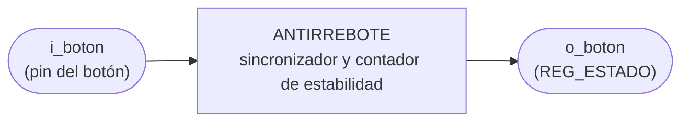
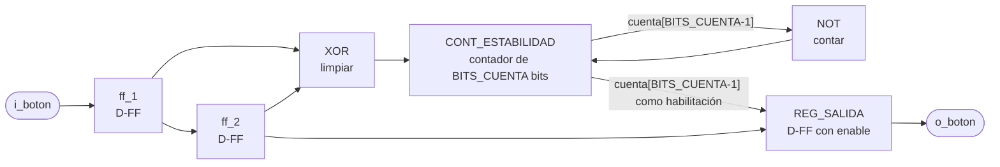

# ANTIRREBOTE

## a) Nombre del módulo

ANTIRREBOTE, módulo `antirrebote` en `src/design/antirrebote.sv`.

## b) Diagrama modular

## c) Objetivo del módulo

Entregar el nivel de un botón sin rebotes y ya dentro del dominio del reloj de 100 MHz. El nivel de salida
solo cambia cuando la entrada lleva unos 10.5 ms quieta en el valor nuevo. Es el `debounce` del Proyecto 2
con otro nombre y los puertos al estilo del repo, la lógica es la misma.

## d) Entradas

- `clk`, reloj del sistema de 100 MHz.
- `rst`, reset síncrono.
- `i_boton`, el pin del botón tal cual llega a la FPGA, asíncrono y con rebotes. Activo en alto.

El módulo tiene el parámetro `BITS_CUENTA = 21`, que en el Proyecto 2 se llamaba `N`. En simulación se baja
para no esperar un millón de ciclos por cada cambio.

## e) Salidas

- `o_boton`, nivel del botón filtrado. En alto mientras el botón está presionado.

## f) Relación con otros módulos

Solo lo instancia `PERIFERICO_ENTRADAS`, una vez por cada uno de los siete botones del Jugador 1. `i_boton`
viene directo del pin y `o_boton` va a un bit de `REG_ESTADO`.

## g) Explicación de funcionamiento

La entrada pasa primero por dos flip-flops en cascada, `ff_1` y `ff_2`. Con eso el resto del módulo trabaja
con una señal sincronizada al reloj, y de paso la pareja sirve para ver si el botón cambió. Si `ff_1` y
`ff_2` son distintos, la entrada se movió en el último ciclo.

`CONT_ESTABILIDAD` se pone en cero cada vez que la entrada se mueve y cuenta mientras se queda quieta.
Cuando su bit más alto llega a 1 la entrada lleva `2^(BITS_CUENTA-1)` ciclos sin moverse, y desde ahí
`REG_SALIDA` copia a `ff_2` en cada ciclo. Mientras el botón rebota el contador se reinicia una y otra vez y
nunca llega arriba, así que la salida se queda en el valor viejo.

Con `BITS_CUENTA = 21` son `2^20 = 1 048 576` ciclos, 10.49 ms a 100 MHz. La investigación previa pide al
menos 10 ms, y con eso se cubre el rebote típico de 1 a 10 ms.

## h) Diseño

### Qué cambió respecto al Proyecto 2

- `debounce` pasa a llamarse `antirrebote`, y los puertos a `i_boton` y `o_boton`.
- `N` pasa a `BITS_CUENTA` y entra en la lista `#(...)` del módulo, en el Proyecto 2 estaba declarado
  adentro con `parameter`.
- `dff1`, `dff2`, `q_reg`, `q_next`, `q_rst` y `q_add` pasan a `ff_1`, `ff_2`, `cuenta`, `cuenta_sig`,
  `limpiar` y `contar`, todos como `logic` en vez de `reg` y `wire`.

El detector de flanco que estaba en `botones.sv` no se trae. En el Proyecto 2 la FSM necesitaba un pulso de
un ciclo por presión. Acá el que lee los botones es el programa, y el flanco lo saca él comparando la
lectura actual con la anterior (ver `PERIFERICO_ENTRADAS.md`).

### Señales internas

- `limpiar = ff_1 ^ ff_2`, la entrada cambió en el último ciclo.
- `contar = ~cuenta[BITS_CUENTA-1]`, el contador todavía no llegó arriba.

### CONT_ESTABILIDAD

| `limpiar` | `contar` | `cuenta_sig`  |
| --------- | -------- | ------------- |
| `1`       | `x`      | `0`           |
| `0`       | `1`      | `cuenta + 1`  |
| `0`       | `0`      | `cuenta`      |

Arriba se queda quieto hasta que la entrada vuelva a moverse, así que no hace falta un comparador contra el
máximo.

### Registros

| Condición                  | `ff_1'`    | `ff_2'` | `cuenta'`    | `o_boton'`   |
| -------------------------- | ---------- | ------- | ------------ | ------------ |
| `rst`                      | `0`        | `0`     | `0`          | `0`          |
| `cuenta[BITS_CUENTA-1]`    | `i_boton`  | `ff_1`  | `cuenta_sig` | `ff_2`       |
| resto                      | `i_boton`  | `ff_1`  | `cuenta_sig` | sin cambio   |

En el ciclo en que la entrada se mueve `cuenta` todavía está arriba y `o_boton` copia a `ff_2`, pero `ff_2`
todavía tiene el valor viejo. Al ciclo siguiente `cuenta` ya está en cero. Por eso el primer cambio de un
rebote nunca se cuela a la salida.

### Tiempo mínimo de cada nivel

Para que `o_boton` cambie, la entrada tiene que quedarse quieta `2^(BITS_CUENTA-1)` ciclos en el valor
nuevo. Entonces cada nivel de `o_boton` dura por lo menos 10.49 ms, sin importar qué tan rápido rebote o se
suelte el botón. `PERIFERICO_ENTRADAS` se apoya en esto para que el programa no pierda presiones sin
necesidad de banderas.

La latencia de una presión limpia es de dos ciclos del sincronizador, más `2^(BITS_CUENTA-1)`, más uno de
`REG_SALIDA`. Queda en 10.5 ms, muy por debajo de lo que alguien nota al apretar un botón.

### Latches

`CONT_ESTABILIDAD` es un `always_comb` con `case` y rama `default` que asigna `cuenta_sig` en todas las
ramas. Los cuatro registros van en un solo `always_ff` con reset síncrono.

## i) Diagrama esquemático detallado del diseño

`clk` y `rst` entran a los cuatro registros aunque no se dibujen.

TODO: Revisar y reemplazar por el esquemático por compuertas generado desde `antirrebote.sv` cuando exista, igual que en `PERIFERICO_UART.md`.

## j) Diagrama completo de conexiones del diseño

Conexiones dentro de `PERIFERICO_ENTRADAS`, una instancia por bit `k` de 0 a 6.

- `clk`, a `clk_i`.
- `rst`, a `rst_i`.
- `i_boton`, a `botones_i[k]`.
- `o_boton`, a `estado[k]`, el bit `k` de `REG_ESTADO`.

Igual que en los demás módulos, el diagrama por chips que pide el método no aplica a un diseño que se
sintetiza dentro de una sola FPGA, y esta lista de puertos es el reemplazo propuesto.
