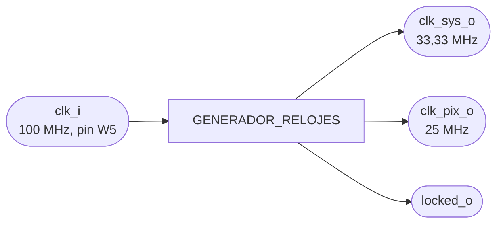
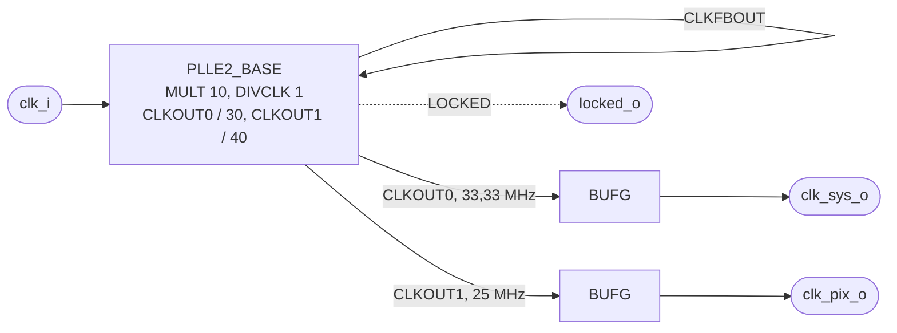

# GENERADOR_RELOJES

## a) Nombre del módulo

GENERADOR_RELOJES, módulo `generador_relojes` en `src/design/generador_relojes.sv`. Es el bloque PLL
del nivel 2.

## b) Diagrama modular

## c) Objetivo del módulo

Sacar del único reloj de entrada de la Basys 3 los dos relojes del sistema, como pide el enunciado
(sección 4.4.1): un reloj de píxel de 25 MHz para el VGA y el reloj del procesador, las memorias y los
periféricos, de 33,33 MHz. Los dos salen de una primitiva PLL, nunca de un divisor hecho con lógica.
También avisa con `locked_o` cuando los dos relojes ya son estables, y de ahí sale el reinicio del
sistema.

## d) Entradas

- `clk_i`, reloj de 100 MHz del oscilador de la Basys 3, pin W5.

No tiene reinicio. El PLL arranca solo cuando termina la configuración de la FPGA.

## e) Salidas

- `clk_sys_o`, 33,33 MHz (periodo de 30 ns), por una red global de reloj. En `top.sv` es `clk_sys`.
- `clk_pix_o`, 25 MHz (periodo de 40 ns), por una red global de reloj. En `top.sv` es `clk_pix`.
- `locked_o`, en alto cuando el PLL enganchó y las dos salidas son estables.

## f) Relación con otros módulos

Lo instancia `top.sv` como `u_generador_relojes`. `clk_sys_o` llega al procesador, a la RAM y a los seis
periféricos. `clk_pix_o` llega solo al barrido de `PERIFERICO_VGA`. `locked_o`, negado y pasado por
dos flip-flops en `clk_sys`, es el `rst_i` de todo el sistema (ver la ficha de `TOP`).

## g) Explicación de funcionamiento

El PLL multiplica la entrada de 100 MHz por 10 en su oscilador interno (VCO) y divide ese resultado por
separado para cada salida:

| Señal | Cuenta | Frecuencia |
|---|---|---|
| VCO | 100 MHz × `CLKFBOUT_MULT` / `DIVCLK_DIVIDE` = 100 × 10 / 1 | 1000 MHz |
| `clk_sys_o` | 1000 MHz / `CLKOUT0_DIVIDE` = 1000 / 30 | 33,33 MHz |
| `clk_pix_o` | 1000 MHz / `CLKOUT1_DIVIDE` = 1000 / 40 | 25 MHz |

El VCO queda en 1000 MHz, dentro del rango de 800 a 1600 MHz del PLLE2 de la Artix-7 en grado de
velocidad -1. Como las dos salidas salen del mismo VCO, quedan relacionadas en fase: suben juntas cada
120 ns. `PERIFERICO_VGA` usa esa relación para justificar el cruce de dominios en su memoria de video.

Mientras el PLL no engancha, `locked_o` está en bajo y el sistema queda en reinicio.

## h) Diseño

### Por qué un PLL y no un MMCM

La Artix-7 tiene los dos. Se usa `PLLE2_BASE` porque alcanza con divisiones enteras y no hace falta
desplazamiento fino de fase ni divisores fraccionarios, que son lo que agrega el MMCM. Con openXC7 no hay
Clocking Wizard, así que la primitiva se instancia a mano.

### Por qué 33,33 MHz

En un uniciclo el periodo lo pone el camino completo de un `lw`. Con el sistema integrado, nextpnr-xilinx
da entre 39 y 50 MHz de máximo para `clk_sys` según la colocación, y 44,39 MHz después del ruteo en la
versión final. 1000 / 30 = 33,33 MHz deja margen en todas, y la UART queda con 0,47 % de error de
muestreo. La justificación completa está en `nivel02.md`, bloque 1.

### `RST` y `PWRDWN` sin conectar

Las dos entradas quedan sin conectar, no atadas a `1'b0`. Con una constante, nextpnr-xilinx rutea el
pin y escribe mal su bit de inversión (`ZINV_RST`), y el PLL queda en reinicio para siempre, sin
`locked` y sin salidas. Eso se vio en la tarjeta. Sin conectar es como usa la primitiva LiteX con este
mismo flujo, y equivale a dejarlas en cero.

### `BUFG` en cada salida

Cada salida del PLL pasa por un `BUFG` para entrar a una red global de reloj, que llega a todos los
flip-flops con poco desfase. nextpnr-xilinx los coloca como `BUFGCTRL`.

### Modelo de simulación

iverilog no conoce las primitivas de Xilinx, así que el módulo tiene dos cuerpos. yosys define
`SYNTHESIS` al leer el RTL e iverilog no:

- Con `SYNTHESIS`, la `PLLE2_BASE` y los dos `BUFG`.
- Sin `SYNTHESIS`, un divisor con contadores en `clk_i`: `clk_sys_o` dura 3 ciclos de entrada (30 ns) y
  `clk_pix_o` 4 (40 ns), con las mismas frecuencias y la misma fase que el PLL. `locked_o` sube después
  de 16 ciclos de entrada. El ciclo de trabajo de `clk_sys_o` no es 50 %, pero todo el diseño usa solo
  el flanco de subida.

El modelo de simulación no es sintetizable como reloj (sería un divisor con lógica) y nunca llega a la
FPGA. Para simular el netlist de síntesis, donde sí aparece la `PLLE2_BASE`, está el modelo de
comportamiento de `src/sim/post_sintesis/PLLE2_BASE.v`.

### Latches

El cuerpo de síntesis no tiene lógica propia, solo instancias. El de simulación es un `always_ff`.

## i) Diagrama esquemático detallado del diseño

`CLKFBOUT` vuelve a `CLKFBIN` por fuera, que es la realimentación que cierra el lazo del PLL. Las
salidas `CLKOUT2` a `CLKOUT5` quedan sin usar.

## j) Diagrama completo de conexiones del diseño

Restricciones en `src/fpga/basys3.xdc`:

- `clk`, a W5, con `IOSTANDARD LVCMOS33` y `create_clock -period 10.00`. nextpnr-xilinx deriva de ahí
  las restricciones de `clk_sys` y `clk_pix` a través del PLL.

Conexiones en `src/design/top.sv`, instancia `u_generador_relojes`:

- `clk_i`, al puerto `clk` del top.
- `clk_sys_o`, a `clk_sys`.
- `clk_pix_o`, a `clk_pix`.
- `locked_o`, a `pll_locked`, que entra al sincronizador del reinicio.

Igual que en los demás módulos, el diagrama por chips que pide el método no aplica a un diseño que se
sintetiza dentro de una sola FPGA, y esta lista de puertos es el reemplazo propuesto.
