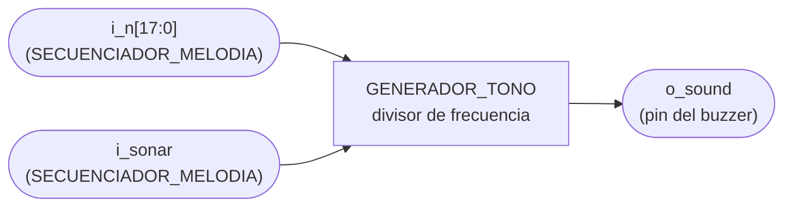
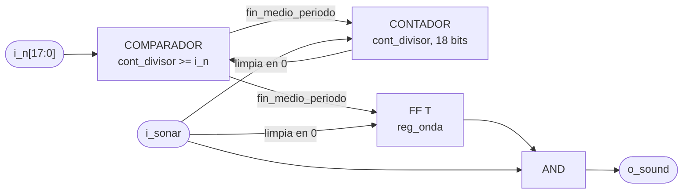

# GENERADOR_TONO

## a) Nombre del módulo

GENERADOR_TONO, módulo `generador_tono` en `src/design/generador_tono.sv`.

## b) Diagrama modular

## c) Objetivo del módulo

Sacar una onda cuadrada de la frecuencia que le pidan hacia el buzzer. Es el `generador_tono` del
Proyecto 2 con la parte de decidir qué suena y por cuánto tiempo quitada. Allá el mismo módulo
miraba el estado de la FSM y el resultado de la letra, elegía uno de tres tonos fijos y contaba los
150 ms. Acá eso lo hace `SECUENCIADOR_MELODIA`, y a este módulo solo le queda el divisor.

## d) Entradas

- `clk`, reloj del sistema de 100 MHz.
- `rst`, reset síncrono.
- `i_n[ANCHO_N-1:0]`, medio periodo de la nota menos uno, en ciclos de reloj, desde `ROM_NOTAS` dentro de `SECUENCIADOR_MELODIA`.
- `i_sonar`, en alto mientras haya que sonar, desde `SECUENCIADOR_MELODIA`.

El módulo tiene el parámetro `ANCHO_N = 18`, que alcanza para la nota más grave de la tabla.

## e) Salidas

- `o_sound`, onda cuadrada hacia el pin del buzzer. En cero mientras `i_sonar` esté en cero.

## f) Relación con otros módulos

Solo lo instancia `PERIFERICO_BUZZER`. `i_n` e `i_sonar` le llegan de `SECUENCIADOR_MELODIA`, dentro
del mismo periférico. `o_sound` sale sin pasar por nada más
al puerto `buzzer` del top.

No se entera de qué melodía está sonando ni de cuándo cambia la nota. Ve un `i_n` distinto y sigue
dividiendo con ese.

## g) Explicación de funcionamiento

Un contador sube en cada ciclo mientras `i_sonar` esté en alto. Cuando llega a `i_n` vuelve a cero
y `reg_onda` cambia de valor, así que cada medio periodo dura `i_n + 1` ciclos y la frecuencia queda
en `f_clk / (2 (i_n + 1))`.

Con `i_sonar` en cero el contador y `reg_onda` se quedan en cero, y la siguiente nota arranca
siempre desde silencio. La salida es `reg_onda` en AND con `i_sonar`, igual que en el Proyecto 2,
para que el buzzer baje en el mismo ciclo en que se apaga el enable y no uno después.

## h) Diseño

### Qué cambió respecto al Proyecto 2

- `i_state`, `i_letra_state` e `i_letra_lista` se van. Eran reglas del Ahorcado metidas en el
  periférico, y la sección 4.1 del enunciado prohíbe eso en este proyecto.
- `REG_N`, el selector de evento y la prioridad fin, acierto, fallo se van. El valor de N ya llega
  resuelto por `i_n`.
- `REG_ENABLE` y `CONT_DURACION` pasan a `SECUENCIADOR_MELODIA`, que ahora tiene que medir varias
  notas seguidas y no una sola de 150 ms. Lo que queda de ellos acá es `i_sonar`.
- `CONT_DIVISOR`, `REG_ONDA` y la AND de salida se quedan igual, salvo la comparación.

### La comparación del divisor

En el Proyecto 2 el contador volvía a cero con `cont_divisor == reg_n`. Eso funcionaba porque
`reg_n` solo cambiaba con un disparo nuevo, y el disparo también ponía el contador en cero.

En una melodía la nota cambia sin pasar por silencio. Si se pasa de una nota grave a una aguda, el
contador puede ir por encima del N nuevo en el momento del cambio, y con `==` seguiría subiendo
hasta dar la vuelta en `2^18`. Eso son 2.6 ms de onda congelada en medio de la melodía. Con
`cont_divisor >= i_n` el contador vuelve a cero en el ciclo siguiente y lo peor que pasa es un medio
periodo corto, que no se oye. Así tampoco hace falta un pulso de reinicio entre notas.

| Condición                     | `cont_divisor'`    | `reg_onda'`   |
| ----------------------------- | ------------------ | ------------- |
| `rst`                         | `0`                | `0`           |
| `i_sonar = 0`                 | `0`                | `0`           |
| `cont_divisor >= i_n`         | `0`                | `~reg_onda`   |
| resto                         | `cont_divisor + 1` | sin cambio    |

### Ancho del divisor

La nota más grave de `ROM_NOTAS` es A3 a 220 Hz, con `N = 100e6 / (2 x 220) - 1 = 227271`. Eso
pide 18 bits, y `2^18 = 262144` deja espacio para bajar hasta unos 191 Hz sin cambiar el ancho. Si
se agrega una nota más grave, `ANCHO_N` sube junto con `ROM_NOTAS`.

### Latches

Un solo `always_ff` con reset síncrono y un `assign` para la salida. No hay `always_comb`, así que no
hay por dónde se cuele un latch.

## i) Diagrama esquemático detallado del diseño

`clk` y `rst` entran a los dos flip-flops aunque no se dibujen.

## j) Diagrama completo de conexiones del diseño

Conexiones dentro de `PERIFERICO_BUZZER`.

- `clk`, a `clk_i`.
- `rst`, a `rst_i`.
- `i_n`, a `o_n` de `SECUENCIADOR_MELODIA`.
- `i_sonar`, a `o_sonar` de `SECUENCIADOR_MELODIA`.
- `o_sound`, a `buzzer_o`, que en el top va al pin M18 (JC2) con `IOSTANDARD LVCMOS33`, el mismo del
  Proyecto 2.

Igual que en los demás módulos, el diagrama por chips que pide el método no aplica a un diseño que se
sintetiza dentro de una sola FPGA, y esta lista de puertos es el reemplazo propuesto.
