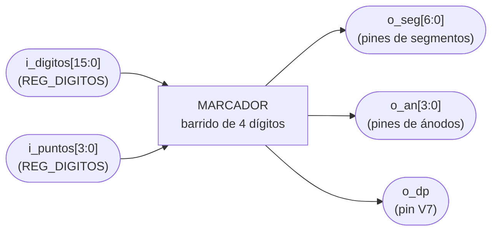
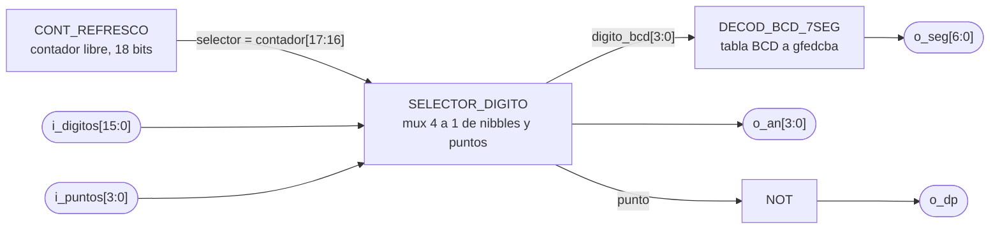

# MARCADOR

## a) Nombre del módulo

MARCADOR, módulo `marcador` en `src/design/marcador.sv`.

## b) Diagrama modular

## c) Objetivo del módulo

Mostrar en los cuatro dígitos del display los valores que le llegan, barriéndolos uno por uno lo bastante
rápido para que el ojo los vea encendidos a la vez. Es el `marcador` del Proyecto 2 sin la parte que sabía
qué significaba cada dígito. Allá dos dígitos eran tiempo en BCD y dos eran partidas ganadas en binario.
Acá los cuatro llegan ya en BCD desde el registro del periférico, y el módulo no sabe si son ganadas, turno
o cualquier otra cosa.

## d) Entradas

- `clk`, reloj del sistema de 100 MHz.
- `rst`, reset síncrono.
- `i_digitos[15:0]`, cuatro dígitos BCD empacados, `[3:0]` va al dígito de `AN0` y `[15:12]` al de `AN3`.
- `i_puntos[3:0]`, un bit por dígito para el punto decimal, en alto enciende el punto.

El módulo tiene el parámetro `REFRESH_BITS = 18`, igual que en el Proyecto 2. En simulación se baja para
no esperar 65536 ciclos por dígito.

## e) Salidas

- `o_seg[6:0]`, segmentos `gfedcba` del dígito activo, `o_seg[0]` es `a`. Activos en bajo.
- `o_an[3:0]`, ánodo del dígito activo. Activo en bajo.
- `o_dp`, punto decimal del dígito activo. Activo en bajo.

## f) Relación con otros módulos

Solo lo instancia `PERIFERICO_7SEG`. `i_digitos` e `i_puntos` salen de `REG_DIGITOS`, dentro del mismo
periférico. Las tres salidas van directo a los pines del display de la Basys 3.

## g) Explicación de funcionamiento

`CONT_REFRESCO` es un contador libre de 18 bits, y sus dos bits más altos forman `selector`. Cada valor de
`selector` dura `2^16` ciclos, 655 µs, así que los cuatro dígitos se recorren cada 2.6 ms, unas 380 veces
por segundo. Con eso no se nota el parpadeo.

`SELECTOR_DIGITO` usa `selector` para elegir el nibble de `i_digitos` y el bit de `i_puntos` que tocan,
y baja el ánodo de ese dígito. `DECOD_BCD_7SEG` convierte el nibble al patrón de segmentos. Un nibble de 10
a 15 deja el dígito apagado, con lo que el programa puede borrar un dígito escribiendo `0xF`.

## h) Diseño

### Qué cambió respecto al Proyecto 2

- `time_value[7:0]` y `num_ganadas[6:0]` se van y entra `i_digitos[15:0]`. Allá el módulo recibía dos
  cantidades de dos módulos distintos del juego. Acá recibe cuatro dígitos genéricos de un registro que
  escribe el programa.
- `REG_TIEMPO` y `REG_GANADAS` se van. El registro ahora es `REG_DIGITOS` y vive en el periférico, porque es
  el que escribe el CPU.
- La división `num_ganadas / 10` y `num_ganadas % 10` se va. Los dígitos llegan en BCD y
  `SELECTOR_DIGITO` solo corta nibbles. El programa lleva los contadores en BCD, que en ensamblador es un
  `addi` y una comparación contra 10 para el acarreo, y se ahorra un divisor combinacional en hardware.
- `dp` deja de ser un 1 fijo y sale de `i_puntos`. El enunciado deja que el turno se muestre en los displays
  (sección 4.3.2), y encender el punto de los dígitos de un jugador es la forma más barata de hacerlo.
- Los cuatro dígitos se tratan igual. En el Proyecto 2 `AN0` y `AN1` eran ganadas y `AN2` y `AN3` tiempo, y
  eso estaba fijo en `SELECTOR_DIGITO`.
- Los puertos pasan al estilo del repo, `i_` y `o_`.

`CONT_REFRESCO` y `DECOD_BCD_7SEG` quedan igual.

### SELECTOR_DIGITO

| `selector` | `digito_bcd`      | `punto`       | `o_an`   |
| ---------- | ----------------- | ------------- | -------- |
| `00`       | `i_digitos[3:0]`   | `i_puntos[0]` | `1110`   |
| `01`       | `i_digitos[7:4]`   | `i_puntos[1]` | `1101`   |
| `10`       | `i_digitos[11:8]`  | `i_puntos[2]` | `1011`   |
| `11`       | `i_digitos[15:12]` | `i_puntos[3]` | `0111`   |

`o_dp = ~punto`, porque el punto del display también es activo en bajo.

### DECOD_BCD_7SEG

La misma tabla del Proyecto 2, `seg` en orden `gfedcba` y activo en bajo.

| BCD | `seg`     |
| --- | --------- |
| 0   | `1000000` |
| 1   | `1111001` |
| 2   | `0100100` |
| 3   | `0110000` |
| 4   | `0011001` |
| 5   | `0010010` |
| 6   | `0000010` |
| 7   | `1111000` |
| 8   | `0000000` |
| 9   | `0010000` |
| 10 a 15 | `1111111` |

### Latches

`SELECTOR_DIGITO` y `DECOD_BCD_7SEG` son `always_comb` con `case` y rama `default`, y asignan todas sus
salidas en todas las ramas. `CONT_REFRESCO` es el único `always_ff`.

## i) Diagrama esquemático detallado del diseño

`clk` y `rst` entran solo a `CONT_REFRESCO`.

TODO: Revisar y reemplazar por el esquemático por compuertas generado desde `marcador.sv` cuando exista, igual que en `generador_tono.md`.

## j) Diagrama completo de conexiones del diseño

Conexiones dentro de `PERIFERICO_7SEG`.

- `clk`, a `clk_i`.
- `rst`, a `rst_i`.
- `i_digitos`, a `reg_digitos[15:0]`.
- `i_puntos`, a `reg_digitos[19:16]`.
- `o_seg`, `o_an` y `o_dp`, a `seg_o`, `an_o` y `dp_o` del periférico.

Igual que en los demás módulos, el diagrama por chips que pide el método no aplica a un diseño que se
sintetiza dentro de una sola FPGA, y esta lista de puertos es el reemplazo propuesto.
