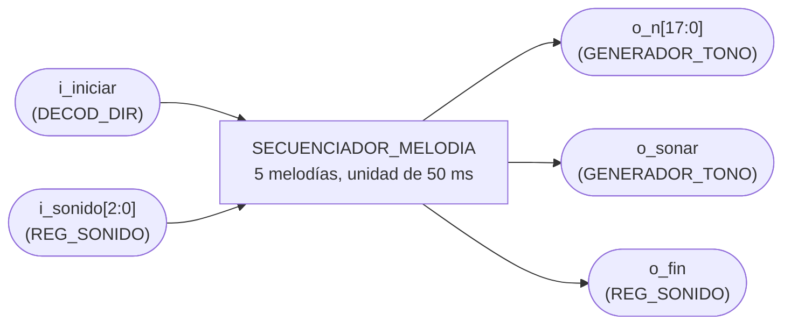
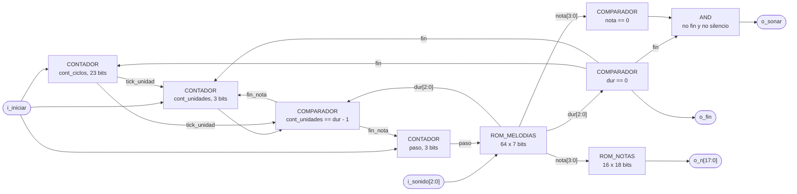

# SECUENCIADOR_MELODIA

## a) Nombre del módulo

SECUENCIADOR_MELODIA, módulo `secuenciador_melodia` en `src/design/secuenciador_melodia.sv`.

## b) Diagrama modular

## c) Objetivo del módulo

Recorrer nota por nota la melodía que pidió el programa y decirle a `GENERADOR_TONO` qué frecuencia
sacar y cuándo callarse. Tiene guardadas las cinco melodías que pide la sección 4.5.4 del enunciado,
impacto, fallo, hundido, colocación inválida y victoria.

## d) Entradas

- `clk`, reloj del sistema de 100 MHz.
- `rst`, reset síncrono.
- `i_iniciar`, pulso de un ciclo cuando el programa escribe el registro del buzzer, desde `DECOD_DIR`.
- `i_sonido[2:0]`, código de la melodía que está sonando, desde `REG_SONIDO`.

El módulo tiene los parámetros `CLK_FREQ_HZ = 100_000_000` y `UNIDAD_MS = 50`. En simulación se baja
`CLK_FREQ_HZ` y todo, la unidad y los divisores de las notas, se reescala junto.

## e) Salidas

- `o_n[17:0]`, medio periodo menos uno de la nota actual, hacia `GENERADOR_TONO`.
- `o_sonar`, en alto mientras la nota actual no sea silencio y la melodía no haya terminado, hacia
  `GENERADOR_TONO`.
- `o_fin`, en alto mientras la melodía esté terminada, hacia `REG_SONIDO` para que vuelva a cero.

## f) Relación con otros módulos

Solo lo instancia `PERIFERICO_BUZZER`. Del lado del bus recibe `i_iniciar` de `DECOD_DIR` e
`i_sonido` de `REG_SONIDO`. Del otro lado le entrega `o_n` y `o_sonar` a `GENERADOR_TONO`, que es el
único que toca el pin.

`o_fin` cierra el lazo con `REG_SONIDO`. Cuando la melodía termina el registro vuelve a `000`, y así
el programa puede leer `0x0001_0140` para saber si el buzzer ya se calló.

## g) Explicación de funcionamiento

Una melodía es una lista de hasta ocho pasos en `ROM_MELODIAS`. Cada paso trae una nota y una
duración en unidades de 50 ms, y un paso con duración cero marca el final.

Con `i_iniciar` el secuenciador pone `paso` en cero y reinicia los contadores de tiempo. En el mismo
flanco `REG_SONIDO` carga el código nuevo, así que desde el ciclo siguiente la dirección
`{i_sonido, paso}` ya apunta al primer paso de la melodía pedida. `CONT_CICLOS` da un pulso cada
50 ms, `CONT_UNIDADES` los cuenta, y cuando llegan a la duración del paso `paso` sube y arranca la
siguiente nota.

Cuando el paso leído tiene duración cero, `o_fin` sube, `o_sonar` baja y los contadores se quedan
quietos. `REG_SONIDO` vuelve a `000`, y como las filas de `000` en la ROM tienen duración cero en
todos sus pasos, el secuenciador se queda en reposo sin necesitar un estado aparte para eso.

Una escritura nueva a mitad de melodía la corta y arranca la nueva desde el paso cero. Cuál sonido
gana cuando dos eventos caen juntos, por ejemplo el impacto que hunde un barco o el hundido que
termina la partida, lo decide el programa escribiendo solo el que corresponde.

## h) Diseño

### Códigos de sonido

- `000`, silencio. Escribirlo corta lo que esté sonando.
- `001`, impacto.
- `010`, fallo.
- `011`, hundido.
- `100`, colocación inválida.
- `101`, victoria.
- `110` y `111`, sin melodía. Sus filas de la ROM son iguales a las de `000`, así que escribirlos
  equivale a escribir silencio.

### ROM_NOTAS

Cada nota es un índice de 4 bits. El divisor sale de `N = CLK_FREQ_HZ / (2 f) - 1`, con división
entera, igual que en el Proyecto 2. Los N se calculan como `localparam` a partir de las
frecuencias, así que la tabla no guarda números mágicos.

| Índice | Nota     | f (Hz) | N a 100 MHz |
| ------ | -------- | ------ | ----------- |
| `0`    | silencio | -      | `0`         |
| `1`    | A3       | 220    | `227271`    |
| `2`    | C4       | 262    | `190838`    |
| `3`    | E4       | 330    | `151514`    |
| `4`    | G4       | 392    | `127550`    |
| `5`    | C5       | 523    | `95601`     |
| `6`    | E5       | 659    | `75871`     |
| `7`    | G5       | 784    | `63774`     |
| `8`    | C6       | 1047   | `47754`     |
| `9`    | E6       | 1319   | `37906`     |
| `10`   | G6       | 1568   | `31886`     |
| `11` a `15` | sin usar | - | `0`       |

Las frecuencias son las de la escala temperada redondeadas al entero. Con estos N la frecuencia real
queda a menos de 0.01% de la nominal, que no se distingue de oído. Los índices sin usar dan `N = 0`,
y si alguno se colara en la ROM el buzzer sonaría a 50 MHz, que el piezo no reproduce, en vez de
quedarse pegado.

### ROM_MELODIAS

Dirección de 6 bits, `{i_sonido, paso}`, 64 palabras de 7 bits, `{nota[3:0], dur[2:0]}`. `dur` va en
unidades de 50 ms, de 1 a 7, y `dur = 0` es fin.

Impacto, 200 ms. Tres notas que suben rápido, suena a acierto.

| Paso | Nota | dur | ms  |
| ---- | ---- | --- | --- |
| 0    | G5   | 1   | 50  |
| 1    | C6   | 1   | 50  |
| 2    | E6   | 2   | 100 |
| 3    | fin  | 0   |     |

Fallo, 350 ms. Tres notas graves que bajan, el "womp" de haber tirado al agua.

| Paso | Nota | dur | ms  |
| ---- | ---- | --- | --- |
| 0    | G4   | 2   | 100 |
| 1    | E4   | 2   | 100 |
| 2    | C4   | 3   | 150 |
| 3    | fin  | 0   |     |

Hundido, 500 ms. Una cascada rápida desde arriba, un corte y una nota larga abajo. Arranca más agudo
que el impacto y baja en vez de subir, para que no se confundan aunque vengan uno después del otro.

| Paso | Nota     | dur | ms  |
| ---- | -------- | --- | --- |
| 0    | E6       | 1   | 50  |
| 1    | C6       | 1   | 50  |
| 2    | G5       | 1   | 50  |
| 3    | E5       | 1   | 50  |
| 4    | C5       | 1   | 50  |
| 5    | silencio | 1   | 50  |
| 6    | C5       | 4   | 200 |
| 7    | fin      | 0   |     |

Colocación inválida, 250 ms. Dos zumbidos en la nota más grave de la tabla, el aviso de error.

| Paso | Nota     | dur | ms  |
| ---- | -------- | --- | --- |
| 0    | A3       | 2   | 100 |
| 1    | silencio | 1   | 50  |
| 2    | A3       | 2   | 100 |
| 3    | fin      | 0   |     |

Victoria, 950 ms. Arpegio de do mayor subiendo, una pausa y el remate en C6 largo.

| Paso | Nota     | dur | ms  |
| ---- | -------- | --- | --- |
| 0    | C5       | 2   | 100 |
| 1    | E5       | 2   | 100 |
| 2    | G5       | 2   | 100 |
| 3    | C6       | 4   | 200 |
| 4    | silencio | 1   | 50  |
| 5    | G5       | 1   | 50  |
| 6    | C6       | 7   | 350 |
| 7    | fin      | 0   |     |

Los pasos que no aparecen en una tabla se llenan con `{0, 0}`, que es fin. Las filas de `000`, `110`
y `111` son `{0, 0}` en los ocho pasos.

`paso` es de 3 bits y no se revisa si se pasa de 7. La regla es que cada melodía tiene como máximo
siete notas y el paso 7, si se llega, es siempre fin. Hundido y victoria ya la usan entera.

### Contadores

`CICLOS_UNIDAD = CLK_FREQ_HZ / 1000 x UNIDAD_MS`, 5 000 000 ciclos a 100 MHz, así que `cont_ciclos`
es de 23 bits. `tick_unidad` vale `cont_ciclos == CICLOS_UNIDAD - 1` y `fin_nota` vale
`tick_unidad` en AND con `cont_unidades == dur - 1`.

| Condición                  | `cont_ciclos'`    | `cont_unidades'`    | `paso'`     |
| -------------------------- | ----------------- | ------------------- | ----------- |
| `rst` o `i_iniciar`        | `0`               | `0`                 | `0`         |
| `dur = 0` (fin)            | `0`               | `0`                 | sin cambio  |
| `fin_nota`                 | `0`               | `0`                 | `paso + 1`  |
| `tick_unidad`              | `0`               | `cont_unidades + 1` | sin cambio  |
| resto                      | `cont_ciclos + 1` | sin cambio          | sin cambio  |

`i_iniciar` va primero porque tiene que poder cortar una melodía en cualquier punto. La fila de fin va
antes que `fin_nota` para que los contadores no sigan corriendo sobre una melodía terminada.

Los contadores de tiempo se reinician al empezar cada nota, así que cada una dura exactamente
`dur x 50 ms` sin importar en qué momento del ciclo llegó la escritura del programa.

### Salidas

- `o_fin = (dur == 0)`.
- `o_sonar = (dur != 0) && (nota != 0)`.
- `o_n`, la salida de `ROM_NOTAS` para la nota del paso actual.

Las dos ROM son `always_comb` con `case` y rama `default`, así que yosys las baja a LUTs y la lectura
sale en el mismo ciclo. 64 palabras de 7 bits y 16 de 18 bits no justifican una BRAM.

### Latches

Los contadores van en un `always_ff` con reset síncrono. Las dos ROM llevan `default` en su `case` y
asignan todas sus salidas en todas las ramas, que es lo que evita el latch.

## i) Diagrama esquemático detallado del diseño

`clk` y `rst` entran a los tres contadores aunque no se dibujen.

## j) Diagrama completo de conexiones del diseño

Conexiones dentro de `PERIFERICO_BUZZER`.

- `clk`, a `clk_i`.
- `rst`, a `rst_i`.
- `i_iniciar`, a `escribir_sonido` de `DECOD_DIR`.
- `i_sonido`, a `reg_sonido`.
- `o_n`, a `i_n` de `GENERADOR_TONO`.
- `o_sonar`, a `i_sonar` de `GENERADOR_TONO`.
- `o_fin`, a la entrada de limpieza de `REG_SONIDO`.

Igual que en los demás módulos, el diagrama por chips que pide el método no aplica a un diseño que se
sintetiza dentro de una sola FPGA, y esta lista de puertos es el reemplazo propuesto.
