# Informe técnico del Proyecto 3, Batalla Naval sobre RISC-V con VGA y terminal de PC

EL3313 Taller de Diseño Digital, II Semestre 2026  
Escuela de Ingeniería Electrónica, Tecnológico de Costa Rica  
Profesores Dr.-Ing. Jeferson González-Gómez e Ing. Rolen Coto Calderón

Integrantes

- Carlos Castro Villegas
- Jefferson Chinchilla Quesada
- Mattio Coghi Quirós
- Nicolás Mena Valerio

Versión documentada, rama `develop` en el commit `9e83b8b`. Los commits posteriores solo cambian
la documentación.  
8 de octubre de 2026

## Tabla de contenidos

1. [Resumen](#1-resumen)
2. [Introducción y objetivos](#2-introducción-y-objetivos)
3. [Fundamentación teórica](#3-fundamentación-teórica)
4. [Enfoque de la solución](#4-enfoque-de-la-solución)
5. [Descripción formal de interfaces de módulos](#5-descripción-formal-de-interfaces-de-módulos)
6. [Periférico VGA](#6-periférico-vga)
7. [Periférico UART y protocolo de aplicación](#7-periférico-uart-y-protocolo-de-aplicación)
8. [Diagramas de estado](#8-diagramas-de-estado)
9. [Estrategia de validación](#9-estrategia-de-validación)
10. [Resultados](#10-resultados)
11. [Análisis de resultados](#11-análisis-de-resultados)
12. [Problemas encontrados y su solución](#12-problemas-encontrados-y-su-solución)
13. [Análisis crítico](#13-análisis-crítico)
14. [Conclusiones y aprendizaje obtenido](#14-conclusiones-y-aprendizaje-obtenido)
15. [Referencias](#15-referencias)

## 1. Resumen

Se integró una plataforma de 32 bits en la FPGA Artix-7 de la tarjeta Basys 3 que ejecuta el
juego Batalla Naval para dos jugadores. La plataforma contiene un procesador RISC-V de ciclo único,
una ROM de programa de 8 KiB, una RAM de datos de 4 KiB, un Address Translator, un multiplexor de
lectura y seis periféricos (UART, entradas locales, display de 7 segmentos, LED, buzzer y VGA).
El núcleo del procesador se reutilizó y adaptó de `riscv-simple-sv`, conservando su licencia
BSD-3. La integración, los periféricos y el programa del juego son trabajo del equipo.

La lógica de la partida se ejecuta en ensamblador dentro de la FPGA. Cada jugador dispone de un
tablero de 8 × 8 casillas y coloca tres barcos de longitudes 4, 3 y 2. El Jugador 1 usa los
controles de la Basys 3 y un monitor VGA. El Jugador 2 usa una terminal Python conectada por UART a
115 200 baudios. La PC transmite solicitudes y representa las respuestas. La validación de
colocaciones, los disparos, los hundimientos, los turnos y la victoria se resuelven en el programa
RISC-V. Los barcos no descubiertos del oponente permanecen ocultos en ambas interfaces.

Un PLL saca dos relojes del oscilador de 100 MHz. El procesador y los periféricos de registros
corren a 33,33 MHz y el barrido de video de 640 × 480 a 25 MHz. El periférico VGA usa una cuadrícula
de 20 × 15 casillas de 32 × 32 píxeles, con color, bordes y texto, en lugar de un framebuffer por
píxel. El programa ocupa 1264 palabras de instrucción, equivalentes a 5056 bytes o 61,72 % de la
ROM.

Los 15 testbenches autoverificables del hardware pasan sin fallos, entre ellos las 29 pruebas
rv32ui del procesador y las 82 verificaciones del sistema completo, que juegan una partida entera
con el programa real. También pasan las 18 pruebas unitarias de la aplicación de PC. La síntesis
no infiere latches. Después de colocar y rutear, el diseño ocupa 4788 LUT (23,0 % del XC7A35T) y
`clk_sys` alcanza 37,92 MHz frente a los 33,33 MHz de operación. El sistema completo se probó en la
Basys 3, cargado desde la flash, con partidas completas entre los dos jugadores. La simulación
post-implementación temporizada, sobre el netlist ruteado por Vivado con sus retardos, ejecuta el
arranque del programa, la colocación de las dos flotas y un disparo de cada jugador, y pasa sus 19
verificaciones sin violaciones de setup ni de hold (sección 10.7).

## 2. Introducción y objetivos

El Proyecto 3 cambia la forma de implementar el control respecto al Ahorcado. En el proyecto
anterior, máquinas de estado y módulos específicos descritos en HDL coordinaban el juego. En
Batalla Naval, el hardware proporciona una plataforma computacional y sus recursos de entrada y
salida, mientras que el comportamiento de la aplicación se expresa mediante instrucciones que
el procesador ejecuta desde la ROM.

Esta separación permite analizar tanto el diseño digital como la relación entre software y
hardware. Un `lw` lee una variable o el estado de un periférico. Un `sw` actualiza una variable,
escribe una casilla de video o inicia una transmisión. Los tiempos del hardware le ponen límites al
programa. Las memorias tienen que responder dentro del ciclo del procesador, y como la UART guarda
un solo byte, el programa tiene que atender la recepción seguido.

El objetivo general es implementar una plataforma RISC-V en la FPGA que ejecute el control
completo de Batalla Naval y coordine un jugador local con otro remoto mediante UART, sin que
ninguno vea el tablero del otro.

Objetivos específicos

1. Integrar un procesador de 32 bits de ciclo único, con buses independientes de instrucciones y
   datos, capaz de ejecutar el subconjunto requerido por el programa.
2. Implementar la ROM, la RAM y el controlador de mapeo con el mapa de direcciones del instructivo.
3. Diseñar un periférico VGA con barrido autónomo, memoria de casillas y representación de tableros
   y mensajes de estado.
4. Integrar UART, entradas locales, displays, LED y buzzer mediante interfaces de registros.
5. Describir en ensamblador las colocaciones concurrentes, la alternancia de turnos, la validación
   de disparos, los hundimientos, el fin de partida y la conservación de ganadas.
6. Implementar una aplicación de PC y un protocolo de mensajes consistentes con el programa.
7. Verificar por etapas el procesador, los periféricos y el sistema integrado, distinguiendo
   simulación funcional, síntesis, timing y prueba en la tarjeta.

## 3. Fundamentación teórica

### 3.1 Arquitectura RISC-V y subconjunto utilizado

RISC-V define instrucciones que operan sobre registros y acceden a memoria mediante cargas y
almacenamientos [2]. La implementación emplea registros y buses de 32 bits, instrucciones de
32 bits y un banco de 32 registros. `x0` devuelve siempre cero. Los registros `a0` a `a4` sirven
como argumentos de las subrutinas del juego, `ra` conserva la dirección de retorno y `sp`
direcciona la pila.

Los campos comunes de una instrucción son estos.

- `opcode`, bits 6:0. Familia de instrucción.
- `rd`, bits 11:7. Registro de destino.
- `funct3`, bits 14:12. Variante de la operación.
- `rs1`, bits 19:15. Primer operando.
- `rs2`, bits 24:20. Segundo operando, cuando corresponde.
- `funct7`, bits 31:25. Diferencia operaciones que comparten otros campos.

El programa usa cargas y escrituras de palabra (`lw`, `sw`), operaciones aritméticas y lógicas,
desplazamientos, comparaciones, ramas y saltos, es decir, la lista base del instructivo. Añade
`lui` para construir las bases de RAM y periféricos con una sola instrucción. `li`, `mv`, `j`,
`ret`, `beqz` y `bnez` son pseudoinstrucciones del ensamblador. El procesador recibe las
instrucciones reales resultantes de su expansión. El script de ensamblado rechaza cualquier
instrucción fuera de esa lista.

El núcleo reutilizado implementa todo `rv32i` [3], pero el envoltorio de la plataforma no conecta
una máscara de bytes. A los periféricos y la RAM solo se accede con `lw` y `sw` alineados de
32 bits, que es lo que pide la interfaz estándar del instructivo.

### 3.2 Procesador de ciclo único y camino crítico

En el procesador de ciclo único, una instrucción se resuelve entre dos flancos consecutivos.
Durante ese intervalo se obtiene la instrucción, se decodifica, se leen los operandos, se calcula
el resultado y, cuando corresponde, se accede a la memoria. En el siguiente flanco se actualizan
el PC y el registro de destino.

Para una carga, el presupuesto temporal incluye un camino aproximado de:

```math
T_{clk} \geq T_{PC} + T_{ROM} + T_{\text{decodificación/registros}} + T_{ALU}
+ T_{mapeo/memoria/MUX} + T_{setup}
```

Por eso el sistema corre a 33,33 MHz, con un período nominal de 30 ns, aunque el oscilador de
entrada sea de 100 MHz. La frecuencia máxima sale del diseño implementado (sección 10.5). Que un
testbench use cierto reloj no demuestra que el hardware cierre timing a esa frecuencia.

### 3.3 Memorias separadas y periféricos mapeados

La ROM tiene un camino dedicado para instrucciones y la RAM comparte el bus de datos con los
periféricos. La ROM entrega la instrucción en forma combinacional y la RAM combina lectura
asíncrona con escritura síncrona. Esto permite que `lw` termine en el mismo ciclo. Las BRAM de la
Artix-7 solo leen en forma síncrona, por eso las memorias se implementan como RAM distribuida
(LUTRAM).

Un periférico mapeado en memoria interpreta una dirección como un registro o una casilla. El
programa no necesita instrucciones especiales de entrada y salida. Por ejemplo:

```asm
lui  s0, 0x10           # base 0x0001_0000
lw   t0, 0x120(s0)      # leer entradas locales
li   t1, 2
sw   t1, 0x138(s0)      # encender el LED de batalla
```

El Address Translator genera habilitaciones de escritura y una selección para el MUX de lectura.
Los datos no pasan por el AT. `DataOut_o` llega directo a los destinos y lo que estos devuelven
llega al MUX. Las direcciones no asignadas o no alineadas producen lectura cero y ninguna
habilitación. No se implementa una excepción de bus por acceso inválido.

### 3.4 Generación de relojes con PLL

La primitiva `PLLE2_BASE` recibe 100 MHz, multiplica por 10 y divide la entrada por 1. El VCO queda
en 1000 MHz y sus divisores de salida son 30 y 40:

```math
f_{VCO}=100\,\text{MHz}\cdot\frac{10}{1}=1000\,\text{MHz}
```

```math
f_{sys}=\frac{1000}{30}\,\text{MHz}=33{,}333\ldots\,\text{MHz},
\qquad f_{pix}=\frac{1000}{40}\,\text{MHz}=25\,\text{MHz}
```

Ambos relojes provienen del mismo VCO, así que quedan relacionados en fase. Las salidas pasan por
`BUFG`, y el reset del sistema se mantiene mientras el PLL no esté enganchado. En la simulación
RTL la primitiva se reemplaza por divisores con los mismos períodos nominales, aunque el reloj de
sistema no queda con ciclo de trabajo del 50 % (el diseño usa solo el flanco de subida). Ese
modelo no representa jitter, tiempos internos ni el comportamiento analógico del PLL.

### 3.5 Temporización VGA

El video visible ocupa 640 × 480 píxeles. Cada línea incluye área visible, front porch, sincronismo
y back porch, y lo mismo sucede con las líneas de cada cuadro [4].

| Intervalo | Horizontal, píxeles | Vertical, líneas |
|---|---:|---:|
| Visible | 640 | 480 |
| Front porch | 16 | 10 |
| Sincronismo | 96 | 2 |
| Back porch | 48 | 33 |
| Total | 800 | 525 |

Con un reloj de 25 MHz,

```math
T_{pix}=40\,\text{ns},\qquad
T_{\text{línea}}=800\cdot40\,\text{ns}=32\,\mu\text{s}
```

```math
T_{cuadro}=525\cdot32\,\mu\text{s}=16{,}8\,\text{ms},\qquad
f_{cuadro}=59{,}5238\,\text{Hz}
```

Los sincronismos tienen polaridad negativa. El horizontal se queda en bajo 3,84 µs por línea y el
vertical 64 µs por cuadro. Los RGB se fuerzan a negro fuera del área visible.
El cálculo corresponde a 25 MHz y no al modo de 25,175 MHz y aproximadamente 59,94 Hz. La
diferencia está dentro de la tolerancia de los monitores.

### 3.6 Gráficos por casillas y fuente de caracteres

Un framebuffer RGB de 12 bits para todos los píxeles necesitaría

```math
640\cdot480\cdot12=3\,686\,400\,\text{bits}=460\,800\,\text{bytes}
```

El diseño utiliza 300 casillas visibles de 32 bits, equivalentes a 1200 bytes, dentro de una
memoria de 512 palabras o 2048 bytes. El barrido calcula el índice de casilla a partir de los
contadores y sus bits inferiores indican la posición del píxel dentro de ella. La cuadrícula
representa fondos, barcos, impactos, fallos, cursores y mensajes sin almacenar cada píxel.

La fuente `fuente_caracteres` entrega filas de glifos de 5 × 7. Cada punto se amplía a 2 × 2
píxeles, y una casilla puede contener dos caracteres o un carácter centrado. La representación de
texto pertenece al periférico. El contenido de los mensajes y las reglas que deciden cuándo
mostrarlos pertenecen al programa.

### 3.7 Comunicación UART

La UART usa tramas 8N1, con un bit de arranque en cero, ocho bits LSB primero, sin paridad y un
bit de parada en uno. La línea queda en alto en reposo. Un byte tarda idealmente

```math
T_{byte}=\frac{10}{115\,200}=86{,}806\,\mu\text{s}
```

Los divisores se redondean al entero más cercano. Para el sistema,

```math
N_{TX}=\mathrm{round}\left(\frac{33\,333\,333}{115\,200}\right)=289
```

```math
N_{RX}=\mathrm{round}\left(\frac{33\,333\,333}{16\cdot115\,200}\right)=18
```

El baudaje efectivo de TX es aproximadamente 115 340 baudios, un error de +0,122 %. El ritmo
equivalente de RX es 115 741 baudios, un error de +0,469 %, el mismo que a 100 MHz. El receptor
usa el sobremuestreo para ubicar el punto de lectura en el centro de cada bit.

La entrada RX llega al núcleo sin el sincronizador de dos flip-flops que suele recomendarse para
señales asíncronas. Así viene el núcleo VHDL que entregó el curso en el Proyecto 2, y el profesor
confirmó el 22 de setiembre que no hace falta agregarlo. La línea cambia a lo sumo una vez por bit
(289 ciclos), lo que hace muy improbable la metaestabilidad, aunque no la descarta. La mitigación
estándar sería agregar dos flip-flops en cascada antes de `i_rx`.

### 3.8 Rebote y sincronización de entradas

Un pulsador mecánico puede producir varias transiciones al presionarse. Detectar un flanco en
software evita repetir una acción cuando el nivel permanece alto, pero no filtra una secuencia
`0 → 1 → 0 → 1` causada por rebote. También existe una diferencia entre registrar una entrada para
cortar un camino combinacional y sincronizarla con dos etapas para reducir la propagación de
metaestabilidad.

El instructivo (4.5.2) pide antirrebote en el periférico de entradas. El profesor autorizó el
3 de octubre omitirlo, porque los botones de la Basys 3 llegan filtrados por la tarjeta, y los
switches de `BTN_OK` y `BTN_RST` no rebotan en la práctica. Por eso el periférico registra cada
entrada en un solo flip-flop, que corta el camino combinacional entre el pin y el banco de
registros del CPU, y el programa obtiene los flancos con `actual & ~anterior`. En las pruebas en la
tarjeta no se observaron acciones repetidas por rebote. Si hiciera falta, la mejora compatible con
el bus es agregar dos flip-flops por entrada y un filtro de estabilidad de unos 10 ms, que a
33,33 MHz son unos 333 333 ciclos, sin cambiar el mapa del registro.

### 3.9 Multiplexado de displays y generación de sonido

Los cuatro dígitos de 7 segmentos comparten las líneas de segmentos y activan un ánodo a la vez.
Con el contador de refresco de 18 bits,

```math
f_{refresco}=\frac{33\,333\,333}{2^{18}}\approx127{,}16\,\text{Hz}
```

Cada dígito permanece seleccionado aproximadamente 1,966 ms, sin parpadeo visible. El registro del
display recibe cuatro nibbles BCD y cuatro bits de punto decimal. El programa conserva las ganadas
de cada jugador en dos dígitos y hace el retorno de 99 a 00.

El buzzer pasivo recibe una onda cuadrada. Para una nota de frecuencia $f$, el generador conmuta
la salida cada $N+1$ ciclos, con

```math
N=\left\lfloor\frac{f_{sys}}{2f}\right\rfloor-1
```

La nota más grave (A3, 220 Hz) da N = 75 756, que cabe en los 18 bits del contador. El secuenciador
selecciona notas y duraciones, en unidades nominales de 50 ms, para distinguir impacto, fallo,
hundimiento, colocación inválida y victoria. Qué pasó en la partida lo decide el programa, y el
secuenciador solo reproduce el código de sonido que este le escribe.

### 3.10 Diseño combinacional sin latches

Los multiplexores y decodificadores deben definir una salida en todos los caminos de ejecución.
Los valores por defecto y las ramas `default` evitan retener accidentalmente el resultado
anterior. La revisión del RTL se complementa con el resultado de `proc` de yosys, que informa cada
señal combinacional en la que no infiere un latch, con la estadística de celdas del netlist y con
un linter (Verilator), que avisa de latches, de asignaciones con retardo dentro de lógica
combinacional y de señales con más de un driver. Las RAM y los registros explícitos guardan datos a
propósito y no cuentan como latch.

## 4. Enfoque de la solución

### 4.1 Arquitectura *top-down*

El planteamiento mantiene los niveles de sistema, bloques funcionales, interconexión e interior de
los módulos. Los documentos detallados están en [`docs/diseño/diagramas/`](../diseño/diagramas/) y
[`docs/diseño/modulos/`](../diseño/modulos/), y reunidos en un solo archivo en
[`docs/diseño/diseño.md`](../diseño/diseño.md). Los diagramas de este informe resumen la
integración de [`top.sv`](../../src/design/top.sv).

En el nivel 1, el del sistema y los jugadores, el jugador local ve la partida en el VGA y los
indicadores, y el remoto intercambia solicitudes y resultados por UART. La FPGA guarda el estado
válido de la partida.

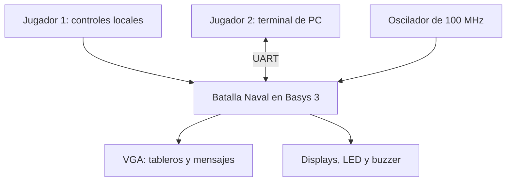

El nivel 2 es la plataforma computacional. La ROM está fuera del bus de datos, y el bloque de
mapeo solo tiene la decodificación y el MUX de retorno, sin reglas de juego.

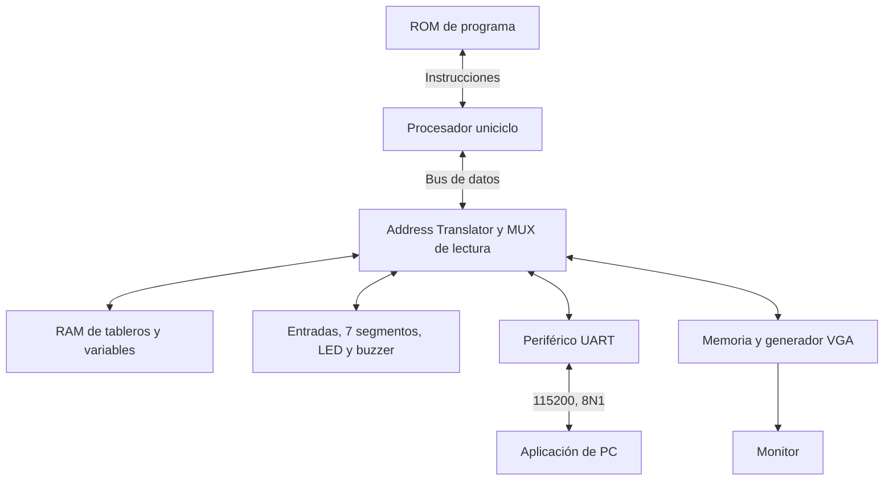

El nivel 3 muestra el control del bus y el retorno de datos. Aquí el procesador es un bloque
externo, y su interior se describe en la ficha del núcleo.

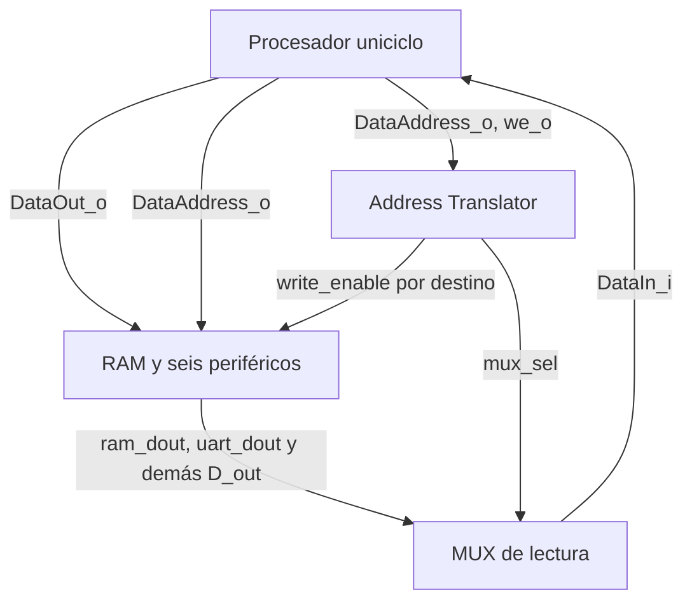

En `top.sv`, `clk_sys` llega al núcleo, la RAM y los periféricos, y `clk_pix` llega al barrido VGA.
UART y buzzer reciben `CLK_FREQ_HZ = 33_333_333`. El top adapta los índices de registro.

- UART usa `data_address[3:2]` para CONTROL, TX y RX.
- Entradas, display, LED y buzzer reciben `addr_i = 00`, porque tienen un solo registro.
- VGA usa `data_address[10:2]` para las 512 palabras de su ventana.
- RAM usa internamente `addr_i[11:2]` y ROM usa `addr_i[12:2]`.

### 4.2 Decisiones de diseño y su justificación

- D1, control del juego en ensamblador. Cumple la separación que pide el instructivo, con el
  hardware para E/S y el programa para las reglas.
- D2, núcleo uniciclo reutilizado y adaptado. Da una base modular y pruebas de instrucciones. Su
  procedencia y licencia están declaradas.
- D3, buses separados de instrucciones y datos. Buscar una instrucción no ocupa el puerto de la
  RAM de datos.
- D4, lecturas combinacionales en ROM, RAM y memoria de video, en LUTRAM. Así una carga termina en
  un ciclo sin tocar el núcleo, y por lo mismo queda fuera la BRAM, que lee en forma síncrona.
- D5, reloj de sistema de 33,33 MHz. Da 30 ns para el camino largo del uniciclo y deja divisores de
  UART con poco error.
- D6, reloj de píxel de 25 MHz, que con 800 × 525 posiciones da un barrido de 59,52 Hz.
- D7, AT separado del MUX de lectura. El AT queda como pura lógica de selección y el retorno se
  verifica aparte con valores conocidos.
- D8, solo palabras alineadas de 32 bits, que es lo que usa el programa con `lw` y `sw` y lo que
  permite una interfaz sin máscara de bytes.
- D9, VGA por casillas con color, borde y texto. Gasta mucha menos memoria y menos escrituras que un
  framebuffer por píxel.
- D10, el estado de la partida vive solo en la RAM. El VGA y la PC lo muestran, pero no deciden
  impactos ni victoria por su cuenta.
- D11, un solo mensaje pendiente en la PC, para asociar cada respuesta con su solicitud sin más
  maquinaria (sección 7.4).
- D12, pausa de 1 ms entre bytes de la PC a la FPGA. Le da margen al receptor de un solo byte y al
  lazo de sondeo del programa.
- D13, ganadas guardadas en BCD, para mandarlas al display sin convertir de binario.
- D14, reinicio de partida atendido en software. Conserva las ganadas, y la reconfiguración general
  con PROG es la que inicializa todo.
- D15, sonidos elegidos por código. El programa decide el evento y el periférico toca la melodía sin
  bloquear el juego.
- D16, entradas sin antirrebote y con un solo registro. Lo autorizó el profesor el 3 de octubre,
  porque los botones de la Basys 3 llegan filtrados. El flanco lo saca el programa.
- D17, RX sin sincronizador de dos flip-flops, igual que el núcleo del curso. El profesor lo
  confirmó el 22 de setiembre.
- D18, bitstream grabado en la flash. El reinicio general es el botón PROG, que reconfigura la FPGA
  desde ahí.

### 4.3 Codificación de estado y organización de la RAM

La fase se almacena en `FASE`: 0 = colocación, 1 = batalla, 2 = resultado. El turno vale
0 = Jugador 1 y 1 = Jugador 2. Los códigos de fase internos no son iguales a todos los subtipos
del mensaje UART `Estado`, que se documentan en la sección 7.

Cada casilla ocupa una palabra. Los bits 1:0 codifican agua, barco, impacto o fallo con los mismos
códigos que la paleta del VGA, y los bits 3:2 conservan el identificador del barco, cuando
corresponde. El bit 1 permite detectar si una casilla ya recibió un disparo. El programa guarda
por separado el número de impactos de cada barco.

| Variable | Dirección absoluta | Extensión y función |
|---|---|---|
| `TABLERO_J1` | `0x0000_2000` a `0x0000_20FC` | 64 palabras |
| `TABLERO_J2` | `0x0000_2100` a `0x0000_21FC` | 64 palabras |
| `FASE`, `TURNO` | `0x0000_2200`, `0x0000_2204` | Una palabra cada una |
| `COLOCADOS_J1`, `COLOCADOS_J2` | `0x0000_2208`, `0x0000_220C` | Cantidad local y máscara remota |
| Cursor, orientación y entradas previas | `0x0000_2210` a `0x0000_221C` | Cuatro palabras |
| `IMPACTOS_J1`, `IMPACTOS_J2` | `0x0000_2220` a `0x0000_2234` | Tres contadores por flota |
| Disparos y hundidos por jugador | `0x0000_2238` a `0x0000_2244` | Cuatro palabras |
| `GANADAS_BCD` | `0x0000_2248` | J1 en bits 15:8, J2 en 7:0 |
| `RX_INDICE` | `0x0000_224C` | Estado del armado de trama |
| `RX_TRAMA` | `0x0000_2250` a `0x0000_2260` | Cinco bytes guardados en cinco palabras |
| Pila | Desde `0x0000_3000`, hacia abajo | `sp` inicial apunta justo arriba del último byte de la RAM |

Las variables ocupan 612 bytes desde `0x2000` y la pila usa la parte superior de la RAM. La rutina
`NUEVA_PARTIDA` limpia ese bloque de variables y vuelve a escribir las ganadas que leyó antes de
limpiar. La RAM no tiene un reset que la borre entera, así que el programa inicializa las
posiciones que necesita.

### 4.4 Asignación de pines y controles

La fuente de la asignación es [`basys3.xdc`](../../src/fpga/basys3.xdc). Todos los puertos usan
`LVCMOS33`. La Basys 3 trae cinco pulsadores y el juego necesita siete entradas, así que los
pulsadores se destinan a las direcciones y la rotación, y `btn_ok` y `btn_rst` van en interruptores.

- `clk`, el oscilador de 100 MHz, en W5.
- `btn_arriba`, `btn_abajo`, `btn_izq` y `btn_der` en T18, U17, W19 y T17 (btnU, btnD, btnL y
  btnR).
- `btn_sel`, la rotación, en U18 (btnC).
- `btn_ok`, confirmar, en V17. Es SW0 y actúa al subirlo.
- `btn_rst`, nueva partida, en R2. Es SW15, se sube y se vuelve a bajar.
- `rx_i` y `tx_o` en B18 y A18, el puente USB-UART.
- `vga_r_o[3:0]` en G19, H19, J19 y N19.
- `vga_g_o[3:0]` en J17, H17, G17 y D17.
- `vga_b_o[3:0]` en N18, L18, K18 y J18.
- `vga_hsync_o` y `vga_vsync_o` en P19 y R19.
- `seg[6:0]` en W7, W6, U8, V8, U5, V5 y U7.
- `an[3:0]` en U2, U4, V4 y W4, y el punto decimal `dp` en V7.
- `led[2:0]` en U16, E19 y U19 (LD0, LD1 y LD2), para colocación, batalla y resultado.
- `buzzer` en P18, que es JC4.

El instructivo (4.5.4) llama `BTN_RST` al botón central. En este diseño el botón central rota el
barco, porque la rotación se usa en cada colocación, y `BTN_RST` pasa a SW15. Hace lo que pide el
instructivo, reinicia la partida en cualquier momento y conserva las ganadas.

PROG es el reinicio general por reconfiguración. El bitstream se graba en la flash (`make flash`)
y la tarjeta arranca de ella con el jumper JP1 en QSPI. El reset interno `rst` se libera después
de sincronizar `~locked` en `clk_sys`.

Los pines de reloj, controles, indicadores, UART, VGA y JC4 se contrastaron con el archivo
oficial de Digilent para Basys 3 rev. B [11]. Las 40 asignaciones físicas coinciden.

## 5. Descripción formal de interfaces de módulos

### 5.1 `top` y `generador_relojes`

`top` conecta los bloques de plataforma y no contiene una FSM de reglas del juego. Su parámetro
`ARCHIVO_HEX` selecciona el archivo de programa. En síntesis se usa `sw/programa.hex`, y los
testbenches ajustan la ruta al directorio desde el cual ejecutan `vvp`.

- `top` recibe `clk`, los siete controles locales y `rx_i`, y saca `tx_o`, RGB y sincronismos del
  VGA, `seg`, `an`, `dp`, `led[2:0]` y `buzzer`.
- `generador_relojes` recibe `clk_i` y saca `clk_sys_o`, `clk_pix_o` y `locked_o`.

El reset del sistema se sincroniza en dos flip-flops inicializados en uno. El periférico VGA
sincroniza nuevamente `rst_i` al dominio de píxel antes de reiniciar sus contadores. Los pines
`RST` y `PWRDWN` del PLL quedan sin conectar a propósito (sección 12, P9).

### 5.2 `procesador_uniciclo`, ROM y RAM

Puertos del procesador

- `clk_i` y `rst_i`, entradas de 1 bit, reloj y reset síncrono.
- `ProgAddress_o`, salida de 32 bits, la dirección de instrucción (el PC en bytes).
- `ProgIn_i`, entrada de 32 bits, la instrucción que devuelve la ROM en forma combinacional.
- `DataAddress_o`, salida de 32 bits, la dirección de datos en bytes.
- `DataOut_o`, salida de 32 bits, el dato a escribir.
- `DataIn_i`, entrada de 32 bits, el dato que elige el MUX de lectura.
- `we_o`, salida de 1 bit, la habilitación de escritura.

`procesador_uniciclo` es un envoltorio de `riscv_core`. El banco, la ALU, el control y los
inmediatos pertenecen al núcleo reutilizado. El vector de reset se fija en `0x0000_0000` y la
extensión M permanece desactivada.

- `rom` recibe `addr_i[31:0]` y devuelve `instr_o[31:0]`. Es de 2048 × 32, lee en forma
  combinacional y se carga con `$readmemh`.
- `ram` recibe `clk_i`, `write_enable_i`, `addr_i[31:0]` y `wdata_i[31:0]`, y devuelve
  `rdata_o[31:0]`. Es de 1024 × 32, escribe en el flanco y lee en forma combinacional.

La ROM ignora los bits altos fuera de su índice y no detecta por sí misma un PC fuera del rango.
Las palabras no suministradas por el `.hex` quedan sin inicializar en simulación. El programa
mantiene sus saltos dentro de la imagen válida.

### 5.3 `address_translator` y `mux_lectura`

- `address_translator` recibe `address_i[31:0]` y `write_enable_i`, y saca `ram_we`, `uart_we`,
  `gpio_we`, `display_we`, `led_we`, `buzzer_we`, `vga_we` y `mux_sel[2:0]`.
- `mux_lectura` recibe `mux_sel[2:0]` y los siete buses `*_dout[31:0]`, y entrega `rdata_o[31:0]`
  a `DataIn_i`.

El mapa de direcciones y la selección de cada destino quedan así.

| Destino | Dirección o ventana | `mux_sel` | Escritura |
|---|---|---|---|
| RAM | `0x0000_2000` a `0x0000_2FFF`, palabras alineadas | `000` | `ram_we = we` |
| UART | `0x0001_0040`, `0x0001_0044`, `0x0001_0048` | `001` | `uart_we = we` |
| Entradas | `0x0001_0120` | `010` | `gpio_we = 0`, solo lectura |
| Display | `0x0001_0130` | `011` | `display_we = we` |
| LED | `0x0001_0138` | `100` | `led_we = we` |
| Buzzer | `0x0001_0140` | `101` | `buzzer_we = we` |
| VGA | `0x0001_1000` a `0x0001_17FF`, palabras alineadas | `110` | `vga_we = we` |
| No asignada o no alineada | Resto | `111` | Todas en cero, lectura cero |

En la tabla de control, el vector de escritura va en el orden
`{vga, buzzer, led, display, gpio, uart, ram}`.

| Dirección seleccionada | `we=0`: vector de escritura | `we=1`: vector de escritura | Selección de lectura |
|---|---|---|---|
| RAM | `0000000` | `0000001` | `000` |
| UART | `0000000` | `0000010` | `001` |
| Entradas | `0000000` | `0000000` | `010` |
| Display | `0000000` | `0001000` | `011` |
| LED | `0000000` | `0010000` | `100` |
| Buzzer | `0000000` | `0100000` | `101` |
| VGA | `0000000` | `1000000` | `110` |
| Inválida | `0000000` | `0000000` | `111` |

La selección de lectura depende de la dirección y no de `we`. No existe `read_enable_i` en este
bus de plataforma. Los periféricos de un solo registro reciben el índice cero fijo, porque
sacarlo de `DataAddress_o[3:2]` daría un índice equivocado para el LED en `0x138`.

### 5.4 Interfaz común de periféricos

- `clk_i`, entrada, el reloj de sistema.
- `rst_i`, entrada, el reset síncrono.
- `write_enable_i`, entrada, la habilitación de escritura que genera el AT.
- `addr_i`, entrada, el índice de registro de 2 bits (el VGA usa 9).
- `wdata_i[31:0]`, entrada, el dato del procesador.
- `rdata_o[31:0]`, salida, la lectura combinacional.

UART y VGA se desarrollan en las secciones 6 y 7. Los otros periféricos exponen estos registros.

- Entradas, de solo lectura. Los bits 6:0 son arriba, abajo, izquierda, derecha, selección,
  confirmar y reiniciar, con el valor registrado de cada control, y los bits altos van en cero.
- 7 segmentos, de lectura y escritura. Los bits 15:0 son cuatro nibbles BCD y los 19:16 los puntos.
  Maneja `seg_o[6:0]`, `an_o[3:0]` y `dp_o`, activos en bajo.
- LED, de lectura y escritura, bits 2:0. Salen tal cual a `leds_o[2:0]` y el programa escribe
  one-hot.
- Buzzer, de lectura y escritura, con el código de sonido en los bits 2:0. Se limpia solo al
  terminar la melodía, que sale por `buzzer_o`.

Las direcciones internas 01, 10 y 11 de estos bloques devuelven cero. Las escrituras al
periférico de entradas no modifican su estado.

### 5.5 Secuenciador, generador de tono, marcador y fuente

- `secuenciador_melodia` recibe `clk`, `rst`, `i_iniciar` e `i_sonido[2:0]`, y saca `o_n[17:0]`,
  `o_sonar` y `o_fin`. Lleva la nota, su duración y el fin de la melodía.
- `generador_tono` recibe `clk`, `rst`, `i_n` e `i_sonar` y saca `o_sound`, la onda cuadrada de la
  nota.
- `marcador` recibe `clk`, `rst`, `i_digitos[15:0]` e `i_puntos[3:0]`, y saca `o_seg`, `o_an` y
  `o_dp`. Multiplexa los dígitos y decodifica el BCD.
- `fuente_caracteres` recibe `codigo_i[5:0]` y `fila_i[2:0]` y devuelve `bits_o[4:0]`, una fila de
  un glifo de 5 × 7.

El sonido escrito reinicia el secuenciador y puede reemplazar una melodía en curso. Los códigos
0, 6 y 7 no producen una melodía. Los nibbles del display mayores que 9 apagan el dígito.

### 5.6 Programa y aplicación de PC

El contrato del programa son las direcciones, los campos y el protocolo. Las subrutinas
principales son estas.

- `LEER_BOTONES` devuelve en `a0` los flancos, calculados como `actual & ~anterior`.
- `UART_ATENDER` consume hasta un byte, completa y valida la trama, y devuelve tipo, D1 y D2 en
  `a0` a `a2`.
- `VALIDAR_COLOCACION` recibe jugador, id, fila, columna y orientación, y rechaza lo que se sale del
  tablero o se traslapa.
- `COLOCAR_BARCO` recibe la misma descripción ya validada y escribe en RAM las casillas con su id.
- `PROCESAR_DISPARO` recibe el dueño del tablero, la fila y la columna, y devuelve impacto, agua,
  hundido o repetido.
- `PINTAR_CASILLA` recibe tablero y coordenadas y escribe la casilla en el VGA, ocultando los barcos
  intactos de J2.
- `SUMAR_GANADA` recibe el ganador, incrementa el BCD y actualiza el display.
- `NUEVA_PARTIDA` limpia las variables y reconstruye la vista, conservando el marcador.

La estructura completa (organización en la ROM, convención de llamado, pila y ficha de cada
subrutina) está en [`PROGRAMA.md`](../diseño/modulos/PROGRAMA.md).

La aplicación separa transporte (`enlace.py`), mensajes (`protocolo.py`), estado de representación
(`partida.py`), dibujo (`vista.py`, `dibujo.py`) y entrada de terminal (`terminal.py`).
`batalla_pc.py` los coordina con `select`. Las flechas o `hjkl` mueven el cursor, `r` rota y Enter
confirma. Los tableros se escalan al tamaño de la terminal. La aplicación depende de una terminal
POSIX (Linux, macOS o WSL) por su uso de `termios` y del sondeo del descriptor serial [6].

## 6. Periférico VGA

### 6.1 Mapa de memoria de video

El rango del periférico es `0x0001_1000` a `0x0001_17FF`. Contiene 512 palabras de 32 bits y la
cuadrícula visible usa los índices 0 a 299. El resto es direccionable por el procesador, aunque el
barrido no lo utiliza. La última palabra visible comienza en `0x0001_14AC`.

```math
\text{dirección}=0x0001\_1000+4\cdot(20\cdot fila+columna)
```

| Bits de una palabra | Campo | Función |
|---|---|---|
| 2:0 | Color | Índice de la paleta |
| 3 | Borde | Contorno negro en los límites de la casilla |
| 9:4 | Carácter izquierdo | Código ASCII menos 32 |
| 15:10 | Carácter derecho | Segundo carácter |
| 16 | Centrado | Usa solo el carácter izquierdo, centrado |
| 31:17 | Sin función gráfica | Se almacenan y leen, pero no participan del renderizado |

| Código | Uso | RGB de 12 bits |
|---|---|---|
| `000` | Agua | `04A` |
| `001` | Barco propio | `888` |
| `010` | Impacto | `F00` |
| `011` | Fallo | `FFF` |
| `100` | Cursor | `FF0` |
| `101` | Fondo y separadores | `000` |
| `110` | Indicador J1 | `0F0` |
| `111` | Indicador J2 | `F0F` |

### 6.2 Ubicación de los tableros y mensajes

Los tableros usan las filas de pantalla 4 a 11. J1 usa las columnas 1 a 8 y el estado conocido del
tablero de J2 usa las columnas 11 a 18. En pantalla quedan en

```math
fila_{pantalla}=4+fila_{juego},\qquad
columna_{pantalla}=1+10\cdot jugador+columna_{juego}
```

La fila 1 contiene títulos, la 2 la colocación, el turno o el ganador, y la 3 las letras A a H.
Los números de fila aparecen en las columnas 0 y 10. La fila 12 explica la acción del jugador y la
fila 13 muestra las ganadas. Las filas 0 y 14 quedan vacías para dar margen a monitores que
recortan el borde de la imagen.

El cursor de colocación muestra el largo y la orientación del barco, y el de batalla marca una
casilla rival. La rutina de pintado convierte un barco intacto de J2 en agua antes de escribir la
memoria gráfica. Así la privacidad depende solo del programa, y al periférico nunca le llega el
tablero secreto.

### 6.3 Barrido y alineación de señales

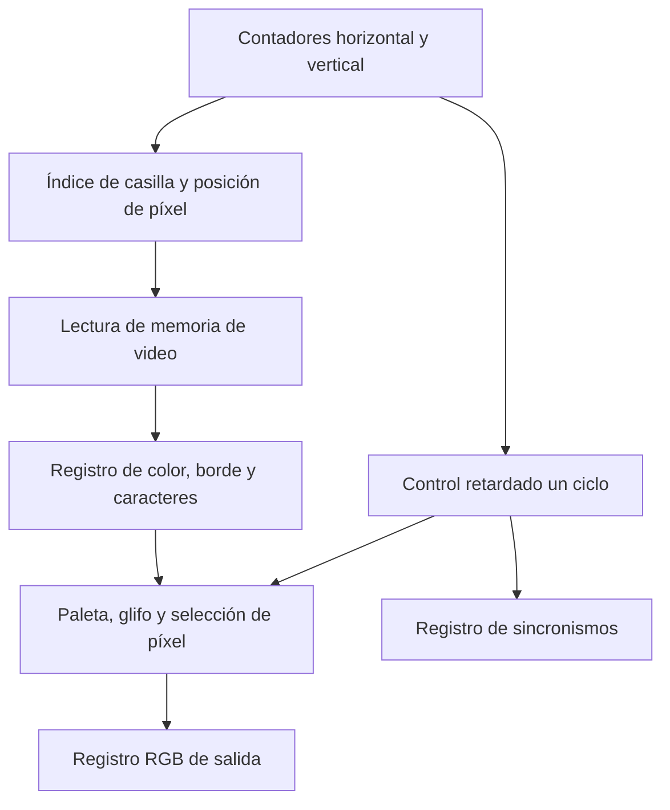

La lectura de video se registra en el primer ciclo. `video_on`, los sincronismos, el contorno y la
posición dentro de la casilla se retrasan lo mismo. El segundo ciclo registra RGB y sincronismos
de salida. La latencia es de dos ciclos de píxel para ambos caminos. Mantener esa igualdad evita
desplazar el color respecto al sincronismo o el borde respecto a su casilla.

En la selección del píxel, el blanking tiene prioridad, seguido del borde, del texto y del color
de fondo. El texto es negro sobre los fondos claros (blanco, amarillo y verde) y blanco sobre el
resto. Dos bordes de casillas adyacentes forman una línea de dos píxeles.

### 6.4 Escritura y lectura en dos dominios

El procesador escribe con `clk_sys` y el barrido lee y registra con `clk_pix`. La memoria se
describe con un puerto de escritura y dos caminos de lectura, y yosys la arma con 128 primitivas
`RAM128X1D`, que traen justo un puerto de lectura y escritura y uno de solo lectura. No se borran
las palabras por reset, para que siga siendo memoria distribuida. La configuración de la FPGA las
deja en cero y el programa arma la pantalla de la partida.

La memoria es el único punto de cruce de datos entre dominios y los dos relojes salen del mismo
VCO. Si el barrido lee una casilla en el mismo instante en que el CPU la escribe, esa casilla puede
mostrar un color equivocado durante un solo cuadro (16,8 ms). No afecta al juego, porque el estado
verdadero vive en la RAM de datos y la memoria de video es solo su representación. En las pruebas
en la tarjeta no se observaron artefactos.

### 6.5 Uso desde ensamblador

```asm
lui  s1, 0x11           # base de la memoria de video
li   t0, 10             # impacto: color 2 más borde 8
sw   t0, 324(s1)        # índice 81: fila 4, columna 1
```

Este ejemplo pinta la casilla (0,0) del tablero de J1 como impacto con borde. El programa escribe
la información gráfica y vuelve al lazo. El periférico sigue generando el video sin que la CPU
tenga que temporizar cada píxel.

## 7. Periférico UART y protocolo de aplicación

### 7.1 Mapa de registros

| Dirección absoluta | `addr_i` | Registro | Campo y acceso |
|---|---|---|---|
| `0x0001_0040` | `00` | CONTROL | bit 0 `send`, bit 1 `new_rx` |
| `0x0001_0044` | `01` | DATOS_TX | Byte en bits 7:0, RW |
| `0x0001_0048` | `10` | DATOS_RX | Último byte en bits 7:0, RW con prioridad de recepción |
| Sin dirección externa asignada | `11` | No utilizado | Lectura cero |

`send` es una orden sostenida. Escribir un uno inicia una transmisión, y el periférico lo limpia
cuando el núcleo avisa que terminó. Escribir cero no cancela la transmisión en curso. Esto resuelve
la ventana de rearme en la que el transmisor puede perder pulsos cortos. `new_rx` se activa al
recibir un byte y el programa lo limpia mediante una escritura al control. Una recepción concurrente
tiene prioridad sobre esa escritura.

La UART solo guarda un byte RX. No tiene FIFO, registro de overrun ni cola de eventos. Un segundo
byte puede reemplazar al anterior si el programa aún no lo consumió. Por eso el tiempo entre bytes
forma parte del contrato de transporte (sección 7.3).

### 7.2 Formato de mensajes de aplicación

Todas las tramas tienen cinco bytes,

```math
[\,0xAA,\ TIPO,\ D1,\ D2,\ TIPO\oplus D1\oplus D2\,]
```

| Dirección | Tipo | Nombre | D1 | D2 |
|---|---|---|---|---|
| PC → FPGA | `10` | Colocar | Bit 7 en uno si es vertical, id 0 a 2 en los bits 1:0 | Fila en nibble alto, columna en bajo |
| PC → FPGA | `11` | Disparo | Fila en nibble alto, columna en bajo | Cero |
| FPGA → PC | `20` | Estado | Subtipo | Dato del subtipo |
| FPGA → PC | `21` | Resultado de colocación | Id del barco | Código de colocación |
| FPGA → PC | `22` | Disparo dado por J2 | Coordenadas | Código de disparo |
| FPGA → PC | `23` | Disparo recibido por J2 | Coordenadas | Código de disparo |
| FPGA → PC | `24` | Resumen de disparos | Disparos de J1 | Disparos de J2 |
| FPGA → PC | `25` | Resumen de hundidos | Barcos hundidos por J1 | Barcos hundidos por J2 |

Los valores de la tabla se expresan en hexadecimal. Las coordenadas internas van de 0 a 7 y la
vista las presenta como columnas A a H y filas 1 a 8. Los códigos de jugador son 0 para J1 y 1
para J2.

| Subtipo de Estado | Valor | D2 |
|---|---:|---|
| Inicio de colocación | 0 | 0 |
| Inicio de batalla | 1 | 0 |
| Turno activo | 2 | Jugador 0 o 1 |
| Fin de partida | 3 | Ganador 0 o 1 |

| Código | Colocación | Disparo |
|---:|---|---|
| 0 | Válida | Impacto |
| 1 | Traslape | Fallo o agua |
| 2 | Fuera del tablero | Hundido |
| 3 | Id ya colocado | Casilla ya disparada |

El programa valida checksum, tipo, coordenadas, id y bits reservados antes de aceptar una orden
remota. Un mensaje completo fuera de la fase o del turno permitido se descarta sin respuesta. Un
disparo repetido no consume turno, y el repetido remoto recibe respuesta para que la terminal
pueda solicitar otra casilla.

### 7.3 Recepción, sondeo y pausas

`UART_ATENDER` atiende como máximo un byte por llamada y acumula cinco posiciones en RAM. Un
`0xAA` reinicia el armado desde cualquier punto. Ningún dato válido del protocolo vale `0xAA`
(las coordenadas, ids y códigos son menores), así que no hace falta un mecanismo de escape.

En la PC, `enlace.mandar` escribe cada byte, ejecuta `flush` y deja una pausa de 1 ms [5]. La
vuelta más larga del programa sin atender RX (un `BTN_OK` válido del Jugador 1, con validación,
colocación, repintado y HUD) es de unas 3700 instrucciones, 111 µs a 33,33 MHz, más que los
86,8 µs de un byte continuo. La pausa de 1 ms deja unas nueve veces ese margen. No convierte al
periférico en un receptor capaz de sostener un flujo continuo sin pérdidas, pero la aplicación
nunca envía de esa forma.

El banco del top utiliza pausas de 20 µs después de cada byte, suficientes para su escenario.

### 7.4 Asociación de solicitud y respuesta

La PC conserva una solicitud pendiente con tipo, datos e instante. Antes de recibir respuesta no
envía otra confirmación. El plazo de espera es de 2 s. Una colocación válida dibuja las coordenadas
de esa solicitud y avanza al siguiente barco, y un rechazo mantiene el id por colocar.

La recuperación tiene un caso límite que requiere perder una trama. Si se pierde la respuesta a una
colocación válida, al vencer el plazo se elimina la solicitud. Si el usuario cambia la posición y
reintenta el mismo id, la FPGA devuelve "ya colocado" porque guardó la primera posición, y la PC
trata ese código como aceptación de la segunda (`partida.py`). En ese caso la vista de la PC
muestra el barco en una posición distinta de la que guardó la FPGA. La corrección es conservar la
colocación original del id tras el vencimiento o incluir en la respuesta la colocación confirmada.
En las pruebas en la tarjeta no se perdieron tramas.

### 7.5 Ejemplo de intercambio

```text
FPGA → PC   AA 20 00 00 20   Inicio de colocación
PC → FPGA   AA 10 00 00 10   Barco 0 horizontal en A1
FPGA → PC   AA 21 00 00 21   Colocación aceptada
...
FPGA → PC   AA 20 01 00 21   Inicio de batalla
FPGA → PC   AA 20 02 00 22   Turno del Jugador 1
FPGA → PC   AA 23 10 01 32   J1 disparó a A2 y falló
FPGA → PC   AA 20 02 01 23   Turno del Jugador 2
PC → FPGA   AA 11 01 00 10   J2 dispara a B1
FPGA → PC   AA 22 01 00 23   J2 obtuvo impacto en B1
```

No se transmite el tablero secreto de J1. La PC conserva su propio tablero a partir de sus
colocaciones confirmadas y el tablero rival a partir de los resultados de sus disparos. El chequeo
XOR detecta los errores de un bit y muchas corrupciones, pero no reemplaza un CRC.

## 8. Diagramas de estado

### 8.1 Fases del programa de juego

Estos estados son del programa en ensamblador. En el HDL no hay una FSM principal del juego.

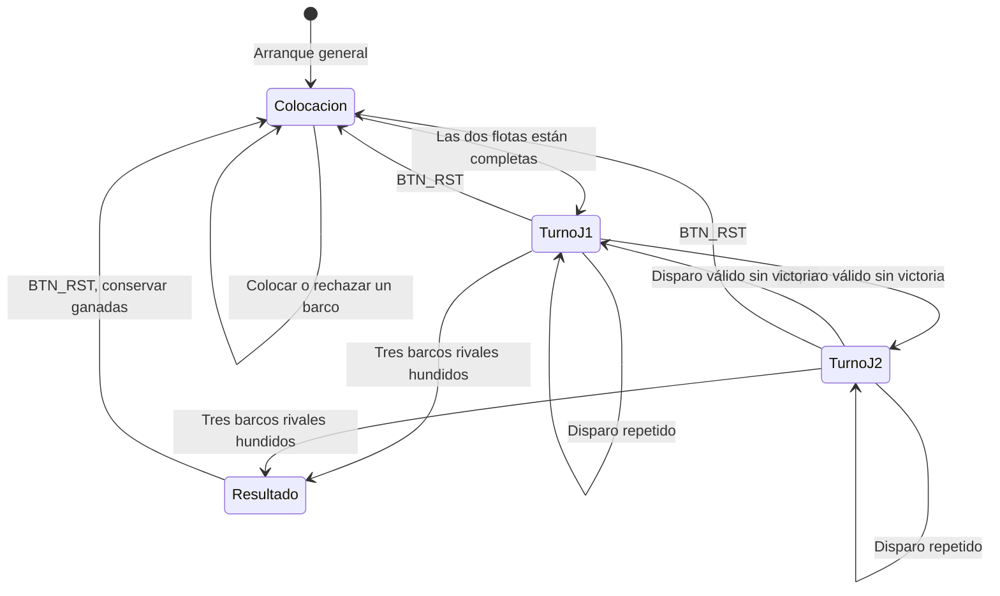

Durante la colocación, cada vuelta atiende las entradas locales y una posible trama remota. J1
coloca en orden de id y conserva una cantidad, y J2 conserva una máscara. La batalla inicia cuando
J1 tiene cantidad 3 y J2 máscara `111`. J1 siempre toma el primer turno.

### 8.2 Estado de una casilla

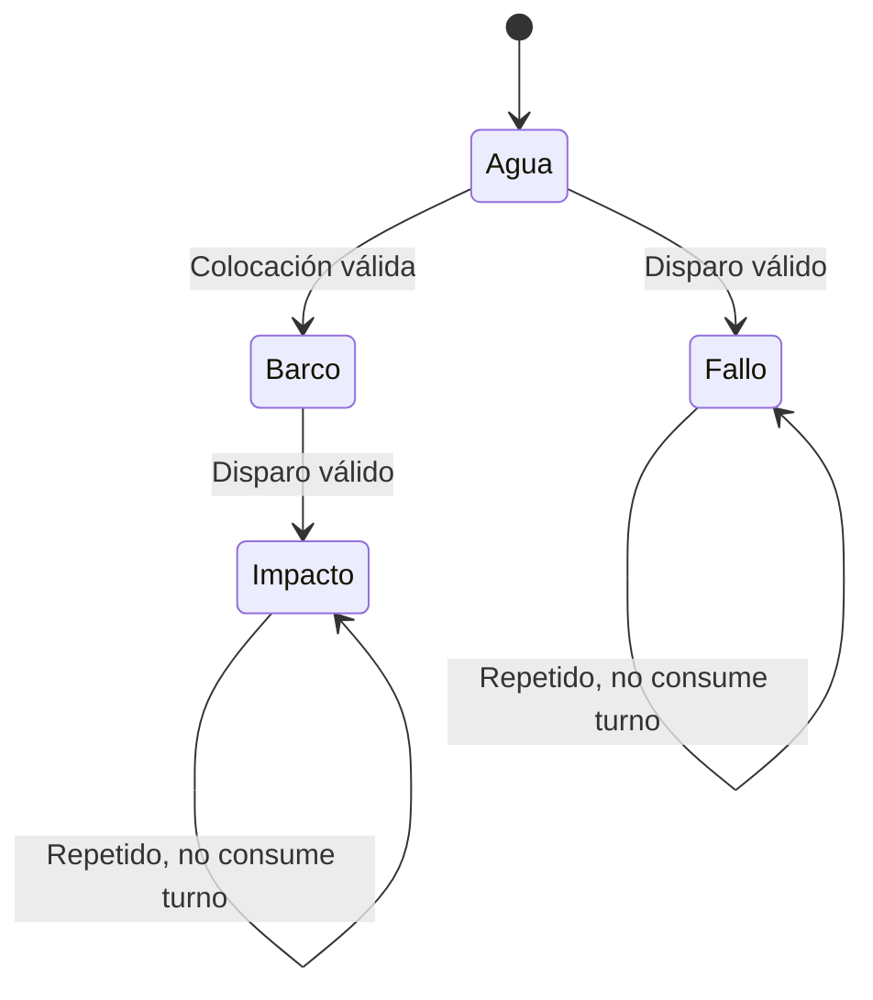

Hundido no aparece como estado de casilla. El programa lo detecta cuando el número de impactos del
id llega a su longitud. El evento incrementa los hundidos del tirador y el tercero produce la
victoria.

### 8.3 Máquinas de estado UART de bajo nivel

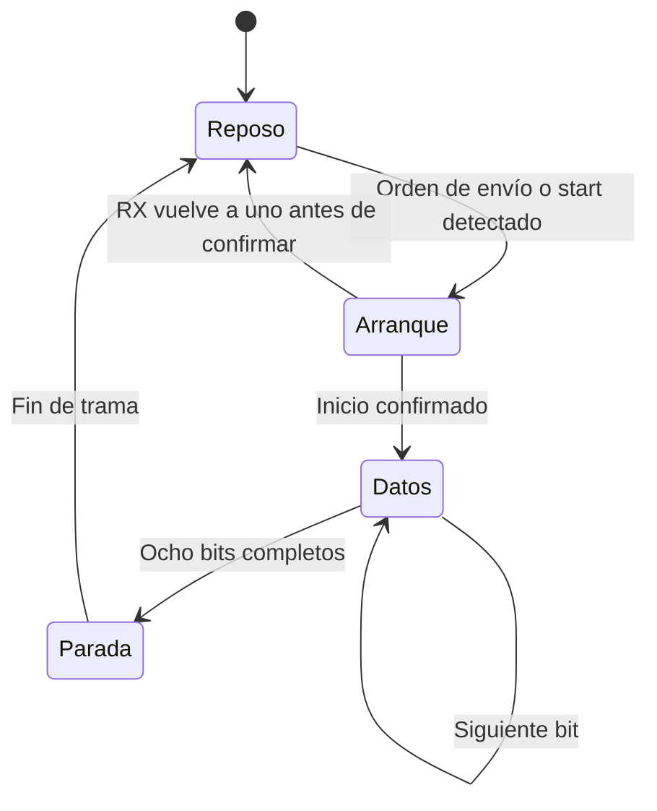

TX y RX tienen estados con estos nombres, pero temporizaciones distintas. TX cuenta ciclos por
bit. RX cuenta ticks de sobremuestreo y valida que el arranque se mantenga bajo antes de pasar a
datos. El estado PARADA de RX espera el intervalo y publica el byte sin verificar que el pin esté
alto, así que no se reporta framing error. Una trama corrupta la descarta igual el chequeo XOR del
protocolo.

### 8.4 Decodificación de tramas y sonido

El decodificador de aplicación conserva un índice. Sin cabecera descarta bytes, y con cabecera
acumula hasta la quinta posición, verifica y vuelve a espera. La misma regla se implementa en
`UART_ATENDER` y en el `Decodificador` de Python. El programa consume mensajes completos únicamente
donde su fase y turno lo permiten.

El secuenciador de melodía conserva `paso`, ciclos de la unidad y unidades de la nota. Una nueva
escritura vuelve al paso cero. Si la duración es cero se considera terminada, y en caso contrario
el paso avanza al completar su duración. El generador de tono cuenta y conmuta mientras
`o_sonar` permanezca activo.

## 9. Estrategia de validación

La validación se divide en pruebas de instrucciones, memorias y bus, periféricos, protocolo y PC,
sistema completo, síntesis, implementación y tarjeta. Los testbenches comparan automáticamente
resultados esperados y observados, imprimen cuántas pruebas pasaron y cuántas fallaron, y terminan
con error si alguna falla. Una forma de onda permite explicar un caso, pero no reemplaza el
criterio automático de pase.

| Nivel | Prueba | Criterio de aceptación |
|---|---|---|
| Procesador | Programas de prueba rv32ui | Escribir 1 en `0xFFFF_FFF0` dentro de 20 000 ciclos y PC correcto tras reset |
| ROM y RAM | Patrones, extremos y temporización de acceso | Lectura esperada, escritura solo en el flanco con enable |
| AT y MUX | Barrido de direcciones y enables | Selección correcta, aislamiento y lectura cero en inválidas |
| Periféricos | Registros y señales físicas | Campos correctos, reset, direcciones no utilizadas y operación temporal |
| PC | `unittest` de codificación y estado | 18 pruebas sin fallos |
| Integración | `tb_top` con ROM real | Tramas, tableros, HUD, LED, display y resultado coherentes durante la partida |
| Síntesis | `make synth` con yosys | Ningún `Latch inferred` en el log ni latch en el netlist |
| Linter | `make lint`, `verilator --lint-only -Wall` sobre el top | Ningún aviso de latch, de asignación con retardo en lógica combinacional ni de driver múltiple |
| Implementación | nextpnr-xilinx | Frecuencia máxima de cada reloj por encima de la de operación |
| Post-implementación | `tb_top_temporizado` sobre el netlist de Vivado con SDF, en xsim | Programa, colocación y disparos correctos, sin violaciones de setup ni de hold |
| Tarjeta | Partidas completas en la Basys 3 | Controles, enlace, imagen, sonidos, displays y LED correctos |

Todo se reproduce desde la raíz del repositorio con estos comandos.

```sh
make test-app    # pruebas de la app de PC
make test        # los 15 testbenches, uno por uno
make sim TB=top  # solo el sistema completo
make sim-post    # simulación post-implementación temporizada con Vivado, cerca de una hora
make programa    # vuelve a ensamblar sw/programa.s
make synth       # síntesis genérica del top y chequeo de latches
make lint        # linter Verilator sobre el top
make bitstream   # síntesis, colocación y ruteo con openXC7
make flash       # graba el bitstream en la flash de la Basys 3
```

Se usaron Icarus Verilog 13.0, yosys 0.69 y nextpnr-xilinx del toolchain openXC7,
openFPGALoader, binutils de GNU para RISC-V, Python 3 con `pyserial` y Verilator 5.020 como
linter. La simulación post-implementación usa Vivado 2026.1 y xsim. Los testbenches usan
`return` dentro de tasks y literales de arreglo `'{...}`, que Icarus 12 no acepta, por eso el
README fija la versión 13.

`make synth` carga las primitivas de Xilinx (`cells_sim.v` y `cells_xtra.v`) como cajas negras
antes de `hierarchy -check`, para que la síntesis genérica reconozca el `PLLE2_BASE` y los `BUFG`
sin sintetizar su contenido. `make bitstream` usa `synth_xilinx`, que las carga por su cuenta.

El escenario del top deja afuera la victoria de J1, las colocaciones verticales en los bordes,
los disparos repetidos de los dos jugadores, el paso del BCD de 09 a 10 y de 99 a 00, y los
mensajes corruptos o perdidos. Algunos los cubren los bancos de módulo, como los del display y la
UART, y el resto se comprobó jugando en la tarjeta.

## 10. Resultados

### 10.1 Resumen de simulaciones autoverificables

| Banco o suite | Verificaciones | Resultado |
|---|---:|---|
| `tb_address_translator` | 266 148 | Pasa |
| `tb_bus_perifericos` | Pase global | Pasa, con cinco periféricos reales |
| `tb_periferico_7seg` | 32 | Pasa |
| `tb_periferico_buzzer` | 83 | Pasa |
| `tb_periferico_entradas` | 21 | Pasa |
| `tb_periferico_led` | 14 | Pasa |
| `tb_periferico_uart` | 51 | Pasa |
| `tb_periferico_vga` | 28 | Pasa |
| `tb_procesador_uniciclo` | 29 programas rv32ui | Pasa |
| `tb_ram` | 1174 | Pasa |
| `tb_rom` | 123 | Pasa |
| `tb_top` | 82 | Pasa |
| `tb_top_temporizado` | 19 | Pasa en RTL y sobre el netlist post-implementación (sección 10.7) |
| `tb_uart_rx` | 20 | Pasa |
| `tb_uart_tx` | 18 | Pasa |
| Aplicación de PC | 18 pruebas unitarias | Pasa |

Cada banco cuenta distinto. Una prueba ISA incluye varios casos, el banco del VGA compara cada
píxel de cuadros completos y el de bus da un solo pase global, así que las cantidades no se pueden
sumar como si fueran una medida de cobertura.

### 10.2 Programa, imagen ROM y escenario de integración

El ensamblado produce 1264 instrucciones. Volver a ensamblar `sw/programa.s` da una imagen idéntica,
palabra por palabra, a `sw/programa.hex`. Quedan 784 posiciones disponibles, equivalentes a
3136 bytes.

El banco del top inicia con el reset del PLL, recibe la notificación de colocación y verifica
tableros, borde, títulos, letras, números y marcador. Coloca barcos válidos de ambos jugadores,
repite un id remoto y rechaza un traslape local. Después juega 18 disparos, nueve de J1 al agua y
nueve de J2 contra las nueve casillas de la flota de J1.

- Al arrancar queda en fase de colocación, con el LED en `001` y las ganadas en `00 00`.
- El barco remoto queda guardado en RAM y no aparece en el VGA.
- La colocación local traslapada no incrementa los colocados y pide el sonido de inválida.
- Con las dos flotas completas pasa a batalla, con el primer turno para J1.
- Los disparos válidos alternan el turno y generan las respuestas seriales esperadas.
- Al final gana J2, con disparos `9 / 9` y hundidos `0 / 3`.
- Las ganadas de J2 suben a `01` en el HUD y en el display.
- `BTN_RST` vuelve a la colocación y conserva el `00 01`.

### 10.3 Evidencia de simulación

Estos son extractos de la salida de `make test`.

```text
PASS AT + MUX: 266148 checks
PASS bus con 5 perifericos reales: direcciones, escritura, lectura y aislamiento
PASS tb_procesador_uniciclo: 29 pruebas rv32ui
PASS tb_ram: 1174 chequeos
PASS tb_rom: 123 chequeos
```

```text
--> periferico_uart
ok y el byte llega bien
51 pruebas, 0 fallos
--> periferico_vga
ok despues del reset la imagen sigue igual, sincronismos
28 pruebas, 0 fallos
```

```text
--> top
ok la partida termina, gana el Jugador 2
ok resumen de disparos, 9 y 9
ok resumen de hundidos, 0 y 3
ok y las ganadas se conservan
82 pruebas, 0 fallos
```

```text
$ make test-app
Ran 18 tests in 0.001s

OK
```

### 10.4 Uso de recursos

La síntesis genérica (`make synth`) termina sin errores. El log de yosys no tiene ningún
`Latch inferred`, y `proc` reporta 570 señales combinacionales revisadas sin latch. El netlist tiene
10 memorias (`$mem_v2`), un `PLLE2_BASE` y dos `BUFG`, y ninguna celda de latch.

El linter (`make lint`, `verilator --lint-only -Wall` sobre el top) no da ningún aviso de latch
(`LATCH`), de asignación con retardo en lógica combinacional (`COMBDLY`) ni de señal con más de un
driver (`MULTIDRIVEN`). Da 23 avisos de estilo, y se revisaron uno por uno.

- 8 `WIDTHEXPAND`. En `periferico_vga.sv` los contadores de 10 bits se comparan con constantes
  enteras de 32, y Verilator extiende con ceros, que es lo correcto.
- 11 `UNUSEDSIGNAL`. Son bits de `wdata_i` y `addr_i` que algún periférico o memoria no usa (el de
  entradas tampoco usa `write_enable_i` ni `wdata_i`, porque es de solo lectura), y señales del
  núcleo reutilizado que la plataforma no conecta, como las habilitaciones por byte y de lectura,
  el reloj de `data_memory_interface` y bits de `funct7` que el control no necesita.
- 2 `UNUSEDPARAM`, constantes que están solo como documentación (`COLUMNAS` del VGA y `SILENCIO`
  del secuenciador).
- 1 `DECLFILENAME`, porque `generador_tono.sv` incluye el módulo auxiliar `contador_limpiable`.
- 1 `PINCONNECTEMPTY`, en `prueba_vga.sv`, el top de prueba del VGA, que deja `rdata_o` sin
  conectar.

Verilator no conoce `PLLE2_BASE` ni `BUFG`, así que revisa `generador_relojes` con su modelo de
simulación, que es la parte del diseño que no llega a la FPGA.

Esta es la utilización del XC7A35T que reporta nextpnr-xilinx (`make bitstream`) después de
colocar y rutear.

| Recurso | Usado | Disponible en el XC7A35T | Porcentaje |
|---|---:|---:|---:|
| LUT (lógica y memoria distribuida) | 4788 | 20 800 | 23,0 % |
| Flip-flops | 385 | 41 600 | 0,9 % |
| CARRY4 | 124 | 8150 | 1,5 % |
| BRAM | 0 | 50 | 0 % |
| PLL | 1 | 5 | 20 % |
| BUFG | 2 | 32 | 6,3 % |
| Pines de E/S | 40 | 106 | 37,7 % |

nextpnr-xilinx reporta los porcentajes contra el die del XC7A50T (65 200 LUT), que comparte
encapsulado con el 35T, y la tabla los recalcula contra la capacidad real del XC7A35T.

Buena parte de las LUT se van en memorias. Solo la memoria de video son 128 `RAM128X1D`, unas
512 LUT, y la ROM de 8 KiB se arma como lógica porque es constante. No hay BRAM por la decisión D4,
y hay tan pocos flip-flops porque el banco de registros y las memorias están en LUTRAM.

### 10.5 Análisis de *timing*

Estas son las frecuencias máximas que reporta nextpnr-xilinx después del ruteo.

| Reloj | Frecuencia de operación | Período | Frecuencia máxima | Período mínimo | Holgura |
|---|---:|---:|---:|---:|---:|
| `clk_sys` | 33,33 MHz | 30,0 ns | 37,92 MHz | 26,37 ns | 3,63 ns |
| `clk_pix` | 25 MHz | 40,0 ns | 85,46 MHz | 11,70 ns | 28,30 ns |

El camino crítico de `clk_sys` es el de un branch. Arranca en el registro del PC
(`prog_address`), pasa por la ROM, la lectura del banco de registros y la comparación de la ALU, y
vuelve al PC por `next_pc`. Tiene 2,90 ns de lógica y 23,30 ns de ruteo, o sea que el 88 % del
período mínimo se va en ruteo, por la cantidad de LUT que ocupan las memorias combinacionales y la
distancia entre ellas. Antes de rutear, la estimación era de 35,90 MHz.

La frecuencia máxima cambia entre versiones del diseño, porque cada cambio en el RTL o en el
programa mueve la colocación. Con versiones anteriores, `clk_sys` dio entre 39 y 50 MHz, y con la
versión final da 37,92 MHz. La frecuencia de 33,33 MHz deja margen en todas esas corridas. Si
alguna diera menos de 33,33 MHz, el siguiente paso es 1000 / 32 = 31,25 MHz, que conserva un error
bajo en la UART.

El reporte da la frecuencia de cada dominio por separado. El único cruce de datos entre dominios
es la memoria de video, analizado en la sección 6.4.

### 10.6 Resultados funcionales en la FPGA

El sistema completo se cargó en la Basys 3 desde la flash y se jugaron partidas completas entre el
Jugador 1, con los botones y el monitor VGA, y el Jugador 2, con la aplicación de PC. La
demostración está en el
[video de comprobación](https://estudianteccr-my.sharepoint.com/personal/mcoghi_estudiantec_cr/_layouts/15/stream.aspx?id=%2Fpersonal%2Fmcoghi%5Festudiantec%5Fcr%2FDocuments%2FITCR%2F2026%2FSemestre%20II%2FTaller%20de%20dise%C3%B1o%20digital%2Fvideo%5Fcomprobacion%2DGR01%2Emp4&nav=eyJyZWZlcnJhbEluZm8iOnsicmVmZXJyYWxBcHAiOiJPbmVEcml2ZUZvckJ1c2luZXNzIiwicmVmZXJyYWxBcHBQbGF0Zm9ybSI6IldlYiIsInJlZmVycmFsTW9kZSI6InZpZXciLCJyZWZlcnJhbFZpZXciOiJNeUZpbGVzTGlua0NvcHkifX0&ga=1&referrer=StreamWebApp%2EWeb&referrerScenario=AddressBarCopied%2Eview%2Ee62e6088%2D6583%2D4563%2D90d1%2D1f4e5d9ba631).

- La prueba del VGA sin procesador (`prueba_vga.sv`) dio una imagen estable con el patrón
  esperado, lo que confirmó el PLL, el barrido, la escritura y la cuadrícula.
- En la colocación, cada jugador coloca sin bloquear al otro y el VGA no muestra la flota de J2.
- En la batalla funcionan el cursor sobre el tablero rival, los impactos, fallos y hundidos, y la
  alternancia de turnos.
- Al terminar la partida, el ganador aparece en el VGA y en la PC, llega el resumen por UART, y
  `BTN_RST` empieza otra partida conservando las ganadas.
- Los displays muestran las ganadas de cada jugador y el LED la fase activa.
- El buzzer toca los cinco sonidos distintos.
- PROG recarga el diseño desde la flash en unos 0,5 s y deja las ganadas en 00 00.

La primera foto es de la fase de colocación. En el monitor, las dos barras dicen COLOCANDO y la
vista previa amarilla del barco 0 del Jugador 1, de largo 4, está en la fila 1 de la A a la D. El
Jugador 2 coloca desde la laptop de la derecha, y su tablero se ve todo en agua porque el VGA nunca
muestra la flota de J2. Abajo están el mensaje de la fase y las partidas ganadas, en 00 y 00.

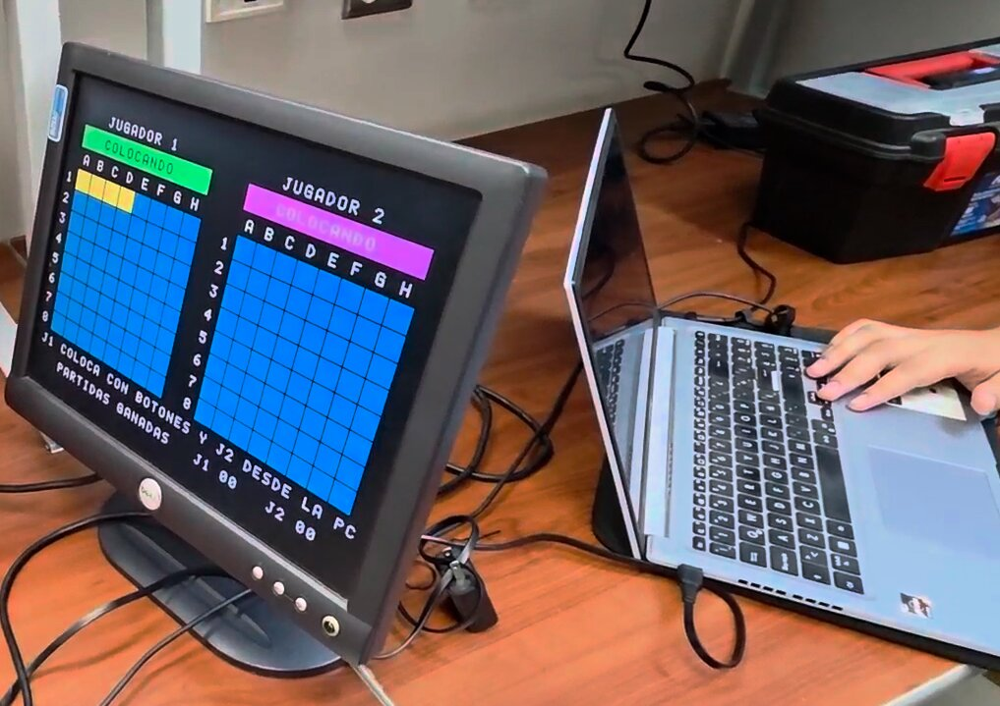

La segunda es la Basys 3 después de una partida ganada por el Jugador 2. Los displays muestran
00 01, con las ganadas del Jugador 1 en los dos dígitos de la izquierda y las del Jugador 2 en los
de la derecha, y el LED DONE, junto al botón PROG, indica que la FPGA está configurada.

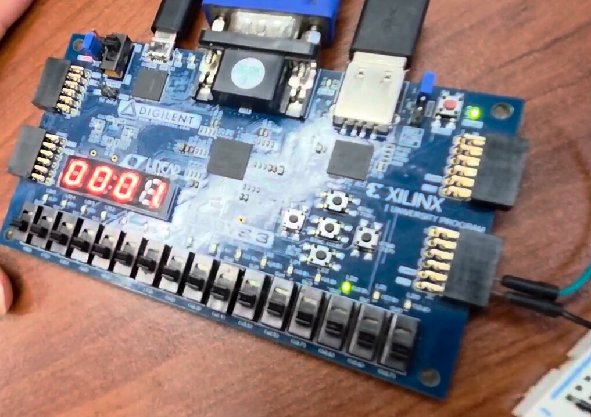

### 10.7 Simulación post-implementación temporizada

El instructivo pide una simulación post-implementación temporizada del sistema que cubra al menos
la ejecución de un fragmento representativo del programa y la validación de un disparo. Los bancos
de la sección 10.1 son RTL y usan el modelo conductual del PLL, sin retardos de celdas ni de ruteo.
Con el flujo abierto openXC7 no se puede hacer al pie de la letra. nextpnr-xilinx sí escribe un
SDF con los retardos del diseño ruteado (`--sdf`), pero ese archivo describe sus celdas internas
(`SLICE_LUTX`, `SLICE_FFX`, `SELMUX2_1`), que no tienen modelo de simulación, y no hay un netlist
simulable sobre el cual anotarlo. Por eso para esta simulación se usó Vivado 2026.1:
implementación, netlist temporizado (`write_verilog -mode timesim` y `write_sdf`) y simulación con
xsim. Todo el flujo corre con `make sim-post` (script `src/fpga/vivado_timesim.tcl`).

Vivado corre `synth_design`, `opt_design`, `place_design` y `route_design` para el
xc7a35tcpg236-1 con `src/fpga/basys3.xdc`, con la ROM cargada con el `programa.hex` real. El
resultado de la implementación es este.

| Métrica | Valor |
|---|---|
| WNS (setup), `clk_sys` | +5,026 ns (máximo equivalente de 40,0 MHz) |
| WNS (setup), `clk_pix` | +29,386 ns |
| WHS (hold) | +0,046 ns |
| Endpoints con violación | 0 de 11 179 |
| LUT (lógica / memoria) | 3067 (1999 / 1068), 14,7 % |
| Flip-flops | 387 |
| BRAM | 0 |
| Resultado | *All user specified timing constraints are met* |

El camino crítico de `clk_sys` se parece al que reporta nextpnr-xilinx en la sección 10.5. Arranca
en el registro del PC (`program_counter/value_reg[3]`) y cruza la ROM, la decodificación y la ALU,
pero en Vivado termina en una escritura del banco de registros y en nextpnr en el PC. Son 24,6 ns
con 18 niveles de lógica, y el 84 % es ruteo.

`tb_top` no sirve sobre el netlist. Lee la RAM (`dut.u_ram.mem`) y la memoria de video, y después
de implementar esas memorias quedan repartidas en primitivas LUTRAM con otros nombres. Por eso se
escribió `src/sim/tb_top_temporizado.sv`, que solo usa los pines del `top` y los cables que
conservan su nombre en el netlist (`rst`, `clk_sys`, `prog_address`, `prog_in`, `buzzer_dout`). Hace
de Jugador 1 con los botones y de aplicación de PC por la UART, igual que `tb_top`, y revisa cuatro
cosas.

1. El fragmento del programa. En cada flanco de `clk_sys` después del reinicio compara la
   instrucción que sale de la ROM con `programa.hex` en la dirección del PC. También revisa que el
   PC siguiente salga de esa instrucción, sea PC + 4, el destino de un `jal` o una de las dos
   salidas de un branch (`jalr` no se revisa porque su destino depende de un registro). Con los
   retardos del netlist, eso confirma que la ROM y la lógica del PC se estabilizan dentro del
   ciclo. Las primeras 12 instrucciones se imprimen.
2. El arranque, con la primera trama `Estado` de colocación, el LED en `001` y los displays en
   `00 00`.
3. La colocación. El Jugador 1 pone su flota con los botones en las filas 0, 1 y 2, y el Jugador 2
   por la UART en las filas 0, 2 y 4. Con el último barco llegan las tramas de inicio de batalla y
   de turno del Jugador 1, y el LED pasa a `010`.
4. Un disparo de cada jugador. El Jugador 1 dispara en (0,0), donde está el barco 0 del Jugador 2,
   y la respuesta es impacto, con el sonido de impacto en el registro del buzzer y el turno para el
   Jugador 2. El Jugador 2 dispara al agua en (5,5), la respuesta es fallo, suena el fallo y el
   turno vuelve al Jugador 1.

La misma prueba corre sobre el RTL con `make sim TB=top_temporizado`, en unos 20 s, como referencia.

Sobre el netlist con retardos, xsim avanza unos 0,86 µs simulados por segundo. A 115 200 baudios
cada trama de 5 bytes dura 434 µs, y el escenario completo necesitaba 10,5 ms simulados, más de tres
horas por corrida. Por eso la velocidad de la UART se volvió un parámetro
del `top` (`BAUDIOS`, 115 200 por defecto) y esta implementación se hizo con
`-generic BAUDIOS=694444`. A 33,33 MHz eso da `TICKS_BIT = 48` y `TICKS_X16 = 3`, y como 16 × 3 = 48
el receptor muestrea sin error acumulado. El bitstream de la tarjeta se genera siempre con 115 200.
La única diferencia entre los dos netlists es la constante de los contadores de bit de la UART, y el
procesador, la ROM, la RAM, el AT y los periféricos son los mismos. El testbench también acorta las
pulsaciones a 150 µs, que alcanzan porque la vuelta más larga del lazo del programa, un repintado
del tablero, dura unos 100 µs.

Se simularon 3,25 ms del sistema completo con los retardos post-ruteo (SDF). La simulación tardó
53 minutos, y 58 con la implementación y la compilación. Esta es la salida del testbench, y el log
completo de xsim está en [`evidencia/sim_post_xsim.log`](evidencia/sim_post_xsim.log).

```text
ok el sistema arranca en reinicio mientras el PLL no engancha
  el reinicio baja en 611 ns
ok la primera instruccion despues del reinicio es la de la direccion 0
  instruccion  0: PC 0000  00010437
  instruccion  1: PC 0004  000114b7
  instruccion  2: PC 0008  00002937
  instruccion  3: PC 000c  24092423
  instruccion  4: PC 0010  12042823
  instruccion  5: PC 0014  04042023
  instruccion  6: PC 0018  00003137
  instruccion  7: PC 001c  348010ef
  instruccion  8: PC 1364  ffc10113
  instruccion  9: PC 1368  00112023
  instruccion 10: PC 136c  24892383
  instruccion 11: PC 1370  00090293
ok la primera trama es Estado, fase de colocacion
ok el LED marca la fase de colocacion
ok el display muestra 00 00 de partidas ganadas
ok el barco 0 del Jugador 2 se acepta
ok el barco 1 del Jugador 2 se acepta
ok el barco 2 del Jugador 2 se acepta
ok arranca la batalla
ok con el turno del Jugador 1
ok el LED pasa a batalla
ok el disparo del Jugador 1 en (0,0) es impacto
ok y suena el sonido de impacto
ok y pasa el turno al Jugador 2
ok el disparo del Jugador 2 en (5,5) es fallo
ok y suena el sonido de fallo
ok y vuelve el turno al Jugador 1
ok el LED sigue en batalla
ok las 108266 instrucciones ejecutadas salen de la ROM y siguen el flujo del programa
19 pruebas, 0 fallos
```

xsim no reportó ninguna violación de setup ni de hold en toda la corrida. En el Proyecto 2 sí hubo
violaciones al soltar el reset, que entraba directo de un pin. Aquí sale de `~locked` del PLL
pasado por dos flip-flops en `clk_sys` (sección 5.1), así que ya llega sincronizado.

La traza es el arranque del programa (`INICIO`). Tres `lui` cargan las bases de periféricos, video
y RAM (`s0`, `s1`, `s2`), tres `sw` ponen en cero las ganadas, los displays y el control de la
UART, un `lui` deja la pila en `0x3000`, y el `jal` en `0x001c` salta a `NUEVA_PARTIDA` en
`0x1364`, donde `addi sp, sp, -4` y `sw ra, 0(sp)` guardan la dirección de retorno.

Los bits `[1:0]` de `prog_in` quedan sin driver en el netlist. Todas las instrucciones rv32i
terminan en `11`, y Vivado deja esos dos bits como constante dentro de la ROM (2048 × 31 en el
reporte de síntesis), así que la prueba compara los bits `[31:2]`.

La primera figura muestra la salida del reinicio en la simulación temporizada. `rst` baja a los
611 ns, cuando el PLL ya enganchó y los dos flip-flops de sincronización pasaron `locked`. Después
de cada flanco de `clk_sys`, el PC cambia 2,0 ns más tarde, y la instrucción pasa por varios valores
intermedios mientras cada bit de la ROM se asienta (las marcas estrechas en la fila
`instrucción`). En los primeros 18 ciclos se estabiliza entre 5,1 y 6,1 ns después del flanco,
lejos de los 30 ns del período. En una simulación RTL el cambio sería instantáneo.

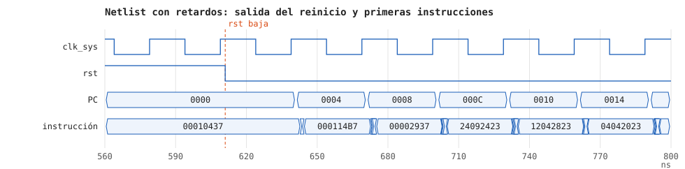

La segunda figura muestra el disparo del Jugador 1. Mientras `BTN_OK` está en alto, el programa lee
el botón en la vuelta siguiente del lazo, valida el disparo contra el tablero del Jugador 2 y a los
7 µs empieza a enviar por `tx` la trama de disparo recibido (`AA 23 00 00 23`, casilla (0,0) e
impacto). Le sigue la trama de estado con el turno del Jugador 2 (`AA 20 02 01 23`). Cada byte dura
14,4 µs a 694 444 baudios. El LED se mantiene en `010`, fase de batalla.

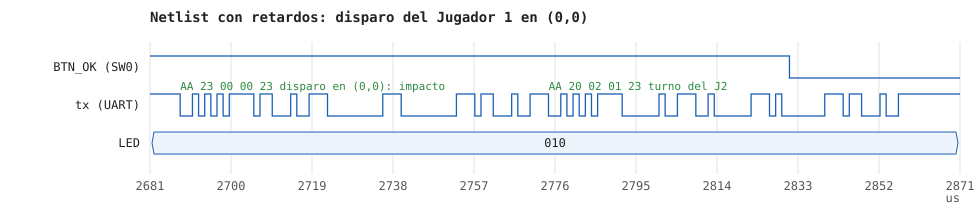

xelab simula con el modelo de retardo inercial, el que trae por defecto, en el que un pulso más
corto que el retardo de una celda no se propaga. La primera corrida usó
`-transport_int_delays -pulse_r 0`, que deja pasar cada glitch. La ROM es un árbol de LUT y
`MUXF7`/`MUXF8`, y cuando cambian varios bits del PC a la vez sus salidas pasan por valores
intermedios. Sin `-pulse_e 0` esos pulsos salían como `X`, que llegaban a la instrucción y de ahí
al PC. Con `-pulse_e 0` desaparecen, pero la simulación va tres veces más lenta que con el modelo
inercial.

Para reproducirla hay dos comandos.

```sh
make sim-post                     # implementación con Vivado y simulación con xsim, cerca de una hora
make sim TB=top_temporizado       # la misma prueba sobre el RTL
```

El Makefile toma Vivado de `XILINX_VIVADO=/opt/Xilinx/2026.1/Vivado` (se puede cambiar en la línea
de comandos) y deja el netlist, el SDF, los reportes de timing y de uso, el log de xsim y la onda
`tb_top_temporizado.vcd` en `src/build/timesim/`. En Ubuntu y derivadas, el compilador que trae xsim
no encuentra `crti.o` y `xelab` falla con `[XSIM 43-3238] Failed to link the design`. El Makefile lo
evita pasando `LIBRARY_PATH=/usr/lib/x86_64-linux-gnu`.

## 11. Análisis de resultados

Las 29 pruebas ISA muestran que el núcleo, conectado a las memorias del proyecto, resuelve los
programas de prueba seleccionados. Los bancos de ROM, RAM y AT agregan evidencia sobre lectura,
escritura, índices y aislamiento. La partida completa del top es especialmente útil porque
ejecuta el `.hex` real, genera tramas sobre los pines UART y observa efectos en memoria y salidas,
sin sustituir las reglas por un modelo de alto nivel.

La victoria de J2 después de nueve impactos coincide con las nueve casillas de una flota de
4 + 3 + 2. El resumen de 9 / 9 disparos, los tres hundidos de J2 y el marcador 00 / 01 son
consistentes entre UART, RAM, HUD y display. El reinicio posterior demuestra la diferencia entre
una nueva partida y la inicialización general que borra las ganadas.

El testbench VGA confirma períodos y representación bajo sus condiciones de simulación. La
frecuencia vertical teórica es 59,52 Hz y la latencia gráfica es de dos ciclos, ambos valores
de la arquitectura implementada. En la tarjeta la imagen fue estable en el monitor.

El análisis de timing confirma la decisión de bajar `clk_sys` a 33,33 MHz. Con 37,92 MHz de máximo
queda una holgura de 3,63 ns, y el camino crítico es el que predice la teoría del uniciclo, que va
del PC a la ROM, al banco de registros y a la ALU, y vuelve al PC. Que el ruteo pese el 88 % del
camino indica que el margen depende más de la colocación que de la profundidad lógica, y explica la
variación entre versiones.

Vivado da números parecidos, con 5,03 ns de holgura en `clk_sys`, un camino crítico que también
sale del PC y pasa por la ROM, la ALU y el banco de registros, y 84 % de ruteo. Lo que el análisis
estático no muestra es si el programa sigue haciendo lo mismo con esos retardos, y eso es lo que
aporta la simulación temporizada. Las 108 266 instrucciones de la corrida
salen de la ROM con el valor del `.hex`, el PC sigue el flujo del programa en cada ciclo, y las
tramas, el LED y el sonido de los dos disparos coinciden con los de la simulación RTL. El WHS de
0,046 ns es chico pero positivo, y la simulación tampoco encontró violaciones de hold.

Todo esto vale para la implementación de Vivado. El bitstream de openXC7 tiene otra colocación, y
para ese el respaldo sigue siendo el análisis de nextpnr y la prueba en la tarjeta.

La coincidencia de la imagen ROM con el reensamblado elimina una posible discrepancia entre fuente
y binario. Hay que repetirla si cambia `programa.s`, porque el Makefile no regenera el `.hex` por
la fecha de la fuente y la reconstrucción se hace a mano con `make programa`.

Las 18 pruebas Python comprueban codificación, fragmentación de tramas y actualizaciones de estado.
No cubren la pérdida de una respuesta de colocación, que es el caso límite descrito en la sección
7.4. Los bancos de entradas usan señales ideales y no validan el comportamiento mecánico de los
pulsadores, que se comprobó en la tarjeta.

## 12. Problemas encontrados y su solución

- P1, el camino largo del procesador uniciclo. Se bajó `clk_sys` a 33,33 MHz y se recalcularon
  los parámetros de UART, buzzer y display. Resuelto, con 37,92 MHz de máximo.
- P2, los índices de registro cambiaban según la dirección externa. La UART usa los bits 3:2, los
  periféricos de un registro reciben `00` y el VGA usa 10:2. Lo ejercitan `tb_bus_perifericos` y
  `tb_top`.
- P3, el transmisor perdía los pulsos cortos de `send` en el rearme. Ahora `send` se mantiene hasta
  que TX avisa el fin, y pasan `tb_uart_tx` y `tb_periferico_uart`.
- P4, un RX de un solo byte frente a vueltas largas del software. Se mitigó con 1 ms de pausa entre
  bytes en la PC, sin agregar FIFO.
- P5, el color, el texto y el sincronismo del VGA salían desalineados. Se retrasó el control con la
  misma latencia y se registraron las salidas, y `tb_periferico_vga` pasa.
- P6, borrar la pantalla en hardware salía caro. La configuración la deja en cero y el software la
  limpia, y `tb_top` verifica el arranque y el reinicio.
- P7, el riesgo de mostrar la flota de J2 en el VGA. `PINTAR_CASILLA` es la única rutina que copia
  un tablero a la pantalla y convierte un barco intacto de J2 en agua. `tb_top` comprueba una
  colocación oculta.
- P8, el reinicio de partida no podía borrar las ganadas. Se separó `INICIO` de `PARTIDA` y el BCD
  se conserva al limpiar las variables. Comprobado en `tb_top` y en la tarjeta.
- P9, con `RST` y `PWRDWN` del PLL atados a una constante, nextpnr-xilinx escribía mal su bit de
  inversión y el PLL se quedaba en reinicio, sin `locked` ni salidas. Esos pines quedaron sin
  conectar, como los usa LiteX con este flujo. Se encontró y se comprobó en la tarjeta.
- P10, `make synth` no reconocía las primitivas del PLL. Ahora carga `cells_sim.v` y `cells_xtra.v`
  de Xilinx como cajas negras antes de `hierarchy -check` (PR #39).
- P11, la tarjeta tardaba unos 6 s en cargar el diseño desde la flash después de PROG.
  `velocidad_config.py` sube el reloj de configuración (CCLK) de unos 3 a 33 MHz en el bitstream, y
  ahora carga en unos 0,5 s.
- P12, los testbenches no compilaban con Icarus 12. Se usa Icarus 13 y el README fija la versión.
- P13, la respuesta de colocación perdida en la PC (sección 7.4). La corrección sería conservar la
  colocación original del id después del vencimiento. Sigue abierto como caso límite, aunque no
  pasó en las pruebas.
- P14, openXC7 no exporta un netlist que se pueda simular con retardos, porque el SDF de
  nextpnr-xilinx describe celdas internas sin modelo de simulación. La simulación temporizada se
  hace con una implementación de Vivado (`make sim-post`, sección 10.7), y sus 19 pruebas pasan.
- P15, en la simulación temporizada con `-transport_int_delays -pulse_r 0` los glitches de la ROM
  salían como `X` y llegaban al PC. Con el modelo de retardo inercial de xelab desaparecen, y la
  simulación va tres veces más rápido.
- P16, xsim avanza 0,86 µs simulados por segundo sobre el netlist, y el escenario a 115 200 baudios
  tomaba más de tres horas. El parámetro `BAUDIOS` del `top` lleva la UART a 694 444 baudios solo
  en ese netlist, las pulsaciones bajan a 150 µs, y la corrida queda en 58 minutos.
- P17, `xelab` no enlazaba la simulación porque el compilador de Vivado no encuentra `crti.o` en
  Ubuntu y derivadas. El Makefile le pasa `LIBRARY_PATH=/usr/lib/x86_64-linux-gnu`.

## 13. Análisis crítico

### Logros

- La arquitectura separa las reglas del juego de los mecanismos de video, comunicación y sonido.
- La interfaz del AT y el MUX coincide con el mapa de direcciones y facilitó la integración.
- El programa real ejecuta una partida completa en simulación y en la tarjeta, con resultados
  coherentes entre estado interno y salidas locales y remotas.
- La memoria gráfica compacta permite tableros, cursor y texto mediante pocas escrituras.
- El diseño cierra timing con 3,63 ns de holgura y ocupa menos de un cuarto de las LUT de la FPGA.
- La simulación post-implementación temporizada ejecuta el programa real hasta validar un disparo de
  cada jugador, con pase o fallo automático y sin violaciones de setup ni de hold.
- La procedencia del núcleo y las licencias se conservan, haciendo explícita la reutilización.

### Limitaciones

- Las entradas no tienen antirrebote propio. La decisión está autorizada y funciona con los
  botones de la Basys 3, pero dependería del filtrado de la tarjeta si se cambiaran los pulsadores.
- La recepción UART depende de las pausas del emisor y no tiene FIFO ni reporte de overrun o de
  framing error.
- La PC no tiene una consulta de estado para reconstruir una partida tras una reconexión, y el
  caso de la respuesta perdida (P13) puede desincronizar su vista.
- La aplicación de PC requiere una terminal POSIX.
- El barrido puede leer una palabra mientras se modifica, con un artefacto de un cuadro como máximo.
- La simulación temporizada usa la implementación de Vivado, con la UART a 694 444 baudios. El
  bitstream que se carga en la tarjeta sale de nextpnr-xilinx, con otra colocación y otros
  retardos, y para ese solo queda el timing estático de la sección 10.5.
- La simulación temporizada tarda cerca de una hora, así que no cabe en una revisión de cada cambio.

### Mejoras posibles

Una FIFO RX y una rutina de transmisión que siga atendiendo la recepción reducirían la dependencia
del retardo de la PC. Al protocolo le servirían un número de secuencia, la respuesta completa de
la operación aceptada y una consulta de estado al reconectar. Si hiciera falta detectar más
errores, el chequeo XOR se puede cambiar por un CRC.

Para video, actualizar durante el blanking o usar doble buffer evita mezclar una vista
parcialmente escrita. En un procesador futuro, una interfaz con espera permitiría usar BRAM de
lectura síncrona y liberar LUT, que también acortaría el ruteo del camino crítico, a cambio de
abandonar la ejecución estrictamente uniciclo de las cargas.

Automatizar `make test-app`, el reensamblado, la simulación y la síntesis en integración continua
haría visibles los errores antes de cada merge.

## 14. Conclusiones y aprendizaje obtenido

1. La plataforma integra hardware y software mediante un contrato que se puede verificar. El
   procesador usa instrucciones de memoria para acceder tanto a RAM como a periféricos, y el AT y el
   MUX determinan el destino sin incorporar reglas del juego. La partida completa en simulación y en
   la tarjeta demuestra esta integración.
2. El procesador uniciclo condiciona la organización de memoria y el reloj. Las lecturas
   combinacionales permiten resolver las cargas en un ciclo, pero obligan a usar LUTRAM y alargan
   el camino crítico, dominado por el ruteo. La frecuencia de 33,33 MHz responde a ese compromiso
   y la implementación la confirma con 37,92 MHz de máximo.
3. Los gráficos por casillas alcanzan para este juego. Los tableros y mensajes se
   representan con 300 palabras visibles, mientras el periférico genera el barrido por su cuenta.
   La alineación de control y datos en dos ciclos evita desplazamientos en la imagen.
4. Una partida nueva y un reinicio general tienen efectos distintos. El programa conserva
   las ganadas al volver a la colocación y solo las inicializa en el arranque general. El banco del
   top verifica el incremento de J2 y su conservación después de `BTN_RST`.
5. Las pruebas automáticas dieron confianza para integrar. Los 15 testbenches y las 18 pruebas
   de la PC pasan con el flujo del repositorio, y los errores encontrados en la tarjeta (el PLL sin
   salida y la carga lenta desde la flash) salieron de la implementación, y la lógica no tuvo
   errores en la tarjeta.
6. La simulación RTL y la síntesis no reemplazan la evidencia de implementación. El reporte de
   timing y las pruebas en la tarjeta complementan las simulaciones. La simulación temporizada
   cierra la validación. El mismo programa corre sobre el netlist ruteado con los retardos de cada
   celda y ruta, y la instrucción se estabiliza a unos 6 ns del flanco, muy dentro de los 30 ns.

## 15. Referencias

[1] J. González-Gómez, R. Coto Calderón, *Proyecto 3, Batalla Naval: juego de dos jugadores sobre
un microprocesador RISC-V con periférico VGA*, EL3313, Tecnológico de Costa Rica, II Semestre 2026.
Instructivo incluido en el repositorio del proyecto.

[2] RISC-V International, *The RISC-V Instruction Set Manual, Volume I: Unprivileged Architecture,
RV32I Base Integer Instruction Set, Version 2.1*.
https://docs.riscv.org/reference/isa/v20260120/unpriv/rv32.html

[3] M. Materzok y colaboradores, *RISC-V SiMPLE SV: simple RISC-V cores for teaching*.
https://github.com/tilk/riscv-simple-sv . Procedencia y adaptación documentadas en
[`PROCESADOR_UNICICLO.md`](../diseño/modulos/PROCESADOR_UNICICLO.md), licencia en
[`LICENSE.riscv-simple-sv`](../../src/design/LICENSE.riscv-simple-sv).

[4] Digilent, *Basys 3 FPGA Board Reference Manual*.
https://digilent.com/reference/programmable-logic/basys-3/reference-manual

[5] pySerial, *pySerial API, versión 3.5*.
https://pyserial.readthedocs.io/en/latest/pyserial_api.html

[6] Python Software Foundation, *termios, POSIX style tty control*.
https://docs.python.org/3/library/termios.html

[7] openXC7, *Open-source Xilinx 7-series FPGA toolchain*.
https://github.com/openXC7

[8] Equipo del proyecto, *Planteamiento de diseño, fichas de módulos y código de Batalla Naval*,
rama `develop`.
https://github.com/Taller-de-diseno-digital-GR01/Proyecto-3-Batalla-Naval/tree/develop

[9] Equipo del proyecto, *Informe técnico, Proyecto 2: Ahorcado FPGA / PC por enlace serial*.
Referencia de estructura, numeración, tablas y organización.
https://github.com/Taller-de-diseno-digital-GR01/Proyecto-2-Ahorcado/blob/main/docs/informe/informe.md

[10] RISC-V Software, *riscv-tests, rv32ui*. Fuentes de prueba y licencia conservadas en
[`src/sim/riscv-tests/`](../../src/sim/riscv-tests/).
https://github.com/riscv-software-src/riscv-tests

[11] Digilent, *Basys-3-Master.xdc*, archivo oficial de restricciones para Basys 3 rev. B.
https://github.com/Digilent/digilent-xdc/blob/master/Basys-3-Master.xdc
