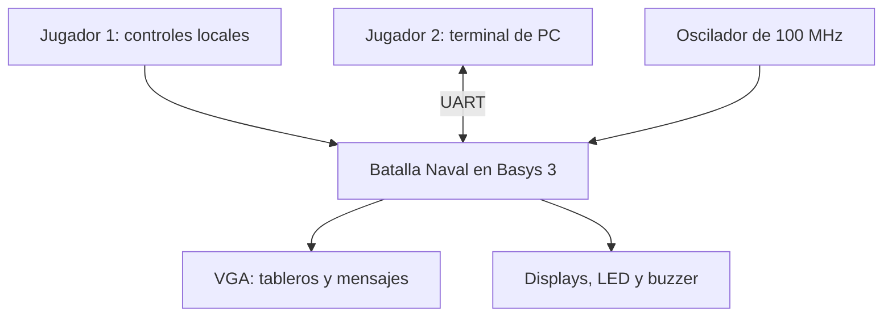
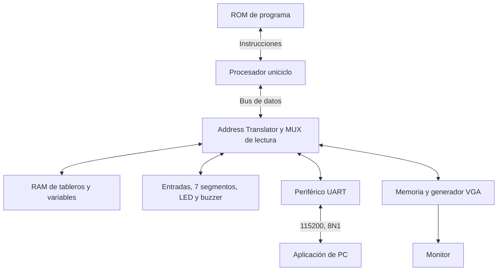
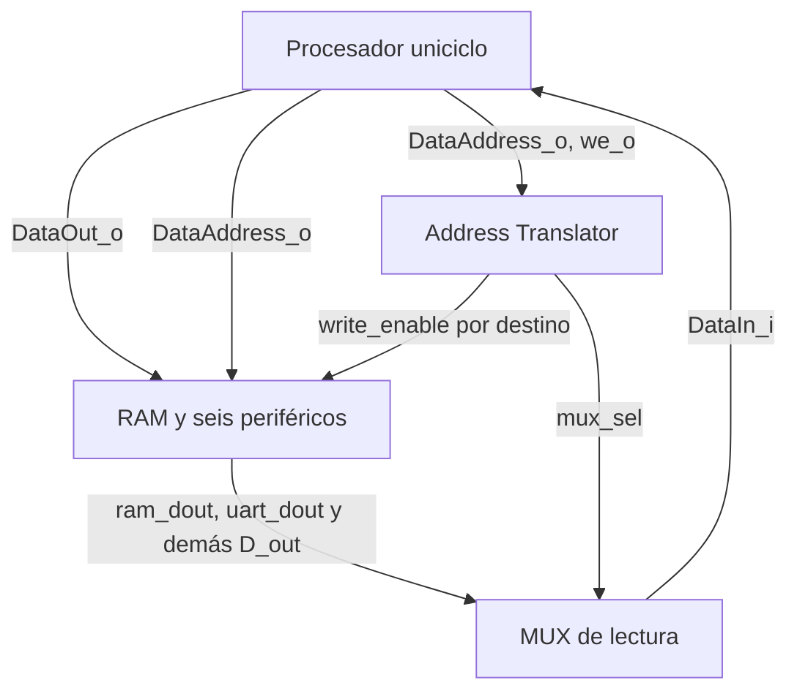
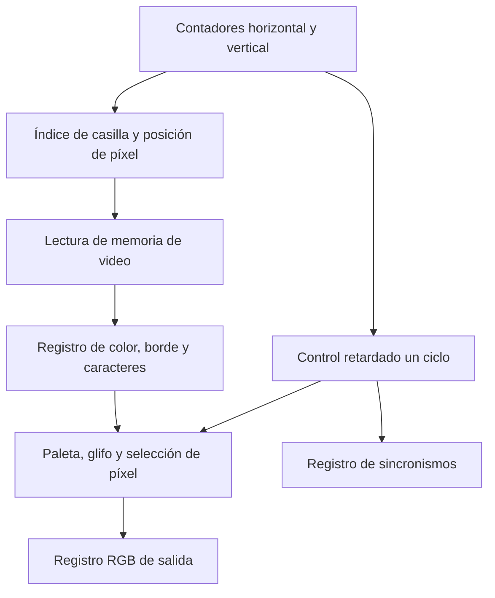
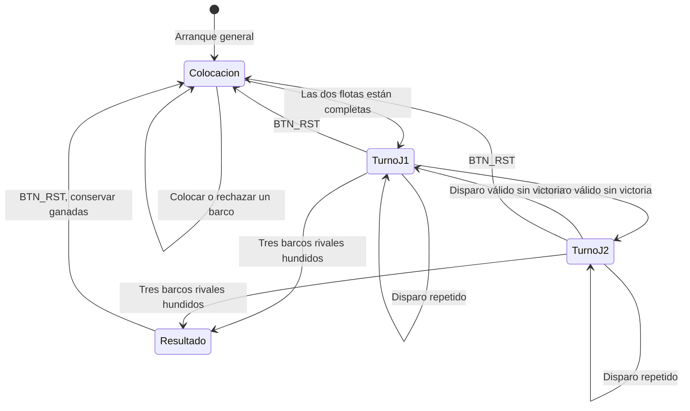
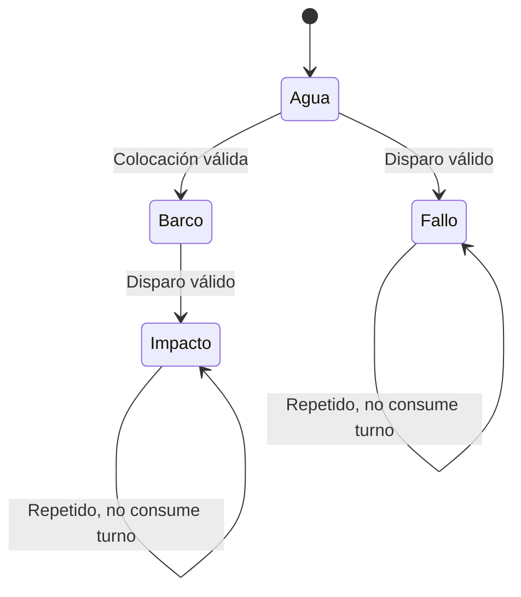
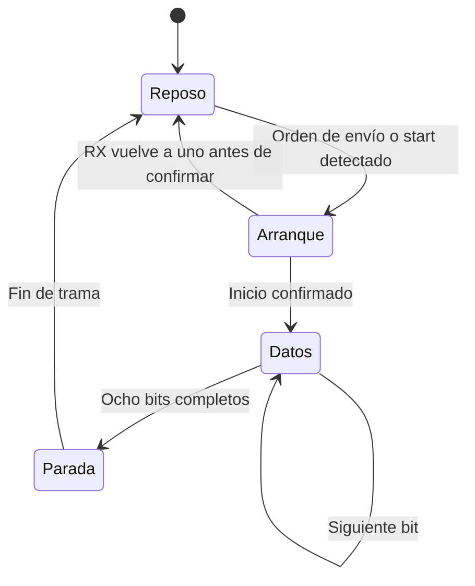

# Informe técnico — Proyecto 3: Batalla Naval sobre RISC-V con VGA y terminal de PC

**Curso:** EL3313 Taller de Diseño Digital, II Semestre 2026  
**Escuela de Ingeniería Electrónica, Tecnológico de Costa Rica**  
**Profesores:** Dr.-Ing. Jeferson González-Gómez, Ing. Rolen Coto Calderón

**Integrantes:**

- Carlos Castro Villegas
- Jefferson Chinchilla Quesada
- Mattio Coghi Quirós
- Nicolás Mena Valerio

**Versión documentada:** rama `develop`, commit `7632127b2e8e7fa0b420b818297c52478b5daad2`.  
**Fecha de revisión:** 7 de octubre de 2026, Costa Rica.

> El informe describe el código de esta versión y los resultados reproducidos durante su revisión.
> Las mediciones físicas y la simulación post-implementación todavía requieren evidencia adicional.
> Los resultados parciales citados en las fichas de diseño se distinguen de las mediciones nuevas.

---

## Tabla de contenidos

1. [Resumen](#1-resumen)
2. [Introducción y objetivos](#2-introducción-y-objetivos)
3. [Fundamentación teórica](#3-fundamentación-teórica)
4. [Enfoque de la solución](#4-enfoque-de-la-solución)
5. [Descripción formal de interfaces de módulos](#5-descripción-formal-de-interfaces-de-módulos)
6. [Periférico VGA](#6-periférico-vga)
7. [Periférico UART y protocolo de aplicación](#7-periférico-uart-y-protocolo-de-aplicación)
8. [Diagramas de estado](#8-diagramas-de-estado)
9. [Estrategia de validación](#9-estrategia-de-validación)
10. [Resultados](#10-resultados)
11. [Análisis de resultados](#11-análisis-de-resultados)
12. [Problemas encontrados y su solución](#12-problemas-encontrados-y-su-solución)
13. [Análisis crítico](#13-análisis-crítico)
14. [Conclusiones y aprendizaje obtenido](#14-conclusiones-y-aprendizaje-obtenido)
15. [Referencias](#15-referencias)

---

## 1. Resumen

Se integró una plataforma de 32 bits en una FPGA Artix-7 de la tarjeta Basys 3 para ejecutar el
juego Batalla Naval de dos jugadores. La plataforma contiene un procesador RISC-V de ciclo único,
una ROM de programa de 8 KiB, una RAM de datos de 4 KiB, un Address Translator, un multiplexor de
lectura y seis periféricos: UART, entradas locales, display de 7 segmentos, LED, buzzer y VGA.
El núcleo del procesador se reutilizó y adaptó de `riscv-simple-sv`, conservando su licencia BSD-3;
la integración, los periféricos y el programa del juego se documentan como trabajo del proyecto.

La lógica de la partida se ejecuta en ensamblador dentro de la FPGA. Cada jugador dispone de un
tablero de 8 × 8 casillas y coloca tres barcos de longitudes 4, 3 y 2. El Jugador 1 usa los controles
de la Basys 3 y un monitor VGA; el Jugador 2 usa una terminal Python conectada por UART a
115 200 baudios. La PC transmite solicitudes y representa las respuestas; la validación de
colocaciones, los disparos, los hundimientos, los turnos y la victoria se resuelven en el programa
RISC-V. Los barcos no descubiertos del oponente permanecen ocultos en ambas interfaces.

Un PLL deriva del oscilador de 100 MHz dos relojes: 33,33 MHz para el procesador y los periféricos
de registros, y 25 MHz para el barrido de video de 640 × 480. El periférico VGA usa una cuadrícula
de 20 × 15 casillas de 32 × 32 píxeles, con color, bordes y texto, en lugar de un framebuffer por
píxel. El programa ocupa 1.264 palabras de instrucción, equivalentes a 5.056 bytes o 61,72 % de la ROM.
Su imagen de máquina coincide con la obtenida al volver a ensamblar la fuente.

Durante la revisión pasan las 18 pruebas unitarias de la PC y 10 de los 14 bancos HDL originales.
Entre estos últimos están las 29 pruebas del procesador y las 82 verificaciones del top, que
ejercitan una partida completa hasta la victoria del Jugador 2 y una nueva partida que conserva
las ganadas. Los otros cuatro bancos pasan después de adaptaciones temporales de sintaxis para
Icarus 12, sin modificar el RTL. El flujo original necesita incorporar esas correcciones.
La sección 10 presenta el alcance de la síntesis y los resultados; el cierre de timing y la
simulación post-implementación no se consideran comprobados por las simulaciones RTL.

---

## 2. Introducción y objetivos

El Proyecto 3 cambia la forma de implementar el control respecto al Ahorcado. En el proyecto
anterior, máquinas de estado y módulos específicos descritos en HDL coordinaban el juego. En
Batalla Naval, el hardware proporciona una plataforma computacional y sus recursos de entrada y
salida, mientras que el comportamiento de la aplicación se expresa mediante instrucciones que
el procesador ejecuta desde la ROM.

Esta separación permite analizar tanto el diseño digital como la relación entre software y
hardware. Un `lw` lee una variable o el estado de un periférico; un `sw` actualiza una variable,
escribe una casilla de video o inicia una transmisión. Las interfaces y los tiempos del hardware
condicionan el programa: las memorias deben responder dentro del ciclo del procesador y la UART
de un solo byte exige atender la recepción con suficiente frecuencia.

**Objetivo general.** Implementar una plataforma RISC-V en la FPGA que ejecute el control completo
de Batalla Naval y coordine un jugador local con otro remoto mediante UART, preservando la
privacidad de sus tableros.

**Objetivos específicos.**

1. Integrar un procesador de 32 bits de ciclo único, con buses independientes de instrucciones y
   datos, capaz de ejecutar el subconjunto requerido por el programa.
2. Implementar la ROM, la RAM y el controlador de mapeo con el mapa de direcciones del instructivo.
3. Diseñar un periférico VGA con barrido autónomo, memoria de casillas y representación de tableros
   y mensajes de estado.
4. Integrar UART, entradas locales, displays, LED y buzzer mediante interfaces de registros.
5. Describir en ensamblador las colocaciones concurrentes, la alternancia de turnos, la validación
   de disparos, los hundimientos, el fin de partida y la conservación de ganadas.
6. Implementar una aplicación de PC y un protocolo de mensajes consistentes con el programa.
7. Verificar por etapas el procesador, los periféricos y el sistema integrado, distinguiendo
   simulación funcional, síntesis, timing y prueba en la tarjeta.

---

## 3. Fundamentación teórica

### 3.1 Arquitectura RISC-V y subconjunto utilizado

RISC-V define instrucciones que operan sobre registros y acceden a memoria mediante cargas y
almacenamientos [2]. La implementación emplea registros y buses de 32 bits, instrucciones de
32 bits y un banco de 32 registros. `x0` devuelve siempre cero. Los registros `a0`–`a4` sirven
como argumentos de las subrutinas del juego; `ra` conserva la dirección de retorno y `sp`
direcciona la pila.

Los campos comunes de una instrucción se extraen así:

| Campo | Bits | Función |
|---|---|---|
| `opcode` | 6:0 | Familia de instrucción |
| `rd` | 11:7 | Registro de destino |
| `funct3` | 14:12 | Variante de la operación |
| `rs1` | 19:15 | Primer operando |
| `rs2` | 24:20 | Segundo operando, cuando corresponde |
| `funct7` | 31:25 | Diferencia operaciones que comparten otros campos |

El programa usa cargas y escrituras de palabra (`lw`, `sw`), operaciones aritméticas y lógicas,
desplazamientos, comparaciones, ramas y saltos. Añade `lui` para construir las bases de RAM y
periféricos. `li`, `mv`, `j`, `ret`, `beqz` y `bnez` son pseudoinstrucciones del ensamblador;
el procesador recibe las instrucciones reales resultantes de su expansión.

El núcleo reutilizado ofrece más operaciones que las que usa el juego [3]. Sin embargo, el
envoltorio de la plataforma no conecta una máscara de bytes: su contrato de acceso a los
periféricos y la RAM es `lw`/`sw` alineados de 32 bits. No se debe extender la afirmación de
compatibilidad del núcleo a escrituras parciales de la plataforma sin completar esa interfaz.

### 3.2 Procesador de ciclo único y camino crítico

En el procesador de ciclo único, una instrucción se resuelve entre dos flancos consecutivos.
Durante ese intervalo se obtiene la instrucción, se decodifica, se leen los operandos, se calcula
el resultado y, cuando corresponde, se accede a la memoria. En el siguiente flanco se actualizan
el PC y el registro de destino.

Para una carga, el presupuesto temporal incluye un camino aproximado de:

$$
T_{clk} \geq T_{PC} + T_{ROM} + T_{decodificación/registros} + T_{ALU}
+ T_{mapeo/memoria/MUX} + T_{setup}
$$

Esta es la razón para usar 33,33 MHz en el sistema, con un período nominal de 30 ns, aunque el
oscilador de entrada sea de 100 MHz. La frecuencia máxima debe obtenerse del diseño implementado;
que un testbench cambie el reloj a una frecuencia determinada no demuestra que el hardware cierre
timing a esa frecuencia.

### 3.3 Memorias separadas y periféricos mapeados

La ROM tiene un camino dedicado para instrucciones y la RAM comparte el bus de datos con los
periféricos. Es una organización con separación de instrucciones y datos en la interfaz del
procesador. La ROM entrega la instrucción en forma combinacional y la RAM combina lectura
asíncrona con escritura síncrona. Esto permite que `lw` termine en el mismo ciclo.

Un periférico mapeado en memoria interpreta una dirección como un registro o una casilla. El
programa no necesita instrucciones especiales de entrada y salida. Por ejemplo:

```asm
lui  s0, 0x10           # base 0x0001_0000
lw   t0, 0x120(s0)      # leer entradas locales
li   t1, 2
sw   t1, 0x138(s0)      # encender el LED de batalla
```

El Address Translator genera habilitaciones de escritura y una selección para el MUX de lectura.
Los datos no atraviesan el AT: `DataOut_o` llega directamente a los destinos y sus datos de retorno
llegan al MUX. Las direcciones no asignadas o no alineadas producen lectura cero y ninguna
habilitación. No se implementa una excepción de bus por acceso inválido.

### 3.4 Generación de relojes con PLL

La primitiva `PLLE2_BASE` recibe 100 MHz, multiplica por 10 y divide la entrada por 1. El VCO queda
en 1.000 MHz; sus divisores de salida son 30 y 40:

$$
f_{VCO}=100\,\text{MHz}\cdot\frac{10}{1}=1.000\,\text{MHz}
$$

$$
f_{sys}=\frac{1.000}{30}\,\text{MHz}=33,333\ldots\,\text{MHz},
\qquad f_{pix}=\frac{1.000}{40}\,\text{MHz}=25\,\text{MHz}
$$

Ambos relojes provienen del mismo PLL. Las salidas pasan por `BUFG`, y el reset del sistema se
mantiene mientras el PLL no esté enganchado. El modelo RTL de simulación sustituye la primitiva
por divisores: conserva los períodos nominales, pero el reloj de sistema no tiene un ciclo de
trabajo del 50 %. Ese modelo no representa jitter, tiempos internos ni el comportamiento analógico
del PLL y no sustituye un modelo de primitivas en la simulación post-implementación.

### 3.5 Temporización VGA

El video visible ocupa 640 × 480 píxeles. Cada línea incluye área visible, front porch, sincronismo
y back porch; lo mismo sucede con las líneas de cada cuadro [4].

| Intervalo | Horizontal, píxeles | Vertical, líneas |
|---|---:|---:|
| Visible | 640 | 480 |
| Front porch | 16 | 10 |
| Sincronismo | 96 | 2 |
| Back porch | 48 | 33 |
| Total | 800 | 525 |

Con un reloj de 25 MHz:

$$
T_{pix}=40\,\text{ns},\qquad
T_{línea}=800\cdot40\,\text{ns}=32\,\mu\text{s}
$$

$$
T_{cuadro}=525\cdot32\,\mu\text{s}=16,8\,\text{ms},\qquad
f_{cuadro}=59,5238\,\text{Hz}
$$

Los sincronismos tienen polaridad negativa: el horizontal permanece bajo 3,84 µs por línea y el
vertical permanece bajo 64 µs por cuadro. Los RGB se fuerzan a negro fuera del área visible.
El cálculo corresponde a 25 MHz; no debe confundirse con el modo que usa 25,175 MHz y aproximadamente
59,94 Hz.

### 3.6 Gráficos por casillas y fuente de caracteres

Un framebuffer RGB de 12 bits para todos los píxeles requeriría:

$$
640\cdot480\cdot12=3.686.400\,\text{bits}=460.800\,\text{bytes}
$$

El diseño utiliza 300 casillas visibles de 32 bits, equivalentes a 1.200 bytes, dentro de una
memoria de 512 palabras o 2.048 bytes. El barrido calcula el índice de casilla a partir de los
contadores; sus bits inferiores indican la posición del píxel dentro de ella. La cuadrícula
representa fondos, barcos, impactos, fallos, cursores y mensajes sin almacenar cada píxel.

La fuente `fuente_caracteres` entrega filas de glifos de 5 × 7. Cada punto se amplía a 2 × 2
píxeles; una casilla puede contener dos caracteres o un carácter centrado. La representación de
texto pertenece al periférico; el contenido de los mensajes y las reglas que deciden cuándo
mostrarlos pertenecen al programa.

### 3.7 Comunicación UART

La UART utiliza tramas 8N1: un bit de arranque en cero, ocho bits LSB primero, sin paridad y un bit
de parada en uno. La línea permanece alta en reposo. Un byte tarda idealmente:

$$
T_{byte}=\frac{10}{115.200}=86,806\,\mu\text{s}
$$

Los divisores se redondean al entero más cercano. Para el sistema:

$$
N_{TX}=\operatorname{round}\left(\frac{33.333.333}{115.200}\right)=289
$$

$$
N_{RX}=\operatorname{round}\left(\frac{33.333.333}{16\cdot115.200}\right)=18
$$

El baudaje efectivo de TX es aproximadamente 115.340,25 baudios, un error de +0,122 %; el ritmo
equivalente de RX es 115.740,74 baudios, un error de +0,469 %. El receptor usa el sobremuestreo para
ubicar el punto de lectura dentro de cada bit. Esto no elimina la necesidad de sincronizar la
entrada asíncrona; la versión revisada aún entrega el pin crudo al núcleo RX.

### 3.8 Sincronización y antirrebote de entradas

Un pulsador puede producir varias transiciones al presionarse. Detectar un flanco en software
evita repetir una acción cuando el nivel permanece alto, pero no filtra una secuencia
`0 → 1 → 0 → 1` causada por rebote. También existe una diferencia entre registrar una entrada para
cortar un camino combinacional y sincronizarla con dos etapas para reducir la propagación de
metaestabilidad.

El periférico actual usa una sola etapa de registro y no implementa antirrebote. Esta es una
limitación concreta de la interfaz local, no una propiedad ya resuelta. Una mejora compatible con
el bus consiste en dos flip-flops por entrada y un filtro de estabilidad de, por ejemplo, 10 ms.
A 33,33 MHz ese intervalo requiere aproximadamente 333.333 ciclos; el software puede conservar
su detector de flancos sobre el valor filtrado.

### 3.9 Multiplexado de displays y generación de sonido

Los cuatro dígitos de 7 segmentos comparten las líneas de segmentos y activan un ánodo a la vez.
Con el contador de refresco de 18 bits:

$$
f_{refresco}=\frac{33.333.333}{2^{18}}\approx127,16\,\text{Hz}
$$

Cada dígito permanece seleccionado aproximadamente 1,966 ms. El registro del display recibe
cuatro nibbles BCD y cuatro bits de punto decimal. El programa conserva las ganadas de cada
jugador en dos dígitos y hace el retorno de 99 a 00.

El buzzer pasivo recibe una onda cuadrada. Para una nota de frecuencia $f$, el generador conmuta
la salida cada $N+1$ ciclos:

$$
N=\left\lfloor\frac{f_{sys}}{2f}\right\rfloor-1
$$

El secuenciador selecciona notas y duraciones, en unidades nominales de 50 ms, para distinguir
impacto, fallo, hundimiento, colocación inválida y victoria. Ese secuenciador no decide qué ocurrió
en la partida; reproduce el código de sonido escrito por el programa.

### 3.10 Diseño combinacional sin latches

Los multiplexores y decodificadores deben definir una salida en todos los caminos de ejecución.
Los valores por defecto y las ramas `default` evitan retener accidentalmente el resultado
anterior. La revisión debe complementar la lectura del RTL con el resultado de `proc` y la
estadística de celdas de síntesis. Una RAM o un registro explícito es almacenamiento intencional;
no es un latch accidental.

---

## 4. Enfoque de la solución

### 4.1 Arquitectura *top-down*

El planteamiento mantiene los niveles de sistema, bloques funcionales, interconexión e interior de
los módulos. Los documentos detallados están en [`docs/diseño/diagramas/`](../diseño/diagramas/) y
[`docs/diseño/modulos/`](../diseño/modulos/). Los diagramas de este informe resumen la integración
observada en [`top.sv`](../../src/design/top.sv).

**Nivel 1: sistema y jugadores.** El jugador local obtiene información mediante VGA e indicadores;
el remoto intercambia solicitudes y resultados mediante UART. La FPGA conserva el estado válido
de la partida.



**Nivel 2: plataforma computacional.** La ROM está fuera del bus de datos. El bloque de mapeo
agrupa únicamente la decodificación y el MUX de retorno; no contiene reglas de juego.



**Nivel 3: control del bus y retorno de datos.** El procesador se representa como bloque externo;
su descripción interna pertenece a la ficha del núcleo.



En `top.sv`, `clk_sys` llega al núcleo, la RAM y los periféricos; `clk_pix` llega al barrido VGA.
UART y buzzer reciben `CLK_FREQ_HZ = 33_333_333`. El top adapta los índices de registro:

- UART usa `data_address[3:2]` para CONTROL, TX y RX.
- Entradas, display, LED y buzzer reciben `addr_i = 00`, porque tienen un solo registro.
- VGA usa `data_address[10:2]` para las 512 palabras de su ventana.
- RAM usa internamente `addr_i[11:2]`; ROM usa `addr_i[12:2]`.

### 4.2 Decisiones de diseño y su justificación

| # | Decisión | Justificación y alcance |
|---|---|---|
| D1 | Control del juego en ensamblador. | Cumple la separación requerida: hardware para E/S y programa para reglas. |
| D2 | Núcleo uniciclo reutilizado y adaptado. | Proporciona una base modular y pruebas de instrucciones; se declara su procedencia y licencia. |
| D3 | Buses separados de instrucciones y datos. | La búsqueda de una instrucción no comparte el puerto de la RAM de datos. |
| D4 | Lecturas combinacionales en ROM y RAM. | Permiten ejecutar cargas en un ciclo; restringen el uso directo de BRAM síncrona. |
| D5 | Reloj de sistema de 33,33 MHz. | Da un período de 30 ns frente al camino largo del uniciclo y conserva divisores UART adecuados. |
| D6 | Reloj de píxel de 25 MHz. | Produce barrido nominal de 59,52 Hz con 800 × 525 posiciones. |
| D7 | AT separado del MUX de lectura. | Mantiene el AT como lógica de selección y permite verificar el retorno con valores conocidos. |
| D8 | Solo palabras alineadas de 32 bits. | Coincide con `lw` y `sw` utilizados por el programa y con la interfaz sin máscara de bytes. |
| D9 | VGA por casillas con color, borde y texto. | Reduce almacenamiento y escrituras respecto a un framebuffer por píxel. |
| D10 | Una sola fuente de estado de partida en RAM. | VGA y PC representan ese estado; no deciden independientemente impactos o victoria. |
| D11 | Un mensaje pendiente en la PC. | Simplifica la asociación solicitud/respuesta, aunque requiere mejorar recuperación tras pérdida. |
| D12 | Pausa de 1 ms entre bytes PC → FPGA. | Da margen al receptor de un solo byte y al lazo de sondeo del programa. |
| D13 | Ganadas almacenadas en BCD. | La salida al display no necesita conversión binario-decimal. |
| D14 | Reinicio de partida atendido en software. | Conserva las ganadas, mientras la reconfiguración general vuelve a inicializar el sistema. |
| D15 | Sonidos seleccionados por código. | El programa decide el evento y el periférico ejecuta su melodía sin bloquear el juego. |

### 4.3 Codificación de estado y organización de la RAM

La fase se almacena en `FASE`: 0 = colocación, 1 = batalla, 2 = resultado. El turno vale
0 = Jugador 1 y 1 = Jugador 2. Los códigos de fase internos no son iguales a todos los subtipos
del mensaje UART `Estado`; estos últimos se documentan en la sección 7.

Cada casilla ocupa una palabra. Los bits 1:0 codifican agua, barco, impacto o fallo; los bits 3:2
conservan el identificador del barco, cuando corresponde. El bit 1 permite detectar si una casilla
ya recibió un disparo. El programa guarda por separado el número de impactos de cada barco.

| Variable | Dirección absoluta | Extensión / función |
|---|---|---|
| `TABLERO_J1` | `0x0000_2000`–`0x0000_20FC` | 64 palabras |
| `TABLERO_J2` | `0x0000_2100`–`0x0000_21FC` | 64 palabras |
| `FASE`, `TURNO` | `0x0000_2200`, `0x0000_2204` | Una palabra cada una |
| `COLOCADOS_J1`, `COLOCADOS_J2` | `0x0000_2208`, `0x0000_220C` | Cantidad local y máscara remota |
| Cursor, orientación y entradas previas | `0x0000_2210`–`0x0000_221C` | Cuatro palabras |
| `IMPACTOS_J1`, `IMPACTOS_J2` | `0x0000_2220`–`0x0000_2234` | Tres contadores por flota |
| Disparos y hundidos por jugador | `0x0000_2238`–`0x0000_2244` | Cuatro palabras |
| `GANADAS_BCD` | `0x0000_2248` | J1 en bits 15:8, J2 en 7:0 |
| `RX_INDICE` | `0x0000_224C` | Estado del armado de trama |
| `RX_TRAMA` | `0x0000_2250`–`0x0000_2260` | Cinco bytes guardados en cinco palabras |
| Pila | Desde `0x0000_3000`, hacia abajo | `sp` inicial apunta un byte después de la RAM |

Las variables ocupan 612 bytes desde `0x2000`; la pila usa la parte superior de la RAM. La rutina
`NUEVA_PARTIDA` limpia ese bloque de variables y restaura las ganadas. La RAM no tiene reset de
borrado global: el programa inicializa las posiciones que necesita.

### 4.4 Asignación de pines y controles

La fuente de la asignación es [`basys3.xdc`](../../src/fpga/basys3.xdc). Todos los puertos usan
`LVCMOS33`. Los nombres `btn_ok` y `btn_rst` corresponden en esta integración a interruptores,
porque los cinco pulsadores se destinan a las direcciones y la rotación.

| Función | Puerto / bits | Pin / recurso físico |
|---|---|---|
| Reloj | `clk` | W5, oscilador de 100 MHz |
| Arriba, abajo, izquierda, derecha | `btn_arriba`, `btn_abajo`, `btn_izq`, `btn_der` | T18, U17, W19, T17; btnU/D/L/R |
| Rotación | `btn_sel` | U18, btnC |
| Confirmar | `btn_ok` | V17, SW0; acción en subida |
| Nueva partida | `btn_rst` | R2, SW15; subir y volver a bajar |
| UART RX / TX | `rx_i`, `tx_o` | B18 / A18, puente USB-UART |
| VGA rojo, bits 0–3 | `vga_r_o` | G19, H19, J19, N19 |
| VGA verde, bits 0–3 | `vga_g_o` | J17, H17, G17, D17 |
| VGA azul, bits 0–3 | `vga_b_o` | N18, L18, K18, J18 |
| Sincronismos | `vga_hsync_o`, `vga_vsync_o` | P19 / R19 |
| Segmentos, bits 0–6 | `seg` | W7, W6, U8, V8, U5, V5, U7 |
| Ánodos, bits 0–3 | `an` | U2, U4, V4, W4 |
| Punto decimal | `dp` | V7 |
| Colocación, batalla, resultado | `led[2:0]` | U16, E19, U19; LD0/LD1/LD2 |
| Buzzer | `buzzer` | P18, JC4 |

PROG es el reinicio general por reconfiguración. Para volver a cargar automáticamente después de
PROG, el bitstream debe estar en flash y la tarjeta configurada para arrancar desde ella. El reset
interno `rst` se libera después de sincronizar `~locked` en `clk_sys`.

Los pines de reloj, controles, indicadores, UART, VGA y JC4 fueron contrastados con el archivo
oficial de Digilent para Basys 3 rev. B [11]. Las 40 asignaciones físicas comparadas coinciden.
Esto verifica la correspondencia de pines; la calidad de imagen y la temporización físicas
requieren además la prueba en tarjeta.

---

## 5. Descripción formal de interfaces de módulos

### 5.1 `top` y `generador_relojes`

`top` conecta los bloques de plataforma; no contiene una FSM de reglas del juego. Su parámetro
`ARCHIVO_HEX` selecciona el archivo de programa. En síntesis se usa `sw/programa.hex`; los
testbenches ajustan la ruta al directorio desde el cual ejecutan `vvp`.

| Módulo | Entradas | Salidas / relación |
|---|---|---|
| `top` | `clk`, siete controles locales, `rx_i` | `tx_o`, RGB y sincronismos VGA, `seg`, `an`, `dp`, `led[2:0]`, `buzzer` |
| `generador_relojes` | `clk_i` | `clk_sys_o`, `clk_pix_o`, `locked_o` |

El reset del sistema se sincroniza en dos flip-flops inicializados en uno. El periférico VGA
sincroniza nuevamente `rst_i` al dominio de píxel antes de reiniciar sus contadores.

### 5.2 `procesador_uniciclo`, ROM y RAM

| Puerto del procesador | Dirección | Ancho | Función |
|---|---|---:|---|
| `clk_i`, `rst_i` | Entrada | 1 | Reloj y reset síncrono |
| `ProgAddress_o` | Salida | 32 | Dirección de instrucción, PC en bytes |
| `ProgIn_i` | Entrada | 32 | Instrucción combinacional de ROM |
| `DataAddress_o` | Salida | 32 | Dirección de datos en bytes |
| `DataOut_o` | Salida | 32 | Dato a escribir |
| `DataIn_i` | Entrada | 32 | Dato elegido por el MUX de lectura |
| `we_o` | Salida | 1 | Habilitación de escritura del procesador |

`procesador_uniciclo` es un envoltorio de `riscv_core`. El banco, ALU, control e inmediatos
pertenecen al núcleo reutilizado. El vector de reset se fija en `0x0000_0000` y la extensión M
permanece desactivada.

| Memoria | Entradas | Salida | Organización |
|---|---|---|---|
| `rom` | `addr_i[31:0]` | `instr_o[31:0]` | 2.048 × 32; lectura combinacional; carga con `$readmemh` |
| `ram` | `clk_i`, `write_enable_i`, `addr_i[31:0]`, `wdata_i[31:0]` | `rdata_o[31:0]` | 1.024 × 32; escritura al flanco y lectura combinacional |

La ROM ignora bits altos fuera de su índice; no detecta por sí misma un PC fuera del rango. Las
palabras no suministradas por el `.hex` quedan sin inicializar en simulación. El programa debe
mantener sus saltos dentro de la imagen válida.

### 5.3 `address_translator` y `mux_lectura`

| Módulo | Entradas | Salidas |
|---|---|---|
| `address_translator` | `address_i[31:0]`, `write_enable_i` | `ram_we`, `uart_we`, `gpio_we`, `display_we`, `led_we`, `buzzer_we`, `vga_we`, `mux_sel[2:0]` |
| `mux_lectura` | `mux_sel[2:0]`, siete buses `*_dout[31:0]` | `rdata_o[31:0]` hacia `DataIn_i` |

**Mapa de direcciones y selección.**

| Destino | Dirección / ventana | `mux_sel` | Escritura |
|---|---|---|---|
| RAM | `0x0000_2000`–`0x0000_2FFF`, palabras alineadas | `000` | `ram_we = we` |
| UART | `0x0001_0040`, `0x0001_0044`, `0x0001_0048` | `001` | `uart_we = we` |
| Entradas | `0x0001_0120` | `010` | `gpio_we = 0`, solo lectura |
| Display | `0x0001_0130` | `011` | `display_we = we` |
| LED | `0x0001_0138` | `100` | `led_we = we` |
| Buzzer | `0x0001_0140` | `101` | `buzzer_we = we` |
| VGA | `0x0001_1000`–`0x0001_17FF`, palabras alineadas | `110` | `vga_we = we` |
| No asignada / no alineada | Resto | `111` | Todas en cero; lectura cero |

**Tabla de control.** El vector se ordena como `{vga, buzzer, led, display, gpio, uart, ram}`.

| Dirección seleccionada | `we=0`: vector de escritura | `we=1`: vector de escritura | Selección de lectura |
|---|---|---|---|
| RAM | `0000000` | `0000001` | `000` |
| UART | `0000000` | `0000010` | `001` |
| Entradas | `0000000` | `0000000` | `010` |
| Display | `0000000` | `0001000` | `011` |
| LED | `0000000` | `0010000` | `100` |
| Buzzer | `0000000` | `0100000` | `101` |
| VGA | `0000000` | `1000000` | `110` |
| Inválida | `0000000` | `0000000` | `111` |

La selección de lectura depende de la dirección y no de `we`. No existe `read_enable_i` en este
bus de plataforma. Los periféricos de un solo registro reciben índice cero explícito: derivarlo
indiscriminadamente de `DataAddress_o[3:2]` daría un índice incorrecto para LED en `0x138`.

### 5.4 Interfaz común de periféricos

| Señal | Dirección | Función |
|---|---|---|
| `clk_i` | Entrada | Reloj de sistema |
| `rst_i` | Entrada | Reset síncrono, con alcance propio por bloque |
| `write_enable_i` | Entrada | Selección de escritura generada por AT |
| `addr_i` | Entrada | Índice de registro, normalmente 2 bits; VGA usa 9 |
| `wdata_i[31:0]` | Entrada | Datos del procesador |
| `rdata_o[31:0]` | Salida | Lectura combinacional |

UART y VGA se desarrollan en las secciones 6 y 7. Los otros periféricos exponen:

| Periférico | Campo | Acceso | Salida física / comportamiento |
|---|---|---|---|
| Entradas | bits 6:0: arriba, abajo, izquierda, derecha, selección, confirmar, reiniciar | RO | Valor registrado de los siete controles; bits altos en cero |
| 7 segmentos | bits 15:0: cuatro nibbles BCD; 19:16: puntos | RW | `seg_o[6:0]`, `an_o[3:0]`, `dp_o`, activos en bajo |
| LED | bits 2:0 | RW | `leds_o[2:0]`, sin decodificar; software escribe one-hot |
| Buzzer | bits 2:0: código de sonido | RW, limpieza automática al terminar | `buzzer_o`, secuencia de notas |

Las direcciones internas 01, 10 y 11 de estos bloques devuelven cero. Las escrituras del
periférico de entradas no modifican el estado de los pines.

### 5.5 Secuenciador, generador de tono y marcador

| Módulo | Entradas principales | Salidas | Función |
|---|---|---|---|
| `secuenciador_melodia` | `clk`, `rst`, `i_iniciar`, `i_sonido[2:0]` | `o_n[17:0]`, `o_sonar`, `o_fin` | Nota, duración y fin de la melodía |
| `generador_tono` | `clk`, `rst`, `i_n`, `i_sonar` | `o_sound` | Onda cuadrada de la nota |
| `marcador` | `clk`, `rst`, `i_digitos[15:0]`, `i_puntos[3:0]` | `o_seg`, `o_an`, `o_dp` | Multiplexado y decodificación BCD |
| `fuente_caracteres` | `codigo_i[5:0]`, `fila_i[2:0]` | `bits_o[4:0]` | Fila de un glifo 5 × 7 |

El sonido escrito reinicia el secuenciador y puede reemplazar una melodía en curso. Los códigos
0, 6 y 7 no producen una melodía válida. Los nibbles del display mayores que 9 apagan el dígito.

### 5.6 Programa y aplicación de PC

El contrato del programa está expresado por las direcciones, los campos y el protocolo. Las
subrutinas principales son:

| Rutina | Entradas / resultado | Responsabilidad |
|---|---|---|
| `LEER_BOTONES` | Devuelve flancos en `a0` | `actual & ~anterior`; no hace antirrebote |
| `UART_ATENDER` | Devuelve tipo, D1 y D2 en `a0`–`a2` | Consume hasta un byte y completa/valida la trama |
| `VALIDAR_COLOCACION` | Jugador, id, fila, columna, orientación | Rechaza fuera del tablero y traslape |
| `COLOCAR_BARCO` | Misma descripción ya validada | Escribe las casillas e id en RAM |
| `PROCESAR_DISPARO` | Dueño del tablero, fila, columna | Impacto, agua, hundido o repetido |
| `PINTAR_CASILLA` | Tablero y coordenadas | Escribe VGA ocultando barcos intactos de J2 |
| `SUMAR_GANADA` | Ganador | Incrementa BCD y actualiza display |
| `NUEVA_PARTIDA` | Estado previo de ganadas | Limpia variables y reconstruye vista conservando el marcador |

La aplicación separa transporte (`enlace.py`), mensajes (`protocolo.py`), estado de representación
(`partida.py`), dibujo (`vista.py`, `dibujo.py`) y entrada de terminal (`terminal.py`). `batalla_pc.py`
los coordina con `select`. Las flechas o `hjkl` mueven el cursor, `r` rota y Enter confirma.
Esta versión depende de terminal POSIX y no funciona directamente en Windows nativo por su uso
de `termios` y del sondeo del descriptor serial [6].

---

## 6. Periférico VGA

### 6.1 Mapa de memoria de video

El rango del periférico es `0x0001_1000`–`0x0001_17FF`. Contiene 512 palabras de 32 bits; la
cuadrícula visible usa índices 0–299. El resto es direccionable por el procesador, aunque el
barrido visible no lo utiliza. La última palabra visible comienza en `0x0001_14AC`.

$$
\text{dirección}=0x0001\_1000+4\cdot(20\cdot fila+columna)
$$

| Bits de una palabra | Campo | Función |
|---|---|---|
| 2:0 | Color | Índice de la paleta |
| 3 | Borde | Contorno negro en los límites de la casilla |
| 9:4 | Carácter izquierdo | Código ASCII menos 32 |
| 15:10 | Carácter derecho | Segundo carácter |
| 16 | Centrado | Usa solo el carácter izquierdo, centrado |
| 31:17 | Sin función gráfica | Se almacenan y leen, pero no participan del renderizado |

| Código | Uso | RGB de 12 bits |
|---|---|---|
| `000` | Agua | `04A` |
| `001` | Barco propio | `888` |
| `010` | Impacto | `F00` |
| `011` | Fallo | `FFF` |
| `100` | Cursor | `FF0` |
| `101` | Fondo / separadores | `000` |
| `110` | Indicador J1 | `0F0` |
| `111` | Indicador J2 | `F0F` |

### 6.2 Ubicación de los tableros y mensajes

Los tableros usan filas de pantalla 4–11. J1 usa columnas 1–8 y el estado conocido del tablero de
J2 usa columnas 11–18. Sus coordenadas gráficas se calculan como:

$$
fila_{pantalla}=4+fila_{juego},\qquad
columna_{pantalla}=1+10\cdot jugador+columna_{juego}
$$

La fila 1 contiene títulos; la 2, colocación, turno o ganador; la 3, letras A–H. Los números de
fila aparecen en las columnas 0 y 10. La fila 12 explica la acción del jugador y la fila 13 muestra
las ganadas. Las filas 0 y 14 quedan vacías para dar margen a monitores que recortan el borde.

El cursor de colocación muestra el largo y la orientación del barco; el de batalla marca una
casilla rival. La rutina de pintado convierte un barco intacto de J2 en agua antes de escribir
la memoria gráfica. Por ello, la privacidad se implementa en el programa y no en una paleta que
reciba información secreta.

### 6.3 Barrido y alineación de señales



La lectura de video se registra en el primer ciclo. `video_on`, sincronismos, contorno y posición
dentro de la casilla se retrasan lo mismo. El segundo ciclo registra RGB y sincronismos de salida.
La latencia es de dos ciclos de píxel para ambos caminos. Mantener esa igualdad evita desplazar
el color respecto al sincronismo o el borde respecto a su casilla.

En la selección del píxel, el blanking tiene prioridad, seguido del borde, del texto y del color
de fondo. El texto es negro sobre los fondos claros seleccionados y blanco sobre el resto.
Dos bordes de casillas adyacentes forman una línea de dos píxeles.

### 6.4 Escritura y lectura en dos dominios

El procesador escribe con `clk_sys` y el barrido lee y registra con `clk_pix`. La memoria se
describe con un puerto de escritura y dos caminos de lectura. Se evita borrar todas las palabras
por reset para conservar una implementación de memoria distribuida; la configuración establece
ceros y el programa construye la pantalla que corresponde a la partida.

Los relojes relacionados no garantizan por sí mismos atomicidad de una palabra que se modifica
mientras se lee. Una coincidencia de acceso puede producir un artefacto visual transitorio. La
RAM del juego mantiene el estado verdadero, pero es necesario analizar el camino entre la
escritura y la captura de video en la implementación. Declararlo falso camino sin ese análisis
no demuestra que el cruce sea correcto. La sección 13 propone escritura en blanking o doble
buffer si se necesita asegurar actualizaciones visuales coherentes.

### 6.5 Uso desde ensamblador

```asm
lui  s1, 0x11           # base de la memoria de video
li   t0, 10             # impacto: color 2 más borde 8
sw   t0, 324(s1)        # índice 81: fila 4, columna 1
```

Este ejemplo pinta la casilla (0,0) del tablero de J1 como impacto con borde. El programa escribe
la información gráfica y vuelve al lazo; el periférico sigue generando el video sin que la CPU
tenga que temporizar cada píxel.

---

## 7. Periférico UART y protocolo de aplicación

### 7.1 Mapa de registros

| Dirección absoluta | `addr_i` | Registro | Campo / acceso |
|---|---|---|---|
| `0x0001_0040` | `00` | CONTROL | bit 0 `send`; bit 1 `new_rx` |
| `0x0001_0044` | `01` | DATOS_TX | Byte en bits 7:0, RW |
| `0x0001_0048` | `10` | DATOS_RX | Último byte en bits 7:0, RW con prioridad de recepción |
| Sin dirección externa asignada | `11` | No utilizado | Lectura cero |

`send` es una orden sostenida: escribir uno inicia una transmisión y el periférico la limpia
cuando el núcleo indica fin. Escribir cero no cancela la transmisión en curso. Esto resuelve la
ventana de rearme en la que el transmisor puede perder pulsos cortos. `new_rx` se activa al
recibir un byte y el programa lo limpia mediante escritura del control. Una recepción concurrente
tiene prioridad sobre esa escritura.

La UART solo guarda un byte RX. No tiene FIFO, registro de overrun ni cola de eventos. Un segundo
byte puede reemplazar al anterior si el programa aún no lo consumió. El tiempo entre bytes forma
parte del contrato de transporte de esta implementación.

### 7.2 Formato de mensajes de aplicación

Todas las tramas contienen cinco bytes:

$$
[\,0xAA,\ TIPO,\ D1,\ D2,\ TIPO\oplus D1\oplus D2\,]
$$

| Dirección | Tipo | Nombre | D1 | D2 |
|---|---|---|---|---|
| PC → FPGA | `10` | Colocar | bit 7: vertical; bits 1:0: id 0–2 | Fila en nibble alto, columna en bajo |
| PC → FPGA | `11` | Disparo | Fila en nibble alto, columna en bajo | Cero |
| FPGA → PC | `20` | Estado | Subtipo | Dato del subtipo |
| FPGA → PC | `21` | Resultado de colocación | Id del barco | Código de colocación |
| FPGA → PC | `22` | Disparo dado por J2 | Coordenadas | Código de disparo |
| FPGA → PC | `23` | Disparo recibido por J2 | Coordenadas | Código de disparo |
| FPGA → PC | `24` | Resumen de disparos | Disparos de J1 | Disparos de J2 |
| FPGA → PC | `25` | Resumen de hundidos | Barcos hundidos por J1 | Barcos hundidos por J2 |

Los valores de la tabla se expresan en hexadecimal. Las coordenadas internas van de 0 a 7; la
vista las presenta como columnas A–H y filas 1–8. Los códigos de jugador son 0 para J1 y 1 para J2.

| Subtipo de Estado | Valor | D2 |
|---|---:|---|
| Inicio de colocación | 0 | 0 |
| Inicio de batalla | 1 | 0 |
| Turno activo | 2 | Jugador 0 / 1 |
| Fin de partida | 3 | Ganador 0 / 1 |

| Código | Colocación | Disparo |
|---:|---|---|
| 0 | Válida | Impacto |
| 1 | Traslape | Fallo / agua |
| 2 | Fuera del tablero | Hundido |
| 3 | Id ya colocado | Casilla ya disparada |

El programa valida checksum, tipo, coordenadas, id y bits reservados antes de aceptar una orden
remota. Un mensaje completo fuera de la fase o turno permitido se descarta. Un disparo repetido
no consume turno; el repetido remoto recibe respuesta para que la terminal pueda solicitar otro.

### 7.3 Recepción, sondeo y pausas

`UART_ATENDER` atiende como máximo un byte por llamada y acumula cinco posiciones en RAM. Un
`0xAA` reinicia el armado desde cualquier punto. En el dominio actual de datos válidos no se
necesita transportar un `0xAA` como carga útil; una extensión del protocolo debería revisar esa
regla o agregar escape.

En la PC, `enlace.mandar` escribe cada byte, ejecuta `flush` y deja una pausa de 1 ms [5]. La
documentación del programa estima una vuelta larga sin atender RX de unos 111 µs, mayor que los
86,8 µs de un byte continuo. La pausa compensa esta limitación en el envío normal de la aplicación;
no convierte al periférico en un receptor capaz de sostener un flujo continuo sin pérdidas.

El banco del top utiliza pausas de 20 µs después de cada byte y las operaciones concretas de su
escenario. Ese resultado no prueba que toda secuencia de actividad local admita ese margen menor.
La prueba de estrés debe cubrir recepción durante repintados y durante respuestas bloqueantes.

### 7.4 Asociación de solicitud y respuesta

La PC conserva una solicitud pendiente con tipo, datos e instante. Antes de recibir respuesta no
envía otra confirmación. El plazo de espera es de 2 s. Una colocación válida dibuja las coordenadas
de esa solicitud y avanza al siguiente barco; un rechazo mantiene el id por colocar.

La recuperación actual presenta un caso problemático: al vencer el plazo se elimina la solicitud;
si el usuario cambia la posición y reintenta el mismo id, la FPGA puede devolver “ya colocado”
porque guardó la primera posición. La PC trata ese código como aceptación de la segunda posición.
Por ello, la confirmación repetida no es idempotente en toda la conversación. Se requiere
conservar la operación original o incluir en la respuesta la colocación confirmada y un
identificador de transacción. Este punto queda abierto en la versión revisada.

### 7.5 Ejemplo de intercambio

```text
FPGA → PC   AA 20 00 00 20   Inicio de colocación
PC → FPGA   AA 10 00 00 10   Barco 0 horizontal en A1
FPGA → PC   AA 21 00 00 21   Colocación aceptada
...
FPGA → PC   AA 20 01 00 21   Inicio de batalla
FPGA → PC   AA 20 02 00 22   Turno del Jugador 1
FPGA → PC   AA 23 10 01 32   J1 disparó a A2 y falló
FPGA → PC   AA 20 02 01 23   Turno del Jugador 2
PC → FPGA   AA 11 01 00 10   J2 dispara a B1
FPGA → PC   AA 22 01 00 23   J2 obtuvo impacto en B1
```

No se transmite el tablero secreto de J1. La PC conserva su propio tablero a partir de sus
colocaciones confirmadas y el tablero rival a partir de resultados de disparos. El chequeo XOR
permite detectar algunas corrupciones, pero no reemplaza un CRC ni detecta todas las combinaciones
de errores de bits.

---

## 8. Diagramas de estado

### 8.1 Fases del programa de juego

El diagrama representa estados del software; no una FSM principal implementada en HDL.



Durante colocación, cada vuelta atiende entradas locales y una posible trama remota. J1 coloca
en orden de id y conserva una cantidad; J2 conserva una máscara. La batalla inicia cuando J1
tiene cantidad 3 y J2 máscara `111`. J1 siempre toma el primer turno.

### 8.2 Estado de una casilla



El hundimiento no es un quinto estado de casilla. Se detecta cuando el número de impactos del id
llega a su longitud. El evento incrementa los hundidos del tirador; el tercero produce victoria.

### 8.3 Máquinas de estado UART de bajo nivel



TX y RX tienen estados con estos nombres, pero temporizaciones distintas. TX cuenta ciclos por
bit; RX cuenta ticks de sobremuestreo y valida que el arranque se mantenga bajo antes de pasar a
datos. En el RTL actual el estado PARADA de RX espera el intervalo y publica el byte sin verificar
que el pin esté alto; no se reporta framing error.

### 8.4 Decodificación de tramas y sonido

El decodificador de aplicación conserva un índice. Sin cabecera descarta bytes; con cabecera
acumula hasta la quinta posición, verifica y vuelve a espera. La misma regla se implementa en
`UART_ATENDER` y `Decodificador` de Python. El programa consume mensajes completos únicamente
donde su fase y turno lo permiten.

El secuenciador de melodía conserva `paso`, ciclos de la unidad y unidades de la nota. Una nueva
escritura vuelve al paso cero. Si la duración es cero se considera terminada; en caso contrario
el paso avanza al completar su duración. El generador de tono cuenta y conmuta mientras
`o_sonar` permanezca activo.

---

## 9. Estrategia de validación

La validación se divide en pruebas de instrucciones, memorias y bus, periféricos, protocolo/PC y
sistema completo. Los testbenches comparan automáticamente resultados esperados y observados.
Una forma de onda permite explicar un caso, pero no reemplaza el criterio automático de pase.

| Nivel | Prueba | Criterio de aceptación |
|---|---|---|
| Procesador | Programas de prueba rv32ui | Escribir 1 en `0xFFFF_FFF0` dentro de 20.000 ciclos y PC correcto tras reset |
| ROM / RAM | Patrones, extremos y temporización de acceso | Lectura esperada; escritura solo en el flanco con enable |
| AT y MUX | Barrido de direcciones y enables | Selección correcta, aislamiento y lectura cero en inválidas |
| Periféricos | Registros y señales físicas | Campos correctos, reset, direcciones no utilizadas y operación temporal |
| PC | `unittest` de codificación y estado | 18 pruebas sin fallos |
| Integración | `tb_top` con ROM real | Tramas, tableros, HUD, LED, display y resultado coherentes durante la partida |
| Síntesis | Elaboración y mapeo a XC7 | Sin latches accidentales ni problemas estructurales; recursos documentados |
| Implementación | Colocación/ruteo y netlist temporizado | Timing de ambos relojes y prueba con retardos; evidencia pendiente |
| Tarjeta | Partidas y mediciones | Controles estables, enlace, imagen y sonido; evidencia pendiente de incorporar |

**Reproducción del flujo original, desde la raíz del repositorio:**

```sh
make test-app
make test
make sim TB=top
make programa
make synth
make bitstream
```

El entorno de revisión utilizó Icarus Verilog 12.0, Yosys 0.33 y GNU binutils RISC-V 2.42.
Las herramientas se seleccionaron mediante variables del Makefile. `make test` devolvió error por
cuatro fallos de compilación de bancos, aunque otros bancos terminaron correctamente.
El comando original `make synth` también falló por no cargar las primitivas del PLL.

Para verificar los cuatro bancos restantes se trabajó con copias temporales: se expandieron dos
asignaciones de arreglos en asignaciones elemento por elemento, y se sustituyeron dos retornos de
task por salidas de bloque nombrado equivalentes. Se conservaron las comparaciones y el RTL.
Los resultados de estas copias se reportan separados de los del flujo original.

La síntesis genérica de revisión cargó `xilinx/cells_sim.v` y `xilinx/cells_xtra.v` antes de
`hierarchy -check`, y ejecutó `proc; opt; check; stat`. Estas bibliotecas resuelven las primitivas
sin simular su comportamiento físico. Para obtener utilización se utilizó `synth_xilinx`.

**Casos que deben ampliar la cobertura.** Victoria de J1; colocaciones verticales y ambos bordes;
disparos repetidos de ambos jugadores; rollover BCD 09 → 10 y 99 → 00; rebote; mensajes corruptos,
retardados o perdidos; recepción durante operaciones largas; desconexión y reconexión de PC.
El escenario del top no demuestra por sí solo todos estos casos.

---

## 10. Resultados

### 10.1 Resumen de simulaciones autoverificables

| Banco / suite | Verificaciones reportadas | Resultado de esta revisión |
|---|---:|---|
| `tb_address_translator` | 266.148 | Pasa original |
| `tb_bus_perifericos` | Pase global, sin contador de resumen | Pasa original; cinco periféricos reales, RAM/VGA con retornos constantes |
| `tb_periferico_7seg` | 32 | Pasa copia compatible; original no compila en Icarus 12 |
| `tb_periferico_buzzer` | 83 | Pasa copia compatible; original no compila en Icarus 12 |
| `tb_periferico_entradas` | 21 | Pasa original; verifica registro, no antirrebote |
| `tb_periferico_led` | 14 | Pasa original |
| `tb_periferico_uart` | 51 | Pasa copia compatible; original no compila en Icarus 12 |
| `tb_periferico_vga` | 28 | Pasa original |
| `tb_procesador_uniciclo` | 29 programas rv32ui | Pasa original |
| `tb_ram` | 1.174 | Pasa original |
| `tb_rom` | 123 | Pasa original |
| `tb_top` | 82 | Pasa original |
| `tb_uart_rx` | 20 | Pasa original |
| `tb_uart_tx` | 18 | Pasa copia compatible; original no compila en Icarus 12 |
| Aplicación de PC | 18 pruebas unitarias | Pasa original |

Las cantidades corresponden a unidades de verificación distintas: una prueba ISA puede incluir
varios casos y el banco de bus reporta un pase global. No se suman como si fueran una métrica
homogénea de cobertura. El resultado tampoco significa que el `make test` del commit esté en verde:
faltan las cuatro correcciones de portabilidad en los archivos originales.

### 10.2 Programa, imagen ROM y escenario de integración

El reensamblado produce 1.264 instrucciones. Comparando las palabras de máquina, la nueva imagen
y `sw/programa.hex` son idénticas; las diferencias de presentación del archivo no afectan los
datos cargados en ROM. Quedan 784 posiciones disponibles, equivalentes a 3.136 bytes.

El banco del top inicia con el reset del PLL, recibe la notificación de colocación y verifica
tableros, borde, títulos, letras, números y marcador. Coloca barcos válidos de ambos jugadores,
repite un id remoto y rechaza un traslape local. Después juega 18 disparos: nueve de J1 a agua y
nueve de J2 contra las nueve casillas de la flota de J1.

| Punto del escenario | Resultado comprobado |
|---|---|
| Arranque | Fase colocación, LED `001`, ganadas `00 00` |
| Barco remoto guardado | Presente en RAM y oculto en VGA |
| Colocación local traslapada | No incrementa colocados y solicita sonido inválido |
| Ambas flotas completas | Estado batalla y primer turno de J1 |
| Disparos válidos | Alternan turno y generan respuestas seriales esperadas |
| Fin | Gana J2; disparos `9 / 9`; hundidos `0 / 3` |
| Marcador | J2 pasa a `01` en HUD y display |
| BTN_RST | Nueva colocación conservando `00 01` |

### 10.3 Evidencia de simulación

Los registros completos del flujo original y los bancos adaptados acompañan este informe en
[`evidencias/`](evidencias/). Los extractos siguientes provienen de la ejecución de revisión:

```text
PASS AT + MUX: 266148 checks
PASS tb_procesador_uniciclo: 29 pruebas rv32ui
PASS tb_ram: 1174 chequeos
PASS tb_rom: 123 chequeos
```

```text
ok la partida termina, gana el Jugador 2
ok resumen de disparos, 9 y 9
ok resumen de hundidos, 0 y 3
ok y las ganadas se conservan
82 pruebas, 0 fallos
```

Los bancos adaptados reportan `32`, `83`, `51` y `18` pruebas con cero fallos para display,
buzzer, periférico UART y transmisor, respectivamente. No son ejecuciones del archivo original
sin cambios: el detalle de compatibilidad queda en la sección 9 y en la revisión técnica separada.

**Formas de onda.** Las figuras se extraen de VCD generados por las simulaciones. La UART ilustrada
es un banco de loopback acelerado: declara `CLK_FREQ_HZ = 1_600_000` y `BAUDIOS = 10_000`, con
160 ciclos por bit y 10 por tick RX, pero aplica un reloj de 100 MHz. En ese banco un bit dura
1,6 µs; esas duraciones no representan los 115.200 baudios de la tarjeta. La figura VGA corresponde
al banco original a 25 MHz de píxel.


*Figura 1. Línea serial, orden send, notificación de recepción y dato recibido. Los tiempos
proceden del VCD; el eje horizontal está expresado en microsegundos.*


*Figura 2. Ventana del barrido VGA y alineación de señales de control. El registro de salida
mantiene la temporización referida al reloj de píxel.*

### 10.4 Uso de recursos

La elaboración genérica con las bibliotecas de primitivas cargadas termina sin problemas
estructurales y sin latches inferidos. Su estadística contiene 988 celdas genéricas, diez memorias
descritas y ningún proceso pendiente. Las primitivas de reloj aparecen como un PLL y dos BUFG.
Estas cantidades describen una etapa del flujo; no son utilización física de LUT o slices.

| Resultado de esta revisión | Valor / estado | Interpretación |
|---|---|---|
| Comprobación estructural `check` | 0 problemas | Jerarquía y conexiones en la elaboración genérica |
| Latches inferidos | 0 | No se reportan celdas de latch en esa etapa |
| Celdas genéricas, jerarquía completa | 988 | No equivalen a 988 LUT físicas |
| Procesos restantes | 0 | Convertidos a celdas por `proc` |
| Mapeo completo `synth_xilinx` | No completado en este entorno | El ejecutable ABC termina con código 139, tanto con ABC9 como con el flujo estándar |
| LUT / FF / LUTRAM del top final | Sin cifra final reproducida | Requiere síntesis tecnológica completa |
| Utilización post-ruteo | No disponible | Requiere implementación final |

Las fichas del equipo aportan antecedentes de recursos: aproximadamente 900 LUT para el núcleo,
12 `RAM32M` para su banco de registros y 128 `RAM128X1D` para video, equivalentes a 512 LUT de
memoria. La ficha RAM reporta distintas primitivas según la estrategia de mapeo. Son estimaciones
o resultados de bloques documentados por el equipo; no se suman ni se presentan como una medida
final del top de esta revisión.

El fallo de ABC en el entorno de revisión no demuestra un error del RTL. Sí limita los resultados
que se pueden afirmar aquí. Para completar la tabla de utilización debe adjuntarse un reporte
final del mismo commit con herramienta/versión, LUT lógicas, LUT de memoria, FF, BRAM, PLL y BUFG,
además de capacidad y porcentaje del XC7A35T. Se conserva el log de elaboración genérica y los
intentos de mapeo en las evidencias.

### 10.5 Análisis de *timing*

Los relojes nominales de operación son 33,33 MHz y 25 MHz. Las fichas de diseño informan máximos
del sistema de aproximadamente 39–50 MHz según la colocación; el comentario de
`generador_relojes.sv` menciona 39–43 MHz. Estas cifras son antecedentes reportados por el equipo,
no una medición post-ruteo reproducida en esta revisión. Para un máximo de 39 MHz, la diferencia
de períodos respecto a 33,33 MHz es aproximadamente 4,36 ns; este cálculo no sustituye una holgura
STA del diseño final.

El repositorio contiene el flujo openXC7 y la restricción de entrada de 10 ns. El paquete revisado
no aporta un informe final de timing que permita comprobar ambos relojes derivados, las rutas
entre ellos y las condiciones de entrada/salida. Se debe guardar el log de la implementación
final y registrar frecuencia alcanzada, holgura y camino crítico por dominio. No se adopta la
frecuencia máxima del Ahorcado como si correspondiera a esta plataforma.

### 10.6 Resultados funcionales en la FPGA

El historial y los comentarios del código describen pruebas de flash, mensajes en monitor y
ajustes de configuración del PLL. Esto aporta trazabilidad de desarrollo, pero no una medición
independiente realizada durante esta revisión. No se dispuso de acceso a una Basys 3 para
repetir la partida física, observar rebotes o medir sincronismos y tonos.

Para completar la evidencia experimental deben incorporarse al menos:

| Evidencia | Qué permite comprobar | Estado |
|---|---|---|
| Fotografía/captura VGA y terminal durante colocación | Flotas privadas y colocaciones concurrentes | Pendiente de incorporar |
| Patrones RGB en monitor | Operación y pesos de los canales físicos | Pendiente de comprobar |
| Partida física con impactos, agua y hundidos | Reglas, alternancia y respuestas | Pendiente de incorporar |
| Resultado y reinicio de partida | Ganador, resumen y conservación de ganadas | Pendiente de incorporar |
| Medición HSync/VSync | 32 µs por línea y 16,8 ms por cuadro | Pendiente de incorporar |
| Medición UART y pausa real en recepción | Baudaje y ausencia de overrun en uso real | Pendiente de incorporar |
| Prueba de controles mecánicos | Una acción por presión, sin rebotes | Requiere implementar filtro y verificar |
| Captura de recursos y timing final | Utilización y cierre de implementación | Pendiente de incorporar |

### 10.7 Simulación post-implementación temporizada

El instructivo exige esta modalidad. Los bancos ejecutados son RTL y el modelo del PLL es
conductual; no incluyen retardos de celdas y ruteo ni anotación SDF. No se encontró un conjunto
reproducible de netlist ruteado, SDF y script de simulación que cierre este requisito.

Para completarlo debe generarse el netlist temporizado de la implementación final, usar las
bibliotecas de primitivas apropiadas, anotar sus retardos y ejecutar un escenario que incluya
instrucciones del programa, acceso a RAM/periféricos y validación de un disparo. El resultado
debe mostrar pase/fallo automático y revisar las violaciones de timing. Su alcance, condiciones
de simulación y cualquier reducción artificial de tiempos deben declararse.

---

## 11. Análisis de resultados

Las 29 pruebas ISA muestran que el núcleo, conectado a las memorias del proyecto, resuelve los
programas de prueba seleccionados. Los bancos de ROM, RAM y AT agregan evidencia sobre lectura,
escritura, índices y aislamiento. La partida completa del top es especialmente útil porque
ejecuta el `.hex` real, genera tramas sobre los pines UART y observa efectos en memoria y salidas;
no sustituye las reglas por un modelo de alto nivel.

La victoria de J2 después de nueve impactos coincide con las nueve casillas de una flota de
4 + 3 + 2. El resumen de 9 / 9 disparos, los tres hundidos de J2 y el marcador 00 / 01 son
consistentes entre UART, RAM, HUD y display. El reinicio posterior demuestra en ese escenario la
diferencia entre una nueva partida y la inicialización general que borra las ganadas.

El testbench VGA confirma períodos y representación bajo sus condiciones de simulación. La
frecuencia vertical teórica es 59,52 Hz y la latencia gráfica es de dos ciclos; ambos valores
provienen de la arquitectura implementada. La comparación experimental aún queda pendiente:
no se puede describir como medida de osciloscopio una cuenta realizada por un testbench.

La coincidencia de la imagen ROM con el reensamblado elimina, para esta versión, una discrepancia
entre fuente y binario. Esa comprobación debe repetirse si se cambia `programa.s`, porque el
Makefile no regenera automáticamente el `.hex` por la fecha de la fuente: la reconstrucción
explícita se realiza con `make programa`.

Las 18 pruebas Python comprueban codificación, fragmentación de tramas y actualizaciones básicas
de estado. Sin embargo, el caso de confirmación perdida reproduce una divergencia fuera de esa
cobertura. Una suite en verde no permite inferir confiabilidad ante cualquier pérdida de datos.
Asimismo, los bancos de entradas con señales ideales no validan el comportamiento de pulsadores
mecánicos ni la metaestabilidad de entradas físicas.

Los fallos de compilación de cuatro bancos corresponden a compatibilidad con Icarus 12, no a
resultados incorrectos del RTL. Sus copias equivalentes pasan y permiten acotar el problema,
pero el repositorio conserva una deuda de reproducibilidad. Es necesario corregir los bancos
originales y asegurar que los fallos de todos ellos también produzcan un código de salida de error.

---

## 12. Problemas encontrados y su solución

La tabla distingue decisiones ya implementadas, comprobaciones de revisión y pendientes. Las
causas históricas que solo aparecen en comentarios se presentan como antecedentes del equipo.

| # | Problema | Solución o acción | Estado / evidencia |
|---|---|---|---|
| P1 | Camino largo del procesador uniciclo. | Bajar `clk_sys` a 33,33 MHz y recalcular parámetros temporales. | Implementado; falta adjuntar timing final. |
| P2 | Índices de registros distintos según dirección externa. | UART usa bits 3:2; periféricos de un registro reciben `00`; VGA usa 10:2. | Implementado y ejercitado por bus/top. |
| P3 | Pulsos cortos de `send` perdidos en el rearme TX. | Mantener `send` hasta la notificación de fin. | Implementado; banco TX compatible pasa. |
| P4 | RX de un solo byte frente a vueltas largas de software. | Pausa de 1 ms entre bytes en la PC. | Implementado como mitigación, sin FIFO. |
| P5 | Desalineación de color, texto y sincronismo VGA. | Retardar el control con la misma latencia y registrar las salidas. | Implementado; banco VGA pasa. |
| P6 | Inicialización o borrado de pantalla costoso en hardware. | Inicialización de configuración y limpieza por software. | Implementado; top verifica arranque y reinicio. |
| P7 | Pérdida de privacidad en el pintado rival. | `PINTAR_CASILLA` transforma barco intacto de J2 en agua. | Implementado; banco comprueba una colocación oculta y código centraliza pintado. |
| P8 | Reinicio de partida no debe borrar las ganadas. | Separar `INICIO` de `PARTIDA`; conservar/restaurar BCD al limpiar variables. | Implementado y comprobado en `tb_top`. |
| P9 | PLL sin salida en el flujo openXC7, según comentario del equipo. | Mantener `PWRDWN` y `RST` sin conectar por particularidad del flujo. | Antecedente descrito en RTL; revisar su tratamiento en el flujo usado. |
| P10 | Cuatro bancos no compilan con Icarus 12. | Asignaciones elemento por elemento y salida de task mediante bloque nombrado. | Comprobado en copias; pendiente integrar al repositorio. |
| P11 | `make test` elabora módulos raíz adicionales. | Seleccionar `-s tb_$(TB)` y corregir dependencias de includes/ROM. | Pendiente; aparecen errores de carga de ROM ajenos al banco. |
| P12 | `make synth` no conoce las primitivas del PLL. | Cargar bibliotecas Xilinx antes de la comprobación de jerarquía o usar el flujo de síntesis apropiado. | Reproducción original falla; análisis genérico con bibliotecas pasa. |
| P13 | Entradas mecánicas sin filtro y con una sola etapa. | Dos etapas de sincronización y antirrebote por entrada. | Pendiente. |
| P14 | ACK de colocación perdido produce estado gráfico incorrecto. | Reintento de la misma transacción, respuesta con coordenadas o protocolo con id y consulta de estado. | Reproducido; pendiente corregir. |
| P15 | RX crudo y sin comprobación del bit de parada. | Sincronizar RX y rechazar/reportar framing error. | Pendiente. |
| P16 | Ausencia de evidencia post-implementación reproducible. | Adjuntar netlist, SDF, script, reporte automático y log de timing final. | Pendiente. |

Las soluciones pendientes no se describen como aplicadas. La revisión técnica separada detalla
ubicaciones, impacto y reproducción para que el equipo pueda corregirlas antes de cerrar la entrega.

---

## 13. Análisis crítico

### Logros

- La arquitectura separa las reglas del juego de los mecanismos de video, comunicación y sonido.
- La interfaz del AT y el MUX coincide con el mapa de direcciones y facilita la integración.
- El programa real ejecuta en simulación una partida completa, con resultados coherentes entre
  estado interno y salidas locales/remotas.
- La memoria gráfica compacta permite tableros, cursor y texto mediante pocas escrituras.
- La procedencia del núcleo y las licencias se conservan, haciendo explícita la reutilización.
- La imagen ROM y la fuente de ensamblador están sincronizadas en el commit revisado.

### Limitaciones

- Los controles locales no cumplen todavía el comportamiento libre de rebotes solicitado.
- La recuperación de pérdidas no mantiene siempre coherencia entre el tablero de PC y la FPGA.
- La recepción UART depende de pausas del emisor y no tiene FIFO ni reporte de overrun.
- La PC carece de una consulta completa de estado para reconstruir una partida tras reconexión.
- El uso de `termios` limita la terminal a entornos POSIX en la implementación actual.
- El barrido puede leer una palabra mientras se modifica; falta el análisis de implementación de
  ese acceso y no existe doble buffer gráfico.
- La suite necesita correcciones de compatibilidad y propagación inequívoca de fallos.
- Faltan evidencia física consolidada, timing final y simulación post-implementación.

### Mejoras posibles

La primera prioridad es incorporar sincronización y antirrebote sin cambiar el mapa de entradas,
y reparar la asociación entre solicitudes de colocación y sus respuestas. Estas mejoras atacan
dos causas de acciones repetidas o información incorrecta visible al usuario.

Una FIFO RX y una rutina de transmisión que permita seguir atendiendo recepción reducirían la
dependencia del retardo de la PC. El protocolo podría incluir número de secuencia y respuesta
completa de la operación aceptada, además de una consulta de estado o reinicio coordinado al
reconectar. El chequeo XOR puede sustituirse por CRC si se requiere detectar más errores.

Para video, actualizar durante blanking o usar doble buffer evita mezclar una vista parcialmente
escrita. La elección debe sustentarse con recursos y timing del diseño. En un procesador futuro,
una interfaz con espera permitiría usar BRAM de lectura síncrona y reducir recursos, a cambio
de abandonar la ejecución estrictamente uniciclo de las cargas.

La automatización de `make test-app`, reensamblado, simulación y síntesis en integración continua
haría visibles los errores antes del merge. Las pruebas deben ampliarse por escenarios de
comportamiento, especialmente pérdida de respuestas, rebote, límites de colocación y victoria
de ambos jugadores, sin limitarse al recorrido que ya funciona.

---

## 14. Conclusiones y aprendizaje obtenido

1. **La plataforma integra hardware y software mediante un contrato verificable.** El procesador
   usa instrucciones de memoria para acceder tanto a RAM como a periféricos; el AT y el MUX
   determinan el destino sin incorporar reglas del juego. La partida completa del top demuestra
   esta integración en el escenario ejecutado.
2. **El procesador uniciclo condiciona la organización de memoria y el reloj.** Las lecturas
   combinacionales permiten resolver las cargas en un ciclo, pero alargan el camino crítico y
   dificultan usar BRAM directamente. La frecuencia de sistema de 33,33 MHz responde a ese
   compromiso y requiere confirmación en la implementación final.
3. **Los gráficos por casillas son adecuados para esta aplicación.** Los tableros y mensajes se
   representan con 300 palabras visibles, mientras el periférico genera autónomamente el barrido.
   La alineación de control y datos en dos ciclos evita desplazamientos en la imagen simulada.
4. **Una partida nueva y un reinicio general tienen efectos distintos.** El programa conserva
   las ganadas al volver a colocación y solo las inicializa en el arranque general. El banco del
   top verifica el incremento de J2 y su conservación después de `BTN_RST`.
5. **Las pruebas automáticas aportan evidencia con un alcance concreto.** Pasan las pruebas del
   procesador, los 82 chequeos de integración y las 18 pruebas de PC. Los cuatro bancos adaptados
   permiten verificar su RTL, pero el flujo original aún requiere sus correcciones y no debe
   declararse completamente reproducible sin ellas.
6. **La confiabilidad depende también de entradas y recuperación de comunicación.** Los flancos
   de software no sustituyen el antirrebote, y una confirmación repetida sin identificar la
   operación puede desincronizar las vistas. Esos casos requieren corrección y nuevas pruebas.
7. **La simulación RTL y la síntesis no sustituyen la evidencia de implementación.** Para cerrar
   los objetivos de validación se deben anexar timing, simulación temporizada y pruebas en tarjeta.
   Distinguir esos niveles evita atribuir al hardware físico resultados obtenidos solo en RTL.

El proyecto cuenta con una integración funcional verificada por simulación y con una estructura
modular documentada. El cierre de la entrega requiere resolver los pendientes de robustez y
reproducibilidad, e incorporar las evidencias experimentales y temporizadas indicadas.

---

## 15. Referencias

[1] J. González-Gómez, R. Coto Calderón, *Proyecto 3 — Batalla Naval: juego de dos jugadores sobre
un microprocesador RISC-V con periférico VGA*, EL3313, Tecnológico de Costa Rica, II Semestre 2026.
Instructivo incluido en el repositorio del proyecto.

[2] RISC-V International, *The RISC-V Instruction Set Manual, Volume I: Unprivileged Architecture,
RV32I Base Integer Instruction Set, Version 2.1*.
https://docs.riscv.org/reference/isa/v20260120/unpriv/rv32.html

[3] M. Materzok y colaboradores, *RISC-V SiMPLE SV: simple RISC-V cores for teaching*.
https://github.com/tilk/riscv-simple-sv . Procedencia y adaptación documentadas en
[`PROCESADOR_UNICICLO.md`](../diseño/modulos/PROCESADOR_UNICICLO.md); licencia en
[`LICENSE.riscv-simple-sv`](../../src/design/LICENSE.riscv-simple-sv).

[4] Digilent, *Basys 3 FPGA Board Reference Manual*.
https://digilent.com/reference/programmable-logic/basys-3/reference-manual

[5] pySerial, *pySerial API, versión 3.5*.
https://pyserial.readthedocs.io/en/latest/pyserial_api.html

[6] Python Software Foundation, *termios — POSIX style tty control*.
https://docs.python.org/3/library/termios.html

[7] openXC7, *Open-source Xilinx 7-series FPGA toolchain*.
https://github.com/openXC7

[8] Equipo del proyecto, *Planteamiento de diseño, fichas de módulos y código de Batalla Naval*,
commit `7632127b2e8e7fa0b420b818297c52478b5daad2`.
https://github.com/Taller-de-diseno-digital-GR01/Proyecto-3-Batalla-Naval/tree/7632127b2e8e7fa0b420b818297c52478b5daad2

[9] Equipo del proyecto, *Informe técnico — Proyecto 2: Ahorcado FPGA / PC por enlace serial*.
Referencia de estructura, numeración, tablas y organización; sus métricas no se trasladan al
Proyecto 3.
https://github.com/Taller-de-diseno-digital-GR01/Proyecto-2-Ahorcado/blob/main/docs/informe/informe.md

[10] RISC-V Software, *riscv-tests, rv32ui*. Fuentes de prueba y licencia conservadas en
[`src/sim/riscv-tests/`](../../src/sim/riscv-tests/).
https://github.com/riscv-software-src/riscv-tests

[11] Digilent, *Basys-3-Master.xdc*, archivo oficial de restricciones para Basys 3 rev. B.
https://github.com/Digilent/digilent-xdc/blob/master/Basys-3-Master.xdc
